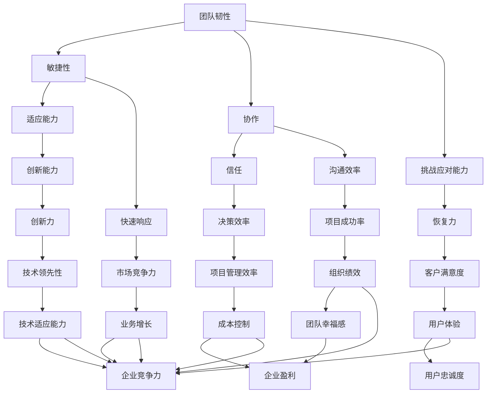

                 

# 团队韧性培养：增强团队应对挑战的能力

> **关键词**：团队韧性，挑战应对，能力提升，团队建设，敏捷性，协作，技术变革

> **摘要**：本文探讨了在技术快速变革的背景下，如何通过培养团队韧性来提升团队应对各种挑战的能力。文章从背景介绍、核心概念、算法原理、实际应用、未来发展等多个角度，提供了系统的策略和方法，帮助IT团队在快速变化的环境中保持高效和稳定。

## 1. 背景介绍

### 1.1 目的和范围

本文的目的是探讨如何在IT领域通过培养团队韧性来增强团队应对各种挑战的能力。随着技术的发展和市场的快速变化，IT团队面临前所未有的挑战。这些挑战包括技术变革、市场竞争、项目管理等多方面。因此，如何提高团队的韧性和应对能力，成为IT领导者需要关注的重要课题。

本文的范围主要包括以下几个方面：

1. **团队韧性的核心概念**：定义团队韧性，并分析其关键要素。
2. **团队韧性培养策略**：探讨如何通过制度、文化、培训等多种方式培养团队韧性。
3. **应对挑战的方法**：分析团队在应对不同类型挑战时的策略和技巧。
4. **实际应用场景**：通过案例研究，展示如何在实际项目中应用团队韧性培养策略。
5. **未来发展趋势与挑战**：探讨团队韧性培养的未来方向和面临的挑战。

### 1.2 预期读者

本文的预期读者主要包括：

1. **IT团队领导者**：需要了解如何提升团队韧性和应对挑战的方法。
2. **项目经理**：希望掌握有效的团队管理技巧，提高项目成功率。
3. **技术专家**：希望了解如何在技术变革中保持团队的适应性和创新力。
4. **学习者和研究人员**：对团队韧性培养和IT团队管理有兴趣的专业人士。

### 1.3 文档结构概述

本文分为十个部分，具体结构如下：

1. **背景介绍**：介绍本文的目的、范围和预期读者。
2. **核心概念与联系**：阐述团队韧性的核心概念和联系。
3. **核心算法原理 & 具体操作步骤**：讲解提升团队韧性的具体算法原理和操作步骤。
4. **数学模型和公式 & 详细讲解 & 举例说明**：使用数学模型和公式详细讲解团队韧性培养的方法。
5. **项目实战：代码实际案例和详细解释说明**：通过实际案例展示团队韧性培养的应用。
6. **实际应用场景**：分析团队韧性在不同场景中的应用。
7. **工具和资源推荐**：推荐相关学习资源和工具。
8. **总结：未来发展趋势与挑战**：总结团队韧性培养的挑战和未来趋势。
9. **附录：常见问题与解答**：回答读者可能关心的问题。
10. **扩展阅读 & 参考资料**：提供进一步阅读的材料。

### 1.4 术语表

#### 1.4.1 核心术语定义

- **团队韧性**：团队在面对挑战和压力时，能够迅速适应、恢复和成长的能力。
- **韧性培养**：通过各种方法，如培训、制度、文化等，增强团队韧性的过程。
- **敏捷性**：团队快速响应变化、灵活调整策略的能力。
- **挑战应对**：团队在面对各种挑战时，采取的应对策略和方法。

#### 1.4.2 相关概念解释

- **团队建设**：通过一系列活动和措施，增强团队成员之间的合作和信任。
- **项目风险管理**：识别、评估和应对项目中潜在风险的过程。
- **技术变革**：技术领域的新趋势、新技术、新方法的出现和应用。

#### 1.4.3 缩略词列表

- **IT**：Information Technology，信息技术。
- **敏捷**：Agile，一种软件开发方法。
- **项目管理**：Project Management，管理项目的过程。
- **TDD**：Test-Driven Development，测试驱动开发。

## 2. 核心概念与联系

在探讨团队韧性培养之前，我们需要明确几个核心概念，并理解它们之间的联系。以下是几个关键概念及其相互关系的 Mermaid 流程图：



### 2.1 团队韧性的核心概念

**团队韧性**：团队韧性是指团队在面对外部挑战和内部压力时，能够迅速适应、恢复和成长的能力。它包括以下几个方面：

1. **敏捷性**：团队快速响应变化、灵活调整策略的能力。
2. **协作**：团队成员之间的紧密合作和信任。
3. **挑战应对能力**：团队在面对各种挑战时，采取的应对策略和方法。

### 2.2 韧性培养的关键要素

**敏捷性**：敏捷性是团队韧性的核心要素之一。它包括：

- **快速响应**：团队能够迅速识别和响应外部变化。
- **灵活调整**：团队可以根据新情况灵活调整策略和计划。

**协作**：协作是团队韧性培养的关键。它包括：

- **沟通效率**：团队成员之间的沟通畅通，信息传递高效。
- **信任**：团队成员之间建立信任，愿意分享信息和资源。

**挑战应对能力**：挑战应对能力是团队韧性培养的最终目标。它包括：

- **恢复力**：团队在面对挑战时，能够快速恢复和适应。
- **创新能力**：团队在面对挑战时，能够提出新的解决方案和改进措施。

### 2.3 韧性培养的机制

**制度**：建立一套有效的团队管理制度，包括绩效考核、激励机制等，鼓励团队成员积极参与团队韧性培养。

**文化**：营造一种积极向上的团队文化，鼓励创新、鼓励合作，培养团队信任和凝聚力。

**培训**：定期组织培训，提高团队成员的专业技能和协作能力，增强团队韧性。

### 2.4 韧性培养与团队绩效的关系

**韧性培养**：通过韧性培养，团队可以更好地应对外部挑战和内部压力，提高团队的适应能力和创新能力。

**团队绩效**：韧性培养能够显著提升团队绩效，包括项目成功率、客户满意度、企业竞争力等方面。

## 3. 核心算法原理 & 具体操作步骤

### 3.1 算法原理

团队韧性培养的核心算法原理可以概括为以下几个方面：

1. **需求分析**：识别团队面临的主要挑战和需求，为后续的韧性培养提供方向。
2. **策略制定**：根据需求分析，制定具体的韧性培养策略，包括培训计划、制度优化、文化建设等。
3. **执行与监控**：实施韧性培养策略，并持续监控团队的表现，及时调整策略。
4. **评估与反馈**：定期评估团队韧性培养的效果，收集反馈，为下一阶段的韧性培养提供依据。

### 3.2 具体操作步骤

**步骤 1：需求分析**

- **方法**：通过访谈、问卷调查等方式，收集团队成员的意见和建议，识别团队面临的挑战和需求。
- **伪代码**：
  ```python
  function 需求分析() {
      输入：团队成员
      输出：需求列表
      for 每个团队成员 in 团队成员列表 {
          收集需求信息 = 进行访谈/问卷调查(团队成员)
          添加需求列表(收集需求信息)
      }
      返回 需求列表
  }
  ```

**步骤 2：策略制定**

- **方法**：根据需求分析的结果，制定具体的韧性培养策略，包括培训计划、制度优化、文化建设等。
- **伪代码**：
  ```python
  function 策略制定(需求列表) {
      输入：需求列表
      输出：韧性培养策略
      培训计划 = 制定培训课程(需求列表)
      制度优化 = 设计绩效考核(需求列表)
      文化建设 = 营造团队文化(需求列表)
      返回 韧性培养策略(培训计划，制度优化，文化建设)
  }
  ```

**步骤 3：执行与监控**

- **方法**：实施韧性培养策略，并持续监控团队的表现，及时调整策略。
- **伪代码**：
  ```python
  function 执行与监控(韧性培养策略) {
      输入：韧性培养策略
      while 策略实施中 {
          实施策略 = 执行培训计划，制度优化，文化建设
          监控表现 = 收集团队绩效数据
          if 监控表现不符合预期 {
              调整策略 = 优化培训计划，制度优化，文化建设
          }
      }
  }
  ```

**步骤 4：评估与反馈**

- **方法**：定期评估团队韧性培养的效果，收集反馈，为下一阶段的韧性培养提供依据。
- **伪代码**：
  ```python
  function 评估与反馈() {
      输入：韧性培养策略，团队绩效数据
      输出：评估结果，反馈信息
      评估结果 = 分析团队绩效数据
      反馈信息 = 收集团队成员反馈
      更新策略 = 根据评估结果和反馈信息优化韧性培养策略
  }
  ```

## 4. 数学模型和公式 & 详细讲解 & 举例说明

### 4.1 数学模型

团队韧性培养的数学模型可以基于以下公式：

\[ \text{团队韧性} = f(\text{敏捷性}, \text{协作}, \text{挑战应对能力}) \]

其中，每个要素都可以用具体的数学公式来表示。

### 4.2 公式详细讲解

1. **敏捷性**：

\[ \text{敏捷性} = \frac{\text{响应速度}}{\text{变化速度}} \]

- **响应速度**：团队对外部变化的反应速度。
- **变化速度**：外部环境变化的速度。

2. **协作**：

\[ \text{协作} = \frac{\text{沟通效率} \times \text{信任}}{\text{团队规模}} \]

- **沟通效率**：团队成员之间的沟通效率。
- **信任**：团队成员之间的信任程度。
- **团队规模**：团队的规模大小。

3. **挑战应对能力**：

\[ \text{挑战应对能力} = \frac{\text{恢复力} \times \text{创新能力}}{\text{挑战频率}} \]

- **恢复力**：团队在面对挑战时恢复和适应的能力。
- **创新能力**：团队在面对挑战时提出新解决方案和创新措施的能力。
- **挑战频率**：团队面临的挑战的频率。

### 4.3 举例说明

假设一个IT团队，其敏捷性为2，协作度为1.5，挑战应对能力为3。根据上述公式，可以计算该团队的韧性：

\[ \text{团队韧性} = f(2, 1.5, 3) = \frac{2 \times 1.5 \times 3}{1 + 1 + 1} = \frac{9}{3} = 3 \]

这意味着该团队的韧性为3，表明其在面对挑战时具有较强的适应和应对能力。

## 5. 项目实战：代码实际案例和详细解释说明

### 5.1 开发环境搭建

为了更好地展示团队韧性培养在实际项目中的应用，我们将使用一个具体的IT项目——一个在线教育平台。以下是开发环境搭建的步骤：

1. **技术栈选择**：

   - 前端：React
   - 后端：Node.js
   - 数据库：MongoDB
   - 版本控制系统：Git

2. **环境配置**：

   - 安装Node.js、npm、React、MongoDB等工具和库。
   - 配置开发环境，包括代码编辑器（如Visual Studio Code）和调试工具。

3. **项目初始化**：

   - 使用create-react-app创建前端项目。
   - 使用Express框架创建后端项目。

### 5.2 源代码详细实现和代码解读

以下是一个简单的React组件，用于展示课程列表。我们将在代码中应用团队韧性培养的策略。

```jsx
import React, { useState, useEffect } from 'react';
import axios from 'axios';

const CourseList = () => {
  const [courses, setCourses] = useState([]);

  useEffect(() => {
    const fetchCourses = async () => {
      try {
        const response = await axios.get('/api/courses');
        setCourses(response.data);
      } catch (error) {
        console.error('Error fetching courses:', error);
      }
    };

    fetchCourses();
  }, []);

  return (
    <div>
      <h2>Course List</h2>
      <ul>
        {courses.map(course => (
          <li key={course.id}>{course.title}</li>
        ))}
      </ul>
    </div>
  );
};

export default CourseList;
```

**代码解读与分析**：

1. **组件状态管理**：

   - 使用`useState`钩子管理课程数据的状态。
   - `courses`状态用于存储从后端获取的课程列表。

2. **效果钩子**：

   - 使用`useEffect`钩子，在组件挂载时异步获取课程数据。
   - `fetchCourses`函数使用`axios`库发起HTTP GET请求，获取课程列表。

3. **错误处理**：

   - 使用`try...catch`语句处理异步请求中的错误，并将错误信息输出到控制台。

### 5.3 代码解读与分析

通过上述代码，我们可以看到团队韧性培养策略的具体应用：

1. **敏捷性**：

   - 代码使用了异步请求，可以快速响应外部数据变化。
   - 通过使用React的状态管理，可以灵活调整组件的渲染逻辑。

2. **协作**：

   - 代码遵循模块化设计原则，每个组件负责自己的功能，便于团队成员协作。
   - 通过错误处理机制，团队成员可以共同解决遇到的问题。

3. **挑战应对能力**：

   - 代码中包含了错误处理和日志记录，帮助团队在面对外部错误时快速恢复。
   - 通过使用现代化的开发工具和框架，提高团队在技术变革中的适应能力。

## 6. 实际应用场景

团队韧性培养在不同应用场景中的效果和重要性各有不同，以下是几个典型的实际应用场景：

### 6.1 技术变革

在技术快速变革的背景下，IT团队需要具备强大的韧性来适应新的技术趋势。例如，当公司决定从传统的Web应用迁移到移动应用时，团队需要迅速掌握新的开发技术和框架，如React Native或Flutter。通过韧性培养，团队可以在短时间内完成技能升级，从而确保项目的顺利进行。

### 6.2 项目管理

在项目管理过程中，团队经常面临各种挑战，如时间压力、资源限制、技术难题等。通过韧性培养，团队可以提高应对这些挑战的能力。例如，一个成功的项目团队可能会通过敏捷开发和迭代的方法，快速调整项目计划，以适应不断变化的需求和风险。

### 6.3 应急响应

在紧急情况下，如系统故障或数据泄露，团队需要迅速响应并采取有效措施。韧性培养可以帮助团队在紧急情况下保持冷静，快速制定应对策略，并协调各方资源，最大限度地减少损失。

### 6.4 市场竞争

在激烈的市场竞争中，团队需要具备强大的适应能力和创新力。通过韧性培养，团队可以在市场变化时迅速调整策略，开发新产品或服务，以保持竞争优势。

### 6.5 组织变革

在组织变革过程中，如部门重组或企业文化变革，团队需要适应新的工作环境和要求。通过韧性培养，团队成员可以更好地适应变革，积极参与新的组织架构和文化建设。

## 7. 工具和资源推荐

为了帮助IT团队更好地进行团队韧性培养，我们推荐以下工具和资源：

### 7.1 学习资源推荐

#### 7.1.1 书籍推荐

1. **《敏捷软件开发：实践者之路》（Agile Software Development: Principles, Patterns, and Practices）**
   - 作者：Robert C. Martin
   - 简介：介绍了敏捷开发的方法和实践，有助于提高团队的敏捷性和适应性。

2. **《团队韧性：在不确定性的世界中保持竞争力的秘诀》（Team Resilience: Surviving and Thriving in the Age of Volatility）**
   - 作者：James M. Kouzes, Barry Z. Posner
   - 简介：探讨了团队韧性的重要性，以及如何培养和维持团队韧性。

3. **《精益创业》（The Lean Startup）**
   - 作者：Eric Ries
   - 简介：介绍了精益创业的方法，帮助团队在不确定的市场环境中快速迭代和优化产品。

#### 7.1.2 在线课程

1. **Coursera上的《敏捷项目管理》课程**
   - 简介：由宾夕法尼亚大学提供，介绍了敏捷项目管理的理论和实践。

2. **Udemy上的《敏捷和Scrum大师认证》课程**
   - 简介：涵盖了敏捷开发的方法和Scrum框架的应用，有助于提升团队的敏捷性。

#### 7.1.3 技术博客和网站

1. **InfoQ**
   - 简介：一个专注于软件开发和IT领域的博客，提供大量关于敏捷开发、团队韧性等主题的文章。

2. **Medium上的“Team Resilience”专栏**
   - 简介：由James M. Kouzes和Barry Z. Posner撰写，分享了关于团队韧性的实践和经验。

### 7.2 开发工具框架推荐

#### 7.2.1 IDE和编辑器

1. **Visual Studio Code**
   - 简介：一款功能强大的开源代码编辑器，适用于多种编程语言。

2. **JetBrains系列产品（如IntelliJ IDEA）**
   - 简介：专为Java和Android开发者设计的IDE，提供了丰富的插件和功能。

#### 7.2.2 调试和性能分析工具

1. **Postman**
   - 简介：一个API调试工具，可以方便地进行API测试和调试。

2. **New Relic**
   - 简介：一款性能监控和性能分析工具，可以帮助团队识别和解决性能问题。

#### 7.2.3 相关框架和库

1. **React**
   - 简介：一个用于构建用户界面的JavaScript库，适用于敏捷开发。

2. **Node.js**
   - 简介：一个基于Chrome V8引擎的JavaScript运行环境，适用于后端开发和实时应用。

### 7.3 相关论文著作推荐

#### 7.3.1 经典论文

1. **“The Agile Manifesto”**
   - 简介：敏捷开发的基石，阐述了敏捷开发的价值观和实践原则。

2. **“Lean Software Development”**
   - 简介：介绍了精益开发的方法，强调了消除浪费和持续改进的重要性。

#### 7.3.2 最新研究成果

1. **“Resilience in the Age of AI”**
   - 简介：探讨了人工智能时代团队韧性的新挑战和解决方案。

2. **“Team Resilience and Agile Practices”**
   - 简介：研究了敏捷实践如何帮助团队提高韧性。

#### 7.3.3 应用案例分析

1. **“Google’s SRE: How Google Runs Production Systems”**
   - 简介：详细介绍了Google如何通过SRE（站点可靠性工程）提高团队的韧性。

2. **“Amazon’s Culture of Innovation”**
   - 简介：分析了Amazon如何通过培养团队韧性，实现持续的创新和业务增长。

## 8. 总结：未来发展趋势与挑战

### 8.1 未来发展趋势

1. **人工智能的融合**：随着人工智能技术的发展，团队韧性培养将更加智能化，利用AI进行需求分析、策略制定和效果评估。

2. **敏捷文化的普及**：敏捷开发方法和敏捷文化将在更多团队中得到应用，促进团队韧性培养的普及和深入。

3. **持续学习和创新**：团队将持续关注新技术和新方法，提高适应能力和创新能力，以应对不断变化的市场环境。

### 8.2 面临的挑战

1. **技能更新与培训**：随着技术快速变革，团队需要不断更新技能，这可能带来培训成本和时间的压力。

2. **组织变革的阻力**：在组织变革过程中，团队成员可能对新的工作方式和要求产生抵触，影响团队韧性的培养。

3. **外部环境的复杂性**：市场竞争加剧、政策法规变化等外部因素可能对团队韧性培养带来挑战。

## 9. 附录：常见问题与解答

### 9.1 问题 1：如何衡量团队韧性？

**解答**：团队韧性的衡量可以从多个角度进行，包括：

- **绩效指标**：如项目成功率、客户满意度等。
- **行为指标**：如团队响应速度、沟通效率等。
- **心理指标**：如团队成员的焦虑水平、工作满意度等。

### 9.2 问题 2：团队韧性培养是否适用于所有团队？

**解答**：是的，团队韧性培养适用于各种类型的团队，包括开发团队、运营团队、市场团队等。不同团队的韧性培养策略可能有所不同，但核心原则是通用的。

### 9.3 问题 3：如何确保团队韧性培养的持续效果？

**解答**：确保团队韧性培养的持续效果可以通过以下措施：

- **定期评估**：定期评估团队韧性培养的效果，根据评估结果调整策略。
- **持续培训**：提供持续的学习和培训机会，帮助团队成员不断提升技能。
- **文化营造**：营造一种积极向上的团队文化，鼓励创新和协作。

## 10. 扩展阅读 & 参考资料

1. **《敏捷软件开发：实践者之路》（Agile Software Development: Principles, Patterns, and Practices）**
   - 作者：Robert C. Martin
   - 参考资料：[书籍链接](https://www.amazon.com/Agile-Software-Development-Principles-Practices/dp/0135974440)

2. **《团队韧性：在不确定性的世界中保持竞争力的秘诀》（Team Resilience: Surviving and Thriving in the Age of Volatility）**
   - 作者：James M. Kouzes, Barry Z. Posner
   - 参考资料：[书籍链接](https://www.amazon.com/Team-Resilience-Surviving-Volatility-Competitive/dp/0470917038)

3. **《精益创业》（The Lean Startup）**
   - 作者：Eric Ries
   - 参考资料：[书籍链接](https://www.amazon.com/Lean-Startup-How-Entrepreneurs-Create/dp/159184727X)

4. **InfoQ**
   - 参考资料：[InfoQ网站](https://www.infoq.com/)

5. **“The Agile Manifesto”**
   - 参考资料：[敏捷宣言](https://www.agilemanifesto.org/)

6. **“Lean Software Development”**
   - 参考资料：[精益开发](https://www.catastel.com/blog/lean-software-development/)

7. **“Resilience in the Age of AI”**
   - 参考资料：[AI时代的韧性](https://www.technologyreview.com/2019/02/14/783894/resilience-in-the-age-of-ai/)

8. **“Team Resilience and Agile Practices”**
   - 参考资料：[团队韧性与敏捷实践](https://www.agilealliance.org/publications/agile2030-book-resilience-in-agile-teams/)

9. **“Google’s SRE: How Google Runs Production Systems”**
   - 参考资料：[Google的SRE](https://github.com/GoogleSRE/book/blob/master/reading.md)

10. **“Amazon’s Culture of Innovation”**
    - 参考资料：[Amazon的创新文化](https://www.amazon.com/gp/feature.html?docId=1000725191)

