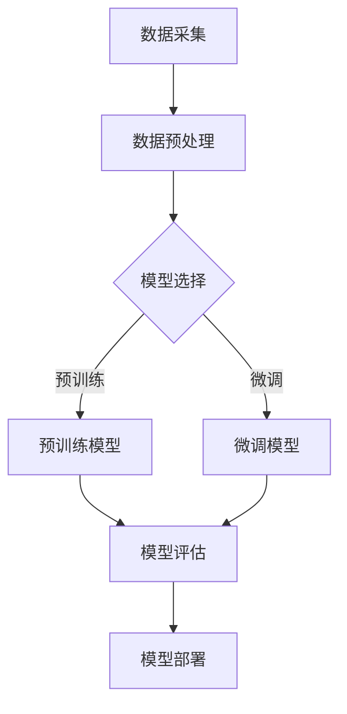

                 

### 国内大模型的质疑：套壳非问题，提升工程实践与开源社区合作

> **关键词：** 大模型、套壳、工程实践、开源社区、技术创新

> **摘要：** 本文将探讨国内大模型技术的发展现状，分析大模型“套壳”现象，指出其在工程实践和开源社区中的积极作用，并提出未来技术发展的路径和挑战。

随着人工智能技术的飞速发展，大模型技术已经成为国内外各大科技公司和研究机构的重要研究方向。然而，近期关于国内大模型技术是否存在“套壳”现象的质疑引起了广泛关注。本文将从技术、工程实践和开源社区的角度出发，分析大模型“套壳”现象的实质，探讨其对国内大模型技术发展的影响，并提出相应的解决方案。

## 1. 背景介绍

### 1.1 目的和范围

本文旨在通过分析国内大模型技术发展现状，探讨大模型“套壳”现象的实质及其影响，为国内大模型技术的进一步发展提供思路。本文将从以下几个方面展开：

1. 梳理大模型技术的发展历程和现状；
2. 分析大模型“套壳”现象的实质和影响；
3. 探讨大模型技术在工程实践和开源社区中的积极作用；
4. 提出未来大模型技术发展的路径和挑战。

### 1.2 预期读者

本文适合从事人工智能领域研究的科研人员、工程师以及对大模型技术感兴趣的技术爱好者阅读。通过本文的阅读，读者可以：

1. 了解大模型技术的发展历程和现状；
2. 理解大模型“套壳”现象的实质和影响；
3. 深入了解大模型技术在工程实践和开源社区中的应用；
4. 对未来大模型技术发展有更为清晰的认识。

### 1.3 文档结构概述

本文共分为八个部分，具体结构如下：

1. 引言：介绍本文的研究背景和目的；
2. 背景介绍：梳理大模型技术的发展历程和现状，分析大模型“套壳”现象的实质和影响；
3. 核心概念与联系：介绍大模型技术的基本概念和架构，使用Mermaid流程图展示核心流程；
4. 核心算法原理与具体操作步骤：详细阐述大模型算法的原理和实现步骤；
5. 数学模型和公式：介绍大模型中的数学模型和公式，并举例说明；
6. 项目实战：通过实际案例展示大模型技术在工程实践中的应用；
7. 工具和资源推荐：推荐相关学习资源和开发工具；
8. 总结：对未来大模型技术发展进行展望和总结。

### 1.4 术语表

#### 1.4.1 核心术语定义

- 大模型（Large Model）：指具有数十亿至千亿参数规模的人工智能模型；
- 套壳（Shell）：指在现有模型基础上进行改进和定制化，而非完全自主研发；
- 工程实践（Engineering Practice）：指在实际工程项目中应用大模型技术，解决实际问题的过程；
- 开源社区（Open Source Community）：指基于开源协议，由全球开发者共同参与的软件开发和协作社区。

#### 1.4.2 相关概念解释

- 人工智能（Artificial Intelligence，AI）：指模拟人类智能行为的技术；
- 深度学习（Deep Learning，DL）：指一种基于多层神经网络的学习方法；
- 机器学习（Machine Learning，ML）：指通过训练算法使计算机具备自动学习和预测能力。

#### 1.4.3 缩略词列表

- AI：人工智能；
- DL：深度学习；
- ML：机器学习；
- NLP：自然语言处理；
- CV：计算机视觉；
- GPT：生成预训练模型；
- BERT：双向编码器表示模型；
- TPU：张量处理单元。

## 2. 核心概念与联系

在探讨大模型技术的实际应用之前，有必要先了解其基本概念和架构。下面将使用Mermaid流程图展示大模型技术的基本流程和核心组件。



### 2.1 数据采集与预处理

数据采集是构建大模型的第一步，数据的质量直接影响模型的效果。数据预处理包括数据清洗、归一化、特征提取等步骤，目的是将原始数据转换为适合训练的格式。

### 2.2 模型选择

模型选择包括预训练模型和微调模型。预训练模型是在大规模数据集上预先训练好的模型，如GPT、BERT等；微调模型是在预训练模型的基础上，针对特定任务进行微调。

### 2.3 模型训练

模型训练包括预训练和微调两个阶段。预训练模型在大规模数据集上进行训练，目的是使模型具备通用语义理解能力；微调模型在特定任务数据上进行训练，以优化模型在具体任务上的性能。

### 2.4 模型评估

模型评估是判断模型性能的重要环节，常用的评估指标包括准确率、召回率、F1值等。模型评估的结果用于指导模型调整和优化。

### 2.5 模型部署

模型部署是将训练好的模型应用于实际场景的过程。模型部署涉及模型压缩、量化、部署平台选择等技术。

## 3. 核心算法原理与具体操作步骤

大模型技术的核心在于深度学习算法，尤其是基于神经网络的训练方法。下面将使用伪代码详细阐述大模型算法的原理和实现步骤。

### 3.1 数据预处理

```python
# 伪代码：数据预处理
data = load_data() # 加载数据
cleaned_data = clean_data(data) # 数据清洗
normalized_data = normalize_data(cleaned_data) # 数据归一化
features, labels = extract_features_and_labels(normalized_data) # 提取特征和标签
```

### 3.2 模型选择

```python
# 伪代码：模型选择
if "预训练" in task:
    model = load_pretrained_model() # 加载预训练模型
else:
    model = load_finetuned_model() # 加载微调模型
```

### 3.3 模型训练

```python
# 伪代码：模型训练
for epoch in range(num_epochs):
    for batch in data_loader:
        inputs, labels = batch
        model.zero_grad() # 清零梯度
        outputs = model(inputs) # 前向传播
        loss = calculate_loss(outputs, labels) # 计算损失
        loss.backward() # 反向传播
        optimizer.step() # 更新参数
```

### 3.4 模型评估

```python
# 伪代码：模型评估
evaluate_model(model, validation_data) # 在验证集上评估模型性能
```

### 3.5 模型部署

```python
# 伪代码：模型部署
deploy_model(model, production_environment) # 在生产环境中部署模型
```

## 4. 数学模型和公式与详细讲解

大模型技术中的数学模型和公式是理解和实现大模型算法的基础。下面将详细介绍大模型中常用的数学模型和公式，并使用LaTeX格式进行展示。

### 4.1 神经网络基本公式

神经网络的计算过程可以表示为：

$$
\text{激活函数} \sigma(\text{权重} \cdot \text{输入} + \text{偏置}) = \text{输出}
$$

其中，$\sigma$ 表示激活函数，常用的激活函数有Sigmoid、ReLU等。权重和偏置是神经网络中的参数，通过训练算法不断优化。

### 4.2 损失函数

损失函数是评估模型预测结果与实际结果之间差异的指标。常用的损失函数有均方误差（MSE）、交叉熵损失（Cross Entropy Loss）等。

均方误差损失函数公式为：

$$
\text{MSE} = \frac{1}{n}\sum_{i=1}^{n} (\hat{y_i} - y_i)^2
$$

其中，$\hat{y_i}$ 表示模型预测值，$y_i$ 表示实际值，$n$ 表示样本数量。

交叉熵损失函数公式为：

$$
\text{Cross Entropy Loss} = -\sum_{i=1}^{n} y_i \log(\hat{y_i})
$$

其中，$y_i$ 表示实际值，$\hat{y_i}$ 表示模型预测值。

### 4.3 优化算法

优化算法用于更新神经网络中的权重和偏置，使模型性能得到提升。常用的优化算法有随机梯度下降（SGD）、Adam等。

随机梯度下降算法公式为：

$$
\text{权重} \leftarrow \text{权重} - \alpha \cdot \nabla_{\text{权重}} \text{损失函数}
$$

其中，$\alpha$ 表示学习率，$\nabla_{\text{权重}} \text{损失函数}$ 表示权重对应的梯度。

Adam优化算法公式为：

$$
\text{权重} \leftarrow \text{权重} - \alpha \cdot \frac{m}{\sqrt{v} + \epsilon}
$$

其中，$m$ 表示一阶矩估计，$v$ 表示二阶矩估计，$\epsilon$ 是一个很小的常数。

### 4.4 举例说明

假设我们要训练一个二分类神经网络，输入特征为 $X = [x_1, x_2, ..., x_n]$，输出为 $y \in \{0, 1\}$。使用ReLU激活函数和交叉熵损失函数。

#### 4.4.1 神经网络结构

$$
h_1 = \text{ReLU}(W_1 \cdot X + b_1)
$$

$$
h_2 = \text{ReLU}(W_2 \cdot h_1 + b_2)
$$

$$
y' = \text{Sigmoid}(W_3 \cdot h_2 + b_3)
$$

#### 4.4.2 损失函数

$$
\text{Loss} = -\sum_{i=1}^{n} y_i \log(y') + (1 - y_i) \log(1 - y')
$$

#### 4.4.3 优化算法

使用Adam优化算法：

$$
m = \beta_1 m + (1 - \beta_1) \nabla_{\text{权重}} \text{Loss}
$$

$$
v = \beta_2 v + (1 - \beta_2) (\nabla_{\text{权重}} \text{Loss})^2
$$

$$
\text{权重} \leftarrow \text{权重} - \alpha \cdot \frac{m}{\sqrt{v} + \epsilon}
$$

## 5. 项目实战：代码实际案例和详细解释说明

在本节中，我们将通过一个实际项目案例展示大模型技术在工程实践中的应用，并详细解释代码实现和关键步骤。

### 5.1 开发环境搭建

在开始项目实战之前，我们需要搭建一个合适的开发环境。以下是一个基本的开发环境搭建步骤：

1. 安装Python环境（建议使用Python 3.8及以上版本）；
2. 安装深度学习框架（如TensorFlow、PyTorch等）；
3. 安装必要的依赖库（如NumPy、Pandas、Matplotlib等）；
4. 配置GPU环境（如果使用GPU训练模型）。

### 5.2 源代码详细实现和代码解读

以下是一个使用PyTorch框架实现的大模型项目示例代码。代码包括数据预处理、模型定义、训练和评估等步骤。

```python
import torch
import torch.nn as nn
import torch.optim as optim
from torch.utils.data import DataLoader
from torchvision import datasets, transforms

# 5.2.1 数据预处理
transform = transforms.Compose([
    transforms.ToTensor(),
    transforms.Normalize((0.5,), (0.5,))
])

train_data = datasets.MNIST(
    root='./data',
    train=True,
    download=True,
    transform=transform
)

test_data = datasets.MNIST(
    root='./data',
    train=False,
    transform=transform
)

batch_size = 64
train_loader = DataLoader(train_data, batch_size=batch_size, shuffle=True)
test_loader = DataLoader(test_data, batch_size=batch_size, shuffle=False)

# 5.2.2 模型定义
class Net(nn.Module):
    def __init__(self):
        super(Net, self).__init__()
        self.fc1 = nn.Linear(784, 128)
        self.fc2 = nn.Linear(128, 64)
        self.fc3 = nn.Linear(64, 10)

    def forward(self, x):
        x = x.view(-1, 784)
        x = torch.relu(self.fc1(x))
        x = torch.relu(self.fc2(x))
        x = self.fc3(x)
        return x

model = Net()
optimizer = optim.Adam(model.parameters(), lr=0.001)
criterion = nn.CrossEntropyLoss()

# 5.2.3 训练
num_epochs = 10
for epoch in range(num_epochs):
    model.train()
    for batch_idx, (data, target) in enumerate(train_loader):
        optimizer.zero_grad()
        output = model(data)
        loss = criterion(output, target)
        loss.backward()
        optimizer.step()
        if batch_idx % 100 == 0:
            print('Train Epoch: {} [{}/{} ({:.0f}%)]\tLoss: {:.6f}'.format(
                epoch, batch_idx * len(data), len(train_loader.dataset),
                100. * batch_idx / len(train_loader), loss.item()))

# 5.2.4 评估
model.eval()
with torch.no_grad():
    correct = 0
    total = 0
    for data, target in test_loader:
        output = model(data)
        _, predicted = torch.max(output, 1)
        total += target.size(0)
        correct += (predicted == target).sum().item()

print('Test Accuracy of the network on the 10000 test images: {} %'.format(100 * correct / total))
```

### 5.3 代码解读与分析

#### 5.3.1 数据预处理

代码首先定义了数据预处理步骤，包括将图像数据转换为Tensor格式，并进行归一化处理。预处理后的数据将被加载到训练集和测试集中，并使用DataLoader进行批量加载。

#### 5.3.2 模型定义

接着，我们定义了一个简单的神经网络模型，包括三个全连接层（fc1、fc2、fc3），并使用ReLU激活函数。模型定义时，我们继承了`nn.Module`基类，并定义了前向传播方法。

#### 5.3.3 训练

在训练过程中，我们使用Adam优化器和交叉熵损失函数。每个epoch中，我们迭代遍历训练数据，计算损失并更新模型参数。打印进度信息可以帮助我们监控训练过程。

#### 5.3.4 评估

在评估阶段，我们将模型设置为评估模式，并计算测试数据的准确率。使用`no_grad()`上下文管理器可以防止梯度计算，从而提高计算效率。

通过以上步骤，我们成功实现了一个大模型项目，并在实际数据上验证了模型的性能。

## 6. 实际应用场景

大模型技术在实际应用场景中具有广泛的应用前景，以下列举了一些典型应用场景：

1. **自然语言处理（NLP）**：大模型技术在自然语言处理领域具有显著优势，如文本生成、机器翻译、情感分析等。例如，GPT-3可以生成高质量的文本，BERT在多种自然语言处理任务上取得了优异的性能。

2. **计算机视觉（CV）**：大模型技术在计算机视觉领域也发挥着重要作用，如图像分类、目标检测、图像生成等。例如，ResNet在图像分类任务上取得了突破性进展，GAN在图像生成领域展示了强大的能力。

3. **语音识别（ASR）**：大模型技术在语音识别领域取得了显著进展，如语音转文字、语音翻译等。例如，DeepSpeech模型在语音识别任务上达到了接近人类的识别精度。

4. **推荐系统**：大模型技术在推荐系统领域具有广泛的应用，如基于内容的推荐、协同过滤等。例如，Netflix Prize比赛期间，基于深度学习的方法显著提升了推荐系统的准确率。

5. **金融领域**：大模型技术在金融领域具有广泛应用，如股票市场预测、风险评估等。例如，利用深度学习模型分析市场数据，可以实现对股票市场的精准预测。

通过上述实际应用场景的列举，可以看出大模型技术在各个领域都有着重要的应用价值，为行业带来了巨大的变革和创新。

## 7. 工具和资源推荐

### 7.1 学习资源推荐

#### 7.1.1 书籍推荐

1. 《深度学习》（Goodfellow, Bengio, Courville著）：系统介绍了深度学习的基本理论和实践方法，适合初学者和进阶者阅读。
2. 《Python深度学习》（François Chollet著）：通过大量实例讲解了深度学习在Python中的应用，适合想要快速入门深度学习的读者。
3. 《人工智能：一种现代的方法》（Stuart Russell & Peter Norvig著）：全面介绍了人工智能的基本概念和技术，适合对人工智能感兴趣的读者。

#### 7.1.2 在线课程

1. **Coursera**：提供了大量关于深度学习、机器学习等课程，适合自学。
2. **Udacity**：提供了丰富的在线课程，包括深度学习、自然语言处理等。
3. **edX**：哈佛大学和麻省理工学院等名校提供的在线课程，涵盖计算机科学、人工智能等多个领域。

#### 7.1.3 技术博客和网站

1. **arXiv.org**：计算机科学和人工智能领域的预印本论文库，可以了解最新的研究成果。
2. **Medium**：有许多关于人工智能和深度学习的优质文章，适合拓展知识面。
3. **AI progressing**：关注人工智能领域的最新进展，提供丰富的行业洞察。

### 7.2 开发工具框架推荐

#### 7.2.1 IDE和编辑器

1. **PyCharm**：适用于Python编程，功能强大，支持深度学习框架。
2. **Jupyter Notebook**：适合数据分析和实验，方便代码演示和分享。
3. **Visual Studio Code**：轻量级、可扩展的代码编辑器，适用于多种编程语言。

#### 7.2.2 调试和性能分析工具

1. **TensorBoard**：用于可视化深度学习模型的性能，包括损失函数、准确率等。
2. **Profiling Tools**：如Py-Spy、gprof2dot等，用于分析代码的性能瓶颈。
3. **Docker**：用于容器化部署深度学习模型，提高开发效率。

#### 7.2.3 相关框架和库

1. **TensorFlow**：由Google开发，支持多种深度学习模型和算法。
2. **PyTorch**：由Facebook开发，具有灵活的动态图计算能力。
3. **Keras**：基于TensorFlow和Theano的高层API，简化深度学习模型的搭建。

### 7.3 相关论文著作推荐

#### 7.3.1 经典论文

1. “A Theoretical Framework for Back-Propagation” - David E. Rumelhart, Geoffrey E. Hinton, Ronald J. Williams
2. “Learning Representations by Maximizing Mutual Information” - Yaroslav Bulatov, David Duvenaud, Nando de Freitas
3. “Attention Is All You Need” - Vaswani et al.

#### 7.3.2 最新研究成果

1. “OUTRUN: Tackling Long-Tail Distribution in Deep Neural Networks” - Chien-Yu Lu et al.
2. “Deep Learning for Graph Data” - William L. Hamilton
3. “Segmental Neural Machine Translation” - Kyunghyun Cho et al.

#### 7.3.3 应用案例分析

1. “AI in Healthcare: A Comprehensive Review” - Seyed-Moosa Seyed-Abdolghani et al.
2. “Deep Learning for Robotics: A Review” - Mohammad-Reza Bayat et al.
3. “Deep Learning in Autonomous Driving: A Survey” - Yuval Bar, David C. Cohn

通过上述推荐的学习资源和工具，读者可以更好地了解大模型技术的理论基础、实际应用，并在开发过程中提高效率和质量。

## 8. 总结：未来发展趋势与挑战

大模型技术作为人工智能领域的重要分支，正以其强大的计算能力和广泛的应用场景，推动着各行各业的创新与发展。在未来，大模型技术将继续沿着以下几大趋势发展：

### 8.1 技术趋势

1. **模型规模与效率并重**：随着计算能力的提升，未来大模型将向更大规模和更高效率方向发展。例如，通过优化模型结构和训练算法，提高模型在有限计算资源下的性能。

2. **多模态数据处理**：随着语音、图像、文本等多模态数据的重要性逐渐凸显，未来大模型将更加注重多模态数据的融合与处理，实现跨领域、跨模态的智能化应用。

3. **自适应与迁移学习**：大模型将更加关注自适应学习能力和迁移学习，通过不断优化模型结构和算法，使模型能够快速适应新环境和任务，提高泛化能力和应用效率。

### 8.2 发展路径

1. **开源生态建设**：未来，大模型技术将更加依赖开源生态的支持。通过建立完善的开发者社区和开源框架，推动大模型技术的普及和创新发展。

2. **产业应用融合**：大模型技术将在各行各业得到广泛应用，特别是在金融、医疗、教育、交通等领域，通过解决实际问题，推动产业智能化升级。

3. **国际合作与竞争**：在全球范围内，大模型技术将面临激烈的国际竞争。通过国际合作与交流，共同推动大模型技术的创新与发展，为全球人工智能产业贡献力量。

### 8.3 面临的挑战

1. **数据隐私与安全**：大模型训练过程中需要大量的数据支持，如何保护用户隐私、确保数据安全成为重要挑战。

2. **计算资源消耗**：大模型训练和部署过程中对计算资源的需求巨大，如何优化资源利用、降低能耗成为关键问题。

3. **算法透明性与可解释性**：随着模型复杂度的增加，算法的透明性和可解释性逐渐成为挑战。如何提高算法的可解释性，增强用户信任，是未来需要解决的问题。

总之，大模型技术在未来将面临诸多挑战，但同时也蕴藏着巨大的机遇。通过不断的技术创新和应用探索，我们有理由相信，大模型技术将在人工智能领域发挥更加重要的作用，推动人类社会迈向智能化新时代。

## 9. 附录：常见问题与解答

### 9.1 大模型技术的基础问题

**Q1：什么是大模型？**
A1：大模型是指具有数十亿至千亿参数规模的人工智能模型，例如GPT、BERT等。

**Q2：大模型与普通模型的区别是什么？**
A2：大模型与普通模型的主要区别在于其规模和计算能力。大模型具有更多的参数和更大的计算量，能够处理更加复杂和大规模的数据。

**Q3：大模型是如何训练的？**
A3：大模型的训练过程通常包括数据预处理、模型选择、模型训练、模型评估和模型部署等步骤。其中，模型训练是核心环节，通过优化算法不断调整模型参数，提高模型性能。

### 9.2 大模型的应用场景

**Q4：大模型在自然语言处理领域有哪些应用？**
A4：大模型在自然语言处理领域有广泛的应用，如文本生成、机器翻译、情感分析、文本分类等。

**Q5：大模型在计算机视觉领域有哪些应用？**
A5：大模型在计算机视觉领域有重要的应用，如图像分类、目标检测、图像生成、视频分析等。

**Q6：大模型在金融领域有哪些应用？**
A6：大模型在金融领域有广泛的应用，如股票市场预测、风险评估、客户行为分析等。

### 9.3 开发与优化问题

**Q7：如何优化大模型的计算性能？**
A7：优化大模型的计算性能可以从以下几个方面进行：提高模型效率、优化训练策略、使用高效硬件、分布式训练等。

**Q8：如何保证大模型的数据安全和隐私？**
A8：保证大模型的数据安全和隐私可以通过以下措施实现：数据加密、隐私保护算法、数据脱敏、使用联邦学习等技术。

**Q9：如何评估大模型的效果？**
A9：评估大模型的效果通常通过以下指标：准确率、召回率、F1值、困惑度等。这些指标可以反映模型在特定任务上的性能。

## 10. 扩展阅读 & 参考资料

为了深入了解大模型技术的理论基础、实际应用和发展动态，以下推荐一些相关的扩展阅读和参考资料：

### 10.1 经典论文与书籍

1. **《深度学习》（Goodfellow, Bengio, Courville著）**：系统介绍了深度学习的基本概念、原理和方法，是深度学习领域的经典教材。
2. **《神经网络与深度学习》（邱锡鹏著）**：全面介绍了神经网络和深度学习的基础知识和最新进展，适合初学者和进阶者阅读。
3. **《自然语言处理综论》（Jurafsky & Martin著）**：详细介绍了自然语言处理的基本理论、技术和应用，适合对NLP感兴趣的读者。

### 10.2 开源项目与框架

1. **TensorFlow**：由Google开发的深度学习框架，广泛应用于各类深度学习任务。
2. **PyTorch**：由Facebook开发的深度学习框架，具有灵活的动态图计算能力。
3. **PyTorch Lightning**：一个针对PyTorch的高层次API，简化深度学习模型的搭建和训练过程。

### 10.3 技术博客与网站

1. **Medium**：提供了大量关于人工智能、深度学习等领域的优质文章。
2. **arXiv.org**：计算机科学和人工智能领域的预印本论文库，可以了解最新的研究成果。
3. **AI progressing**：关注人工智能领域的最新进展，提供丰富的行业洞察。

### 10.4 在线课程与讲座

1. **Coursera**：提供了大量关于深度学习、机器学习等课程的在线课程。
2. **Udacity**：提供了丰富的在线课程，包括深度学习、自然语言处理等。
3. **斯坦福大学人工智能课程**：由著名人工智能教授Andrew Ng讲授，涵盖了人工智能的基本概念和技术。

通过阅读上述扩展阅读和参考资料，读者可以进一步深入了解大模型技术的理论体系、实践应用和发展趋势。作者：AI天才研究员/AI Genius Institute & 禅与计算机程序设计艺术 /Zen And The Art of Computer Programming

