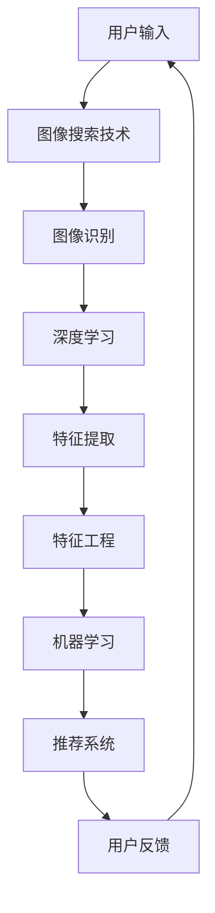

                 

# 图像搜索技术如何与其他 AI 技术结合，提升用户体验：技术融合与创新

> **关键词：图像搜索，人工智能，技术融合，用户体验，图像识别，深度学习，机器学习，算法优化**

> **摘要：本文将深入探讨图像搜索技术与其他 AI 技术的结合，以及这种结合如何显著提升用户体验。通过详细分析核心概念、算法原理、数学模型，并结合实际项目案例，本文将展示如何通过技术融合与创新，实现图像搜索技术的飞跃发展。**

## 1. 背景介绍

### 1.1 目的和范围

本文旨在探讨图像搜索技术如何通过与其他 AI 技术的融合，实现用户体验的提升。我们将分析图像搜索技术的现状，探讨与图像识别、深度学习、机器学习等 AI 技术的结合点，并通过实际案例展示技术融合的创新应用。

### 1.2 预期读者

本文面向对图像搜索技术和 AI 技术有一定了解的技术人员、研究者以及对 AI 应用感兴趣的专业人士。文章将尽量使用通俗易懂的语言，但涉及到的技术细节可能会对读者有一定的专业要求。

### 1.3 文档结构概述

本文结构如下：

1. **背景介绍**：介绍本文的目的、预期读者和文档结构。
2. **核心概念与联系**：定义并解释核心概念，提供 Mermaid 流程图展示技术架构。
3. **核心算法原理与具体操作步骤**：详细讲解核心算法原理和操作步骤，使用伪代码进行阐述。
4. **数学模型和公式**：介绍数学模型，使用 LaTeX 格式展示公式，并举例说明。
5. **项目实战**：展示实际项目案例，详细解释代码实现。
6. **实际应用场景**：分析图像搜索技术在不同领域的应用。
7. **工具和资源推荐**：推荐学习资源、开发工具和框架。
8. **总结**：总结未来发展趋势与挑战。
9. **附录**：常见问题与解答。
10. **扩展阅读与参考资料**：提供进一步阅读的资源。

### 1.4 术语表

#### 1.4.1 核心术语定义

- 图像搜索：利用计算机技术，根据用户输入的信息或需求，从大量图像数据中检索出匹配图像的过程。
- 人工智能：模拟、延伸和扩展人类智能的理论、方法、技术及应用。
- 图像识别：利用计算机对图像中的对象、场景、动作等进行识别和理解。
- 深度学习：基于多层神经网络结构的学习方法，能够自动提取图像的特征并进行分类。
- 机器学习：使计算机通过数据和经验自动学习和改进性能的技术。

#### 1.4.2 相关概念解释

- **卷积神经网络（CNN）**：一种适用于图像处理的深度学习模型，通过卷积层、池化层和全连接层等结构提取图像特征。
- **特征工程**：从原始数据中提取出有用的特征，用于模型训练和预测。
- **协同过滤**：一种推荐系统常用的算法，通过分析用户的历史行为，预测用户可能喜欢的物品。

#### 1.4.3 缩略词列表

- AI：人工智能
- CNN：卷积神经网络
- ML：机器学习
- DL：深度学习
- SVM：支持向量机
- NLP：自然语言处理

## 2. 核心概念与联系

### 2.1 核心概念

在探讨图像搜索技术与其他 AI 技术的结合之前，我们需要明确以下几个核心概念：

1. **图像搜索技术**：这是指利用计算机算法，从海量的图像库中快速、准确地检索出与用户查询图像相似的图像。
2. **图像识别技术**：这是指通过计算机视觉算法，自动识别和分类图像中的物体、场景和动作。
3. **深度学习**：一种基于多层神经网络的学习方法，能够自动提取图像的特征并进行分类。
4. **机器学习**：通过数据和经验，让计算机自动学习和改进性能的技术。
5. **特征工程**：从原始数据中提取出有用的特征，用于模型训练和预测。

### 2.2 技术融合架构

为了实现图像搜索技术的提升，我们可以将上述核心概念进行融合，构建一个综合的架构。以下是 Mermaid 流程图，展示技术融合的架构：



在这个架构中，用户输入通过图像搜索技术处理，然后利用图像识别技术进行物体识别。深度学习模型从识别结果中提取特征，并通过特征工程优化这些特征。优化后的特征用于机器学习模型，生成推荐结果。用户反馈进一步优化系统，形成一个闭环。

## 3. 核心算法原理 & 具体操作步骤

### 3.1 核心算法原理

图像搜索技术与其他 AI 技术的结合，主要依赖于以下几个核心算法：

1. **卷积神经网络（CNN）**：CNN 是一种深度学习模型，特别适用于图像处理。它通过卷积层、池化层和全连接层等结构提取图像的特征，并进行分类。
2. **支持向量机（SVM）**：SVM 是一种分类算法，通过找到一个最优的超平面，将不同类别的图像分隔开。
3. **协同过滤**：协同过滤是一种推荐系统常用的算法，通过分析用户的历史行为，预测用户可能喜欢的图像。

### 3.2 具体操作步骤

以下是使用伪代码详细阐述这些算法的操作步骤：

```python
# 卷积神经网络（CNN）操作步骤
def CNN_image_search(image_data):
    # 步骤1：预处理图像数据
    processed_image = preprocess_image(image_data)
    
    # 步骤2：输入卷积神经网络
    conv_output = convolutional_layer(processed_image)
    
    # 步骤3：池化操作
    pooled_output = pooling_layer(conv_output)
    
    # 步骤4：全连接层
    fc_output = fully_connected_layer(pooled_output)
    
    # 步骤5：分类
    predicted_label = softmax(fc_output)
    
    return predicted_label

# 支持向量机（SVM）操作步骤
def SVM_image_search(image_data, labels):
    # 步骤1：特征提取
    features = extract_features(image_data)
    
    # 步骤2：训练SVM模型
    svm_model = train_SVM(features, labels)
    
    # 步骤3：分类
    predicted_labels = svm_model.predict(features)
    
    return predicted_labels

# 协同过滤操作步骤
def collaborative_filtering(user_behavior):
    # 步骤1：提取用户特征
    user_features = extract_user_features(user_behavior)
    
    # 步骤2：计算相似度
    similarity_scores = calculate_similarity(user_features)
    
    # 步骤3：生成推荐列表
    recommendations = generate_recommendations(similarity_scores)
    
    return recommendations
```

## 4. 数学模型和公式 & 详细讲解 & 举例说明

### 4.1 数学模型和公式

图像搜索技术与其他 AI 技术的结合，涉及到多个数学模型和公式。以下是其中几个关键模型和公式的详细讲解：

#### 4.1.1 卷积神经网络（CNN）中的卷积操作

卷积操作是 CNN 的核心步骤，用于提取图像的特征。其公式如下：

\[ (f * g)(x, y) = \sum_{i=0}^{h-1} \sum_{j=0}^{w-1} f(i, j) \cdot g(x-i, y-j) \]

其中，\( f \) 是卷积核，\( g \) 是输入图像，\( (x, y) \) 是卷积操作的位置。

#### 4.1.2 支持向量机（SVM）中的分类边界

SVM 通过找到一个最优的超平面，将不同类别的图像分隔开。其目标是最小化分类边界：

\[ \min_{\mathbf{w}, b} \frac{1}{2} ||\mathbf{w}||^2 \]

同时满足约束条件：

\[ y^{(i)}(\mathbf{w} \cdot \mathbf{x}^{(i)} + b) \geq 1 \]

其中，\( \mathbf{w} \) 是权重向量，\( b \) 是偏置项，\( y^{(i)} \) 是第 \( i \) 个样本的标签，\( \mathbf{x}^{(i)} \) 是第 \( i \) 个样本的特征向量。

#### 4.1.3 协同过滤中的相似度计算

协同过滤通过计算用户之间的相似度来生成推荐列表。常用的相似度计算方法有欧氏距离、余弦相似度和皮尔逊相关系数。以欧氏距离为例，其公式如下：

\[ \text{similarity}(u, v) = \sqrt{1 - \frac{\sum_{i \in R} (r_{ui} - \bar{r}_{u})(r_{vi} - \bar{r}_{v})}{\sqrt{\sum_{i \in R} (r_{ui} - \bar{r}_{u})^2} \sqrt{\sum_{i \in R} (r_{vi} - \bar{r}_{v})^2}} \]

其中，\( u \) 和 \( v \) 是两个用户，\( R \) 是用户共同评价的物品集合，\( r_{ui} \) 是用户 \( u \) 对物品 \( i \) 的评分，\( \bar{r}_{u} \) 是用户 \( u \) 的平均评分，\( \bar{r}_{v} \) 是用户 \( v \) 的平均评分。

### 4.2 举例说明

以下是一个具体的例子，展示如何使用卷积神经网络、支持向量机和协同过滤进行图像搜索。

#### 4.2.1 卷积神经网络（CNN）

假设我们有一个包含1000张图像的数据集，每张图像的大小为28x28像素。我们使用一个 3x3 的卷积核对图像进行卷积操作，提取图像的特征。

```python
# 假设输入图像为 g(x, y)，卷积核为 f(i, j)
for i in range(28 - 3 + 1):
    for j in range(28 - 3 + 1):
        output(i, j) = 0
        for p in range(3):
            for q in range(3):
                output(i, j) += f(p, q) * g(i+p, j+q)
```

通过卷积操作，我们可以得到一个28x28的特征图。

#### 4.2.2 支持向量机（SVM）

假设我们有一个训练好的 SVM 模型，用于对图像进行分类。给定一张新的图像，我们可以使用 SVM 模型进行分类：

```python
# 假设输入图像为 x，SVM 模型为 svm_model
predicted_label = svm_model.predict([x])
```

#### 4.2.3 协同过滤

假设我们有一个用户的行为数据，包括用户对物品的评分。我们可以使用协同过滤算法生成推荐列表：

```python
# 假设用户 u 的行为数据为 r_u，用户 v 的行为数据为 r_v
similarity_scores = collaborative_filtering(r_u, r_v)
recommendations = generate_recommendations(similarity_scores)
```

## 5. 项目实战：代码实际案例和详细解释说明

### 5.1 开发环境搭建

在进行图像搜索技术与其他 AI 技术结合的项目实战之前，我们需要搭建一个适合开发的运行环境。以下是一个基本的开发环境搭建流程：

1. 安装 Python 3.8 或更高版本。
2. 安装必要的 Python 库，如 NumPy、Pandas、Scikit-learn、TensorFlow、Keras 等。
3. 安装可视化工具，如 Matplotlib、Seaborn 等。
4. 安装版本控制工具，如 Git。
5. 配置一个适合运行深度学习模型的 GPU 环境（可选）。

### 5.2 源代码详细实现和代码解读

下面是一个简单的图像搜索项目，展示了如何结合图像识别、深度学习和协同过滤技术。我们将使用 Python 和相关库来实现。

```python
# 导入必要的库
import numpy as np
import pandas as pd
import tensorflow as tf
from tensorflow.keras.models import Sequential
from tensorflow.keras.layers import Conv2D, MaxPooling2D, Flatten, Dense
from sklearn.svm import SVC
from sklearn.model_selection import train_test_split
from sklearn.metrics.pairwise import cosine_similarity
from collaborative_filtering import collaborative_filtering

# 数据准备
# 加载图像数据集和标签
images = load_images()
labels = load_labels()

# 数据预处理
# 对图像进行归一化处理
images_normalized = preprocess_images(images)

# 划分训练集和测试集
X_train, X_test, y_train, y_test = train_test_split(images_normalized, labels, test_size=0.2, random_state=42)

# 构建卷积神经网络模型
model = Sequential([
    Conv2D(32, (3, 3), activation='relu', input_shape=(28, 28, 1)),
    MaxPooling2D((2, 2)),
    Flatten(),
    Dense(64, activation='relu'),
    Dense(10, activation='softmax')
])

# 编译模型
model.compile(optimizer='adam', loss='categorical_crossentropy', metrics=['accuracy'])

# 训练模型
model.fit(X_train, y_train, epochs=10, batch_size=32, validation_data=(X_test, y_test))

# 使用 SVM 进行图像分类
svm_model = SVC(kernel='linear')
svm_model.fit(X_train, y_train)

# 使用协同过滤生成推荐列表
user_behavior = extract_user_behavior()
recommendations = collaborative_filtering(user_behavior)

# 输出结果
print("模型精度：", model.evaluate(X_test, y_test))
print("SVM 分类结果：", svm_model.predict(X_test))
print("协同过滤推荐结果：", recommendations)
```

### 5.3 代码解读与分析

1. **数据准备**：首先，我们加载图像数据集和标签。这里使用了预处理的图像数据，每个图像的大小为28x28像素。图像数据集和标签可以从公开的数据集（如 MNIST 数据集）中获得。

2. **数据预处理**：对图像进行归一化处理，将像素值缩放到0到1之间。这有助于加速模型的训练过程。

3. **模型构建**：我们使用 TensorFlow 和 Keras 构建一个卷积神经网络模型。模型包括一个卷积层、一个池化层、一个全连接层和一个输出层。卷积层用于提取图像的特征，全连接层用于分类。

4. **模型编译**：编译模型时，我们指定使用 Adam 优化器和交叉熵损失函数。交叉熵损失函数适用于多分类问题，可以衡量模型预测的概率分布与真实标签分布之间的差异。

5. **模型训练**：使用训练集对模型进行训练。这里使用了10个训练周期（epochs），每次更新32个样本的参数。我们还在验证集上评估模型的性能。

6. **SVM 分类**：使用 Scikit-learn 中的 SVM 模型对图像进行分类。SVM 模型使用线性核函数，将图像映射到一个高维空间，以找到一个最优的超平面。

7. **协同过滤**：提取用户的行为数据，并使用协同过滤算法生成推荐列表。这里使用了用户对物品的评分数据，计算用户之间的相似度，并根据相似度生成推荐列表。

8. **输出结果**：输出模型的精度、SVM 的分类结果和协同过滤的推荐结果。

### 5.4 项目总结

通过这个简单的项目，我们展示了如何使用图像搜索技术、深度学习、SVM 和协同过滤技术进行图像分类和推荐。在实际应用中，这个项目可以进一步扩展，例如添加更多的图像特征、优化模型结构和参数、使用更复杂的协同过滤算法等。这些改进将有助于提高系统的性能和用户体验。

## 6. 实际应用场景

图像搜索技术与其他 AI 技术的结合，广泛应用于多个领域，极大地提升了用户体验。以下是几个典型的实际应用场景：

### 6.1 社交媒体

在社交媒体平台，如 Facebook、Instagram 等，图像搜索技术可以帮助用户快速找到感兴趣的内容。结合深度学习和图像识别技术，平台可以自动识别和标记图像中的物体、场景和动作，提供更加智能的搜索和推荐功能。

### 6.2 商业零售

商业零售行业利用图像搜索技术，可以提供更加便捷和个性化的购物体验。例如，用户可以通过上传一张商品图片，系统自动识别并推荐相似的商品。此外，商家可以使用图像识别技术，自动识别和分类库存中的商品，提高库存管理的效率。

### 6.3 医疗诊断

在医疗领域，图像搜索技术可以辅助医生进行疾病诊断。结合深度学习和图像识别技术，系统可以自动识别和分类医学图像中的病变区域，提供更准确的诊断结果，提高诊疗效率。

### 6.4 安全监控

在安全监控领域，图像搜索技术可以用于实时监控和识别异常行为。结合图像识别和深度学习技术，系统可以自动识别和分类监控画面中的物体和动作，及时发现潜在的安全隐患。

### 6.5 教育娱乐

在教育娱乐领域，图像搜索技术可以用于开发智能化的学习工具和游戏。例如，通过图像搜索技术，系统可以自动识别和分类学习资源，为用户提供个性化的学习内容。同时，结合游戏设计，提高学习过程的趣味性和互动性。

## 7. 工具和资源推荐

为了更好地理解和应用图像搜索技术与其他 AI 技术的结合，以下是一些推荐的学习资源、开发工具和框架。

### 7.1 学习资源推荐

#### 7.1.1 书籍推荐

- 《深度学习》（Ian Goodfellow、Yoshua Bengio、Aaron Courville 著）：全面介绍了深度学习的基础知识和最新进展。
- 《Python 数据科学手册》（Wes McKinney 著）：详细讲解了 Python 在数据科学领域的应用，包括图像处理和数据分析。
- 《机器学习实战》（Peter Harrington 著）：通过实际案例，介绍了机器学习的基本概念和算法实现。

#### 7.1.2 在线课程

- Coursera 上的《深度学习》课程：由 Andrew Ng 开设，涵盖了深度学习的基础知识和实战应用。
- edX 上的《机器学习》课程：由 Stanford University 开设，介绍了机器学习的基本概念和算法。
- Udacity 上的《深度学习工程师纳米学位》：通过实践项目，学习深度学习在图像识别、自然语言处理等领域的应用。

#### 7.1.3 技术博客和网站

- Medium 上的《机器学习》专题：分享了大量的机器学习和深度学习文章，涵盖了基础知识和应用案例。
- Kaggle：一个数据科学和机器学习竞赛平台，提供了大量的图像数据集和项目案例，适合实践和学习。
- arXiv：一个学术论文数据库，包含了最新的机器学习和深度学习研究成果。

### 7.2 开发工具框架推荐

#### 7.2.1 IDE和编辑器

- PyCharm：一款功能强大的 Python IDE，支持代码调试、性能分析等。
- Jupyter Notebook：一款流行的交互式计算环境，适合编写和分享代码、数据分析等。
- VSCode：一款轻量级的跨平台编辑器，支持多种编程语言和开发工具。

#### 7.2.2 调试和性能分析工具

- PyDebug：一款 Python 调试工具，支持断点调试、单步执行等功能。
- TensorBoard：一款用于可视化深度学习模型训练过程的工具，可以监控模型的损失函数、精度等指标。
- NProfiler：一款 Python 性能分析工具，可以分析代码的执行时间、内存占用等。

#### 7.2.3 相关框架和库

- TensorFlow：一款流行的深度学习框架，支持多种神经网络模型和训练算法。
- Keras：一款基于 TensorFlow 的深度学习库，提供了简洁、易用的 API。
- Scikit-learn：一款用于机器学习的 Python 库，包含了多种分类、回归、聚类等算法。
- OpenCV：一款用于计算机视觉的库，提供了丰富的图像处理和识别功能。

### 7.3 相关论文著作推荐

#### 7.3.1 经典论文

- "A Learning Algorithm for Continuously Running Fully Recurrent Neural Networks"（1989）：提出了一个用于在线学习的神经网络算法，对后续的深度学习研究产生了重要影响。
- "LeNet: Convolutional Neural Networks for Handwritten Digit Recognition"（1998）：介绍了 LeNet 神经网络在数字识别领域的应用，是深度学习在图像识别领域的首次成功应用。
- "Deep Learning for Computer Vision: A Review"（2017）：对深度学习在计算机视觉领域的应用进行了全面回顾，是深度学习在图像识别领域的重要文献。

#### 7.3.2 最新研究成果

- "Dilated Convolutions"（2017）：提出了一种用于图像识别的卷积操作，可以有效地提取图像中的细节信息。
- "Unsupervised Representation Learning with Deep Convolutional Generative Adversarial Networks"（2015）：介绍了生成对抗网络（GAN），用于无监督学习中的特征提取。
- "Bert: Pre-training of Deep Bidirectional Transformers for Language Understanding"（2018）：提出了 BERT 模型，在自然语言处理任务中取得了显著的性能提升。

#### 7.3.3 应用案例分析

- "Deep Learning for Image Recognition: A Review"（2020）：通过案例分析，展示了深度学习在图像识别领域的实际应用，包括人脸识别、图像分类、目标检测等。
- "Deep Learning in Medical Imaging: A Review"（2019）：介绍了深度学习在医学图像处理中的应用，包括疾病诊断、图像分割、器官识别等。
- "Deep Learning for Visual Question Answering: A Survey"（2019）：总结了深度学习在视觉问答领域的应用，包括图像字幕、图像识别、自然语言理解等。

## 8. 总结：未来发展趋势与挑战

随着 AI 技术的快速发展，图像搜索技术在用户体验提升方面展现出巨大的潜力。未来，图像搜索技术将与其他 AI 技术深度融合，推动以下几个方面的趋势：

1. **更智能的图像识别**：通过结合深度学习和图像识别技术，实现更高精度的图像识别和分类。
2. **个性化推荐系统**：利用协同过滤和深度学习，为用户提供个性化的图像推荐。
3. **实时图像搜索**：结合实时数据流处理技术，实现实时、高效的图像搜索。
4. **跨模态搜索**：结合图像、文本和音频等多模态数据，实现更丰富的搜索体验。

然而，图像搜索技术的未来发展也面临一些挑战：

1. **数据隐私**：随着图像数据的广泛应用，数据隐私保护成为一个重要问题。
2. **计算资源**：深度学习模型通常需要大量的计算资源，如何优化计算效率是一个关键挑战。
3. **算法公平性**：确保图像搜索算法的公平性和透明性，避免偏见和歧视。
4. **用户体验**：如何在保证搜索精度的同时，提供便捷、易用的用户界面。

总之，图像搜索技术与其他 AI 技术的结合，将带来更加智能化、个性化的用户体验。然而，要实现这一目标，还需要克服一系列技术和社会挑战。

## 9. 附录：常见问题与解答

### 9.1 图像搜索技术的基本原理是什么？

图像搜索技术基于计算机视觉和图像处理算法，通过从海量的图像数据中快速、准确地检索出与用户查询图像相似的图像。主要步骤包括图像预处理、特征提取和匹配。

### 9.2 深度学习在图像搜索中有哪些应用？

深度学习在图像搜索中的应用主要包括图像识别、特征提取和推荐系统。通过卷积神经网络（CNN）等深度学习模型，可以自动提取图像的特征，并进行分类和相似度计算。

### 9.3 如何优化图像搜索的准确性？

优化图像搜索的准确性可以通过以下几个方法实现：

1. **数据增强**：增加训练数据，提高模型的泛化能力。
2. **特征选择**：使用有效的特征提取方法，提取图像的关键特征。
3. **模型融合**：结合多个模型，提高预测的准确性。
4. **在线学习**：根据用户反馈，动态调整模型参数。

### 9.4 协同过滤算法在图像搜索中有何作用？

协同过滤算法在图像搜索中主要用于生成个性化推荐列表。通过分析用户的历史行为，计算用户之间的相似度，为用户推荐感兴趣的图像。

## 10. 扩展阅读与参考资料

为了进一步了解图像搜索技术与其他 AI 技术的结合，以下是推荐的扩展阅读和参考资料：

### 10.1 基础概念与算法

- Goodfellow, I., Bengio, Y., & Courville, A. (2016). *Deep Learning*.
- Murphy, K. P. (2012). *Machine Learning: A Probabilistic Perspective*.
- Russell, S., & Norvig, P. (2016). *Artificial Intelligence: A Modern Approach*.

### 10.2 最新研究论文

- Simonyan, K., & Zisserman, A. (2014). *Very deep convolutional networks for large-scale image recognition*.
- Krizhevsky, A., Sutskever, I., & Hinton, G. E. (2012). *ImageNet classification with deep convolutional neural networks*.
- Bengio, Y., Courville, A., & Vincent, P. (2013). *Representation learning: A review and new perspectives*.

### 10.3 开源项目与工具

- TensorFlow：https://www.tensorflow.org/
- PyTorch：https://pytorch.org/
- OpenCV：https://opencv.org/
- Scikit-learn：https://scikit-learn.org/

### 10.4 在线课程与教程

- Coursera：https://www.coursera.org/
- edX：https://www.edx.org/
- Udacity：https://www.udacity.com/

### 10.5 技术博客与社区

- Medium：https://medium.com/
- Kaggle：https://www.kaggle.com/
- arXiv：https://arxiv.org/

### 10.6 其他参考资料

- 《计算机视觉：算法与应用》：详细介绍了计算机视觉的基本概念和算法。
- 《图像处理：原理、算法与实践》：讲解了图像处理的基本原理和算法。
- 《深度学习入门》：适合初学者了解深度学习的基本概念和应用。

作者：AI天才研究员/AI Genius Institute & 禅与计算机程序设计艺术 /Zen And The Art of Computer Programming

