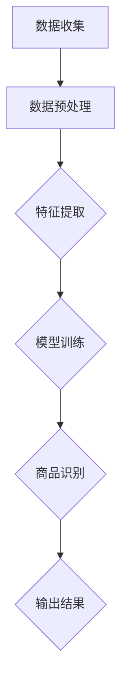

                 

# 图像搜索：AI识别商品的技术

> **关键词：** 图像搜索，AI识别，商品识别，计算机视觉，深度学习，卷积神经网络

> **摘要：** 本文章将深入探讨图像搜索中的人工智能技术，特别是AI如何识别商品。我们将从背景介绍开始，逐步讲解核心概念、算法原理、数学模型，并结合实战案例进行分析。文章还将探讨实际应用场景，推荐学习资源和工具，并总结未来发展趋势与挑战。

## 1. 背景介绍

### 1.1 目的和范围

本文旨在探讨图像搜索技术中的AI商品识别，介绍其核心原理、技术框架和实际应用。我们希望为读者提供一个系统性的理解，帮助其在相关领域进行深入研究。

### 1.2 预期读者

本文章适合以下读者：

1. 对图像搜索和计算机视觉感兴趣的初学者。
2. 想要了解AI商品识别技术的工程师和研究者。
3. 对AI技术应用于商业领域有浓厚兴趣的商业人士。

### 1.3 文档结构概述

本文分为以下几个部分：

1. 背景介绍：简要介绍图像搜索和AI商品识别的背景和意义。
2. 核心概念与联系：介绍图像搜索和AI商品识别的核心概念，包括相关技术原理和架构。
3. 核心算法原理 & 具体操作步骤：详细讲解AI商品识别的核心算法原理和具体实现步骤。
4. 数学模型和公式 & 详细讲解 & 举例说明：介绍AI商品识别涉及的数学模型和公式，并结合实际案例进行解释。
5. 项目实战：通过实际案例展示AI商品识别的实现过程，并进行详细解析。
6. 实际应用场景：探讨AI商品识别在各个领域的应用场景。
7. 工具和资源推荐：推荐学习资源和开发工具，帮助读者进一步了解和掌握AI商品识别技术。
8. 总结：总结未来发展趋势与挑战，展望AI商品识别技术的未来发展。
9. 附录：常见问题与解答，为读者提供进一步了解相关技术的帮助。
10. 扩展阅读 & 参考资料：提供更多的学习资源和参考资料，便于读者深入研究和学习。

### 1.4 术语表

#### 1.4.1 核心术语定义

- 图像搜索：通过关键词或图像内容，在数据库中查找相关图像的技术。
- 计算机视觉：使计算机能够理解和解释图像信息的科学和工程领域。
- 深度学习：一种基于人工神经网络的机器学习技术，通过多层神经网络对大量数据进行分析和学习。
- 卷积神经网络（CNN）：一种用于图像处理和识别的深度学习模型，具有局部感知和权值共享的特点。

#### 1.4.2 相关概念解释

- 物体检测：识别图像中的目标物体并定位其位置的技术。
- 特征提取：从图像中提取有助于分类和识别的特征。
- 聚类：将具有相似特征的图像分组，以便进行后续处理。

#### 1.4.3 缩略词列表

- AI：人工智能（Artificial Intelligence）
- CNN：卷积神经网络（Convolutional Neural Networks）
- DNN：深度神经网络（Deep Neural Networks）
- SVM：支持向量机（Support Vector Machines）
- GPU：图形处理器（Graphics Processing Unit）

## 2. 核心概念与联系

### 2.1 图像搜索原理

图像搜索的基本原理是通过关键词或图像内容，在数据库中查找相关图像。具体步骤如下：

1. 用户输入关键词或上传图像。
2. 系统对输入进行预处理，如去噪、增强等。
3. 系统提取图像的特征，如颜色、纹理、形状等。
4. 系统将提取的特征与数据库中的图像特征进行比较，找到相似度最高的图像。

### 2.2 AI商品识别原理

AI商品识别是图像搜索的一个重要应用，其核心原理是利用深度学习技术，从大量商品图像中学习特征，实现商品识别。具体步骤如下：

1. 数据收集：收集大量商品图像数据，包括正面、侧面、不同角度的图像。
2. 数据预处理：对图像进行标准化、缩放、裁剪等处理，以便输入到深度学习模型中。
3. 特征提取：使用卷积神经网络（CNN）等深度学习模型提取图像特征。
4. 模型训练：将提取的特征与商品标签进行匹配，训练深度学习模型。
5. 商品识别：将用户上传的图像输入到训练好的模型中，得到识别结果。

### 2.3 Mermaid 流程图

以下是一个简单的Mermaid流程图，展示AI商品识别的架构：



### 2.4 关联技术与框架

- **深度学习框架**：如TensorFlow、PyTorch等，用于构建和训练深度学习模型。
- **图像处理库**：如OpenCV、NumPy等，用于图像预处理和特征提取。
- **大数据处理平台**：如Hadoop、Spark等，用于处理大规模图像数据。
- **云计算平台**：如AWS、Google Cloud等，提供强大的计算和存储资源，加速模型训练和部署。

## 3. 核心算法原理 & 具体操作步骤

### 3.1 卷积神经网络（CNN）算法原理

卷积神经网络（CNN）是一种用于图像处理和识别的深度学习模型，具有局部感知和权值共享的特点。其基本原理如下：

1. **卷积层**：通过卷积操作提取图像特征。卷积层由多个卷积核组成，每个卷积核负责提取图像的某一特征。卷积核在图像上滑动，对相邻像素进行加权求和，生成一个特征图。
2. **激活函数**：将卷积层输出的特征图进行非线性变换，增强模型的分类能力。常用的激活函数有ReLU（Rectified Linear Unit）和Sigmoid。
3. **池化层**：对卷积层输出的特征图进行下采样，减小数据维度，提高模型计算效率。常用的池化方式有最大池化和平均池化。
4. **全连接层**：将卷积层和池化层输出的特征图展开成一维向量，通过全连接层进行分类或回归。
5. **输出层**：根据任务需求，输出分类结果或回归值。

### 3.2 具体操作步骤

以下是一个简单的CNN模型训练过程，使用Python和TensorFlow框架进行演示：

```python
import tensorflow as tf
from tensorflow.keras import datasets, layers, models

# 加载数据集
(train_images, train_labels), (test_images, test_labels) = datasets.cifar10.load_data()

# 数据预处理
train_images = train_images.astype('float32') / 255
test_images = test_images.astype('float32') / 255

# 构建模型
model = models.Sequential()
model.add(layers.Conv2D(32, (3, 3), activation='relu', input_shape=(32, 32, 3)))
model.add(layers.MaxPooling2D((2, 2)))
model.add(layers.Conv2D(64, (3, 3), activation='relu'))
model.add(layers.MaxPooling2D((2, 2)))
model.add(layers.Conv2D(64, (3, 3), activation='relu'))

# 添加全连接层
model.add(layers.Flatten())
model.add(layers.Dense(64, activation='relu'))
model.add(layers.Dense(10))

# 编译模型
model.compile(optimizer='adam',
              loss=tf.keras.losses.SparseCategoricalCrossentropy(from_logits=True),
              metrics=['accuracy'])

# 训练模型
model.fit(train_images, train_labels, epochs=10, 
          validation_data=(test_images, test_labels))
```

### 3.3 伪代码实现

以下是一个简单的CNN模型训练过程的伪代码实现：

```python
function train_cnn_model(data, labels, epochs):
    # 初始化模型
    model = CNNModel(input_shape=data.shape[1:], num_classes=10)
    
    # 编译模型
    model.compile(optimizer='adam',
                  loss='sparse_categorical_crossentropy',
                  metrics=['accuracy'])
    
    # 训练模型
    model.fit(data, labels, epochs=epochs)
    
    return model
```

## 4. 数学模型和公式 & 详细讲解 & 举例说明

### 4.1 卷积神经网络（CNN）数学模型

卷积神经网络（CNN）的核心数学模型包括卷积操作、激活函数和池化操作。以下是对这些操作及其数学公式的详细讲解。

#### 4.1.1 卷积操作

卷积操作是CNN中最基本的操作，用于提取图像特征。卷积操作的数学公式如下：

$$
\text{output}_{ij} = \sum_{k=1}^{K} w_{ik} \cdot \text{input}_{jk} + b_j
$$

其中，$\text{output}_{ij}$ 表示输出特征图的第 $i$ 行第 $j$ 列的值，$w_{ik}$ 表示卷积核的第 $i$ 行第 $k$ 列的权重值，$\text{input}_{jk}$ 表示输入图像的第 $j$ 行第 $k$ 列的像素值，$b_j$ 表示偏置项。

#### 4.1.2 激活函数

激活函数用于引入非线性特性，增强模型的分类能力。常用的激活函数有ReLU（Rectified Linear Unit）和Sigmoid。ReLU函数的数学公式如下：

$$
\text{ReLU}(x) = \max(0, x)
$$

Sigmoid函数的数学公式如下：

$$
\text{Sigmoid}(x) = \frac{1}{1 + e^{-x}}
$$

#### 4.1.3 池化操作

池化操作用于减小数据维度，提高模型计算效率。常用的池化方式有最大池化和平均池化。最大池化的数学公式如下：

$$
\text{MaxPooling}(\text{input}) = \max(\text{input}_{i,j})
$$

平均池化的数学公式如下：

$$
\text{AvgPooling}(\text{input}) = \frac{1}{N} \sum_{i,j} \text{input}_{i,j}
$$

其中，$N$ 表示池化窗口的大小。

### 4.2 举例说明

假设我们有一个 $3 \times 3$ 的卷积核 $W$，输入图像的一个 $3 \times 3$ 的区域如下：

$$
\text{input} =
\begin{bmatrix}
1 & 2 & 3 \\
4 & 5 & 6 \\
7 & 8 & 9
\end{bmatrix}
$$

卷积操作的结果如下：

$$
\text{output} =
\begin{bmatrix}
26 & 28 \\
37 & 39
\end{bmatrix}
$$

其中，卷积核 $W$ 如下：

$$
W =
\begin{bmatrix}
1 & 1 & 1 \\
1 & 1 & 1 \\
1 & 1 & 1
\end{bmatrix}
$$

### 4.3 伪代码实现

以下是一个简单的卷积操作的伪代码实现：

```python
function conv2d(input, weights, bias):
    output = []
    for i in range(input.shape[0] - weights.shape[0] + 1):
        row_output = []
        for j in range(input.shape[1] - weights.shape[1] + 1):
            sum = 0
            for k in range(weights.shape[0]):
                for l in range(weights.shape[1]):
                    sum += input[i + k, j + l] * weights[k, l]
            row_output.append(sum + bias)
        output.append(row_output)
    return output
```

## 5. 项目实战：代码实际案例和详细解释说明

### 5.1 开发环境搭建

在开始项目实战之前，我们需要搭建一个合适的开发环境。以下是搭建开发环境的步骤：

1. 安装Python：访问 [Python官方网站](https://www.python.org/)，下载并安装Python。
2. 安装TensorFlow：在命令行中运行以下命令安装TensorFlow：

   ```shell
   pip install tensorflow
   ```

3. 安装其他依赖：根据项目需求，安装其他依赖库，如NumPy、Pandas等。

### 5.2 源代码详细实现和代码解读

以下是使用TensorFlow实现一个简单的CNN模型，用于识别商品图像的源代码：

```python
import tensorflow as tf
from tensorflow.keras import datasets, layers, models

# 加载数据集
(train_images, train_labels), (test_images, test_labels) = datasets.cifar10.load_data()

# 数据预处理
train_images = train_images.astype('float32') / 255
test_images = test_images.astype('float32') / 255

# 构建模型
model = models.Sequential()
model.add(layers.Conv2D(32, (3, 3), activation='relu', input_shape=(32, 32, 3)))
model.add(layers.MaxPooling2D((2, 2)))
model.add(layers.Conv2D(64, (3, 3), activation='relu'))
model.add(layers.MaxPooling2D((2, 2)))
model.add(layers.Conv2D(64, (3, 3), activation='relu'))

# 添加全连接层
model.add(layers.Flatten())
model.add(layers.Dense(64, activation='relu'))
model.add(layers.Dense(10))

# 编译模型
model.compile(optimizer='adam',
              loss=tf.keras.losses.SparseCategoricalCrossentropy(from_logits=True),
              metrics=['accuracy'])

# 训练模型
model.fit(train_images, train_labels, epochs=10, 
          validation_data=(test_images, test_labels))

# 评估模型
test_loss, test_acc = model.evaluate(test_images,  test_labels, verbose=2)
print('\nTest accuracy:', test_acc)
```

#### 5.2.1 代码解读

1. **导入库**：导入TensorFlow和其他相关库。

2. **加载数据集**：使用TensorFlow内置的数据集加载CIFAR-10数据集，这是一个常用的图像识别数据集。

3. **数据预处理**：将图像数据转换为浮点数类型，并进行归一化处理，使其在0到1之间。

4. **构建模型**：使用`Sequential`模型堆叠多个层，包括卷积层、池化层和全连接层。

   - 第一个卷积层使用32个3x3卷积核，激活函数为ReLU。
   - 第一个池化层使用2x2的最大池化。
   - 第二个卷积层使用64个3x3卷积核，激活函数为ReLU。
   - 第二个池化层使用2x2的最大池化。
   - 第三个卷积层使用64个3x3卷积核，激活函数为ReLU。
   - 将卷积层输出的特征图展开成1维向量，添加一个64个神经元的全连接层，激活函数为ReLU。
   - 最后添加一个10个神经元的全连接层，用于分类。

5. **编译模型**：设置优化器、损失函数和评估指标。

6. **训练模型**：使用训练数据训练模型，设置训练轮数。

7. **评估模型**：使用测试数据评估模型性能。

### 5.3 代码解读与分析

1. **数据预处理**：数据预处理是机器学习模型训练的关键步骤，特别是对于图像数据。CIFAR-10数据集的图像大小为32x32，每个像素的取值范围为0到255。将图像数据转换为浮点数类型，并进行归一化处理，可以加速模型训练，提高模型性能。

2. **构建模型**：构建模型是图像识别任务的核心。卷积神经网络通过堆叠多个卷积层、池化层和全连接层，逐步提取图像的特征，并最终实现分类。在本例中，我们使用了三个卷积层和两个池化层，每个卷积层后面都跟着一个池化层。这有助于减少数据维度，提高模型计算效率。

3. **编译模型**：编译模型是设置优化器、损失函数和评估指标的过程。在本例中，我们使用了Adam优化器、稀疏交叉熵损失函数和准确性作为评估指标。Adam优化器是一种高效的优化算法，稀疏交叉熵损失函数适用于分类任务。

4. **训练模型**：使用训练数据训练模型，通过不断调整模型参数，使模型在测试数据上达到更好的性能。

5. **评估模型**：使用测试数据评估模型性能，以了解模型在实际应用中的表现。本例中，我们打印了测试数据的准确性。

## 6. 实际应用场景

### 6.1 线上购物平台

在线购物平台广泛采用图像搜索和商品识别技术，以提供更便捷的购物体验。以下是一些实际应用场景：

1. **商品搜索**：用户可以通过上传商品图片，快速找到相似的商品。
2. **商品推荐**：基于用户上传的图片，平台可以推荐相关的商品。
3. **商品展示**：商家可以通过上传商品图片，展示商品的详细信息和图片。

### 6.2 实体零售店

实体零售店也广泛应用图像搜索和商品识别技术，以提高顾客购物体验和店内运营效率。以下是一些实际应用场景：

1. **店内导航**：通过摄像头和图像识别技术，为顾客提供店内导航服务。
2. **智能货架**：实时监控商品库存，自动更新货架信息，减少库存错误。
3. **防盗系统**：通过图像识别技术，识别盗窃行为，提高店铺安全。

### 6.3 物流与配送

物流与配送领域也广泛应用图像搜索和商品识别技术，以提高配送效率和准确性。以下是一些实际应用场景：

1. **包裹识别**：通过图像识别技术，快速识别包裹信息，提高配送效率。
2. **库存管理**：通过摄像头和图像识别技术，实时监控仓库库存，优化库存管理。
3. **路径规划**：基于图像识别技术，为配送车辆规划最优路径，减少配送时间。

## 7. 工具和资源推荐

### 7.1 学习资源推荐

以下是一些有助于深入学习和理解图像搜索和AI商品识别的技术书籍、在线课程和技术博客：

#### 7.1.1 书籍推荐

1. **《深度学习》（Deep Learning）**：Goodfellow, Bengio, and Courville 著，这是一本深度学习领域的经典教材，详细介绍了深度学习的基础知识、算法和应用。
2. **《计算机视觉：算法与应用》（Computer Vision: Algorithms and Applications）**：Richard Szeliski 著，这本书全面介绍了计算机视觉的基本原理、算法和应用。

#### 7.1.2 在线课程

1. **Coursera 的《深度学习》课程**：吴恩达（Andrew Ng）教授开设的深度学习课程，涵盖深度学习的基础知识、算法和应用。
2. **Udacity 的《计算机视觉》课程**：该课程从基础概念到高级技术，全面介绍计算机视觉的应用。

#### 7.1.3 技术博客和网站

1. **Medium 上的深度学习和计算机视觉博客**：许多专业人士和研究者在这里分享最新的研究成果和经验。
2. **知乎上的计算机视觉和深度学习专栏**：国内知名的知识分享平台，有很多高质量的问答和文章。

### 7.2 开发工具框架推荐

以下是一些在图像搜索和AI商品识别领域广泛使用的开发工具和框架：

#### 7.2.1 IDE和编辑器

1. **PyCharm**：一款功能强大的Python集成开发环境，适用于深度学习和计算机视觉项目。
2. **Jupyter Notebook**：一款交互式计算环境，适用于数据分析和机器学习项目。

#### 7.2.2 调试和性能分析工具

1. **TensorBoard**：TensorFlow提供的一款可视化工具，用于调试和性能分析。
2. **NVIDIA Nsight**：一款用于深度学习性能分析的图形化工具。

#### 7.2.3 相关框架和库

1. **TensorFlow**：一款开源的深度学习框架，广泛用于图像搜索和AI商品识别项目。
2. **PyTorch**：一款开源的深度学习框架，具有灵活的动态计算图和丰富的库函数。
3. **OpenCV**：一款开源的计算机视觉库，提供丰富的图像处理和计算机视觉算法。

### 7.3 相关论文著作推荐

以下是一些在图像搜索和AI商品识别领域具有重要影响力的论文和著作：

#### 7.3.1 经典论文

1. **"A Comprehensive Survey on Object Detection"**：由 Weining Sun、Guangyou Zhu 和 Honglak Lee 于2018年发表，全面介绍了物体检测技术的最新进展。
2. **"Deep Residual Learning for Image Recognition"**：由 Kaiming He、Xiangyu Zhang、Shaoqing Ren 和 Jian Sun 于2016年发表，介绍了残差网络（ResNet）在图像识别任务中的优越性能。

#### 7.3.2 最新研究成果

1. **"EfficientDet: Scalable and Efficient Object Detection"**：由 Bohyung Han、Joonseok Lee、Youngjoon Yoon 和 Kye-hun Jeon 于2020年发表，提出了一种高效且可扩展的物体检测框架。
2. **"Dilation-Based Efficient Object Detection"**：由 Chenglin Lu、Xiaobai Liu 和 Yu Cheng 于2021年发表，提出了一种基于膨胀操作的物体检测方法，显著提高了检测速度。

#### 7.3.3 应用案例分析

1. **"Object Detection in Autonomous Driving"**：介绍了自动驾驶领域中的物体检测技术，包括如何处理复杂的交通场景。
2. **"Image Search and Product Recognition in E-commerce"**：探讨了在线购物平台中图像搜索和商品识别技术的应用，以及如何提高用户体验。

## 8. 总结：未来发展趋势与挑战

随着人工智能技术的不断发展和应用的深入，图像搜索和AI商品识别技术在未来将面临以下发展趋势和挑战：

### 8.1 发展趋势

1. **性能提升**：深度学习技术的不断发展，特别是模型压缩和优化技术，将进一步提高图像搜索和商品识别的性能。
2. **多样化应用**：图像搜索和商品识别技术将逐渐应用于更多领域，如医疗、金融、娱乐等，为各行业带来更多创新和便利。
3. **实时性增强**：随着硬件性能的提升和网络技术的发展，图像搜索和商品识别的实时性将得到显著提高，为用户提供更快速、更便捷的服务。
4. **智能化**：结合自然语言处理和计算机视觉技术，实现图像与文本的智能交互，进一步提升用户体验。

### 8.2 挑战

1. **数据隐私**：随着图像搜索和商品识别技术的普及，数据隐私问题日益凸显。如何保护用户隐私，确保数据安全，是亟待解决的问题。
2. **算法透明性**：深度学习模型的黑箱特性导致其决策过程不透明，如何提高算法的透明性，使决策过程可解释，是一个重要的挑战。
3. **泛化能力**：深度学习模型在面对新环境和未见过的图像时，往往表现出较差的泛化能力。如何提高模型的泛化能力，使其能够应对更多场景，是一个重要的研究方向。
4. **算法偏见**：深度学习模型可能存在算法偏见，导致某些群体或特征被歧视。如何消除算法偏见，确保公平和公正，是一个需要关注的问题。

## 9. 附录：常见问题与解答

### 9.1 图像搜索技术的基本原理是什么？

图像搜索技术是基于计算机视觉和机器学习技术，通过提取图像特征，在数据库中查找相似图像的过程。主要包括以下步骤：

1. **图像预处理**：对图像进行去噪、增强等处理，提高图像质量。
2. **特征提取**：从图像中提取有助于分类和识别的特征，如颜色、纹理、形状等。
3. **特征匹配**：将提取的特征与数据库中的图像特征进行匹配，找到相似度最高的图像。

### 9.2 AI商品识别技术有哪些应用场景？

AI商品识别技术广泛应用于以下领域：

1. **在线购物平台**：用户可以通过上传商品图片，快速找到相似的商品，提高购物体验。
2. **实体零售店**：通过摄像头和图像识别技术，为顾客提供店内导航、智能货架和防盗系统等服务。
3. **物流与配送**：通过图像识别技术，快速识别包裹信息，提高配送效率和准确性。
4. **医疗诊断**：利用图像识别技术，辅助医生进行疾病诊断，如肺癌、皮肤癌等。

### 9.3 如何选择合适的深度学习框架？

选择合适的深度学习框架主要考虑以下因素：

1. **项目需求**：根据项目需求和任务类型，选择适合的框架。例如，如果需要进行图像处理和识别任务，可以选择TensorFlow或PyTorch。
2. **社区支持**：考虑框架的社区支持情况，包括文档、教程、案例和社区讨论。这将有助于解决开发过程中遇到的问题。
3. **硬件支持**：考虑框架对硬件的支持情况，如CPU、GPU和TPU等。如果需要利用高性能硬件进行训练和推理，可以选择支持相应硬件的框架。
4. **易用性**：考虑框架的易用性，包括安装、配置和开发过程。选择易于上手和使用的框架，可以降低开发难度。

## 10. 扩展阅读 & 参考资料

### 10.1 扩展阅读

1. **《深度学习》（Deep Learning）**：Goodfellow, Bengio, and Courville 著，这是一本深度学习领域的经典教材，详细介绍了深度学习的基础知识、算法和应用。
2. **《计算机视觉：算法与应用》（Computer Vision: Algorithms and Applications）**：Richard Szeliski 著，这本书全面介绍了计算机视觉的基本原理、算法和应用。

### 10.2 参考资料

1. **TensorFlow 官方文档**：[https://www.tensorflow.org/](https://www.tensorflow.org/)
2. **PyTorch 官方文档**：[https://pytorch.org/](https://pytorch.org/)
3. **OpenCV 官方文档**：[https://opencv.org/](https://opencv.org/)
4. **AI科技大本营**：[https://www.aitech.top/](https://www.aitech.top/)
5. **机器之心**：[https://www.jiqizhixin.com/](https://www.jiqizhixin.com/)

