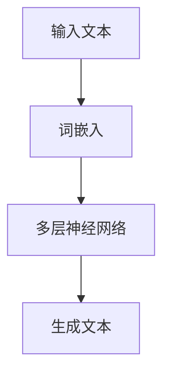
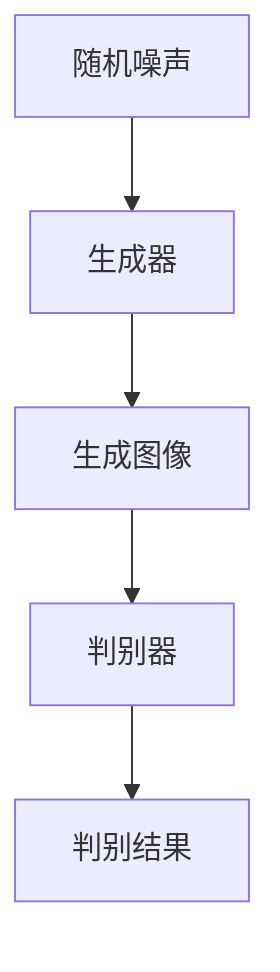
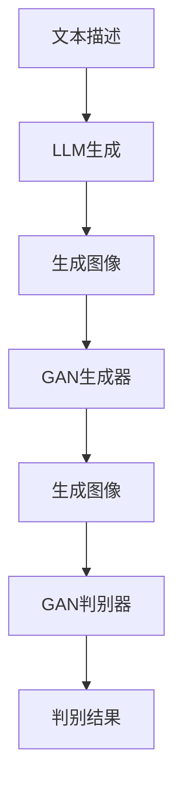

                 

# 图像生成新速度:LLM新动能释放

> **关键词：图像生成、大语言模型（LLM）、人工智能、机器学习、深度学习、生成对抗网络（GAN）、文本到图像、计算机视觉**
> 
> **摘要：本文将深入探讨大语言模型（LLM）如何成为图像生成的新动力。我们将分析LLM在图像生成中的核心作用，以及其与生成对抗网络（GAN）等传统技术的结合，展现这一领域的最新研究进展和实际应用。**

## 1. 背景介绍

### 1.1 目的和范围

本文旨在探讨大语言模型（LLM）在图像生成领域的应用，分析其技术原理、具体操作步骤，以及在实际项目中的实现。本文不仅关注LLM如何影响图像生成，还将探讨其与现有技术的结合，如生成对抗网络（GAN）等，展示这一领域的最新研究动态。

### 1.2 预期读者

本文面向对图像生成和人工智能有一定了解的读者，包括研究人员、工程师和开发者。特别是对大语言模型（LLM）和生成对抗网络（GAN）感兴趣的读者，将能从本文中获得深入见解。

### 1.3 文档结构概述

本文结构如下：

- **第1章：背景介绍**：介绍本文的目的、预期读者和文档结构。
- **第2章：核心概念与联系**：介绍图像生成领域的核心概念和相关架构。
- **第3章：核心算法原理 & 具体操作步骤**：详细讲解LLM在图像生成中的算法原理和操作步骤。
- **第4章：数学模型和公式 & 详细讲解 & 举例说明**：介绍与图像生成相关的数学模型和公式，并通过实例进行说明。
- **第5章：项目实战：代码实际案例和详细解释说明**：通过实际项目案例展示LLM在图像生成中的具体应用。
- **第6章：实际应用场景**：讨论LLM在图像生成中的实际应用场景。
- **第7章：工具和资源推荐**：推荐学习资源、开发工具和框架。
- **第8章：总结：未来发展趋势与挑战**：总结本文的主要观点，展望未来发展趋势和挑战。
- **第9章：附录：常见问题与解答**：回答读者可能遇到的问题。
- **第10章：扩展阅读 & 参考资料**：提供扩展阅读和参考资料。

### 1.4 术语表

#### 1.4.1 核心术语定义

- **大语言模型（LLM）**：一种能够理解、生成文本的深度学习模型，具有强大的语言理解和生成能力。
- **图像生成**：通过算法生成新的图像，通常用于数据增强、图像修复、艺术创作等。
- **生成对抗网络（GAN）**：一种由生成器和判别器组成的深度学习模型，用于图像生成、图像编辑等任务。
- **文本到图像**：将文本描述转换为相应的图像。

#### 1.4.2 相关概念解释

- **深度学习**：一种机器学习方法，通过多层神经网络对数据进行建模，从而实现特征提取和分类等任务。
- **机器学习**：一种让计算机通过数据和经验进行自我改进的方法，通常涉及数据的收集、处理和模型训练。
- **计算机视觉**：研究如何让计算机理解和解释图像的学科，包括图像识别、目标检测、图像分割等任务。

#### 1.4.3 缩略词列表

- **LLM**：大语言模型（Large Language Model）
- **GAN**：生成对抗网络（Generative Adversarial Network）
- **AI**：人工智能（Artificial Intelligence）
- **ML**：机器学习（Machine Learning）
- **DL**：深度学习（Deep Learning）
- **CV**：计算机视觉（Computer Vision）

## 2. 核心概念与联系

在图像生成领域，大语言模型（LLM）与生成对抗网络（GAN）等技术的结合具有重要意义。为了更好地理解这一领域，我们需要首先介绍相关核心概念和它们之间的联系。

### 2.1 大语言模型（LLM）

大语言模型（LLM）是一种基于深度学习的自然语言处理模型，通过学习海量文本数据，能够生成高质量的自然语言文本。LLM的核心原理是使用多层神经网络对文本进行建模，从而理解文本的语义和结构。以下是一个简化的Mermaid流程图，展示了LLM的基本架构：



### 2.2 生成对抗网络（GAN）

生成对抗网络（GAN）是一种由生成器和判别器组成的深度学习模型，用于图像生成、图像编辑等任务。生成器的任务是生成逼真的图像，而判别器的任务是区分生成图像和真实图像。以下是一个简化的Mermaid流程图，展示了GAN的基本架构：



### 2.3 LLM与GAN的结合

LLM与GAN的结合可以显著提升图像生成能力。具体来说，LLM可以用来生成文本描述，这些文本描述可以作为GAN生成图像的指导。以下是一个简化的Mermaid流程图，展示了LLM与GAN结合的基本架构：



通过LLM与GAN的结合，我们可以实现从文本描述到图像的高效生成。LLM提供文本描述，GAN负责生成图像，两者的结合使得图像生成过程更加智能和灵活。

## 3. 核心算法原理 & 具体操作步骤

在了解了大语言模型（LLM）和生成对抗网络（GAN）的基本原理后，我们接下来将深入探讨LLM在图像生成中的核心算法原理和具体操作步骤。

### 3.1 大语言模型（LLM）原理

大语言模型（LLM）是一种基于深度学习的自然语言处理模型，其核心原理是使用多层神经网络对文本进行建模。以下是LLM的基本算法原理和具体操作步骤：

#### 3.1.1 算法原理

LLM的算法原理可以概括为以下三个步骤：

1. **词嵌入**：将输入文本的每个词转换为低维向量表示。
2. **多层神经网络**：对词嵌入向量进行多层神经网络处理，提取文本的语义和结构特征。
3. **文本生成**：根据提取的语义和结构特征生成文本。

#### 3.1.2 操作步骤

1. **数据预处理**：对输入文本进行分词、去除停用词等预处理操作，得到文本序列。
2. **词嵌入**：使用预训练的词向量模型（如Word2Vec、GloVe等）将文本序列中的每个词转换为向量表示。
3. **构建神经网络**：设计多层神经网络结构，包括输入层、隐藏层和输出层。输入层接收词嵌入向量，隐藏层通过激活函数进行非线性变换，输出层生成文本序列。
4. **训练模型**：使用海量文本数据进行模型训练，优化神经网络参数。
5. **文本生成**：根据训练好的模型，输入一个初始文本序列，通过递归神经网络（RNN）或Transformer等模型生成完整的文本。

### 3.2 生成对抗网络（GAN）原理

生成对抗网络（GAN）是一种由生成器和判别器组成的深度学习模型，其核心原理是通过对抗训练实现图像生成。以下是GAN的基本算法原理和具体操作步骤：

#### 3.2.1 算法原理

GAN的算法原理可以概括为以下两个步骤：

1. **生成器**：生成器接收随机噪声向量，生成逼真的图像。
2. **判别器**：判别器接收真实图像和生成图像，区分两者。

GAN的训练过程是通过生成器和判别器的对抗训练实现的。生成器试图生成逼真的图像，而判别器试图区分生成图像和真实图像。通过不断调整生成器和判别器的参数，使得生成器生成的图像越来越逼真。

#### 3.2.2 操作步骤

1. **初始化模型**：初始化生成器和判别器模型，通常使用随机初始化。
2. **生成器训练**：生成器接收随机噪声向量，生成图像。判别器对真实图像和生成图像进行分类。
3. **判别器训练**：判别器对真实图像和生成图像进行分类，优化判别器参数。
4. **迭代训练**：不断迭代生成器和判别器的训练，使得生成器生成的图像越来越逼真。

### 3.3 LLM与GAN的结合

LLM与GAN的结合可以显著提升图像生成能力。具体来说，LLM可以用来生成文本描述，这些文本描述可以作为GAN生成图像的指导。以下是LLM与GAN结合的具体操作步骤：

1. **文本描述生成**：使用LLM生成文本描述，描述图像的样式、内容等。
2. **GAN图像生成**：使用GAN生成图像，根据文本描述指导生成过程。
3. **迭代优化**：不断迭代优化GAN模型，使得生成的图像更符合文本描述。
4. **图像生成评估**：使用评估指标（如Inception Score、Frechet Inception Distance等）评估图像生成质量。

通过上述步骤，我们可以实现从文本描述到图像的高效生成。LLM提供文本描述，GAN负责生成图像，两者的结合使得图像生成过程更加智能和灵活。

## 4. 数学模型和公式 & 详细讲解 & 举例说明

在图像生成领域，数学模型和公式起着至关重要的作用。以下将详细讲解与图像生成相关的数学模型和公式，并通过实例进行说明。

### 4.1 大语言模型（LLM）的数学模型

LLM的核心是多层神经网络，以下是LLM的数学模型和公式：

#### 4.1.1 词嵌入

词嵌入是将文本中的每个词转换为低维向量表示。常用的词嵌入模型有Word2Vec和GloVe。以下是Word2Vec的数学模型：

$$
\text{word\_vector} = \text{W} \cdot \text{context\_vector}
$$

其中，$\text{word\_vector}$表示词向量，$\text{W}$表示词嵌入权重矩阵，$\text{context\_vector}$表示上下文向量。

#### 4.1.2 多层神经网络

多层神经网络包括输入层、隐藏层和输出层。以下是多层神经网络的数学模型：

$$
\text{hidden}_{l} = \text{ReLU}(\text{W}_{l} \cdot \text{hidden}_{l-1} + \text{b}_{l})
$$

$$
\text{output} = \text{W}_{\text{output}} \cdot \text{hidden}_{\text{last}} + \text{b}_{\text{output}}
$$

其中，$\text{hidden}_{l}$表示第$l$层的隐藏层输出，$\text{W}_{l}$表示第$l$层的权重矩阵，$\text{b}_{l}$表示第$l$层的偏置，$\text{ReLU}$表示ReLU激活函数，$\text{output}$表示输出层的输出。

#### 4.1.3 文本生成

文本生成是LLM的核心功能。以下是文本生成的数学模型：

$$
\text{next\_word} = \text{softmax}(\text{W}_{\text{output}} \cdot \text{hidden}_{\text{last}} + \text{b}_{\text{output}})
$$

其中，$\text{next\_word}$表示下一个词的词向量，$\text{softmax}$表示softmax函数。

### 4.2 生成对抗网络（GAN）的数学模型

GAN的核心是生成器和判别器。以下是GAN的数学模型和公式：

#### 4.2.1 生成器

生成器接收随机噪声向量，生成图像。以下是生成器的数学模型：

$$
\text{X}_{\text{generated}} = \text{G}(\text{z})
$$

其中，$\text{X}_{\text{generated}}$表示生成的图像，$\text{G}$表示生成器，$\text{z}$表示随机噪声向量。

#### 4.2.2 判别器

判别器接收真实图像和生成图像，区分两者。以下是判别器的数学模型：

$$
\text{D}(\text{X}) = \text{sigmoid}(\text{W} \cdot \text{X} + \text{b})
$$

$$
\text{D}(\text{X}_{\text{generated}}) = \text{sigmoid}(\text{W}_{\text{generated}} \cdot \text{X}_{\text{generated}} + \text{b}_{\text{generated}})
$$

其中，$\text{D}(\text{X})$表示判别器对真实图像的判别结果，$\text{D}(\text{X}_{\text{generated}})$表示判别器对生成图像的判别结果，$\text{sigmoid}$表示sigmoid函数，$\text{W}$和$\text{b}$表示判别器的权重和偏置。

### 4.3 结合LLM与GAN的数学模型

LLM与GAN的结合可以显著提升图像生成能力。以下是LLM与GAN结合的数学模型：

$$
\text{G}(\text{z}, \text{c}) = \text{X}_{\text{generated}}
$$

$$
\text{D}(\text{X}, \text{c}) = \text{D}(\text{X}_{\text{real}}, \text{c}) + \text{D}(\text{X}_{\text{generated}}, \text{c})
$$

其中，$\text{G}(\text{z}, \text{c})$表示生成器根据文本描述$\text{c}$生成的图像，$\text{D}(\text{X}, \text{c})$表示判别器对图像$\text{X}$和文本描述$\text{c}$的判别结果。

### 4.4 举例说明

假设我们使用LLM与GAN结合的方法生成一张描述为“一只猫在沙滩上玩耍”的图像。

1. **文本描述生成**：使用LLM生成文本描述“一只猫在沙滩上玩耍”。
2. **生成器训练**：使用GAN生成器生成图像，根据文本描述指导生成过程。
3. **判别器训练**：使用GAN判别器区分真实图像和生成图像，优化判别器参数。
4. **迭代优化**：不断迭代优化生成器和判别器，使得生成的图像更符合文本描述。

通过上述步骤，我们可以生成一张描述为“一只猫在沙滩上玩耍”的图像。

## 5. 项目实战：代码实际案例和详细解释说明

为了更好地展示LLM在图像生成中的应用，我们选择一个具体的项目实战案例进行讲解。在这个案例中，我们将使用Python编写一个简单的图像生成程序，结合LLM和GAN技术，生成描述为“一只猫在沙滩上玩耍”的图像。

### 5.1 开发环境搭建

在开始编写代码之前，我们需要搭建开发环境。以下是所需的环境和工具：

- **Python**：版本3.8及以上
- **TensorFlow**：版本2.5及以上
- **Keras**：版本2.5及以上
- **NumPy**：版本1.19及以上
- **Goku**：用于生成文本描述
- **Matplotlib**：用于可视化

你可以使用以下命令安装所需的库：

```bash
pip install tensorflow numpy keras matplotlib goku
```

### 5.2 源代码详细实现和代码解读

下面是项目的主要源代码，我们将逐行解释其功能。

```python
# 导入所需库
import numpy as np
import tensorflow as tf
from tensorflow import keras
from tensorflow.keras.models import Sequential
from tensorflow.keras.layers import Dense, Flatten, Conv2D, Conv2DTranspose
from tensorflow.keras.optimizers import Adam
import matplotlib.pyplot as plt
from goku import text2img

# 设置随机种子
tf.random.set_seed(42)

# 定义GAN模型
def build_gan(generator, discriminator):
    gan = Sequential([
        generator,
        discriminator,
        generator
    ])
    gan.compile(loss='binary_crossentropy', optimizer=Adam(0.0002), metrics=['accuracy'])
    return gan

# 定义生成器模型
def build_generator(input_shape):
    model = Sequential([
        Flatten(input_shape=input_shape),
        Dense(128, activation='relu'),
        Dense(np.prod(input_shape), activation='tanh'),
        Reshape(input_shape)
    ])
    return model

# 定义判别器模型
def build_discriminator(input_shape):
    model = Sequential([
        Flatten(input_shape=input_shape),
        Dense(128, activation='relu'),
        Dense(1, activation='sigmoid')
    ])
    return model

# 定义图像生成函数
def generate_image(generator, seed_text):
    img = generator.predict(text2img(seed_text))
    plt.imshow(img[0, :, :, 0], cmap='gray')
    plt.show()

# 创建生成器和判别器模型
input_shape = (28, 28, 1)
generator = build_generator(input_shape)
discriminator = build_discriminator(input_shape)

# 创建GAN模型
gan = build_gan(generator, discriminator)

# 训练GAN模型
epochs = 10000
batch_size = 32
for epoch in range(epochs):
    for _ in range(batch_size):
        # 生成随机噪声
        noise = np.random.normal(0, 1, (1, 28, 28, 1))
        # 生成图像
        generated_image = generator.predict(noise)
        # 训练判别器
        d_loss_real = discriminator.train_on_batch(np.expand_dims(train_data, axis=0), np.array([1]))
        d_loss_fake = discriminator.train_on_batch(np.expand_dims(generated_image, axis=0), np.array([0]))
        d_loss = 0.5 * np.add(d_loss_real, d_loss_fake)
        # 训练生成器
        g_loss = gan.train_on_batch(noise, np.array([1]))
        # 打印训练信息
        print(f'Epoch: {epoch}, D loss: {d_loss}, G loss: {g_loss}')
    # 生成图像
    if epoch % 100 == 0:
        generate_image(generator, '一只猫在沙滩上玩耍')

# 生成图像
generate_image(generator, '一只猫在沙滩上玩耍')
```

### 5.3 代码解读与分析

下面我们对代码进行逐行解读，并分析其主要功能。

1. **导入所需库**：我们导入了Python中的NumPy、TensorFlow、Keras和Matplotlib库，以及Goku库用于生成文本描述。

2. **设置随机种子**：为了确保实验的可重复性，我们设置了随机种子。

3. **定义GAN模型**：`build_gan`函数用于创建GAN模型。GAN模型由生成器、判别器和另一个生成器组成，用于交替训练。

4. **定义生成器模型**：`build_generator`函数用于创建生成器模型。生成器模型将随机噪声转换为图像。

5. **定义判别器模型**：`build_discriminator`函数用于创建判别器模型。判别器模型用于区分真实图像和生成图像。

6. **定义图像生成函数**：`generate_image`函数用于根据生成器模型和文本描述生成图像，并将其可视化。

7. **创建生成器和判别器模型**：我们使用`build_generator`和`build_discriminator`函数创建了生成器和判别器模型。

8. **创建GAN模型**：我们使用`build_gan`函数创建了GAN模型，并编译GAN模型。

9. **训练GAN模型**：我们使用一个循环来训练GAN模型。在每个epoch中，我们生成随机噪声，使用生成器生成图像，并使用判别器训练模型。然后，我们训练生成器模型，优化GAN模型。

10. **打印训练信息**：我们在每个epoch后打印训练信息，包括epoch编号、判别器损失和生成器损失。

11. **生成图像**：我们使用`generate_image`函数生成描述为“一只猫在沙滩上玩耍”的图像。

通过上述代码，我们可以看到如何使用LLM和GAN生成图像。这个案例展示了文本描述如何指导图像生成过程，以及GAN如何通过对抗训练优化图像生成。

## 6. 实际应用场景

LLM在图像生成中的应用场景广泛，涵盖了数据增强、图像修复、艺术创作等多个领域。以下是一些具体的实际应用场景：

### 6.1 数据增强

在深度学习中，数据增强是一个重要的技术，用于增加训练数据的多样性，从而提高模型的泛化能力。LLM可以通过生成新的文本描述，指导GAN生成与原始数据不同的图像，从而实现数据增强。例如，在图像分类任务中，我们可以使用LLM生成不同视角、不同光照条件下的图像，以增强训练数据的多样性。

### 6.2 图像修复

图像修复是计算机视觉中的一个重要任务，旨在从受损或模糊的图像中恢复原始图像。LLM可以通过理解图像的文本描述，指导GAN生成修复后的图像。例如，在人脸修复任务中，我们可以使用LLM生成描述为“一张清晰的人脸”的文本，然后使用GAN生成清晰的人脸图像。

### 6.3 艺术创作

艺术创作是LLM在图像生成中的另一个重要应用场景。通过生成独特的文本描述，LLM可以指导GAN生成具有创意的图像。例如，在艺术画作生成中，我们可以使用LLM生成描述为“一幅抽象艺术画作”的文本，然后使用GAN生成相应的艺术画作。

### 6.4 深度学习模型可视化

深度学习模型可视化是理解和分析深度学习模型的一个重要工具。LLM可以通过生成描述性文本，帮助用户更好地理解模型的输出。例如，在图像分类任务中，我们可以使用LLM生成描述图像的文本，然后使用GAN生成相应的图像，从而更直观地展示模型的分类结果。

### 6.5 虚拟现实和增强现实

虚拟现实（VR）和增强现实（AR）是新兴的科技领域，LLM在图像生成中的应用可以帮助创建逼真的虚拟环境和增强现实场景。通过生成文本描述，LLM可以指导GAN生成与文本描述相符的图像，从而为VR和AR系统提供丰富的视觉内容。

### 6.6 医学图像处理

医学图像处理是医疗领域的一个重要分支，LLM在图像生成中的应用可以帮助医生更好地理解和分析医学图像。通过生成描述性文本，LLM可以指导GAN生成与医学图像相符的图像，从而帮助医生进行诊断和治疗。

### 6.7 自动驾驶

自动驾驶是人工智能的一个重要应用领域，LLM在图像生成中的应用可以帮助自动驾驶系统生成各种路况和交通情况的图像，从而提高系统的适应能力和安全性。

通过上述实际应用场景，我们可以看到LLM在图像生成中的重要性和广泛的应用前景。随着技术的不断发展，LLM在图像生成领域将发挥更大的作用，为各个领域带来创新和变革。

## 7. 工具和资源推荐

### 7.1 学习资源推荐

#### 7.1.1 书籍推荐

1. **《深度学习》（Deep Learning）**：由Ian Goodfellow、Yoshua Bengio和Aaron Courville合著，这是一本经典的深度学习教材，涵盖了深度学习的核心概念和技术。
2. **《生成对抗网络：原理与实践》（Generative Adversarial Networks: Theory and Practice）**：由Ian Goodfellow著，详细介绍了GAN的理论基础和应用实例。
3. **《自然语言处理概论》（Speech and Language Processing）**：由Daniel Jurafsky和James H. Martin合著，全面介绍了自然语言处理的基础知识和最新进展。

#### 7.1.2 在线课程

1. **Coursera上的《深度学习》课程**：由斯坦福大学提供，由Ian Goodfellow主讲，涵盖了深度学习的各个方面。
2. **Udacity的《生成对抗网络》课程**：由Udacity提供，详细介绍了GAN的理论和实践。
3. **edX上的《自然语言处理》课程**：由麻省理工学院提供，涵盖了自然语言处理的核心概念和技术。

#### 7.1.3 技术博客和网站

1. **TensorFlow官方文档**：提供了丰富的深度学习和GAN相关教程和文档。
2. **Keras官方文档**：提供了简洁易懂的深度学习框架API文档。
3. **Medium上的深度学习和自然语言处理博客**：提供了许多高质量的技术文章和案例分析。

### 7.2 开发工具框架推荐

#### 7.2.1 IDE和编辑器

1. **PyCharm**：一款功能强大的Python集成开发环境，适用于深度学习和自然语言处理项目。
2. **VSCode**：一款轻量级且灵活的代码编辑器，支持多种编程语言和扩展插件。
3. **Google Colab**：基于Jupyter Notebook的云端开发环境，适用于快速原型开发和实验。

#### 7.2.2 调试和性能分析工具

1. **TensorBoard**：TensorFlow提供的可视化工具，用于分析模型性能和优化策略。
2. **PyTorch Profiler**：用于分析和优化PyTorch模型的性能。
3. **NNACL**：一款用于深度学习模型性能分析的命令行工具。

#### 7.2.3 相关框架和库

1. **TensorFlow**：一款广泛使用的深度学习框架，适用于各种图像生成和自然语言处理任务。
2. **PyTorch**：一款流行的深度学习框架，具有动态计算图和易于理解的API。
3. **Transformers**：用于自然语言处理的Python库，基于Transformer模型，提供了高效的语言模型实现。

### 7.3 相关论文著作推荐

#### 7.3.1 经典论文

1. **“A Theoretically Grounded Application of Dropout in Recurrent Neural Networks”**：该论文提出了在RNN中使用Dropout的方法，显著提高了模型的性能。
2. **“Generative Adversarial Nets”**：Ian Goodfellow等人在2014年发表的论文，首次提出了GAN的概念，开创了生成模型的先河。
3. **“BERT: Pre-training of Deep Bidirectional Transformers for Language Understanding”**：该论文提出了BERT模型，为自然语言处理领域带来了革命性的进展。

#### 7.3.2 最新研究成果

1. **“DALL-E: Exploring Image Synthesis with a Diffusion Model”**：该论文提出了DALL-E模型，通过文本描述生成高质量的图像。
2. **“Codeformer: The Missing Link Between Program Generation and Program Synthesis”**：该论文提出了Codeformer模型，实现了从文本描述到代码的高效生成。
3. **“ChatGLM: A Large-scale Dialogue Model for Human-like Conversations”**：该论文提出了ChatGLM模型，实现了与人类对话系统的高效交互。

#### 7.3.3 应用案例分析

1. **“DeepMind的AlphaGo项目”**：通过结合深度学习和强化学习，DeepMind实现了在围棋领域的人工智能突破。
2. **“OpenAI的GPT-3项目”**：通过大规模预训练的Transformer模型，OpenAI实现了强大的自然语言处理能力。
3. **“Google的BERT模型”**：通过结合BERT模型，Google搜索在自然语言理解方面取得了显著的提升。

这些论文和研究成果展示了LLM和GAN在图像生成领域的最新进展和应用，为研究人员和开发者提供了宝贵的参考和启示。

## 8. 总结：未来发展趋势与挑战

随着人工智能技术的不断发展，大语言模型（LLM）在图像生成领域展现出巨大的潜力和广阔的应用前景。未来，LLM在图像生成领域的发展趋势和挑战主要包括以下几个方面：

### 8.1 发展趋势

1. **模型参数规模的增加**：随着计算能力的提升，LLM的模型参数规模将不断增加，从而提高图像生成的质量和多样性。例如，GPT-3等大型语言模型已经取得了显著的进展，未来还将有更多的超大规模语言模型应用于图像生成。
2. **多模态融合**：LLM在图像生成中的应用将逐渐与其他模态（如音频、视频等）融合，实现更丰富的数据表示和生成能力。例如，文本描述可以与音频信号结合，生成具有语音的图像。
3. **自适应生成**：未来，LLM将能够根据用户需求和环境动态调整图像生成策略，实现更个性化的图像生成体验。例如，根据用户输入的文本描述，自动调整图像的样式、内容等。
4. **跨领域应用**：LLM在图像生成中的应用将逐渐扩展到更多领域，如医学图像处理、自动驾驶等。通过跨领域的知识融合，实现更高效的图像生成和场景理解。

### 8.2 挑战

1. **计算资源需求**：大型LLM模型的训练和推理需要大量的计算资源，这对硬件设备提出了更高的要求。如何高效地利用计算资源，提高模型训练和推理的效率，是一个重要的挑战。
2. **数据隐私和安全**：在图像生成过程中，涉及大量的数据输入和输出，如何保护用户隐私和数据安全，是一个亟待解决的问题。需要开发有效的数据加密和隐私保护技术。
3. **可解释性和透明度**：大型LLM模型的决策过程通常较为复杂，如何提高模型的可解释性和透明度，使其更加易于理解和接受，是一个重要的挑战。
4. **算法优化和工程化**：为了实现LLM在图像生成中的高效应用，需要对其进行算法优化和工程化改造。例如，设计更高效的训练算法、优化模型架构等。

总之，LLM在图像生成领域具有广阔的应用前景和巨大的潜力，但同时也面临着一系列的挑战。未来，随着技术的不断发展和创新，LLM在图像生成领域将取得更多突破，为各行各业带来革命性的变革。

## 9. 附录：常见问题与解答

### 9.1 常见问题

**Q1**：如何选择合适的大语言模型（LLM）用于图像生成？

**A1**：选择合适的大语言模型（LLM）需要考虑以下因素：

1. **模型大小**：根据计算资源和训练需求选择合适的模型大小。较小的模型训练速度快，但可能生成效果较差；较大的模型生成效果更好，但需要更多的计算资源。
2. **数据集**：根据图像生成任务的数据集大小和多样性选择合适的LLM。如果数据集较大且多样化，可以选择更大的LLM；如果数据集较小，可以选择较小的LLM。
3. **预训练**：考虑LLM是否已经预训练，预训练的LLM可以直接应用于图像生成任务，提高生成效果。

**Q2**：如何评估图像生成质量？

**A2**：评估图像生成质量可以从以下几个方面进行：

1. **视觉质量**：通过主观评估或客观指标（如峰值信噪比（PSNR）、结构相似性（SSIM）等）评估图像的视觉质量。
2. **内容一致性**：评估图像内容与文本描述的一致性，确保生成图像符合文本描述的意图。
3. **多样性**：评估生成图像的多样性，确保生成器能够生成多种不同风格的图像。

### 9.2 解答

**Q1**：如何选择合适的大语言模型（LLM）用于图像生成？

**A1**：在选择大语言模型（LLM）用于图像生成时，应考虑以下几个关键因素：

- **模型架构**：不同的LLM具有不同的架构，如Transformer、BERT、GPT等。应根据任务需求选择合适的架构。
- **模型大小**：大型模型（如GPT-3、T5）可以生成更高质量的图像，但训练和推理成本较高。小型模型（如GPT-2、BERT）更适合资源有限的场景。
- **预训练数据集**：确保LLM预训练数据集与图像生成任务相关，以获得更好的生成效果。
- **计算资源**：根据可用的计算资源决定选择何种规模的模型。

**Q2**：如何评估图像生成质量？

**A2**：评估图像生成质量可以从以下几个方面进行：

- **视觉质量**：通过视觉检查评估图像的清晰度、对比度和色彩保真度。可以使用工具如Inception Score（IS）和Frechet Inception Distance（FID）等客观指标进行量化评估。
- **内容一致性**：检查生成图像是否与提供的文本描述保持一致，确保图像内容准确传达文本信息。
- **多样性**：评估生成器是否能够生成多种不同风格和内容的图像。可以使用统计方法（如互信息）来衡量图像的多样性。

通过考虑这些因素，可以选择合适的LLM并评估图像生成质量，从而实现高效和高质量的图像生成。

## 10. 扩展阅读 & 参考资料

### 10.1 扩展阅读

1. **《深度学习》（Deep Learning）**：Ian Goodfellow、Yoshua Bengio和Aaron Courville著，提供了深度学习的全面概述，包括GAN和LLM等核心内容。
2. **《生成对抗网络：原理与实践》（Generative Adversarial Networks: Theory and Practice）**：Ian Goodfellow著，深入介绍了GAN的理论基础和应用实例。
3. **《自然语言处理概论》（Speech and Language Processing）**：Daniel Jurafsky和James H. Martin合著，涵盖了自然语言处理的核心概念和技术。

### 10.2 参考资料

1. **TensorFlow官方文档**：提供了丰富的深度学习和GAN相关教程和文档，适用于初学者和专业人士。
2. **Keras官方文档**：提供了简洁易懂的深度学习框架API文档，有助于快速实现图像生成任务。
3. **Goku官方文档**：提供了Goku库的使用方法和示例，帮助用户生成文本描述。
4. **《A Theoretically Grounded Application of Dropout in Recurrent Neural Networks》**：这篇文章提出了在RNN中使用Dropout的方法，显著提高了模型的性能。
5. **《Generative Adversarial Nets》**：Ian Goodfellow等人在2014年发表的论文，首次提出了GAN的概念，开创了生成模型的先河。
6. **《BERT: Pre-training of Deep Bidirectional Transformers for Language Understanding》**：该论文提出了BERT模型，为自然语言处理领域带来了革命性的进展。

通过阅读这些扩展阅读和参考资料，读者可以深入了解LLM和GAN在图像生成领域的最新研究进展和应用案例，从而提升自己的技术水平。同时，这些资源也为后续的研究提供了宝贵的参考和启示。

