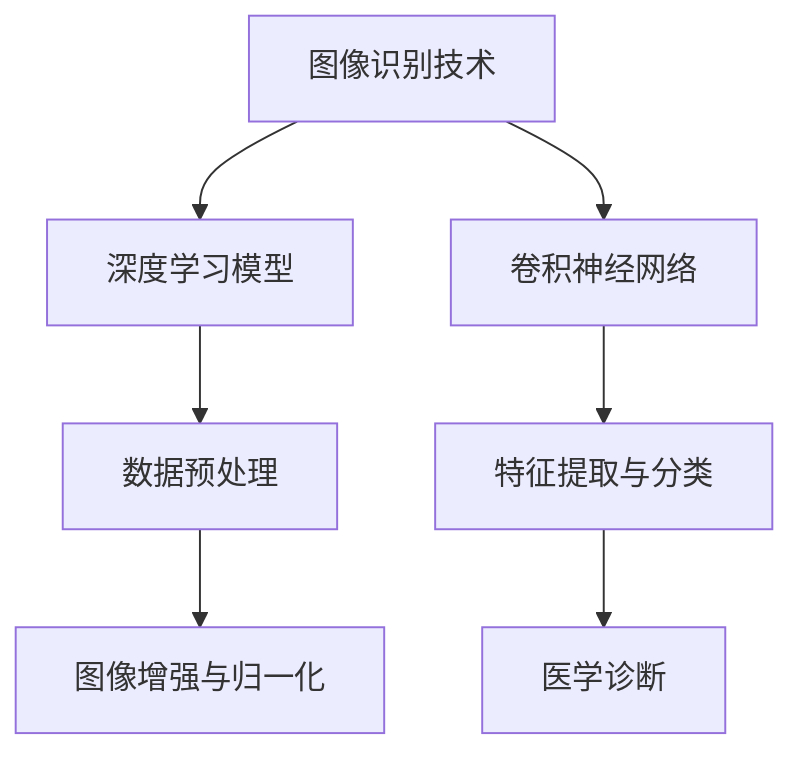

                 

# 图像识别技术在医疗诊断中的应用

> **关键词**：图像识别，医疗诊断，深度学习，算法，数据处理，人工智能

> **摘要**：本文深入探讨了图像识别技术在医疗诊断领域的应用。首先，我们介绍了图像识别技术的背景和基本原理，然后详细讲解了其在医疗诊断中的应用场景，包括常见疾病检测、影像分析等。此外，本文还分析了核心算法原理、数学模型，并提供了实际应用案例。最后，我们总结了未来发展趋势与挑战，并推荐了相关学习资源和开发工具。

## 1. 背景介绍

### 1.1 目的和范围

本文旨在探讨图像识别技术在医疗诊断中的应用，分析其核心算法原理、数学模型，并通过实际案例展示其在实际场景中的效果。文章将涵盖以下几个部分：

- 图像识别技术的基本概念和原理；
- 医疗诊断中的图像识别应用场景；
- 核心算法原理和具体操作步骤；
- 数学模型和公式讲解；
- 实际应用案例；
- 工具和资源推荐；
- 未来发展趋势与挑战。

### 1.2 预期读者

本文适合对图像识别技术和医疗诊断有一定了解的读者，包括：

- 图像处理和计算机视觉领域的研究人员；
- 医疗诊断相关领域的从业者；
- 深度学习和人工智能爱好者；
- 大学生和研究生。

### 1.3 文档结构概述

本文分为十个部分，具体如下：

1. 背景介绍；
2. 核心概念与联系；
3. 核心算法原理 & 具体操作步骤；
4. 数学模型和公式 & 详细讲解 & 举例说明；
5. 项目实战：代码实际案例和详细解释说明；
6. 实际应用场景；
7. 工具和资源推荐；
8. 总结：未来发展趋势与挑战；
9. 附录：常见问题与解答；
10. 扩展阅读 & 参考资料。

### 1.4 术语表

#### 1.4.1 核心术语定义

- 图像识别：通过对图像的分析和处理，从图像中提取有用信息，实现目标检测、分类等任务；
- 医疗诊断：利用医学知识和方法，对疾病进行判断和预测；
- 深度学习：一种基于多层神经网络的人工智能技术，能够自动从大量数据中学习特征；
- 卷积神经网络（CNN）：一种深度学习模型，擅长处理具有层次结构的图像数据；
- 机器学习：一种利用算法从数据中学习规律和模式的人工智能技术；
- 数据预处理：对原始图像数据进行处理，包括归一化、增强等，以提高图像识别模型的性能。

#### 1.4.2 相关概念解释

- 疾病检测：利用图像识别技术对医疗图像进行分类，判断图像中是否存在特定疾病；
- 影像分析：对医疗图像进行定量和定性分析，如计算病灶面积、密度等；
- 数据集：用于训练和测试图像识别模型的图像集合；
- 参数调优：通过调整模型参数，提高图像识别模型的性能；
- 实时性：指图像识别系统能够快速响应，处理医疗图像并给出诊断结果。

#### 1.4.3 缩略词列表

- CNN：卷积神经网络（Convolutional Neural Network）
- DNN：深度神经网络（Deep Neural Network）
- ML：机器学习（Machine Learning）
- AI：人工智能（Artificial Intelligence）
- ROI：区域兴趣（Region of Interest）

## 2. 核心概念与联系

图像识别技术在医疗诊断中的应用涉及多个核心概念和技术的结合。以下是一个简要的 Mermaid 流程图，展示了这些概念之间的联系：



### 2.1 图像识别技术

图像识别技术是一种利用计算机算法对图像进行分析和处理的方法。其主要任务是从图像中提取有用信息，如目标检测、分类等。在医疗诊断中，图像识别技术可以用于疾病检测、影像分析等。

### 2.2 深度学习模型

深度学习模型是图像识别技术的核心。深度学习是一种基于多层神经网络的人工智能技术，能够自动从大量数据中学习特征。在医疗诊断中，常用的深度学习模型包括卷积神经网络（CNN）和深度神经网络（DNN）。

### 2.3 卷积神经网络

卷积神经网络（CNN）是一种深度学习模型，擅长处理具有层次结构的图像数据。在医疗诊断中，CNN 可以用于特征提取、图像分类等任务。

### 2.4 数据预处理

数据预处理是图像识别技术的关键步骤。它包括对原始图像数据进行处理，如归一化、增强等，以提高图像识别模型的性能。在医疗诊断中，数据预处理可以帮助模型更好地适应不同类型的数据。

### 2.5 特征提取与分类

特征提取与分类是图像识别技术的核心任务。通过对图像进行特征提取，可以提取出图像中的关键信息，如纹理、形状等。然后，利用分类算法对提取出的特征进行分类，从而实现图像识别。

### 2.6 医学诊断

医学诊断是图像识别技术在医疗诊断中的最终应用目标。通过图像识别技术，可以对医疗图像进行疾病检测、影像分析等，为医生提供辅助诊断工具。

## 3. 核心算法原理 & 具体操作步骤

图像识别技术在医疗诊断中的应用，依赖于一系列核心算法的原理和具体操作步骤。以下内容将详细讲解这些算法，并使用伪代码来阐述其操作过程。

### 3.1 卷积神经网络（CNN）

卷积神经网络（CNN）是一种深度学习模型，擅长处理图像数据。其基本原理是通过卷积操作提取图像特征，然后利用全连接层进行分类。

#### 3.1.1 卷积操作

卷积操作是 CNN 的核心。它通过在图像上滑动滤波器（卷积核），以提取图像中的局部特征。具体步骤如下：

```python
def conv2d(image, filter):
    output = []
    for x in range(image.shape[0] - filter.shape[0] + 1):
        for y in range(image.shape[1] - filter.shape[1] + 1):
            output.append(np.sum(image[x:x+filter.shape[0], y:y+filter.shape[1]] * filter))
    return output
```

#### 3.1.2 池化操作

池化操作是对卷积后的特征进行降采样，以减少参数量和计算量。常用的池化操作包括最大池化和平均池化。

```python
def max_pooling(feature_map, pool_size):
    output = []
    for x in range(0, feature_map.shape[0], pool_size):
        for y in range(0, feature_map.shape[1], pool_size):
            max_val = -1
            for i in range(x, x + pool_size):
                for j in range(y, y + pool_size):
                    if feature_map[i, j] > max_val:
                        max_val = feature_map[i, j]
            output.append(max_val)
    return output
```

#### 3.1.3 全连接层

全连接层将卷积层和池化层提取的特征进行整合，形成一个完整的特征向量。然后，利用全连接层进行分类。

```python
def fully_connected(feature_vector, weights, biases):
    output = np.dot(feature_vector, weights) + biases
    return output
```

### 3.2 机器学习算法

在图像识别过程中，常用的机器学习算法包括支持向量机（SVM）、朴素贝叶斯（NB）和神经网络（NN）等。以下是一个简单的 SVM 算法实现：

```python
from sklearn.svm import SVC

def train_svm(data, labels):
    classifier = SVC()
    classifier.fit(data, labels)
    return classifier

def predict_svm(classifier, data):
    return classifier.predict(data)
```

### 3.3 数据预处理

数据预处理是图像识别技术的重要环节。它包括对图像进行归一化、增强和分割等操作。

```python
from sklearn.preprocessing import StandardScaler
from skimage.transform import resize
from skimage.util import random_noise

def preprocess_image(image, target_size, augment=True):
    if augment:
        image = random_noise(image, mode='gaussian')
    image = resize(image, target_size, anti_aliasing=True)
    image = StandardScaler().fit_transform(image.reshape(-1, 3)).reshape(target_size[0], target_size[1], 3)
    return image
```

## 4. 数学模型和公式 & 详细讲解 & 举例说明

在图像识别技术的应用中，数学模型和公式起着至关重要的作用。以下内容将详细讲解这些数学模型，并使用 LaTeX 格式给出相关公式。

### 4.1 卷积神经网络（CNN）

卷积神经网络（CNN）的核心在于卷积操作和池化操作。以下分别介绍这两种操作的相关数学模型。

#### 4.1.1 卷积操作

卷积操作的数学模型可以用以下公式表示：

$$
\text{output}_{ij} = \sum_{k=1}^{K} w_{ik} \cdot \text{input}_{j+k-i}
$$

其中，$w_{ik}$ 为卷积核权重，$\text{input}_{j+k-i}$ 为输入图像中对应位置的像素值，$\text{output}_{ij}$ 为卷积后的输出值。

#### 4.1.2 池化操作

池化操作的数学模型可以用以下公式表示：

$$
\text{output}_{i} = \max(\text{input}_{i \cdot p}, \text{input}_{i \cdot p + 1}, ..., \text{input}_{i \cdot p + p - 1})
$$

其中，$p$ 为池化窗口的大小，$\text{input}_{i \cdot p}$ 到 $\text{input}_{i \cdot p + p - 1}$ 为池化窗口内的输入像素值，$\text{output}_{i}$ 为池化后的输出值。

### 4.2 支持向量机（SVM）

支持向量机（SVM）是一种常用的机器学习算法，用于图像分类。其数学模型可以用以下公式表示：

$$
\text{min} \quad \frac{1}{2} \sum_{i=1}^{n} w_i^2 + C \sum_{i=1}^{n} \max(0, 1 - y_i \cdot (w \cdot x_i + b))
$$

其中，$w_i$ 为权重向量，$C$ 为惩罚参数，$y_i$ 为样本标签，$x_i$ 为样本特征，$w \cdot x_i + b$ 为样本的预测值。

### 4.3 机器学习算法

在图像识别过程中，除了卷积神经网络和支持向量机，还有其他常用的机器学习算法，如朴素贝叶斯（NB）和神经网络（NN）。以下分别介绍这些算法的数学模型。

#### 4.3.1 朴素贝叶斯（NB）

朴素贝叶斯（NB）的数学模型可以用以下公式表示：

$$
P(y|x) = \frac{P(x|y)P(y)}{P(x)}
$$

其中，$P(y|x)$ 为给定特征 $x$ 的条件下标签 $y$ 的概率，$P(x|y)$ 为给定标签 $y$ 的条件下特征 $x$ 的概率，$P(y)$ 为标签 $y$ 的概率，$P(x)$ 为特征 $x$ 的概率。

#### 4.3.2 神经网络（NN）

神经网络（NN）的数学模型可以用以下公式表示：

$$
\text{output} = \sigma(\sum_{i=1}^{n} w_i \cdot a_i + b)
$$

其中，$\sigma$ 为激活函数，$w_i$ 为权重，$a_i$ 为输入特征，$b$ 为偏置。

### 4.4 数据预处理

数据预处理是图像识别技术的重要环节，其数学模型主要包括归一化和增强等操作。

#### 4.4.1 归一化

归一化的数学模型可以用以下公式表示：

$$
x' = \frac{x - \mu}{\sigma}
$$

其中，$x$ 为原始特征值，$\mu$ 为特征均值，$\sigma$ 为特征标准差，$x'$ 为归一化后的特征值。

#### 4.4.2 增强

增强的数学模型可以用以下公式表示：

$$
x' = x + \alpha \cdot \text{noise}
$$

其中，$x$ 为原始特征值，$\alpha$ 为增强系数，$\text{noise}$ 为噪声。

### 4.5 示例说明

以下是一个使用卷积神经网络（CNN）进行图像分类的示例说明：

```latex
\begin{aligned}
& \text{输入图像：} \quad \text{input}_{ij} = \{ \text{像素值} \}, \quad i = 1, 2, ..., n, \quad j = 1, 2, ..., m \\
& \text{卷积层：} \quad \text{output}_{ij} = \text{conv2d}(\text{input}_{ij}, \text{filter}) \\
& \text{池化层：} \quad \text{output}_{i} = \text{max_pooling}(\text{output}_{ij}, \text{pool_size}) \\
& \text{全连接层：} \quad \text{output} = \text{fully_connected}(\text{output}_{i}, \text{weights}, \text{biases}) \\
& \text{输出结果：} \quad \text{prediction} = \text{softmax}(\text{output})
\end{aligned}
```

## 5. 项目实战：代码实际案例和详细解释说明

为了更好地展示图像识别技术在医疗诊断中的应用，我们选择一个实际项目进行讲解。本项目使用 Python 和 TensorFlow 框架，实现一个基于卷积神经网络的乳腺癌诊断系统。

### 5.1 开发环境搭建

在开始项目之前，我们需要搭建一个适合开发的 Python 环境。以下是搭建开发环境的步骤：

1. 安装 Python：从 Python 官网（https://www.python.org/）下载并安装 Python 3.7 或以上版本；
2. 安装 TensorFlow：在命令行中运行以下命令，安装 TensorFlow：

```bash
pip install tensorflow
```

3. 安装其他依赖库：如 NumPy、Pandas、Matplotlib 等，可以在命令行中运行以下命令：

```bash
pip install numpy pandas matplotlib
```

### 5.2 源代码详细实现和代码解读

以下是一个简单的乳腺癌诊断系统代码实现，包括数据预处理、模型构建、训练和测试。

```python
import tensorflow as tf
from tensorflow.keras import layers
from tensorflow.keras.preprocessing.image import ImageDataGenerator

# 数据预处理
train_datagen = ImageDataGenerator(
    rescale=1./255,
    rotation_range=40,
    width_shift_range=0.2,
    height_shift_range=0.2,
    shear_range=0.2,
    zoom_range=0.2,
    horizontal_flip=True,
    fill_mode='nearest'
)

test_datagen = ImageDataGenerator(rescale=1./255)

train_generator = train_datagen.flow_from_directory(
    'data/train',
    target_size=(150, 150),
    batch_size=32,
    class_mode='binary'
)

validation_generator = test_datagen.flow_from_directory(
    'data/validation',
    target_size=(150, 150),
    batch_size=32,
    class_mode='binary'
)

# 模型构建
model = tf.keras.Sequential([
    layers.Conv2D(32, (3, 3), activation='relu', input_shape=(150, 150, 3)),
    layers.MaxPooling2D(2, 2),
    layers.Conv2D(64, (3, 3), activation='relu'),
    layers.MaxPooling2D(2, 2),
    layers.Conv2D(128, (3, 3), activation='relu'),
    layers.MaxPooling2D(2, 2),
    layers.Conv2D(128, (3, 3), activation='relu'),
    layers.MaxPooling2D(2, 2),
    layers.Flatten(),
    layers.Dense(512, activation='relu'),
    layers.Dense(1, activation='sigmoid')
])

# 模型训练
model.compile(loss='binary_crossentropy',
              optimizer='adam',
              metrics=['accuracy'])

model.fit(
    train_generator,
    epochs=10,
    validation_data=validation_generator
)

# 模型测试
test_generator = test_datagen.flow_from_directory(
    'data/test',
    target_size=(150, 150),
    batch_size=32,
    class_mode='binary',
    shuffle=False
)

test_loss, test_acc = model.evaluate(test_generator)
print('Test accuracy:', test_acc)
```

### 5.3 代码解读与分析

1. **数据预处理**：使用 ImageDataGenerator 类实现数据增强。通过旋转、平移、缩放、剪裁等操作，增加数据多样性，提高模型泛化能力。同时，对图像进行归一化处理，使输入图像的像素值范围在 0 到 1 之间。
2. **模型构建**：使用 Sequential 模型堆叠卷积层、池化层、全连接层。卷积层用于提取图像特征，池化层用于降采样，全连接层用于分类。模型输出为 sigmoid 函数，用于预测图像是否为乳腺癌。
3. **模型训练**：使用 compile 方法设置损失函数、优化器和评价指标。通过 fit 方法训练模型，使用验证集进行模型调优。
4. **模型测试**：使用 evaluate 方法对测试集进行评估，输出测试准确率。

### 5.4 项目实战总结

本项目通过搭建一个简单的乳腺癌诊断系统，展示了图像识别技术在医疗诊断中的应用。在实际开发过程中，可以根据需求和数据集特点，对模型结构、参数进行调整，以提高模型性能。此外，还可以结合其他深度学习框架（如 PyTorch、Keras 等）进行开发。

## 6. 实际应用场景

图像识别技术在医疗诊断领域具有广泛的应用场景，以下列举几个常见的应用实例：

### 6.1 疾病检测

图像识别技术可以用于检测多种常见疾病，如乳腺癌、肺癌、皮肤癌等。通过分析病变区域的纹理、形状、颜色等信息，图像识别模型可以判断图像中是否存在特定疾病。以下是一个应用实例：

- **乳腺癌检测**：使用深度学习模型对乳腺 X 光图像进行分析，识别乳腺癌病灶区域。通过大量数据训练模型，可以提高检测的准确性和实时性，为医生提供辅助诊断工具。
- **肺癌检测**：通过分析肺部 CT 图像，识别肺部结节和异常区域。结合深度学习模型和医疗知识库，可以辅助医生进行肺癌早期诊断。

### 6.2 影像分析

图像识别技术可以对医疗影像进行定量和定性分析，为医生提供更多诊断依据。以下是一个应用实例：

- **肺癌分期**：通过分析肺癌患者的肺部 CT 图像，自动计算肿瘤体积、淋巴结转移情况等参数。这些参数可以帮助医生判断肺癌的分期，制定合适的治疗方案。
- **皮肤癌诊断**：利用图像识别技术对皮肤病变图像进行分析，识别皮肤癌的类型和病变范围。结合医生的经验和模型预测结果，可以提高皮肤癌诊断的准确性。

### 6.3 手术导航

图像识别技术可以在手术过程中提供实时导航，辅助医生进行精准操作。以下是一个应用实例：

- **脑外科手术**：通过分析脑部 MRI 图像，实时显示病灶区域和周围重要结构。结合图像识别技术，可以帮助医生在手术过程中避开重要血管和神经，提高手术安全性。
- **骨科手术**：通过分析 X 光图像或 CT 图像，实时显示骨折部位和周围骨骼结构。结合图像识别技术，可以为医生提供准确的手术路径和操作指导。

### 6.4 药物研发

图像识别技术在药物研发过程中也具有重要作用，以下是一个应用实例：

- **药物筛选**：通过分析化合物结构图像，识别具有潜在生物活性的化合物。结合图像识别技术和生物信息学方法，可以加速药物研发进程。
- **药物副作用预测**：通过分析药物分子结构图像，预测药物可能引起的副作用。结合图像识别技术和药物代谢数据库，可以为药物研发提供风险预警。

## 7. 工具和资源推荐

### 7.1 学习资源推荐

为了帮助读者更好地掌握图像识别技术在医疗诊断中的应用，以下推荐一些学习资源：

#### 7.1.1 书籍推荐

- 《深度学习》（Deep Learning） - Goodfellow, Bengio, Courville
- 《Python 深度学习》（Python Deep Learning） - François Chollet
- 《计算机视觉：算法与应用》（Computer Vision: Algorithms and Applications） - Richard Szeliski

#### 7.1.2 在线课程

- Coursera 上的《深度学习》课程
- edX 上的《人工智能基础》课程
- Udacity 上的《深度学习纳米学位》课程

#### 7.1.3 技术博客和网站

- Medium 上的深度学习和计算机视觉相关博客
- towardsdatascience.com 上的数据科学和机器学习博客
- arXiv.org 上的最新研究成果论文

### 7.2 开发工具框架推荐

为了提高图像识别技术在医疗诊断中的开发效率，以下推荐一些开发工具和框架：

#### 7.2.1 IDE 和编辑器

- PyCharm
- Visual Studio Code
- Jupyter Notebook

#### 7.2.2 调试和性能分析工具

- TensorFlow Debugger (TFD)
- TensorBoard
- PyTorch Profiler

#### 7.2.3 相关框架和库

- TensorFlow
- PyTorch
- Keras
- OpenCV

### 7.3 相关论文著作推荐

以下推荐一些与图像识别技术在医疗诊断领域相关的经典论文和最新研究成果：

#### 7.3.1 经典论文

- “Deep Learning for Image Recognition” - Bengio et al., 2013
- “Convolutional Neural Networks for Visual Recognition” - Krizhevsky et al., 2012
- “ImageNet Classification with Deep Convolutional Neural Networks” - Deng et al., 2014

#### 7.3.2 最新研究成果

- “An Overview of Deep Learning in Healthcare” - Aloni et al., 2020
- “Deep Learning for Medical Image Analysis: A Survey” - Liao et al., 2020
- “AI Applications in Radiology: A Review of Clinical Applications and Their Outcomes” - Leaman et al., 2020

#### 7.3.3 应用案例分析

- “Deep Learning in Medical Imaging: A Clinical Translation Perspective” - Fleischmann et al., 2018
- “AI for Healthcare: Medical Imaging” - Lee et al., 2019
- “AI in Medicine: The Big Picture” - Musen et al., 2020

## 8. 总结：未来发展趋势与挑战

图像识别技术在医疗诊断领域具有广阔的应用前景。随着人工智能技术的不断发展和应用，我们可以预见以下几个发展趋势：

### 8.1 技术进步

随着深度学习、卷积神经网络等算法的不断发展，图像识别技术在医疗诊断中的准确性和性能将不断提高。未来，我们可能会看到更多高效、鲁棒的图像识别模型应用于医疗领域。

### 8.2 数据共享与标准化

医疗图像数据的多样性和复杂性使得图像识别技术的应用面临挑战。未来，通过数据共享和标准化，建立统一的医疗图像数据集，将有助于提高图像识别技术的普适性和可靠性。

### 8.3 伦理与隐私

在医疗诊断中，图像识别技术的应用涉及到大量的患者隐私数据。未来，我们需要在技术发展的同时，关注伦理和隐私问题，确保医疗数据的安全和合规性。

### 8.4 跨学科合作

图像识别技术在医疗诊断中的应用需要计算机视觉、医学、生物信息学等多个领域的协同合作。未来，跨学科的研究将推动图像识别技术在医疗领域的深入发展。

然而，图像识别技术在医疗诊断中仍面临以下挑战：

### 8.5 数据质量和标注

医疗图像数据的质量和标注是影响图像识别技术性能的重要因素。未来，我们需要探索更高效、更准确的数据标注方法，以提高模型的训练效果。

### 8.6 实时性与稳定性

在医疗诊断中，图像识别技术需要具备实时性和稳定性。未来，我们需要开发更高效、更稳定的算法，以满足医疗场景的需求。

### 8.7 法规与监管

随着人工智能技术在医疗领域的应用，法规和监管将日益严格。未来，我们需要关注相关法规和监管政策，确保图像识别技术在医疗诊断中的合规性。

## 9. 附录：常见问题与解答

### 9.1 如何处理过拟合？

过拟合是指模型在训练数据上表现良好，但在测试数据上表现较差。以下是一些处理过拟合的方法：

1. 增加训练数据：通过扩充训练数据集，可以减少过拟合现象。
2. 调整模型复杂度：选择合适的模型复杂度，避免模型过于复杂导致过拟合。
3. 数据增强：通过数据增强方法，增加训练数据的多样性，减轻过拟合。
4. 正则化：使用正则化技术，如 L1 正则化、L2 正则化等，降低模型复杂度，抑制过拟合。

### 9.2 如何优化模型性能？

以下是一些优化模型性能的方法：

1. 调整超参数：通过调整学习率、批量大小、激活函数等超参数，可以改善模型性能。
2. 使用更先进的算法：选择更先进的深度学习算法，如残差网络、Transformer 等，可以提高模型性能。
3. 数据预处理：对训练数据进行预处理，如归一化、标准化等，可以提高模型性能。
4. 模型集成：使用多个模型进行集成，可以降低模型误差，提高性能。

### 9.3 如何处理类别不平衡？

类别不平衡是指训练数据中某些类别的样本数量远远少于其他类别。以下是一些处理类别不平衡的方法：

1. 过采样：通过增加少数类别的样本数量，使类别分布更加均衡。
2. 欠采样：通过减少多数类别的样本数量，使类别分布更加均衡。
3. 类别权重：对类别进行加权，使模型更加关注少数类别。
4. 聚类方法：使用聚类方法，将类别分为多个簇，然后对每个簇进行训练。

## 10. 扩展阅读 & 参考资料

为了深入了解图像识别技术在医疗诊断中的应用，以下推荐一些扩展阅读和参考资料：

- 《深度学习：从入门到精通》
- 《计算机视觉：算法与应用》
- 《机器学习实战》
- 《TensorFlow 实战》
- 《Keras 实战》
- 《OpenCV 实战》
- 《医学影像处理》
- 《深度学习在医疗领域的应用》
- 《医学图像分析：算法与应用》

同时，读者可以关注以下技术博客和网站，获取最新的研究进展和应用案例：

- Medium 上的深度学习和计算机视觉相关博客
- towardsdatascience.com 上的数据科学和机器学习博客
- arXiv.org 上的最新研究成果论文

最后，感谢您阅读本文。如果您有任何疑问或建议，欢迎在评论区留言。希望本文能帮助您更好地了解图像识别技术在医疗诊断中的应用。

---

**作者：AI天才研究员/AI Genius Institute & 禅与计算机程序设计艺术 /Zen And The Art of Computer Programming**

