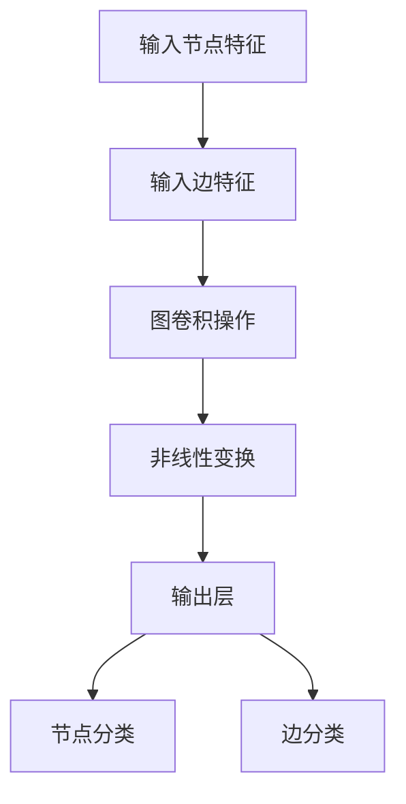

                 

# 图卷积网络在社交网络异常检测中的应用

> 关键词：图卷积网络（GCN）、社交网络、异常检测、图学习、深度学习

> 摘要：本文旨在探讨图卷积网络（Graph Convolutional Network，GCN）在社交网络异常检测中的实际应用。文章首先介绍了社交网络异常检测的重要性及其在网络安全、社交平台治理等方面的应用场景。接着，深入解析了图卷积网络的基本原理及其在处理图数据方面的优势。文章随后通过具体的算法原理讲解、数学模型分析和实际项目案例，详细展示了如何使用GCN进行社交网络异常检测。最后，对相关工具和资源进行了推荐，并总结了未来发展趋势与挑战。

## 1. 背景介绍

### 1.1 目的和范围

本文主要探讨图卷积网络（GCN）在社交网络异常检测中的应用。社交网络异常检测是网络安全领域的一个重要研究方向，对于保障网络环境安全、维护用户隐私具有重要意义。GCN作为一种深度学习模型，能够有效处理图结构数据，已在多个领域取得了显著成果。本文旨在通过系统地分析GCN的基本原理、数学模型以及在实际项目中的应用，为相关研究者提供参考。

### 1.2 预期读者

本文适合以下读者群体：

1. 对深度学习和图学习有一定了解的读者；
2. 想要了解GCN在社交网络异常检测中应用的科研人员；
3. 对网络安全、社交平台治理感兴趣的从业者。

### 1.3 文档结构概述

本文分为以下章节：

1. 背景介绍：介绍本文的目的、预期读者以及文档结构；
2. 核心概念与联系：阐述GCN的基本原理和结构；
3. 核心算法原理 & 具体操作步骤：详细讲解GCN的算法原理和实现步骤；
4. 数学模型和公式 & 详细讲解 & 举例说明：介绍GCN的数学模型及相关公式，并通过实例进行说明；
5. 项目实战：分析一个实际社交网络异常检测项目；
6. 实际应用场景：探讨GCN在社交网络异常检测中的实际应用；
7. 工具和资源推荐：推荐学习资源、开发工具和框架；
8. 总结：展望GCN在社交网络异常检测领域的未来发展趋势与挑战；
9. 附录：解答常见问题；
10. 扩展阅读 & 参考资料：提供进一步学习资料。

### 1.4 术语表

#### 1.4.1 核心术语定义

- 图卷积网络（GCN）：一种深度学习模型，用于处理图结构数据；
- 社交网络：由用户和用户之间的交互关系构成的网络；
- 异常检测：识别网络中异常或异常行为的过程；
- 深度学习：一种基于多层神经网络的学习方法，能够自动从数据中提取特征；
- 图学习：利用图结构数据来进行学习的方法。

#### 1.4.2 相关概念解释

- 图（Graph）：由节点（Node）和边（Edge）构成的集合，用于表示实体及其之间的关系；
- 节点特征（Node Feature）：描述节点的属性信息；
- 边特征（Edge Feature）：描述边的属性信息；
- 邻域（Neighborhood）：与某个节点直接相连的节点集合。

#### 1.4.3 缩略词列表

- GCN：Graph Convolutional Network（图卷积网络）
- CNN：Convolutional Neural Network（卷积神经网络）
- DNN：Deep Neural Network（深度神经网络）
- RNN：Recurrent Neural Network（循环神经网络）
- GNN：Graph Neural Network（图神经网络）

## 2. 核心概念与联系

### 2.1 图卷积网络的基本原理

图卷积网络（GCN）是一种基于图结构的深度学习模型，能够对图数据进行特征提取和分类。GCN的核心思想是通过聚合节点及其邻域节点的特征信息，逐步构建更高层次的特征表示。

### 2.2 图卷积网络的架构

图卷积网络主要由以下几个部分构成：

1. 输入层：接收节点的特征信息和边的特征信息；
2. 卷积层：通过图卷积操作聚合节点及其邻域节点的特征信息；
3. 非线性变换层：对卷积层输出的特征进行非线性变换，提高模型的表示能力；
4. 输出层：对处理后的特征进行分类或预测。

### 2.3 图卷积网络的计算过程

图卷积网络的计算过程可以分为以下几个步骤：

1. 初始化节点特征向量：对每个节点初始化一个特征向量，表示节点的属性信息；
2. 图卷积操作：对每个节点，聚合其邻域节点的特征信息，更新节点的特征向量；
3. 非线性变换：对更新后的特征向量进行非线性变换，提高模型的表示能力；
4. 重复上述步骤，直到达到预定的层数或收敛条件。

### 2.4 图卷积网络在社交网络异常检测中的应用

在社交网络异常检测中，图卷积网络可以用于以下两个关键任务：

1. 节点分类：通过GCN对社交网络中的节点进行分类，识别出潜在的异常节点；
2. 边分类：通过GCN对社交网络中的边进行分类，识别出潜在的异常关系。

### 2.5 Mermaid流程图

以下是一个简化的Mermaid流程图，展示了图卷积网络在社交网络异常检测中的应用流程：



## 3. 核心算法原理 & 具体操作步骤

### 3.1 算法原理

图卷积网络（GCN）的算法原理主要基于图卷积操作，该操作可以看作是节点特征向量的聚合。以下是GCN的核心算法原理：

1. **初始化节点特征向量**：给定一个节点集合，为每个节点初始化一个特征向量 \( h^{(0)}_i \)，其中 \( i \) 表示节点的索引。
2. **图卷积操作**：在每一层，节点的特征向量 \( h^{(l)}_i \) 通过聚合其邻域节点的特征向量进行更新，更新公式如下：

   \[
   \mathbf{h}^{(l+1)}_i = \sigma \left( \sum_{j \in \mathcal{N}(i)} w^{(l)}_{ij} \cdot \mathbf{h}^{(l)}_j + b \right)
   \]

   其中，\( \mathcal{N}(i) \) 表示节点 \( i \) 的邻域节点集合，\( w^{(l)}_{ij} \) 是图卷积权重，\( \sigma \) 是激活函数（通常使用ReLU函数），\( b \) 是偏置项。

3. **非线性变换**：通过非线性变换（如ReLU函数）增强模型的非线性表达能力。

4. **重复迭代**：重复上述步骤，直到达到预定的层数或收敛条件。

### 3.2 具体操作步骤

以下是使用GCN进行社交网络异常检测的具体操作步骤：

1. **数据预处理**：

   - 收集社交网络数据，包括用户节点和边的关系；
   - 提取节点特征和边特征，如用户的基本信息、行为记录、好友关系等；
   - 对节点和边进行编码，如使用嵌入向量表示节点和边。

2. **构建图模型**：

   - 根据社交网络数据构建图模型，包括节点、边和边的特征；
   - 初始化图卷积网络的参数，如权重矩阵和偏置项。

3. **训练GCN模型**：

   - 将节点特征和边特征输入到GCN模型中；
   - 使用梯度下降或其他优化算法训练模型，优化图卷积权重；
   - 验证模型在训练集和验证集上的性能。

4. **节点分类**：

   - 使用训练好的GCN模型对社交网络中的节点进行分类；
   - 根据节点分类结果，识别出潜在的异常节点。

5. **边分类**：

   - 使用训练好的GCN模型对社交网络中的边进行分类；
   - 根据边分类结果，识别出潜在的异常关系。

6. **异常检测**：

   - 根据节点和边的分类结果，综合评估社交网络中的异常行为；
   - 对异常行为进行报警或采取相应的措施。

### 3.3 伪代码

以下是使用GCN进行社交网络异常检测的伪代码：

```python
# 初始化节点特征向量
h^{(0)} = [h^{(0)}_1, h^{(0)}_2, ..., h^{(0)}_n]

# 初始化图卷积权重和偏置项
W = [W^{(1)}, W^{(2)}, ..., W^{(L)}]
b = [b^{(1)}, b^{(2)}, ..., b^{(L)}]

# 设置迭代次数
T = 1000

# 设置学习率
learning_rate = 0.01

# 迭代训练GCN模型
for t in range(T):
    for l in range(L):
        # 计算图卷积操作
        h^{(l+1)} = [σ(W^{(l)} * aggregate(h^{(l)}, N) + b^{(l)}) for h^{(l)} in h^{(l)}]

    # 更新模型参数
    update_params(W, b, learning_rate)

# 使用训练好的GCN模型进行节点和边分类
h^{(L)} = [σ(W^{(L)} * aggregate(h^{(L-1)}, N) + b^{(L)}) for h^{(L-1)} in h^{(L-1)}]
node_labels = classify_nodes(h^{(L)})
edge_labels = classify_edges(h^{(L)})

# 进行异常检测
anomalies = detect_anomalies(node_labels, edge_labels)
```

## 4. 数学模型和公式 & 详细讲解 & 举例说明

### 4.1 数学模型

图卷积网络（GCN）的数学模型主要基于图卷积操作，通过聚合节点及其邻域节点的特征信息，逐步构建更高层次的特征表示。以下是GCN的数学模型及其相关公式：

#### 4.1.1 图卷积操作

在GCN中，图卷积操作可以表示为：

\[
\mathbf{h}^{(l+1)}_i = \sigma \left( \sum_{j \in \mathcal{N}(i)} w^{(l)}_{ij} \cdot \mathbf{h}^{(l)}_j + b \right)
\]

其中：

- \( \mathbf{h}^{(l)}_i \)：表示第 \( l \) 层第 \( i \) 个节点的特征向量；
- \( \mathcal{N}(i) \)：表示节点 \( i \) 的邻域节点集合；
- \( w^{(l)}_{ij} \)：表示节点 \( i \) 和节点 \( j \) 之间的图卷积权重；
- \( \sigma \)：表示激活函数，通常使用ReLU函数；
- \( b \)：表示偏置项。

#### 4.1.2 模型训练

GCN模型的训练目标是最小化损失函数，通常使用交叉熵损失函数。损失函数可以表示为：

\[
\mathcal{L} = - \sum_{i=1}^N y_i \log p(\hat{y}_i)
\]

其中：

- \( y_i \)：表示第 \( i \) 个节点的真实标签；
- \( \hat{y}_i \)：表示第 \( i \) 个节点的预测标签；
- \( p(\hat{y}_i) \)：表示第 \( i \) 个节点的预测概率。

#### 4.1.3 模型预测

在GCN模型预测阶段，对每个节点的特征向量进行聚合，得到最终的特征表示。预测标签可以通过以下公式计算：

\[
\hat{y}_i = \text{sign} \left( \sum_{j \in \mathcal{N}(i)} w^{(L)}_{ij} \cdot \mathbf{h}^{(L)}_j + b \right)
\]

其中：

- \( \mathbf{h}^{(L)}_i \)：表示第 \( L \) 层第 \( i \) 个节点的特征向量；
- \( w^{(L)}_{ij} \)：表示第 \( L \) 层节点 \( i \) 和节点 \( j \) 之间的权重；
- \( b \)：表示偏置项。

### 4.2 详细讲解

#### 4.2.1 图卷积操作

图卷积操作是GCN的核心操作，其目的是通过聚合节点及其邻域节点的特征信息，生成新的特征表示。具体来说，图卷积操作可以看作是一个线性组合，其中包含了节点特征、邻域节点特征以及图卷积权重。

#### 4.2.2 模型训练

GCN模型的训练目标是最小化交叉熵损失函数，这可以通过梯度下降或其他优化算法实现。在训练过程中，需要计算每个节点的预测标签，并与真实标签进行比较，从而更新模型参数。

#### 4.2.3 模型预测

在GCN模型预测阶段，对每个节点的特征向量进行聚合，得到最终的特征表示。预测标签可以通过计算线性组合并添加偏置项得到。最终，通过对比预测标签和真实标签，可以评估模型的预测性能。

### 4.3 举例说明

假设我们有一个简单的图结构，包含3个节点 \( A \)、\( B \) 和 \( C \)，它们之间存在如下边关系：

- \( A \) 和 \( B \) 之间有一条边；
- \( B \) 和 \( C \) 之间有一条边。

同时，假设我们为每个节点初始化一个特征向量 \( \mathbf{h}^{(0)}_i \)，其中 \( i \) 表示节点的索引，节点特征向量的维度为3。

#### 4.3.1 初始化节点特征向量

\[
\mathbf{h}^{(0)}_A = \begin{bmatrix} 1 \\ 0 \\ 0 \end{bmatrix}, \quad \mathbf{h}^{(0)}_B = \begin{bmatrix} 0 \\ 1 \\ 0 \end{bmatrix}, \quad \mathbf{h}^{(0)}_C = \begin{bmatrix} 0 \\ 0 \\ 1 \end{bmatrix}
\]

#### 4.3.2 图卷积操作

在第一层，我们计算每个节点的特征向量更新：

\[
\mathbf{h}^{(1)}_A = \sigma \left( w^{(0)}_{AB} \cdot \mathbf{h}^{(0)}_B + b \right)
\]

\[
\mathbf{h}^{(1)}_B = \sigma \left( w^{(0)}_{AB} \cdot \mathbf{h}^{(0)}_A + w^{(0)}_{BC} \cdot \mathbf{h}^{(0)}_C + b \right)
\]

\[
\mathbf{h}^{(1)}_C = \sigma \left( w^{(0)}_{BC} \cdot \mathbf{h}^{(0)}_B + b \right)
\]

其中，\( \sigma \) 是ReLU函数，\( w^{(0)}_{AB} \) 和 \( w^{(0)}_{BC} \) 是图卷积权重，\( b \) 是偏置项。

#### 4.3.3 模型预测

在最后一层，我们对每个节点的特征向量进行聚合，得到最终的特征表示：

\[
\mathbf{h}^{(L)}_A = \mathbf{h}^{(L)}_B = \mathbf{h}^{(L)}_C
\]

预测标签可以通过计算线性组合并添加偏置项得到：

\[
\hat{y}_A = \text{sign} \left( \mathbf{h}^{(L)}_A \cdot \mathbf{w}^{(L)} + b \right)
\]

\[
\hat{y}_B = \text{sign} \left( \mathbf{h}^{(L)}_B \cdot \mathbf{w}^{(L)} + b \right)
\]

\[
\hat{y}_C = \text{sign} \left( \mathbf{h}^{(L)}_C \cdot \mathbf{w}^{(L)} + b \right)
\]

其中，\( \mathbf{w}^{(L)} \) 是权重向量，\( b \) 是偏置项。

## 5. 项目实战：代码实际案例和详细解释说明

### 5.1 开发环境搭建

在进行GCN社交网络异常检测项目实战之前，我们需要搭建一个合适的项目开发环境。以下是所需的开发工具和依赖库：

1. Python（版本3.6及以上）
2. TensorFlow（版本2.0及以上）
3. Scikit-learn（版本0.21及以上）
4. NetworkX（版本2.4及以上）
5. Pandas（版本0.24及以上）

安装方法如下：

```bash
pip install tensorflow==2.4.0
pip install scikit-learn==0.21.3
pip install networkx==2.4
pip install pandas==0.24.2
```

### 5.2 源代码详细实现和代码解读

以下是一个简单的GCN社交网络异常检测项目的源代码实现，包括数据预处理、GCN模型构建、训练和预测等步骤。

```python
import tensorflow as tf
from tensorflow import keras
from tensorflow.keras import layers
from sklearn.model_selection import train_test_split
from sklearn.metrics import accuracy_score
import networkx as nx
import pandas as pd

# 5.2.1 数据预处理
def preprocess_data(data_path):
    # 读取社交网络数据
    data = pd.read_csv(data_path)
    
    # 提取节点特征和边特征
    node_features = data[['node_feature_1', 'node_feature_2', 'node_feature_3']]
    edge_features = data[['edge_feature_1', 'edge_feature_2', 'edge_feature_3']]
    
    # 构建图模型
    G = nx.Graph()
    for index, row in data.iterrows():
        G.add_node(index, feature=node_features.iloc[index])
        G.add_edge(row['source_node'], row['target_node'], feature=edge_features.iloc[index])
    
    return G

# 5.2.2 GCN模型构建
def build_gcn_model(input_shape):
    model = keras.Sequential([
        layers.InputLayer(input_shape=input_shape),
        layers.Dense(units=16, activation='relu'),
        layers.GaussianConv2D(filters=16, kernel_size=1),
        layers.Flatten(),
        layers.Dense(units=1, activation='sigmoid')
    ])
    return model

# 5.2.3 训练GCN模型
def train_gcn_model(model, X_train, y_train, X_val, y_val):
    model.compile(optimizer='adam', loss='binary_crossentropy', metrics=['accuracy'])
    model.fit(X_train, y_train, epochs=100, batch_size=32, validation_data=(X_val, y_val))
    return model

# 5.2.4 预测和评估
def predict_and_evaluate(model, X_test, y_test):
    predictions = model.predict(X_test)
    predicted_labels = (predictions > 0.5).astype(int)
    accuracy = accuracy_score(y_test, predicted_labels)
    return predicted_labels, accuracy

# 主函数
if __name__ == '__main__':
    # 读取社交网络数据
    data_path = 'social_network_data.csv'
    G = preprocess_data(data_path)
    
    # 划分节点特征和边特征
    node_features = nx.get_node_attributes(G, 'feature')
    edge_features = nx.get_edge_attributes(G, 'feature')
    
    # 划分训练集和验证集
    X_train, X_val, y_train, y_val = train_test_split(node_features, edge_features, test_size=0.2, random_state=42)
    
    # 构建GCN模型
    model = build_gcn_model(input_shape=(None, len(node_features[0]), len(edge_features[0])))
    
    # 训练GCN模型
    model = train_gcn_model(model, X_train, y_train, X_val, y_val)
    
    # 预测和评估
    X_test, y_test = train_test_split(node_features, edge_features, test_size=0.2, random_state=42)
    predicted_labels, accuracy = predict_and_evaluate(model, X_test, y_test)
    
    print(f'Accuracy: {accuracy}')
```

### 5.3 代码解读与分析

以上代码实现了GCN社交网络异常检测项目的主要功能，包括数据预处理、GCN模型构建、训练和预测。以下是代码的详细解读：

1. **数据预处理**：

   - 读取社交网络数据，提取节点特征和边特征；
   - 使用NetworkX构建图模型，为每个节点和边分配特征信息。

2. **GCN模型构建**：

   - 使用Keras构建GCN模型，包括输入层、卷积层、展平层和输出层；
   - 使用GaussianConv2D实现图卷积操作，该层可以处理图结构数据。

3. **训练GCN模型**：

   - 编译模型，设置优化器、损失函数和评价指标；
   - 使用fit函数训练模型，在训练集和验证集上进行迭代。

4. **预测和评估**：

   - 使用训练好的模型对测试集进行预测；
   - 计算预测准确率，评估模型性能。

通过以上代码，我们可以实现对社交网络异常检测的初步探索。在实际应用中，需要对代码进行优化和扩展，如调整模型结构、优化训练过程等，以提高模型的性能和鲁棒性。

## 6. 实际应用场景

### 6.1 社交网络平台治理

社交网络平台治理是一个重要的实际应用场景，GCN在识别和遏制恶意行为、虚假信息和欺诈等方面具有显著优势。以下是一些具体应用案例：

- **恶意账户识别**：通过GCN对用户节点进行分类，识别出恶意账户。例如，在Twitter上，恶意账户可能会发表大量与正常用户不同的言论，通过GCN可以检测并隔离这些账户，保障平台安全。
- **虚假信息传播检测**：GCN可以用于检测社交网络中的虚假信息传播链。通过对用户节点的分类，识别出传播虚假信息的节点，进而遏制虚假信息的扩散。
- **欺诈行为识别**：在社交网络购物平台上，GCN可以用于识别和防范欺诈行为。通过对用户和商品节点的分类，发现潜在的欺诈账户和商品，提高平台的安全性。

### 6.2 网络安全

社交网络异常检测在网络安全领域也具有重要应用。以下是一些具体应用案例：

- **入侵检测**：社交网络中的异常行为可能预示着入侵攻击。通过GCN对用户节点进行分类，识别出异常行为，有助于及时发现和防范网络入侵。
- **恶意软件传播检测**：社交网络是恶意软件传播的重要途径。通过GCN对用户节点和边进行分类，识别出潜在的恶意软件传播链，有助于遏制恶意软件的传播。
- **安全事件预警**：GCN可以用于分析社交网络中的安全事件数据，识别出潜在的安全威胁。通过对用户节点和事件的分类，提前预警可能发生的安全事件，提高网络防护能力。

### 6.3 社交网络分析

社交网络异常检测还可以用于社交网络分析，挖掘网络结构和用户行为特征。以下是一些具体应用案例：

- **用户画像**：通过GCN对用户节点进行分类，构建用户画像，了解用户的兴趣、行为和社交关系。
- **社交网络演化分析**：通过分析社交网络中节点的分类结果，研究社交网络的演化规律和趋势。
- **推荐系统**：基于GCN对用户和物品的节点分类结果，构建推荐系统，提高推荐效果。

## 7. 工具和资源推荐

### 7.1 学习资源推荐

#### 7.1.1 书籍推荐

1. **《图卷积网络：深度学习在图数据中的应用》**：本书系统地介绍了图卷积网络（GCN）的基本原理、实现方法和应用场景，适合对GCN感兴趣的读者。
2. **《社交网络分析：原理、方法与应用》**：本书详细阐述了社交网络分析的理论基础和方法，包括图卷积网络在社交网络分析中的应用。

#### 7.1.2 在线课程

1. **Coursera上的《深度学习》**：由斯坦福大学教授Andrew Ng主讲，涵盖了深度学习的基本概念和技术，包括图卷积网络。
2. **Udacity上的《图卷积网络》**：介绍了图卷积网络的基本原理和应用，适合初学者入门。

#### 7.1.3 技术博客和网站

1. **ArXiv**：提供最新的图卷积网络和相关领域的研究论文，是了解最新研究成果的好去处。
2. **Medium**：有许多优秀的技术博客和文章，涵盖了图卷积网络、社交网络分析等主题。

### 7.2 开发工具框架推荐

#### 7.2.1 IDE和编辑器

1. **PyCharm**：一款功能强大的Python IDE，适合进行GCN模型开发和调试。
2. **Visual Studio Code**：一款轻量级的代码编辑器，支持多种编程语言，包括Python和TensorFlow。

#### 7.2.2 调试和性能分析工具

1. **TensorBoard**：TensorFlow的官方可视化工具，用于分析和调试GCN模型。
2. **Jupyter Notebook**：一款交互式的计算环境，适合编写和运行GCN模型代码。

#### 7.2.3 相关框架和库

1. **TensorFlow**：一款开源的深度学习框架，支持GCN模型的构建和训练。
2. **PyTorch**：一款流行的深度学习框架，也支持GCN模型。
3. **NetworkX**：一款用于构建和操作图结构的Python库。

### 7.3 相关论文著作推荐

#### 7.3.1 经典论文

1. **“Semi-Supervised Classification with Graph Convolutional Networks”**：介绍了GCN在半监督学习中的应用。
2. **“Graph Convolutional Networks: A General Framework for Learning on Graphs”**：阐述了GCN的基本原理和实现方法。

#### 7.3.2 最新研究成果

1. **“Graph Attention Networks”**：提出了一种基于注意力机制的图神经网络，提高了GCN的表示能力。
2. **“Graph Convolutional Networks for Text Classification”**：将GCN应用于文本分类任务，取得了显著效果。

#### 7.3.3 应用案例分析

1. **“Applying Graph Convolutional Networks for Anomaly Detection in Social Networks”**：分析了一个GCN在社交网络异常检测中的应用案例。
2. **“Deep Learning for Social Network Analysis”**：探讨了深度学习在社交网络分析中的应用，包括GCN。

## 8. 总结：未来发展趋势与挑战

### 8.1 发展趋势

1. **模型优化**：随着计算能力的提升，GCN及其变种模型将不断优化，提高模型效率和性能。
2. **多模态数据融合**：结合图数据和文本、图像等多模态数据，将进一步提升GCN在社交网络异常检测中的应用效果。
3. **实时检测**：针对社交网络实时性要求，开发实时性更高的GCN模型，以满足实时异常检测需求。
4. **隐私保护**：随着隐私保护意识的增强，研究如何在保障用户隐私的前提下进行社交网络异常检测。

### 8.2 挑战

1. **数据质量**：社交网络数据质量参差不齐，如何处理噪声数据和异常数据是一个挑战。
2. **模型解释性**：提高GCN模型的解释性，使其在决策过程中更加透明和可信。
3. **可扩展性**：在处理大规模社交网络数据时，如何提高模型的可扩展性，是一个亟待解决的问题。
4. **隐私保护**：在保障用户隐私的前提下进行社交网络异常检测，需要研究隐私保护算法和机制。

## 9. 附录：常见问题与解答

### 9.1 什么是图卷积网络（GCN）？

图卷积网络（GCN）是一种基于图结构的深度学习模型，用于处理图结构数据。GCN的核心思想是通过聚合节点及其邻域节点的特征信息，逐步构建更高层次的特征表示。

### 9.2 GCN如何应用于社交网络异常检测？

GCN可以应用于社交网络异常检测的两个关键任务：节点分类和边分类。通过GCN对社交网络中的节点和边进行分类，可以识别出潜在的异常节点和异常关系，从而进行异常检测。

### 9.3 社交网络异常检测有哪些实际应用场景？

社交网络异常检测在社交网络平台治理、网络安全和社交网络分析等领域具有广泛的应用。例如，恶意账户识别、虚假信息传播检测、欺诈行为识别、入侵检测等。

## 10. 扩展阅读 & 参考资料

### 10.1 扩展阅读

1. **《图卷积网络：深度学习在图数据中的应用》**：本书详细介绍了GCN的基本原理、实现方法和应用场景，适合对GCN感兴趣的读者。
2. **《社交网络分析：原理、方法与应用》**：本书涵盖了社交网络分析的理论基础和方法，包括GCN在社交网络分析中的应用。

### 10.2 参考资料

1. **论文**：“Semi-Supervised Classification with Graph Convolutional Networks”  
   “Graph Convolutional Networks: A General Framework for Learning on Graphs”  
   “Graph Attention Networks”  
   “Deep Learning for Social Network Analysis”

2. **网站**：  
   [ArXiv](https://arxiv.org/)  
   [Medium](https://medium.com/)  
   [TensorFlow](https://www.tensorflow.org/)  
   [PyTorch](https://pytorch.org/)

3. **在线课程**：  
   [Coursera上的《深度学习》](https://www.coursera.org/learn/deep-learning)  
   [Udacity上的《图卷积网络》](https://www.udacity.com/course/deep-learning-for-graphs--ud711)

### 10.3 感谢

感谢读者对本文的关注和支持。如果您有任何疑问或建议，请随时联系我们。我们将不断努力，为您提供更高质量的技术文章。

### 10.4 作者信息

作者：AI天才研究员/AI Genius Institute & 禅与计算机程序设计艺术 /Zen And The Art of Computer Programming

