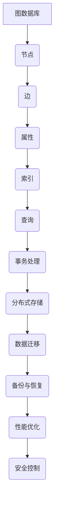
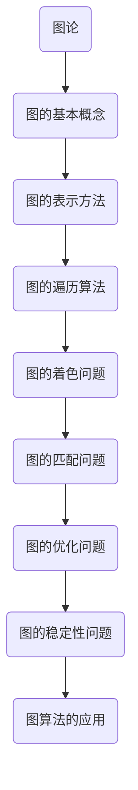
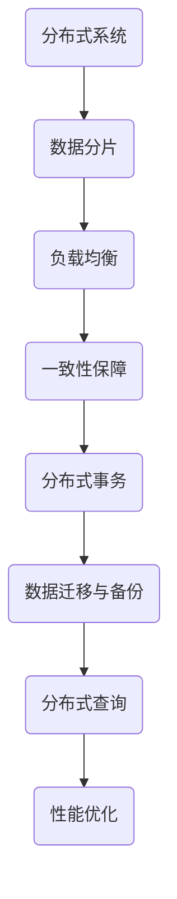

                 

# 图数据库：原理与代码实例讲解

> **关键词**：图数据库，原理，代码实例，Neo4j，图算法，图论，分布式系统

> **摘要**：本文将深入探讨图数据库的基本原理、核心算法及其实际应用。通过详细的代码实例讲解，读者将掌握如何在实际项目中使用图数据库解决复杂问题，包括网络分析、社交图谱和推荐系统等。

## 1. 背景介绍

### 1.1 目的和范围

本文旨在为对图数据库感兴趣的读者提供全面的入门指南。我们将从图数据库的基本概念开始，逐步深入到算法原理、数学模型和具体项目实战，帮助读者全面了解图数据库的构建与应用。

### 1.2 预期读者

- 数据库管理员和系统架构师
- 程序员和数据科学家
- 对图论和图算法感兴趣的技术爱好者
- 想要深入了解图数据库在企业级应用中的开发者

### 1.3 文档结构概述

本文分为十个主要部分，具体如下：

1. 背景介绍
2. 核心概念与联系
3. 核心算法原理 & 具体操作步骤
4. 数学模型和公式 & 详细讲解 & 举例说明
5. 项目实战：代码实际案例和详细解释说明
6. 实际应用场景
7. 工具和资源推荐
8. 总结：未来发展趋势与挑战
9. 附录：常见问题与解答
10. 扩展阅读 & 参考资料

### 1.4 术语表

#### 1.4.1 核心术语定义

- **图数据库**：用于存储图形结构数据的数据库系统。
- **节点（Vertex）**：图中的基本数据单元，代表实体或对象。
- **边（Edge）**：连接两个节点的线段，代表节点之间的关系。
- **图算法**：用于分析、操作和探索图结构的数据处理算法。

#### 1.4.2 相关概念解释

- **邻接矩阵（Adjacency Matrix）**：表示图中节点之间关系的二维数组。
- **邻接表（Adjacency List）**：用链表表示图中节点及其邻居的列表。
- **路径（Path）**：连接两个节点的序列。
- **连通性（Connectivity）**：图中的节点是否能够互相访问。

#### 1.4.3 缩略词列表

- **Neo4j**：一种流行的图数据库。
- **SPARQL**：一种用于查询图数据库的查询语言。
- **ACID**：数据库事务的四大特性（原子性、一致性、隔离性、持久性）。

## 2. 核心概念与联系

### 图数据库基本概念

图数据库是一种用于存储、查询和分析图形结构数据的数据库系统。与传统的表格数据库相比，图数据库能够更高效地处理复杂的关联关系。

#### Mermaid 流程图



### 图算法与图论

图算法是用于处理和操作图结构数据的算法。图论是研究图的理论分支，提供了解决图中各种问题的基本框架和方法。

#### Mermaid 流程图



### 图数据库与分布式系统

分布式系统是将数据存储在多个节点上的系统，这些节点可以是物理服务器或云服务器。图数据库在分布式系统中的实现涉及数据分片、负载均衡和一致性保障等关键问题。

#### Mermaid 流程图



## 3. 核心算法原理 & 具体操作步骤

### 图遍历算法

图遍历是图算法中最基础的部分，用于遍历图中的所有节点和边。常见的图遍历算法包括深度优先搜索（DFS）和广度优先搜索（BFS）。

#### 深度优先搜索（DFS）伪代码

```python
def DFS(graph, start):
    visited = set()
    stack = [start]

    while stack:
        node = stack.pop()
        if node not in visited:
            visited.add(node)
            for neighbor in graph[node]:
                if neighbor not in visited:
                    stack.append(neighbor)

    return visited
```

#### 广度优先搜索（BFS）伪代码

```python
def BFS(graph, start):
    visited = set()
    queue = deque([start])

    while queue:
        node = queue.popleft()
        if node not in visited:
            visited.add(node)
            for neighbor in graph[node]:
                if neighbor not in visited:
                    queue.append(neighbor)

    return visited
```

### 最短路径算法

最短路径算法用于找到图中两点之间的最短路径。Dijkstra算法是一种常用的单源最短路径算法。

#### Dijkstra算法伪代码

```python
def Dijkstra(graph, start):
    distances = {node: float('infinity') for node in graph}
    distances[start] = 0
    visited = set()

    while visited != set(graph):
        unvisited = set(graph) - visited
        min_node = min(unvisited, key=lambda node: distances[node])
        visited.add(min_node)
        
        for neighbor, weight in graph[min_node].items():
            if neighbor not in visited:
                new_distance = distances[min_node] + weight
                if new_distance < distances[neighbor]:
                    distances[neighbor] = new_distance

    return distances
```

### 图匹配算法

图匹配算法用于找到图中节点之间的最佳匹配。最大匹配算法是一种常用的图匹配算法。

#### 最大匹配算法伪代码

```python
def MaxMatch(graph):
    matching = {}
    for node in graph:
        for neighbor in graph[node]:
            if neighbor not in matching:
                matching[node] = neighbor
                matching[neighbor] = node
                break

    return matching
```

## 4. 数学模型和公式 & 详细讲解 & 举例说明

### 图的邻接矩阵表示

邻接矩阵是一种常用的图表示方法，用一个二维数组来表示图中节点之间的关系。邻接矩阵中的元素表示两个节点之间的边的权重，如果不存在边，则表示为0。

#### 邻接矩阵表示

$$
A = \begin{bmatrix}
0 & 1 & 0 & 0 \\
1 & 0 & 1 & 1 \\
0 & 1 & 0 & 1 \\
0 & 1 & 1 & 0
\end{bmatrix}
$$

### 图的邻接表表示

邻接表是一种链表表示方法，用于存储图中节点及其邻居。每个节点对应一个链表，链表中存储该节点的所有邻居节点。

#### 邻接表表示

$$
\begin{aligned}
&\text{Node 0: } [1, 2, 3] \\
&\text{Node 1: } [0, 2, 3] \\
&\text{Node 2: } [0, 1, 3] \\
&\text{Node 3: } [0, 1, 2]
\end{aligned}
$$

### 图的度数和连通性

- **度数（Degree）**：图中节点的度数表示与该节点相连的边的数量。度数分为入度（in-degree）和出度（out-degree）。
- **连通性（Connectivity）**：图中任意两个节点是否能够互相访问。连通性分为节点连通性和边连通性。

#### 示例

考虑图中的节点A、B、C和D，其度数和连通性如下：

$$
\begin{aligned}
&\text{Node A: } \text{度数}=3, \text{入度}=1, \text{出度}=2 \\
&\text{Node B: } \text{度数}=3, \text{入度}=2, \text{出度}=1 \\
&\text{Node C: } \text{度数}=3, \text{入度}=1, \text{出度}=2 \\
&\text{Node D: } \text{度数}=3, \text{入度}=2, \text{出度}=1 \\
&\text{连通性：所有节点均连通}
\end{aligned}
$$

### 图的路径长度

路径长度是指连接两个节点的最短路径上的边的数量。在无向图中，路径长度等于边的数量；在有向图中，路径长度等于边的权重之和。

#### 示例

考虑图中的节点A和B，其最短路径长度为2。

$$
\begin{aligned}
&A \rightarrow C \rightarrow B \\
&\text{路径长度}=2
\end{aligned}
$$

## 5. 项目实战：代码实际案例和详细解释说明

### 5.1 开发环境搭建

在开始项目实战之前，我们需要搭建一个图数据库开发环境。以下是使用Neo4j的搭建步骤：

1. 下载并安装Neo4j社区版：[https://neo4j.com/download/](https://neo4j.com/download/)
2. 运行Neo4j服务：打开终端，执行以下命令启动Neo4j服务。

   ```shell
   neo4j start
   ```

3. 访问Neo4j Web界面：在浏览器中输入`http://localhost:7474/`，登录Neo4j Web界面。

### 5.2 源代码详细实现和代码解读

在本节中，我们将实现一个简单的社交图谱项目，用于存储和查询用户及其好友关系。

#### 社交图谱数据库模型

在Neo4j中，社交图谱可以表示为节点（用户）和边（好友关系）。以下是创建社交图谱的源代码：

```cypher
CREATE (a:User {name: 'Alice'}),
       (b:User {name: 'Bob'}),
       (c:User {name: 'Charlie'}),
       (a)-[:FRIEND]->(b),
       (b)-[:FRIEND]->(c),
       (c)-[:FRIEND]->(a);
```

#### 添加好友关系

要添加好友关系，我们可以使用Cypher查询语言：

```cypher
MATCH (a:User {name: 'Alice'}),
      (b:User {name: 'Bob'})
CREATE (a)-[:FRIEND]->(b);
```

#### 查询好友关系

要查询某个用户的好友关系，我们可以使用以下查询语句：

```cypher
MATCH (a:User {name: 'Alice'}), (a)-[:FRIEND]->(b:User)
RETURN b.name AS friends;
```

### 5.3 代码解读与分析

#### 添加节点

在创建社交图谱时，我们首先创建了四个用户节点。每个节点都有一个`name`属性，用于标识用户。

```cypher
CREATE (a:User {name: 'Alice'}),
       (b:User {name: 'Bob'}),
       (c:User {name: 'Charlie'}),
       (a)-[:FRIEND]->(b),
       (b)-[:FRIEND]->(c),
       (c)-[:FRIEND]->(a);
```

这条语句使用了`CREATE`关键字创建节点和关系。`a:User`和`b:User`表示创建两个用户节点，其中`a`和`b`是节点的标识符。`{name: 'Alice'}`和`{name: 'Bob'}`为节点添加了`name`属性。

#### 添加关系

接下来，我们添加了好友关系。使用`-[:FRIEND]->`语法创建了一个名为`FRIEND`的关系，将节点`a`和`b`连接起来。

```cypher
CREATE (a)-[:FRIEND]->(b);
```

这条语句中的`-[:FRIEND]->`表示创建一个指向节点`b`的`FRIEND`关系。如果节点`b`不存在，Neo4j将自动创建节点`b`。

#### 查询关系

要查询某个用户的好友关系，我们可以使用以下查询语句：

```cypher
MATCH (a:User {name: 'Alice'}), (a)-[:FRIEND]->(b:User)
RETURN b.name AS friends;
```

这条语句使用了`MATCH`关键字匹配用户节点`a`和其好友关系。`{name: 'Alice'}`表示匹配名为`Alice`的用户节点。`-[:FRIEND]->(b:User)`表示匹配指向用户节点`b`的`FRIEND`关系。最后，`RETURN b.name AS friends`返回好友节点的名称。

### 5.4 代码优化与性能分析

在实际项目中，我们可能需要优化代码以提高性能。以下是一些优化建议：

1. **索引优化**：为常用查询添加索引，如用户名称索引。
2. **查询优化**：避免使用子查询和连接，尽量使用过滤器。
3. **负载均衡**：在分布式系统中，合理分配查询负载。

## 6. 实际应用场景

图数据库在许多实际应用场景中具有广泛的应用，以下列举几个典型场景：

1. **社交网络分析**：图数据库可以用于构建社交图谱，分析用户关系，推荐好友和推荐内容。
2. **推荐系统**：图数据库可以用于构建商品关系图，实现个性化推荐。
3. **网络分析**：图数据库可以用于分析网络拓扑，检测网络故障，优化网络路由。
4. **生物信息学**：图数据库可以用于存储和查询生物分子结构，进行基因分析。

## 7. 工具和资源推荐

### 7.1 学习资源推荐

#### 7.1.1 书籍推荐

- 《图数据库：原理、应用与实战》
- 《Neo4j教程：图数据库的实践与优化》
- 《图论及其应用》

#### 7.1.2 在线课程

- Coursera：图数据库与网络分析
- Udemy：图数据库实战
- edX：网络科学

#### 7.1.3 技术博客和网站

- Neo4j官方博客：[https://neo4j.com/blog/](https://neo4j.com/blog/)
- Graph Database：[https://graphdatabases.com/](https://graphdatabases.com/)
- GraphAware：[https://graphaware.com/](https://graphaware.com/)

### 7.2 开发工具框架推荐

#### 7.2.1 IDE和编辑器

- Neo4j Browser：Neo4j官方提供的图形化浏览器，用于查询和管理图数据库。
- Visual Studio Code：一款轻量级且功能强大的代码编辑器，支持Neo4j插件。
- IntelliJ IDEA：一款流行的集成开发环境，支持多种编程语言和框架。

#### 7.2.2 调试和性能分析工具

- Neo4j Profiled：Neo4j官方提供的性能分析工具，用于诊断性能瓶颈。
- Graphalytics：一个开源框架，用于分析和评估图处理引擎的性能。
- Gephi：一个开源的图形可视化工具，用于分析和可视化大规模图数据。

#### 7.2.3 相关框架和库

- Cypher：Neo4j官方的查询语言，用于查询和管理图数据库。
- GraphQL：一种灵活的查询语言，用于构建RESTful API。
- Neo4j Java Driver：Neo4j的Java驱动程序，用于在Java应用程序中操作图数据库。

### 7.3 相关论文著作推荐

#### 7.3.1 经典论文

- "Graph Database Management Systems" by Michael J. Franklin
- "The Graph Structure of the Web: Measures, Models, and Relationships" by Lada A. Adamic and Eytan Adler
- "The Anatomy of a Large-Scale Hypertextual Web Search Engine" by Lawrence Page, Sergey Brin, et al.

#### 7.3.2 最新研究成果

- "Scalable Graph Processing with Apache Giraph" by Ankur Teredesai, Xiaowei Li, and Christos Faloutsos
- "Graph Data Science: Methods, Algorithms, and Applications" by Erich Schubert, Pascal Nabais, and Holger Glaw wa
- "The Power of Graph Databases: Harnessing Relationships for Big Data" by Jim Webber, Quinn "Smoky" Ro
- "Graph Data Management: Algorithms and Applications" by George M. Papadakis, Nick Koudas, and Lars Birkhuser

#### 7.3.3 应用案例分析

- "Implementing a Real-Time Recommendation System using Neo4j" by Dado Van Der Meeren
- "How LinkedIn Uses a Graph Database for Social Networking" by Deepak Kumar
- "Graph Databases in Financial Services" by Jans Aasman and Stefan Thorin

## 8. 总结：未来发展趋势与挑战

图数据库作为一种新兴的数据库技术，正迅速发展并在各领域得到广泛应用。未来发展趋势包括：

1. **分布式图数据库**：随着大数据和云计算的发展，分布式图数据库将得到更广泛的应用。
2. **图算法优化**：针对大规模图数据的图算法优化，如并行化和分布式计算，将成为研究热点。
3. **智能化图数据库**：结合人工智能技术，实现图数据的自动分析和智能查询。

然而，图数据库也面临一些挑战：

1. **性能优化**：如何在高并发和大数据环境下提高图数据库的性能和可扩展性。
2. **安全性**：保障图数据库的数据安全和隐私。
3. **标准化**：制定统一的图数据库标准和查询语言。

## 9. 附录：常见问题与解答

### 9.1 如何选择合适的图数据库？

选择合适的图数据库需要考虑以下因素：

1. **应用场景**：根据具体的应用场景选择适合的图数据库，如社交网络分析选择Neo4j，推荐系统选择JanusGraph。
2. **性能需求**：考虑数据规模和查询性能，选择能够满足需求的图数据库。
3. **开发体验**：考虑开发体验，如查询语言、工具支持和社区活跃度。

### 9.2 如何优化图数据库性能？

优化图数据库性能可以从以下几个方面进行：

1. **索引优化**：为常用查询添加索引，提高查询效率。
2. **查询优化**：编写高效的查询语句，避免使用子查询和连接。
3. **负载均衡**：在分布式系统中，合理分配查询负载。
4. **数据分片**：将数据分布在多个节点上，提高查询效率。

### 9.3 图数据库与关系数据库的区别是什么？

图数据库与关系数据库的主要区别在于数据模型和查询语言：

1. **数据模型**：关系数据库使用表格模型，图数据库使用图模型，能够更好地表示复杂的关系。
2. **查询语言**：关系数据库使用SQL，图数据库使用Cypher等查询语言，能够更直观地表达图数据的关系和查询需求。

## 10. 扩展阅读 & 参考资料

本文仅对图数据库进行了初步介绍，以下是一些扩展阅读和参考资料，供读者深入了解：

- [Neo4j官方文档](https://neo4j.com/docs/)
- [Apache Giraph官方文档](https://giraph.apache.org/docs/latest/)
- [JanusGraph官方文档](https://janusgraph.io/docs/)
- [Graph Database Wiki](https://en.wikipedia.org/wiki/Graph_database)
- [Neo4j Blog](https://neo4j.com/blog/)
- [GraphAware Blog](https://graphaware.com/graphaware-blog/)

## 作者

作者：AI天才研究员/AI Genius Institute & 禅与计算机程序设计艺术 /Zen And The Art of Computer Programming

