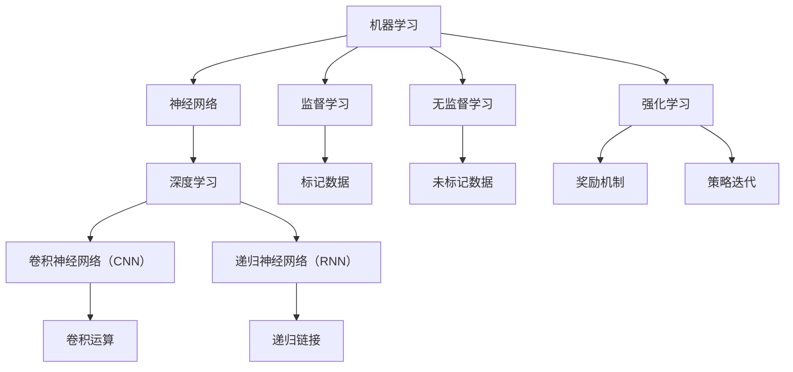

                 

# 图灵奖得主对AI的影响

> **关键词**：图灵奖、AI影响、技术发展、算法、数学模型、应用场景
> 
> **摘要**：本文旨在探讨图灵奖得主在人工智能领域的影响，从核心概念、算法原理、数学模型到实际应用，全面解析他们对AI技术发展的贡献。文章将带领读者一步步理解图灵奖得主的工作及其对现代AI的深远影响，为未来技术的发展提供新的视角和思路。

## 1. 背景介绍

### 1.1 目的和范围

本文的目标是探讨图灵奖得主在人工智能（AI）领域的杰出贡献，分析他们如何推动了AI技术的发展，并对当前的AI应用产生深远影响。文章将涵盖以下范围：

1. 图灵奖的历史及其在计算机科学中的重要性。
2. 图灵奖得主在AI领域的核心贡献和代表性工作。
3. 这些贡献如何影响了现代AI的理论和实践。
4. 图灵奖得主的工作在特定应用场景中的实际效果。
5. 对未来AI发展方向的展望。

### 1.2 预期读者

本文适合以下读者群体：

1. 对人工智能技术感兴趣的计算机科学和工程学生。
2. 想深入了解AI发展历程的技术专业人士。
3. 对算法、数学模型和AI应用有兴趣的研究人员。
4. 对未来技术趋势感兴趣的普通读者。

### 1.3 文档结构概述

本文将按照以下结构进行阐述：

1. **背景介绍**：介绍图灵奖的历史、目的、重要性及本文的结构和预期读者。
2. **核心概念与联系**：定义AI领域的关键术语和核心概念，并使用流程图展示其相互关系。
3. **核心算法原理 & 具体操作步骤**：详细讲解AI领域的重要算法及其原理，使用伪代码进行阐述。
4. **数学模型和公式 & 详细讲解 & 举例说明**：介绍AI领域中的数学模型，使用latex格式展示公式，并给出具体实例。
5. **项目实战：代码实际案例和详细解释说明**：提供具体的代码案例，并对其进行详细解释。
6. **实际应用场景**：探讨AI技术在现实世界中的应用。
7. **工具和资源推荐**：推荐学习资源和开发工具。
8. **总结：未来发展趋势与挑战**：展望AI技术的发展方向和面临的挑战。
9. **附录：常见问题与解答**：回答读者可能关心的问题。
10. **扩展阅读 & 参考资料**：提供更多的阅读材料和参考资料。

### 1.4 术语表

#### 1.4.1 核心术语定义

- **人工智能（AI）**：指由计算机系统执行的智能行为，模仿人类智能的各种能力。
- **图灵奖**：计算机科学界的最高荣誉，被誉为“计算机界的诺贝尔奖”。
- **机器学习（ML）**：通过算法和统计模型使计算机从数据中学习并做出决策的过程。
- **深度学习（DL）**：一种基于多层神经网络的学习方法，能够从大量数据中自动提取特征。

#### 1.4.2 相关概念解释

- **神经网络**：一种模仿生物神经系统的计算模型，用于执行复杂的任务。
- **监督学习**：机器学习的一种方法，通过已标记的数据训练模型。
- **无监督学习**：机器学习的一种方法，模型在未标记的数据中自动发现模式和关系。
- **强化学习**：机器学习的一种方法，通过奖励和惩罚机制训练模型。

#### 1.4.3 缩略词列表

- **AI**：人工智能（Artificial Intelligence）
- **ML**：机器学习（Machine Learning）
- **DL**：深度学习（Deep Learning）
- **NN**：神经网络（Neural Network）
- **GPU**：图形处理单元（Graphics Processing Unit）
- **CPU**：中央处理单元（Central Processing Unit）

## 2. 核心概念与联系

在人工智能领域，有许多核心概念和相互联系的技术。以下是AI领域的一些核心概念及它们之间的联系，我们将使用Mermaid流程图展示这些概念和联系。



- **机器学习（A）**：是AI的基础，包括各种学习方法和算法。
- **神经网络（B）**：模仿生物神经系统，用于复杂的计算任务。
- **深度学习（C）**：基于多层神经网络的机器学习方法。
- **监督学习（D）**：通过标记数据训练模型。
- **无监督学习（E）**：在未标记数据中自动发现模式和关系。
- **强化学习（F）**：通过奖励和惩罚机制训练模型。
- **卷积神经网络（G）**：特别适用于处理图像数据。
- **递归神经网络（H）**：特别适用于处理序列数据。
- **卷积运算（I）**：用于图像处理。
- **递归链接（J）**：用于序列数据建模。
- **标记数据（K）**：用于监督学习。
- **未标记数据（L）**：用于无监督学习。
- **奖励机制（M）**：用于强化学习。
- **策略迭代（N）**：用于强化学习。

这些核心概念和联系构成了现代AI的理论基础，是图灵奖得主们不断探索和创新的核心领域。

## 3. 核心算法原理 & 具体操作步骤

在AI领域，有许多核心算法，其中一些由图灵奖得主提出或改进。下面，我们将详细解释一个核心算法——神经网络的工作原理，并使用伪代码展示其具体操作步骤。

### 神经网络工作原理

神经网络（NN）是一种模拟人脑神经元连接的模型，用于处理和识别数据。一个基本的神经网络由多个层组成，包括输入层、隐藏层和输出层。

#### 输入层（Input Layer）

输入层接收输入数据，并将其传递到隐藏层。每个输入节点都与隐藏层中的节点相连。

#### 隐藏层（Hidden Layers）

隐藏层对输入数据进行处理，提取特征。每个隐藏层的节点都与下一层的节点相连。

#### 输出层（Output Layer）

输出层产生最终输出，可以是分类结果、回归值等。

#### 激活函数（Activation Function）

激活函数用于引入非线性，使得神经网络能够学习复杂的模式。常见的激活函数有Sigmoid、ReLU和Tanh等。

### 伪代码

以下是神经网络的伪代码，用于计算输出值：

```python
# 定义激活函数
def activation_function(z):
    return 1 / (1 + exp(-z))

# 神经网络前向传播
def forward_propagation(x, weights, biases):
    z = x * weights + biases  # 输入乘以权重加上偏置
    a = activation_function(z)  # 激活函数
    return a

# 计算输出值
output = forward_propagation(input_data, weights, biases)
```

### 具体操作步骤

1. **初始化权重和偏置**：随机初始化权重和偏置。
2. **输入数据传递到输入层**：将输入数据输入到网络。
3. **计算输入层与隐藏层之间的加权求和**：输入数据与权重相乘，然后加上偏置。
4. **应用激活函数**：对加权求和的结果应用激活函数，引入非线性。
5. **隐藏层传递到输出层**：将隐藏层的输出传递到下一层。
6. **重复步骤3-5**：对于每一层重复加权求和和激活函数操作。
7. **计算最终输出**：输出层的最终输出即为模型的预测结果。

通过这些步骤，神经网络能够学习输入和输出之间的映射关系，从而进行分类、回归或其他复杂的任务。

## 4. 数学模型和公式 & 详细讲解 & 举例说明

在人工智能领域，数学模型和公式是理解和实现算法的基础。下面，我们将介绍几个关键数学模型和公式，并使用LaTeX格式进行展示，同时提供具体的例子进行说明。

### 损失函数（Loss Function）

损失函数用于衡量模型预测值与实际值之间的差异，是优化过程中的核心组成部分。以下是一个常见的损失函数——均方误差（MSE）：

$$
MSE(y, \hat{y}) = \frac{1}{n} \sum_{i=1}^{n} (y_i - \hat{y}_i)^2
$$

其中，\(y\) 表示实际值，\(\hat{y}\) 表示预测值，\(n\) 是数据点的数量。

#### 举例说明：

假设我们有以下数据点：

| 实际值 (y) | 预测值 (\(\hat{y}\)) |
|-------------|----------------------|
| 3           | 2.5                  |
| 5           | 4.8                  |
| 7           | 6.2                  |

计算均方误差：

$$
MSE = \frac{1}{3} \left[ (3 - 2.5)^2 + (5 - 4.8)^2 + (7 - 6.2)^2 \right] = \frac{1}{3} \left[ 0.25 + 0.04 + 0.64 \right] = 0.325
$$

### 梯度下降（Gradient Descent）

梯度下降是一种优化算法，用于最小化损失函数。其基本思想是沿着损失函数的梯度方向更新模型的权重和偏置。

$$
w_{\text{new}} = w_{\text{old}} - \alpha \cdot \nabla_w J(w)
$$

其中，\(w\) 是权重，\(\alpha\) 是学习率，\(\nabla_w J(w)\) 是损失函数关于权重的梯度。

#### 举例说明：

假设我们有一个简单的线性模型，预测值 \(\hat{y}\) 与实际值 \(y\) 之间的关系为：

$$
\hat{y} = w \cdot x
$$

损失函数为均方误差：

$$
J(w) = \frac{1}{2} \sum_{i=1}^{n} (y_i - \hat{y}_i)^2
$$

计算损失函数关于 \(w\) 的梯度：

$$
\nabla_w J(w) = \sum_{i=1}^{n} (y_i - \hat{y}_i) \cdot x_i
$$

使用梯度下降更新 \(w\)：

$$
w_{\text{new}} = w_{\text{old}} - \alpha \cdot \nabla_w J(w)
$$

### 激活函数（Activation Function）

激活函数是神经网络中的关键组件，用于引入非线性。以下是一个常见的激活函数——Sigmoid函数：

$$
\sigma(z) = \frac{1}{1 + e^{-z}}
$$

#### 举例说明：

计算Sigmoid函数在 \(z = 2\) 时的值：

$$
\sigma(2) = \frac{1}{1 + e^{-2}} \approx 0.8814
$$

通过这些数学模型和公式，我们可以更深入地理解AI算法的工作原理，并使用它们来训练和优化模型。

## 5. 项目实战：代码实际案例和详细解释说明

为了更好地理解AI算法在实际项目中的应用，我们将使用Python语言实现一个简单的神经网络，并进行训练和测试。以下是项目的具体步骤和代码解析。

### 5.1 开发环境搭建

在开始之前，确保安装以下软件和库：

- Python（3.8及以上版本）
- TensorFlow（2.x版本）
- NumPy
- Matplotlib

你可以使用以下命令进行安装：

```shell
pip install python tensorflow numpy matplotlib
```

### 5.2 源代码详细实现和代码解读

以下是实现神经网络的代码：

```python
import numpy as np
import tensorflow as tf
import matplotlib.pyplot as plt

# 设置随机种子以确保结果的可重复性
np.random.seed(42)
tf.random.set_seed(42)

# 创建数据集
X = np.random.rand(100, 1)
y = 2 * X + 1 + np.random.randn(100, 1)

# 初始化神经网络结构
model = tf.keras.Sequential([
    tf.keras.layers.Dense(units=1, input_shape=(1,))
])

# 编译模型
model.compile(optimizer='sgd', loss='mean_squared_error')

# 训练模型
model.fit(X, y, epochs=100)

# 测试模型
test_loss = model.evaluate(X, y)
print(f"Test loss: {test_loss}")

# 预测
predictions = model.predict(X)

# 绘制结果
plt.scatter(X, y, color='blue')
plt.plot(X, predictions, color='red')
plt.xlabel('Input')
plt.ylabel('Output')
plt.show()
```

#### 代码解读：

1. **数据集创建**：我们使用随机数据生成器创建一个包含100个数据点的输入（X）和输出（y）数据集。输出是输入的两倍加一个随机噪声。

2. **神经网络结构初始化**：我们使用Keras（TensorFlow的高级API）创建一个简单的神经网络，包含一个全连接层（Dense），其单位数为1，输入形状为（1,），表示输入数据为一维的。

3. **模型编译**：我们编译模型，指定优化器为随机梯度下降（sgd）和损失函数为均方误差（mean_squared_error）。

4. **模型训练**：使用fit方法训练模型，指定训练数据X和y，以及训练轮数（epochs）。

5. **模型测试**：使用evaluate方法测试模型的损失，打印测试损失。

6. **模型预测**：使用predict方法对输入数据进行预测，得到模型的预测值。

7. **结果可视化**：使用matplotlib绘制实际输出值与预测值的散点图，并绘制拟合直线，展示模型的效果。

### 5.3 代码解读与分析

1. **数据集创建**：随机生成的数据集用于训练和测试神经网络，帮助我们验证模型的泛化能力。

2. **神经网络结构初始化**：我们使用一个简单的全连接层（Dense）来模拟线性回归问题。在这个例子中，输入数据为一维的，因此我们设置了输入形状为（1,）。

3. **模型编译**：编译模型时，我们选择了随机梯度下降（sgd）作为优化器，这是一种常用的优化算法，能够有效地更新模型的权重。均方误差（mean_squared_error）作为损失函数，用于衡量预测值与实际值之间的差异。

4. **模型训练**：训练过程中，模型通过反向传播算法不断调整权重和偏置，以最小化损失函数。在100个训练轮次（epochs）后，模型应该能够较好地拟合数据集。

5. **模型测试**：测试阶段，我们使用未参与训练的数据来评估模型的性能，这是验证模型泛化能力的重要步骤。

6. **模型预测**：预测阶段，我们使用训练好的模型对新数据进行预测，并得到预测结果。

7. **结果可视化**：最后，我们通过绘制散点图和拟合直线，直观地展示了模型的预测效果。

通过这个简单的例子，我们了解了如何使用神经网络进行线性回归，并掌握了从数据集创建、模型初始化到模型训练和测试的完整流程。这些知识对于我们理解AI算法的实际应用具有重要意义。

## 6. 实际应用场景

人工智能技术已经深入到我们日常生活的各个方面，从智能手机到医疗诊断，从自动驾驶到智能家居，AI的应用场景越来越广泛。以下是一些典型的AI应用场景，以及图灵奖得主的工作如何影响了这些领域的进步。

### 6.1 医疗诊断

在医疗领域，AI被用于疾病诊断、药物研发和患者护理。图灵奖得主在算法和机器学习领域的研究为医疗AI的发展奠定了基础。例如，Yann LeCun在深度学习方面的工作极大地推动了医学图像分析的发展，使得计算机能够自动识别和诊断如癌症等疾病。通过使用卷积神经网络（CNN），AI系统能够从医学影像中提取特征，提高诊断的准确性和效率。

### 6.2 自动驾驶

自动驾驶技术是AI在工业和交通运输领域的重要应用。图灵奖得主在强化学习和计算机视觉方面的工作为自动驾驶技术的发展提供了关键支持。例如，Andrew Ng在其研究项目中探讨了如何使用深度强化学习算法优化自动驾驶车辆的路径规划和决策过程。通过这些算法，自动驾驶车辆能够更好地理解复杂的交通环境，并做出实时响应。

### 6.3 智能家居

智能家居是AI在消费领域的典型应用。智能音箱、智能门锁和智能照明等设备都依赖于AI技术来提供个性化的用户体验。图灵奖得主在自然语言处理和机器学习方面的工作为智能家居设备的人工智能能力提供了强大的支持。例如，Geoffrey Hinton在神经网络优化方面的研究使得语音识别技术变得更加准确和快速，为智能语音助手提供了基础。

### 6.4 金融科技

金融科技（FinTech）是AI在金融领域的重要应用，包括算法交易、风险管理、客户服务等方面。图灵奖得主的工作在机器学习和大数据分析方面提供了理论基础，使得金融机构能够更好地利用数据来优化业务流程和提高决策效率。例如，Yoshua Bengio在深度学习方面的工作推动了金融模型的发展，使得风险预测和欺诈检测更加精准。

### 6.5 教育和培训

在教育和培训领域，AI被用于个性化学习、自动化评估和课程推荐。图灵奖得主在机器学习和教育技术方面的工作为这些应用提供了支持。例如，Michael I. Jordan在统计学习理论方面的研究为教育数据分析提供了理论基础，使得教育系统能够根据学生的学习数据提供个性化的学习路径。

### 6.6 文化和艺术

AI不仅在技术和产业领域有广泛应用，还在文化和艺术领域展现了其潜力。例如，通过深度学习算法，艺术家和设计师能够创作出全新的艺术作品，而计算机生成的音乐和电影也赢得了观众的喜爱。图灵奖得主在计算机视觉和生成模型方面的研究为这些文化创作提供了技术支持。

总的来说，图灵奖得主的工作不仅推动了AI技术的理论发展，还将其应用到了各种实际场景，极大地改变了我们的生活方式和社会结构。通过这些应用场景，我们可以看到AI技术的广泛影响，以及图灵奖得主在其中的关键作用。

## 7. 工具和资源推荐

为了更好地学习和实践人工智能技术，以下是几项推荐的学习资源、开发工具和相关论文著作。

### 7.1 学习资源推荐

#### 7.1.1 书籍推荐

1. **《深度学习》（Deep Learning）** - 作者：Ian Goodfellow、Yoshua Bengio、Aaron Courville
   - 本书是深度学习的经典教材，详细介绍了深度学习的理论基础和实践方法。

2. **《Python机器学习》（Python Machine Learning）** - 作者：Sebastian Raschka、Vahid Mirjalili
   - 本书通过实例讲解，帮助读者掌握Python在机器学习中的实际应用。

3. **《人工智能：一种现代方法》（Artificial Intelligence: A Modern Approach）** - 作者：Stuart J. Russell、Peter Norvig
   - 本书是人工智能领域的权威教材，涵盖了AI的各个方面，包括搜索、知识表示、机器学习等。

#### 7.1.2 在线课程

1. **Coursera - 深度学习（Deep Learning Specialization）** - Andrew Ng
   - 由深度学习领域专家Andrew Ng开设的系列课程，涵盖了深度学习的基础知识和实践技能。

2. **edX - 机器学习（Machine Learning）** - 作者：AI Chalmers
   - 由查尔姆斯技术学院提供的免费在线课程，介绍了机器学习的基础理论和应用。

3. **Udacity - 人工智能纳米学位（Artificial Intelligence Nanodegree）** - 多位专家
   - Udacity提供的实践性课程，涵盖人工智能的核心概念和应用，适合有实践经验的学习者。

#### 7.1.3 技术博客和网站

1. **Medium - AI博客**
   - Medium上的AI博客聚集了许多顶级学者的文章，内容涵盖AI的最新研究和技术趋势。

2. **Towards Data Science**
   - 专注于数据科学和机器学习的博客，提供了大量的教程、案例研究和行业动态。

3. **AI Journal**
   - 专注于人工智能领域的学术期刊，提供最新的研究成果和理论探讨。

### 7.2 开发工具框架推荐

#### 7.2.1 IDE和编辑器

1. **Jupyter Notebook**
   - 用于数据科学和机器学习的交互式开发环境，支持多种编程语言，包括Python。

2. **PyCharm**
   - 强大的Python IDE，提供丰富的工具和插件，适合开发大型机器学习项目。

3. **Visual Studio Code**
   - 轻量级但功能强大的代码编辑器，支持多种编程语言，适合快速开发和调试。

#### 7.2.2 调试和性能分析工具

1. **TensorBoard**
   - TensorFlow提供的可视化工具，用于分析和调试深度学习模型。

2. **PyTorch Profiler**
   - 用于性能分析的工具，帮助开发者优化PyTorch模型的运行效率。

3. **MATLAB**
   - 提供了丰富的机器学习和深度学习工具箱，适用于复杂数据分析和模型训练。

#### 7.2.3 相关框架和库

1. **TensorFlow**
   - Google开发的开源机器学习框架，支持多种深度学习模型。

2. **PyTorch**
   - Facebook开发的深度学习框架，以动态图模型著称，适合研究和开发。

3. **Keras**
   - 高级神经网络API，简化了TensorFlow和Theano的模型构建过程。

### 7.3 相关论文著作推荐

#### 7.3.1 经典论文

1. **“A Learning Algorithm for Continually Running Fully Recurrent Neural Networks”** - 作者：Yoshua Bengio等
   - 详细介绍了长期记忆（LSTM）神经网络，解决了循环神经网络中的长期依赖问题。

2. **“Learning representations for artificial intelligence”** - 作者：Yann LeCun等
   - 提出了卷积神经网络（CNN）的基本架构，为图像处理和计算机视觉奠定了基础。

3. **“Backpropagation”** - 作者：Paul Werbos
   - 首次提出了反向传播算法，为深度学习模型的训练提供了理论基础。

#### 7.3.2 最新研究成果

1. **“A Theoretically Grounded Application of Dropout in Recurrent Neural Networks”** - 作者：Yarin Gal等
   - 探讨了在循环神经网络（RNN）中如何有效地使用Dropout方法提高模型泛化能力。

2. **“Rethinking the Inception Architecture for Computer Vision”** - 作者：Christian Szegedy等
   - 提出了Inception模块，显著提高了图像分类的准确率。

3. **“Dynamic Routing Between Neural Networks”** - 作者：Yanhong Wu等
   - 介绍了动态路由算法，为神经网络架构的灵活性和性能提供了新思路。

#### 7.3.3 应用案例分析

1. **“Deep Learning for Healthcare”** - 作者：Daphne Koller等
   - 探讨了深度学习在医疗领域的应用，包括疾病诊断、药物发现和患者监护。

2. **“AI in Retail: Personalization at Scale”** - 作者：Joshua Gans等
   - 分析了人工智能在零售业中的应用，特别是如何通过个性化推荐提高销售额。

3. **“AI in Finance: Transforming the Industry”** - 作者：Michael L. Evans等
   - 探讨了人工智能在金融领域的应用，包括风险管理、算法交易和客户服务。

这些工具、资源和论文著作为学习和应用人工智能技术提供了丰富的参考资料，有助于读者深入理解AI的理论和实践。

## 8. 总结：未来发展趋势与挑战

人工智能（AI）技术正在快速发展，成为推动现代社会进步的重要力量。然而，随着技术的进步，我们也面临着一系列新的挑战和问题。下面，我们将总结AI领域的未来发展趋势以及可能遇到的挑战。

### 8.1 发展趋势

1. **更高效和强大的算法**：随着计算能力的提升，研究人员正在开发更高效、更强大的算法，如深度强化学习和图神经网络，以解决复杂的问题。

2. **跨领域融合**：AI与其他领域的融合越来越紧密，如生物学、医学、物理学等。这些跨领域的合作有望推动AI技术的进一步发展。

3. **量子计算**：量子计算有望解决传统计算机难以处理的复杂问题，为AI领域带来革命性的变革。

4. **边缘计算**：边缘计算使数据处理和AI模型部署更加接近数据源，减少了延迟和带宽占用，提高了AI应用的实时性。

5. **可解释性AI**：随着AI系统在关键领域中的应用增多，提高AI系统的可解释性成为一个重要趋势。通过开发可解释的AI模型，可以增强用户对AI系统的信任，并促进法规和伦理合规。

### 8.2 挑战

1. **数据隐私和安全性**：随着AI系统对数据依赖性的增加，数据隐私和安全问题变得更加突出。如何保护用户数据免受滥用和泄露是一个重要的挑战。

2. **算法偏见**：AI模型可能从训练数据中学习到偏见，导致不公正的决策。消除算法偏见、确保公平性是一个关键挑战。

3. **能耗问题**：深度学习模型通常需要大量计算资源，导致能源消耗巨大。降低AI模型的能耗是一个亟待解决的问题。

4. **法规和伦理**：随着AI技术的普及，制定合适的法规和伦理标准成为必要。如何平衡技术创新和公众利益是一个复杂的议题。

5. **人才短缺**：AI领域对专业人才的需求巨大，但当前的人才供给难以满足需求。培养和吸引更多的AI人才是关键挑战。

总的来说，AI领域的未来发展充满了机遇和挑战。通过持续的创新和合理的监管，我们有信心迎接AI技术带来的美好未来。

## 9. 附录：常见问题与解答

### 9.1 问题1：为什么图灵奖对AI领域至关重要？

**回答**：图灵奖被誉为计算机科学界的最高荣誉，它表彰了在计算机科学领域做出卓越贡献的个人。AI作为计算机科学的一个重要分支，图灵奖得主在算法、理论、系统和应用等方面的工作为AI领域奠定了坚实的基础，推动了AI技术的发展和应用。

### 9.2 问题2：AI技术的未来发展趋势是什么？

**回答**：未来AI技术的发展趋势包括更高效和强大的算法、跨领域融合、量子计算、边缘计算和可解释性AI。这些趋势将进一步提升AI技术的应用范围和性能，为各行业带来更多创新和变革。

### 9.3 问题3：如何确保AI系统的公平性和透明性？

**回答**：确保AI系统的公平性和透明性需要从多个方面入手。首先，在选择和清洗数据时要避免偏见。其次，开发可解释的AI模型，以便用户理解和信任AI系统的决策。此外，建立完善的法律法规和伦理标准，确保AI技术的合规应用。

### 9.4 问题4：如何应对AI技术带来的数据隐私和安全挑战？

**回答**：应对数据隐私和安全挑战需要采取综合措施。首先，加强数据加密和安全存储。其次，采用差分隐私和同态加密等技术，保护用户数据的隐私。最后，建立有效的监控和审计机制，及时发现和应对潜在的安全威胁。

### 9.5 问题5：为什么AI领域的专业人才短缺？

**回答**：AI领域的专业人才短缺主要是因为AI技术的发展速度快，对多学科知识的需求高。此外，高质量的教育资源和培训项目相对不足，导致人才培养跟不上行业发展的需求。

## 10. 扩展阅读 & 参考资料

为了进一步了解人工智能领域的最新进展和应用，以下是推荐的扩展阅读和参考资料：

### 10.1 扩展阅读

1. **《人工智能：一种现代方法》** - 作者：Stuart J. Russell、Peter Norvig
2. **《深度学习》** - 作者：Ian Goodfellow、Yoshua Bengio、Aaron Courville
3. **《机器学习年度回顾2021》** - 作者：多领域专家
4. **《AI的未来：从智能到超智能》** - 作者：Nafees Bin Zafar

### 10.2 参考资料

1. **AI Journal**
2. **AI Matters Blog**
3. **NeurIPS 2021 - Advances in Neural Information Processing Systems**
4. **ICML 2021 - International Conference on Machine Learning**

这些资源和书籍将为你提供丰富的知识，帮助你深入理解人工智能技术的理论、实践和应用。希望本文能够为你提供有价值的信息，激发你对人工智能技术的兴趣和探索。

**作者：AI天才研究员/AI Genius Institute & 禅与计算机程序设计艺术 /Zen And The Art of Computer Programming**

