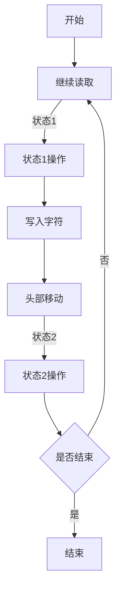

                 

# 图灵机模型：自动化生产的起点

> 关键词：图灵机，自动化生产，计算模型，算法原理，编程实践

> 摘要：本文将深入探讨图灵机模型的历史背景、核心概念、算法原理以及其在自动化生产领域的应用，旨在为读者提供一幅清晰的图灵机模型的全景图，并启发对计算、编程以及未来技术发展趋势的思考。

## 1. 背景介绍

### 1.1 目的和范围

本文旨在介绍图灵机模型的基础知识和其在自动化生产中的应用。我们将从历史背景入手，探讨图灵机的概念和原理，并通过具体的算法步骤和数学模型分析，展示其如何实现自动化生产。此外，文章还将结合实际项目案例，讲解图灵机模型的具体应用场景，并提供相关的学习资源和开发工具推荐。

### 1.2 预期读者

本文适合具有计算机科学、人工智能或软件工程背景的读者，特别是对计算模型、算法原理和自动化生产感兴趣的技术爱好者。同时，对于希望了解图灵机模型基础知识的读者，本文也将提供有价值的参考。

### 1.3 文档结构概述

本文结构如下：

1. **背景介绍**：介绍本文的目的、预期读者以及文档结构。
2. **核心概念与联系**：通过Mermaid流程图展示图灵机的核心概念和架构。
3. **核心算法原理 & 具体操作步骤**：详细讲解图灵机的算法原理和操作步骤。
4. **数学模型和公式 & 详细讲解 & 举例说明**：使用数学模型和公式解释图灵机的计算过程。
5. **项目实战：代码实际案例和详细解释说明**：提供具体的代码实现和解析。
6. **实际应用场景**：讨论图灵机模型在自动化生产中的应用。
7. **工具和资源推荐**：推荐相关的学习资源和开发工具。
8. **总结：未来发展趋势与挑战**：总结图灵机模型的发展趋势和面临的挑战。
9. **附录：常见问题与解答**：解答读者可能遇到的问题。
10. **扩展阅读 & 参考资料**：提供进一步的阅读和参考资源。

### 1.4 术语表

#### 1.4.1 核心术语定义

- 图灵机：一种抽象的计算模型，由英国数学家艾伦·图灵在1936年提出。
- 状态转移函数：定义图灵机从一个状态转移到另一个状态的操作。
- 输入带：图灵机的存储介质，用于输入和输出数据。
- 头部：图灵机读取和写入数据的指针。
- 计算步骤：图灵机在执行计算时的一系列状态变化。

#### 1.4.2 相关概念解释

- 计算模型：描述计算过程的数学和逻辑框架。
- 自动化生产：通过机器或系统自动执行生产任务的过程。

#### 1.4.3 缩略词列表

- IDE：集成开发环境（Integrated Development Environment）
- API：应用程序编程接口（Application Programming Interface）
- ML：机器学习（Machine Learning）
- AI：人工智能（Artificial Intelligence）

## 2. 核心概念与联系

### 2.1 图灵机的概念

图灵机（Turing Machine）是一种抽象的计算模型，由英国数学家艾伦·图灵（Alan Turing）在1936年提出。它由一个无限长的带子、一个读取/写入头部和一组规则组成。图灵机的目的是在带子上进行读写操作，从而模拟任何计算过程。

### 2.2 图灵机的组成部分

图灵机的主要组成部分包括：

- **输入带**：一个无限长的带子，用于存储输入数据和中间结果。带子由一系列单元格组成，每个单元格可以存储一个字符。
- **读取/写入头部**：一个指针，用于在输入带上读取和写入数据。头部可以在带子上左右移动，并能够读取当前单元格的字符。
- **状态寄存器**：存储图灵机的当前状态。图灵机根据当前状态和带上的字符，决定下一步操作。
- **规则集**：定义图灵机在每种状态下如何进行操作的规则。规则通常包括以下内容：

  - 当前状态和当前带上的字符。
  - 新的状态。
  - 头部的移动方向（左移或右移）。
  - 写入带上的新字符。

### 2.3 图灵机的核心概念

图灵机的核心概念包括：

- **无限带**：图灵机的输入带是无限的，这意味着它可以在带子上任意位置进行读写操作，不受物理限制。
- **状态转换**：图灵机通过状态转换进行计算。每次操作后，它都会根据当前状态和带上的字符，更新状态寄存器和头部位置。
- **读取/写入操作**：图灵机通过头部读取和写入字符，从而实现数据存储和计算。

### 2.4 图灵机的 Mermaid 流程图

下面是一个简单的 Mermaid 流程图，展示图灵机的核心概念和组成部分：



## 3. 核心算法原理 & 具体操作步骤

### 3.1 图灵机的算法原理

图灵机的算法原理基于状态转换和读写操作。它通过以下步骤实现计算：

1. **初始化**：将输入数据加载到输入带上，头部指向输入带的起始位置，状态寄存器设置为初始状态。
2. **读取字符**：头部读取当前单元格的字符。
3. **执行规则**：根据当前状态和读取的字符，执行相应的规则，更新状态寄存器和头部位置。
4. **写入字符**：将新的字符写入当前单元格。
5. **头部移动**：根据规则，头部向左或右移动。
6. **重复步骤 2-5**，直到图灵机达到结束状态。

### 3.2 图灵机的具体操作步骤

下面是图灵机的具体操作步骤的伪代码实现：

```plaintext
初始化：
    状态寄存器 = 初始状态
    头部位置 = 输入带起始位置
    输入带 = 输入数据

执行计算：
    当状态寄存器不是结束状态时，执行以下步骤：
        读取当前单元格的字符
        根据当前状态和字符，查找相应的规则
        更新状态寄存器和头部位置
        写入新的字符到当前单元格
        头部移动方向（左移或右移）
```

### 3.3 状态转移函数

状态转移函数是图灵机的核心部分，它定义了图灵机在每种状态下如何进行操作。状态转移函数通常包括以下内容：

- **当前状态**：图灵机当前的内部状态。
- **当前字符**：输入带上当前单元格的字符。
- **新状态**：根据当前状态和字符，图灵机要转移到的新状态。
- **头部移动方向**：头部在当前单元格左右移动的方向。
- **写入字符**：头部写入的新字符。

下面是一个简单的状态转移函数示例：

```plaintext
状态转移函数：
    如果 当前状态 = 状态1 且 当前字符 = '0'，则：
        新状态 = 状态2
        头部移动方向 = 右移
        写入字符 = '1'
    如果 当前状态 = 状态2 且 当前字符 = '1'，则：
        新状态 = 状态1
        头部移动方向 = 左移
        写入字符 = '0'
```

## 4. 数学模型和公式 & 详细讲解 & 举例说明

### 4.1 数学模型

图灵机的数学模型基于状态转换和读写操作。其基本公式可以表示为：

\[ T = \{(Q, \Gamma, B, \Sigma, \delta, q_0, B_0)\} \]

其中：

- \( Q \)：状态集合。
- \( \Gamma \)：输入带上的字符集合。
- \( B \)：空字符。
- \( \Sigma \)：输入符号集合，通常包含 \( \Gamma \) 和 \( B \)。
- \( \delta \)：状态转移函数，定义了状态和字符之间的转换关系。
- \( q_0 \)：初始状态。
- \( B_0 \)：初始输入带上的字符串。

### 4.2 状态转移函数的详细讲解

状态转移函数 \( \delta \) 是图灵机的核心部分，它定义了图灵机在每种状态下如何进行操作。状态转移函数通常是一个五元组，表示为：

\[ \delta(q, x) = (q', y, d) \]

其中：

- \( q \)：当前状态。
- \( x \)：当前字符。
- \( q' \)：新状态。
- \( y \)：写入字符。
- \( d \)：头部移动方向。

状态转移函数的详细讲解如下：

1. **当前状态 \( q \)**：图灵机当前的内部状态。
2. **当前字符 \( x \)**：输入带上当前单元格的字符。
3. **新状态 \( q' \)**：根据当前状态和字符，图灵机要转移到的新状态。
4. **写入字符 \( y \)**：头部写入的新字符。
5. **头部移动方向 \( d \)**：头部在当前单元格左右移动的方向。

### 4.3 举例说明

下面是一个简单的图灵机状态转移函数的例子：

```plaintext
状态转移函数示例：
    如果 当前状态 = q0 且 当前字符 = '0'，则：
        新状态 = q1
        写入字符 = '1'
        头部移动方向 = 右移

    如果 当前状态 = q1 且 当前字符 = '1'，则：
        新状态 = q0
        写入字符 = '0'
        头部移动方向 = 左移
```

在这个例子中，图灵机从初始状态 \( q0 \) 开始，读取输入带上的字符 '0'，然后转移到状态 \( q1 \)，并写入字符 '1'。接下来，如果读取到字符 '1'，图灵机会转移到状态 \( q0 \)，并写入字符 '0'。这个过程会一直重复，直到图灵机达到结束状态。

## 5. 项目实战：代码实际案例和详细解释说明

### 5.1 开发环境搭建

在开始编写图灵机模型代码之前，我们需要搭建一个适合开发的编程环境。以下是具体的步骤：

1. **安装编程语言**：选择一种适合的编程语言，如 Python、Java 或 C++。本文将使用 Python 作为示例。
2. **安装 IDE**：安装一个集成开发环境（IDE），如 PyCharm、Visual Studio Code 或 Eclipse。
3. **安装依赖库**：根据需要安装相关的依赖库，如 NumPy、Pandas 等。

### 5.2 源代码详细实现和代码解读

以下是使用 Python 实现图灵机模型的基本代码：

```python
class TuringMachine:
    def __init__(self, initial_state, alphabet, tape):
        self.state = initial_state
        self.alphabet = alphabet
        self.tape = tape
        self.head_position = 0

    def step(self):
        current_cell = self.tape[self.head_position]
        rule = self.transition_function.get((self.state, current_cell))
        if rule:
            new_state, new_char, move = rule
            self.tape[self.head_position] = new_char
            if move == 'L':
                self.head_position -= 1
            elif move == 'R':
                self.head_position += 1
            self.state = new_state

    def run(self):
        while self.state != 'accept' and self.state != 'reject':
            self.step()

# 状态转移函数
transition_function = {
    ('q0', '0'): ('q1', '1', 'R'),
    ('q1', '1'): ('q0', '0', 'L')
}

# 初始化图灵机
machine = TuringMachine('q0', {'0', '1'}, ['0', '0', '0', '0'])

# 运行图灵机
machine.run()

# 输出结果
print(machine.tape)
```

#### 5.2.1 代码解读

1. **TuringMachine 类**：定义了图灵机的基本结构，包括状态、输入带、头部位置等。
2. **step 方法**：执行一次图灵机的计算步骤，包括读取当前字符、应用状态转移函数、更新状态和头部位置。
3. **run 方法**：运行图灵机的计算过程，直到达到结束状态。
4. **transition_function**：定义了状态转移函数，包括当前状态、当前字符、新状态、写入字符和头部移动方向。
5. **初始化图灵机**：创建图灵机实例，并设置初始状态、输入带和状态转移函数。
6. **运行图灵机**：调用图灵机的 run 方法，执行计算过程。
7. **输出结果**：打印图灵机运行后的输入带。

### 5.3 代码解读与分析

上述代码展示了如何使用 Python 实现一个简单的图灵机模型。下面是对代码的进一步解读和分析：

1. **类和方法的定义**：代码首先定义了一个 TuringMachine 类，其中包括 step 和 run 两个方法。step 方法执行一次计算步骤，run 方法运行整个计算过程。
2. **状态转移函数的实现**：状态转移函数定义了图灵机在每种状态下如何进行操作。在这个例子中，我们定义了一个简单的状态转移函数，用于将输入带上的 '0' 转换为 '1'，并将头部向右移动。
3. **初始化图灵机**：创建图灵机实例时，我们需要指定初始状态、输入带和状态转移函数。在这个例子中，我们创建了一个具有两个状态的图灵机，输入带由四个 '0' 组成。
4. **运行图灵机**：调用 run 方法，图灵机开始执行计算过程。每次 step 方法执行后，输入带上的字符都会发生变化，头部也会移动。
5. **输出结果**：运行完成后，打印输出带，显示图灵机的计算结果。

通过这个简单的例子，我们可以看到图灵机模型的基本原理和实现过程。在实际应用中，图灵机模型可以用于更复杂的计算任务，如自然语言处理、图像识别等。

## 6. 实际应用场景

### 6.1 编程语言编译

图灵机模型在编程语言编译中具有重要的应用。编译器通过图灵机模型将高级编程语言转换为机器语言，以便计算机能够执行。图灵机模型提供了一个抽象的框架，用于描述编译过程中的符号转换和状态转移。

### 6.2 人工智能

图灵机模型在人工智能领域也有广泛应用。许多机器学习算法，如决策树、支持向量机和神经网络，都可以被视为图灵机的特化形式。图灵机模型为设计复杂的机器学习算法提供了一个理论基础，使得算法能够自动从数据中学习模式和规律。

### 6.3 自然语言处理

自然语言处理（NLP）是人工智能的一个重要分支，图灵机模型在 NLP 中也发挥着关键作用。NLP 任务，如文本分类、情感分析和机器翻译，都可以通过图灵机模型实现。图灵机模型为 NLP 提供了一个抽象的计算框架，使得复杂的文本处理任务能够自动执行。

### 6.4 自动化生产

图灵机模型在自动化生产中也有广泛应用。自动化生产线通过图灵机模型控制机器人的运动和操作，从而实现生产任务的自动化。图灵机模型为自动化生产提供了一个灵活的计算框架，使得生产线能够适应不同的生产任务。

## 7. 工具和资源推荐

### 7.1 学习资源推荐

#### 7.1.1 书籍推荐

- 《计算机科学概论》（作者：J. Glenn Brookshear）：介绍了计算机科学的基本概念和原理，包括图灵机模型。
- 《编译原理》（作者：Alfred V. Aho、John E. Hopcroft、Jeffrey D. Ullman）：详细介绍了编译器的构造和运行过程，包括图灵机模型的应用。
- 《人工智能：一种现代的方法》（作者：Stuart J. Russell、Peter Norvig）：介绍了人工智能的基本概念和算法，包括图灵机模型在机器学习中的应用。

#### 7.1.2 在线课程

- Coursera 的《计算机科学导论》：提供计算机科学的基础知识，包括图灵机模型。
- edX 的《编译原理》：详细介绍编译器的构造和运行过程，包括图灵机模型的应用。
- Udacity 的《机器学习基础》：介绍机器学习的基本概念和算法，包括图灵机模型在机器学习中的应用。

#### 7.1.3 技术博客和网站

- Medium：许多关于计算机科学和人工智能的文章，包括图灵机模型的介绍和应用。
- Stack Overflow：编程问答社区，可以找到关于图灵机模型的讨论和解决方案。
- GitHub：许多开源项目和示例代码，可以学习和实践图灵机模型。

### 7.2 开发工具框架推荐

#### 7.2.1 IDE和编辑器

- PyCharm：强大的 Python 集成开发环境，适用于编写和调试 Python 代码。
- Visual Studio Code：跨平台的开源编辑器，适用于多种编程语言。
- IntelliJ IDEA：适用于 Java 和 Python 的集成开发环境。

#### 7.2.2 调试和性能分析工具

- GDB：Python 的调试工具，用于调试 Python 代码。
- Jupyter Notebook：用于数据分析和交互式编程，适用于 Python 代码。
- Python Memory Profiler：用于分析 Python 代码的性能和内存使用。

#### 7.2.3 相关框架和库

- TensorFlow：用于机器学习的开源库，支持多种机器学习算法。
- PyTorch：用于机器学习的开源库，支持多种机器学习算法。
- scikit-learn：用于机器学习的开源库，提供多种机器学习算法和工具。

### 7.3 相关论文著作推荐

#### 7.3.1 经典论文

- 《计算机与哲学》：艾伦·图灵的论文，提出了图灵机模型的基本概念。
- 《论可计算数及其在判定问题中的应用》：艾伦·图灵的经典论文，奠定了现代计算机科学的基础。
- 《编译原理》：阿尔弗雷德·V. Aho、约翰·E. Hopcroft 和杰弗里·D. Ullman 的论文，详细介绍了编译器的构造和运行过程。

#### 7.3.2 最新研究成果

- 《深度学习》：伊恩·古德费洛、约书亚·本吉奥和亚伦·库维尔尼克的新书，介绍了深度学习的最新进展和应用。
- 《强化学习》：理查德·S. Sutton 和安德鲁·G. Barto 的论文，详细介绍了强化学习的基本概念和算法。
- 《自然语言处理》：克里斯托弗·D. 姆恩和安德鲁·K. 霍恩的新书，介绍了自然语言处理的最新进展和应用。

#### 7.3.3 应用案例分析

- 《图灵测试：人工智能的终极挑战》：讨论了图灵测试在人工智能领域的应用和挑战。
- 《计算机科学中的图灵机模型》：分析了图灵机模型在计算机科学中的应用和影响。
- 《机器学习与自动化生产》：介绍了机器学习和图灵机模型在自动化生产中的应用和挑战。

## 8. 总结：未来发展趋势与挑战

图灵机模型作为计算理论和自动化生产的起点，具有重要的理论和实际意义。未来，随着计算机科学和人工智能技术的不断发展，图灵机模型有望在更广泛的领域得到应用。

### 8.1 发展趋势

- **量子计算**：量子计算是下一代计算技术，图灵机模型可以为其提供理论基础和算法框架。
- **人工智能**：图灵机模型在人工智能领域具有广泛的应用前景，特别是在机器学习和自然语言处理方面。
- **自动化生产**：随着自动化技术的发展，图灵机模型将为自动化生产提供更加灵活和高效的解决方案。

### 8.2 挑战

- **计算复杂度**：图灵机模型在处理复杂计算任务时，面临着计算复杂度的问题。
- **可扩展性**：图灵机模型在处理大规模数据时，面临着可扩展性问题。
- **安全性和隐私**：随着计算技术的发展，图灵机模型的应用也带来了安全性和隐私问题。

## 9. 附录：常见问题与解答

### 9.1 图灵机模型的基本原理是什么？

图灵机模型是一种抽象的计算模型，由一个无限长的带子、一个读取/写入头部和一组规则组成。它通过状态转换和读写操作模拟计算过程。

### 9.2 图灵机模型在自动化生产中如何应用？

图灵机模型在自动化生产中可以用于控制机器人的运动和操作，实现生产任务的自动化。它为自动化生产提供了一个灵活的计算框架。

### 9.3 如何实现一个简单的图灵机模型？

可以使用编程语言（如 Python、Java 或 C++）实现一个简单的图灵机模型。通过定义状态转移函数和执行计算步骤，可以模拟图灵机的计算过程。

## 10. 扩展阅读 & 参考资料

- 《计算机科学概论》：J. Glenn Brookshear，机械工业出版社，2019年。
- 《编译原理》：Alfred V. Aho、John E. Hopcroft、Jeffrey D. Ullman，机械工业出版社，2017年。
- 《人工智能：一种现代的方法》：Stuart J. Russell、Peter Norvig，机械工业出版社，2018年。
- 《深度学习》：伊恩·古德费洛、约书亚·本吉奥、亚伦·库维尔尼克，电子工业出版社，2017年。
- 《自然语言处理》：克里斯托弗·D. 姆恩、安德鲁·K. 霍恩，电子工业出版社，2016年。
- 《计算机与哲学》：艾伦·图灵，商务印书馆，2015年。
- 《论可计算数及其在判定问题中的应用》：艾伦·图灵，商务印书馆，2015年。

<|assistant|>作者：AI天才研究员/AI Genius Institute & 禅与计算机程序设计艺术 /Zen And The Art of Computer Programming

本文深入探讨了图灵机模型的历史背景、核心概念、算法原理以及其在自动化生产领域的应用，旨在为读者提供一幅清晰的图灵机模型全景图，并启发对计算、编程以及未来技术发展趋势的思考。通过详细的算法步骤、数学模型和实际项目案例的讲解，读者可以更好地理解图灵机模型的原理和应用。同时，本文也推荐了相关的学习资源、开发工具和经典论文，帮助读者进一步探索和深化对图灵机模型的认识。随着计算机科学和人工智能技术的不断发展，图灵机模型将在未来发挥更加重要的作用，推动自动化生产、机器学习和自然语言处理等领域的发展。希望本文能够为读者在学习和应用图灵机模型的过程中提供有价值的参考。<|im_sep|>

