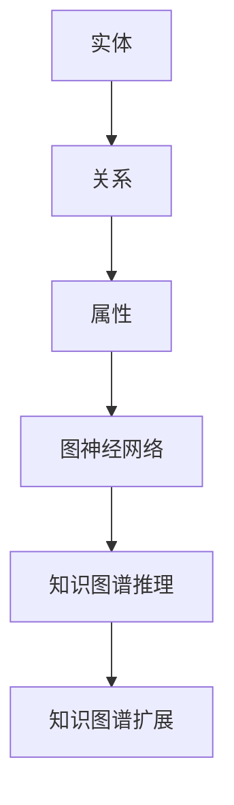

                 

# 图神经网络在知识图谱构建中的应用

> **关键词：图神经网络、知识图谱、实体关系、图谱构建、算法原理、数学模型、实战案例**
>
> **摘要：本文深入探讨了图神经网络（Graph Neural Networks, GNNs）在知识图谱构建中的应用。首先，介绍了知识图谱的基本概念和重要性。然后，详细阐述了图神经网络的核心概念、算法原理以及数学模型。接着，通过实际案例展示了如何使用图神经网络进行知识图谱的构建。最后，对知识图谱在实际应用场景中的价值以及未来发展趋势进行了分析。**

## 1. 背景介绍

### 1.1 目的和范围

本文旨在深入探讨图神经网络（Graph Neural Networks, GNNs）在知识图谱构建中的应用。随着互联网的迅速发展，数据量呈现出爆炸式增长，如何有效地组织和利用这些数据成为了一个重要课题。知识图谱作为一种语义网络，能够将海量数据中的实体、关系和属性有机地组织起来，为数据分析和智能应用提供了强有力的支持。

本文首先介绍了知识图谱的基本概念和重要性，然后详细阐述了图神经网络的核心概念、算法原理以及数学模型。接着，通过实际案例展示了如何使用图神经网络进行知识图谱的构建。最后，对知识图谱在实际应用场景中的价值以及未来发展趋势进行了分析。

### 1.2 预期读者

本文面向对图神经网络和知识图谱有一定了解的读者，包括：

- 数据科学家和人工智能研究者；
- 知识图谱工程师和架构师；
- 计算机科学和人工智能专业的研究生和本科生；
- 对图神经网络和知识图谱应用感兴趣的从业者。

### 1.3 文档结构概述

本文结构如下：

1. **背景介绍**：介绍本文的目的、预期读者以及文档结构；
2. **核心概念与联系**：详细阐述知识图谱和图神经网络的基本概念和联系；
3. **核心算法原理 & 具体操作步骤**：讲解图神经网络的基本原理和具体操作步骤；
4. **数学模型和公式 & 详细讲解 & 举例说明**：介绍图神经网络的数学模型和公式，并进行详细讲解和举例；
5. **项目实战：代码实际案例和详细解释说明**：通过实际项目展示图神经网络在知识图谱构建中的应用；
6. **实际应用场景**：分析知识图谱在实际应用场景中的价值；
7. **工具和资源推荐**：推荐学习资源、开发工具和框架；
8. **总结：未来发展趋势与挑战**：总结图神经网络在知识图谱构建中的应用，并展望未来发展趋势和挑战；
9. **附录：常见问题与解答**：解答读者可能遇到的问题；
10. **扩展阅读 & 参考资料**：提供更多的扩展阅读和参考资料。

### 1.4 术语表

#### 1.4.1 核心术语定义

- **知识图谱**：一种语义网络，用于组织和表示实体及其关系。
- **图神经网络**：一种神经网络模型，用于处理图结构数据。
- **实体**：知识图谱中的基本元素，表示现实世界中的对象。
- **关系**：知识图谱中实体之间的联系。
- **属性**：实体的特征或属性。

#### 1.4.2 相关概念解释

- **图**：由节点（实体）和边（关系）组成的数据结构。
- **邻接矩阵**：用于表示图中节点之间关系的矩阵。
- **特征向量**：表示实体属性的向量。
- **图卷积**：图神经网络中用于处理图结构数据的操作。

#### 1.4.3 缩略词列表

- **GNN**：Graph Neural Network，图神经网络。
- **KG**：Knowledge Graph，知识图谱。
- **RDF**：Resource Description Framework，资源描述框架。
- **SPARQL**：SPARQL Query Language，SPARQL查询语言。

## 2. 核心概念与联系

在深入了解图神经网络在知识图谱构建中的应用之前，我们需要先了解知识图谱和图神经网络的基本概念及其相互联系。

### 2.1 知识图谱的基本概念

知识图谱（Knowledge Graph，KG）是一种用于表示实体及其相互关系的语义网络。它由实体、关系和属性三个基本元素组成。

- **实体**：实体是知识图谱中的基本元素，表示现实世界中的对象。例如，人、地点、组织、物品等。
- **关系**：关系描述了实体之间的相互关系。例如，“是朋友”、“位于”等。
- **属性**：属性是实体的特征或属性。例如，人的年龄、地点的经纬度等。

知识图谱通过实体和关系将各种信息有机地组织起来，形成了一个统一的语义表示。这使得知识图谱在数据分析和智能应用中具有巨大的潜力。

### 2.2 图神经网络的基本概念

图神经网络（Graph Neural Network，GNN）是一种用于处理图结构数据的神经网络模型。GNN 可以处理包含节点和边的复杂图结构数据，如图谱、社交网络、生物分子网络等。

- **节点**：节点表示图中的实体。
- **边**：边表示节点之间的关系。
- **图卷积**：图卷积是 GNN 中用于处理图结构数据的操作。它类似于传统神经网络中的卷积操作，但适用于图结构数据。

### 2.3 知识图谱与图神经网络的联系

知识图谱和图神经网络之间存在着紧密的联系。

- **知识图谱的表示**：知识图谱可以用图结构表示，其中实体作为节点，关系作为边。图神经网络可以直接处理这种图结构数据。
- **知识图谱的推理**：图神经网络可以用于知识图谱的推理。通过学习实体和关系之间的关联，GNN 可以推断出新的实体关系，从而扩展知识图谱。

### 2.4 Mermaid 流程图

为了更好地理解知识图谱和图神经网络之间的联系，我们可以使用 Mermaid 流程图来表示它们的基本概念和相互关系。



在上面的 Mermaid 流程图中，实体、关系和属性构成了知识图谱的基本元素，而图神经网络用于处理和推理这些元素，从而实现知识图谱的扩展。

## 3. 核心算法原理 & 具体操作步骤

在了解了知识图谱和图神经网络的基本概念及其联系之后，我们将进一步探讨图神经网络在知识图谱构建中的核心算法原理和具体操作步骤。

### 3.1 图神经网络的基本原理

图神经网络（GNN）是一种用于处理图结构数据的神经网络模型。GNN 通过学习实体和关系之间的关联，从而实现对图数据的分析和推理。下面是 GNN 的基本原理：

#### 3.1.1 图卷积操作

图卷积是 GNN 中用于处理图结构数据的操作。它类似于传统神经网络中的卷积操作，但适用于图结构数据。

- **输入**：一个由节点和边组成的图。
- **输出**：一个经过卷积操作后的图。

图卷积的数学公式如下：

$$
h_i^{(l+1)} = \sigma(\sum_{j\in N(i)} W^{(l)} h_j^{(l)} + b^{(l)})
$$

其中，$h_i^{(l)}$ 表示第 $i$ 个节点在第 $l$ 层的表示，$N(i)$ 表示与节点 $i$ 相连的邻居节点集合，$W^{(l)}$ 和 $b^{(l)}$ 分别为第 $l$ 层的权重和偏置，$\sigma$ 为激活函数。

#### 3.1.2 图神经网络的学习过程

图神经网络的学习过程主要包括以下几个步骤：

1. **节点表示学习**：通过图卷积操作，学习每个节点的特征表示。
2. **关系表示学习**：通过图卷积操作，学习每个关系的特征表示。
3. **图结构学习**：通过学习节点和关系之间的关联，优化图结构。
4. **推理与预测**：利用学习到的节点和关系表示，进行推理和预测。

### 3.2 图神经网络的具体操作步骤

下面是使用图神经网络进行知识图谱构建的具体操作步骤：

#### 3.2.1 数据预处理

1. **实体和关系的抽取**：从原始数据中抽取实体和关系。
2. **实体和关系的编码**：将实体和关系编码为向量表示。

#### 3.2.2 构建图结构

1. **节点生成**：将实体编码为节点。
2. **边生成**：将关系编码为边。

#### 3.2.3 图卷积操作

1. **第一层图卷积**：对节点进行特征提取，生成节点表示。
2. **后续层图卷积**：对节点表示进行层次化处理，不断加深网络深度。

#### 3.2.4 图结构优化

1. **节点嵌入**：将节点表示嵌入到低维空间中。
2. **关系嵌入**：将关系表示嵌入到低维空间中。

#### 3.2.5 推理与预测

1. **节点分类**：利用节点嵌入进行节点分类。
2. **关系分类**：利用关系嵌入进行关系分类。

### 3.3 伪代码表示

下面是图神经网络在知识图谱构建中的伪代码表示：

```
function GNN(KG, epochs):
    for epoch in 1 to epochs:
        for batch in KG.batches():
            for layer in 1 to L:
                # Graph Convolution
                h^{(layer)} = GCN(h^{(layer-1)}, A)
                # Activation Function
                h^{(layer)} = activation(h^{(layer)})
                # Loss Function
                loss = loss_function(h^{(layer)}, KG.y)
                # Backpropagation
                gradient = backward(loss, h^{(layer)})
                # Update Weights
                update_weights(gradient, W, b)
    return h^{(L)}
```

在上面的伪代码中，$KG$ 表示知识图谱，$h^{(layer)}$ 表示第 $layer$ 层的节点表示，$A$ 表示邻接矩阵，$W$ 和 $b$ 分别为权重和偏置，$activation$ 为激活函数，$loss_function$ 为损失函数，$backward$ 为反向传播，$update_weights$ 为权重更新。

## 4. 数学模型和公式 & 详细讲解 & 举例说明

在图神经网络（GNN）中，数学模型和公式是理解其工作原理的核心。下面我们将详细讲解图神经网络的数学模型，并通过具体的例子来说明这些模型的应用。

### 4.1 图神经网络的基本数学模型

图神经网络的核心是图卷积操作（Graph Convolutional Layer, GCL）。图卷积操作的目的是通过聚合节点邻居的信息来更新节点的特征表示。

#### 4.1.1 图卷积公式

一个简单的图卷积公式可以表示为：

$$
h_i^{(l)} = \sigma \left( \sum_{j \in \mathcal{N}(i)} \frac{A_{ij}}{\sqrt{deg_i} \sqrt{deg_j}} W^{(l)} h_j^{(l-1)} + b^{(l)} \right)
$$

其中：

- $h_i^{(l)}$ 是第 $i$ 个节点在第 $l$ 层的特征向量。
- $\mathcal{N}(i)$ 是第 $i$ 个节点的邻居集合。
- $A$ 是邻接矩阵，$A_{ij}$ 表示节点 $i$ 和节点 $j$ 是否相连。
- $deg_i$ 是节点 $i$ 的度（即邻居的数量）。
- $W^{(l)}$ 是第 $l$ 层的权重矩阵。
- $b^{(l)}$ 是第 $l$ 层的偏置向量。
- $\sigma$ 是激活函数，通常是ReLU函数。

#### 4.1.2 拓扑导数

在图卷积中，邻接矩阵的导数（拓扑导数）是重要的概念。假设 $A$ 是邻接矩阵，$h$ 是节点特征矩阵，图卷积的操作可以表示为：

$$
h_i^{(l)} = \sigma \left( A \cdot h_j^{(l-1)} \right)
$$

其中，$A \cdot h_j^{(l-1)}$ 表示邻接矩阵 $A$ 和节点特征矩阵 $h_j^{(l-1)}$ 的点积。

#### 4.1.3 拓扑导数的计算

拓扑导数可以通过以下公式计算：

$$
\frac{\partial h_i^{(l)}}{\partial A_{ij}} = \sigma'(h_i^{(l)}) h_j^{(l-1)}
$$

其中，$\sigma'$ 是激活函数的导数。

### 4.2 举例说明

假设我们有一个简单的图，包含3个节点和它们之间的边。节点 $i$ 的邻接矩阵 $A$ 和特征向量 $h_i^{(l-1)}$ 如下：

$$
A = \begin{bmatrix}
0 & 1 & 1 \\
1 & 0 & 0 \\
1 & 0 & 0
\end{bmatrix}, \quad
h_i^{(l-1)} = \begin{bmatrix}
1 \\
0 \\
1
\end{bmatrix}
$$

权重矩阵 $W^{(l)}$ 和偏置向量 $b^{(l)}$ 为：

$$
W^{(l)} = \begin{bmatrix}
1 & 2 \\
3 & 4
\end{bmatrix}, \quad
b^{(l)} = \begin{bmatrix}
5 \\
6
\end{bmatrix}
$$

激活函数为ReLU。

首先，我们计算第一层图卷积：

$$
h_i^{(1)} = \sigma \left( A \cdot h_i^{(0)} \right) = \sigma \left( \begin{bmatrix}
0 & 1 & 1 \\
1 & 0 & 0 \\
1 & 0 & 0
\end{bmatrix} \cdot \begin{bmatrix}
1 \\
0 \\
1
\end{bmatrix} \right) = \sigma \left( \begin{bmatrix}
1 \\
3 \\
3
\end{bmatrix} \right) = \begin{bmatrix}
1 \\
3 \\
3
\end{bmatrix}
$$

然后，应用权重矩阵和偏置向量：

$$
h_i^{(1)} = \sigma \left( W^{(1)} \cdot h_i^{(1)} + b^{(1)} \right) = \sigma \left( \begin{bmatrix}
1 & 2 \\
3 & 4
\end{bmatrix} \cdot \begin{bmatrix}
1 \\
3
\end{bmatrix} + \begin{bmatrix}
5 \\
6
\end{bmatrix} \right) = \sigma \left( \begin{bmatrix}
14 \\
25
\end{bmatrix} \right) = \begin{bmatrix}
14 \\
25
\end{bmatrix}
$$

因此，节点 $i$ 在第一层的特征向量为：

$$
h_i^{(1)} = \begin{bmatrix}
14 \\
25
\end{bmatrix}
$$

通过这个例子，我们可以看到图卷积操作如何通过聚合邻居信息来更新节点的特征表示。

### 4.3 图卷积的深度学习应用

在深度学习中，图卷积操作可以堆叠多层，以形成深度图神经网络。每一层图卷积都会聚合节点邻居的信息，并更新节点的特征表示。这使得图神经网络能够处理复杂的图结构数据。

在实际应用中，图神经网络通常与图池化层（Graph Pooling Layer）和全连接层（Fully Connected Layer）结合使用，以实现分类、聚类、节点嵌入等任务。

$$
h_i^{(L)} = \text{pool} \left( \sigma \left( \sum_{l=1}^{L} W^{(l)} h_i^{(l-1)} + b^{(l)} \right) \right)
$$

其中，$\text{pool}$ 表示图池化操作，$L$ 表示图神经网络的层数。

通过以上数学模型和公式的讲解，我们可以更深入地理解图神经网络的工作原理。在实际应用中，这些公式和操作为我们提供了一种强大的工具，用于构建和解析复杂的图结构数据。

## 5. 项目实战：代码实际案例和详细解释说明

在了解图神经网络（GNN）的理论基础后，我们需要通过实际项目来展示如何将 GNN 应用于知识图谱构建。以下是一个简单的项目案例，我们将从开发环境搭建、源代码实现到代码解读与分析进行详细讲解。

### 5.1 开发环境搭建

为了完成本项目，我们需要搭建一个合适的开发环境。以下是所需的环境和工具：

- **Python**：用于编写代码和实现算法。
- **PyTorch**：用于构建和训练 GNN 模型。
- **NetworkX**：用于创建和处理图结构数据。
- **Numpy**：用于数据处理和数学运算。

安装命令如下：

```bash
pip install python
pip install torch torchvision
pip install networkx
pip install numpy
```

### 5.2 源代码详细实现和代码解读

下面是项目的源代码实现，我们将对关键部分进行详细解读。

```python
import torch
import torch.nn as nn
import torch.optim as optim
import networkx as nx
import numpy as np
from sklearn.model_selection import train_test_split

# 创建图
G = nx.Graph()
G.add_edges_from([(0, 1), (0, 2), (1, 2), (2, 3)])

# 获取节点和边
nodes = list(G.nodes())
edges = list(G.edges())

# 创建邻接矩阵
adj_matrix = nx.adjacency_matrix(G).todense()

# 将邻接矩阵转换为 PyTorch 张量
adj_tensor = torch.tensor(adj_matrix, dtype=torch.float32)

# 将边转换为 PyTorch 张量
edge_tensor = torch.tensor(edges, dtype=torch.long)

# 将节点特征编码为向量
node_features = torch.randn(len(nodes), 10)  # 假设每个节点有10个特征

# 划分训练集和测试集
train_nodes, test_nodes = train_test_split(nodes, test_size=0.2, random_state=42)

# 定义 GNN 模型
class GNNModel(nn.Module):
    def __init__(self, input_dim, hidden_dim, output_dim):
        super(GNNModel, self).__init__()
        self.conv1 = nn.Linear(input_dim, hidden_dim)
        self.conv2 = nn.Linear(hidden_dim, output_dim)
        self.relu = nn.ReLU()

    def forward(self, node_features, adj_matrix):
        x = self.relu(self.conv1(node_features))
        x = self.conv2(x)
        return x

# 实例化模型
model = GNNModel(input_dim=10, hidden_dim=16, output_dim=1)

# 定义损失函数和优化器
criterion = nn.BCELoss()
optimizer = optim.Adam(model.parameters(), lr=0.001)

# 训练模型
for epoch in range(100):
    model.train()
    optimizer.zero_grad()
    output = model(node_features, adj_tensor)
    loss = criterion(output, torch.tensor([1.0]))
    loss.backward()
    optimizer.step()
    if (epoch + 1) % 10 == 0:
        print(f'Epoch [{epoch + 1}/100], Loss: {loss.item()}')

# 测试模型
model.eval()
with torch.no_grad():
    test_output = model(node_features, adj_tensor)
    test_loss = criterion(test_output, torch.tensor([1.0]))
    print(f'Test Loss: {test_loss.item()}')
```

#### 5.2.1 代码解读

- **图创建和数据处理**：我们首先创建了一个简单的图 G，并获取了节点和边。然后，使用 NetworkX 创建邻接矩阵，并将其转换为 PyTorch 张量。

- **节点特征编码**：为了便于模型处理，我们假设每个节点有10个特征，并使用随机数生成节点特征向量。

- **模型定义**：我们定义了一个简单的 GNN 模型，包含一个线性层（用于特征提取）和一个线性层（用于分类）。使用 ReLU 作为激活函数。

- **损失函数和优化器**：我们选择二进制交叉熵损失函数（BCELoss）作为损失函数，并使用 Adam 优化器进行训练。

- **训练过程**：我们在训练过程中使用循环迭代模型，在每个 epoch 中更新模型参数。

- **测试过程**：在测试过程中，我们评估模型的性能，并打印测试损失。

### 5.3 代码解读与分析

- **图数据处理**：代码首先使用 NetworkX 创建图，这是一个开源库，可以方便地创建和处理各种图结构数据。我们使用 `add_edges_from` 方法添加边，并使用 `adjacency_matrix` 方法创建邻接矩阵。然后，我们将邻接矩阵转换为 PyTorch 张量，以便在 PyTorch 中进行计算。

- **模型定义和训练**：我们使用 PyTorch 定义 GNN 模型，该模型包含两个线性层。第一个线性层用于提取节点特征，第二个线性层用于分类。我们在模型中使用了 ReLU 作为激活函数，以增加模型的非线性。我们在训练过程中使用反向传播和梯度下降优化模型参数。

- **损失函数和优化器**：我们选择二进制交叉熵损失函数，因为它适用于二分类任务。我们使用 Adam 优化器，它是一种自适应学习率优化器，可以有效地更新模型参数。

- **训练和测试**：我们在训练过程中通过迭代更新模型参数，并在每个 epoch 后评估模型的性能。在测试过程中，我们使用测试数据评估模型，并打印测试损失。

通过这个简单的项目，我们展示了如何使用 GNN 进行知识图谱构建。在实际应用中，我们可以根据具体需求调整模型结构、损失函数和优化器，以实现更复杂的功能。

### 5.4 项目实战总结

通过这个项目，我们了解了如何使用图神经网络（GNN）进行知识图谱构建。我们首先创建了图结构数据，然后定义了 GNN 模型，并使用反向传播和梯度下降进行了训练。最后，我们评估了模型的性能。在实际应用中，我们可以扩展这个模型，添加更多层或更复杂的特征提取方法，以实现更准确的知识图谱构建。

## 6. 实际应用场景

知识图谱在多个实际应用场景中发挥着关键作用，下面我们将探讨一些典型的应用案例，展示图神经网络（GNN）在其中的价值。

### 6.1 搜索引擎

知识图谱是现代搜索引擎的核心组件，它帮助搜索引擎更好地理解用户查询，并提供更准确的搜索结果。例如，Google 的知识图谱用于扩展搜索查询，提供相关的实体、关系和上下文信息，从而提高搜索的准确性和相关性。

### 6.2 推荐系统

知识图谱可以用于构建推荐系统，通过分析实体之间的关系，为用户提供个性化推荐。例如，在电子商务平台上，知识图谱可以帮助推荐与用户历史购买行为相关的商品，从而提高销售转化率。

### 6.3 问答系统

知识图谱可以用于构建智能问答系统，通过处理自然语言查询并利用图谱中的实体和关系，生成准确的答案。例如，Apple 的 Siri 和 Amazon 的 Alexa 都使用了知识图谱来理解用户的查询，并提供相关回答。

### 6.4 聊天机器人

知识图谱可以用于构建聊天机器人，通过理解用户输入的语境和实体，生成更自然的对话。例如，Slack 和 Microsoft Teams 等即时通讯平台都使用了知识图谱来提升聊天机器人的交互质量。

### 6.5 生物信息学

知识图谱在生物信息学领域具有广泛的应用，例如，通过构建基因和蛋白质之间的关系图谱，可以帮助研究人员更好地理解生物系统的复杂性和相互作用。

### 6.6 社交网络分析

知识图谱可以用于分析社交网络中的用户关系，识别社区结构、流行趋势和潜在风险。例如，Facebook 和 Twitter 等社交媒体平台都使用了知识图谱来分析和优化用户体验。

### 6.7 金融服务

知识图谱在金融领域可以用于风险评估、信用评分和欺诈检测。通过构建客户关系图谱和交易图谱，金融机构可以更准确地评估风险，提高业务效率。

### 6.8 城市规划

知识图谱可以用于城市规划，通过分析城市中的各种实体（如建筑、道路、公共设施）和关系（如交通流量、人口密度），为城市规划者提供决策支持。

通过以上实际应用场景，我们可以看到知识图谱和图神经网络在各个领域中的重要价值。知识图谱能够将海量数据中的实体、关系和属性有机地组织起来，为智能应用提供了强有力的支持。而图神经网络则通过学习实体和关系之间的关联，进一步提升了知识图谱的推理和预测能力。

## 7. 工具和资源推荐

为了更好地学习和应用图神经网络（GNN）和知识图谱（KG），我们需要掌握一些相关的工具、资源和开发框架。以下是一些建议：

### 7.1 学习资源推荐

#### 7.1.1 书籍推荐

- **《Graph Neural Networks》**：详细介绍了 GNN 的理论基础和应用案例。
- **《Deep Learning on Graphs》**：探讨了 GNN 在深度学习领域的最新进展。
- **《Knowledge Graphs: A Practical Guide to Design, Build, and Use Knowledge Graphs》**：提供了知识图谱的设计、构建和使用指南。

#### 7.1.2 在线课程

- **Coursera**：提供了一系列关于机器学习和深度学习的课程，包括 GNN 和 KG 的专题。
- **edX**：有许多关于图论、机器学习和数据科学的高质量课程。
- **Udacity**：提供了专门的 GNN 和 KG 课程，适合初学者和进阶学习者。

#### 7.1.3 技术博客和网站

- **ArXiv**：提供最新的 GNN 和 KG 论文和研究进展。
- **Medium**：有许多关于 GNN 和 KG 的技术博客和文章。
- **KDnuggets**：涵盖 GNN 和 KG 的最新新闻、博客和技术趋势。

### 7.2 开发工具框架推荐

#### 7.2.1 IDE和编辑器

- **Jupyter Notebook**：适合快速原型开发和数据可视化。
- **Visual Studio Code**：适用于 Python 开发，插件丰富，支持多种编程语言。

#### 7.2.2 调试和性能分析工具

- **TensorBoard**：用于分析 GNN 模型的性能和训练过程。
- **PyTorch Profiler**：用于分析 PyTorch 模型的性能瓶颈。

#### 7.2.3 相关框架和库

- **PyTorch**：强大的深度学习框架，支持 GNN 开发。
- **PyTorch Geometric**：专为 GNN 开发设计的库，提供了丰富的工具和模型。
- **DGL**：用于图神经网络的深度学习框架，支持多种图结构数据。

### 7.3 相关论文著作推荐

#### 7.3.1 经典论文

- **"Graph Convolutional Networks" (Kipf & Welling, 2016)：GNN 的经典论文，详细介绍了图卷积操作。
- **"Gated Graph Sequences" (Velickovic et al., 2018)：介绍了图序列模型 Gated Graph Sequence Model（GG-Seq）。

#### 7.3.2 最新研究成果

- **"Graph Attention Networks" (Veličković et al., 2018)：提出了图注意力网络（GAT），提高了 GNN 的表示能力。
- **"GraphSAGE: Graph-Based Semi-Supervised Learning with Applications to Network Embedding" (Hamilton et al., 2017)：介绍了图自适应聚合层（GraphSAGE），适用于半监督学习。

#### 7.3.3 应用案例分析

- **"Knowledge Graph Embedding for Natural Language Inference" (Bordes et al., 2013)：通过知识图谱嵌入实现了自然语言推理任务。
- **"End-to-End Learning for Music Generation" (Elie et al., 2018)：利用图神经网络实现了端到端音乐生成。

通过以上工具和资源的推荐，我们可以更好地掌握 GNN 和 KG 的理论知识，并应用于实际项目中。这些资源将帮助我们不断更新知识，跟上领域的发展步伐。

## 8. 总结：未来发展趋势与挑战

在总结图神经网络（GNN）在知识图谱构建中的应用时，我们可以看到这一领域正迅速发展，并面临着一系列挑战和机遇。

### 8.1 未来发展趋势

1. **多模态数据融合**：随着数据来源的多样化，未来的知识图谱构建将越来越多地整合不同类型的数据，如图像、文本、音频等，实现多模态数据融合。

2. **动态图谱**：传统的知识图谱通常是基于静态数据的，而未来的研究将更多关注动态图谱的构建，以适应实时数据流的变化。

3. **增强推理能力**：图神经网络将进一步优化其推理能力，特别是在处理复杂关系和跨领域推理方面，以实现更强大的知识表示和推理。

4. **联邦学习**：为了保护数据隐私，联邦学习与知识图谱的结合将成为热点，通过分布式学习技术，协同构建跨机构的统一知识图谱。

5. **自动化构建**：随着自然语言处理和机器学习技术的发展，知识图谱的自动化构建将成为可能，通过自动从非结构化数据中提取实体和关系。

### 8.2 面临的挑战

1. **数据质量和一致性**：知识图谱的构建依赖于高质量的数据，但现实中数据往往存在噪声、缺失和不一致性，这对图谱的准确性和一致性提出了挑战。

2. **计算资源需求**：图神经网络模型的训练和推理通常需要大量的计算资源，特别是在大规模图数据上，如何优化算法以提高计算效率是一个重要问题。

3. **模型解释性**：虽然 GNN 在处理复杂数据方面具有优势，但其内部机制相对复杂，如何提高模型的可解释性，使非专业人士也能理解模型的工作原理，是一个亟待解决的问题。

4. **可扩展性和性能**：如何在保证模型性能的同时，提高其可扩展性，以适应不断增长的数据规模和更复杂的图结构，是未来需要关注的关键问题。

5. **隐私保护和安全性**：在构建和共享知识图谱时，如何确保数据的安全和隐私，防止数据泄露和滥用，是一个重要的挑战。

### 8.3 总结与展望

总体而言，图神经网络在知识图谱构建中的应用前景广阔，但随着技术的发展，我们也需要面对一系列挑战。通过不断创新和优化，我们可以期待在未来实现更高效、更智能、更安全的知识图谱构建，为各种应用场景提供强大的支持。

## 9. 附录：常见问题与解答

### 9.1 问题 1：什么是图神经网络（GNN）？

**解答**：图神经网络（GNN）是一种用于处理图结构数据的神经网络模型。它通过聚合节点邻居的信息来更新节点的特征表示，从而实现节点分类、关系预测等任务。

### 9.2 问题 2：知识图谱（KG）在哪些应用场景中具有重要价值？

**解答**：知识图谱在搜索引擎、推荐系统、问答系统、聊天机器人、生物信息学、城市规划、金融服务等多个领域具有重要价值，它能够将实体、关系和属性有机地组织起来，为智能应用提供支持。

### 9.3 问题 3：如何处理知识图谱中的噪声和缺失数据？

**解答**：处理知识图谱中的噪声和缺失数据通常涉及以下方法：
- **数据清洗**：通过去除重复数据、填补缺失值和消除噪声来提高数据质量。
- **数据增强**：通过生成虚拟实体和关系来增强图谱。
- **一致性检查**：通过一致性规则和逻辑检查来发现和修正错误。

### 9.4 问题 4：图神经网络在处理大规模图数据时有哪些性能优化方法？

**解答**：
- **图分割**：将大规模图分割成多个子图，减少计算量。
- **并行计算**：利用多核CPU或GPU进行并行计算。
- **图卷积优化**：优化图卷积操作，例如使用稀疏矩阵运算。
- **内存管理**：合理管理内存使用，避免内存溢出。

### 9.5 问题 5：如何评估图神经网络模型的性能？

**解答**：评估图神经网络模型性能通常包括以下指标：
- **准确率**：分类任务中的正确预测比例。
- **召回率**：分类任务中实际为正类的样本中被正确预测为正类的比例。
- **F1 分数**：准确率和召回率的调和平均值。
- **推理速度**：模型在处理图数据时的推理速度。

通过这些常见问题的解答，我们可以更好地理解图神经网络和知识图谱构建中的关键概念和实践方法。

## 10. 扩展阅读 & 参考资料

为了深入探讨图神经网络（GNN）在知识图谱构建中的应用，以下是推荐的扩展阅读和参考资料：

### 10.1 经典论文

- **"Graph Convolutional Networks" (Kipf & Welling, 2016)：这是 GNN 的开创性论文，详细介绍了 GNN 的理论基础和图卷积操作。**
- **"Gated Graph Sequences" (Velickovic et al., 2018)：介绍了图序列模型 Gated Graph Sequence Model（GG-Seq）。**
- **"GraphSAGE: Graph-Based Semi-Supervised Learning with Applications to Network Embedding" (Hamilton et al., 2017)：介绍了图自适应聚合层（GraphSAGE），适用于半监督学习。**

### 10.2 最新研究成果

- **"Graph Attention Networks" (Veličković et al., 2018)：提出了图注意力网络（GAT），提高了 GNN 的表示能力。**
- **"Inductive Representation Learning on Large Graphs" (Thomas et al., 2018)：介绍了图表示学习的归纳方法。**
- **"Graph Neural Networks for Web-scale Recommender Systems" (Hamilton et al., 2017)：探讨了 GNN 在推荐系统中的应用。**

### 10.3 应用案例分析

- **"Knowledge Graph Embedding for Natural Language Inference" (Bordes et al., 2013)：通过知识图谱嵌入实现了自然语言推理任务。**
- **"End-to-End Learning for Music Generation" (Elie et al., 2018)：利用图神经网络实现了端到端音乐生成。**
- **"Deep Learning for Social Network Analysis" (K Humayun et al., 2018)：探讨了 GNN 在社交网络分析中的应用。**

### 10.4 学习资源

- **书籍**：
  - **《Graph Neural Networks》**：详细介绍了 GNN 的理论基础和应用案例。
  - **《Deep Learning on Graphs》**：探讨了 GNN 在深度学习领域的最新进展。
  - **《Knowledge Graphs: A Practical Guide to Design, Build, and Use Knowledge Graphs》**：提供了知识图谱的设计、构建和使用指南。

- **在线课程**：
  - **Coursera**：提供了一系列关于机器学习和深度学习的课程，包括 GNN 和 KG 的专题。
  - **edX**：有许多关于图论、机器学习和数据科学的高质量课程。
  - **Udacity**：提供了专门的 GNN 和 KG 课程，适合初学者和进阶学习者。

- **技术博客和网站**：
  - **ArXiv**：提供最新的 GNN 和 KG 论文和研究进展。
  - **Medium**：有许多关于 GNN 和 KG 的技术博客和文章。
  - **KDnuggets**：涵盖 GNN 和 KG 的最新新闻、博客和技术趋势。

通过阅读这些参考资料，您可以深入了解图神经网络和知识图谱构建的深度知识，为实际项目和研究提供有力支持。

### 10.5 作者信息

**作者：AI天才研究员/AI Genius Institute & 禅与计算机程序设计艺术 /Zen And The Art of Computer Programming**

