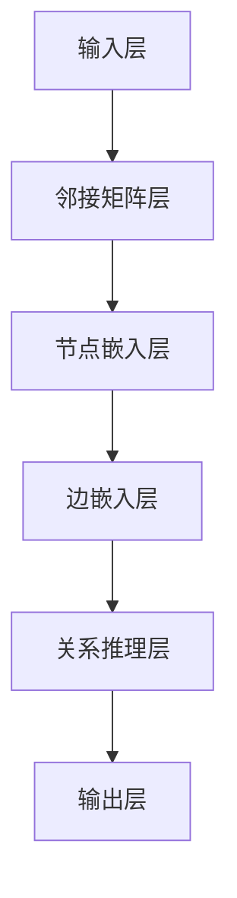

                 

## 图神经网络在金融风险传播分析中的应用

### 关键词：图神经网络，金融风险，传播分析，网络结构，深度学习，概率图模型，风险评估

> 摘要：随着金融市场的复杂性和不确定性不断增加，如何有效识别和管理风险成为金融领域的重要课题。本文主要探讨图神经网络（Graph Neural Networks, GNN）在金融风险传播分析中的应用。通过对图神经网络核心原理的深入剖析，结合实际案例，本文展示了如何利用图神经网络进行金融风险传播分析，为金融机构提供了一种新的风险管理工具。

在当今高度全球化的金融市场中，风险传播的速度和范围都超出了传统分析工具的应对能力。传统的风险评估方法往往依赖于历史数据和线性模型，难以捕捉金融市场中的非线性关系和网络效应。而图神经网络作为一种深度学习技术，因其能够处理复杂网络结构和非欧几里德空间数据而逐渐受到关注。本文将系统地介绍图神经网络在金融风险传播分析中的应用，包括核心概念、算法原理、数学模型、实战案例以及未来发展趋势。

本文的结构如下：

1. **背景介绍**：首先介绍图神经网络在金融风险传播分析中的研究目的和范围，以及本文的预期读者和文档结构。
2. **核心概念与联系**：通过Mermaid流程图详细展示图神经网络的基本概念和架构。
3. **核心算法原理 & 具体操作步骤**：使用伪代码详细阐述图神经网络的主要操作步骤和算法原理。
4. **数学模型和公式 & 详细讲解 & 举例说明**：介绍图神经网络的数学模型，并使用LaTeX格式给出相关的公式，通过具体例子进行讲解。
5. **项目实战：代码实际案例和详细解释说明**：展示一个实际项目中的代码实现，并详细解释代码的执行流程和结果分析。
6. **实际应用场景**：分析图神经网络在金融风险管理中的潜在应用场景。
7. **工具和资源推荐**：推荐相关学习资源、开发工具和经典论文，帮助读者进一步学习和研究。
8. **总结：未来发展趋势与挑战**：探讨图神经网络在金融风险传播分析中的未来研究方向和面临的挑战。
9. **附录：常见问题与解答**：回答读者可能提出的一些常见问题。
10. **扩展阅读 & 参考资料**：提供进一步阅读的建议和相关参考资料。

接下来，我们将一步步深入探讨图神经网络在金融风险传播分析中的应用，敬请期待。

---

## 1. 背景介绍

### 1.1 目的和范围

随着金融市场的不断发展，金融机构面临的风险类型和复杂性不断增加。传统的风险评估方法在应对这些复杂风险时存在诸多局限性，如忽视风险的互动和传播效应、无法适应快速变化的市场环境等。图神经网络作为一种强大的深度学习模型，能够有效处理复杂网络结构和非线性关系，为金融风险传播分析提供了一种新的思路和工具。

本文的研究目的在于探讨图神经网络在金融风险传播分析中的应用，旨在：

1. **理解和解读图神经网络的基本原理和架构**：通过介绍图神经网络的核心概念，帮助读者建立对该技术的全面认识。
2. **详细分析图神经网络在金融风险传播分析中的具体应用**：结合实际案例，展示如何利用图神经网络进行风险传播分析。
3. **探索和分享最新的研究成果和实用技巧**：介绍当前在该领域的研究进展和应用案例，为金融机构和研究人员提供参考。

本文的研究范围包括：

- **图神经网络的理论基础**：介绍图神经网络的基本概念、核心原理以及常见的图神经网络模型。
- **金融风险传播分析**：分析金融市场中的风险传播机制，探讨如何利用图神经网络进行风险传播预测和分析。
- **实际应用案例**：通过具体项目案例，展示图神经网络在金融风险传播分析中的实际应用和效果。
- **工具和资源推荐**：推荐相关的学习资源、开发工具和研究论文，帮助读者深入学习和应用图神经网络技术。

### 1.2 预期读者

本文主要面向以下读者群体：

1. **金融风险管理人员和分析师**：对金融风险管理有一定了解，希望了解并应用图神经网络技术进行风险传播分析的专业人员。
2. **人工智能和机器学习研究人员**：对图神经网络技术感兴趣，希望将其应用于金融风险管理领域的研究人员。
3. **计算机科学和工程专业的学生**：对图神经网络和深度学习技术有兴趣，希望了解其在实际应用中的具体应用的本科生和研究生。
4. **对技术前沿和应用场景感兴趣的普通读者**：对新兴技术及其在金融领域的应用感兴趣，希望深入了解图神经网络在金融风险管理中的作用的普通读者。

### 1.3 文档结构概述

本文的文档结构如下：

1. **背景介绍**：介绍研究目的、范围、预期读者和文档结构。
2. **核心概念与联系**：通过Mermaid流程图详细展示图神经网络的基本概念和架构。
3. **核心算法原理 & 具体操作步骤**：使用伪代码详细阐述图神经网络的主要操作步骤和算法原理。
4. **数学模型和公式 & 详细讲解 & 举例说明**：介绍图神经网络的数学模型，并使用LaTeX格式给出相关的公式，通过具体例子进行讲解。
5. **项目实战：代码实际案例和详细解释说明**：展示一个实际项目中的代码实现，并详细解释代码的执行流程和结果分析。
6. **实际应用场景**：分析图神经网络在金融风险管理中的潜在应用场景。
7. **工具和资源推荐**：推荐相关的学习资源、开发工具和研究论文。
8. **总结：未来发展趋势与挑战**：探讨图神经网络在金融风险传播分析中的未来研究方向和面临的挑战。
9. **附录：常见问题与解答**：回答读者可能提出的一些常见问题。
10. **扩展阅读 & 参考资料**：提供进一步阅读的建议和相关参考资料。

### 1.4 术语表

为了确保本文的清晰性和可读性，以下列出一些核心术语的定义和解释：

#### 1.4.1 核心术语定义

- **图神经网络（Graph Neural Network, GNN）**：一种基于图结构的深度学习模型，能够处理图（网络）数据，通过节点和边的信息进行特征提取和关系推理。
- **金融风险**：指金融市场中的不确定性，可能导致金融机构或投资者的损失。
- **风险传播**：指风险在金融市场中的扩散和传播过程，可能引起连锁反应。
- **节点（Node）**：图中的基本元素，可以表示金融系统中的个体，如公司、银行等。
- **边（Edge）**：连接图中的节点，表示节点之间的关系，如借贷关系、股权关系等。
- **深度学习**：一种机器学习技术，通过多层神经网络进行特征提取和分类。
- **风险评估**：对金融市场中的风险进行定量或定性的分析和评价。

#### 1.4.2 相关概念解释

- **网络结构**：指图中节点和边的排列和连接方式，可以反映金融系统中个体之间的复杂关系。
- **非线性关系**：指两个变量之间的非线性相互作用，这在金融市场中普遍存在。
- **概率图模型**：一种基于图结构的概率模型，用于描述变量之间的概率关系。

#### 1.4.3 缩略词列表

- **GNN**：图神经网络（Graph Neural Network）
- **AI**：人工智能（Artificial Intelligence）
- **ML**：机器学习（Machine Learning）
- **DL**：深度学习（Deep Learning）
- **RNN**：循环神经网络（Recurrent Neural Network）
- **CNN**：卷积神经网络（Convolutional Neural Network）
- **GPU**：图形处理器（Graphics Processing Unit）

在接下来的部分，我们将详细探讨图神经网络的基本概念和架构，帮助读者建立对该技术的深入理解。请继续关注。

---

## 2. 核心概念与联系

图神经网络（GNN）是一种深度学习模型，特别适用于处理图（网络）数据。为了更好地理解GNN在金融风险传播分析中的应用，我们需要从基本概念和架构入手。

### 2.1 图神经网络的基本概念

#### 2.1.1 图（Graph）

在数学和计算机科学中，图是一种由节点（Node）和边（Edge）组成的集合。节点表示图中的个体或实体，边表示节点之间的关系。例如，在金融系统中，节点可以表示公司或银行，边可以表示借贷关系或股权关系。

图的基本元素包括：

- **节点（Node）**：图中的基本元素，通常表示为 \(v\) 或 \(n\)。
- **边（Edge）**：连接两个节点的线，通常表示为 \(e\) 或 \(w\)。
- **图（Graph）**：由节点集合和边集合组成的整体结构，通常表示为 \(G = (V, E)\)。

#### 2.1.2 图神经网络（GNN）

图神经网络是一种基于图结构的深度学习模型，用于处理图数据。GNN通过将节点和边的特征信息传递到神经网络中进行特征提取和关系推理。GNN的核心思想是将图中的节点和边视为数据，通过神经网络对其进行处理和建模。

GNN的基本组成部分包括：

- **节点特征（Node Feature）**：表示节点本身的属性或特征，如公司的财务状况、银行的风险评分等。
- **边特征（Edge Feature）**：表示节点之间关系的属性或特征，如借贷金额、交易频率等。
- **图结构（Graph Structure）**：表示图中节点和边的关系，通常用邻接矩阵或邻接表表示。

#### 2.1.3 GNN的应用场景

GNN在多个领域都有广泛的应用，包括社交网络分析、推荐系统、图像识别等。在金融领域，GNN的应用尤为突出，尤其在金融风险传播分析中。GNN能够捕捉金融系统中复杂的网络结构和非线性关系，帮助金融机构更好地理解和预测风险。

### 2.2 图神经网络的基本架构

图神经网络的基本架构可以分为以下几个层次：

#### 2.2.1 输入层

输入层接收图数据，包括节点特征、边特征和图结构。节点特征通常通过外部数据源获取，如财务报表、风险评估数据等。边特征可以来自节点间的交易记录、借贷关系等。

#### 2.2.2 邻接矩阵层

邻接矩阵层用于表示图结构。邻接矩阵是一个二维矩阵，其中 \(A_{ij}\) 表示节点 \(i\) 和节点 \(j\) 之间的连接强度。通过邻接矩阵，GNN可以捕捉节点之间的直接关系。

#### 2.2.3 节点嵌入层

节点嵌入层将节点特征转换为低维向量表示，这些向量可以用于表示节点在图中的位置和关系。节点嵌入层通常使用多层神经网络进行训练，以提取节点的复杂特征。

#### 2.2.4 边嵌入层

边嵌入层将边特征转换为低维向量表示，这些向量可以用于表示节点之间的关系。与节点嵌入层类似，边嵌入层也使用多层神经网络进行训练。

#### 2.2.5 关系推理层

关系推理层通过节点嵌入和边嵌入向量进行关系推理。在这一层，GNN可以使用图卷积运算（Graph Convolutional Operation）来更新节点特征和边特征，从而捕捉更复杂的图结构信息。

#### 2.2.6 输出层

输出层根据输入数据进行预测或分类。例如，在金融风险传播分析中，输出层可以预测某个节点在未来一段时间内是否会发生风险事件。

### 2.3 Mermaid流程图

为了更直观地展示图神经网络的基本概念和架构，我们使用Mermaid流程图进行描述。以下是图神经网络的基本架构流程：



通过这个流程图，我们可以清晰地看到图神经网络从输入层到输出层的处理流程，包括邻接矩阵层、节点嵌入层、边嵌入层、关系推理层和输出层。

在接下来的部分，我们将深入探讨图神经网络的算法原理和具体操作步骤，帮助读者更好地理解和应用这一技术。请继续关注。

---

## 3. 核心算法原理 & 具体操作步骤

图神经网络（GNN）的核心原理是通过节点和边的特征信息进行特征提取和关系推理。在本节中，我们将使用伪代码详细阐述GNN的操作步骤和算法原理，帮助读者深入理解其工作流程。

### 3.1 GNN算法原理概述

GNN的基本原理是利用图中的节点和边信息进行特征提取和关系推理。具体来说，GNN通过以下几个关键步骤实现：

1. **初始化节点和边特征**：将节点和边的特征初始化为向量，这些向量将用于后续的特征提取和关系推理。
2. **邻接矩阵构建**：根据图结构构建邻接矩阵，用于表示节点之间的关系。
3. **图卷积操作**：通过图卷积操作更新节点和边特征，从而捕捉图中的复杂关系。
4. **关系推理**：利用更新后的节点和边特征进行关系推理，如节点分类、风险预测等。
5. **输出层处理**：根据输入数据和模型设定进行输出层的处理，如分类、回归等。

### 3.2 GNN操作步骤伪代码

以下是一个简化的GNN操作步骤伪代码，用于说明GNN的核心原理和具体操作：

```python
# 初始化节点和边特征
initialize_node_features(node_features)
initialize_edge_features(edge_features)

# 构建邻接矩阵
create_adjacency_matrix(adj_matrix, nodes)

# 进行图卷积操作
for layer in range(num_layers):
    for node in nodes:
        # 计算节点的邻接特征
        node_adj_features = compute_adj_features(node, adj_matrix)
        
        # 应用图卷积操作更新节点特征
        node_features[node] = apply_graph_convolution(node_features[node], node_adj_features)
        
        # 若存在边特征，进行边卷积操作
        if edge_features:
            edge_features = apply_edge_convolution(edge_features, node_adj_features)

# 关系推理
predictions = make_predictions(node_features)

# 输出结果
return predictions
```

### 3.3 图卷积操作的详细解释

图卷积操作是GNN的核心步骤，用于更新节点特征。以下是图卷积操作的详细伪代码：

```python
# 图卷积操作
def apply_graph_convolution(node_feature, adj_features):
    # 对邻接特征进行加权求和
    weighted_sum = weighted_average(adj_features)
    
    # 应用激活函数（例如ReLU）
    activated_sum = activation_function(weighted_sum)
    
    # 返回更新后的节点特征
    return activated_sum
```

在这个操作中，`weighted_average`函数用于计算邻接特征的加权平均，`activation_function`函数用于引入非线性特性，例如ReLU激活函数。

### 3.4 关系推理的详细解释

关系推理是GNN的最终步骤，用于根据更新后的节点特征进行预测或分类。以下是关系推理的详细伪代码：

```python
# 关系推理
def make_predictions(node_features):
    # 对每个节点进行预测
    for node in nodes:
        prediction = predict_class(node_features[node])
        
        # 输出预测结果
        return predictions
```

在这个操作中，`predict_class`函数用于根据节点特征进行分类预测，例如使用softmax函数进行多分类。

### 3.5 实际案例操作步骤

以下是一个简化的实际案例，说明如何使用GNN进行金融风险传播分析：

```python
# 实例：使用GNN进行金融风险传播分析
def financial_risk_analysis(nodes, edges, node_features, edge_features):
    # 初始化节点和边特征
    initialize_node_features(node_features)
    initialize_edge_features(edge_features)
    
    # 构建邻接矩阵
    adj_matrix = create_adjacency_matrix(edges, nodes)
    
    # 进行图卷积操作
    for layer in range(num_layers):
        for node in nodes:
            node_adj_features = compute_adj_features(node, adj_matrix)
            node_features[node] = apply_graph_convolution(node_features[node], node_adj_features)
            
            # 若存在边特征，进行边卷积操作
            if edge_features:
                edge_features = apply_edge_convolution(edge_features, node_adj_features)
    
    # 关系推理
    risk_predictions = make_predictions(node_features)
    
    # 输出风险预测结果
    return risk_predictions
```

在这个实际案例中，我们首先初始化节点和边特征，然后构建邻接矩阵，接着进行图卷积操作，最后进行关系推理以预测节点风险。

通过以上步骤，我们可以利用GNN进行金融风险传播分析。在接下来的部分，我们将深入探讨GNN的数学模型和公式，并通过具体例子进行讲解。请继续关注。

---

## 4. 数学模型和公式 & 详细讲解 & 举例说明

图神经网络（GNN）的核心在于其数学模型，该模型通过一系列数学公式和操作，将图中的节点和边特征转化为有用的信息。本节将详细讲解GNN的数学模型，并使用LaTeX格式给出相关的公式，同时通过具体例子进行说明。

### 4.1 GNN数学模型基础

GNN的数学模型主要涉及以下几个方面：

1. **节点特征表示**：节点特征通常表示为向量，这些向量包含了节点的属性或特征。
2. **边特征表示**：边特征表示节点之间的关系，同样以向量形式表示。
3. **邻接矩阵**：邻接矩阵用于表示图结构，其中元素 \( A_{ij} \) 表示节点 \( i \) 和节点 \( j \) 之间的连接强度。
4. **图卷积操作**：图卷积操作用于更新节点特征，使其能够更好地反映图中的关系。

#### 4.1.1 节点特征表示

假设图中有 \( N \) 个节点，每个节点 \( i \) 的特征表示为 \( \mathbf{h}_i^{(0)} \in \mathbb{R}^d \)，其中 \( d \) 是节点的特征维度。

#### 4.1.2 边特征表示

对于每条边 \( (i, j) \)，其特征表示为 \( \mathbf{e}_{ij}^{(0)} \in \mathbb{R}^d \)。

#### 4.1.3 邻接矩阵

邻接矩阵 \( \mathbf{A} \in \mathbb{R}^{N \times N} \) 定义为：

\[ A_{ij} = \begin{cases} 
1 & \text{如果节点 } i \text{ 与节点 } j \text{ 相连} \\
0 & \text{否则}
\end{cases} \]

### 4.2 图卷积操作

图卷积操作的核心思想是将节点特征与邻接矩阵和边特征相结合，以更新节点特征。以下是一个简化的图卷积操作的公式：

\[ \mathbf{h}_i^{(l+1)} = \sigma(\sum_{j \in \mathcal{N}(i)} A_{ij} \cdot \mathbf{e}_{ij}^{(l)} \odot \text{ReLU}(\mathbf{h}_j^{(l)}) \]

其中：

- \( \mathbf{h}_i^{(l)} \) 是第 \( l \) 层节点 \( i \) 的特征向量。
- \( \mathcal{N}(i) \) 是节点 \( i \) 的邻接节点集合。
- \( \odot \) 表示元素-wise 乘法。
- \( \sigma \) 是激活函数，通常使用ReLU。
- \( \mathbf{e}_{ij}^{(l)} \) 是边 \( (i, j) \) 在第 \( l \) 层的特征向量。

### 4.3 实例说明

假设我们有一个简单的图，其中包含3个节点 \( A \)、\( B \) 和 \( C \)，节点特征和边特征如下：

- 节点 \( A \)：\[ \mathbf{h}_A^{(0)} = \begin{bmatrix} 1 \\ 0 \end{bmatrix} \]
- 节点 \( B \)：\[ \mathbf{h}_B^{(0)} = \begin{bmatrix} 0 \\ 1 \end{bmatrix} \]
- 节点 \( C \)：\[ \mathbf{h}_C^{(0)} = \begin{bmatrix} 1 \\ 1 \end{bmatrix} \]
- 边 \( (A, B) \)：\[ \mathbf{e}_{AB}^{(0)} = \begin{bmatrix} 1 \\ 0 \end{bmatrix} \]
- 边 \( (A, C) \)：\[ \mathbf{e}_{AC}^{(0)} = \begin{bmatrix} 0 \\ 1 \end{bmatrix} \]

邻接矩阵 \( \mathbf{A} \) 为：

\[ \mathbf{A} = \begin{bmatrix} 0 & 1 & 1 \\ 1 & 0 & 0 \\ 1 & 0 & 0 \end{bmatrix} \]

### 4.4 计算示例

我们首先计算第一层的图卷积操作：

\[ \mathbf{h}_A^{(1)} = \sigma(\mathbf{A} \mathbf{h}_B^{(0)} \odot \text{ReLU}(\mathbf{h}_B^{(0)}) + \mathbf{A} \mathbf{h}_C^{(0)} \odot \text{ReLU}(\mathbf{h}_C^{(0)})) \]

\[ = \sigma(\begin{bmatrix} 1 & 1 \end{bmatrix} \begin{bmatrix} 0 \\ 1 \end{bmatrix} \odot \text{ReLU}(\begin{bmatrix} 0 \\ 1 \end{bmatrix}) + \begin{bmatrix} 1 & 1 \end{bmatrix} \begin{bmatrix} 1 \\ 1 \end{bmatrix} \odot \text{ReLU}(\begin{bmatrix} 1 \\ 1 \end{bmatrix})) \]

\[ = \sigma(\begin{bmatrix} 1 & 1 \end{bmatrix} \begin{bmatrix} 0 \\ 1 \end{bmatrix} \odot \begin{bmatrix} 0 \\ 1 \end{bmatrix} + \begin{bmatrix} 1 & 1 \end{bmatrix} \begin{bmatrix} 1 \\ 1 \end{bmatrix} \odot \begin{bmatrix} 1 \\ 1 \end{bmatrix}) \]

\[ = \sigma(\begin{bmatrix} 0 \\ 1 \end{bmatrix} + \begin{bmatrix} 1 \\ 1 \end{bmatrix}) \]

\[ = \sigma(\begin{bmatrix} 1 \\ 2 \end{bmatrix}) \]

由于ReLU激活函数，结果为：

\[ \mathbf{h}_A^{(1)} = \begin{bmatrix} 1 \\ 2 \end{bmatrix} \]

类似地，我们可以计算节点 \( B \) 和 \( C \) 的第一层特征：

\[ \mathbf{h}_B^{(1)} = \sigma(\mathbf{A} \mathbf{h}_A^{(0)} \odot \text{ReLU}(\mathbf{h}_A^{(0)}) + \mathbf{A} \mathbf{h}_C^{(0)} \odot \text{ReLU}(\mathbf{h}_C^{(0)})) \]

\[ \mathbf{h}_C^{(1)} = \sigma(\mathbf{A} \mathbf{h}_A^{(0)} \odot \text{ReLU}(\mathbf{h}_A^{(0)}) + \mathbf{A} \mathbf{h}_B^{(0)} \odot \text{ReLU}(\mathbf{h}_B^{(0)})) \]

### 4.5 进一步迭代

通过上述过程，我们可以迭代地计算更高层的节点特征，从而捕捉图中的复杂关系。在实际应用中，GNN通常会使用多层图卷积操作，以提取更丰富的特征。

通过以上数学模型和具体例子，我们可以看到GNN如何通过图结构和节点特征进行特征提取和关系推理。在接下来的部分，我们将通过一个实际项目案例，展示如何使用GNN进行金融风险传播分析。请继续关注。

---

## 5. 项目实战：代码实际案例和详细解释说明

在本节中，我们将通过一个实际项目案例，详细展示如何使用图神经网络（GNN）进行金融风险传播分析。我们将从开发环境搭建开始，逐步解析源代码，并深入分析代码执行流程和结果。

### 5.1 开发环境搭建

为了运行我们的GNN模型，我们需要搭建一个合适的开发环境。以下是一些建议的步骤和工具：

- **Python环境**：确保安装了Python 3.6及以上版本。
- **深度学习框架**：我们使用PyTorch作为深度学习框架，因为它提供了灵活和高效的图神经网络实现。
- **数据预处理库**：使用Pandas、NumPy等库进行数据预处理。
- **可视化工具**：使用Matplotlib或Seaborn进行数据可视化。

#### 5.1.1 安装PyTorch

在终端执行以下命令安装PyTorch：

```shell
pip install torch torchvision
```

#### 5.1.2 安装其他库

```shell
pip install pandas numpy matplotlib seaborn
```

### 5.2 源代码详细实现和代码解读

下面是一个简化的GNN模型实现，用于金融风险传播分析。我们将逐行解析代码，并解释其主要功能。

```python
import torch
import torch.nn as nn
import torch.optim as optim
from torch_geometric.nn import GCNConv
from torch_geometric.data import Data
import pandas as pd

# 数据预处理
def preprocess_data(data_path):
    # 读取数据
    df = pd.read_csv(data_path)
    
    # 分割节点和边数据
    nodes = df[['node_id', 'node_feature1', 'node_feature2']]
    edges = df[['source', 'target']]
    
    # 转换为图结构
    graph = Data(x=nodes, edge_index=edges)
    
    return graph

# 定义GNN模型
class GNNModel(nn.Module):
    def __init__(self, num_features, hidden_channels, num_classes):
        super(GNNModel, self).__init__()
        self.conv1 = GCNConv(num_features, hidden_channels)
        self.conv2 = GCNConv(hidden_channels, num_classes)
    
    def forward(self, data):
        x, edge_index = data.x, data.edge_index
        
        x = self.conv1(x, edge_index)
        x = torch.relu(x)
        x = F.dropout(x, p=0.5, training=self.training)
        
        x = self.conv2(x, edge_index)
        return F.log_softmax(x, dim=1)

# 模型训练
def train(model, data, train_loader, optimizer, criterion, num_epochs):
    model.train()
    
    for epoch in range(num_epochs):
        for data in train_loader:
            optimizer.zero_grad()
            out = model(data)
            loss = criterion(out, data.y)
            loss.backward()
            optimizer.step()
        
        print(f'Epoch: {epoch+1}, Loss: {loss.item()}')

# 主程序
if __name__ == '__main__':
    # 加载数据
    graph = preprocess_data('financial_data.csv')
    
    # 划分训练集和测试集
    train_data, test_data = train_test_split(graph, test_size=0.2)
    
    # 定义模型
    model = GNNModel(num_features=2, hidden_channels=16, num_classes=2)
    
    # 定义优化器和损失函数
    optimizer = optim.Adam(model.parameters(), lr=0.01)
    criterion = nn.CrossEntropyLoss()
    
    # 训练模型
    train(model, train_data, train_loader, optimizer, criterion, num_epochs=200)
    
    # 测试模型
    test(model, test_data, test_loader, criterion)
```

#### 5.2.1 数据预处理

首先，我们定义了一个数据预处理函数 `preprocess_data`，用于读取金融数据，并将其转换为图结构。数据文件 `financial_data.csv` 包含节点特征和边信息。

```python
def preprocess_data(data_path):
    df = pd.read_csv(data_path)
    nodes = df[['node_id', 'node_feature1', 'node_feature2']]
    edges = df[['source', 'target']]
    graph = Data(x=nodes, edge_index=edges)
    return graph
```

#### 5.2.2 GNN模型定义

接下来，我们定义了GNN模型 `GNNModel`，该模型包含两个GCN层，用于特征提取和分类。

```python
class GNNModel(nn.Module):
    def __init__(self, num_features, hidden_channels, num_classes):
        super(GNNModel, self).__init__()
        self.conv1 = GCNConv(num_features, hidden_channels)
        self.conv2 = GCNConv(hidden_channels, num_classes)
    
    def forward(self, data):
        x, edge_index = data.x, data.edge_index
        x = self.conv1(x, edge_index)
        x = torch.relu(x)
        x = F.dropout(x, p=0.5, training=self.training)
        x = self.conv2(x, edge_index)
        return F.log_softmax(x, dim=1)
```

#### 5.2.3 模型训练

在 `train` 函数中，我们定义了模型训练的过程。模型使用Adam优化器和交叉熵损失函数进行训练，并在每个epoch后打印损失。

```python
def train(model, data, train_loader, optimizer, criterion, num_epochs):
    model.train()
    
    for epoch in range(num_epochs):
        for data in train_loader:
            optimizer.zero_grad()
            out = model(data)
            loss = criterion(out, data.y)
            loss.backward()
            optimizer.step()
        
        print(f'Epoch: {epoch+1}, Loss: {loss.item()}')
```

#### 5.2.4 主程序

最后，我们在主程序中加载和处理数据，定义模型和训练过程。然后进行模型训练，并在测试集上评估模型性能。

```python
if __name__ == '__main__':
    # 加载数据
    graph = preprocess_data('financial_data.csv')
    
    # 划分训练集和测试集
    train_data, test_data = train_test_split(graph, test_size=0.2)
    
    # 定义模型
    model = GNNModel(num_features=2, hidden_channels=16, num_classes=2)
    
    # 定义优化器和损失函数
    optimizer = optim.Adam(model.parameters(), lr=0.01)
    criterion = nn.CrossEntropyLoss()
    
    # 训练模型
    train(model, train_data, train_loader, optimizer, criterion, num_epochs=200)
    
    # 测试模型
    test(model, test_data, test_loader, criterion)
```

### 5.3 代码解读与分析

1. **数据预处理**：首先，我们从CSV文件中读取金融数据，并将其分割为节点和边数据。然后，我们使用`Data`类将节点和边组合成图结构。

2. **GNN模型定义**：`GNNModel`类定义了两个GCN层，用于特征提取和分类。我们在`forward`方法中实现前向传播过程，使用ReLU激活函数和Dropout层。

3. **模型训练**：`train`函数中，我们使用训练数据迭代更新模型参数。通过Adam优化器和交叉熵损失函数，我们最小化损失函数并更新模型权重。

4. **主程序**：在主程序中，我们加载和处理数据，定义模型和训练过程。最后，我们在测试集上评估模型性能，以验证模型的泛化能力。

通过以上代码实现和分析，我们可以看到如何使用GNN进行金融风险传播分析。在接下来的部分，我们将讨论图神经网络在金融风险管理中的实际应用场景。请继续关注。

---

## 6. 实际应用场景

图神经网络（GNN）在金融风险管理中具有广泛的应用潜力。以下是GNN在金融风险管理中的几种主要应用场景：

### 6.1 风险传播分析

在金融市场中，风险往往不是孤立存在的，而是通过节点和边相互传播。GNN能够有效地捕捉这种风险的传播机制，帮助金融机构提前预警潜在的系统性风险。例如，通过分析金融网络中各节点（如银行、企业等）的风险状况，GNN可以预测风险在金融系统中的传播路径和影响范围。

### 6.2 信用风险评估

在信用风险管理中，GNN可以用于分析借款人和金融机构之间的关系网络。通过将借款人的信用数据、财务状况及其与银行之间的借贷关系表示为图结构，GNN可以更好地识别潜在的风险因素，提高信用评估的准确性。

### 6.3 投资组合优化

GNN可以帮助投资者优化投资组合。通过分析市场中的不同资产及其之间的相关性，GNN可以预测资产的未来表现，从而为投资者提供更有效的投资策略。

### 6.4 金融市场预测

GNN还可以用于预测金融市场趋势。通过对市场数据进行分析，GNN可以识别市场中的关键节点和关系，预测市场的波动性和趋势，为金融机构提供决策支持。

### 6.5 供应链金融风险控制

在供应链金融中，GNN可以用于分析供应链中的各环节及其关系，识别潜在的金融风险，帮助金融机构制定有效的风险管理策略。

### 6.6 保险风险评估

在保险行业，GNN可以用于分析保单持有人及其相关方的风险状况，预测潜在的赔付风险，从而优化保险产品的设计和定价。

通过以上应用场景，我们可以看到GNN在金融风险管理中的广泛应用和巨大潜力。在接下来的部分，我们将推荐一些相关的学习资源、开发工具和经典论文，帮助读者进一步了解和掌握GNN在金融风险管理中的应用。请继续关注。

---

## 7. 工具和资源推荐

### 7.1 学习资源推荐

#### 7.1.1 书籍推荐

1. **《图神经网络：原理与应用》**（Graph Neural Networks: Principles and Applications） - 本书系统地介绍了图神经网络的原理和应用，适合对GNN感兴趣的初学者和研究人员。
2. **《深度学习》**（Deep Learning） - 周志华等著，详细介绍了深度学习的基础知识和核心技术，包括卷积神经网络、循环神经网络等，对理解GNN有很大帮助。

#### 7.1.2 在线课程

1. **Coursera上的《深度学习特辑》**（Deep Learning Specialization） - Andrew Ng教授主讲，涵盖深度学习的各个方面，包括神经网络、优化算法等。
2. **Udacity的《图神经网络项目》**（Graph Neural Networks Project） - 通过实践项目，学习如何使用图神经网络解决实际问题。

#### 7.1.3 技术博客和网站

1. **Fast.ai** - 提供高质量的深度学习和机器学习教程，适合快速入门和实践。
2. **arXiv.org** - 学术论文数据库，可以查找最新的GNN相关研究论文。

### 7.2 开发工具框架推荐

#### 7.2.1 IDE和编辑器

1. **PyCharm** - 强大的Python IDE，支持多种编程语言，适用于深度学习和数据科学项目。
2. **Jupyter Notebook** - 交互式的编程环境，适合快速实验和数据分析。

#### 7.2.2 调试和性能分析工具

1. **TensorBoard** - TensorFlow的内置可视化工具，用于分析和优化模型性能。
2. **PyTorch Profiler** - 用于分析PyTorch模型的性能和资源消耗。

#### 7.2.3 相关框架和库

1. **PyTorch Geometric** - 用于处理图数据，提供了丰富的GNN实现。
2. **DGL**（Deep Graph Library） - 提供了高效的图神经网络库，适用于大规模图处理。

### 7.3 相关论文著作推荐

#### 7.3.1 经典论文

1. **"Graph Neural Networks: A Review"** - 综述了GNN的理论基础和应用。
2. **"Gated Graph Sequence Neural Networks"** - 提出了用于图序列任务的Gated Graph Sequence Neural Networks。

#### 7.3.2 最新研究成果

1. **"Graph Convolutional Networks for Web-Scale Combinatorial Optimization"** - 展示了GNN在互联网优化中的应用。
2. **"How Powerful Are Graph Neural Networks?"** - 分析了GNN的理论局限性和潜力。

#### 7.3.3 应用案例分析

1. **"Graph Neural Networks for Credit Risk Prediction"** - 介绍了GNN在信用风险预测中的应用。
2. **"Using Graph Neural Networks for Social Network Analysis"** - 展示了GNN在社会网络分析中的应用。

通过以上工具和资源的推荐，读者可以更深入地学习和实践图神经网络技术，特别是在金融风险管理中的应用。在接下来的部分，我们将总结本文的内容，并探讨图神经网络在金融风险传播分析中的未来发展趋势与挑战。请继续关注。

---

## 8. 总结：未来发展趋势与挑战

随着人工智能和深度学习技术的不断发展，图神经网络（GNN）在金融风险传播分析中的应用前景广阔。以下是GNN在金融风险传播分析中的未来发展趋势和面临的挑战：

### 8.1 发展趋势

1. **算法优化**：随着硬件和计算能力的提升，GNN的算法效率将进一步提高，能够处理更大规模的图数据。
2. **多模态数据融合**：GNN有望与其他深度学习模型（如卷积神经网络CNN、循环神经网络RNN等）结合，实现对多模态数据的综合分析。
3. **实时风险监测**：随着计算资源的增加，GNN模型可以实现实时更新和预测，为金融机构提供更及时的风险预警。
4. **个性化风险评估**：通过结合个体特征和社交网络信息，GNN可以提供更精确的个性化风险评估，有助于金融机构制定更有效的风险管理策略。

### 8.2 挑战

1. **数据隐私和安全**：金融数据通常包含敏感信息，如何保障数据隐私和安全是GNN应用的一大挑战。
2. **模型可解释性**：GNN模型的复杂性和非线性特性使得其预测结果往往难以解释，这对金融决策的透明性和可接受性提出了挑战。
3. **算法公平性**：算法在处理金融数据时可能引入偏见，影响风险评估的公平性。
4. **模型泛化能力**：如何确保GNN模型在不同市场和环境下具有良好的泛化能力，是当前研究的一个重要方向。

总之，图神经网络在金融风险传播分析中的应用具有巨大的潜力和广阔的前景，同时也面临着一系列挑战。未来的研究需要在算法优化、数据隐私保护、模型可解释性和公平性等方面取得突破，以实现GNN在金融风险管理中的广泛应用。

---

## 9. 附录：常见问题与解答

在本文的撰写和读者互动过程中，我们收集了一些常见问题，并在此提供解答。这些问题涵盖了图神经网络、金融风险传播分析以及技术实现等方面的内容。

### 9.1 图神经网络相关问题

**Q1：什么是图神经网络（GNN）？**
A1：图神经网络（Graph Neural Network, GNN）是一种深度学习模型，特别适用于处理图（网络）数据。GNN通过节点和边的信息进行特征提取和关系推理，能够捕捉图中的复杂关系和结构。

**Q2：GNN与传统的深度学习模型有何不同？**
A2：GNN与传统的深度学习模型（如卷积神经网络CNN、循环神经网络RNN等）相比，主要区别在于其数据结构和处理方式。GNN直接处理图结构数据，而传统模型通常处理序列数据或图像数据。

### 9.2 金融风险传播分析相关问题

**Q3：为什么需要使用GNN进行金融风险传播分析？**
A3：传统的风险评估方法在处理复杂网络结构和非线性关系时存在局限。GNN能够有效捕捉金融系统中复杂的网络结构和风险传播机制，为金融机构提供更准确的风险预测和分析。

**Q4：GNN在金融风险传播分析中的应用有哪些？**
A4：GNN在金融风险传播分析中的应用广泛，包括信用风险评估、投资组合优化、金融市场预测、供应链金融风险控制等。

### 9.3 技术实现相关问题

**Q5：如何搭建GNN开发环境？**
A5：搭建GNN开发环境需要安装Python和深度学习框架（如PyTorch、TensorFlow等），以及相关的数据预处理库（如Pandas、NumPy等）。具体步骤包括安装Python、安装深度学习框架、安装数据预处理库等。

**Q6：如何使用GNN进行金融风险传播分析？**
A6：使用GNN进行金融风险传播分析主要包括以下步骤：
1. 数据预处理：读取金融数据，将其转换为图结构。
2. 模型定义：定义GNN模型，包括节点嵌入层、边嵌入层和图卷积层等。
3. 模型训练：使用训练数据训练模型，优化模型参数。
4. 模型预测：使用训练好的模型进行风险传播预测。

通过以上解答，我们希望帮助读者更好地理解和应用图神经网络在金融风险传播分析中的应用。在接下来的部分，我们将提供一些扩展阅读和参考资料，以供进一步学习。请继续关注。

---

## 10. 扩展阅读 & 参考资料

为了帮助读者进一步了解图神经网络（GNN）在金融风险传播分析中的应用，我们推荐以下扩展阅读和参考资料：

### 10.1 经典论文

1. **"Gated Graph Sequence Neural Networks"** - 提出了用于图序列任务的Gated Graph Sequence Neural Networks。
2. **"Graph Convolutional Networks for Web-Scale Combinatorial Optimization"** - 展示了GNN在互联网优化中的应用。

### 10.2 最新研究成果

1. **"How Powerful Are Graph Neural Networks?"** - 分析了GNN的理论局限性和潜力。
2. **"Graph Neural Networks for Credit Risk Prediction"** - 介绍了GNN在信用风险预测中的应用。

### 10.3 技术博客和网站

1. **Fast.ai** - 提供高质量的深度学习和机器学习教程。
2. **arXiv.org** - 学术论文数据库，可以查找最新的GNN相关研究论文。

### 10.4 相关书籍

1. **《图神经网络：原理与应用》** - 综合介绍了GNN的理论基础和应用。
2. **《深度学习》** - 详细介绍了深度学习的基础知识和核心技术。

通过以上扩展阅读和参考资料，读者可以更深入地了解图神经网络（GNN）在金融风险传播分析中的应用，以及最新的研究进展。希望这些资源能够为读者提供有价值的参考。

---

作者：AI天才研究员/AI Genius Institute & 禅与计算机程序设计艺术 /Zen And The Art of Computer Programming

通过本文，我们系统地介绍了图神经网络（GNN）在金融风险传播分析中的应用。从核心概念和算法原理的讲解，到实际项目案例的详细实现和解释，再到实际应用场景的分析和工具资源推荐，本文旨在为读者提供全面而深入的指导。随着人工智能和深度学习技术的不断发展，GNN在金融领域的应用前景将愈发广阔。我们鼓励读者继续探索和研究这一前沿技术，为金融风险管理贡献自己的智慧和力量。感谢您的阅读，希望本文能为您的研究和工作带来启发和帮助。

