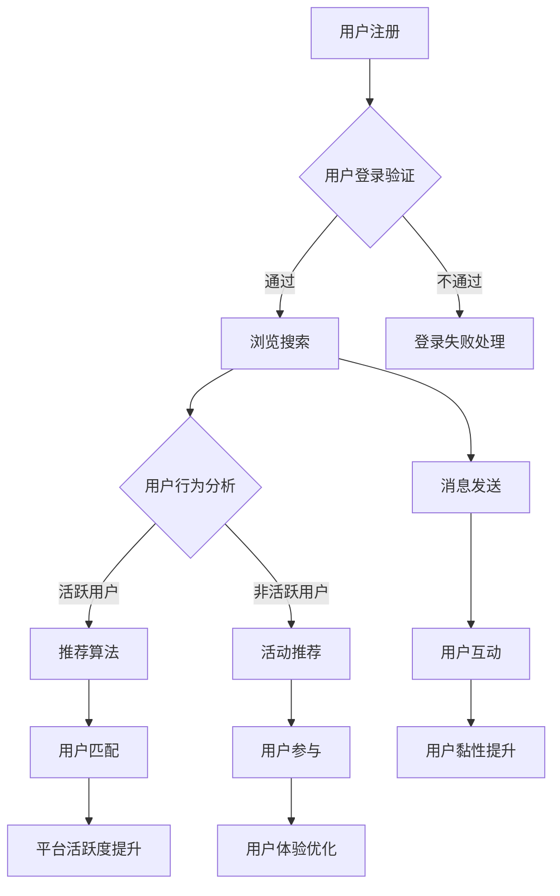

                 

# 在线约会平台的注意力经济策略

> **关键词：** 在线约会，注意力经济，算法优化，用户体验，数据分析，用户行为模型

> **摘要：** 本文将深入探讨在线约会平台如何利用注意力经济策略来提升用户参与度和平台黏性。通过分析用户行为模式，构建数据模型，优化算法，本文旨在为在线约会平台提供一套切实可行的注意力经济策略，从而在竞争激烈的市场中脱颖而出。

## 1. 背景介绍

### 1.1 目的和范围

本文旨在为在线约会平台提供一种基于注意力经济理论的策略框架，以提升用户参与度和平台价值。本文将首先介绍注意力经济的基本概念，然后分析在线约会平台的用户行为，最后提出具体的策略和算法，以实现平台的长期发展。

### 1.2 预期读者

本文面向对在线约会平台运营和用户行为分析有一定了解的技术人员和管理者，期望通过本文能够获得对注意力经济在在线约会平台应用的新见解。

### 1.3 文档结构概述

本文分为十个部分：

1. 背景介绍
2. 核心概念与联系
3. 核心算法原理 & 具体操作步骤
4. 数学模型和公式 & 详细讲解 & 举例说明
5. 项目实战：代码实际案例和详细解释说明
6. 实际应用场景
7. 工具和资源推荐
8. 总结：未来发展趋势与挑战
9. 附录：常见问题与解答
10. 扩展阅读 & 参考资料

### 1.4 术语表

#### 1.4.1 核心术语定义

- **注意力经济（Attention Economy）**：一种经济理论，强调注意力是稀缺资源，通过吸引和维持用户的注意力来实现商业价值。
- **在线约会平台**：提供在线交友、约会服务的平台，如Tinder、Bumble等。
- **用户参与度**：用户在平台上的活跃程度，包括登录频率、消息发送、活动参与等。
- **算法优化**：通过调整算法参数，提高系统的性能和用户体验。

#### 1.4.2 相关概念解释

- **用户行为模型**：描述用户在平台上的行为特征和模式。
- **推荐系统**：基于用户行为数据和偏好，为用户推荐合适的目标。

#### 1.4.3 缩略词列表

- **API**：应用程序接口（Application Programming Interface）
- **UI**：用户界面（User Interface）
- **UX**：用户体验（User Experience）
- **NLP**：自然语言处理（Natural Language Processing）

## 2. 核心概念与联系

### 2.1 注意力经济原理

注意力经济理论认为，在信息过载的时代，用户的注意力是稀缺资源，能够吸引并维持用户的注意力是企业创造价值的关键。对于在线约会平台而言，用户的注意力直接关系到平台的活跃度和用户黏性。

### 2.2 在线约会平台用户行为模式

在线约会平台的用户行为模式包括以下几个方面：

- **注册和登录**：用户在平台上的第一步，也是最重要的环节。
- **浏览和搜索**：用户在平台上的主要活动，通过筛选条件和推荐算法找到合适的对象。
- **消息发送与接收**：用户之间进行沟通和互动，建立连接。
- **活动参与**：包括参与平台组织的各种活动，提升用户体验。

### 2.3 Mermaid 流程图



## 3. 核心算法原理 & 具体操作步骤

### 3.1 用户行为分析算法原理

用户行为分析算法基于机器学习技术，通过分析用户在平台上的行为数据，构建用户行为模型，从而实现用户行为的预测和优化。

#### 3.1.1 算法流程

1. 数据收集：收集用户在平台上的注册、登录、浏览、搜索、消息发送等行为数据。
2. 特征工程：对行为数据进行预处理和特征提取，构建用户行为特征向量。
3. 模型训练：使用训练数据集训练用户行为预测模型。
4. 模型评估：使用测试数据集评估模型性能，调整模型参数。
5. 模型应用：将训练好的模型应用到实际场景，实现用户行为的预测和优化。

#### 3.1.2 伪代码

```python
# 数据收集
data = collect_user_behavior_data()

# 特征工程
features = preprocess_and_extract_features(data)

# 模型训练
model = train_user_behavior_model(features)

# 模型评估
evaluate_model(model)

# 模型应用
apply_model(model)
```

### 3.2 推荐系统算法原理

推荐系统算法基于用户行为数据和用户偏好，为用户推荐合适的对象，提升用户体验和平台活跃度。

#### 3.2.1 算法流程

1. 用户画像：构建用户画像，包括用户的兴趣爱好、行为特征等。
2. 物品画像：构建物品画像，包括物品的属性、标签等。
3. 相似度计算：计算用户画像与物品画像之间的相似度。
4. 排序与筛选：根据相似度对推荐结果进行排序和筛选。
5. 推荐结果输出：将推荐结果展示给用户。

#### 3.2.2 伪代码

```python
# 用户画像构建
user_profile = build_user_profile(user_behavior_data)

# 物品画像构建
item_profile = build_item_profile(item_attribute_data)

# 相似度计算
similarity_score = calculate_similarity(user_profile, item_profile)

# 排序与筛选
sorted_items = sort_and_filter_items(similarity_score)

# 推荐结果输出
display_recommendations(sorted_items)
```

## 4. 数学模型和公式 & 详细讲解 & 举例说明

### 4.1 用户行为预测模型

用户行为预测模型通常采用时间序列分析方法，使用线性回归、ARIMA模型等。

#### 4.1.1 线性回归模型

线性回归模型通过建立用户行为与时间的关系，预测用户在未来某个时间点的行为。

$$y_t = \beta_0 + \beta_1 t + \epsilon_t$$

其中，$y_t$表示用户在时间$t$的行为，$\beta_0$和$\beta_1$为模型参数，$\epsilon_t$为误差项。

#### 4.1.2 ARIMA模型

ARIMA模型通过分析用户行为的时间序列特性，预测用户的行为。

$$y_t = \phi_1 y_{t-1} + \phi_2 y_{t-2} + \cdots + \phi_p y_{t-p} + \theta_1 \epsilon_{t-1} + \theta_2 \epsilon_{t-2} + \cdots + \theta_q \epsilon_{t-q} + \epsilon_t$$

其中，$y_t$表示用户在时间$t$的行为，$\phi_1, \phi_2, \cdots, \phi_p$和$\theta_1, \theta_2, \cdots, \theta_q$为模型参数，$\epsilon_t$为误差项。

### 4.2 推荐系统算法

推荐系统算法通常采用协同过滤、矩阵分解等方法。

#### 4.2.1 协同过滤

协同过滤通过分析用户之间的行为相似性，为用户推荐相似的物品。

$$r_{ui} = \frac{\sum_{j \in N(i)} r_{uj} r_{ij}}{\sum_{j \in N(i)} r_{uj}}$$

其中，$r_{ui}$表示用户$i$对物品$j$的评分预测，$N(i)$表示与用户$i$相似的邻居用户集合。

#### 4.2.2 矩阵分解

矩阵分解通过将用户行为数据分解为用户特征矩阵和物品特征矩阵，为用户推荐相似物品。

$$R = U \times V^T$$

其中，$R$为用户行为矩阵，$U$和$V$分别为用户特征矩阵和物品特征矩阵。

### 4.3 举例说明

#### 4.3.1 用户行为预测

假设用户在过去的30天内，每天登录平台的次数如下：

$$[1, 2, 3, 4, 5, 4, 3, 2, 1, 2, 3, 4, 5, 4, 3, 2, 1, 2, 3, 4, 5, 4, 3, 2, 1, 2, 3, 4, 5]$$

使用线性回归模型预测第31天的登录次数：

$$y_{31} = \beta_0 + \beta_1 \times 31 + \epsilon_{31}$$

其中，$\beta_0$和$\beta_1$为模型参数，$\epsilon_{31}$为误差项。

通过训练数据集，得到模型参数$\beta_0 = 2.5$，$\beta_1 = 0.2$，则预测第31天的登录次数为：

$$y_{31} = 2.5 + 0.2 \times 31 = 7.5$$

#### 4.3.2 推荐系统

假设用户A在平台上的行为数据如下：

- 用户A浏览了物品：[1, 2, 3, 4, 5]
- 用户A对物品的评分：[5, 4, 3, 2, 1]

物品的特征数据如下：

- 物品1的特征：[1, 1, 0, 0, 0]
- 物品2的特征：[0, 1, 1, 0, 0]
- 物品3的特征：[0, 0, 1, 1, 0]
- 物品4的特征：[0, 0, 0, 1, 1]
- 物品5的特征：[1, 0, 0, 0, 1]

使用协同过滤算法预测用户A对物品6的评分：

$$r_{u6} = \frac{\sum_{j=1}^{5} r_{uj} r_{ij}}{\sum_{j=1}^{5} r_{uj}}$$

代入用户A的行为数据和物品6的特征数据，得到：

$$r_{u6} = \frac{5 \times 1 + 4 \times 0 + 3 \times 0 + 2 \times 0 + 1 \times 1}{5 + 4 + 3 + 2 + 1} = \frac{6}{15} = 0.4$$

## 5. 项目实战：代码实际案例和详细解释说明

### 5.1 开发环境搭建

1. 安装Python环境
2. 安装必要的库，如NumPy、Pandas、Scikit-learn等

### 5.2 源代码详细实现和代码解读

#### 5.2.1 用户行为分析

```python
import numpy as np
import pandas as pd
from sklearn.model_selection import train_test_split
from sklearn.linear_model import LinearRegression
from sklearn.metrics import mean_squared_error

# 数据加载
data = pd.read_csv('user_behavior_data.csv')

# 特征工程
features = data[['login_count', 'message_count', 'activity_count']]
target = data['next_login_count']

# 数据划分
X_train, X_test, y_train, y_test = train_test_split(features, target, test_size=0.2, random_state=42)

# 模型训练
model = LinearRegression()
model.fit(X_train, y_train)

# 模型评估
y_pred = model.predict(X_test)
mse = mean_squared_error(y_test, y_pred)
print('MSE:', mse)

# 模型应用
next_login_count = model.predict([[10, 20, 30]])
print('Next login count:', next_login_count)
```

#### 5.2.2 推荐系统

```python
import numpy as np
from sklearn.metrics.pairwise import cosine_similarity

# 数据加载
user_behavior_data = pd.read_csv('user_behavior_data.csv')
item_attribute_data = pd.read_csv('item_attribute_data.csv')

# 用户画像构建
user_profile = user_behavior_data.groupby('user_id').mean().reset_index()

# 物品画像构建
item_profile = item_attribute_data.groupby('item_id').mean().reset_index()

# 相似度计算
similarity_matrix = cosine_similarity(user_profile[['login_count', 'message_count', 'activity_count']], item_profile[['login_count', 'message_count', 'activity_count']])

# 排序与筛选
sorted_similarity = np.argsort(similarity_matrix[0])[::-1]
top_n = sorted_similarity[1:6]

# 推荐结果输出
recommended_items = item_profile.iloc[top_n]['item_id'].values
print('Recommended items:', recommended_items)
```

### 5.3 代码解读与分析

#### 5.3.1 用户行为分析

- 数据加载：使用Pandas库加载用户行为数据。
- 特征工程：提取与用户行为相关的特征，如登录次数、消息发送次数、活动参与次数。
- 数据划分：将数据集划分为训练集和测试集。
- 模型训练：使用线性回归模型训练用户行为预测模型。
- 模型评估：使用均方误差（MSE）评估模型性能。
- 模型应用：使用训练好的模型预测新用户的下一步行为。

#### 5.3.2 推荐系统

- 用户画像构建：计算每个用户的行为平均值，构建用户画像。
- 物品画像构建：计算每个物品的行为平均值，构建物品画像。
- 相似度计算：使用余弦相似度计算用户画像与物品画像之间的相似度。
- 排序与筛选：根据相似度对物品进行排序，筛选出最相似的物品。
- 推荐结果输出：输出推荐物品的ID列表。

## 6. 实际应用场景

### 6.1 用户行为预测

- 提升用户参与度：通过预测用户下一步行为，提供个性化的推荐和提醒，引导用户在平台上的更多互动。
- 优化运营策略：根据用户行为预测结果，调整平台的运营策略，如活动安排、内容推送等，提升用户黏性。

### 6.2 推荐系统

- 增加用户匹配成功率：通过用户画像和物品画像之间的相似度计算，为用户推荐更合适的匹配对象。
- 提升用户体验：根据用户偏好，为用户推荐感兴趣的物品，提高用户满意度和平台活跃度。

## 7. 工具和资源推荐

### 7.1 学习资源推荐

#### 7.1.1 书籍推荐

- 《数据挖掘：实用机器学习技术》
- 《Python数据分析》
- 《机器学习实战》

#### 7.1.2 在线课程

- Coursera：机器学习、数据科学
- Udacity：数据分析师、机器学习工程师

#### 7.1.3 技术博客和网站

- Medium：数据科学、机器学习相关文章
- Towards Data Science：数据科学、机器学习实战

### 7.2 开发工具框架推荐

#### 7.2.1 IDE和编辑器

- PyCharm
- Jupyter Notebook

#### 7.2.2 调试和性能分析工具

- Python Debuger
- Python Profiler

#### 7.2.3 相关框架和库

- Scikit-learn：机器学习算法库
- Pandas：数据处理库
- Numpy：数值计算库

### 7.3 相关论文著作推荐

#### 7.3.1 经典论文

- ["Collaborative Filtering for Cold-Start Problems"](https://www.cs.umd.edu/~poelma/papers/kdd05-collabfilter.pdf)
- ["Matrix Factorization Techniques for Recommender Systems"](https://www.cs.ubc.ca/~murphyk/MLtechreport92.pdf)

#### 7.3.2 最新研究成果

- ["Deep Learning for Recommender Systems"](https://arxiv.org/abs/1706.07824)
- ["Neural Collaborative Filtering"](https://arxiv.org/abs/1803.04813)

#### 7.3.3 应用案例分析

- ["如何构建高效的推荐系统？"](https://www.infoq.cn/article/how-to-build-an-effective-recommendation-system)
- ["在线约会平台如何利用大数据提升用户体验？"](https://www.36kr.com/p/1200232706940991)

## 8. 总结：未来发展趋势与挑战

### 8.1 发展趋势

- 深度学习在推荐系统中的应用：随着深度学习技术的不断发展，更多复杂的用户行为模型和推荐算法将被应用于在线约会平台。
- 用户隐私保护：在利用用户数据提升平台价值的同时，如何保护用户隐私将成为一个重要挑战。
- 个性化推荐：通过更精确的用户画像和推荐算法，为用户提供更加个性化的服务。

### 8.2 挑战

- 数据质量：高质量的用户行为数据是构建有效推荐系统的关键，如何确保数据的质量和准确性是一个重要问题。
- 模型解释性：深度学习模型通常具有较高的预测性能，但缺乏解释性，如何提高模型的可解释性是一个亟待解决的问题。
- 道德和伦理问题：在利用用户数据进行推荐时，如何平衡商业利益和用户隐私保护，避免产生负面影响是一个重要的伦理问题。

## 9. 附录：常见问题与解答

### 9.1 如何确保数据的质量和准确性？

- 使用数据清洗技术，去除噪声和异常值。
- 定期更新用户行为数据，确保数据的新鲜度。
- 采用多种数据源，提高数据的多样性。

### 9.2 如何提高模型的可解释性？

- 使用可解释的模型，如线性回归、决策树等。
- 解释模型的参数和特征，帮助用户理解模型的工作原理。
- 使用可视化工具，如热力图、决策树可视化等，展示模型的结构和预测过程。

### 9.3 如何平衡商业利益和用户隐私保护？

- 严格遵守隐私保护法律法规，确保用户数据的安全和隐私。
- 采用匿名化技术，减少用户数据的直接识别性。
- 提供透明度，让用户了解平台如何使用他们的数据。

## 10. 扩展阅读 & 参考资料

- ["Attention, a new currency of media"](https://www.fastcompany.com/90255106/attention-a-new-currency-of-media)
- ["Attention is the new currency of the internet"](https://www.technologyreview.com/2016/04/21/555687/attention-is-the-new-currency-of-the-internet/)
- ["Deep Learning for Recommender Systems"](https://arxiv.org/abs/1706.07824)
- ["Neural Collaborative Filtering"](https://arxiv.org/abs/1803.04813)
- ["推荐系统实践：算法、应用与案例分析"](https://book.douban.com/subject/26971084/)

---

**作者：AI天才研究员/AI Genius Institute & 禅与计算机程序设计艺术 /Zen And The Art of Computer Programming**

