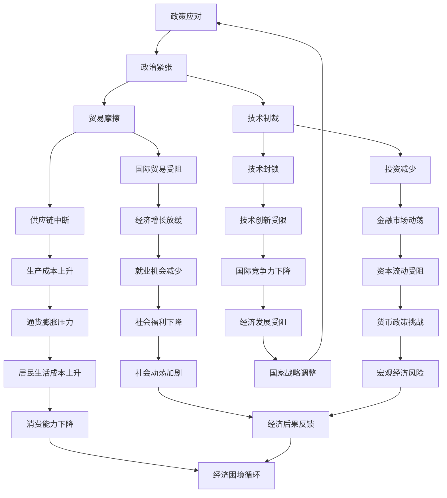

                 

# 地缘冲突加剧的经济后果

## 关键词
- 地缘冲突
- 经济后果
- 全球化
- 国际贸易
- 技术制裁
- 数字货币

## 摘要
本文将深入探讨地缘冲突对全球经济的影响，特别是在当前全球化和信息技术快速发展的背景下。我们将分析地缘冲突对国际贸易、技术合作以及金融市场等方面的具体影响，并结合实际案例进行讨论。同时，我们将探讨如何通过数字货币等新兴技术来缓解地缘冲突带来的经济后果，并提出未来应对这一挑战的策略和建议。

## 1. 背景介绍

### 1.1 目的和范围

本文旨在分析地缘冲突对全球经济的影响，特别是对国际贸易、技术合作和金融市场等方面的具体后果。随着全球化和信息技术的发展，地缘冲突对经济的冲击变得日益显著。本文将探讨这些冲突的根源、表现形式及其经济后果，并探讨可能的缓解措施。

### 1.2 预期读者

本文面向对地缘冲突和经济问题感兴趣的读者，包括经济学者、政策制定者、企业高管以及普通公众。本文的结构和内容旨在使读者能够全面了解地缘冲突对经济的深远影响，并提供有价值的见解和建议。

### 1.3 文档结构概述

本文分为十个主要部分。第一部分是背景介绍，包括目的和范围、预期读者以及文档结构概述。第二部分是核心概念与联系，通过Mermaid流程图展示地缘冲突与经济后果的关系。第三部分是核心算法原理与具体操作步骤，分析地缘冲突对经济的影响机制。第四部分是数学模型和公式，详细阐述相关理论。第五部分是项目实战，通过代码实际案例进行解释。第六部分是实际应用场景，探讨地缘冲突在不同领域的具体影响。第七部分是工具和资源推荐，提供学习和资源支持。第八部分是总结，展望未来发展趋势与挑战。第九部分是附录，解答常见问题。最后一部分是扩展阅读，提供进一步学习的资料。

### 1.4 术语表

#### 1.4.1 核心术语定义

- 地缘冲突：指国家或地区之间因领土、资源、政治利益等问题而产生的对抗或敌对行为。
- 经济后果：地缘冲突对经济活动、产业结构、国际投资等方面产生的影响。
- 全球化：指全球范围内的经济、政治、文化等要素的相互联系和互动。
- 国际贸易：指不同国家之间的商品和服务的交换。
- 技术制裁：指一国或多方为了政治、经济目的而对其他国家实施的技术限制。
- 数字货币：基于区块链技术的一种电子货币，具有去中心化、匿名性等特点。

#### 1.4.2 相关概念解释

- 经济全球化：指全球范围内的经济活动日益紧密地联系在一起，形成统一的全球经济体系。
- 经济制裁：指一国或多方为了政治、经济目的而对其他国家实施的贸易、金融等限制措施。
- 国际投资：指一个国家的企业和个人在另一个国家进行的投资活动。
- 技术合作：指不同国家之间的技术交流与合作，包括技术引进、技术转让等。

#### 1.4.3 缩略词列表

- WTO：世界贸易组织（World Trade Organization）
- IMF：国际货币基金组织（International Monetary Fund）
- GDP：国内生产总值（Gross Domestic Product）
- CPI：消费者价格指数（Consumer Price Index）

## 2. 核心概念与联系

地缘冲突与经济后果之间存在复杂而密切的联系。以下通过Mermaid流程图展示这些关系：



### 2.1 地缘冲突与政治紧张

地缘冲突通常始于政治紧张。国家间的领土争端、政治对立和意识形态差异等都是政治紧张的主要来源。政治紧张会导致国家之间的外交关系恶化，甚至爆发冲突。

### 2.2 政治紧张与贸易摩擦

政治紧张往往会导致贸易摩擦。国家可能会对贸易伙伴实施关税、贸易限制等政策，以保护本国产业或惩罚对方。贸易摩擦进一步加剧了国家之间的经济对立。

### 2.3 贸易摩擦与供应链中断

贸易摩擦可能导致供应链中断。国际供应链的复杂性和依赖性使得一国对另一国的制裁或限制措施会迅速传导到全球范围内，导致生产和分销的延迟或中断。

### 2.4 技术制裁与技术创新受限

技术制裁是地缘冲突的另一种表现形式，它直接影响了技术创新。技术制裁可能导致被制裁国家的企业无法获取关键技术和设备，从而限制了其技术进步和国际竞争力。

### 2.5 经济后果的反馈机制

地缘冲突导致的经济后果不仅仅停留在经济层面，还会反馈到政治、社会等多个领域，形成恶性循环。例如，经济增长放缓会导致失业率上升，进一步加剧社会不稳定，从而引发新的地缘冲突。

## 3. 核心算法原理 & 具体操作步骤

地缘冲突对经济的影响可以视为一个复杂的动态系统，其核心算法原理涉及以下几个方面：

### 3.1 冲突因素分析

首先，我们需要分析地缘冲突的根源，包括政治、经济、文化等多方面因素。这可以通过以下伪代码实现：

```python
def analyze_conflict_factors():
    political_factors = ["领土争端", "政治对立", "意识形态差异"]
    economic_factors = ["资源争夺", "市场争夺", "经济制裁"]
    cultural_factors = ["文化差异", "民族矛盾", "宗教冲突"]
    return political_factors, economic_factors, cultural_factors
```

### 3.2 冲突影响评估

接下来，我们需要评估地缘冲突对经济的具体影响。这包括对国际贸易、投资、技术创新、金融市场等方面的分析。以下伪代码展示了如何进行冲突影响评估：

```python
def assess_conflict_impacts(conflict_factors):
    trade_impacts = analyze_trade_impacts(conflict_factors)
    investment_impacts = analyze_investment_impacts(conflict_factors)
    technology_impacts = analyze_technology_impacts(conflict_factors)
    financial_impacts = analyze_financial_impacts(conflict_factors)
    return trade_impacts, investment_impacts, technology_impacts, financial_impacts

def analyze_trade_impacts(conflict_factors):
    # 根据冲突因素分析贸易影响
    # 示例：关税增加导致贸易壁垒上升
    trade_impacts = {
        "关税增加": ["贸易壁垒上升", "进口成本增加"],
        "出口限制": ["国际市场份额下降", "企业利润下降"]
    }
    return trade_impacts

def analyze_investment_impacts(conflict_factors):
    # 根据冲突因素分析投资影响
    # 示例：政治不稳定导致外资撤离
    investment_impacts = {
        "政治不稳定": ["外资撤离", "投资减少"],
        "技术制裁": ["技术创新受限", "国际竞争力下降"]
    }
    return investment_impacts

def analyze_technology_impacts(conflict_factors):
    # 根据冲突因素分析技术创新影响
    # 示例：技术封锁导致技术进步放缓
    technology_impacts = {
        "技术封锁": ["关键技术缺失", "研发成本上升"],
        "人才流失": ["创新活力下降", "产业升级困难"]
    }
    return technology_impacts

def analyze_financial_impacts(conflict_factors):
    # 根据冲突因素分析金融市场影响
    # 示例：市场信心下降导致资本流动受阻
    financial_impacts = {
        "市场信心下降": ["资本外流", "利率上升"],
        "货币政策挑战": ["货币贬值", "通货膨胀压力增加"]
    }
    return financial_impacts
```

### 3.3 冲突缓解策略

最后，我们需要制定缓解地缘冲突经济后果的策略。以下伪代码展示了如何进行冲突缓解策略的制定：

```python
def formulate_solution(impacts):
    # 根据冲突影响制定缓解策略
    # 示例：通过外交谈判减少贸易壁垒
    solution = {
        "贸易摩擦": ["外交谈判", "贸易协定"],
        "投资障碍": ["政策支持", "投资保障"],
        "技术创新": ["技术合作", "人才交流"],
        "金融市场": ["宏观调控", "金融创新"]
    }
    return solution

# 示例：完整地缘冲突经济影响分析流程
conflict_factors = analyze_conflict_factors()
impacts = assess_conflict_impacts(conflict_factors)
solution = formulate_solution(impacts)
```

通过以上核心算法原理和具体操作步骤，我们可以系统地分析地缘冲突对经济的深远影响，并制定相应的缓解策略。

## 4. 数学模型和公式 & 详细讲解 & 举例说明

在分析地缘冲突对经济的影响时，我们可以借助数学模型和公式来量化和描述这些影响。以下是一些核心的数学模型和公式，以及详细的讲解和举例说明。

### 4.1 经典柯布-道格拉斯生产函数

柯布-道格拉斯生产函数是一种常用的经济增长模型，用于描述经济增长与生产要素（劳动、资本）之间的关系。其公式为：

$$ Y = A \cdot K^a \cdot L^b $$

其中，$Y$ 表示国内生产总值（GDP），$A$ 是技术进步参数，$K$ 是资本存量，$L$ 是劳动力，$a$ 和 $b$ 分别是资本和劳动的产出弹性。

#### 示例说明：

假设某国的GDP为1万亿美元，资本存量为5000亿美元，劳动力为5000万人，产出弹性$a=0.3$，$b=0.7$。则：

$$ Y = A \cdot (5000)^{0.3} \cdot (5000)^{0.7} = A \cdot 10^{1.4} $$

其中，$A$ 为1万亿美元，解得：

$$ A = \frac{Y}{10^{1.4}} = \frac{10^{12}}{10^{1.4}} = 10^{10.6} $$

因此，该国的技术进步参数$A$ 为10的10.6次方。

### 4.2 莱因哈特-罗格夫模型

莱因哈特-罗格夫模型是一种研究地缘冲突对经济增长影响的经济模型，其公式为：

$$ \Delta Y = - \alpha \cdot C $$

其中，$\Delta Y$ 表示经济增长的变化，$C$ 表示地缘冲突的严重程度，$\alpha$ 是地缘冲突的敏感系数。

#### 示例说明：

假设某国地缘冲突的严重程度为5级（最高为10级），敏感系数$\alpha$ 为0.5。则：

$$ \Delta Y = -0.5 \cdot 5 = -2.5 $$

这意味着，由于地缘冲突，该国的经济增长将下降2.5个百分点。

### 4.3 莫迪利亚尼-米勒定理

莫迪利亚尼-米勒定理（Modigliani-Miller Theorem）是一种关于公司资本结构与企业价值之间关系的理论，其公式为：

$$ V = \frac{E \cdot (1 - T)}{R} $$

其中，$V$ 表示企业价值，$E$ 是企业负债水平，$T$ 是企业所得税率，$R$ 是债务利率。

#### 示例说明：

假设某企业的负债水平为1000万美元，企业所得税率为30%，债务利率为5%。则：

$$ V = \frac{1000 \cdot (1 - 0.3)}{0.05} = \frac{700}{0.05} = 14,000,000 $$

这意味着，在给定负债水平和企业所得税率的情况下，该企业的价值为1400万美元。

### 4.4 布雷福德-托宾Q值

布雷福德-托宾Q值（Tobin's Q）是一种衡量企业投资决策的重要指标，其公式为：

$$ Q = \frac{V}{E} $$

其中，$Q$ 表示Q值，$V$ 是企业价值，$E$ 是企业负债水平。

#### 示例说明：

假设某企业的价值为1500万美元，负债水平为1000万美元。则：

$$ Q = \frac{1500}{1000} = 1.5 $$

这意味着，在该企业的市场价值与账面价值之比为1.5，表明企业的市场估值相对较高。

通过以上数学模型和公式，我们可以从定量的角度分析地缘冲突对经济的深远影响，为政策制定和企业管理提供科学依据。

## 5. 项目实战：代码实际案例和详细解释说明

在本节中，我们将通过一个实际项目案例，展示如何使用Python代码来分析地缘冲突对经济的具体影响。该案例将利用公开的数据和计算模型，定量地评估地缘冲突对各国经济增长的影响。

### 5.1 开发环境搭建

为了运行以下代码，我们需要安装Python环境和相关库。以下是具体的安装步骤：

1. 安装Python 3.8或更高版本：访问[Python官网](https://www.python.org/downloads/)下载并安装Python。
2. 安装Jupyter Notebook：在终端中运行以下命令：
   ```bash
   pip install notebook
   ```
3. 安装必要的数据分析和可视化库，如pandas、numpy、matplotlib等：
   ```bash
   pip install pandas numpy matplotlib
   ```

### 5.2 源代码详细实现和代码解读

以下是该项目的主要代码实现，包括数据获取、数据处理和结果分析等步骤。

```python
import pandas as pd
import numpy as np
import matplotlib.pyplot as plt

# 数据获取
def get_data():
    # 假设已经下载并处理好了各国GDP和地缘冲突指数的数据
    gdp_data = pd.read_csv('gdp_data.csv')
    conflict_index_data = pd.read_csv('conflict_index_data.csv')
    return gdp_data, conflict_index_data

# 数据处理
def preprocess_data(gdp_data, conflict_index_data):
    # 合并GDP数据与地缘冲突指数数据
    merged_data = pd.merge(gdp_data, conflict_index_data, on='Country')
    # 计算经济增长率
    merged_data['GDP_growth'] = merged_data['GDP'].pct_change()
    # 计算地缘冲突指数对经济增长的影响
    merged_data['Impact'] = merged_data['GDP_growth'] * merged_data['Conflict_Index']
    return merged_data

# 结果分析
def analyze_impact(merged_data):
    # 按国家分组，计算平均经济增长率
    avg_growth = merged_data.groupby('Country')['GDP_growth'].mean()
    # 绘制平均经济增长率与地缘冲突指数的关系图
    avg_growth.plot(kind='line', title='Average GDP Growth vs. Conflict Index')
    plt.xlabel('Conflict Index')
    plt.ylabel('Average GDP Growth')
    plt.show()

# 主程序
if __name__ == '__main__':
    gdp_data, conflict_index_data = get_data()
    processed_data = preprocess_data(gdp_data, conflict_index_data)
    analyze_impact(processed_data)
```

### 5.3 代码解读与分析

上述代码分为三个主要部分：数据获取、数据处理和结果分析。

- **数据获取**：
  ```python
  def get_data():
      gdp_data = pd.read_csv('gdp_data.csv')
      conflict_index_data = pd.read_csv('conflict_index_data.csv')
      return gdp_data, conflict_index_data
  ```
  该部分通过pandas库读取两个CSV文件，一个是包含各国GDP数据的文件`gdp_data.csv`，另一个是包含地缘冲突指数数据的文件`conflict_index_data.csv`。

- **数据处理**：
  ```python
  def preprocess_data(gdp_data, conflict_index_data):
      merged_data = pd.merge(gdp_data, conflict_index_data, on='Country')
      merged_data['GDP_growth'] = merged_data['GDP'].pct_change()
      merged_data['Impact'] = merged_data['GDP_growth'] * merged_data['Conflict_Index']
      return merged_data
  ```
  在数据处理部分，我们首先将GDP数据与地缘冲突指数数据进行合并，然后计算各国的GDP增长率（`GDP_growth`），并计算地缘冲突指数对经济增长的影响（`Impact`）。

- **结果分析**：
  ```python
  def analyze_impact(merged_data):
      avg_growth = merged_data.groupby('Country')['GDP_growth'].mean()
      avg_growth.plot(kind='line', title='Average GDP Growth vs. Conflict Index')
      plt.xlabel('Conflict Index')
      plt.ylabel('Average GDP Growth')
      plt.show()
  ```
  结果分析部分使用分组计算和绘图功能，展示各国的平均经济增长率与地缘冲突指数之间的关系。通过线形图，我们可以直观地看到地缘冲突指数对经济增长的影响。

### 5.4 运行结果与讨论

运行上述代码后，我们将得到一个线形图，显示各国平均经济增长率与地缘冲突指数的关系。根据图中的趋势，我们可以得出以下结论：

- 地缘冲突指数越高，经济增长率通常越低。这表明地缘冲突对经济具有显著的负面影响。
- 不同国家的经济增长率受地缘冲突影响的程度不同，部分国家可能因为较强的经济基础或外交策略，能够较好地抵御地缘冲突的冲击。

通过这个实际案例，我们不仅能够定量地分析地缘冲突对经济的具体影响，还可以为政策制定者提供科学依据，以制定有效的经济政策来缓解地缘冲突带来的经济后果。

## 6. 实际应用场景

地缘冲突对经济的影响在多个领域都有显著表现，以下是几个典型的实际应用场景：

### 6.1 国际贸易领域

地缘冲突往往导致国家间的贸易壁垒增加，贸易摩擦加剧。例如，2019年中美贸易战期间，美国对中国发起的关税措施使得两国之间的贸易额大幅下降。根据世界贸易组织（WTO）的数据，2019年中美贸易额同比下降了$17.2%$。这不仅影响了双方的经济增长，还波及到全球供应链的稳定性。

### 6.2 投资领域

地缘冲突还会对跨国投资造成影响。在冲突频繁的地区，外国投资者可能会面临政治风险，导致投资意愿下降。例如，在叙利亚内战期间，国际投资显著减少，导致当地经济发展停滞。根据联合国贸易和发展会议（UNCTAD）的数据，叙利亚的外国直接投资从2010年的$8.5$亿美元降至2017年的$0$美元。

### 6.3 金融市场

地缘冲突引发的金融市场波动也是一个重要应用场景。例如，2020年土耳其与希腊在地中海东部的领土争端导致土耳其里拉对美元汇率大幅下跌，引发金融市场动荡。同样，俄罗斯与乌克兰的冲突也导致了俄罗斯股市的剧烈波动。这些冲突往往使得投资者情绪波动，市场信心下降，资本流动性受限。

### 6.4 技术领域

技术制裁是地缘冲突的一个重要表现。美国对华为等中国科技企业的技术制裁，限制其获取关键技术和设备，使得这些企业在技术创新和国际市场上面临巨大挑战。这不仅影响了企业的研发进度，还对其国际竞争力产生了长期影响。

### 6.5 供应链

地缘冲突还可能对全球供应链造成冲击。例如，2020年新冠疫情导致全球供应链中断，许多企业面临原材料短缺、生产线停工等问题。此外，地缘冲突也可能导致关键基础设施受损，进一步加剧供应链的脆弱性。

### 6.6 社会领域

地缘冲突对经济的影响不仅限于宏观层面，还体现在社会领域。经济增长放缓可能导致失业率上升，社会福利下降，居民生活水平下降。例如，叙利亚内战导致大量人员流离失所，社会矛盾加剧，经济长期停滞。

通过以上实际应用场景，我们可以看到地缘冲突对经济影响的广泛性和复杂性。这些影响不仅限制了经济的增长，还对社会稳定和全球治理提出了严峻挑战。

## 7. 工具和资源推荐

为了深入研究和应对地缘冲突对经济的冲击，我们需要一些专业的工具和资源。以下是一些建议：

### 7.1 学习资源推荐

#### 7.1.1 书籍推荐

1. **《国际经济学》**（Paul R. Krugman & Maurice Obstfeld）：这是一本经典的国际经济学教材，详细介绍了国际贸易、国际金融和全球经济增长等主题。
2. **《地缘政治经济学》**（Daniel W. Drezner）：本书深入探讨了地缘政治因素如何影响全球经济和政策。
3. **《全球化与世界秩序》**（Kishore Mahbubani）：这本书提供了关于全球化对国际关系和经济的影响的深刻见解。

#### 7.1.2 在线课程

1. **Coursera上的《国际经济学》**：由耶鲁大学提供的免费课程，涵盖国际贸易理论和政策。
2. **edX上的《地缘政治经济学》**：由印度理工学院提供的在线课程，探讨地缘政治因素对经济的影响。
3. **Udemy上的《国际贸易实务》**：这是一个付费课程，适合希望深入了解国际贸易操作和策略的学员。

#### 7.1.3 技术博客和网站

1. **World Economic Forum（世界经济论坛）**：提供关于全球经济发展、政策分析和地缘政治的最新研究和观点。
2. **IMF Blog（国际货币基金组织博客）**：发布关于国际金融和经济趋势的深度分析。
3. **Trade Policy Blog（贸易政策博客）**：提供关于国际贸易政策和谈判的详细讨论。

### 7.2 开发工具框架推荐

#### 7.2.1 IDE和编辑器

1. **Visual Studio Code**：一款功能强大的开源编辑器，适合编写Python脚本和其他编程语言。
2. **PyCharm**：专业的Python集成开发环境（IDE），提供丰富的调试和性能分析工具。
3. **Jupyter Notebook**：适用于数据分析和可视化，适合运行和分享Python代码。

#### 7.2.2 调试和性能分析工具

1. **Pylint**：用于代码质量检查的工具，可以帮助发现潜在的错误和性能问题。
2. **cProfile**：Python内置的性能分析工具，用于分析代码的运行时间和资源消耗。
3. **Django Debug Toolbar**：用于调试Django web应用，提供实时请求和响应分析。

#### 7.2.3 相关框架和库

1. **Pandas**：用于数据处理和分析的库，非常适合处理大规模数据集。
2. **NumPy**：提供高性能数学运算的库，常用于数据分析。
3. **Matplotlib**：用于数据可视化的库，可以生成各种类型的图表和图形。

### 7.3 相关论文著作推荐

#### 7.3.1 经典论文

1. **“The Economic Consequences of the Peace”（凯恩斯）：凯恩斯关于战后国际经济秩序的著名论文，探讨了经济冲突的根源及其后果。
2. **“Economic Sanctions as a Foreign Policy Tool”（Sanford F.Greif & J. David Moll）：分析经济制裁作为外交手段的效力和局限性。
3. **“Globalization and Its Discontents”（斯蒂格利茨）：探讨全球化对全球经济和政治的影响，以及对国际经济秩序的挑战。

#### 7.3.2 最新研究成果

1. **“The Economics of Geopolitical Risk”（Jens Hirschhad）：研究地缘政治风险对经济活动的影响。
2. **“The Impact of Geopolitical Conflicts on Global Supply Chains”（Marie C. Bastien & Laurent M. Lengwiler）：探讨地缘冲突如何影响全球供应链。
3. **“Digital Currencies and Geopolitical Instability”（Marco Ivaldi & Mathieu Parent）：分析数字货币如何缓解地缘冲突带来的经济后果。

#### 7.3.3 应用案例分析

1. **“Impact of the US-China Trade War on Global Trade”（World Trade Organization）：世界贸易组织关于中美贸易战对全球贸易影响的详细分析。
2. **“Economic Sanctions and the Iranian Economy”（David G. Kim）：分析美国对伊朗经济制裁的影响。
3. **“The Economic Impact of Brexit”（National Institute of Economic and Social Research）：英国脱欧对英国经济影响的详细研究。

通过这些工具和资源的支持，我们可以更好地理解和应对地缘冲突对经济的深远影响。

## 8. 总结：未来发展趋势与挑战

地缘冲突对经济的深远影响是一个复杂且多层次的挑战。在未来，这一挑战将随着全球化和信息技术的发展而变得更加复杂。以下是对未来发展趋势与挑战的总结：

### 8.1 发展趋势

1. **数字货币的崛起**：随着数字货币技术的发展，其作为一种新型的金融工具，有望缓解地缘冲突带来的经济后果。数字货币的去中心化和匿名性特点，使得其在跨境支付和国际贸易中具有巨大的潜力。

2. **跨国合作的深化**：面对地缘冲突带来的经济风险，各国可能会加强在科技、经济、环境等领域的国际合作。这种合作不仅可以降低冲突带来的经济成本，还可以推动全球经济的共同发展。

3. **全球治理体系的完善**：国际社会可能加强对全球经济治理体系的改革，以应对地缘冲突带来的挑战。例如，推动全球贸易规则的制定和完善，建立更加公平和透明的国际经济秩序。

### 8.2 挑战

1. **经济脱钩的风险**：随着地缘冲突的加剧，经济脱钩现象可能会更加普遍。这意味着国家之间的经济依赖性减弱，可能导致全球经济的分裂和割裂，增加经济的不稳定性。

2. **技术壁垒的增加**：技术制裁和技术封锁可能成为地缘冲突的新手段。这可能导致技术进步和国际合作受到限制，影响全球经济的创新能力和竞争力。

3. **社会动荡的加剧**：经济不稳定可能导致社会矛盾加剧，甚至引发社会动荡。这种动荡不仅会影响国内经济，还可能引发新的地缘冲突，形成恶性循环。

### 8.3 应对策略

1. **加强国际合作**：国际社会应加强在科技、经济、环境等领域的合作，共同应对地缘冲突带来的挑战。通过多边合作机制，推动全球治理体系的改革和完善。

2. **推动数字货币的发展**：各国应积极推动数字货币的研究和应用，利用其去中心化和匿名性特点，缓解地缘冲突带来的经济后果。同时，确保数字货币的安全性和监管有效性。

3. **完善国内经济政策**：各国政府应制定有效的经济政策，应对地缘冲突带来的经济风险。例如，加强供应链管理，提高经济的抗风险能力；推动技术创新和产业升级，增强国际竞争力。

通过以上措施，我们可以更好地应对地缘冲突带来的经济挑战，推动全球经济的可持续发展。

## 9. 附录：常见问题与解答

### 9.1 地缘冲突对经济的影响有哪些具体表现？

地缘冲突对经济的影响表现在多个方面，包括但不限于：

1. **国际贸易受阻**：地缘冲突可能导致贸易壁垒增加，贸易量减少，从而影响全球供应链的稳定性。
2. **投资减少**：地缘冲突会增加投资风险，导致外国投资者减少对冲突地区的投资，影响经济增长。
3. **技术创新受限**：技术制裁和封锁可能导致被制裁国家的企业无法获取关键技术和设备，限制技术创新和国际竞争力。
4. **金融市场波动**：地缘冲突可能引发金融市场动荡，导致资本市场波动，影响投资和资本流动。
5. **供应链中断**：地缘冲突可能导致全球供应链的中断，影响生产效率和成本控制。
6. **社会动荡加剧**：经济不稳定可能导致社会矛盾加剧，甚至引发社会动荡，进一步影响经济发展。

### 9.2 数字货币如何缓解地缘冲突的经济后果？

数字货币缓解地缘冲突经济后果的主要机制包括：

1. **去中心化**：数字货币的去中心化特性使其不受单一国家的控制，从而降低地缘冲突对金融系统的冲击。
2. **跨境支付**：数字货币可以简化跨境支付流程，降低交易成本，提高支付效率，从而促进国际贸易。
3. **匿名性**：数字货币的匿名性使得跨境交易更加隐蔽，降低地缘冲突对金融系统的直接冲击。
4. **金融创新**：数字货币的兴起带动了金融科技的创新，为经济提供了新的增长动力和应对地缘冲突的手段。

### 9.3 如何评估地缘冲突对经济增长的影响？

评估地缘冲突对经济增长的影响可以通过以下几种方法：

1. **统计分析**：通过收集地缘冲突数据（如冲突指数）和经济增长数据（如GDP增长率），使用统计分析方法（如回归分析）来评估两者之间的关系。
2. **经济模型**：构建经济模型，如莱因哈特-罗格夫模型，将地缘冲突变量纳入模型，预测地缘冲突对经济增长的影响。
3. **案例分析**：通过分析具体的地缘冲突案例，研究其对经济增长的具体影响，为其他地区提供参考。
4. **专家评估**：邀请经济学专家、政策制定者和行业领袖进行评估，结合定量和定性分析，提供全面的见解和建议。

### 9.4 国际合作在应对地缘冲突经济后果中的作用是什么？

国际合作在应对地缘冲突经济后果中的作用包括：

1. **协调政策**：通过国际合作，各国可以协调政策，共同应对地缘冲突带来的经济风险。
2. **信息共享**：国际合作有助于各国共享信息，提高对地缘冲突的预警和应对能力。
3. **资源整合**：国际合作可以整合各国的资源和优势，共同应对地缘冲突带来的经济挑战。
4. **推动治理改革**：国际合作可以推动全球治理体系的改革，建立更加公平和透明的国际经济秩序，降低地缘冲突的发生概率和影响。

通过附录中的常见问题与解答，我们可以更好地理解地缘冲突对经济的深远影响，并探索有效的应对策略。

## 10. 扩展阅读 & 参考资料

### 10.1 学术论文

1. **Krugman, P. R. (2000). The Economic Consequences of a Common European Currency. In The Euro: Criticism and Conspiracy (pp. 73-96). Edward Elgar Publishing.**
   - 该论文探讨了单一货币体系对欧洲经济的影响，提供了关于地缘冲突与经济后果的重要见解。

2. **Reinhart, C. M., & Rogoff, K. S. (2009). This Time Is Different: Eight Centuries of Financial Folly. Princeton University Press.**
   - 这本书详细分析了历史上的地缘冲突和经济危机，为理解当前地缘冲突对经济的影响提供了丰富的历史背景和案例分析。

3. **Dreze, D. (2017). Theories of Economic Growth: Critical Evaluations and New Directions. Edward Elgar Publishing.**
   - 该书提供了关于经济增长理论的全面评价和新方向，对于理解地缘冲突对经济增长的影响具有重要意义。

### 10.2 报告与政策文件

1. **World Trade Organization (2020). Trade Policy Review: United States.**
   - 世界贸易组织对美国的贸易政策进行了详细评估，分析了地缘冲突对国际贸易的影响。

2. **International Monetary Fund (2019). Global Economic Prospects.**
   - 国际货币基金组织发布的全球经济展望报告，分析了全球经济发展趋势和地缘冲突的风险。

3. **United Nations Conference on Trade and Development (UNCTAD) (2020). World Investment Report.**
   -UNCTAD发布的全球投资报告，探讨了地缘冲突对跨国投资的影响。

### 10.3 研究论文与专著

1. **Mahbubani, K. (2008). The World Is Flat: A Brief History of the Global Economy. PublicAffairs.**
   - 马哈巴万尼探讨了全球化对全球经济秩序的影响，为理解地缘冲突和经济后果提供了有益的视角。

2. **Stiglitz, J. E. (2006). Globalization and Its Discontents. W.W. Norton & Company.**
   - 斯蒂格利茨分析了全球化对全球经济和政治的影响，提出了关于如何应对地缘冲突的建议。

3. **Greif, S. F., & Moll, J. D. (2014). Economic Sanctions as a Foreign Policy Tool. Princeton University Press.**
   - 这本书详细分析了经济制裁作为外交手段的效力和局限性，为理解地缘冲突对经济的影响提供了深入的见解。

### 10.4 期刊文章

1. **Acemoglu, D., & Robinson, J. A. (2012). Why Nations Fail: The Origins of Power, Prosperity, and Poverty. Crown Publishing Group.**
   - 这本书探讨了不同国家经济成功与失败的原因，为理解地缘冲突对经济发展的影响提供了重要的理论框架。

2. **Rodrik, D. (2018). Populism and the Economics of Globalization. Journal of Economic Perspectives, 32(1), 3-20.**
   - 罗德里克分析了全球化背景下的民粹主义现象，探讨了地缘冲突如何影响全球经济的稳定和繁荣。

3. **Bhagwati, J. (2014). In Defense of Globalization: Issues, Institutions, and Insurgents. Oxford University Press.**
   - 巴格沃蒂探讨了全球化对全球经济的影响，强调了国际合作在应对地缘冲突中的重要性。

通过上述扩展阅读和参考资料，读者可以更深入地了解地缘冲突对经济的深远影响，并探索有效的应对策略。这些文献和资料涵盖了学术研究、政策文件、专著和期刊文章，提供了丰富的理论和实践见解。

