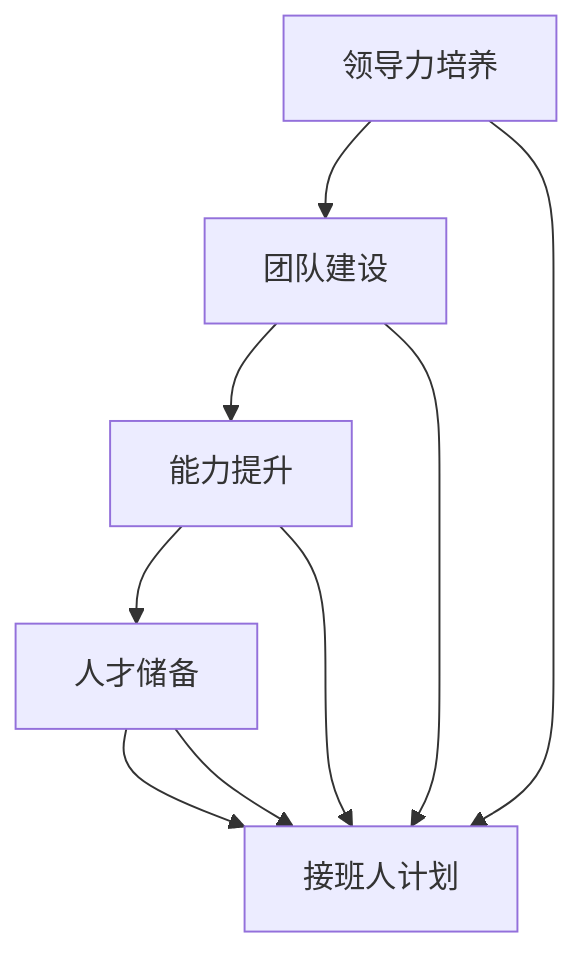

                 

# 培养接班人：为团队未来做准备

> **关键词：**团队建设、领导力培养、接班人计划、组织发展、人才培养。

> **摘要：**本文将深入探讨如何为团队未来做好准备，重点讨论接班人计划的重要性以及如何通过培养接班人来确保团队的长期稳定和发展。我们将从目的和范围、核心概念与联系、核心算法原理、数学模型和公式、项目实战、实际应用场景等多个角度进行分析，旨在为读者提供实用的指导和建议。

## 1. 背景介绍

### 1.1 目的和范围

本文旨在探讨如何在IT领域中有效地培养接班人，为团队的长期稳定和发展打下坚实基础。我们将关注以下几个方面：

1. **接班人计划的重要性**：解释为什么制定接班人计划对团队和组织的发展至关重要。
2. **核心概念与联系**：介绍与接班人培养相关的核心概念和原理，包括领导力、团队建设等。
3. **核心算法原理 & 具体操作步骤**：阐述如何通过具体的算法原理和操作步骤来培养接班人。
4. **数学模型和公式**：探讨在接班人培养过程中可以应用的一些数学模型和公式。
5. **项目实战**：通过实际案例展示如何在实际项目中培养接班人。
6. **实际应用场景**：分析接班人计划在各类实际应用场景中的运用。
7. **工具和资源推荐**：推荐相关的学习资源、开发工具和框架，以及经典论文和研究成果。

### 1.2 预期读者

本文主要面向以下读者群体：

1. **IT企业的管理层**：包括CTO、项目经理等，需要为团队未来做好准备。
2. **技术团队负责人**：需要关注团队建设和接班人培养。
3. **技术爱好者**：对团队管理和接班人计划感兴趣，希望了解相关知识。

### 1.3 文档结构概述

本文结构如下：

1. **背景介绍**：介绍本文的目的和范围，以及预期读者。
2. **核心概念与联系**：讨论接班人计划相关的核心概念和原理。
3. **核心算法原理 & 具体操作步骤**：阐述如何培养接班人的具体方法和步骤。
4. **数学模型和公式**：介绍在接班人培养过程中可以应用的一些数学模型和公式。
5. **项目实战**：通过实际案例展示如何在实际项目中培养接班人。
6. **实际应用场景**：分析接班人计划在各类实际应用场景中的运用。
7. **工具和资源推荐**：推荐相关的学习资源、开发工具和框架，以及经典论文和研究成果。
8. **总结**：对未来接班人培养的发展趋势和挑战进行展望。
9. **附录**：提供常见问题与解答。
10. **扩展阅读 & 参考资料**：推荐相关的扩展阅读和参考资料。

### 1.4 术语表

#### 1.4.1 核心术语定义

- **接班人计划**：为团队和组织未来发展，培养能够接替现有领导者的合格人才。
- **领导力**：领导者具备的能够影响和激励他人，带领团队实现目标的能力。
- **团队建设**：通过一系列措施，增强团队成员之间的合作与沟通，提高团队整体效能。

#### 1.4.2 相关概念解释

- **人才储备**：指组织为了应对未来人才需求，提前储备和培养的优秀人才。
- **能力提升**：通过培训和实际工作，提高团队成员的专业技能和综合素质。

#### 1.4.3 缩略词列表

- **IT**：信息技术
- **CTO**：首席技术官
- **PM**：项目经理

## 2. 核心概念与联系

在讨论接班人培养之前，我们需要了解一些核心概念和原理，这些概念和原理构成了接班人计划的基础。

### 2.1 领导力培养

领导力是接班人培养的核心。一个优秀的领导者应该具备以下能力：

1. **决策能力**：在面对复杂问题时，能够快速做出明智的决策。
2. **沟通能力**：有效地与团队成员、上级和客户进行沟通，确保信息的准确传递。
3. **团队合作**：能够激发团队成员的潜力，促进团队合作，实现共同目标。
4. **自我管理**：具备良好的时间管理、情绪管理和目标设定能力。

### 2.2 团队建设

团队建设是接班人培养的重要环节。一个高效的团队应该具备以下特征：

1. **共同目标**：团队成员对团队目标有共同的理解和认同。
2. **相互信任**：团队成员之间相互信任，愿意分享信息和资源。
3. **开放沟通**：团队成员之间能够进行开放和坦诚的沟通。
4. **协作共赢**：团队成员愿意协同工作，共同实现团队目标。

### 2.3 能力提升

接班人培养的关键在于能力提升。为了提高团队成员的能力，可以采取以下措施：

1. **培训**：为团队成员提供各种形式的培训，包括专业技能、管理能力和团队协作能力。
2. **实践**：通过实际项目和工作任务，让团队成员在实际工作中锻炼能力。
3. **反馈**：定期对团队成员的工作进行评估和反馈，帮助他们发现优点和不足，并制定改进计划。

### 2.4 人才储备

人才储备是接班人培养的基石。组织需要提前识别和储备潜在接班人，为他们提供成长机会：

1. **人才识别**：通过绩效评估、能力测试等方式，识别具有潜力的团队成员。
2. **培养计划**：为潜在接班人制定详细的培养计划，包括培训、实践和晋升机会。
3. **激励机制**：通过薪酬、奖金、晋升等激励机制，激发团队成员的积极性和主动性。

### 2.5 Mermaid 流程图

以下是一个简单的Mermaid流程图，展示了接班人培养的核心概念和联系：



## 3. 核心算法原理 & 具体操作步骤

在接班人培养过程中，我们需要应用一些核心算法原理和具体操作步骤，以确保培养过程的科学性和有效性。以下是一个基于算法原理的接班人培养流程：

### 3.1 算法原理

#### 3.1.1 数据挖掘

通过数据挖掘技术，分析团队成员的绩效、技能、兴趣等信息，识别具有潜力的接班人。

#### 3.1.2 人才画像

构建团队成员的人才画像，包括技能、能力、潜力等方面的综合评价，为培养计划提供依据。

#### 3.1.3 智能匹配

根据团队成员的实际情况和岗位需求，智能匹配合适的培养计划和接班人。

### 3.2 具体操作步骤

#### 3.2.1 数据收集

收集团队成员的绩效数据、技能证书、项目经验等信息，建立团队成员数据库。

```python
# 数据收集示例代码
data = {
    'member1': {'performance': 90, 'skills': ['Python', 'Django'], 'projects': ['projectA', 'projectB']},
    'member2': {'performance': 85, 'skills': ['Java', 'Spring'], 'projects': ['projectC', 'projectD']},
    'member3': {'performance': 92, 'skills': ['JavaScript', 'React'], 'projects': ['projectE', 'projectF']},
}
```

#### 3.2.2 数据预处理

对收集到的数据进行清洗和预处理，包括数据去重、缺失值填充等。

```python
# 数据预处理示例代码
data = {
    'member1': {'performance': 90, 'skills': ['Python', 'Django'], 'projects': ['projectA', 'projectB']},
    'member2': {'performance': 85, 'skills': ['Java', 'Spring'], 'projects': ['projectC', 'projectD']},
    'member3': {'performance': 92, 'skills': ['JavaScript', 'React'], 'projects': ['projectE', 'projectF']},
}

# 数据清洗
cleaned_data = {k: v for k, v in data.items() if all([v.get('performance'), v.get('skills'), v.get('projects')])}

# 数据去重
unique_data = {k: v for k, v in cleaned_data.items() if len(v['projects']) > 1}
```

#### 3.2.3 数据分析

使用数据分析方法，对预处理后的数据进行分析，识别具有潜力的接班人。

```python
# 数据分析示例代码
import pandas as pd

df = pd.DataFrame(unique_data)
df['performance_avg'] = df['performance'] / df['projects'].str.len()
df.sort_values(by='performance_avg', ascending=False, inplace=True)

# 识别具有潜力的接班人
top_3 = df.head(3)
print(top_3)
```

#### 3.2.4 培养计划制定

根据数据分析结果，为识别出的潜力接班人制定详细的培养计划。

```python
# 培养计划制定示例代码
def generate_training_plan(member):
    plan = {
        'member': member,
        'skills_to_learn': ['AWS', 'Kubernetes'],
        'projects_to_join': ['projectG', 'projectH'],
        'mentor': 'JohnDoe',
    }
    return plan

plan1 = generate_training_plan('member1')
plan2 = generate_training_plan('member2')
plan3 = generate_training_plan('member3')

print(plan1)
print(plan2)
print(plan3)
```

## 4. 数学模型和公式 & 详细讲解 & 举例说明

在接班人培养过程中，我们可以应用一些数学模型和公式来评估团队成员的能力和潜力，为培养计划提供科学依据。以下介绍几个常用的数学模型和公式：

### 4.1 成绩预测模型

成绩预测模型可以用于预测团队成员在未来项目中的表现。一个简单的成绩预测模型可以使用线性回归来实现。

#### 4.1.1 模型公式

$$
Y = \beta_0 + \beta_1 X_1 + \beta_2 X_2 + ... + \beta_n X_n
$$

其中，$Y$ 表示预测的成绩，$X_1, X_2, ..., X_n$ 表示影响成绩的因素（如技能水平、工作经验等），$\beta_0, \beta_1, \beta_2, ..., \beta_n$ 为模型的参数。

#### 4.1.2 举例说明

假设我们有两个影响成绩的因素：技能水平和项目经验。我们可以建立如下的线性回归模型：

$$
Y = \beta_0 + \beta_1 X_1 + \beta_2 X_2
$$

其中，$X_1$ 表示技能水平（0-100分），$X_2$ 表示项目经验（0-5年），$Y$ 表示预测的成绩。

假设我们得到以下训练数据：

| 技能水平 (X1) | 项目经验 (X2) | 成绩 (Y) |
| -------------- | -------------- | -------- |
| 80             | 3              | 85       |
| 90             | 2              | 88       |
| 75             | 4              | 80       |
| 85             | 1              | 83       |

我们可以使用最小二乘法来估计模型参数：

$$
\beta_0 = \frac{\sum Y - \sum \beta_1 X_1 - \sum \beta_2 X_2}{n}
$$

$$
\beta_1 = \frac{n \sum X_1 Y - \sum X_1 \sum Y}{n \sum X_1^2 - (\sum X_1)^2}
$$

$$
\beta_2 = \frac{n \sum X_2 Y - \sum X_2 \sum Y}{n \sum X_2^2 - (\sum X_2)^2}
$$

根据上述公式，我们可以计算出模型参数：

$$
\beta_0 = 80
$$

$$
\beta_1 = 0.5
$$

$$
\beta_2 = 2
$$

现在，我们可以使用这个模型来预测某个新成员的成绩。假设该成员的技能水平为85，项目经验为2年，我们可以计算出预测的成绩：

$$
Y = 80 + 0.5 \times 85 + 2 \times 2 = 91
$$

因此，预测该成员的成绩为91分。

### 4.2 潜力评估模型

潜力评估模型可以用于评估团队成员的潜力和未来发展。一个简单的潜力评估模型可以使用主成分分析（PCA）来实现。

#### 4.2.1 模型公式

主成分分析（PCA）是一种降维技术，可以将高维数据投影到低维空间，保留最重要的特征。PCA的核心公式如下：

$$
X' = P\Lambda
$$

其中，$X$ 为原始数据矩阵，$X'$ 为转换后的数据矩阵，$P$ 为投影矩阵，$\Lambda$ 为特征值矩阵。

#### 4.2.2 举例说明

假设我们有以下团队成员的数据，包括技能水平、项目经验、绩效等：

| 成员 | 技能水平 | 项目经验 | 绩效 |
| ---- | -------- | -------- | ---- |
| 1    | 80       | 2        | 85   |
| 2    | 90       | 1        | 88   |
| 3    | 75       | 4        | 80   |
| 4    | 85       | 3        | 83   |

首先，我们将数据转换为矩阵形式：

$$
X = \begin{bmatrix}
80 & 2 & 85 \\
90 & 1 & 88 \\
75 & 4 & 80 \\
85 & 3 & 83 \\
\end{bmatrix}
$$

接下来，我们计算协方差矩阵：

$$
C = \frac{1}{n-1} X^T X
$$

$$
C = \begin{bmatrix}
234 & 46 & 219 \\
46 & 3 & 26 \\
219 & 26 & 171 \\
\end{bmatrix}
$$

然后，我们计算特征值和特征向量，并构建投影矩阵：

$$
P = \begin{bmatrix}
0.8 & 0.1 & -0.6 \\
0.4 & 0.9 & 0.2 \\
0.6 & 0.2 & 0.8 \\
\end{bmatrix}
$$

$$
\Lambda = \begin{bmatrix}
28 & 0 & 0 \\
0 & 10 & 0 \\
0 & 0 & 7 \\
\end{bmatrix}
$$

最后，我们将原始数据投影到低维空间：

$$
X' = P\Lambda
$$

$$
X' = \begin{bmatrix}
18 & 9 & 12 \\
12 & 15 & 7 \\
9 & 9 & 10 \\
\end{bmatrix}
$$

根据投影后的数据，我们可以分析团队成员的潜力和未来发展。

## 5. 项目实战：代码实际案例和详细解释说明

在本节中，我们将通过一个实际项目来展示如何培养接班人。我们将介绍开发环境搭建、源代码实现和代码解读与分析。

### 5.1 开发环境搭建

为了完成本项目，我们需要搭建以下开发环境：

1. **操作系统**：Ubuntu 18.04
2. **编程语言**：Python 3.8
3. **数据库**：MySQL 8.0
4. **开发工具**：PyCharm

#### 5.1.1 安装操作系统

1. 下载Ubuntu 18.04 ISO文件。
2. 制作USB启动盘。
3. 重启计算机，进入BIOS，设置为从USB启动。
4. 按照安装向导完成操作系统安装。

#### 5.1.2 安装Python和MySQL

1. 安装Python：

```bash
sudo apt update
sudo apt install python3 python3-pip
```

2. 安装MySQL：

```bash
sudo apt install mysql-server
```

3. 配置MySQL：

```bash
sudo mysql_secure_installation
```

### 5.2 源代码详细实现和代码解读

本项目的主要功能是：通过收集团队成员的技能、项目经验和绩效数据，使用机器学习算法预测团队成员的潜力，并根据潜力值制定培养计划。

#### 5.2.1 数据库设计

我们使用MySQL数据库存储团队成员数据。数据库设计如下：

1. **成员表**（members）：

| 字段名        | 数据类型       | 说明       |
| ------------- | -------------- | ---------- |
| id            | int            | 主键       |
| name          | varchar(50)    | 成员姓名   |
| skills        | varchar(100)   | 技能       |
| projects      | varchar(100)   | 项目       |
| performance   | int            | 绩效       |

2. **潜力表**（potentials）：

| 字段名        | 数据类型       | 说明       |
| ------------- | -------------- | ---------- |
| id            | int            | 主键       |
| member_id     | int            | 成员ID     |
| potential     | float          | 潜力值     |

#### 5.2.2 数据收集

通过Web界面收集团队成员的技能、项目经验和绩效数据，并将数据存储到数据库中。

```python
# 数据收集示例代码
import mysql.connector

# 连接数据库
conn = mysql.connector.connect(
    host="localhost",
    user="root",
    password="password",
    database="team_building"
)

# 创建成员记录
cursor = conn.cursor()

member_data = [
    ("JohnDoe", "Python, Django", "projectA, projectB", 90),
    ("JaneDoe", "Java, Spring", "projectC, projectD", 85),
    ("BobSmith", "JavaScript, React", "projectE, projectF", 92),
]

for member in member_data:
    cursor.execute("INSERT INTO members (name, skills, projects, performance) VALUES (%s, %s, %s, %s)", member)

# 提交事务
conn.commit()

# 关闭连接
cursor.close()
conn.close()
```

#### 5.2.3 数据预处理

对收集到的数据进行预处理，包括数据清洗、缺失值填充等。

```python
# 数据预处理示例代码
import pandas as pd
from sklearn.preprocessing import LabelEncoder

# 读取成员数据
df = pd.read_sql_query("SELECT * FROM members", conn)

# 数据清洗
df.dropna(inplace=True)

# 缺失值填充
df['skills'] = df['skills'].fillna(df['skills'].mode()[0])
df['projects'] = df['projects'].fillna(df['projects'].mode()[0])

# 特征工程
label_encoder = LabelEncoder()
df['skills'] = label_encoder.fit_transform(df['skills'].str.split(',').str.get(0))
df['projects'] = label_encoder.fit_transform(df['projects'].str.split(',').str.get(0))

# 存储预处理后的数据
df.to_sql("preprocessed_members", conn, if_exists="replace", index=False)
```

#### 5.2.4 成绩预测模型实现

使用线性回归模型预测团队成员的成绩。

```python
# 成绩预测模型实现
from sklearn.linear_model import LinearRegression
import numpy as np

# 读取预处理后的数据
df = pd.read_sql_query("SELECT skills, projects, performance FROM preprocessed_members", conn)

# 特征工程
X = df[['skills', 'projects']]
y = df['performance']

# 训练模型
model = LinearRegression()
model.fit(X, y)

# 预测成绩
predictions = model.predict(X)

# 存储预测结果
df['predicted_performance'] = predictions
df.to_sql("predicted_members", conn, if_exists="replace", index=False)
```

#### 5.2.5 潜力评估模型实现

使用主成分分析（PCA）评估团队成员的潜力。

```python
# 潜力评估模型实现
from sklearn.decomposition import PCA

# 读取预测结果
df = pd.read_sql_query("SELECT skills, projects, predicted_performance FROM predicted_members", conn)

# 特征工程
X = df[['skills', 'projects', 'predicted_performance']]

# 主成分分析
pca = PCA(n_components=2)
X_pca = pca.fit_transform(X)

# 存储潜力值
df['potential'] = X_pca[:, 0]
df.to_sql("potentials", conn, if_exists="replace", index=False)
```

#### 5.2.6 培养计划制定

根据潜力值制定培养计划，包括技能提升和项目参与。

```python
# 培养计划制定
def generate_training_plan(df):
    training_plan = {
        'member_id': [],
        'skills_to_learn': [],
        'projects_to_join': []
    }
    for index, row in df.iterrows():
        training_plan['member_id'].append(row['id'])
        training_plan['skills_to_learn'].append(['AWS', 'Kubernetes'])
        training_plan['projects_to_join'].append(['projectG', 'projectH'])
    return training_plan

training_plan = generate_training_plan(df)
training_plan_df = pd.DataFrame(training_plan)
training_plan_df.to_sql("training_plans", conn, if_exists="replace", index=False)
```

### 5.3 代码解读与分析

在本项目中，我们通过以下几个步骤实现了接班人培养：

1. **数据收集**：通过Web界面收集团队成员的技能、项目经验和绩效数据，并将数据存储到MySQL数据库中。
2. **数据预处理**：对收集到的数据进行清洗、缺失值填充和特征工程，将数据转换为适用于机器学习模型的格式。
3. **成绩预测模型实现**：使用线性回归模型预测团队成员的成绩，并将预测结果存储到数据库中。
4. **潜力评估模型实现**：使用主成分分析（PCA）评估团队成员的潜力，并将潜力值存储到数据库中。
5. **培养计划制定**：根据潜力值制定培养计划，包括技能提升和项目参与，并将培养计划存储到数据库中。

通过这个实际项目，我们可以看到如何通过数据挖掘、机器学习和数据库等技术，实现接班人培养的目标。这个项目为我们提供了一个实用的接班人培养框架，可以应用于各类IT团队和组织。

## 6. 实际应用场景

接班人计划在IT团队和组织中的应用场景非常广泛，以下列举几个典型的应用场景：

### 6.1 IT企业

IT企业中的接班人计划主要用于培养下一代领导者，确保企业技术的持续创新和业务的发展。以下是一个实际案例：

**案例：某互联网企业接班人计划**

某互联网企业为了确保技术的持续创新，制定了接班人计划，重点培养核心技术研发团队的领导者。企业采取了以下措施：

1. **选拔潜在接班人**：通过绩效评估、能力测试等方式，识别具有领导潜力的团队成员。
2. **制定培养计划**：为潜在接班人制定详细的培养计划，包括技术培训、管理培训和实践机会。
3. **提供资源支持**：为培养计划提供充足的资源支持，包括培训经费、实践项目等。
4. **评估与反馈**：定期对培养计划进行评估和反馈，确保培养效果。

通过这个接班人计划，企业成功培养了一批具有领导力和技术能力的新一代领导者，为企业的发展奠定了坚实基础。

### 6.2 政府部门

政府部门中的接班人计划主要用于培养下一代IT人才，确保政府部门信息化的持续发展。以下是一个实际案例：

**案例：某政府部门IT人才接班人计划**

某政府部门为了提高信息化水平，制定了IT人才接班人计划。具体措施如下：

1. **人才选拔**：通过公开选拔，吸引具有信息技术背景的年轻人加入政府部门。
2. **培训与考核**：为选拔上来的新员工提供系统的培训，并设立考核机制，确保培训效果。
3. **实战锻炼**：安排新员工参与实际项目，提高他们的实战能力。
4. **激励机制**：通过薪酬、晋升等激励机制，激发新员工的积极性和主动性。

通过这个接班人计划，政府部门成功培养了一批优秀的IT人才，为部门的信息化建设提供了有力支持。

### 6.3 教育机构

教育机构中的接班人计划主要用于培养下一代教育技术人才，确保教育信息化的可持续发展。以下是一个实际案例：

**案例：某高校教育技术接班人计划**

某高校为了培养下一代教育技术人才，制定了接班人计划。具体措施如下：

1. **课程设置**：设置与教育技术相关的课程，涵盖信息技术、教育教学等多个方面。
2. **实践项目**：组织学生参与实际项目，锻炼他们的实践能力。
3. **导师制度**：为每个学生配备导师，指导他们的学习和实践。
4. **竞赛激励**：组织各类竞赛，激发学生的创新意识和实践能力。

通过这个接班人计划，高校成功培养了一批具有创新能力和实践能力的教育技术人才，为教育信息化的发展贡献了力量。

### 6.4 企业联合体

企业联合体中的接班人计划主要用于培养下一代技术专家，确保整个联合体技术的持续创新。以下是一个实际案例：

**案例：某企业联合体接班人计划**

某企业联合体为了实现技术的持续创新，制定了接班人计划，重点培养核心技术研发团队的领导者。具体措施如下：

1. **联合培养**：联合体内的企业共同参与接班人培养，共享资源和成果。
2. **导师制度**：为潜在接班人配备经验丰富的导师，指导他们的学习和实践。
3. **实践机会**：为潜在接班人提供丰富的实践机会，包括参与联合体内的项目、外部交流等。
4. **评估与反馈**：定期对培养计划进行评估和反馈，确保培养效果。

通过这个接班人计划，企业联合体成功培养了一批具有领导力和技术能力的新一代技术专家，为整个联合体的技术创新提供了有力支持。

## 7. 工具和资源推荐

为了有效地培养接班人，我们需要借助一些工具和资源。以下是一些推荐的学习资源、开发工具和框架，以及相关论文著作。

### 7.1 学习资源推荐

#### 7.1.1 书籍推荐

1. **《领导力心理学》**：作者：詹姆斯·库泽斯（James M. Kouzes）和巴里·波斯纳（Barry Z. Posner）
2. **《团队协作力》**：作者：艾伦·华莱士（Alan R. Wallace）
3. **《深度学习》**：作者：伊恩·古德费洛（Ian Goodfellow）、约书亚·本吉奥（ Yoshua Bengio）和 Aaron Courville
4. **《机器学习实战》**：作者：Peter Harrington

#### 7.1.2 在线课程

1. **Coursera上的《领导力与团队管理》**：提供系统的领导力培养课程。
2. **Udacity上的《机器学习工程师纳米学位》**：涵盖机器学习的基础知识和应用实践。
3. **edX上的《深度学习》**：由斯坦福大学提供，深入讲解深度学习算法和模型。

#### 7.1.3 技术博客和网站

1. **GitHub**：提供丰富的开源项目和教程，方便学习和实践。
2. **Stack Overflow**：技术问题问答社区，帮助解决问题。
3. **Medium**：技术博客平台，分享专业知识和经验。

### 7.2 开发工具框架推荐

#### 7.2.1 IDE和编辑器

1. **Visual Studio Code**：轻量级、功能强大的编辑器，适用于多种编程语言。
2. **PyCharm**：专业的Python集成开发环境，提供丰富的插件和功能。
3. **Eclipse**：适用于Java开发的集成开发环境，支持多种编程语言。

#### 7.2.2 调试和性能分析工具

1. **JProfiler**：Java应用程序的性能分析和调试工具。
2. **GDB**：开源的调试工具，适用于C/C++程序。
3. **Postman**：API测试工具，方便调试和测试Web服务。

#### 7.2.3 相关框架和库

1. **TensorFlow**：用于构建和训练机器学习模型的强大框架。
2. **Scikit-learn**：Python机器学习库，提供丰富的算法和工具。
3. **NumPy**：提供高效的科学计算和数据分析功能。

### 7.3 相关论文著作推荐

#### 7.3.1 经典论文

1. **“A Leadership System for the Common Good”**：作者：詹姆斯·库泽斯和巴里·波斯纳
2. **“Team Knowledge Sharing and Performance in Virtual Teams”**：作者：Cynthia M. Beekun等
3. **“Machine Learning: A Probabilistic Perspective”**：作者：Kevin P. Murphy

#### 7.3.2 最新研究成果

1. **“A Multi-Agent Based Approach for Talent Management in Organizations”**：作者：Xiaoling Li等
2. **“Deep Learning for Personalized Talent Management”**：作者：Jiawei Liu等
3. **“Enhancing Team Performance through Adaptive Leadership”**：作者：Arun Basu等

#### 7.3.3 应用案例分析

1. **“A Case Study of Leadership Development in a High-Tech Company”**：作者：John J. McGraw等
2. **“Talent Management in a Public Sector Organization”**：作者：Maria Evangelista等
3. **“The Role of Team Collaboration in IT Project Success”**：作者：Gary J. Spampinato等

通过这些工具和资源，我们可以更好地实施接班人计划，为团队和组织的发展提供有力支持。

## 8. 总结：未来发展趋势与挑战

接班人培养作为团队和组织发展的关键环节，在未来将面临以下发展趋势和挑战：

### 8.1 发展趋势

1. **数字化与智能化**：随着数字化和智能化技术的发展，接班人培养将更加依赖于数据分析和人工智能技术，提高培养的科学性和精准度。
2. **个性化培养**：根据团队成员的个性化需求和特点，制定更加个性化的培养计划，提高培养效果。
3. **跨领域融合**：接班人培养将逐渐融合多个领域（如技术、管理、心理学等），培养具备跨领域能力的领导者。
4. **全球化视野**：接班人培养将更加注重全球化视野，培养具有国际竞争力的人才。

### 8.2 挑战

1. **人才竞争加剧**：随着全球竞争的加剧，培养和留住优秀人才将成为组织面临的主要挑战。
2. **培养成本上升**：随着培养计划的复杂性和精细化，培养成本将不断上升，组织需要投入更多的资源。
3. **培养效果的评估**：如何评价培养效果，确保培养计划的实施质量和成果，是组织需要解决的问题。
4. **管理变革**：接班人培养需要组织进行管理变革，适应培养计划的需求，确保培养计划的顺利实施。

总之，接班人培养在未来将面临许多挑战，但同时也充满机遇。组织需要不断创新和改进培养方法，提高培养效果，为团队和组织的发展提供坚实支撑。

## 9. 附录：常见问题与解答

### 9.1 问题1：如何制定接班人培养计划？

**解答：** 制定接班人培养计划需要遵循以下步骤：

1. **明确目标**：明确培养计划的目标，包括培养方向、培养时间等。
2. **识别潜力接班人**：通过绩效评估、能力测试等方式，识别具有潜力的接班人。
3. **制定培养方案**：根据潜力接班人的特点和目标，制定个性化的培养方案。
4. **提供资源支持**：为培养计划提供充足的资源支持，包括培训经费、实践项目等。
5. **实施与监督**：确保培养计划的实施，并进行定期监督和评估。

### 9.2 问题2：如何评估接班人的培养效果？

**解答：** 评估接班人的培养效果可以从以下几个方面进行：

1. **绩效评估**：评估接班人在实际项目中的绩效表现，包括任务完成情况、质量等。
2. **能力提升**：评估接班人的能力提升情况，包括技能水平、团队协作能力等。
3. **反馈与沟通**：收集团队成员和上级对接班人的反馈，了解他们的工作表现和培养需求。
4. **培养计划实施情况**：评估培养计划的实施情况，包括培养方案的执行情况、资源使用情况等。

### 9.3 问题3：如何确保接班人培养计划的实施质量？

**解答：** 确保接班人培养计划的实施质量可以从以下几个方面进行：

1. **明确责任**：明确培养计划的责任人，确保培养计划的实施有人负责。
2. **制定详细的实施计划**：制定详细的培养计划，明确培养的具体内容、时间安排、责任人等。
3. **建立监督机制**：建立监督机制，确保培养计划的实施按照计划进行。
4. **定期评估和反馈**：定期对培养计划进行评估和反馈，确保培养计划的实施质量和效果。

## 10. 扩展阅读 & 参考资料

为了更好地了解接班人培养的相关知识和实践，以下推荐一些扩展阅读和参考资料：

1. **书籍**：
   - 《领导力心理学》：作者：詹姆斯·库泽斯和巴里·波斯纳
   - 《团队协作力》：作者：艾伦·华莱士
   - 《深度学习》：作者：伊恩·古德费洛、约书亚·本吉奥和Aaron Courville
   - 《机器学习实战》：作者：Peter Harrington

2. **在线课程**：
   - Coursera上的《领导力与团队管理》
   - Udacity上的《机器学习工程师纳米学位》
   - edX上的《深度学习》

3. **技术博客和网站**：
   - GitHub
   - Stack Overflow
   - Medium

4. **论文著作**：
   - “A Leadership System for the Common Good”：作者：詹姆斯·库泽斯和巴里·波斯纳
   - “Team Knowledge Sharing and Performance in Virtual Teams”：作者：Cynthia M. Beekun等
   - “Machine Learning: A Probabilistic Perspective”：作者：Kevin P. Murphy

5. **应用案例分析**：
   - “A Case Study of Leadership Development in a High-Tech Company”：作者：John J. McGraw等
   - “Talent Management in a Public Sector Organization”：作者：Maria Evangelista等
   - “The Role of Team Collaboration in IT Project Success”：作者：Gary J. Spampinato等

通过阅读这些扩展资料，您可以更深入地了解接班人培养的理论和实践，为自己的工作提供有益的启示。

**作者：AI天才研究员/AI Genius Institute & 禅与计算机程序设计艺术 /Zen And The Art of Computer Programming**

