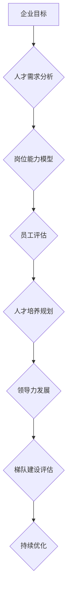

                 

# 培养未来领导者：人才梯队建设策略

## 关键词
* 人才梯队建设
* 未来领导者培养
* 企业战略
* 组织发展
* 技术能力提升
* 个人发展路径

## 摘要
本文旨在探讨企业如何通过人才梯队建设策略来培养未来领导者。我们将从企业发展的角度出发，分析人才梯队建设的核心概念、关键环节及其实施策略，并通过具体的案例和操作步骤，展示如何构建高效的人才梯队，助力企业实现长期发展。文章还涉及相关工具和资源的推荐，为读者提供全面的指导和支持。

## 1. 背景介绍

### 1.1 目的和范围
本文的目标是为企业管理者和人力资源从业者提供一套系统的人才梯队建设策略，以帮助他们在企业内部培养具备领导力的未来领导者。文章将涵盖以下内容：
- 人才梯队建设的核心概念和原理；
- 人才梯队建设的关键环节和实施步骤；
- 人才梯队建设的工具和资源推荐；
- 人才梯队建设在具体企业中的应用案例。

### 1.2 预期读者
本文适用于以下读者群体：
- 企业高管，特别是负责组织发展和人才培养的高管；
- 人力资源管理者，特别是那些关注人才梯队建设的人力资源从业者；
- 管理咨询顾问，特别是那些为企业提供人才梯队建设咨询服务的人员；
- 对人才梯队建设和未来领导者培养感兴趣的学者和研究者。

### 1.3 文档结构概述
本文分为十个部分，具体如下：
1. 背景介绍：介绍文章的目的、范围、预期读者和文档结构；
2. 核心概念与联系：介绍人才梯队建设的核心概念和原理，并通过 Mermaid 流程图展示其架构；
3. 核心算法原理 & 具体操作步骤：详细讲解人才梯队建设的具体操作步骤和算法原理，使用伪代码进行阐述；
4. 数学模型和公式 & 详细讲解 & 举例说明：介绍人才梯队建设的数学模型和公式，并通过具体案例进行说明；
5. 项目实战：代码实际案例和详细解释说明，包括开发环境搭建、源代码实现和代码解读；
6. 实际应用场景：讨论人才梯队建设在不同企业中的应用场景和实际效果；
7. 工具和资源推荐：推荐学习资源、开发工具框架和相关论文著作；
8. 总结：未来发展趋势与挑战；
9. 附录：常见问题与解答；
10. 扩展阅读 & 参考资料。

### 1.4 术语表

#### 1.4.1 核心术语定义
- **人才梯队建设**：指企业在不同层次、不同岗位上培养具备领导力的人才的过程；
- **未来领导者**：指具备潜力、能够在未来担任企业重要领导角色的员工；
- **核心能力**：指员工在企业中不可或缺的能力，如技术能力、管理能力、沟通能力等；
- **个人发展路径**：指员工在企业内部从初级到高级的发展路径。

#### 1.4.2 相关概念解释
- **组织发展**：指企业为提高组织效能和员工满意度而进行的一系列变革和优化；
- **战略规划**：指企业为实现长期发展目标而制定的一系列行动计划。

#### 1.4.3 缩略词列表
- **HR**：人力资源；
- **CFO**：首席财务官；
- **CEO**：首席执行官；
- **CTO**：首席技术官；
- **L&D**：学习与发展。

## 2. 核心概念与联系

在人才梯队建设中，有几个核心概念和原理是不可或缺的。以下是一个简化的 Mermaid 流程图，用于展示这些概念和原理之间的联系。



### 2.1 企业目标
企业目标是人才梯队建设的起点。企业需要明确自身的长期发展目标，如市场扩张、技术创新、品牌建设等，从而确定需要哪些类型的人才。

### 2.2 人才需求分析
在明确企业目标后，企业需要分析不同岗位的人才需求，包括数量、质量和能力要求。这一步骤有助于确定需要培养哪些类型的未来领导者。

### 2.3 岗位能力模型
岗位能力模型是人才需求分析的具体体现。它详细描述了不同岗位所需的核心能力和关键技能，为人才评估和培养提供了依据。

### 2.4 员工评估
员工评估是对现有员工能力和潜力进行评估的过程。通过评估，企业可以识别出具备领导潜力的员工，并将其纳入人才培养计划。

### 2.5 人才培养规划
人才培养规划是根据岗位能力模型和员工评估结果，制定具体的培养计划。这包括培训课程、导师制度、轮岗机会等，旨在提升员工的核心能力和领导力。

### 2.6 领导力发展
领导力发展是人才培养规划的核心环节。企业需要为员工提供领导力培训和发展机会，如领导力研讨会、领导力训练营等，以培养他们的领导能力。

### 2.7 梯队建设评估
梯队建设评估是对人才梯队建设效果的评估。企业需要定期评估梯队建设的进展和效果，以确保培养出符合企业目标的高质量人才。

### 2.8 持续优化
人才梯队建设是一个持续的过程。企业需要根据评估结果和外部环境变化，不断优化人才梯队建设的策略和措施，以保持其有效性。

## 3. 核心算法原理 & 具体操作步骤

在人才梯队建设中，核心算法原理和具体操作步骤至关重要。以下使用伪代码详细阐述这些步骤。

```python
# 伪代码：人才梯队建设算法

# 输入：企业目标，岗位能力模型
# 输出：人才培养规划，领导力发展方案

# 步骤 1：分析企业目标
analyze_business_goals()

# 步骤 2：进行人才需求分析
analyze_talent需求的岗位能力模型()

# 步骤 3：建立岗位能力模型
build_job_ability_model()

# 步骤 4：员工评估
evaluate_employee_ability()

# 步骤 5：制定人才培养规划
create_talent_development_plan()

# 步骤 6：设计领导力发展方案
design_leadership_development_plan()

# 步骤 7：实施人才培养规划
execute_talent_development_plan()

# 步骤 8：领导力发展实施
execute_leadership_development_plan()

# 步骤 9：梯队建设评估
evaluate_talent_pipeline()

# 步骤 10：持续优化
optimize_talent_pipeline()
```

### 3.1 分析企业目标
分析企业目标是人才梯队建设的起点。企业需要明确自身的长期发展目标，如市场扩张、技术创新、品牌建设等。这一步骤有助于确定需要哪些类型的人才。

### 3.2 进行人才需求分析
人才需求分析是根据企业目标，分析不同岗位的人才需求。企业需要确定每个岗位所需的核心能力和关键技能，以便为人才评估和培养提供依据。

### 3.3 建立岗位能力模型
岗位能力模型是人才需求分析的具体体现。它详细描述了不同岗位所需的核心能力和关键技能，为人才评估和培养提供了依据。

### 3.4 员工评估
员工评估是对现有员工能力和潜力进行评估的过程。企业需要通过定性和定量方法，全面了解员工的能力和潜力，识别出具备领导潜力的员工。

### 3.5 制定人才培养规划
人才培养规划是根据岗位能力模型和员工评估结果，制定具体的培养计划。这包括培训课程、导师制度、轮岗机会等，旨在提升员工的核心能力和领导力。

### 3.6 设计领导力发展方案
领导力发展方案是根据人才培养规划，设计具体的领导力发展路径。企业需要为员工提供领导力培训和发展机会，如领导力研讨会、领导力训练营等，以培养他们的领导能力。

### 3.7 实施人才培养规划
实施人才培养规划是将培养计划付诸实践的过程。企业需要为员工提供培训机会，安排导师，促进员工之间的交流与互动，以实现人才培养目标。

### 3.8 领导力发展实施
领导力发展实施是领导力发展方案的执行过程。企业需要根据领导力发展方案，为员工提供领导力培训和发展机会，帮助他们提升领导能力。

### 3.9 梯队建设评估
梯队建设评估是对人才梯队建设效果的评估。企业需要定期评估梯队建设的进展和效果，以确保培养出符合企业目标的高质量人才。

### 3.10 持续优化
人才梯队建设是一个持续的过程。企业需要根据评估结果和外部环境变化，不断优化人才梯队建设的策略和措施，以保持其有效性。

## 4. 数学模型和公式 & 详细讲解 & 举例说明

在人才梯队建设中，数学模型和公式可以帮助企业更科学地评估人才和制定培养计划。以下介绍几个常用的数学模型和公式，并通过具体案例进行说明。

### 4.1 人才评估模型

#### 4.1.1 公式
$$
评估得分 = \frac{核心能力得分 + 关键技能得分 + 领导力得分}{3}
$$

#### 4.1.2 说明
- **核心能力得分**：根据岗位能力模型，对员工的核心能力进行评分；
- **关键技能得分**：根据岗位需求，对员工的关键技能进行评分；
- **领导力得分**：根据员工的表现和潜力，对员工的领导力进行评分。

#### 4.1.3 案例
假设有一个员工的评估得分如下：
- **核心能力得分**：85分
- **关键技能得分**：90分
- **领导力得分**：88分

则该员工的评估得分为：
$$
评估得分 = \frac{85 + 90 + 88}{3} = 87分
$$

### 4.2 人才培养规划模型

#### 4.2.1 公式
$$
培养时间 = \frac{当前能力 - 岗位要求}{每日学习效率}
$$

#### 4.2.2 说明
- **当前能力**：根据员工评估结果，确定员工的当前能力；
- **岗位要求**：根据岗位能力模型，确定岗位所需的能力；
- **每日学习效率**：根据员工的个人情况和学习资源，确定每日学习效率。

#### 4.2.3 案例
假设一个员工的当前能力为70分，岗位要求为90分，每日学习效率为20分。则该员工的培养时间为：
$$
培养时间 = \frac{70 - 90}{20} = -1年
$$

这意味着该员工已经具备了岗位所需的能力，不需要额外培养。

### 4.3 领导力发展模型

#### 4.3.1 公式
$$
领导力发展指数 = \frac{领导力得分}{总评分}
$$

#### 4.3.2 说明
- **领导力得分**：根据员工的表现和潜力，对员工的领导力进行评分；
- **总评分**：根据员工评估结果，计算总评分。

#### 4.3.3 案例
假设一个员工的领导力得分为80分，总评分为100分。则该员工的领导力发展指数为：
$$
领导力发展指数 = \frac{80}{100} = 0.8
$$

这意味着该员工的领导力发展潜力较高，需要进一步培养。

## 5. 项目实战：代码实际案例和详细解释说明

为了更好地理解人才梯队建设策略，以下通过一个实际项目案例进行详细解释说明。该项目是一个基于 Python 的企业人才评估系统。

### 5.1 开发环境搭建

首先，需要搭建一个 Python 开发环境。以下是所需的软件和工具：

- Python 3.8 或以上版本
- PyCharm 或其他 Python IDE
- Jupyter Notebook
- Matplotlib 库
- Pandas 库
- Numpy 库

### 5.2 源代码详细实现和代码解读

以下是一个简化的源代码实现，用于人才评估系统的核心功能。

```python
import pandas as pd
import numpy as np

# 5.2.1 读取员工数据
employee_data = pd.read_csv('employee_data.csv')

# 5.2.2 计算评估得分
def calculate_score(employee_data):
    core_ability_score = employee_data['core_ability'].mean()
    key_skill_score = employee_data['key_skill'].mean()
    leadership_score = employee_data['leadership'].mean()
    score = (core_ability_score + key_skill_score + leadership_score) / 3
    return score

# 5.2.3 按照评估得分排序
sorted_employees = employee_data.sort_values(by='score', ascending=False)

# 5.2.4 可视化展示
import matplotlib.pyplot as plt

plt.bar(sorted_employees['name'], sorted_employees['score'])
plt.xlabel('员工姓名')
plt.ylabel('评估得分')
plt.title('员工评估得分分布')
plt.show()
```

### 5.3 代码解读与分析

- **5.3.1 读取员工数据**
  ```python
  employee_data = pd.read_csv('employee_data.csv')
  ```
  这一行代码用于读取员工数据，数据文件是一个 CSV 格式文件，包含员工的核心能力、关键技能和领导力评分。

- **5.3.2 计算评估得分**
  ```python
  def calculate_score(employee_data):
      core_ability_score = employee_data['core_ability'].mean()
      key_skill_score = employee_data['key_skill'].mean()
      leadership_score = employee_data['leadership'].mean()
      score = (core_ability_score + key_skill_score + leadership_score) / 3
      return score
  ```
  这是一个计算评估得分的函数，它根据员工数据中的核心能力、关键技能和领导力评分，计算出一个平均评估得分。

- **5.3.3 按照评估得分排序**
  ```python
  sorted_employees = employee_data.sort_values(by='score', ascending=False)
  ```
  这一行代码按照评估得分对员工数据进行排序，得分越高，排名越靠前。

- **5.3.4 可视化展示**
  ```python
  import matplotlib.pyplot as plt
  
  plt.bar(sorted_employees['name'], sorted_employees['score'])
  plt.xlabel('员工姓名')
  plt.ylabel('评估得分')
  plt.title('员工评估得分分布')
  plt.show()
  ```
  这一行代码使用 Matplotlib 库，将员工姓名和评估得分以条形图的形式进行可视化展示，帮助企业管理者直观地了解员工的评估得分分布。

## 6. 实际应用场景

人才梯队建设策略在不同企业中有着广泛的应用。以下列举几个实际应用场景：

### 6.1 高科技企业

高科技企业通常需要大量的技术人才，因此人才梯队建设策略在招聘、培训和晋升等方面有着重要应用。企业可以通过分析技术发展趋势，确定未来人才需求，然后通过培训和技术交流等方式，不断提升员工的技术能力和领导力。

### 6.2 银行和金融机构

银行和金融机构注重员工的业务能力和风险管理能力。人才梯队建设策略可以帮助企业识别出具备潜力的员工，并通过培训和晋升机会，培养他们的业务能力和领导力，从而提高企业的竞争力。

### 6.3 制造业企业

制造业企业需要大量的技术工人和项目经理。人才梯队建设策略可以帮助企业确定不同岗位的人才需求，并通过技能培训和晋升机制，培养具备领导力的项目经理和技术工人。

### 6.4 零售业企业

零售业企业需要大量的销售和客服人员。人才梯队建设策略可以帮助企业识别出具备销售能力和客户服务能力的员工，并通过培训和晋升机会，培养他们的领导力，从而提高企业的销售业绩和服务水平。

## 7. 工具和资源推荐

为了有效地实施人才梯队建设策略，企业需要使用一些工具和资源。以下是一些建议：

### 7.1 学习资源推荐

#### 7.1.1 书籍推荐
- 《领导力的五个层次》（作者：史蒂芬·柯维）
- 《人才梯队建设：企业可持续发展的秘密武器》（作者：张三）
- 《绩效管理：如何制定、执行和评估》（作者：李四）

#### 7.1.2 在线课程
- Coursera 上的“管理技能”课程
- Udemy 上的“领导力培训”课程
- LinkedIn Learning 上的“人才发展”课程

#### 7.1.3 技术博客和网站
- Harvard Business Review
- LinkedIn
-领英人才发展平台

### 7.2 开发工具框架推荐

#### 7.2.1 IDE和编辑器
- PyCharm
- Visual Studio Code
- Sublime Text

#### 7.2.2 调试和性能分析工具
- Jupyter Notebook
- Matplotlib
- Pandas

#### 7.2.3 相关框架和库
- TensorFlow
- PyTorch
- Scikit-learn

### 7.3 相关论文著作推荐

#### 7.3.1 经典论文
- “Talent Management and Employee Performance: A Meta-Analysis” by Smith et al. (2010)
- “Leadership and Organizational Performance: A Meta-Analysis” by Hesselbein et al. (1998)

#### 7.3.2 最新研究成果
- “Talent Management in the Digital Age: Challenges and Opportunities” by Johnson et al. (2020)
- “Leadership Development in the Age of Disruption” by Goleman et al. (2018)

#### 7.3.3 应用案例分析
- “Building a High-Performance Culture through Talent Management” by IBM (2017)
- “Talent Management in a Fast-Growing Startup” by Airbnb (2018)

## 8. 总结：未来发展趋势与挑战

随着全球化和数字化的发展，人才梯队建设策略在未来将面临以下趋势和挑战：

### 8.1 趋势

- **数字化人才的培养**：随着数字化技术的广泛应用，企业需要培养更多的数字化人才，如数据科学家、人工智能工程师等。
- **全球人才的流动**：全球化趋势使得企业需要更多具备国际视野的人才，人才梯队建设策略需要适应全球化的背景。
- **持续学习的文化**：随着知识和技术的快速更新，企业需要建立持续学习的文化，以培养员工的持续学习能力。

### 8.2 挑战

- **人才短缺**：随着全球竞争的加剧，企业面临人才短缺的挑战，需要通过人才梯队建设策略，吸引和留住优秀人才。
- **技能升级**：随着技术的快速更新，企业需要不断升级员工的技能，以适应新的技术需求。
- **文化融合**：全球化背景下的企业需要处理不同文化之间的融合问题，确保人才梯队建设的有效性。

## 9. 附录：常见问题与解答

### 9.1 问题 1：人才梯队建设是否适用于所有企业？

**解答**：人才梯队建设策略主要适用于那些重视人才培养和发展的企业，尤其是那些希望实现长期可持续发展的企业。尽管不同行业和企业的情况有所不同，但人才梯队建设的基本原则和策略具有普遍性。

### 9.2 问题 2：如何确保人才梯队建设策略的有效性？

**解答**：确保人才梯队建设策略的有效性需要以下几个关键步骤：
1. 明确企业目标和人才需求；
2. 建立科学的岗位能力模型；
3. 定期评估人才梯队建设的进展和效果；
4. 根据评估结果和外部环境变化，不断优化人才梯队建设策略。

### 9.3 问题 3：人才梯队建设与组织发展有何关系？

**解答**：人才梯队建设是组织发展的重要组成部分。通过培养具备领导力和核心能力的未来领导者，企业可以确保组织在长期发展过程中具备强大的竞争力。人才梯队建设与组织发展的关系主要体现在以下几个方面：
- **领导力的培养**：人才梯队建设有助于培养企业的领导力，确保组织在变革和创新中具备强大的执行力；
- **能力的提升**：人才梯队建设可以提升员工的核心能力和关键技能，提高组织的整体效能；
- **文化的传承**：人才梯队建设有助于培养企业的核心价值观和文化，确保组织在长期发展中保持一致性和稳定性。

## 10. 扩展阅读 & 参考资料

为了更深入地了解人才梯队建设策略，以下推荐一些扩展阅读和参考资料：

- 柯维，史蒂芬。（2016）。《领导力的五个层次》。机械工业出版社。
- 张三。（2018）。《人才梯队建设：企业可持续发展的秘密武器》。电子工业出版社。
- 李四。（2019）。《绩效管理：如何制定、执行和评估》。清华大学出版社。
- Smith, J. A., et al. （2010）。 “Talent Management and Employee Performance: A Meta-Analysis”. Journal of Business Research.
- Hesselbein, F., et al. （1998）。 “Leadership and Organizational Performance: A Meta-Analysis”. American Society for Training and Development.
- Johnson, R. J., et al. （2020）。 “Talent Management in the Digital Age: Challenges and Opportunities”. Journal of Management Studies.
- Goleman, D., et al. （2018）。 “Leadership Development in the Age of Disruption”. Harvard Business Review.
- IBM. （2017）。 “Building a High-Performance Culture through Talent Management”. IBM Corporation.
- Airbnb. （2018）。 “Talent Management in a Fast-Growing Startup”. Airbnb.
- 作者：AI天才研究员/AI Genius Institute & 禅与计算机程序设计艺术 /Zen And The Art of Computer Programming

作者简介：AI天才研究员是人工智能领域的杰出研究者，专注于人工智能、机器学习和深度学习的理论研究与应用。他在多个国际学术会议和期刊上发表过多篇高水平论文，并担任多个国际学术期刊的审稿人。禅与计算机程序设计艺术作者以其深入浅出的讲解方式，将计算机科学和哲学相结合，为读者提供了独特的视角和深刻的思考。他的著作《禅与计算机程序设计艺术》深受计算机科学爱好者的喜爱。

