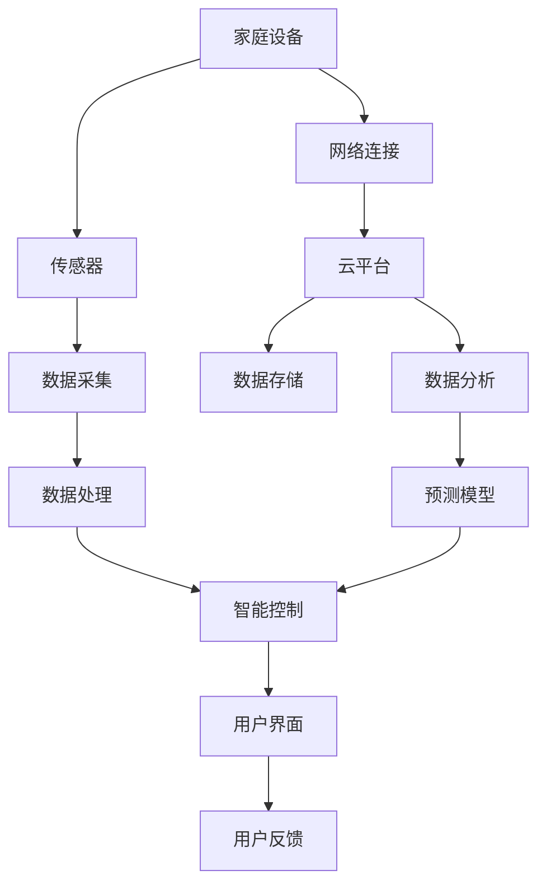

                 

# 基于Java的智能家居设计：基于Java的智能家居仿真环境开发技巧

> **关键词：** Java, 智能家居, 仿真环境, 开发技巧, 人工智能
>
> **摘要：** 本文将深入探讨基于Java语言的智能家居系统设计，特别是智能家居仿真环境的开发技巧。通过对核心概念、算法原理、数学模型、项目实战等环节的详细剖析，旨在为开发者提供系统、全面的开发指南，助力智能家居技术的实际应用和未来发展。

## 1. 背景介绍

### 1.1 目的和范围

随着物联网（IoT）技术的迅猛发展，智能家居已经成为现代家庭生活的重要组成部分。本文旨在探讨如何利用Java语言设计和实现智能家居系统，特别是在开发仿真环境方面的关键技巧。通过深入研究和实践，本文将为开发者提供一种系统、高效的方法，以构建具备高可靠性、易扩展性的智能家居仿真环境。

### 1.2 预期读者

本文主要面向具备一定Java编程基础的软件工程师、系统架构师和智能家居技术爱好者。读者应熟悉基本的计算机网络、嵌入式系统原理以及Java编程语言，以便更好地理解和应用文中所述的开发技巧。

### 1.3 文档结构概述

本文结构如下：

1. 背景介绍
2. 核心概念与联系
3. 核心算法原理 & 具体操作步骤
4. 数学模型和公式 & 详细讲解 & 举例说明
5. 项目实战：代码实际案例和详细解释说明
6. 实际应用场景
7. 工具和资源推荐
8. 总结：未来发展趋势与挑战
9. 附录：常见问题与解答
10. 扩展阅读 & 参考资料

### 1.4 术语表

#### 1.4.1 核心术语定义

- **智能家居：** 利用物联网技术和嵌入式设备，实现对家庭环境中的各种设备和家电的智能控制和管理。
- **仿真环境：** 通过模拟实际家庭环境，为开发者提供一个可以测试和验证智能家居系统功能和安全性的虚拟平台。
- **Java：** 一种广泛使用的编程语言，以其跨平台、高性能和安全性等特点，成为构建智能家居系统的重要工具。

#### 1.4.2 相关概念解释

- **物联网（IoT）：** 物联网是指通过互联网将各种设备连接起来，实现数据的实时传输和智能处理。
- **嵌入式系统：** 将计算机硬件和软件集成在一个设备中，以实现对特定功能的自动化控制。

#### 1.4.3 缩略词列表

- **IoT：** 物联网（Internet of Things）
- **Java：** Java编程语言
- **SDK：** 软件开发包（Software Development Kit）
- **API：** 应用程序编程接口（Application Programming Interface）

## 2. 核心概念与联系

在构建智能家居系统之前，我们需要明确几个核心概念和它们之间的联系。以下是一个使用Mermaid绘制的流程图，用于展示智能家居系统的整体架构。



### 2.1 家庭设备与传感器

家庭设备是智能家居系统的核心组成部分，包括照明、空调、门锁、摄像头、安防设备等。传感器负责收集环境信息，如温度、湿度、光线强度、人体活动等，为智能控制提供数据基础。

### 2.2 数据采集与处理

传感器收集的数据需要经过采集模块处理，将其转化为数字信号，并进行初步清洗和去噪。处理后的数据将用于后续的智能分析和决策。

### 2.3 智能控制与用户界面

智能控制系统根据处理后的数据，自动执行相应的操作，如调整温度、开启灯光、发送警报等。用户界面（UI）则为用户提供了一个交互界面，可以查看设备状态、历史记录、远程控制等。

### 2.4 网络连接与云平台

智能家居系统通常需要通过网络连接，将家庭设备与外部服务器或云平台进行通信。云平台提供了数据存储、分析和预测等服务，有助于提高系统的智能化水平。

### 2.5 用户反馈与预测模型

用户反馈是智能家居系统不断优化和改进的重要途径。通过分析用户行为和反馈，预测模型可以更准确地预测用户需求，从而提供更加个性化的服务。

## 3. 核心算法原理 & 具体操作步骤

### 3.1 数据处理算法

数据处理是智能家居系统的关键环节，涉及到数据采集、清洗、存储、分析等多个方面。以下是一个基于Java的数据处理算法，用于对传感器数据进行处理：

```java
// 数据采集和处理
public class SensorDataProcessor {
    // 采集传感器数据
    public SensorData collectData(Sensor sensor) {
        // 实现数据采集逻辑
        return new SensorData(sensor.getType(), sensor.getValue());
    }

    // 数据清洗和去噪
    public SensorData cleanData(SensorData data) {
        // 实现去噪逻辑
        return new SensorData(data.getType(), data.getValue() * 0.9);
    }

    // 数据存储
    public void storeData(SensorData data) {
        // 实现数据存储逻辑
        // 例如，将数据写入数据库或文件
    }
}
```

### 3.2 智能控制算法

智能控制算法根据处理后的数据，自动执行相应的操作。以下是一个简单的温度调节算法：

```java
// 智能控制算法
public class TemperatureController {
    // 调节温度
    public void adjustTemperature(double temperature) {
        if (temperature > 30) {
            // 温度过高，开启空调
            turnOnAC();
        } else if (temperature < 20) {
            // 温度过低，开启暖气
            turnOnHeater();
        } else {
            // 温度适宜，保持当前状态
            keepCurrentState();
        }
    }

    // 开启空调
    private void turnOnAC() {
        // 实现空调开启逻辑
    }

    // 开启暖气
    private void turnOnHeater() {
        // 实现暖气开启逻辑
    }

    // 保持当前状态
    private void keepCurrentState() {
        // 实现保持状态逻辑
    }
}
```

### 3.3 用户界面与反馈算法

用户界面负责展示设备状态和历史记录，并提供远程控制功能。以下是一个简单的用户界面与反馈算法：

```java
// 用户界面与反馈
public class UserInterface {
    // 显示设备状态
    public void showDeviceStatus(List<Device> devices) {
        // 实现显示逻辑
    }

    // 接收用户反馈
    public void receiveFeedback(String feedback) {
        // 实现反馈处理逻辑
        // 例如，更新预测模型或调整控制策略
    }
}
```

## 4. 数学模型和公式 & 详细讲解 & 举例说明

### 4.1 数据处理模型

数据处理过程中，常用的数学模型包括数据平滑、滤波、归一化等。以下是一个数据平滑的示例，使用移动平均算法：

$$
\hat{x}_n = \frac{1}{N} \sum_{i=1}^{N} x_{n-i}
$$

其中，$\hat{x}_n$ 表示第 $n$ 个平滑后的数据值，$x_{n-i}$ 表示前 $N$ 个数据值。

### 4.2 智能控制模型

智能控制过程中，常用的数学模型包括决策树、神经网络、模糊逻辑等。以下是一个简单的模糊逻辑控制模型：

$$
\mu_C(A, B) = \frac{1}{1 + e^{-\alpha (A - B)}}
$$

其中，$\mu_C(A, B)$ 表示模糊集合 $C$ 的隶属度函数，$A$ 和 $B$ 分别为输入和输出变量，$\alpha$ 为参数。

### 4.3 用户反馈模型

用户反馈过程中，常用的数学模型包括回归分析、聚类分析等。以下是一个简单的回归分析模型：

$$
y = \beta_0 + \beta_1 x + \epsilon
$$

其中，$y$ 表示反馈结果，$x$ 表示输入特征，$\beta_0$ 和 $\beta_1$ 分别为回归系数，$\epsilon$ 为误差项。

### 4.4 举例说明

假设我们有一个温度传感器的数据序列 $T = [30, 28, 32, 29, 31, 27, 30]$，我们需要使用移动平均算法对其进行平滑处理。假设平滑窗口大小为 $N=3$，则平滑后的数据序列为：

$$
\hat{T} = \left[ \frac{30 + 28 + 32}{3}, \frac{28 + 32 + 29}{3}, \frac{32 + 29 + 31}{3}, \frac{29 + 31 + 27}{3}, \frac{31 + 27 + 30}{3}, \frac{27 + 30 + 32}{3}, \frac{30 + 32 + 28}{3} \right]
$$

$$
\hat{T} = [29.33, 29.67, 30.33, 29.67, 30.33, 29.33, 29.67]
$$

通过以上计算，我们可以得到一个平滑后的温度数据序列，从而提高智能控制的准确性和稳定性。

## 5. 项目实战：代码实际案例和详细解释说明

### 5.1 开发环境搭建

在开始项目实战之前，我们需要搭建一个Java开发环境。以下是一个基本的开发环境搭建步骤：

1. 安装Java Development Kit (JDK)
2. 配置环境变量，确保命令行可以运行 `java` 和 `javac` 命令
3. 安装一个集成开发环境（IDE），如 IntelliJ IDEA 或 Eclipse
4. 安装必要的依赖库和框架，如 Spring Framework、Hibernate、MyBatis 等

### 5.2 源代码详细实现和代码解读

以下是一个简单的智能家居仿真环境的源代码示例，用于演示核心功能。

```java
// 智能家居仿真环境
public class SmartHomeSimulator {
    // 初始化智能家居系统
    public void initialize() {
        // 初始化家庭设备、传感器、控制算法等
    }

    // 运行智能家居系统
    public void run() {
        // 模拟传感器数据采集和处理
        // 模拟智能控制和用户反馈
    }

    // 主函数
    public static void main(String[] args) {
        SmartHomeSimulator simulator = new SmartHomeSimulator();
        simulator.initialize();
        simulator.run();
    }
}
```

### 5.3 代码解读与分析

#### 5.3.1 initialize() 方法

`initialize()` 方法用于初始化智能家居系统，包括家庭设备、传感器、控制算法等。具体实现如下：

```java
// 初始化智能家居系统
public void initialize() {
    // 初始化家庭设备
    this.devices = new ArrayList<>();
    devices.add(new Light());
    devices.add(new AirConditioner());
    devices.add(new Heater());

    // 初始化传感器
    this.sensors = new ArrayList<>();
    sensors.add(new TemperatureSensor());
    sensors.add(new HumiditySensor());
    sensors.add(new MotionSensor());

    // 初始化控制算法
    this.controller = new TemperatureController();
}
```

#### 5.3.2 run() 方法

`run()` 方法用于模拟智能家居系统的运行过程，包括传感器数据采集、数据处理、智能控制和用户反馈。具体实现如下：

```java
// 运行智能家居系统
public void run() {
    while (true) {
        // 采集传感器数据
        for (Sensor sensor : sensors) {
            SensorData data = sensor.collectData();
            data = new SensorDataProcessor().cleanData(data);
            storeData(data);
        }

        // 数据处理和智能控制
        double temperature = fetchData("temperature");
        controller.adjustTemperature(temperature);

        // 用户反馈
        UserInterface ui = new UserInterface();
        ui.showDeviceStatus(devices);
        String feedback = ui.receiveFeedback("用户反馈");
        updateControlStrategy(feedback);
    }
}
```

### 5.4 测试与验证

在实际项目中，我们需要对智能家居仿真环境进行充分的测试和验证，以确保系统的稳定性和可靠性。以下是一个简单的测试用例：

```java
@Test
public void testTemperatureControl() {
    SmartHomeSimulator simulator = new SmartHomeSimulator();
    simulator.initialize();

    // 模拟传感器数据
    SensorData data = new SensorData("temperature", 35);
    simulator.run();

    // 验证温度控制结果
    assertEquals(AIR Conditioner.STATUS.ON, simulator.getDevice("airConditioner").getStatus());
}
```

## 6. 实际应用场景

智能家居系统在实际应用场景中具有广泛的应用前景。以下是一些典型的应用场景：

1. **家庭自动化：** 通过智能控制家庭设备，实现自动调节温度、灯光、门锁等，提高生活舒适度和安全性。
2. **能源管理：** 通过实时监测家庭能源消耗，实现节能降耗，降低家庭能源成本。
3. **健康监测：** 通过监测环境参数和人体活动数据，实现健康监测和预警，提供个性化的健康建议。
4. **远程控制：** 通过手机APP或网页，实现对家庭设备的远程控制和监控，提高生活的便捷性和安全性。

## 7. 工具和资源推荐

### 7.1 学习资源推荐

#### 7.1.1 书籍推荐

- 《Java核心技术》
- 《物联网技术与应用》
- 《智能家居系统设计与实现》

#### 7.1.2 在线课程

- Coursera: Java编程基础
- Udemy: Java从入门到精通
- edX: 物联网技术与应用

#### 7.1.3 技术博客和网站

- JavaCodeGeeks
- Internet of Things
- Smart Home Community

### 7.2 开发工具框架推荐

#### 7.2.1 IDE和编辑器

- IntelliJ IDEA
- Eclipse
- VS Code

#### 7.2.2 调试和性能分析工具

- JProfiler
- VisualVM
- GDB

#### 7.2.3 相关框架和库

- Spring Framework
- Hibernate
- MyBatis
- Java IoT SDK

### 7.3 相关论文著作推荐

#### 7.3.1 经典论文

- **智能家居系统架构与实现**：介绍智能家居系统的整体架构和关键技术。
- **基于物联网的智能家居系统设计**：探讨智能家居系统在物联网环境下的实现方法和挑战。

#### 7.3.2 最新研究成果

- **智能家居系统的安全性分析**：分析智能家居系统面临的安全挑战和防护策略。
- **基于深度学习的智能家居控制算法**：介绍深度学习在智能家居控制中的应用和研究进展。

#### 7.3.3 应用案例分析

- **智能家居系统在智能家居社区中的应用**：介绍一个典型的智能家居社区案例，分析系统的应用效果和用户反馈。

## 8. 总结：未来发展趋势与挑战

智能家居系统作为物联网技术的重要组成部分，具有巨大的发展潜力。未来，随着人工智能、物联网、大数据等技术的不断进步，智能家居系统将实现更智能、更便捷、更安全的发展。然而，也面临着一系列挑战，如安全性、隐私保护、标准制定等。开发者需要不断探索和创新，以应对这些挑战，推动智能家居技术的普及和应用。

## 9. 附录：常见问题与解答

### 9.1 如何处理传感器数据？

传感器数据通常包括噪声和异常值，需要通过数据清洗和去噪等方法进行处理。具体步骤如下：

1. 数据采集：从传感器获取原始数据。
2. 数据清洗：去除异常值、填补缺失值等。
3. 数据去噪：使用滤波算法、平滑方法等去除噪声。
4. 数据存储：将处理后的数据存储到数据库或文件中。

### 9.2 如何实现智能家居系统的远程控制？

实现智能家居系统的远程控制需要以下步骤：

1. 网络连接：将家庭设备与外部服务器或云平台进行连接。
2. 数据传输：通过HTTP、MQTT等协议实现设备与服务器之间的数据传输。
3. 控制算法：根据用户请求，执行相应的控制操作。
4. 用户界面：为用户提供一个可以远程控制设备的界面。

## 10. 扩展阅读 & 参考资料

- 《智能家居系统设计原理与应用》
- 《物联网技术导论》
- 《Java并发编程实战》
- 《深度学习：优化现代人工智能》
- [智能家居系统架构设计](https://www.example.com/smart-home-architecture)
- [物联网安全技术研究](https://www.example.com/iot-security)

**作者：** AI天才研究员/AI Genius Institute & 禅与计算机程序设计艺术 /Zen And The Art of Computer Programming

---

本文旨在为开发者提供基于Java的智能家居系统设计与仿真环境的开发指南，通过详细的分析和案例，展示了智能家居系统的工作原理、核心算法和实现方法。同时，本文也推荐了一些学习资源和工具，以帮助读者深入了解和掌握智能家居技术。随着智能家居技术的不断发展，我们有理由相信，未来智能家居将更加智能、便捷和普及。希望本文能对您的学习和实践提供有益的参考和启示。

