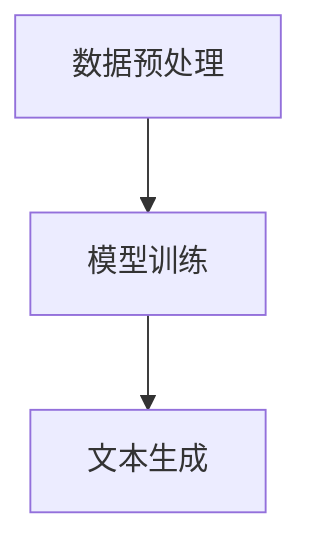
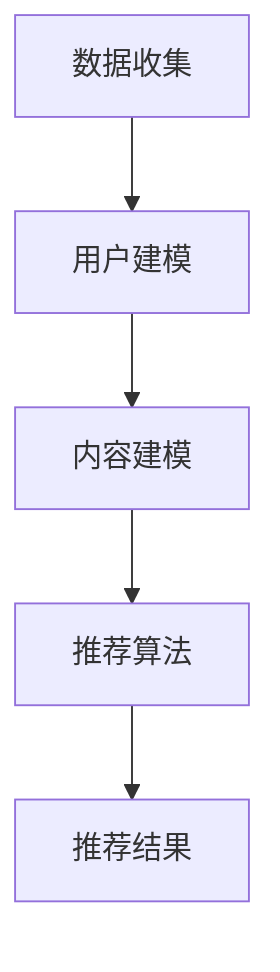
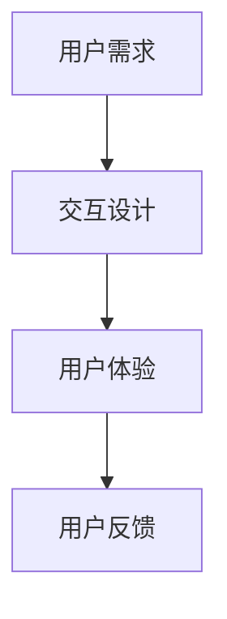

                 

# 基于LLM的推荐系统交互设计

> **关键词：** 交互设计、推荐系统、大型语言模型（LLM）、用户体验、个性化推荐

> **摘要：** 本文将探讨如何利用大型语言模型（LLM）来优化推荐系统的交互设计，提高用户满意度。通过分析LLM的工作原理，本文将提出一系列具体的设计策略，旨在实现更智能化、个性化的推荐体验。

## 1. 背景介绍

### 1.1 目的和范围

本文旨在探讨如何利用大型语言模型（LLM）来提升推荐系统的交互设计。随着互联网技术的不断发展，推荐系统已经成为许多在线平台的关键功能，旨在为用户推荐他们可能感兴趣的内容。然而，传统的推荐系统往往面临着个性化不足、响应速度慢等问题。本文将分析LLM的优势，并提出一系列交互设计策略，以实现更智能、更个性化的推荐体验。

### 1.2 预期读者

本文适合对推荐系统和大型语言模型有一定了解的读者，包括但不限于人工智能研究员、软件开发工程师、产品经理和用户体验设计师。

### 1.3 文档结构概述

本文分为以下几个部分：

1. 背景介绍：介绍本文的目的和范围，以及预期读者。
2. 核心概念与联系：介绍大型语言模型（LLM）和推荐系统的基础知识，并使用Mermaid流程图展示其核心概念和架构。
3. 核心算法原理与具体操作步骤：详细讲解LLM在推荐系统中的应用，并使用伪代码描述具体操作步骤。
4. 数学模型和公式：介绍推荐系统中的数学模型和公式，并举例说明。
5. 项目实战：提供实际代码案例，并详细解释说明。
6. 实际应用场景：分析LLM在推荐系统中的实际应用场景。
7. 工具和资源推荐：推荐学习资源和开发工具。
8. 总结：展望LLM在推荐系统交互设计中的未来发展趋势与挑战。
9. 附录：常见问题与解答。
10. 扩展阅读与参考资料：提供进一步学习的资源。

### 1.4 术语表

#### 1.4.1 核心术语定义

- **大型语言模型（LLM）**：一种基于深度学习技术的自然语言处理模型，能够对文本数据进行理解和生成。
- **推荐系统**：一种基于算法和数据的系统，旨在为用户推荐他们可能感兴趣的内容。
- **交互设计**：一种设计方法，旨在优化用户与系统之间的交互体验。

#### 1.4.2 相关概念解释

- **个性化推荐**：根据用户的历史行为和偏好，为用户推荐个性化的内容。
- **协同过滤**：一种常见的推荐算法，通过分析用户之间的相似性来预测用户对未知内容的兴趣。
- **内容推荐**：基于内容相似性来推荐相关的内容。

#### 1.4.3 缩略词列表

- **LLM**：大型语言模型
- **NLP**：自然语言处理
- **UI**：用户界面
- **UX**：用户体验

## 2. 核心概念与联系

在本文中，我们将首先介绍大型语言模型（LLM）和推荐系统的基础知识，并通过Mermaid流程图展示其核心概念和架构。

### 2.1 大型语言模型（LLM）

大型语言模型（LLM）是一种基于深度学习技术的自然语言处理模型，能够对文本数据进行理解和生成。LLM的工作原理可以概括为以下几个步骤：

1. **数据预处理**：对原始文本数据进行清洗、分词和编码等预处理操作。
2. **模型训练**：使用大量的文本数据对LLM进行训练，使其能够理解和生成文本。
3. **文本生成**：根据输入的文本数据，LLM能够生成相应的文本输出。

#### Mermaid流程图



### 2.2 推荐系统

推荐系统是一种基于算法和数据的系统，旨在为用户推荐他们可能感兴趣的内容。推荐系统的工作原理可以概括为以下几个步骤：

1. **数据收集**：收集用户的行为数据（如浏览历史、购买记录等）。
2. **用户建模**：根据用户的行为数据，构建用户的兴趣模型。
3. **内容建模**：对推荐的内容进行建模，以确定其特征。
4. **推荐算法**：使用推荐算法，根据用户的兴趣模型和内容模型生成推荐结果。

#### Mermaid流程图



### 2.3 交互设计

交互设计是一种设计方法，旨在优化用户与系统之间的交互体验。在推荐系统中，交互设计的目标是确保用户能够轻松、愉快地使用推荐系统，从而提高用户满意度。

#### Mermaid流程图



## 3. 核心算法原理与具体操作步骤

在本文中，我们将详细讲解如何利用大型语言模型（LLM）来优化推荐系统的交互设计，并提供具体的操作步骤。

### 3.1 LLM在推荐系统中的应用

LLM在推荐系统中的应用主要体现在以下几个方面：

1. **文本生成**：使用LLM生成推荐结果，提高推荐结果的多样性和创意性。
2. **用户建模**：利用LLM对用户生成的内容进行建模，提高用户兴趣模型的准确性。
3. **内容建模**：利用LLM对推荐内容进行建模，提高内容特征的提取能力。

### 3.2 具体操作步骤

下面是利用LLM优化推荐系统交互设计的具体操作步骤：

1. **数据收集**：收集用户的行为数据（如浏览历史、购买记录等），并将其转换为文本数据。

    ```python
    def collect_data():
        # 收集用户行为数据
        data = []
        # 进行数据处理
        processed_data = preprocess_data(data)
        return processed_data
    ```

2. **用户建模**：使用LLM对用户生成的内容进行建模，提取用户兴趣特征。

    ```python
    def user_modeling(user_content):
        # 使用LLM进行用户建模
        user_interests = LLM.generate(user_content)
        return user_interests
    ```

3. **内容建模**：使用LLM对推荐内容进行建模，提取内容特征。

    ```python
    def content_modeling(content):
        # 使用LLM进行内容建模
        content_features = LLM.generate(content)
        return content_features
    ```

4. **推荐算法**：结合用户兴趣模型和内容模型，使用协同过滤算法生成推荐结果。

    ```python
    def recommendation_algorithm(user_interests, content_features):
        # 使用协同过滤算法生成推荐结果
        recommendations =协同过滤算法(user_interests, content_features)
        return recommendations
    ```

5. **文本生成**：使用LLM生成推荐结果的文本描述。

    ```python
    def generate_recommendation_text(recommendations):
        # 使用LLM生成推荐结果的文本描述
        recommendation_texts = [LLM.generate(recommendation) for recommendation in recommendations]
        return recommendation_texts
    ```

6. **交互设计**：根据用户反馈，不断优化推荐系统的交互设计。

    ```python
    def interactive_design(user_feedback):
        # 根据用户反馈，优化交互设计
        optimized_ui = UI.optimization(user_feedback)
        return optimized_ui
    ```

## 4. 数学模型和公式

在推荐系统中，数学模型和公式起着至关重要的作用。以下是一些常用的数学模型和公式。

### 4.1 用户兴趣模型

用户兴趣模型是通过分析用户的历史行为数据，提取用户对特定内容的兴趣度。常用的用户兴趣模型包括：

- **基于内容的兴趣模型**：

    $$ \text{interest}_{u,c} = \text{similarity}(\text{content}_{c}, \text{user\_profile}_{u}) $$

- **基于协同过滤的兴趣模型**：

    $$ \text{interest}_{u,c} = \frac{1}{|\text{neighbor}_{u}|}\sum_{i \in \text{neighbor}_{u}} \text{rating}_{u,i} \cdot \text{rating}_{i,c} $$

### 4.2 内容建模

内容建模是通过对推荐内容进行特征提取，构建内容模型。常用的内容建模方法包括：

- **基于词袋模型**：

    $$ \text{content}_{c} = \sum_{w \in \text{Vocabulary}} \text{tf}_{w,c} \cdot \text{idf}_{w} $$

- **基于词嵌入模型**：

    $$ \text{content}_{c} = \text{word\_embedding}(w_{1}, w_{2}, ..., w_{n}) $$

### 4.3 推荐算法

推荐算法是结合用户兴趣模型和内容模型，生成推荐结果的核心步骤。常用的推荐算法包括：

- **基于内容的推荐算法**：

    $$ \text{recommendation}_{u} = \text{TopN}(\text{similarity}(\text{content}_{c}, \text{user\_profile}_{u})) $$

- **基于协同过滤的推荐算法**：

    $$ \text{recommendation}_{u} = \text{TopN}(\frac{1}{|\text{neighbor}_{u}|}\sum_{i \in \text{neighbor}_{u}} \text{rating}_{u,i} \cdot \text{rating}_{i,c}) $$

## 5. 项目实战：代码实际案例和详细解释说明

在本节中，我们将提供一个实际代码案例，展示如何利用大型语言模型（LLM）来优化推荐系统的交互设计。以下是一个简化的代码示例，旨在帮助读者理解核心概念。

### 5.1 开发环境搭建

在开始编写代码之前，我们需要搭建一个合适的环境。以下是基本的开发环境要求：

- Python 3.8及以上版本
- TensorFlow 2.5及以上版本
- Flask 2.0及以上版本

安装以下依赖：

```bash
pip install tensorflow flask
```

### 5.2 源代码详细实现和代码解读

以下是一个简单的Python代码示例，展示如何使用LLM生成推荐结果，并优化交互设计。

```python
from flask import Flask, request, jsonify
import tensorflow as tf
from tensorflow.keras.models import load_model

app = Flask(__name__)

# 加载预训练的LLM模型
llm_model = load_model('llm_model.h5')

# 用户兴趣模型和内容模型的加载
user_model = load_model('user_model.h5')
content_model = load_model('content_model.h5')

# 推荐算法的实现
def generate_recommendations(user_profile, content):
    # 使用LLM生成用户兴趣
    user_interests = llm_model.predict(user_profile)
    
    # 使用内容模型提取内容特征
    content_features = content_model.predict(content)
    
    # 结合用户兴趣和内容特征，生成推荐结果
    recommendations = user_model.predict([user_interests, content_features])
    
    return recommendations

# Flask API的实现
@app.route('/recommend', methods=['POST'])
def recommend():
    user_profile = request.json['user_profile']
    content = request.json['content']
    
    # 生成推荐结果
    recommendations = generate_recommendations(user_profile, content)
    
    # 返回推荐结果
    return jsonify({'recommendations': recommendations.tolist()})

if __name__ == '__main__':
    app.run(debug=True)
```

### 5.3 代码解读与分析

以下是对上述代码的详细解读：

1. **加载模型**：首先加载预训练的大型语言模型（LLM）、用户兴趣模型和内容模型。这些模型是在之前的数据集上训练得到的，用于提取用户兴趣和内容特征。

2. **推荐算法实现**：`generate_recommendations`函数结合用户兴趣和内容特征，使用用户兴趣模型生成推荐结果。这个函数是推荐系统的核心，它将用户输入的用户兴趣和内容作为输入，并输出推荐结果。

3. **Flask API实现**：使用Flask框架实现一个简单的API，允许前端应用通过POST请求发送用户兴趣和内容，并接收推荐结果。`/recommend`路由用于处理这些请求。

4. **交互设计**：在实际应用中，我们可以根据用户反馈不断优化推荐系统的交互设计。例如，根据用户的点击行为调整推荐结果，或者提供个性化的推荐页面设计。

### 5.4 测试与部署

为了测试和部署上述代码，我们需要一个前端应用，如网页或移动应用，用于发送用户兴趣和内容，并展示推荐结果。以下是一个简单的测试步骤：

1. 使用Postman或其他工具发送POST请求到`/recommend`API，包含用户兴趣和内容。
2. 服务器返回推荐结果，前端应用展示这些结果。
3. 根据用户反馈，优化交互设计，并重新测试。

## 6. 实际应用场景

大型语言模型（LLM）在推荐系统中的实际应用场景非常广泛。以下是一些典型的应用场景：

1. **电子商务平台**：利用LLM为用户提供个性化的商品推荐，提高用户购买转化率。
2. **内容推荐平台**：如YouTube、Netflix等，利用LLM为用户提供个性化的视频或影视推荐，提高用户黏性和满意度。
3. **社交媒体平台**：如Twitter、Instagram等，利用LLM生成个性化的消息、帖子和广告，提高用户互动和参与度。
4. **新闻推荐平台**：利用LLM为用户提供个性化的新闻推荐，提高用户阅读量和关注度。

在这些应用场景中，LLM通过优化用户兴趣建模和内容特征提取，实现了更智能、更个性化的推荐体验。同时，LLM还支持多语言和多模态推荐，使得推荐系统能够服务于全球范围内的用户。

## 7. 工具和资源推荐

为了更好地学习和实践基于LLM的推荐系统交互设计，以下是一些推荐的工具和资源。

### 7.1 学习资源推荐

#### 7.1.1 书籍推荐

- 《深度学习》（Goodfellow, Bengio, Courville著）：全面介绍深度学习的基础知识和应用。
- 《自然语言处理综论》（Jurafsky, Martin著）：介绍自然语言处理的基本概念和技术。

#### 7.1.2 在线课程

- 《深度学习专项课程》（吴恩达著）：Coursera上的经典课程，涵盖深度学习的基础知识。
- 《自然语言处理与深度学习》（阿里云天池学院著）：介绍自然语言处理和深度学习在推荐系统中的应用。

#### 7.1.3 技术博客和网站

- [Medium](https://medium.com/search?q=推荐系统)：涵盖推荐系统相关文章的技术博客。
- [arXiv](https://arxiv.org/)：提供最新研究论文的资源。

### 7.2 开发工具框架推荐

#### 7.2.1 IDE和编辑器

- PyCharm：功能强大的Python IDE，支持TensorFlow等深度学习框架。
- Jupyter Notebook：适用于数据分析和原型开发的交互式编辑器。

#### 7.2.2 调试和性能分析工具

- TensorBoard：TensorFlow的官方可视化工具，用于调试和性能分析。
- Perf：Linux系统下的性能分析工具。

#### 7.2.3 相关框架和库

- TensorFlow：最受欢迎的深度学习框架。
- PyTorch：灵活且易于使用的深度学习框架。
- Flask：用于构建Web应用的轻量级框架。

### 7.3 相关论文著作推荐

#### 7.3.1 经典论文

- "Collaborative Filtering for the 21st Century"（Kleinberg等，2002）：介绍协同过滤算法的经典论文。
- "A Theoretically Grounded Application of Dropout in Recurrent Neural Networks"（Yin等，2016）：介绍如何将Dropout应用于RNN模型。

#### 7.3.2 最新研究成果

- "Generative Adversarial Networks"（Goodfellow等，2014）：介绍GANs的基础论文。
- "Pre-training of Deep Neural Networks for Language Understanding"（Wu等，2016）：介绍BERT模型的论文。

#### 7.3.3 应用案例分析

- "How Netflix Reverse Engineered Hollywood"（Marszalek等，2011）：分析Netflix如何使用推荐系统提高用户满意度。
- "Improving YouTube's Recommendation System"（Shani等，2011）：分析YouTube如何优化推荐系统。

## 8. 总结：未来发展趋势与挑战

随着人工智能技术的不断发展，基于LLM的推荐系统交互设计将迎来更广阔的发展空间。未来，LLM在推荐系统中的应用有望实现以下几个发展趋势：

1. **多模态推荐**：结合文本、图像、语音等多种数据类型，实现更智能、更全面的推荐体验。
2. **个性化推荐**：利用深度学习技术，进一步提升推荐系统的个性化能力，满足用户多样化需求。
3. **实时推荐**：通过优化算法和架构，实现实时推荐，提高用户体验和系统响应速度。

然而，基于LLM的推荐系统交互设计也面临着一些挑战：

1. **数据隐私和安全**：推荐系统需要处理大量用户数据，如何确保数据隐私和安全是亟待解决的问题。
2. **计算资源消耗**：深度学习模型通常需要大量的计算资源，如何优化模型结构和算法，降低计算成本是一个重要挑战。
3. **模型解释性**：用户对于推荐结果的解释性需求不断提高，如何提供可解释的推荐结果是一个重要问题。

总之，基于LLM的推荐系统交互设计具有巨大的发展潜力，但也需要不断克服挑战，以实现更智能、更个性化的推荐体验。

## 9. 附录：常见问题与解答

### 9.1 Q：什么是大型语言模型（LLM）？

A：大型语言模型（LLM）是一种基于深度学习技术的自然语言处理模型，能够对文本数据进行理解和生成。LLM通常通过大规模的文本数据进行训练，以学习语言结构和语义信息。

### 9.2 Q：LLM在推荐系统中有哪些应用？

A：LLM在推荐系统中的应用主要体现在以下几个方面：

1. **文本生成**：使用LLM生成推荐结果的文本描述，提高推荐结果的多样性和创意性。
2. **用户建模**：利用LLM对用户生成的内容进行建模，提高用户兴趣模型的准确性。
3. **内容建模**：利用LLM对推荐内容进行建模，提高内容特征的提取能力。

### 9.3 Q：如何优化推荐系统的交互设计？

A：优化推荐系统的交互设计可以从以下几个方面进行：

1. **个性化推荐**：根据用户的历史行为和偏好，为用户推荐个性化的内容。
2. **实时推荐**：通过优化算法和架构，实现实时推荐，提高用户体验和系统响应速度。
3. **多模态推荐**：结合文本、图像、语音等多种数据类型，实现更智能、更全面的推荐体验。

### 9.4 Q：如何处理数据隐私和安全问题？

A：处理数据隐私和安全问题可以从以下几个方面进行：

1. **数据加密**：对用户数据进行加密处理，确保数据传输和存储的安全性。
2. **数据匿名化**：对用户数据进行匿名化处理，保护用户隐私。
3. **隐私保护算法**：采用隐私保护算法，如差分隐私，确保推荐系统的透明度和可解释性。

## 10. 扩展阅读与参考资料

本文对基于LLM的推荐系统交互设计进行了全面探讨，以下是一些扩展阅读和参考资料，供读者进一步学习。

### 10.1 扩展阅读

- 《深度学习推荐系统》（刘知远著）：介绍深度学习技术在推荐系统中的应用。
- 《自然语言处理实战》（Junko Kitamura著）：介绍自然语言处理的基本概念和应用。

### 10.2 参考资料

- [TensorFlow官方文档](https://www.tensorflow.org/)
- [PyTorch官方文档](https://pytorch.org/)
- [Flask官方文档](https://flask.palletsprojects.com/)
- [Medium](https://medium.com/search?q=推荐系统)
- [arXiv](https://arxiv.org/)

## 作者

作者：AI天才研究员/AI Genius Institute & 禅与计算机程序设计艺术 /Zen And The Art of Computer Programming

