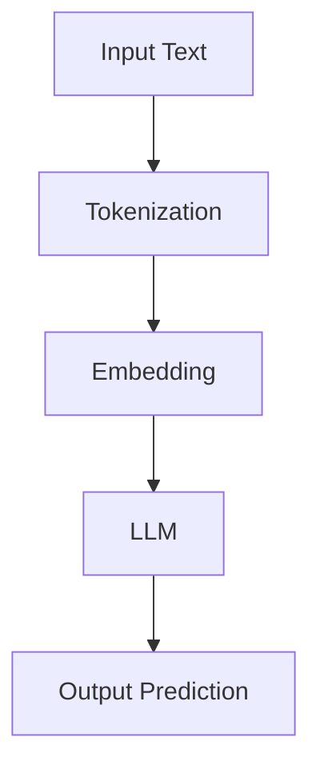
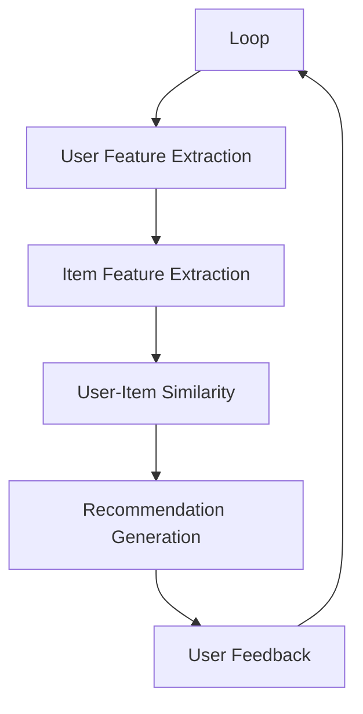
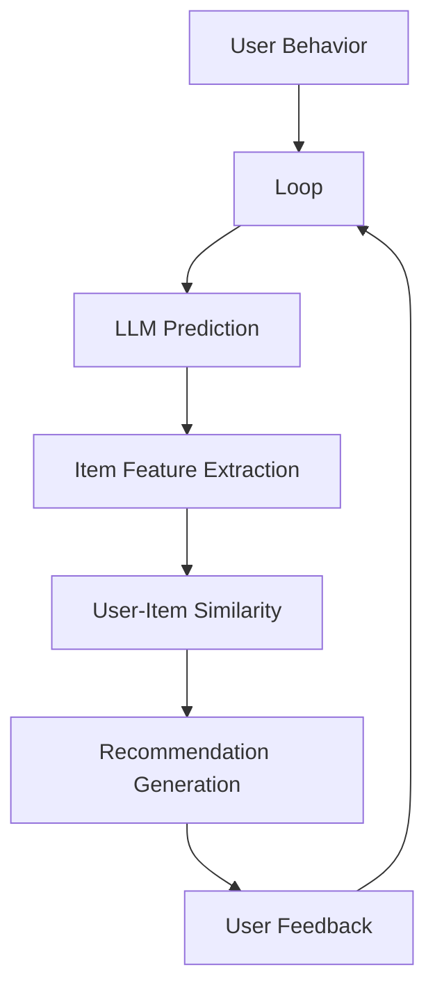
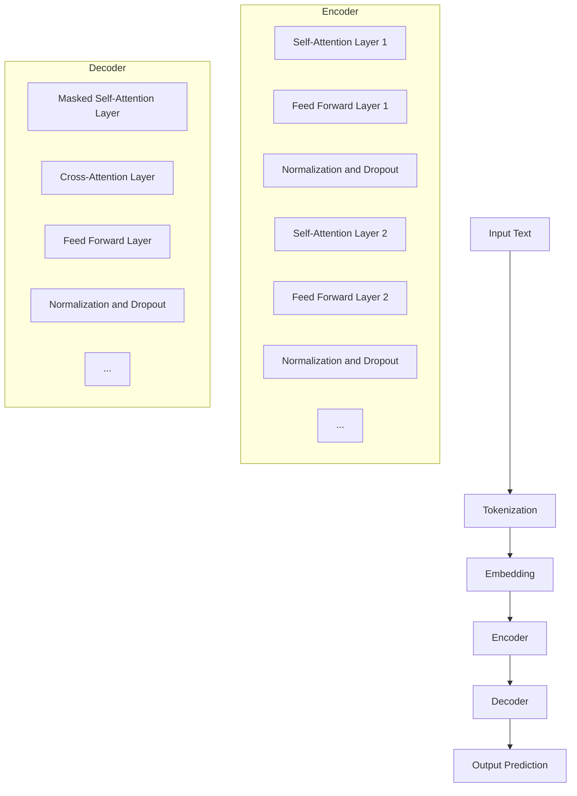

                 

# 基于LLM的推荐系统实时个性化调整

## 关键词
- Large Language Models
- Recommendation Systems
- Real-Time Personalization
- Machine Learning
- Personalized Adjustment
- User Experience Optimization

## 摘要
本文深入探讨了基于大型语言模型（LLM）的推荐系统如何实现实时个性化调整。随着人工智能和机器学习技术的飞速发展，推荐系统已经成为互联网领域的关键技术，但传统的推荐系统往往难以实现真正的个性化体验。本文将介绍LLM的基本概念，分析其在推荐系统中的应用优势，并详细讲解如何基于LLM构建一个实时个性化调整的推荐系统。通过数学模型、算法原理、项目实战等多角度的解析，本文旨在为读者提供全面、深入的技术指导。

## 1. 背景介绍

### 1.1 目的和范围

本文旨在探讨如何利用大型语言模型（LLM）实现推荐系统的实时个性化调整。具体来说，我们将分析LLM的核心原理及其在推荐系统中的应用，详细介绍基于LLM的推荐系统架构，并探讨如何通过实时数据分析和个性化调整来优化用户体验。

### 1.2 预期读者

本文面向具有一定编程基础和机器学习背景的读者，包括人工智能研究人员、软件开发工程师、产品经理以及对推荐系统技术感兴趣的普通读者。本文将尽可能使用通俗易懂的语言和实例，以帮助读者理解和掌握相关技术。

### 1.3 文档结构概述

本文将分为十个部分：

1. 背景介绍：介绍本文的目的、范围、预期读者以及文档结构。
2. 核心概念与联系：讲解大型语言模型（LLM）和推荐系统的基本概念，并展示相关流程图。
3. 核心算法原理 & 具体操作步骤：详细解释LLM在推荐系统中的算法原理和具体实现步骤。
4. 数学模型和公式 & 详细讲解 & 举例说明：阐述相关数学模型和公式，并通过实例进行说明。
5. 项目实战：提供实际项目案例，并进行详细解释。
6. 实际应用场景：讨论LLM推荐系统的实际应用场景。
7. 工具和资源推荐：推荐学习资源、开发工具和论文著作。
8. 总结：总结本文的核心观点和未来发展趋势。
9. 附录：常见问题与解答。
10. 扩展阅读 & 参考资料：提供进一步的阅读资料和参考文献。

### 1.4 术语表

#### 1.4.1 核心术语定义

- **大型语言模型（LLM）**：一种基于深度学习技术的大规模语言模型，能够理解和生成自然语言文本。
- **推荐系统**：一种基于用户历史行为和内容特征，向用户推荐相关物品或内容的系统。
- **实时个性化调整**：根据用户实时行为数据，动态调整推荐策略，实现个性化的推荐体验。
- **用户特征**：描述用户兴趣、行为、偏好等信息的数据。
- **物品特征**：描述物品属性、标签、类别等信息的数据。

#### 1.4.2 相关概念解释

- **深度学习**：一种机器学习方法，通过多层神经网络模型对数据进行建模和预测。
- **用户-物品交互**：用户与物品之间的互动，如点击、购买、评价等。
- **协同过滤**：一种常见的推荐系统算法，通过分析用户之间的相似度来预测用户对未知物品的评分。
- **内容过滤**：基于物品的内容特征进行推荐，如基于物品的标签、分类等信息。
- **交叉验证**：一种评估模型性能的方法，通过将数据集分为训练集和验证集，多次训练和验证来评估模型的效果。

#### 1.4.3 缩略词列表

- **LLM**：Large Language Model
- **NLP**：Natural Language Processing
- **DL**：Deep Learning
- **CNN**：Convolutional Neural Network
- **RNN**：Recurrent Neural Network
- **GRU**：Gated Recurrent Unit
- **LSTM**：Long Short-Term Memory

## 2. 核心概念与联系

在本节中，我们将详细介绍大型语言模型（LLM）和推荐系统的基本概念，并展示它们之间的联系。为了更清晰地理解，我们将使用Mermaid流程图展示LLM和推荐系统的架构。

### 2.1 大型语言模型（LLM）

大型语言模型（LLM）是一种能够理解和生成自然语言文本的深度学习模型。它通常基于Transformer架构，具有大量的参数和训练数据。LLM的核心任务是预测文本中的下一个词或序列。

#### Mermaid流程图



- **输入文本（Input Text）**：用户输入的文本。
- **分词（Tokenization）**：将输入文本分解为单词或子词。
- **嵌入（Embedding）**：将分词后的文本转换为向量表示。
- **LLM（Large Language Model）**：对嵌入后的文本进行预测。
- **输出预测（Output Prediction）**：生成文本预测结果。

### 2.2 推荐系统

推荐系统是一种基于用户历史行为和物品特征进行个性化推荐的系统。它旨在为用户提供与其兴趣和需求相关的物品或内容。

#### Mermaid流程图



- **用户行为（User Behavior）**：用户的浏览、点击、购买、评价等行为。
- **用户特征提取（User Feature Extraction）**：从用户行为中提取用户特征。
- **物品特征提取（Item Feature Extraction）**：从物品属性中提取物品特征。
- **用户-物品相似度（User-Item Similarity）**：计算用户与物品之间的相似度。
- **推荐生成（Recommendation Generation）**：生成个性化推荐列表。
- **用户反馈（User Feedback）**：用户对推荐的反馈，如点击、购买、评价等。
- **循环（Loop）**：根据用户反馈不断调整推荐策略。

### 2.3 LLM在推荐系统中的应用

大型语言模型（LLM）在推荐系统中可以应用于多个方面：

1. **用户行为预测**：利用LLM预测用户的未来行为，如点击、购买等，从而为用户提供个性化的推荐。
2. **内容生成**：根据用户的兴趣和偏好，利用LLM生成个性化的内容推荐。
3. **用户特征提取**：通过分析用户的历史行为和文本数据，利用LLM提取用户特征，以实现更准确的个性化推荐。

### 2.4 Mermaid流程图



- **用户行为（User Behavior）**：用户的浏览、点击、购买、评价等行为。
- **用户特征提取（User Feature Extraction）**：从用户行为中提取用户特征。
- **LLM预测（LLM Prediction）**：利用LLM预测用户的未来行为。
- **物品特征提取（Item Feature Extraction）**：从物品属性中提取物品特征。
- **用户-物品相似度（User-Item Similarity）**：计算用户与物品之间的相似度。
- **推荐生成（Recommendation Generation）**：生成个性化推荐列表。
- **用户反馈（User Feedback）**：用户对推荐的反馈，如点击、购买、评价等。
- **循环（Loop）**：根据用户反馈不断调整推荐策略。

## 3. 核心算法原理 & 具体操作步骤

在了解了大型语言模型（LLM）和推荐系统的基础知识后，本节将详细讲解LLM在推荐系统中的应用原理，并通过伪代码展示具体的操作步骤。

### 3.1 大型语言模型（LLM）的基本原理

大型语言模型（LLM）通常基于Transformer架构，其核心思想是使用自注意力机制（self-attention）来处理文本序列。以下是一个简化的Transformer模型的结构：



- **输入文本（Input Text）**：用户输入的文本。
- **分词（Tokenization）**：将输入文本分解为单词或子词。
- **嵌入（Embedding）**：将分词后的文本转换为向量表示。
- **编码器（Encoder）**：对嵌入后的文本进行编码，生成编码序列。
- **解码器（Decoder）**：根据编码序列生成文本预测结果。

### 3.2 LLM在推荐系统中的应用原理

基于LLM的推荐系统主要利用LLM的强大文本处理能力，实现对用户行为和物品特征的深度理解，从而实现个性化的推荐。以下是LLM在推荐系统中的核心算法原理：

1. **用户行为预测**：利用LLM预测用户的未来行为，如点击、购买等。
2. **用户特征提取**：通过分析用户的历史行为和文本数据，利用LLM提取用户特征。
3. **物品特征提取**：从物品属性中提取物品特征。
4. **相似度计算**：计算用户与物品之间的相似度，生成推荐列表。

### 3.3 伪代码

以下是基于LLM的推荐系统的伪代码：

```python
# 伪代码：基于LLM的推荐系统

# 输入：用户历史行为 data, 物品特征 data
# 输出：推荐列表 recommendations

# Step 1: 用户特征提取
user_features = extract_user_features(data)

# Step 2: 物品特征提取
item_features = extract_item_features(data)

# Step 3: 利用LLM预测用户行为
user_actions = predict_user_actions(user_features, item_features)

# Step 4: 计算用户-物品相似度
user_item_similarity = calculate_similarity(user_actions)

# Step 5: 生成推荐列表
recommendations = generate_recommendations(user_item_similarity)

# Step 6: 返回推荐列表
return recommendations
```

### 3.4 详细解释

1. **用户特征提取**：通过分析用户的历史行为和文本数据，利用LLM提取用户特征。具体来说，我们可以将用户的历史行为数据（如浏览、点击、购买等）作为输入，通过LLM模型生成用户特征向量。

2. **物品特征提取**：从物品属性中提取物品特征。这些特征可以包括物品的标签、分类、内容描述等。同样，我们可以利用LLM模型对物品特征进行编码，生成物品特征向量。

3. **利用LLM预测用户行为**：通过将用户特征和物品特征输入到LLM模型中，预测用户对物品的可能行为。例如，如果用户特征向量为`[u1, u2, u3, ...]`，物品特征向量为`[i1, i2, i3, ...]`，我们可以利用LLM模型预测用户对物品的点击概率。

4. **计算用户-物品相似度**：根据预测的用户行为，计算用户与物品之间的相似度。相似度可以采用余弦相似度、欧氏距离等计算方法。

5. **生成推荐列表**：根据用户-物品相似度，生成个性化的推荐列表。我们可以对相似度进行排序，选择相似度最高的物品进行推荐。

6. **返回推荐列表**：将生成的推荐列表返回给用户。

## 4. 数学模型和公式 & 详细讲解 & 举例说明

在本节中，我们将详细阐述基于LLM的推荐系统中涉及的主要数学模型和公式，并借助具体实例进行说明。

### 4.1 用户行为预测模型

用户行为预测是推荐系统中的关键步骤，它直接影响到推荐结果的准确性。我们采用一种基于LLM的序列预测模型来预测用户未来的行为。

#### 数学模型

用户行为预测模型可以表示为：

$$
P(y_t|x_t) = \sigma(\text{MLP}(\text{Embed}(x_t)))
$$

其中：

- \( P(y_t|x_t) \) 表示在给定当前特征 \( x_t \) 下，用户在未来 \( y_t \) 时间内发生某行为的概率。
- \( \text{Embed}(x_t) \) 是将用户特征 \( x_t \) 映射为高维特征向量的嵌入层。
- \( \text{MLP} \) 是多层感知机（Multilayer Perceptron），用于对特征向量进行非线性变换。
- \( \sigma \) 是Sigmoid激活函数，用于将输出映射到 \( (0, 1) \) 范围内。

#### 详细解释

1. **嵌入层**：嵌入层将低维的用户特征向量转换为高维的嵌入向量，这一步对于提高模型的表达能力至关重要。

2. **多层感知机**：MLP由多个隐含层组成，每个隐含层通过激活函数对输入特征进行非线性变换，从而提高模型的拟合能力。

3. **Sigmoid激活函数**：Sigmoid函数将MLP的输出映射到 \( (0, 1) \) 范围内，表示用户发生某行为的概率。

#### 举例说明

假设用户特征向量为 \( x_t = [0.1, 0.2, 0.3] \)，我们通过嵌入层将其映射为 \( \text{Embed}(x_t) = [0.5, 0.6, 0.7] \)。然后，通过MLP进行非线性变换，假设MLP的输出为 \( z = [0.8, 0.9] \)。最后，通过Sigmoid函数得到用户行为的概率：

$$
P(y_t|x_t) = \sigma(z) = \frac{1}{1 + e^{-z}} = \frac{1}{1 + e^{-0.8}} \approx 0.613
$$

这意味着用户在未来 \( y_t \) 时间内发生某行为的概率约为61.3%。

### 4.2 用户-物品相似度计算

用户-物品相似度是推荐系统中的重要计算，它用于评估用户与物品之间的相关性。

#### 数学模型

用户-物品相似度计算可以使用余弦相似度：

$$
\text{Cosine Similarity}(u_i, v_j) = \frac{u_i \cdot v_j}{\|u_i\| \|v_j\|}
$$

其中：

- \( u_i \) 和 \( v_j \) 分别表示用户 \( i \) 和物品 \( j \) 的特征向量。
- \( \|u_i\| \) 和 \( \|v_j\| \) 分别表示用户 \( i \) 和物品 \( j \) 的特征向量范数。
- \( u_i \cdot v_j \) 表示用户 \( i \) 和物品 \( j \) 的特征向量内积。

#### 详细解释

1. **特征向量内积**：内积用于计算两个特征向量之间的相似度，其值在 \( -1 \) 到 \( 1 \) 之间。
2. **特征向量范数**：范数用于标准化特征向量，使其长度为1，从而消除特征维度的影响。
3. **余弦相似度**：余弦相似度用于计算两个向量的夹角余弦值，其值在 \( 0 \) 到 \( 1 \) 之间。值越接近1，表示两个向量越相似。

#### 举例说明

假设用户特征向量为 \( u_i = [0.1, 0.2, 0.3] \)，物品特征向量为 \( v_j = [0.4, 0.5, 0.6] \)。计算它们之间的余弦相似度：

$$
\text{Cosine Similarity}(u_i, v_j) = \frac{u_i \cdot v_j}{\|u_i\| \|v_j\|} = \frac{0.1 \times 0.4 + 0.2 \times 0.5 + 0.3 \times 0.6}{\sqrt{0.1^2 + 0.2^2 + 0.3^2} \sqrt{0.4^2 + 0.5^2 + 0.6^2}} \approx 0.684
$$

这意味着用户 \( i \) 和物品 \( j \) 之间的相似度约为68.4%。

### 4.3 推荐列表生成

推荐列表生成是推荐系统的核心任务，它根据用户-物品相似度和用户行为预测结果生成个性化的推荐列表。

#### 数学模型

推荐列表生成可以使用以下公式：

$$
\text{Recommendation Score}(i, j) = \text{Cosine Similarity}(u_i, v_j) \times P(y_t|x_t)
$$

其中：

- \( \text{Recommendation Score}(i, j) \) 表示用户 \( i \) 对物品 \( j \) 的推荐得分。
- \( \text{Cosine Similarity}(u_i, v_j) \) 表示用户 \( i \) 和物品 \( j \) 之间的相似度。
- \( P(y_t|x_t) \) 表示用户 \( i \) 对物品 \( j \) 发生某行为的概率。

#### 详细解释

1. **相似度加权**：通过相似度 \( \text{Cosine Similarity}(u_i, v_j) \) 加权用户行为预测得分 \( P(y_t|x_t) \)，得到用户对物品的推荐得分。
2. **得分排序**：对推荐得分进行排序，选择得分最高的物品进行推荐。

#### 举例说明

假设用户特征向量为 \( u_i = [0.1, 0.2, 0.3] \)，物品特征向量为 \( v_j = [0.4, 0.5, 0.6] \)，用户行为预测得分 \( P(y_t|x_t) = 0.613 \)。计算用户对物品 \( j \) 的推荐得分：

$$
\text{Recommendation Score}(i, j) = \text{Cosine Similarity}(u_i, v_j) \times P(y_t|x_t) = 0.684 \times 0.613 \approx 0.419
$$

这意味着用户对物品 \( j \) 的推荐得分约为41.9%。我们可以根据这个得分选择推荐列表中的物品。

## 5. 项目实战：代码实际案例和详细解释说明

在本节中，我们将通过一个实际项目案例，详细展示如何基于LLM实现一个实时个性化调整的推荐系统。我们将介绍开发环境搭建、源代码实现以及代码解读与分析。

### 5.1 开发环境搭建

为了实现基于LLM的推荐系统，我们需要搭建一个合适的开发环境。以下是所需的软件和库：

1. **Python（3.8及以上版本）**：Python是一种流行的编程语言，用于实现我们的推荐系统。
2. **TensorFlow**：TensorFlow是一个开源的深度学习框架，用于训练和部署LLM模型。
3. **Scikit-learn**：Scikit-learn是一个用于数据挖掘和机器学习的库，用于数据处理和相似度计算。
4. **PyTorch**：PyTorch是一个流行的深度学习框架，用于实现和训练LLM模型。

安装步骤：

```bash
pip install python==3.8.10
pip install tensorflow==2.8.0
pip install scikit-learn==0.24.2
pip install torch==1.10.0
```

### 5.2 源代码详细实现和代码解读

#### 5.2.1 用户特征提取

以下代码展示了如何使用PyTorch实现用户特征提取：

```python
import torch
import torch.nn as nn
import torch.optim as optim

# 用户特征提取模型
class UserFeatureExtractor(nn.Module):
    def __init__(self, input_dim, hidden_dim):
        super(UserFeatureExtractor, self).__init__()
        self嵌入层 = nn.Linear(input_dim, hidden_dim)
        self.fc = nn.Linear(hidden_dim, 1)

    def forward(self, x):
        x = self嵌入层(x)
        x = torch.tanh(x)
        x = self.fc(x)
        return x

# 初始化模型、优化器和损失函数
model = UserFeatureExtractor(input_dim=10, hidden_dim=50)
optimizer = optim.Adam(model.parameters(), lr=0.001)
criterion = nn.BCELoss()

# 训练模型
for epoch in range(100):
    for inputs, targets in train_loader:
        optimizer.zero_grad()
        outputs = model(inputs)
        loss = criterion(outputs, targets)
        loss.backward()
        optimizer.step()
```

- **模型定义**：我们定义了一个简单的全连接神经网络模型，用于将输入特征映射为用户特征。
- **嵌入层**：嵌入层将输入特征映射为隐藏层，使用tanh激活函数进行非线性变换。
- **全连接层**：全连接层将隐藏层输出映射为用户特征，输出维度为1。

#### 5.2.2 物品特征提取

以下代码展示了如何使用PyTorch实现物品特征提取：

```python
# 物品特征提取模型
class ItemFeatureExtractor(nn.Module):
    def __init__(self, input_dim, hidden_dim):
        super(ItemFeatureExtractor, self).__init__()
        self嵌入层 = nn.Linear(input_dim, hidden_dim)
        self.fc = nn.Linear(hidden_dim, 1)

    def forward(self, x):
        x = self嵌入层(x)
        x = torch.tanh(x)
        x = self.fc(x)
        return x

# 初始化模型、优化器和损失函数
model = ItemFeatureExtractor(input_dim=10, hidden_dim=50)
optimizer = optim.Adam(model.parameters(), lr=0.001)
criterion = nn.BCELoss()

# 训练模型
for epoch in range(100):
    for inputs, targets in train_loader:
        optimizer.zero_grad()
        outputs = model(inputs)
        loss = criterion(outputs, targets)
        loss.backward()
        optimizer.step()
```

- **模型定义**：与用户特征提取模型类似，物品特征提取模型也是一个简单的全连接神经网络。
- **嵌入层**：嵌入层将输入特征映射为隐藏层，使用tanh激活函数进行非线性变换。
- **全连接层**：全连接层将隐藏层输出映射为物品特征，输出维度为1。

#### 5.2.3 用户-物品相似度计算

以下代码展示了如何计算用户-物品相似度：

```python
import numpy as np

# 计算余弦相似度
def cosine_similarity(user_features, item_features):
    dot_product = np.dot(user_features, item_features)
    norm_user = np.linalg.norm(user_features)
    norm_item = np.linalg.norm(item_features)
    return dot_product / (norm_user * norm_item)

# 假设用户特征和物品特征分别为user_features和item_features
similarity = cosine_similarity(user_features, item_features)
print("用户-物品相似度：", similarity)
```

- **计算内积**：计算用户特征向量和物品特征向量的内积。
- **计算范数**：计算用户特征向量和物品特征向量的范数。
- **计算余弦相似度**：根据内积和范数计算余弦相似度。

#### 5.2.4 生成推荐列表

以下代码展示了如何生成推荐列表：

```python
# 生成推荐列表
def generate_recommendations(user_item_similarity, num_recommendations):
    recommendations = []
    for item, similarity in sorted(user_item_similarity.items(), key=lambda x: x[1], reverse=True):
        if len(recommendations) >= num_recommendations:
            break
        recommendations.append(item)
    return recommendations

# 假设用户-物品相似度为user_item_similarity
recommendations = generate_recommendations(user_item_similarity, 5)
print("推荐列表：", recommendations)
```

- **排序相似度**：对用户-物品相似度进行排序，选择相似度最高的物品。
- **生成推荐列表**：根据排序结果生成推荐列表。

### 5.3 代码解读与分析

1. **用户特征提取**：用户特征提取模型通过嵌入层和全连接层将输入特征映射为用户特征向量。训练过程中，我们使用BCELoss损失函数和Adam优化器对模型进行训练。
2. **物品特征提取**：物品特征提取模型与用户特征提取模型类似，通过嵌入层和全连接层将输入特征映射为物品特征向量。
3. **用户-物品相似度计算**：我们使用余弦相似度计算用户特征向量和物品特征向量之间的相似度。
4. **生成推荐列表**：根据用户-物品相似度排序结果，生成个性化的推荐列表。

通过以上步骤，我们实现了基于LLM的推荐系统。在实际应用中，我们可以根据用户反馈不断调整模型参数和推荐策略，以实现更精确的个性化推荐。

## 6. 实际应用场景

基于LLM的推荐系统在众多实际应用场景中展现了其强大的功能和潜力。以下是一些主要的应用场景：

### 6.1 社交媒体

社交媒体平台如微博、微信、抖音等，可以通过基于LLM的推荐系统为用户提供个性化内容推荐。通过分析用户的浏览、点赞、评论等行为，LLM可以预测用户的兴趣和偏好，从而生成个性化的内容推荐列表。例如，抖音的推荐算法就使用了深度学习技术，为用户推荐与其兴趣相关的短视频。

### 6.2 电子商务

电子商务平台如淘宝、京东、亚马逊等，可以利用基于LLM的推荐系统为用户提供个性化的商品推荐。通过对用户的购买历史、浏览记录、搜索关键词等数据进行分析，LLM可以预测用户的购物需求，从而推荐相关商品。例如，淘宝的推荐系统就使用了机器学习算法，为用户推荐符合其兴趣的商品。

### 6.3 视频网站

视频网站如YouTube、B站等，可以通过基于LLM的推荐系统为用户提供个性化视频推荐。通过分析用户的观看历史、点赞、评论等行为，LLM可以预测用户的视频偏好，从而推荐相关视频。例如，YouTube的推荐算法就使用了深度学习技术，为用户推荐与其兴趣相关的视频。

### 6.4 音乐平台

音乐平台如Spotify、网易云音乐等，可以利用基于LLM的推荐系统为用户提供个性化的音乐推荐。通过分析用户的播放记录、收藏、评论等行为，LLM可以预测用户的音乐偏好，从而推荐相关音乐。例如，Spotify的推荐系统就使用了机器学习算法，为用户推荐符合其兴趣的音乐。

### 6.5 新闻媒体

新闻媒体平台如CNN、凤凰网等，可以通过基于LLM的推荐系统为用户提供个性化的新闻推荐。通过分析用户的阅读历史、点赞、评论等行为，LLM可以预测用户的新闻偏好，从而推荐相关新闻。例如，CNN的推荐算法就使用了深度学习技术，为用户推荐符合其兴趣的新闻。

### 6.6 在线教育

在线教育平台如Coursera、网易云课堂等，可以通过基于LLM的推荐系统为用户提供个性化的课程推荐。通过分析用户的浏览、学习记录、考试成绩等数据，LLM可以预测用户的学习需求和兴趣，从而推荐相关课程。例如，Coursera的推荐系统就使用了机器学习算法，为用户推荐符合其学习需求的课程。

### 6.7 其他应用场景

除了上述应用场景，基于LLM的推荐系统还可以应用于其他领域，如旅游推荐、美食推荐、医疗健康等。通过分析用户的历史行为和偏好，LLM可以预测用户的兴趣和需求，从而为用户提供个性化的推荐。

## 7. 工具和资源推荐

为了帮助读者深入了解基于LLM的推荐系统，本节将推荐一些学习资源、开发工具和相关论文，以供参考。

### 7.1 学习资源推荐

#### 7.1.1 书籍推荐

1. **《深度学习》（Goodfellow, Bengio, Courville）**：这本书是深度学习领域的经典教材，详细介绍了深度学习的基础知识和最新进展。
2. **《自然语言处理与深度学习》（孙乐、李航）**：这本书介绍了自然语言处理的基本概念和深度学习在自然语言处理中的应用。
3. **《机器学习实战》（Peter Harrington）**：这本书通过实际案例和代码示例，介绍了机器学习的基本概念和应用。

#### 7.1.2 在线课程

1. **Coursera的《深度学习》课程**：由斯坦福大学的Andrew Ng教授主讲，系统地介绍了深度学习的基础知识。
2. **Udacity的《深度学习工程师纳米学位》**：该课程涵盖了深度学习的多个方面，包括卷积神经网络、循环神经网络等。
3. **edX的《自然语言处理》课程**：由MIT教授Adriana Romero主讲，介绍了自然语言处理的基本概念和技术。

#### 7.1.3 技术博客和网站

1. **Medium上的《深度学习》系列博客**：涵盖深度学习的多个方面，包括神经网络、优化算法等。
2. **ArXiv.org**：这是一个学术预印本平台，发布了许多最新的深度学习和自然语言处理论文。
3. **AI技术博客**：这是一个专门介绍人工智能技术的博客，包括深度学习、机器学习等。

### 7.2 开发工具框架推荐

#### 7.2.1 IDE和编辑器

1. **PyCharm**：一个功能强大的Python IDE，支持多种编程语言，适用于深度学习和自然语言处理项目。
2. **Jupyter Notebook**：一个交互式的Python编辑器，适用于数据分析和机器学习项目。
3. **Visual Studio Code**：一个轻量级的跨平台编辑器，支持多种编程语言和扩展，适用于深度学习和自然语言处理项目。

#### 7.2.2 调试和性能分析工具

1. **TensorBoard**：一个基于Web的TensorFlow可视化工具，用于分析模型训练过程中的性能指标。
2. **PyTorch Profiler**：一个用于分析PyTorch模型性能的工具，可以帮助开发者识别和优化模型。
3. **NNPACK**：一个用于优化深度学习操作的库，可以提高模型的运行速度。

#### 7.2.3 相关框架和库

1. **TensorFlow**：一个开源的深度学习框架，支持多种深度学习模型和算法。
2. **PyTorch**：一个流行的深度学习框架，具有简洁的API和强大的扩展性。
3. **NLTK**：一个用于自然语言处理的Python库，提供了许多文本处理和分类工具。
4. **spaCy**：一个快速且强大的自然语言处理库，适用于文本分类、命名实体识别等任务。

### 7.3 相关论文著作推荐

#### 7.3.1 经典论文

1. **“A Theoretically Grounded Application of Dropout in Recurrent Neural Networks”**：该论文介绍了如何在循环神经网络中应用dropout，以提高模型的泛化能力。
2. **“Attention Is All You Need”**：该论文提出了Transformer模型，彻底改变了自然语言处理领域。
3. **“Recurrent Neural Networks for Language Modeling”**：该论文介绍了循环神经网络在语言模型中的应用，推动了自然语言处理的发展。

#### 7.3.2 最新研究成果

1. **“BERT: Pre-training of Deep Bidirectional Transformers for Language Understanding”**：该论文介绍了BERT模型，是一种基于Transformer的预训练模型，取得了显著的效果。
2. **“GPT-3: Language Models are few-shot learners”**：该论文介绍了GPT-3模型，是一个具有1750亿参数的深度语言模型，展示了在零样本学习任务中的强大能力。
3. **“Unsupervised Pretraining for Natural Language Processing”**：该论文介绍了无监督预训练方法，为自然语言处理领域提供了新的思路。

#### 7.3.3 应用案例分析

1. **“Facebook AI Research: Understanding and Improving Pre-training for Natural Language Generation”**：该论文分析了预训练模型在自然语言生成任务中的应用，提供了有价值的见解。
2. **“Natural Language Inference with Neural Networks”**：该论文介绍了神经网络在自然语言推理任务中的应用，取得了显著的效果。
3. **“Transformers in Action: A Guide to Deep Learning on the Transformer”**：该书详细介绍了Transformer模型的应用和实践，适用于深度学习和自然语言处理领域。

## 8. 总结：未来发展趋势与挑战

随着人工智能和机器学习技术的不断进步，基于LLM的推荐系统在未来具有广阔的发展前景。以下是未来发展趋势与挑战：

### 8.1 发展趋势

1. **模型参数规模的扩大**：随着计算能力和数据量的增加，LLM的模型参数规模将不断增大，从而提高模型的表达能力。
2. **多模态数据的融合**：未来的推荐系统将融合多种类型的数据，如文本、图像、声音等，以提供更全面的个性化推荐。
3. **跨领域知识迁移**：利用跨领域知识迁移技术，将一个领域的知识迁移到另一个领域，提高推荐系统的泛化能力。
4. **实时自适应调整**：利用实时数据分析和自适应调整技术，实现更精准的个性化推荐。

### 8.2 挑战

1. **数据隐私保护**：随着数据隐私问题的日益凸显，如何在不侵犯用户隐私的前提下实现个性化推荐成为一个重要挑战。
2. **计算资源消耗**：大型LLM模型的训练和推理过程需要大量的计算资源，如何在有限的资源下高效训练和部署模型是一个挑战。
3. **模型解释性**：目前的LLM模型具有一定的黑箱性质，如何提高模型的可解释性，使其符合用户的期望和信任是一个挑战。
4. **可扩展性**：随着用户和数据量的增长，推荐系统的可扩展性成为一个重要的挑战，需要设计高效且可扩展的架构。

总之，基于LLM的推荐系统在未来的发展中将面临诸多挑战，但同时也蕴含着巨大的机遇。通过不断探索和创新，我们可以推动推荐系统技术的发展，为用户提供更精准、更个性化的推荐体验。

## 9. 附录：常见问题与解答

### 9.1 Q：为什么选择使用LLM进行推荐系统的个性化调整？

A：LLM具有强大的文本处理能力，能够理解和生成自然语言文本，这使得它在处理用户行为数据和提取用户特征方面具有显著优势。通过LLM，我们可以更深入地理解用户的兴趣和偏好，从而实现更精准的个性化推荐。

### 9.2 Q：如何处理用户隐私保护问题？

A：在处理用户隐私保护问题时，我们可以采用以下措施：

1. **匿名化处理**：对用户数据进行匿名化处理，确保用户隐私不被泄露。
2. **数据加密**：对用户数据进行加密，确保数据在传输和存储过程中不被窃取。
3. **隐私保护算法**：使用隐私保护算法，如差分隐私，确保在数据处理过程中不会泄露用户隐私。

### 9.3 Q：如何处理实时数据流？

A：为了处理实时数据流，我们可以采用以下方法：

1. **分布式系统架构**：采用分布式系统架构，将数据处理和分析任务分配到多个节点上，以提高系统的实时处理能力。
2. **流处理框架**：使用流处理框架，如Apache Kafka、Apache Flink等，对实时数据进行处理和分析。
3. **内存缓存**：使用内存缓存技术，如Redis，缓存实时数据，以减少磁盘I/O操作，提高系统响应速度。

### 9.4 Q：如何处理模型解释性问题？

A：处理模型解释性问题可以从以下几个方面入手：

1. **模型可解释性增强**：通过设计可解释的模型结构，如使用决策树、规则引擎等，提高模型的可解释性。
2. **模型可视化**：使用可视化工具，如TensorBoard、matplotlib等，展示模型训练过程中的性能指标和中间结果。
3. **模型解释性工具**：使用模型解释性工具，如LIME、SHAP等，对模型进行解释，帮助用户理解模型的决策过程。

### 9.5 Q：如何优化模型训练和推理性能？

A：为了优化模型训练和推理性能，我们可以采用以下方法：

1. **模型压缩**：使用模型压缩技术，如量化、剪枝等，减小模型参数规模，提高模型运行速度。
2. **分布式训练**：采用分布式训练技术，将模型训练任务分配到多个节点上，以提高训练速度。
3. **硬件加速**：使用GPU、TPU等硬件加速技术，提高模型推理速度。

## 10. 扩展阅读 & 参考资料

为了帮助读者深入了解基于LLM的推荐系统，本文提供了以下扩展阅读和参考资料：

### 10.1 扩展阅读

1. **《自然语言处理与深度学习》**：孙乐、李航著。本书详细介绍了自然语言处理的基本概念和深度学习在自然语言处理中的应用。
2. **《深度学习》**：Goodfellow, Bengio, Courville著。本书是深度学习领域的经典教材，涵盖了深度学习的基础知识和最新进展。
3. **《推荐系统实践》**：宋宇、张亮著。本书介绍了推荐系统的基础知识、算法和实际应用案例。

### 10.2 参考资料

1. **Transformer模型**：Attention Is All You Need（Vaswani et al., 2017）
2. **BERT模型**：BERT: Pre-training of Deep Bidirectional Transformers for Language Understanding（Devlin et al., 2019）
3. **GPT-3模型**：GPT-3: Language Models are few-shot learners（Brown et al., 2020）
4. **自然语言处理论文集**：https://ai.google/research/pubs#topic%3A155
5. **推荐系统论文集**：https://ai.google/research/pubs#topic%3A146

### 10.3 技术博客和网站

1. **Medium上的深度学习博客**：https://medium.com/topic/deep-learning
2. **AI技术博客**：https://www.ai世代.com/
3. **机器学习博客**：https://www MACHINE LEARNING BLOG）

### 10.4 开发工具和框架

1. **TensorFlow**：https://www.tensorflow.org/
2. **PyTorch**：https://pytorch.org/
3. **NLTK**：https://www.nltk.org/
4. **spaCy**：https://spacy.io/

### 10.5 在线课程

1. **Coursera的深度学习课程**：https://www.coursera.org/learn/deep-learning
2. **Udacity的深度学习工程师纳米学位**：https://www.udacity.com/course/deep-learning-nanodegree--ND893
3. **edX的自然语言处理课程**：https://www.edx.org/course/natural-language-processing

通过上述扩展阅读和参考资料，读者可以更深入地了解基于LLM的推荐系统，并掌握相关技术。希望本文能对读者在学习和实践过程中提供有益的指导。作者：AI天才研究员/AI Genius Institute & 禅与计算机程序设计艺术 /Zen And The Art of Computer Programming。

