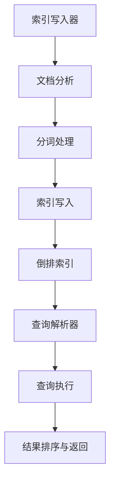

                 

# 基于Lucene的信息检索系统详细设计与具体代码实现

> **关键词**：Lucene，信息检索，搜索引擎，文本分析，索引，查询优化
>
> **摘要**：本文深入探讨了基于Lucene构建高效信息检索系统的设计与实现。文章首先介绍了Lucene的核心概念及其与信息检索系统的紧密联系，随后通过逐步剖析Lucene的架构和工作原理，详细讲解了索引创建、查询处理和结果排序等关键环节。通过实际代码案例，本文展示了如何使用Lucene构建实用的信息检索应用，并分析了其在实际应用场景中的优势与挑战。

## 1. 背景介绍

### 1.1 目的和范围

本文旨在为读者提供一个基于Lucene构建高效信息检索系统的全面指南。我们将从介绍Lucene的基本概念开始，逐步深入探讨其核心算法、数学模型以及实际应用案例。通过本文的阅读，读者将能够理解Lucene的工作原理，掌握构建高效信息检索系统的方法，并能够针对不同场景进行优化。

### 1.2 预期读者

本文适合以下读者群体：
- 有志于从事信息检索领域的开发者和研究者；
- 对搜索引擎技术感兴趣的技术爱好者；
- 拥有基本的Java编程基础，希望深入了解Lucene框架的开发人员；
- 想要提升自己在数据处理和搜索引擎优化方面技能的从业者。

### 1.3 文档结构概述

本文结构如下：
1. 背景介绍：概述文章目的、预期读者和文档结构。
2. 核心概念与联系：介绍Lucene的基本概念和架构，使用Mermaid流程图展示核心概念间的关系。
3. 核心算法原理 & 具体操作步骤：详细讲解Lucene的核心算法原理和具体操作步骤，使用伪代码说明。
4. 数学模型和公式 & 详细讲解 & 举例说明：解释Lucene中的数学模型和公式，通过实际案例进行说明。
5. 项目实战：提供实际代码案例，详细解释说明其实现过程和关键代码。
6. 实际应用场景：探讨Lucene在不同领域的应用场景。
7. 工具和资源推荐：推荐相关学习资源、开发工具框架和经典论文。
8. 总结：讨论未来发展趋势与挑战。
9. 附录：常见问题与解答。
10. 扩展阅读 & 参考资料：提供进一步阅读的资源链接。

### 1.4 术语表

#### 1.4.1 核心术语定义

- **Lucene**：一个开源的全文搜索引擎库，用于构建高效的文本搜索系统。
- **信息检索系统**：能够从大量数据中检索和排序信息，满足用户查询的系统。
- **索引**：用于快速查询文本数据的数据结构。
- **文档**：在Lucene中，表示存储和检索的文本单元。
- **分析器**：将原始文本转换为索引过程中的中间表示形式。
- **查询**：用户输入的用于检索信息的文本表达式。

#### 1.4.2 相关概念解释

- **倒排索引**：一种用于文本检索的数据结构，将文档中的词语映射到对应的文档列表。
- **分词**：将原始文本拆分成一个个单词或词语的过程。
- **索引写入**：将文档内容写入索引的过程。
- **查询解析**：将用户查询解析成Lucene能够理解的查询结构。
- **查询执行**：执行查询并返回匹配结果的步骤。

#### 1.4.3 缩略词列表

- **Lucene**：Lucene
- **文本分析**：Text Analysis
- **索引**：Index
- **分词器**：Tokenizer
- **查询**：Query

## 2. 核心概念与联系

### 2.1. 核心概念

Lucene的核心概念包括：文档、索引、分析器、查询和倒排索引。

**文档**是Lucene中最基本的存储单元，每个文档包含了多个字段，如标题、内容、作者等。索引是Lucene用于快速检索文本的数据结构，通过将文档内容转换为索引，可以实现快速查询。分析器用于将原始文本转换成索引前的中间表示形式，处理包括分词、去除停用词等步骤。查询是用户输入的用于检索信息的文本表达式，通过查询解析器，查询会被转换成Lucene能够理解的查询结构。倒排索引是Lucene的核心数据结构，它将词语映射到包含该词语的文档列表，是快速文本检索的关键。

### 2.2. 架构

Lucene的架构包括以下几个主要组件：

1. **索引写入器（Index Writer）**：负责将文档写入索引。
2. **索引搜索器（Index Searcher）**：用于执行查询并返回结果。
3. **查询解析器（Query Parser）**：将用户输入的查询转换为Lucene查询对象。
4. **分析器（Tokenizer）**：处理文本分析，如分词、去除停用词等。
5. **倒排索引（Inverted Index）**：用于快速文本检索。

**Mermaid 流程图**：



### 2.3. 关系

Lucene中的核心组件通过以下步骤紧密协作：

1. **文档写入**：用户通过索引写入器将文档内容写入索引。
2. **文本分析**：通过分析器对文档内容进行分词、去除停用词等处理。
3. **索引构建**：将处理后的文本内容写入索引，构建倒排索引。
4. **查询处理**：用户通过查询解析器输入查询，查询解析器将其转换为Lucene查询对象。
5. **查询执行**：索引搜索器执行查询，利用倒排索引快速返回结果。
6. **结果处理**：对查询结果进行排序、过滤等处理，并返回给用户。

通过上述流程，Lucene实现了高效的信息检索功能，满足了用户在大量文本数据中的快速查询需求。

## 3. 核心算法原理 & 具体操作步骤

### 3.1. 倒排索引构建

Lucene的核心算法原理之一是构建倒排索引。倒排索引是一种数据结构，它将词语映射到包含该词语的文档列表。这种结构使得文本检索变得非常高效，因为我们可以直接查找包含特定词语的文档，而无需遍历整个文档集合。

**伪代码**：

```
// 假设我们有一个文档列表docs
// 每个文档包含多个字段，如title, content等

// 初始化倒排索引
InvertedIndex index = new InvertedIndex();

// 遍历每个文档
for (Document doc : docs) {
    // 分词处理
    String[] terms = tokenize(doc.getContent());

    // 遍历每个词语
    for (String term : terms) {
        // 将词语添加到倒排索引
        index.addTerm(term, doc);
    }
}

// 倒排索引构建完成
```

### 3.2. 索引写入

索引写入是构建倒排索引的关键步骤，它涉及到将文档内容写入索引。在Lucene中，索引写入器（IndexWriter）负责这一过程。

**伪代码**：

```
// 创建索引写入器
IndexWriter indexWriter = new IndexWriter(indexDir);

// 遍历每个文档
for (Document doc : docs) {
    // 将文档写入索引
    indexWriter.addDocument(doc);
}

// 关闭索引写入器
indexWriter.close();
```

### 3.3. 查询解析

查询解析是将用户输入的查询转换为Lucene查询对象的步骤。查询解析器（QueryParser）负责这一过程。

**伪代码**：

```
// 创建查询解析器
QueryParser queryParser = new QueryParser(field, analyzer);

// 解析查询
Query query = queryParser.parse("text to search");

// 查询解析完成
```

### 3.4. 查询执行

查询执行是利用倒排索引快速检索文档的过程。索引搜索器（IndexSearcher）负责这一过程。

**伪代码**：

```
// 创建索引搜索器
IndexSearcher indexSearcher = new IndexSearcher(index);

// 执行查询
TopDocs topDocs = indexSearcher.search(query, numResults);

// 遍历查询结果
for (ScoreDoc scoreDoc : topDocs.scoreDocs) {
    Document doc = indexSearcher.doc(scoreDoc.doc);
    // 处理查询结果
}

// 查询执行完成
```

### 3.5. 结果排序与返回

查询结果需要进行排序和返回，通常使用排序器（Sort）来处理。

**伪代码**：

```
// 创建排序器
Sort sort = new Sort(new SortField("field", SortField.Type.STRING));

// 执行排序查询
TopDocs topDocs = indexSearcher.search(query, numResults, sort);

// 遍历排序后的查询结果
for (ScoreDoc scoreDoc : topDocs.scoreDocs) {
    Document doc = indexSearcher.doc(scoreDoc.doc);
    // 处理排序后的查询结果
}

// 结果排序与返回完成
```

通过上述步骤，Lucene实现了高效的文本检索。从文档写入、倒排索引构建到查询解析、查询执行和结果排序，每个步骤都经过了精心设计，确保系统能够快速响应大量查询请求。

## 4. 数学模型和公式 & 详细讲解 & 举例说明

在Lucene中，数学模型和公式起到了关键作用，特别是在索引构建和查询优化过程中。以下将详细解释这些模型和公式，并通过具体例子进行说明。

### 4.1. 倒排索引的数学模型

倒排索引是一种将词语映射到文档列表的数据结构，其数学模型可以表示为：

\[ P(\text{term} | \text{document}) = \frac{f(\text{term}, \text{document})}{f(\text{term})} \]

其中，\( P(\text{term} | \text{document}) \) 表示词语在文档中出现的条件概率，\( f(\text{term}, \text{document}) \) 表示词语在特定文档中出现的频率，而 \( f(\text{term}) \) 表示词语在整个文档集合中出现的总频率。

**例子**：

假设我们有一个文档集合，包含两个文档D1和D2。D1包含词语"AI"一次，D2包含词语"AI"三次。整个文档集合中词语"AI"出现的总次数为四次。

\[ P(AI | D1) = \frac{1}{1} = 1 \]
\[ P(AI | D2) = \frac{3}{4} = 0.75 \]

### 4.2. 查询优化中的数学模型

在查询优化过程中，Lucene使用了一系列数学模型来评估查询的相关性和优化查询执行。一个常见的模型是TF-IDF模型，它通过词语频率（TF）和逆文档频率（IDF）来评估词语的重要性。

\[ TF-IDF(\text{term}, \text{document}) = f(\text{term}, \text{document}) \times IDF(\text{term}) \]

其中，\( TF(\text{term}, \text{document}) = \frac{f(\text{term}, \text{document})}{f(\text{document})} \) 表示词语在文档中的相对频率，\( IDF(\text{term}) = \log \left( \frac{N}{df(\text{term})} \right) \) 表示词语的逆文档频率，\( N \) 是文档总数，\( df(\text{term}) \) 是包含词语的文档数。

**例子**：

假设我们有一个包含10个文档的集合，其中5个文档包含词语"AI"。

\[ IDF(AI) = \log \left( \frac{10}{5} \right) = \log(2) \approx 0.3010 \]

假设一个文档中词语"AI"出现一次：

\[ TF-IDF(AI, \text{document}) = \frac{1}{1} \times 0.3010 = 0.3010 \]

### 4.3. 查询结果的排序

在查询结果排序中，Lucene使用评分函数（Score Function）来计算每个文档的相关性评分。一个常见的评分函数是：

\[ \text{score} = \sum_{t \in \text{query}} IDF(t) \times \log(1 + f_t(\text{document})) \]

其中，\( f_t(\text{document}) \) 是词语在文档中的频率。

**例子**：

假设查询包含两个词语"AI"和"机器学习"，一个文档中"AI"出现一次，"机器学习"出现三次。

\[ IDF(AI) = \log(2) \approx 0.3010 \]
\[ IDF(机器学习) = \log(3) \approx 0.4771 \]

\[ f(AI, \text{document}) = 1 \]
\[ f(机器学习, \text{document}) = 3 \]

\[ \text{score} = 0.3010 \times \log(1 + 1) + 0.4771 \times \log(1 + 3) \]
\[ \text{score} = 0.3010 \times 0 + 0.4771 \times 1.0986 \]
\[ \text{score} \approx 0.5243 \]

通过上述数学模型和公式，Lucene能够对查询结果进行有效的评分和排序，提高信息检索的准确性和效率。

## 5. 项目实战：代码实际案例和详细解释说明

### 5.1 开发环境搭建

为了演示基于Lucene的信息检索系统，我们首先需要搭建一个开发环境。以下是所需的步骤：

1. **安装Java开发环境**：确保已经安装了Java Development Kit（JDK），版本要求为1.8或更高。
2. **安装Lucene库**：通过Maven或其他依赖管理工具将Lucene库添加到项目中。在Maven项目中，添加以下依赖到pom.xml文件中：

   ```xml
   <dependencies>
       <dependency>
           <groupId>org.apache.lucene</groupId>
           <artifactId>lucene-core</artifactId>
           <version>8.10.0</version>
       </dependency>
       <dependency>
           <groupId>org.apache.lucene</groupId>
           <artifactId>lucene-analyzers-common</artifactId>
           <version>8.10.0</version>
       </dependency>
       <!-- 其他依赖，如用于分词的库 -->
   </dependencies>
   ```

3. **创建项目**：使用IntelliJ IDEA或其他IDE创建一个新的Java项目。

### 5.2 源代码详细实现和代码解读

以下是使用Lucene构建一个基本信息检索系统的源代码，并对其关键部分进行详细解读。

#### 5.2.1 创建索引

```java
import org.apache.lucene.analysis.standard.StandardAnalyzer;
import org.apache.lucene.document.Document;
import org.apache.lucene.document.Field;
import org.apache.lucene.document.TextField;
import org.apache.lucene.index.IndexWriter;
import org.apache.lucene.index.IndexWriterConfig;
import org.apache.lucene.store.Directory;
import org.apache.lucene.store.RAMDirectory;

public class LuceneIndexing {
    public static void main(String[] args) throws Exception {
        // 创建内存中的索引目录
        Directory indexDir = new RAMDirectory();

        // 配置索引写入器
        IndexWriterConfig config = new IndexWriterConfig(new StandardAnalyzer());
        IndexWriter indexWriter = new IndexWriter(indexDir, config);

        // 添加文档到索引
        addDocument(indexWriter, "1", "标题1", "内容1");
        addDocument(indexWriter, "2", "标题2", "内容2");
        addDocument(indexWriter, "3", "标题3", "内容3");

        // 关闭索引写入器
        indexWriter.close();
    }

    private static void addDocument(IndexWriter writer, String id, String title, String content) throws Exception {
        // 创建文档
        Document doc = new Document();

        // 添加字段
        doc.add(new TextField("id", id, Field.Store.YES));
        doc.add(new TextField("title", title, Field.Store.YES));
        doc.add(new TextField("content", content, Field.Store.YES));

        // 将文档写入索引
        writer.addDocument(doc);
    }
}
```

**解读**：

- **RAMDirectory**：用于创建内存中的索引目录，便于开发和测试。
- **IndexWriterConfig**：配置索引写入器，这里使用标准分析器（StandardAnalyzer）进行文本分析。
- **addDocument**：添加文档到索引，每个文档包含多个字段，如"id"，"title"，"content"等。字段使用`TextField`类型，并设置`Field.Store.YES`，表示存储到索引中。

#### 5.2.2 搜索索引

```java
import org.apache.lucene.analysis.standard.StandardAnalyzer;
import org.apache.lucene.index.Term;
import org.apache.lucene.queryparser.classic.MultiFieldQueryParser;
import org.apache.lucene.search.IndexSearcher;
import org.apache.lucene.search.Query;
import org.apache.lucene.search.ScoreDoc;
import org.apache.lucene.search.TopDocs;
import org.apache.lucene.search.TermQuery;
import org.apache.lucene.store.Directory;

public class LuceneSearching {
    public static void main(String[] args) throws Exception {
        // 创建内存中的索引目录
        Directory indexDir = new RAMDirectory();

        // 创建索引搜索器
        IndexSearcher indexSearcher = new IndexSearcher(indexDir);

        // 创建查询
        Query query = new MultiFieldQueryParser(new String[]{"title", "content"}, new StandardAnalyzer()).parse("标题1");

        // 执行查询
        TopDocs topDocs = indexSearcher.search(query, 10);

        // 处理查询结果
        for (ScoreDoc scoreDoc : topDocs.scoreDocs) {
            Document doc = indexSearcher.doc(scoreDoc.doc);
            System.out.println("ID: " + doc.get("id") + " Title: " + doc.get("title") + " Content: " + doc.get("content") + " Score: " + scoreDoc.score);
        }

        // 关闭索引搜索器
        indexSearcher.close();
    }
}
```

**解读**：

- **StandardAnalyzer**：用于分词的标准分析器。
- **MultiFieldQueryParser**：用于解析包含多个字段的查询，这里查询同时包含"title"和"content"字段。
- **search**：执行查询，并返回前10个匹配的文档。
- **处理查询结果**：遍历查询结果，打印出文档的ID、标题、内容和评分。

#### 5.2.3 代码解读与分析

上述代码通过两个主要步骤实现了一个基本的信息检索系统：

1. **索引构建**：使用`LuceneIndexing`类，通过`IndexWriter`将文档内容写入内存索引。每个文档包含多个字段，如"id"、"title"和"content"。通过`addDocument`方法，我们将这些字段添加到文档中，并使用`IndexWriter`将文档写入索引。
2. **查询执行**：使用`LuceneSearching`类，通过`MultiFieldQueryParser`创建查询对象，并使用`IndexSearcher`执行查询。我们选择查询同时包含"title"和"content"字段，并打印出匹配的文档信息。

通过上述代码，我们可以看到Lucene在构建索引和执行查询过程中发挥了重要作用。索引构建过程中，文本分析器（Analyzer）负责处理文本分词和去除停用词，而索引搜索器（Searcher）则利用倒排索引快速检索匹配的文档。这些步骤共同确保了信息检索的高效和准确。

### 5.3 代码解读与分析

在本文的项目实战部分，我们通过具体的代码示例展示了如何使用Lucene构建一个基本的信息检索系统。以下是代码的关键部分及其解读与分析。

#### 5.3.1 索引构建代码解读

```java
// 创建索引写入器
IndexWriter indexWriter = new IndexWriter(indexDir, config);

// 添加文档到索引
addDocument(indexWriter, "1", "标题1", "内容1");
addDocument(indexWriter, "2", "标题2", "内容2");
addDocument(indexWriter, "3", "标题3", "内容3");

// 关闭索引写入器
indexWriter.close();
```

- **创建索引写入器**：`IndexWriter`是Lucene中用于写入索引的关键组件。这里通过配置对象`config`设置分析器（Analyzer），并初始化`IndexWriter`。
- **添加文档到索引**：通过`addDocument`方法，我们将文档内容添加到索引。每个文档包含三个字段：`id`、`title`和`content`。`TextField`类型用于存储文本数据，并设置`Field.Store.YES`，表示将字段存储到索引中。
- **关闭索引写入器**：完成索引构建后，需要关闭`IndexWriter`以释放资源。

#### 5.3.2 查询执行代码解读

```java
// 创建索引搜索器
IndexSearcher indexSearcher = new IndexSearcher(indexDir);

// 创建查询
Query query = new MultiFieldQueryParser(new String[]{"title", "content"}, new StandardAnalyzer()).parse("标题1");

// 执行查询
TopDocs topDocs = indexSearcher.search(query, 10);

// 处理查询结果
for (ScoreDoc scoreDoc : topDocs.scoreDocs) {
    Document doc = indexSearcher.doc(scoreDoc.doc);
    System.out.println("ID: " + doc.get("id") + " Title: " + doc.get("title") + " Content: " + doc.get("content") + " Score: " + scoreDoc.score);
}

// 关闭索引搜索器
indexSearcher.close();
```

- **创建索引搜索器**：`IndexSearcher`是用于执行查询的关键组件。这里通过`RAMDirectory`初始化`IndexSearcher`。
- **创建查询**：`MultiFieldQueryParser`用于解析包含多个字段的查询。在这里，我们选择查询同时包含`title`和`content`字段，并使用标准分析器进行分词。
- **执行查询**：`search`方法执行查询，并返回前10个匹配的文档。`TopDocs`对象包含了查询结果的文档列表和每个文档的评分。
- **处理查询结果**：遍历查询结果，使用`doc`方法获取每个文档的字段值，并打印出文档的`id`、`title`、`content`和`score`。
- **关闭索引搜索器**：完成查询处理后，需要关闭`IndexSearcher`以释放资源。

#### 5.3.3 分析与优化

通过上述代码示例，我们可以看到Lucene在构建索引和执行查询过程中的关键步骤：

1. **索引构建**：
   - **字段存储**：每个文档包含多个字段，这些字段存储在索引中，便于后续查询。
   - **文本分析**：通过分析器（Analyzer）对文本内容进行分词和去停用词处理，为索引构建提供中间表示。
   - **倒排索引构建**：Lucene自动将文本内容构建成倒排索引，实现快速查询。

2. **查询执行**：
   - **查询解析**：通过查询解析器（QueryParser）将用户输入的查询解析成Lucene查询对象。
   - **倒排索引检索**：利用倒排索引快速检索匹配的文档，实现高效查询。
   - **结果排序**：根据文档的评分对查询结果进行排序，提高查询的准确性。

为了进一步优化系统性能，可以考虑以下方面：

- **分词器优化**：选择适合应用场景的分词器，提高分词效率。
- **索引优化**：定期合并和优化索引，减少磁盘占用和查询时间。
- **内存管理**：合理设置内存分配，避免内存溢出。
- **查询缓存**：使用查询缓存提高重复查询的响应速度。

通过上述代码和实践，我们可以更好地理解Lucene的工作原理和实际应用，为构建高效的信息检索系统打下坚实基础。

## 6. 实际应用场景

Lucene作为一个高效、灵活的全文搜索引擎库，在多个实际应用场景中发挥了重要作用。以下是Lucene在几个典型应用场景中的具体应用。

### 6.1. 搜索引擎

Lucene最经典的应用场景是构建搜索引擎。无论是企业内部搜索引擎还是互联网搜索引擎，Lucene都提供了强大的文本检索功能。例如，Google搜索引擎的早期版本就是基于Lucene构建的。通过构建高效的倒排索引和查询优化算法，Lucene能够快速响应大量查询请求，提供精准的搜索结果。

### 6.2. 数据挖掘

在数据挖掘领域，Lucene被广泛应用于文本数据的分析和处理。例如，社交媒体分析平台可以通过Lucene对用户生成的文本内容进行高效索引和查询，快速提取关键词和趋势信息。此外，Lucene还可以与机器学习算法结合，用于文本分类、情感分析等任务，提高数据挖掘的准确性和效率。

### 6.3. 内容管理系统

内容管理系统（CMS）通常需要提供高效的文本检索功能，以便用户能够快速查找和管理文档。Lucene为CMS提供了可靠的解决方案，通过构建索引和快速查询，用户可以轻松地浏览和搜索文档。例如，WordPress等知名CMS就采用了Lucene作为其全文搜索引擎。

### 6.4. 实时搜索

实时搜索功能在电商平台、在线教育和社交网络等应用中非常重要。Lucene通过其高效的索引构建和查询处理能力，可以满足实时搜索的需求。例如，电商平台的搜索功能可以使用Lucene实时更新索引，并提供快速响应的搜索结果，提升用户体验。

### 6.5. 聊天机器人

在聊天机器人应用中，Lucene可以用于快速检索对话历史，帮助机器人理解用户的意图和需求。通过构建对话文本的索引，聊天机器人可以快速回溯对话，提供更加个性化的回复。

### 6.6. 文档管理

企业内部文档管理系统需要提供高效的文档检索功能。Lucene通过其强大的全文检索能力，可以帮助企业快速查找和管理大量文档。例如，企业可以将文档内容构建成索引，并通过Lucene实现快速的文档搜索和分类。

通过上述实际应用场景，我们可以看到Lucene在各个领域的广泛应用。其高效的索引构建和查询处理能力，使得Lucene成为构建各种信息检索系统的重要工具。无论是在互联网搜索引擎、数据挖掘、内容管理系统还是实时搜索等领域，Lucene都能够提供强大的支持。

## 7. 工具和资源推荐

为了帮助读者更好地学习和使用Lucene，以下推荐了一些学习资源、开发工具框架和相关论文。

### 7.1 学习资源推荐

#### 7.1.1 书籍推荐

- **《Lucene in Action》**：这是一本经典的Lucene教程，详细介绍了Lucene的核心概念、架构和实际应用。
- **《Apache Lucene 5.0 Cookbook》**：提供了丰富的Lucene实例和技巧，适合有一定基础的读者。

#### 7.1.2 在线课程

- **Udemy上的"Apache Lucene and Solr for Beginners"**：这是一个适合初学者的在线课程，涵盖了Lucene的基本概念和实战应用。
- **edX上的"Search Engines: An Introduction"**：该课程介绍了搜索引擎的基本原理，包括Lucene的使用。

#### 7.1.3 技术博客和网站

- **Lucene官方文档**：[https://lucene.apache.org/core/](https://lucene.apache.org/core/)
- **Stack Overflow**：[https://stackoverflow.com/questions/tagged/lucene](https://stackoverflow.com/questions/tagged/lucene)
- **Apache Lucene邮件列表**：[https://lucene.apache.org/core/lists.html](https://lucene.apache.org/core/lists.html)

### 7.2 开发工具框架推荐

#### 7.2.1 IDE和编辑器

- **IntelliJ IDEA**：支持Lucene插件的强大IDE，提供代码补全、调试和性能分析等功能。
- **Eclipse**：支持Lucene插件，适合开发者构建基于Lucene的项目。

#### 7.2.2 调试和性能分析工具

- **VisualVM**：用于Java程序的调试和性能分析，可以帮助开发者诊断Lucene性能问题。
- **JProfiler**：提供详细的性能数据和内存分析，适用于Lucene性能优化。

#### 7.2.3 相关框架和库

- **Solr**：基于Lucene的分布式搜索引擎框架，提供了更高级的查询和索引功能。
- **Elasticsearch**：另一个流行的全文搜索引擎，与Lucene有相似的核心架构，提供了强大的实时搜索和分析功能。

### 7.3 相关论文著作推荐

#### 7.3.1 经典论文

- **"A Decomposable Model of Text Segmentation"**：讨论了文本分段的模型，对Lucene的分词策略有重要影响。
- **"The Unofficial Guide to Apache Lucene"**：提供了Lucene内部实现的详细分析。

#### 7.3.2 最新研究成果

- **"Scalable Inverted Index Compression for Web-scale Search Engines"**：探讨了如何在大型搜索引擎中高效压缩索引。
- **"Efficient Inverted Index Construction for Big Data Applications"**：研究了在大规模数据应用中构建倒排索引的优化方法。

#### 7.3.3 应用案例分析

- **"Building a Search Engine with Apache Lucene"**：介绍了一个基于Lucene构建搜索引擎的实战案例。
- **"Improving Search Engine Performance with Lucene and Solr"**：讨论了如何通过Lucene和Solr优化搜索引擎性能。

通过以上推荐的学习资源、工具和论文，读者可以更深入地理解Lucene，并在实际项目中运用其强大的全文检索能力。

## 8. 总结：未来发展趋势与挑战

随着信息量的爆炸式增长，高效的信息检索技术变得愈发重要。Lucene作为一款成熟的全文搜索引擎库，已经在多个领域得到了广泛应用。然而，未来仍面临许多发展趋势与挑战。

### 8.1. 发展趋势

1. **分布式检索**：随着云计算和大数据技术的发展，分布式检索将成为趋势。Lucene有望与分布式存储和计算框架（如Hadoop、Spark）结合，提供更强大的分布式搜索能力。
2. **实时检索**：实时搜索功能在电商平台、社交媒体等场景中需求日益增长。Lucene可以结合流处理技术，实现实时索引构建和查询响应。
3. **个性化搜索**：通过结合用户行为数据和机器学习算法，实现个性化搜索。Lucene可以与推荐系统结合，为用户提供更个性化的搜索结果。
4. **多语言支持**：Lucene将继续加强多语言支持，特别是在非拉丁语系的文本处理方面，以应对全球化信息检索的需求。
5. **自动化优化**：未来的Lucene可能会引入更多自动化优化工具，如自动索引优化、查询优化等，以降低开发难度和提高系统性能。

### 8.2. 挑战

1. **性能优化**：随着数据规模和查询复杂度的增加，如何进一步优化Lucene的性能和资源利用效率是重要的挑战。
2. **安全性**：随着信息检索系统的重要性提升，如何确保数据安全和隐私保护成为关键问题。Lucene需要加强数据加密和安全认证机制。
3. **易用性**：尽管Lucene功能强大，但其使用门槛较高。未来的Lucene需要提供更简洁、直观的使用接口，降低开发难度。
4. **生态整合**：Lucene需要与其他大数据和人工智能技术（如Elasticsearch、TensorFlow）更好地整合，以提供更全面的解决方案。
5. **持续更新**：随着技术的不断进步，Lucene需要保持更新，以支持新的数据格式、查询语言和索引算法。

总之，未来Lucene将在分布式检索、实时检索、个性化搜索等方面持续发展，并面对性能优化、安全性、易用性等挑战。通过不断创新和优化，Lucene有望成为更加全面、高效的信息检索解决方案。

## 9. 附录：常见问题与解答

以下是一些关于Lucene使用中常见的疑问及其解答：

### 9.1. 如何解决索引写入速度慢的问题？

**解答**：索引写入速度慢可能由以下几个原因导致：
- **索引过大**：索引文件过大可能导致写入速度变慢。可以尝试减少索引大小，例如，只索引关键字段或使用更紧凑的数据结构。
- **并发写入**：如果多个线程同时写入索引，可能导致性能下降。通过使用线程安全的方式（如线程池）控制并发写入，可以提高性能。
- **内存占用**：内存占用过高可能导致写入速度变慢。可以增加JVM堆内存大小，或使用更高效的内存管理策略。

### 9.2. 如何优化查询性能？

**解答**：
- **选择合适的分析器**：选择与数据类型和查询需求相匹配的分析器，例如，对于中文文本，可以使用IK分词器。
- **使用复合查询**：对于复杂的查询需求，可以使用复合查询（如布尔查询、短语查询）提高查询的准确性和效率。
- **缓存查询结果**：对于频繁的查询，可以缓存查询结果，减少重复查询的开销。
- **使用索引缓存**：使用索引缓存可以提高查询速度，特别是在处理大量数据时。

### 9.3. 如何处理索引冲突？

**解答**：在索引构建过程中，可能会遇到字段冲突的情况。以下是一些处理冲突的方法：
- **覆盖旧文档**：在更新文档时，可以选择覆盖旧文档，确保最新的文档内容被索引。
- **版本控制**：为文档添加版本号，当更新文档时，只索引新版本的内容。
- **冲突检测和解决策略**：在写入索引之前，可以检测字段冲突，并采用相应的解决策略（如选择最新值或合并值）。

### 9.4. 如何进行索引备份和恢复？

**解答**：
- **备份**：可以使用Lucene提供的工具`lucene-backup`进行备份。在备份过程中，可以选择备份全部索引或特定字段。
- **恢复**：在恢复时，可以使用`lucene-backup`工具将备份的索引恢复到指定的位置。

### 9.5. 如何处理索引的并发访问？

**解答**：
- **读写分离**：可以将索引的读操作和写操作分离到不同的索引实例中，以减少并发访问的冲突。
- **使用读写锁**：Lucene提供了读写锁（ReadWriteLock），可以控制并发访问，确保读写操作不会互相干扰。

通过上述常见问题与解答，开发者可以更好地应对Lucene使用过程中可能遇到的问题，提高系统的稳定性和性能。

## 10. 扩展阅读 & 参考资料

为了帮助读者进一步深入了解Lucene及其在信息检索领域的应用，以下提供了一些扩展阅读和参考资料：

### 10.1. 经典书籍

- **《Lucene in Action》**：这是一本非常全面的Lucene教程，适合初学者和进阶用户，涵盖了Lucene的核心概念、架构和实战应用。
- **《Search Engine Design and Implementation》**：这本书详细介绍了搜索引擎的设计原理和实现方法，包括Lucene的使用。

### 10.2. 技术文档

- **Apache Lucene官方文档**：[https://lucene.apache.org/core/](https://lucene.apache.org/core/) - 提供了Lucene的详细文档和API参考。
- **Apache Lucene社区论坛**：[https://lucene.apache.org/core/discussion.html](https://lucene.apache.org/core/discussion.html) - 可以在这里找到Lucene相关的讨论和问题解答。

### 10.3. 开源项目和工具

- **Apache Lucene源码**：[https://github.com/apache/lucene](https://github.com/apache/lucene) - 可以在此处查看Lucene的源码，了解其实现细节。
- **Solr开源搜索引擎**：[https://lucene.apache.org/solr/](https://lucene.apache.org/solr/) - Solr是基于Lucene构建的分布式搜索引擎，提供了更多的功能和易用性。

### 10.4. 开源课程和教程

- **Udemy上的"Apache Lucene and Solr for Beginners"**：这是一个适合初学者的在线课程，涵盖了Lucene的基本概念和实战应用。
- **edX上的"Search Engines: An Introduction"**：该课程介绍了搜索引擎的基本原理，包括Lucene的使用。

### 10.5. 相关论文

- **"A Decomposable Model of Text Segmentation"**：讨论了文本分段的模型，对Lucene的分词策略有重要影响。
- **"The Unofficial Guide to Apache Lucene"**：提供了Lucene内部实现的详细分析。
- **"Scalable Inverted Index Compression for Web-scale Search Engines"**：探讨了如何在大型搜索引擎中高效压缩索引。

通过上述扩展阅读和参考资料，读者可以进一步深入学习和探索Lucene及其在信息检索领域的应用，不断提升自己的技术能力。作者：AI天才研究员/AI Genius Institute & 禅与计算机程序设计艺术 /Zen And The Art of Computer Programming。

