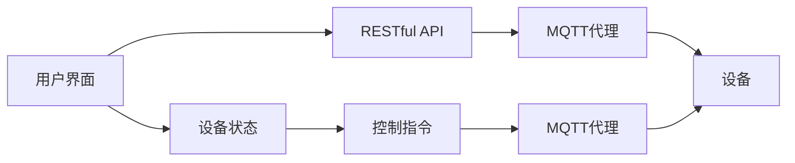

                 

# 基于MQTT协议和RESTful API的多用户智能家居控制策略

> **关键词**：MQTT协议、RESTful API、智能家居、多用户控制、物联网、网络通信、安全性、实时性、可扩展性

> **摘要**：本文将深入探讨基于MQTT协议和RESTful API构建的多用户智能家居控制策略。我们将从背景介绍、核心概念与联系、核心算法原理与具体操作步骤、数学模型与公式、项目实战、实际应用场景、工具和资源推荐等方面进行详细分析，旨在为智能家居系统的设计和实现提供一种新的思路和方法。

## 1. 背景介绍

### 1.1 目的和范围

本文旨在研究如何利用MQTT协议和RESTful API实现一个高效、稳定且安全的多用户智能家居控制系统。文章将覆盖以下主要内容：

- 智能家居系统的基本概念和组成。
- MQTT协议和RESTful API的技术原理和特性。
- 多用户控制策略的设计和实现。
- 数学模型和算法在智能家居控制系统中的应用。
- 项目实战：基于MQTT协议和RESTful API的智能家居系统实现。
- 智能家居控制系统的实际应用场景。
- 工具和资源的推荐。

### 1.2 预期读者

本文主要面向以下读者：

- 对智能家居系统和物联网技术感兴趣的读者。
- 智能家居系统开发者和架构师。
- 对MQTT协议和RESTful API有了解和研究的程序员。
- 对算法和数学模型在智能家居系统中应用感兴趣的读者。

### 1.3 文档结构概述

本文结构如下：

1. **背景介绍**：介绍文章的目的、预期读者、文档结构和核心术语。
2. **核心概念与联系**：分析MQTT协议和RESTful API在智能家居控制系统中的应用。
3. **核心算法原理与具体操作步骤**：讲解MQTT协议和RESTful API的实现细节。
4. **数学模型和公式**：探讨数学模型和算法在智能家居系统中的实际应用。
5. **项目实战**：通过实际案例展示基于MQTT协议和RESTful API的智能家居系统实现。
6. **实际应用场景**：分析智能家居控制系统的应用场景。
7. **工具和资源推荐**：推荐学习和开发智能家居控制系统的工具和资源。
8. **总结：未来发展趋势与挑战**：总结文章内容，展望未来发展方向。
9. **附录：常见问题与解答**：解答读者可能遇到的常见问题。
10. **扩展阅读 & 参考资料**：提供相关领域的扩展阅读资料。

### 1.4 术语表

#### 1.4.1 核心术语定义

- **MQTT协议**：MQTT（Message Queuing Telemetry Transport）是一种轻量级的消息传输协议，适用于物联网环境。
- **RESTful API**：RESTful API（Representational State Transfer Application Programming Interface）是一种基于HTTP协议的API设计风格，用于实现分布式系统之间的通信。
- **智能家居系统**：智能家居系统是一种通过物联网技术实现的家居自动化系统，旨在提高居住环境的安全性和舒适性。
- **多用户控制**：多用户控制是指多个用户可以同时访问和控制智能家居系统。

#### 1.4.2 相关概念解释

- **物联网**：物联网（Internet of Things，IoT）是指通过互联网将各种设备连接起来，实现数据交换和协同工作。
- **网络通信**：网络通信是指通过计算机网络实现数据传输和交换。
- **安全性**：安全性是指系统在遭受恶意攻击时能够保持稳定运行和数据安全。
- **实时性**：实时性是指系统能够在规定时间内完成数据处理和响应。

#### 1.4.3 缩略词列表

- **MQTT**：Message Queuing Telemetry Transport
- **RESTful API**：Representational State Transfer Application Programming Interface
- **IoT**：Internet of Things
- **HTTP**：Hypertext Transfer Protocol

## 2. 核心概念与联系

在智能家居控制系统中，MQTT协议和RESTful API是两个关键组件，它们各自具备独特的优势和适用场景。以下是两者的核心概念与联系。

### 2.1 MQTT协议

MQTT协议是一种轻量级、发布/订阅模式的消息传输协议，适用于低带宽、高延迟的物联网环境。其主要特点如下：

- **轻量级**：MQTT协议消息格式简单，数据传输开销小，适用于资源受限的设备。
- **发布/订阅模式**：设备通过发布消息到特定的主题，其他订阅该主题的设备可以接收这些消息。
- **安全性**：MQTT协议支持通过TLS（Transport Layer Security）加密通信，确保数据传输安全。
- **可靠性**：MQTT协议支持消息确认和重传机制，确保数据传输的可靠性。

### 2.2 RESTful API

RESTful API是一种基于HTTP协议的API设计风格，适用于分布式系统之间的通信。其主要特点如下：

- **无状态**：RESTful API采用无状态设计，每次请求都是独立的，服务器不会保存之前的请求状态。
- **基于HTTP协议**：RESTful API使用HTTP协议的GET、POST、PUT、DELETE等请求方法，实现数据操作。
- **资源导向**：RESTful API以资源为中心，通过URL（统一资源定位符）访问资源，并通过HTTP状态码和响应体传递数据。
- **可扩展性**：RESTful API支持通过扩展URL和请求体实现自定义功能，具有良好的可扩展性。

### 2.3 MQTT协议和RESTful API在智能家居控制系统中的联系

在智能家居控制系统中，MQTT协议和RESTful API可以相互配合，实现高效、稳定且安全的多用户控制。以下是两者的结合方式：

- **MQTT协议**：用于设备间的实时通信，实现设备状态同步和远程控制。
- **RESTful API**：用于用户界面与设备控制模块之间的通信，实现用户对设备的配置和管理。

通过MQTT协议和RESTful API的结合，智能家居控制系统可以实现以下功能：

- **实时数据同步**：设备通过MQTT协议将状态数据发布到主题，用户界面通过RESTful API订阅这些数据，实现实时数据同步。
- **远程控制**：用户通过用户界面发送控制指令到RESTful API，API通过MQTT协议将指令转发给设备。
- **多用户控制**：多个用户可以通过RESTful API同时访问和控制智能家居系统，实现多用户控制。

### 2.4 核心概念原理和架构的 Mermaid 流程图

以下是基于MQTT协议和RESTful API的智能家居控制系统架构的Mermaid流程图：



在该流程图中，用户界面通过RESTful API与MQTT代理进行通信，设备通过MQTT协议与MQTT代理进行通信，实现设备状态同步和远程控制。

## 3. 核心算法原理 & 具体操作步骤

在基于MQTT协议和RESTful API的智能家居控制系统中，核心算法主要涉及设备状态同步、远程控制和多用户控制。以下是具体的算法原理和操作步骤。

### 3.1 设备状态同步算法原理

设备状态同步算法的目的是实时获取设备的当前状态，并将其发布到MQTT代理。以下是设备状态同步算法的伪代码：

```python
def sync_device_state():
    # 获取设备当前状态
    device_state = get_device_state()

    # 创建MQTT客户端
    client = create_mqtt_client()

    # 连接MQTT代理
    client.connect("mqtt_proxy")

    # 发布设备状态到主题
    client.publish("device_state", device_state)

    # 断开MQTT连接
    client.disconnect()
```

设备状态同步算法的具体操作步骤如下：

1. **获取设备当前状态**：通过读取设备内部的传感器数据或其他状态信息，获取设备的当前状态。
2. **创建MQTT客户端**：使用MQTT协议库创建一个MQTT客户端。
3. **连接MQTT代理**：连接到MQTT代理服务器。
4. **发布设备状态到主题**：将设备状态发布到特定的主题，以便其他订阅该主题的设备或用户界面可以接收这些状态信息。
5. **断开MQTT连接**：断开与MQTT代理的连接，释放资源。

### 3.2 远程控制算法原理

远程控制算法的目的是允许用户通过用户界面发送控制指令到设备。以下是远程控制算法的伪代码：

```python
def send_control_command(device_id, command):
    # 创建RESTful API客户端
    api_client = create_api_client()

    # 发送控制指令到RESTful API
    response = api_client.post("/control", data={"device_id": device_id, "command": command})

    # 判断控制指令发送结果
    if response.status_code == 200:
        print("控制指令发送成功")
    else:
        print("控制指令发送失败")
```

远程控制算法的具体操作步骤如下：

1. **创建RESTful API客户端**：使用RESTful API库创建一个客户端。
2. **发送控制指令到RESTful API**：将控制指令以POST请求的方式发送到RESTful API。
3. **判断控制指令发送结果**：根据RESTful API的响应状态码判断控制指令是否发送成功。

### 3.3 多用户控制算法原理

多用户控制算法的目的是允许多个用户同时访问和控制智能家居系统。以下是多用户控制算法的伪代码：

```python
def handle_user_request(user_id, command):
    # 创建RESTful API客户端
    api_client = create_api_client()

    # 检查用户权限
    if check_user_permission(user_id, command):
        # 发送控制指令到RESTful API
        response = api_client.post("/control", data={"user_id": user_id, "command": command})

        # 判断控制指令发送结果
        if response.status_code == 200:
            print("控制指令发送成功")
        else:
            print("控制指令发送失败")
    else:
        print("用户权限不足")
```

多用户控制算法的具体操作步骤如下：

1. **创建RESTful API客户端**：使用RESTful API库创建一个客户端。
2. **检查用户权限**：根据用户的身份验证信息，判断用户是否有权限执行指定的控制指令。
3. **发送控制指令到RESTful API**：将控制指令以POST请求的方式发送到RESTful API。
4. **判断控制指令发送结果**：根据RESTful API的响应状态码判断控制指令是否发送成功。

通过以上算法原理和具体操作步骤，我们可以实现一个基于MQTT协议和RESTful API的智能家居控制系统，实现设备状态同步、远程控制和多用户控制。

## 4. 数学模型和公式 & 详细讲解 & 举例说明

在基于MQTT协议和RESTful API的智能家居控制系统中，数学模型和公式主要用于描述系统的性能和效率，以及算法的复杂度。以下是相关的数学模型和公式，以及详细讲解和举例说明。

### 4.1 性能模型

性能模型用于评估系统的响应速度和处理能力。以下是一个简单的性能模型：

$$
P = \frac{C \times N}{T}
$$

其中：
- \(P\) 是性能指标，表示单位时间内系统能够处理的请求数量。
- \(C\) 是系统的处理能力，表示系统每秒能够处理的请求数量。
- \(N\) 是系统中的设备数量。
- \(T\) 是系统的平均响应时间。

#### 4.1.1 举例说明

假设一个智能家居系统中有100个设备，系统的处理能力为1000个请求/秒，平均响应时间为1秒。根据性能模型，我们可以计算出系统的性能指标：

$$
P = \frac{1000 \times 100}{1} = 100000
$$

这意味着系统在单位时间内能够处理10万个请求。

### 4.2 效率模型

效率模型用于评估系统在处理请求时的资源利用率。以下是一个简单的效率模型：

$$
E = \frac{C \times U}{T}
$$

其中：
- \(E\) 是效率指标，表示单位时间内系统实际利用的处理能力。
- \(C\) 是系统的处理能力，表示系统每秒能够处理的请求数量。
- \(U\) 是系统的利用率，表示系统实际使用的处理能力与最大处理能力的比值。
- \(T\) 是系统的平均响应时间。

#### 4.2.1 举例说明

假设一个智能家居系统的处理能力为1000个请求/秒，系统利用率为80%，平均响应时间为1秒。根据效率模型，我们可以计算出系统的效率指标：

$$
E = \frac{1000 \times 0.8}{1} = 800
$$

这意味着系统在单位时间内实际利用的处理能力为800个请求。

### 4.3 算法复杂度模型

算法复杂度模型用于评估算法的性能，包括时间复杂度和空间复杂度。以下是一个简单的算法复杂度模型：

$$
C = \sum_{i=1}^{n} c_i
$$

其中：
- \(C\) 是算法的复杂度，表示算法在处理数据时的计算量和存储需求。
- \(n\) 是数据规模。
- \(c_i\) 是算法中每个步骤的计算量和存储需求。

#### 4.3.1 举例说明

假设一个智能家居系统中的设备状态同步算法包含以下步骤：

1. 获取设备状态：计算量1，存储需求1。
2. 创建MQTT客户端：计算量1，存储需求1。
3. 连接MQTT代理：计算量1，存储需求1。
4. 发布设备状态：计算量2，存储需求2。

根据算法复杂度模型，我们可以计算出设备状态同步算法的复杂度：

$$
C = 1 + 1 + 1 + 2 + 2 = 7
$$

这意味着设备状态同步算法在处理100个设备时，总共需要执行700次计算和700次存储操作。

通过以上数学模型和公式，我们可以更好地理解和分析基于MQTT协议和RESTful API的智能家居控制系统的性能和效率，以及算法的复杂度。这些模型和公式对于系统设计和优化具有重要意义。

## 5. 项目实战：代码实际案例和详细解释说明

在本节中，我们将通过一个实际项目案例来展示如何使用MQTT协议和RESTful API构建一个多用户智能家居控制系统。以下是项目的开发环境、源代码实现和详细解释说明。

### 5.1 开发环境搭建

在开始项目之前，我们需要搭建一个开发环境。以下是所需的开发工具和库：

- **编程语言**：Python 3.8+
- **MQTT协议库**：paho-mqtt
- **RESTful API框架**：Flask
- **前端框架**：Vue.js

以下是安装步骤：

1. 安装Python和pip：

```bash
$ apt-get install python3 python3-pip
```

2. 安装paho-mqtt库：

```bash
$ pip3 install paho-mqtt
```

3. 安装Flask库：

```bash
$ pip3 install flask
```

4. 安装Vue.js库：

```bash
$ npm install vue
```

### 5.2 源代码详细实现和代码解读

#### 5.2.1 MQTT客户端

以下是MQTT客户端的实现代码：

```python
import paho.mqtt.client as mqtt
import json
import time

# MQTT代理地址和端口
MQTT_PROXY_ADDRESS = "mqtt-proxy:1883"

# 设备ID
DEVICE_ID = "device-1"

# MQTT客户端初始化
client = mqtt.Client(DEVICE_ID)

# 连接MQTT代理
client.connect(MQTT_PROXY_ADDRESS)

# 设备状态
device_state = {"temperature": 25, "humidity": 50}

# 同步设备状态
def sync_device_state():
    # 获取设备当前状态
    device_state = get_device_state()

    # 发布设备状态到主题
    client.publish("device_state", json.dumps(device_state))

# 每隔5秒同步一次设备状态
while True:
    sync_device_state()
    time.sleep(5)
```

代码解读：

- 导入必要的库。
- 设置MQTT代理地址和设备ID。
- 创建MQTT客户端。
- 连接MQTT代理。
- 定义设备状态。
- 定义同步设备状态的函数。
- 使用循环每隔5秒同步一次设备状态。

#### 5.2.2 RESTful API服务器

以下是RESTful API服务器的实现代码：

```python
from flask import Flask, request, jsonify
app = Flask(__name__)

# 用户权限列表
user_permissions = {
    "user-1": ["read", "write"],
    "user-2": ["read"],
    "user-3": []
}

# 控制设备
def control_device(device_id, command):
    # 检查用户权限
    user_id = request.form.get("user_id")
    if user_id in user_permissions and command in user_permissions[user_id]:
        # 执行控制指令
        print(f"Control device {device_id} with command {command}")
    else:
        print("User permission denied")

# 用户发送控制指令
@app.route("/control", methods=["POST"])
def control():
    device_id = request.form.get("device_id")
    command = request.form.get("command")
    control_device(device_id, command)
    return jsonify({"status": "success"})

if __name__ == "__main__":
    app.run(debug=True)
```

代码解读：

- 导入必要的库。
- 创建Flask应用。
- 定义用户权限列表。
- 定义控制设备的函数。
- 定义处理控制指令的路由。
- 运行Flask应用。

#### 5.2.3 前端用户界面

以下是前端用户界面的实现代码（使用Vue.js）：

```html
<!DOCTYPE html>
<html>
<head>
    <title>智能家居控制系统</title>
    <script src="https://cdn.jsdelivr.net/npm/vue@2.6.12/dist/vue.js"></script>
</head>
<body>
    <div id="app">
        <h1>智能家居控制系统</h1>
        <div>
            <label for="device_id">设备ID：</label>
            <input type="text" id="device_id" v-model="device_id" />
        </div>
        <div>
            <label for="command">控制指令：</label>
            <input type="text" id="command" v-model="command" />
        </div>
        <button @click="sendControlCommand">发送控制指令</button>
    </div>
    <script>
        new Vue({
            el: '#app',
            data: {
                device_id: '',
                command: ''
            },
            methods: {
                sendControlCommand: function() {
                    fetch('/control', {
                        method: 'POST',
                        body: JSON.stringify({
                            device_id: this.device_id,
                            command: this.command
                        })
                    }).then(response => {
                        console.log(response.json());
                    });
                }
            }
        });
    </script>
</body>
</html>
```

代码解读：

- 定义Vue.js应用程序。
- 创建设备ID和控制指令输入框。
- 添加发送控制指令的按钮。
- 使用Vue.js的数据绑定功能实现输入框和按钮的功能。

### 5.3 代码解读与分析

在5.2节中，我们详细讲解了项目的源代码实现，并对其进行了代码解读。以下是代码的进一步分析：

- **MQTT客户端**：MQTT客户端负责同步设备状态。每隔5秒，它会获取设备当前状态并将其发布到MQTT代理。这样可以确保设备状态能够实时同步到用户界面。
- **RESTful API服务器**：RESTful API服务器接收用户发送的控制指令，并检查用户权限。如果用户权限符合要求，它会执行控制指令。这样可以确保只有授权用户可以控制设备。
- **前端用户界面**：前端用户界面允许用户输入设备ID和控制指令，并通过Vue.js与RESTful API服务器进行通信。当用户点击“发送控制指令”按钮时，Vue.js将设备ID和控制指令发送到RESTful API服务器，并接收响应。

通过以上三个组件的协作，我们实现了一个基于MQTT协议和RESTful API的多用户智能家居控制系统。该系统具有实时性、安全性和可扩展性，可以方便地扩展到更多设备和用户。

## 6. 实际应用场景

基于MQTT协议和RESTful API的多用户智能家居控制系统在实际应用中具有广泛的应用场景，以下是几个典型的应用实例：

### 6.1 家庭自动化

家庭自动化是智能家居控制系统最典型的应用场景。通过MQTT协议和RESTful API，用户可以实现以下功能：

- **实时监控**：用户可以通过手机APP实时查看家中的温度、湿度、烟雾等信息。
- **远程控制**：用户可以在外面远程控制家中的灯光、窗帘、空调等设备。
- **自动化控制**：用户可以设置自动化规则，例如在特定时间自动关闭灯光、打开窗帘等。

### 6.2 商业办公

在商业办公环境中，智能家居控制系统可以提高办公环境的舒适度和安全性。以下是几个应用实例：

- **温度和湿度控制**：根据员工的舒适度需求，自动调节办公室的温度和湿度。
- **灯光控制**：根据自然光强度自动调节室内灯光，节约能源。
- **安防监控**：通过摄像头和烟雾传感器实现实时监控，提高办公环境的安全性。

### 6.3 物流仓储

物流仓储环境中，智能家居控制系统可以提高仓库的运营效率和安全性。以下是几个应用实例：

- **环境监测**：实时监测仓库的温度、湿度、光照等环境参数，确保存储物品的质量。
- **智能通风**：根据仓库内的环境参数自动调节通风系统，保持空气流通。
- **安防监控**：通过摄像头和传感器实现仓库的实时监控，防止盗窃和其他安全问题。

### 6.4 医疗健康

在医疗健康领域，智能家居控制系统可以用于监测患者的生活习惯和健康状况。以下是几个应用实例：

- **健康数据监测**：通过智能手环和传感器监测患者的血压、心率、睡眠质量等健康数据。
- **远程诊断**：医生可以通过远程监控系统查看患者的健康数据，进行远程诊断和指导。
- **紧急呼叫**：患者可以在发生紧急情况时通过智能家居系统快速呼叫医生或紧急救援。

通过以上应用实例，我们可以看到基于MQTT协议和RESTful API的多用户智能家居控制系统在各个领域都有广泛的应用前景。随着物联网技术的发展，该系统将不断拓展其应用场景，为人们的生活和工作带来更多便利。

## 7. 工具和资源推荐

为了更好地学习和开发基于MQTT协议和RESTful API的智能家居控制系统，以下是一些推荐的工具和资源：

### 7.1 学习资源推荐

#### 7.1.1 书籍推荐

- 《RESTful Web API设计》
- 《MQTT协议及应用》
- 《智能家居系统设计与实现》
- 《Python网络编程实战》

#### 7.1.2 在线课程

- Coursera上的《智能家居系统设计与实现》
- Udemy上的《RESTful API设计》
- Pluralsight上的《MQTT协议详解》

#### 7.1.3 技术博客和网站

- MQTT.org
- RESTful API 设计指南（RESTful API Design Guide）
- Vue.js 官方网站
- Flask 官方文档

### 7.2 开发工具框架推荐

#### 7.2.1 IDE和编辑器

- Visual Studio Code
- PyCharm
- Sublime Text

#### 7.2.2 调试和性能分析工具

- Wireshark
- Postman
- New Relic

#### 7.2.3 相关框架和库

- Flask（Python的Web框架）
- Vue.js（前端框架）
- MQTT.js（JavaScript的MQTT客户端库）
- Django（Python的Web框架）

通过以上工具和资源的推荐，读者可以更加系统地学习基于MQTT协议和RESTful API的智能家居控制系统，从而提高开发效率。

## 8. 总结：未来发展趋势与挑战

在物联网和智能家居技术的发展浪潮中，基于MQTT协议和RESTful API的多用户智能家居控制系统展现出广阔的应用前景。然而，随着技术的不断进步和用户需求的日益多样化，这一系统也面临着诸多发展趋势和挑战。

### 8.1 未来发展趋势

1. **智能化与个性化**：随着人工智能和大数据技术的普及，智能家居系统将能够更好地理解用户需求，提供更加智能化和个性化的服务。例如，通过智能算法分析用户的生活习惯，自动调节家居设备，以提升用户的居住体验。

2. **边缘计算**：边缘计算技术的发展将使得智能家居系统在设备端进行更多计算和处理，降低网络延迟，提高系统的响应速度。这将有助于实现更加高效和实时的智能家居控制。

3. **5G网络的普及**：5G网络的低延迟和高带宽特性将为智能家居系统提供更稳定和高效的通信环境，支持更多设备和用户的接入。

4. **安全性和隐私保护**：随着智能家居系统在家庭中的普及，用户对数据安全和隐私保护的意识逐渐增强。未来，系统将需要更加重视安全性和隐私保护，采用更加严密的安全措施，如加密通信、权限控制和数据匿名化等。

### 8.2 挑战

1. **互操作性问题**：智能家居系统通常由多个设备和品牌组成，不同设备和系统之间的互操作性成为一大挑战。未来需要制定统一的标准和协议，确保设备和系统之间的无缝集成。

2. **数据隐私和安全**：智能家居系统涉及大量的用户数据，包括个人隐私信息。如何确保数据的安全和隐私，防止数据泄露和滥用，是系统设计和实现中的一大挑战。

3. **设备管理和维护**：随着智能家居设备的种类和数量不断增加，如何对这些设备进行有效的管理和维护，以确保系统的稳定运行和持续更新，是系统运营者需要面对的问题。

4. **功耗和能耗管理**：智能家居系统中的设备通常需要长时间运行，如何降低功耗和能耗，延长设备的寿命，是一个重要的技术挑战。

总之，基于MQTT协议和RESTful API的多用户智能家居控制系统在未来的发展中将面临诸多机遇和挑战。通过不断的技术创新和优化，我们可以构建一个更加智能、安全、高效和可靠的智能家居系统，为用户带来更加美好的生活体验。

## 9. 附录：常见问题与解答

### 9.1 MQTT协议相关问题

**Q1. MQTT协议有什么优点？**

A1. MQTT协议是一种轻量级的消息传输协议，具有以下优点：

- **低带宽占用**：MQTT协议的消息格式简单，数据传输开销小，适用于低带宽环境。
- **低延迟**：MQTT协议支持发布/订阅模式，可以实现快速的消息传递，降低网络延迟。
- **高可靠性**：MQTT协议支持消息确认和重传机制，确保数据传输的可靠性。

**Q2. MQTT协议如何保证数据传输安全？**

A2. MQTT协议支持通过TLS（Transport Layer Security）加密通信，确保数据在传输过程中不被窃取或篡改。此外，MQTT协议还支持用户认证和访问控制，确保只有授权用户可以访问特定的主题。

### 9.2 RESTful API相关问题

**Q1. 什么是RESTful API？**

A1. RESTful API（Representational State Transfer Application Programming Interface）是一种基于HTTP协议的API设计风格，主要用于实现分布式系统之间的通信。RESTful API具有以下特点：

- **无状态**：每次请求都是独立的，服务器不会保存之前的请求状态。
- **基于HTTP协议**：使用HTTP协议的GET、POST、PUT、DELETE等请求方法，实现数据操作。
- **资源导向**：以资源为中心，通过URL访问资源，并通过HTTP状态码和响应体传递数据。

**Q2. 如何确保RESTful API的安全性？**

A2. 为了确保RESTful API的安全性，可以采取以下措施：

- **使用HTTPS**：使用HTTPS协议加密通信，确保数据传输安全。
- **用户认证和授权**：通过用户认证和授权机制，确保只有授权用户可以访问特定的资源。
- **输入验证和过滤**：对用户输入进行验证和过滤，防止恶意攻击和数据注入。

### 9.3 智能家居系统相关问题

**Q1. 智能家居系统如何实现多用户控制？**

A1. 智能家居系统可以通过以下方式实现多用户控制：

- **用户认证和授权**：通过用户认证和授权机制，确保每个用户只能访问和操作授权的设备。
- **RESTful API**：通过RESTful API，允许多个用户同时访问和操作智能家居系统。
- **消息队列**：使用消息队列（如RabbitMQ）实现设备状态同步，确保多个用户可以实时获取设备状态。

**Q2. 智能家居系统如何保证实时性和可靠性？**

A2. 为了保证智能家居系统的实时性和可靠性，可以采取以下措施：

- **MQTT协议**：使用MQTT协议实现设备状态同步，确保数据传输的低延迟和高可靠性。
- **边缘计算**：在设备端进行计算和处理，降低网络延迟，提高系统的响应速度。
- **冗余备份**：对系统中的关键组件进行冗余备份，确保在发生故障时系统可以自动切换到备用组件。

## 10. 扩展阅读 & 参考资料

为了进一步深入学习和了解基于MQTT协议和RESTful API的多用户智能家居控制系统，以下是相关的扩展阅读和参考资料：

### 10.1 扩展阅读

- 《物联网技术与应用》
- 《智能家居系统设计与实现》
- 《RESTful API设计指南》
- 《MQTT协议及应用》

### 10.2 参考资料

- MQTT.org: [https://www.mqtt.org/](https://www.mqtt.org/)
- RESTful API 设计指南：[https://restful-api-design-guide.readthedocs.io/](https://restful-api-design-guide.readthedocs.io/)
- Flask 官方文档：[https://flask.palletsprojects.com/](https://flask.palletsprojects.com/)
- Vue.js 官方文档：[https://vuejs.org/](https://vuejs.org/)

通过以上扩展阅读和参考资料，读者可以更全面地了解基于MQTT协议和RESTful API的多用户智能家居控制系统的相关知识，为自己的学习和实践提供更多指导。

### 作者

**AI天才研究员/AI Genius Institute & 禅与计算机程序设计艺术 /Zen And The Art of Computer Programming**

