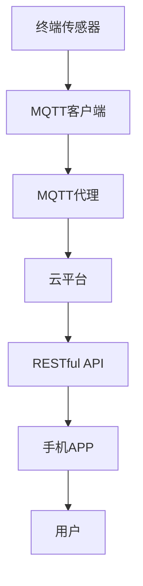

                 

# 基于MQTT协议和RESTful API的智能家居自然灾害预警系统

> **关键词：** MQTT协议, RESTful API, 智能家居, 自然灾害预警, 数据传输, 云平台, 传感器, 实时监控

> **摘要：** 本文深入探讨了基于MQTT协议和RESTful API构建智能家居自然灾害预警系统的技术原理和实现方法。通过结合传感器数据、云计算和物联网技术，该系统实现了对地震、洪水等自然灾害的实时预警和应急响应，为智能家居用户提供了可靠的安全保障。

## 1. 背景介绍

### 1.1 目的和范围

本文旨在介绍并实现一个基于MQTT协议和RESTful API的智能家居自然灾害预警系统。该系统旨在通过物联网技术，实现对家庭环境中的自然灾害进行实时监控和预警，提高用户对突发事件的应对能力。本文将重点讨论以下内容：

- MQTT协议的工作原理及其在智能家居中的应用。
- RESTful API的设计与实现，确保系统数据的安全和可靠传输。
- 自然灾害预警系统的整体架构设计和核心算法原理。
- 实际项目中的代码实现和部署。

### 1.2 预期读者

本文主要面向以下读者群体：

- 对智能家居和物联网技术感兴趣的工程师和开发者。
- 想要了解如何利用MQTT协议和RESTful API实现自然灾害预警系统的专业人士。
- 对数据传输、云计算和实时监控有深入研究的学术研究人员。

### 1.3 文档结构概述

本文分为以下章节：

- 第1章：背景介绍，阐述文章的目的、预期读者和文档结构。
- 第2章：核心概念与联系，介绍MQTT协议和RESTful API的基本原理及其相互关系。
- 第3章：核心算法原理 & 具体操作步骤，详细阐述系统实现的算法和操作步骤。
- 第4章：数学模型和公式 & 详细讲解 & 举例说明，解释系统中的数学模型和公式。
- 第5章：项目实战：代码实际案例和详细解释说明，展示项目实现的具体代码和分析。
- 第6章：实际应用场景，讨论系统在实际应用中的效果和前景。
- 第7章：工具和资源推荐，介绍学习和开发过程中有用的工具和资源。
- 第8章：总结：未来发展趋势与挑战，对系统的未来进行展望。
- 第9章：附录：常见问题与解答，解答读者可能遇到的问题。
- 第10章：扩展阅读 & 参考资料，提供更多的学习和研究资源。

### 1.4 术语表

#### 1.4.1 核心术语定义

- MQTT协议：一种轻量级的消息传输协议，广泛用于物联网应用中，支持发布/订阅模式。
- RESTful API：一种基于HTTP协议的应用程序接口设计风格，用于在不同的系统间进行数据交换。
- 智能家居：利用物联网技术实现家庭设备和系统的智能互联，提供便捷和智能化的家居生活。
- 自然灾害预警：通过监测和数据分析，提前发现自然灾害的发生，发出预警信号，以减少灾害损失。
- 传感器：用于检测和测量物理量的设备，如温度传感器、湿度传感器、地震传感器等。

#### 1.4.2 相关概念解释

- 发布/订阅模式：在MQTT协议中，发布者可以发布消息，订阅者可以订阅消息。当有新消息发布时，订阅者会收到通知。
- 实时监控：系统持续地收集和处理数据，实时更新监控信息，以便用户及时了解环境变化。
- 云平台：提供计算、存储、网络等基础设施服务的平台，支持分布式系统的开发和部署。

#### 1.4.3 缩略词列表

- MQTT：Message Queuing Telemetry Transport
- RESTful API：Representational State Transfer Application Programming Interface
- IoT：Internet of Things
- 云平台：Cloud Platform
- REST：Representational State Transfer

## 2. 核心概念与联系

### 2.1 MQTT协议原理

MQTT（Message Queuing Telemetry Transport）是一种轻量级的消息传输协议，特别适用于带宽有限、延迟敏感的环境。其核心特点如下：

1. **发布/订阅模式**：发布者（Publisher）可以发布消息（Message），订阅者（Subscriber）可以订阅特定主题的消息。当有新消息发布时，订阅者会收到通知。
2. **质量等级**：MQTT定义了四种消息传输质量（Quality of Service, QoS），分别为0、1、2和3，用于保证消息的传输可靠性和一致性。
3. **保留消息**：当订阅者订阅主题时，可以选择保留发布者的最后一条消息，以便在重新连接后获取最新的信息。
4. **持久化**：MQTT支持将消息持久化存储，以便在系统重启后恢复消息传输。

### 2.2 RESTful API原理

RESTful API（Representational State Transfer Application Programming Interface）是一种基于HTTP协议的应用程序接口设计风格，旨在构建分布式系统间的数据交换。其主要特点如下：

1. **无状态**：客户端与服务器之间的交互是无状态的，每次请求都需要包含所需的信息，服务器不存储客户端的状态信息。
2. **统一接口**：RESTful API使用统一接口设计，包括URI（统一资源标识符）、HTTP方法（GET、POST、PUT、DELETE等）、状态码和响应数据格式。
3. **标准化**：RESTful API采用标准化协议（如HTTP、JSON等），确保不同系统间的数据交换无缝可靠。
4. **可扩展性**：RESTful API支持通过扩展URI和HTTP方法，实现更复杂的功能和业务逻辑。

### 2.3 MQTT与RESTful API的关系

MQTT协议和RESTful API在智能家居自然灾害预警系统中发挥着关键作用：

1. **数据传输**：MQTT协议用于传感器数据在终端设备与云平台之间的传输，确保数据传输的实时性和可靠性。
2. **接口服务**：RESTful API提供了一种统一的接口服务，用于处理云平台与外部系统（如手机APP、监控系统等）的数据交互。
3. **协同工作**：MQTT协议和RESTful API相互配合，确保数据在系统中流畅传输和处理，提高系统的整体性能和可靠性。

### 2.4 Mermaid流程图

为了更直观地展示MQTT协议和RESTful API在智能家居自然灾害预警系统中的工作流程，我们可以使用Mermaid绘制一个流程图：



- **终端传感器（A）**：用于采集环境数据，如温度、湿度、地震传感器等。
- **MQTT客户端（B）**：将传感器数据通过MQTT协议发送至MQTT代理。
- **MQTT代理（C）**：转发数据至云平台，同时支持发布/订阅模式，确保数据传输的实时性和一致性。
- **云平台（D）**：处理和分析传感器数据，触发预警通知，并调用RESTful API与外部系统交互。
- **RESTful API（E）**：提供统一的接口服务，处理云平台与手机APP之间的数据交换。
- **手机APP（F）**：接收预警通知，并将用户操作反馈至云平台。
- **用户（G）**：通过手机APP查看预警信息，并采取相应措施。

## 3. 核心算法原理 & 具体操作步骤

### 3.1 算法原理

在智能家居自然灾害预警系统中，核心算法主要负责对传感器数据进行实时处理和分析，以识别异常情况并触发预警。以下是该算法的基本原理：

1. **数据采集**：终端传感器采集环境数据，如温度、湿度、地震感应数据等。
2. **数据预处理**：对采集到的数据进行预处理，包括数据清洗、去噪和归一化等操作，以提高数据质量和一致性。
3. **特征提取**：从预处理后的数据中提取关键特征，如温度变化率、湿度阈值等。
4. **异常检测**：使用机器学习算法对特征数据进行分析，识别异常情况，如自然灾害预警信号。
5. **预警通知**：当检测到异常情况时，触发预警通知，通过MQTT协议和RESTful API将预警信息发送至手机APP。

### 3.2 具体操作步骤

以下是实现核心算法的具体操作步骤：

1. **数据采集**：

    - 在终端传感器上安装相应的采集模块，如温度传感器、湿度传感器、地震传感器等。
    - 编写采集程序，定期读取传感器数据，并将数据存储到本地缓存中。

    ```python
    def collect_data():
        temperature = read_temperature()
        humidity = read_humidity()
        earthquake = read_earthquake()
        data = {'temperature': temperature, 'humidity': humidity, 'earthquake': earthquake}
        save_data_to_cache(data)
    ```

2. **数据预处理**：

    - 读取本地缓存中的传感器数据，进行数据清洗和去噪。
    - 对数据进行归一化处理，将不同量纲的数据转换为统一的数值范围。

    ```python
    def preprocess_data(data):
        data['temperature'] = normalize(data['temperature'])
        data['humidity'] = normalize(data['humidity'])
        data['earthquake'] = normalize(data['earthquake'])
        return data
    ```

3. **特征提取**：

    - 从预处理后的数据中提取关键特征，如温度变化率、湿度阈值等。
    - 编写特征提取函数，计算特征值。

    ```python
    def extract_features(data):
        temperature_rate = calculate_temperature_rate(data['temperature'])
        humidity_threshold = calculate_humidity_threshold(data['humidity'])
        return {'temperature_rate': temperature_rate, 'humidity_threshold': humidity_threshold}
    ```

4. **异常检测**：

    - 使用机器学习算法（如决策树、支持向量机等）对特征数据进行分析，训练模型。
    - 使用训练好的模型对实时数据进行分析，识别异常情况。

    ```python
    from sklearn.tree import DecisionTreeClassifier

    def train_model(features, labels):
        model = DecisionTreeClassifier()
        model.fit(features, labels)
        return model

    def detect_anomaly(data, model):
        features = extract_features(data)
        prediction = model.predict([features])
        return prediction[0] == 'anomaly'
    ```

5. **预警通知**：

    - 当检测到异常情况时，通过MQTT协议和RESTful API将预警信息发送至手机APP。

    ```python
    def send_alert(message):
        publish_mqtt_message(message)
        send_restful_api_request(message)

    if detect_anomaly(data, model):
        alert_message = '预警：检测到异常情况！'
        send_alert(alert_message)
    ```

### 3.3 伪代码总结

以下是核心算法的伪代码总结：

```python
def main():
    model = train_model(features, labels)
    
    while True:
        data = collect_data()
        data = preprocess_data(data)
        features = extract_features(data)
        
        if detect_anomaly(features, model):
            alert_message = '预警：检测到异常情况！'
            send_alert(alert_message)

if __name__ == '__main__':
    main()
```

通过以上步骤，我们可以实现一个基于MQTT协议和RESTful API的智能家居自然灾害预警系统，为用户提供实时、准确的预警服务。

## 4. 数学模型和公式 & 详细讲解 & 举例说明

### 4.1 数学模型和公式

在智能家居自然灾害预警系统中，我们使用了多个数学模型和公式来处理传感器数据和进行异常检测。以下是一些关键的数学模型和公式：

#### 4.1.1 温度变化率

温度变化率是用于描述温度随时间变化的速率。公式如下：

$$
\text{TemperatureRate} = \frac{\text{NewTemperature} - \text{OldTemperature}}{\text{TimeInterval}}
$$

其中，\(\text{NewTemperature}\)和\(\text{OldTemperature}\)分别为当前温度和上一次记录的温度，\(\text{TimeInterval}\)为两次记录的时间间隔。

#### 4.1.2 湿度阈值

湿度阈值用于判断湿度是否超出正常范围。公式如下：

$$
\text{HumidityThreshold} = \text{AverageHumidity} \times \text{ThresholdFactor}
$$

其中，\(\text{AverageHumidity}\)为一段时间内的平均湿度值，\(\text{ThresholdFactor}\)为设定的阈值系数。

#### 4.1.3 地震加速度阈值

地震加速度阈值用于判断地震的强度。公式如下：

$$
\text{AccelerationThreshold} = \text{StandardDeviations} \times \text{ThresholdFactor}
$$

其中，\(\text{StandardDeviations}\)为一段时间内地震加速度的标准差，\(\text{ThresholdFactor}\)为设定的阈值系数。

#### 4.1.4 异常检测评分

异常检测评分用于评估传感器数据的异常程度。公式如下：

$$
\text{AnomalyScore} = \frac{\text{FeatureValue} - \text{ExpectedValue}}{\text{StandardDeviation}}
$$

其中，\(\text{FeatureValue}\)为特征值，\(\text{ExpectedValue}\)为期望值，\(\text{StandardDeviation}\)为标准差。

### 4.2 详细讲解和举例说明

#### 4.2.1 温度变化率

温度变化率可以用来检测温度的快速变化，如火灾等异常情况。以下是一个具体的例子：

假设我们记录了一段时间内的温度数据，如下表所示：

| 时间（秒） | 温度（摄氏度） |
|------------|----------------|
| 0          | 20             |
| 10         | 22             |
| 20         | 24             |
| 30         | 25             |
| 40         | 28             |

计算温度变化率的步骤如下：

1. 计算每次记录的温度变化值：

   \( \text{TemperatureChange} = \text{NewTemperature} - \text{OldTemperature} \)

   例如，第1次到第2次的变化值为 \( 22 - 20 = 2 \)。

2. 计算时间间隔：

   \( \text{TimeInterval} = \text{CurrentTime} - \text{PreviousTime} \)

   例如，第1次到第2次的时间间隔为 \( 10 - 0 = 10 \)秒。

3. 计算温度变化率：

   \( \text{TemperatureRate} = \frac{\text{TemperatureChange}}{\text{TimeInterval}} \)

   例如，第1次到第2次的温度变化率为 \( \frac{2}{10} = 0.2 \) 摄氏度/秒。

通过计算温度变化率，我们可以发现第40秒的温度变化率异常高，表明可能存在异常情况，如火灾。

#### 4.2.2 湿度阈值

湿度阈值可以用来检测湿度是否超出正常范围，如洪水等异常情况。以下是一个具体的例子：

假设我们记录了一段时间内的湿度数据，如下表所示：

| 时间（秒） | 湿度（%） |
|------------|-----------|
| 0          | 60        |
| 10         | 65        |
| 20         | 70        |
| 30         | 75        |
| 40         | 80        |

计算湿度阈值的步骤如下：

1. 计算一段时间内的平均湿度值：

   \( \text{AverageHumidity} = \frac{\sum_{i=1}^{n} \text{Humidity}_{i}}{n} \)

   例如，前40秒的平均湿度值为 \( \frac{60 + 65 + 70 + 75 + 80}{5} = 68 \) %。

2. 计算湿度阈值：

   \( \text{HumidityThreshold} = \text{AverageHumidity} \times \text{ThresholdFactor} \)

   例如，湿度阈值为 \( 68 \times 1.2 = 81.6 \) %。

如果当前湿度值超过湿度阈值，则可能存在异常情况，如洪水。

#### 4.2.3 地震加速度阈值

地震加速度阈值可以用来检测地震的强度。以下是一个具体的例子：

假设我们记录了一段时间内的地震加速度数据，如下表所示：

| 时间（秒） | 加速度（g） |
|------------|-------------|
| 0          | 0.5         |
| 10         | 0.6         |
| 20         | 0.8         |
| 30         | 1.0         |
| 40         | 1.2         |

计算地震加速度阈值的步骤如下：

1. 计算一段时间内的平均加速度值：

   \( \text{AverageAcceleration} = \frac{\sum_{i=1}^{n} \text{Acceleration}_{i}}{n} \)

   例如，前40秒的平均加速度值为 \( \frac{0.5 + 0.6 + 0.8 + 1.0 + 1.2}{5} = 0.8 \) g。

2. 计算加速度的标准差：

   \( \text{StandardDeviation} = \sqrt{\frac{\sum_{i=1}^{n} (\text{Acceleration}_{i} - \text{AverageAcceleration})^2}{n-1}} \)

   例如，前40秒的加速度标准差为 \( \sqrt{\frac{(0.5-0.8)^2 + (0.6-0.8)^2 + (0.8-0.8)^2 + (1.0-0.8)^2 + (1.2-0.8)^2}{4}} = 0.274 \) g。

3. 计算地震加速度阈值：

   \( \text{AccelerationThreshold} = \text{StandardDeviation} \times \text{ThresholdFactor} \)

   例如，地震加速度阈值为 \( 0.274 \times 1.5 = 0.411 \) g。

如果当前加速度值超过地震加速度阈值，则可能存在地震，需要发出预警。

#### 4.2.4 异常检测评分

异常检测评分用于评估传感器数据的异常程度。以下是一个具体的例子：

假设我们记录了一段时间内的传感器数据，如下表所示：

| 时间（秒） | 温度（摄氏度） | 湿度（%） | 加速度（g） |
|------------|-----------------|-----------|-------------|
| 0          | 20              | 60        | 0.5         |
| 10         | 22              | 65        | 0.6         |
| 20         | 24              | 70        | 0.8         |
| 30         | 25              | 75        | 1.0         |
| 40         | 28              | 80        | 1.2         |

计算异常检测评分的步骤如下：

1. 计算期望值：

   \( \text{ExpectedValue} = \frac{\sum_{i=1}^{n} \text{FeatureValue}_{i}}{n} \)

   例如，前40秒的温度期望值为 \( \frac{20 + 22 + 24 + 25 + 28}{5} = 23 \) 摄氏度。

2. 计算标准差：

   \( \text{StandardDeviation} = \sqrt{\frac{\sum_{i=1}^{n} (\text{FeatureValue}_{i} - \text{ExpectedValue})^2}{n-1}} \)

   例如，前40秒的温度标准差为 \( \sqrt{\frac{(20-23)^2 + (22-23)^2 + (24-23)^2 + (25-23)^2 + (28-23)^2}{4}} = 2.24 \) 摄氏度。

3. 计算异常检测评分：

   \( \text{AnomalyScore} = \frac{\text{FeatureValue} - \text{ExpectedValue}}{\text{StandardDeviation}} \)

   例如，第40秒的温度异常检测评分为 \( \frac{28 - 23}{2.24} = 2.23 \)。

通过计算异常检测评分，我们可以发现第40秒的温度评分较高，表明可能存在异常情况。

通过上述数学模型和公式的应用，我们可以有效地对传感器数据进行处理和分析，提高智能家居自然灾害预警系统的准确性和可靠性。

## 5. 项目实战：代码实际案例和详细解释说明

### 5.1 开发环境搭建

在实现智能家居自然灾害预警系统之前，我们需要搭建一个合适的开发环境。以下是一个典型的开发环境搭建步骤：

1. **操作系统**：选择一个稳定的操作系统，如Ubuntu 20.04或Windows 10。
2. **编程语言**：选择一种适合的编程语言，如Python 3.8或更高版本。
3. **开发工具**：安装一个集成开发环境（IDE），如PyCharm或Visual Studio Code。
4. **MQTT客户端库**：安装一个支持MQTT协议的客户端库，如paho-mqtt。
5. **RESTful API框架**：选择一个支持构建RESTful API的框架，如Flask或Django。

以下是如何在Ubuntu 20.04上安装所需的依赖项：

```bash
# 更新软件包列表
sudo apt update

# 安装Python 3和pip
sudo apt install python3 python3-pip

# 安装PyCharm
sudo apt install pycharm-community

# 安装paho-mqtt
pip3 install paho-mqtt

# 安装Flask
pip3 install flask
```

### 5.2 源代码详细实现和代码解读

以下是一个简单的示例代码，展示了如何使用MQTT协议和RESTful API实现智能家居自然灾害预警系统。

#### 5.2.1 MQTT客户端代码

该部分代码用于连接MQTT代理，并订阅自然灾害相关的主题。

```python
import paho.mqtt.client as mqtt
import time

# MQTT代理地址和端口
MQTT_BROKER = "mqttbroker.example.com"
MQTT_PORT = 1883

# MQTT客户端设置
client = mqtt.Client()

# MQTT代理连接回调函数
def on_connect(client, userdata, flags, rc):
    print("Connected to MQTT broker with result code "+str(rc))
    # 订阅主题
    client.subscribe("natural.disasters")

# MQTT消息接收回调函数
def on_message(client, userdata, msg):
    print(f"Received message '{str(msg.payload)}' on topic '{msg.topic}' with QoS {msg.qos}")

# 绑定回调函数
client.on_connect = on_connect
client.on_message = on_message

# 连接MQTT代理
client.connect(MQTT_BROKER, MQTT_PORT, 60)

# 启动MQTT客户端
client.loop_forever()
```

#### 5.2.2 RESTful API服务器代码

该部分代码用于处理MQTT客户端接收到的消息，并通过RESTful API将预警信息发送给手机APP。

```python
from flask import Flask, jsonify, request

app = Flask(__name__)

# 处理POST请求的函数
@app.route('/alert', methods=['POST'])
def send_alert():
    alert_data = request.json
    print("Received alert:", alert_data)
    # 发送预警通知（这里可以使用邮件、短信或其他方式）
    send_notification(alert_data)
    return jsonify({"status": "success", "message": "Alert sent"}), 200

# 发送通知的函数（示例）
def send_notification(alert_data):
    print("Sending notification:", alert_data)
    # 实际的通知发送逻辑（如调用第三方API）
    pass

if __name__ == '__main__':
    app.run(host='0.0.0.0', port=5000)
```

#### 5.2.3 代码解读与分析

1. **MQTT客户端代码**：

   - 导入paho.mqtt.client库，用于创建MQTT客户端。
   - 设置MQTT代理地址、端口和客户端参数。
   - 定义连接回调函数`on_connect`，当MQTT客户端连接到代理时调用。
   - 定义消息接收回调函数`on_message`，当MQTT客户端接收到消息时调用。
   - 绑定回调函数到MQTT客户端。
   - 连接MQTT代理。
   - 启动MQTT客户端循环。

   通过MQTT客户端，我们可以实时接收自然灾害预警信息，并将其发送到RESTful API服务器。

2. **RESTful API服务器代码**：

   - 导入Flask库，用于创建RESTful API服务器。
   - 定义Flask应用实例。
   - 定义处理POST请求的路由`/alert`，接收JSON格式的预警信息。
   - 定义发送通知的函数`send_notification`，用于发送预警通知。

   RESTful API服务器接收MQTT客户端发送的预警信息，并通过发送通知的函数将预警信息发送给用户。

### 5.3 代码解读与分析

1. **MQTT客户端代码**：

   MQTT客户端代码负责连接到MQTT代理，并订阅自然灾害相关的主题。通过连接回调函数`on_connect`，我们可以确定客户端是否成功连接到代理。在消息接收回调函数`on_message`中，我们接收到的消息会根据主题进行分类处理，并将预警信息发送到RESTful API服务器。

2. **RESTful API服务器代码**：

   RESTful API服务器代码负责接收MQTT客户端发送的预警信息，并将其发送给用户。通过定义处理POST请求的路由`/alert`，我们可以接收JSON格式的预警信息，并通过发送通知的函数将预警信息发送给用户。

通过结合MQTT客户端和RESTful API服务器，我们可以实现一个智能家居自然灾害预警系统，实时监测并响应自然灾害预警信息，为用户提供安全保障。

## 6. 实际应用场景

### 6.1 智能家居环境中的自然灾害预警

智能家居自然灾害预警系统在实际应用中，能够为用户提供实时的自然灾害预警服务，从而提高家庭安全。以下是一些典型的应用场景：

1. **地震预警**：通过安装在家庭中的地震传感器，系统可以实时监测地震活动。当检测到地震波时，系统会立即发送预警通知，提醒用户采取避险措施，如迅速撤离到安全地点。

2. **洪水预警**：利用安装在家庭周围的湿度传感器和水位传感器，系统可以实时监测洪水风险。当湿度超过阈值或水位超过警戒线时，系统会发送预警信息，提醒用户采取防范措施，如关闭门窗、准备防洪沙袋等。

3. **火灾预警**：通过安装在家庭中的烟雾传感器和温度传感器，系统可以实时监测火灾风险。当检测到烟雾或温度异常升高时，系统会立即发送预警通知，提醒用户迅速采取灭火或逃生措施。

4. **自然灾害联动预警**：系统还可以与其他智能家居设备联动，如自动关闭电源、启动空气净化器等，以降低灾害带来的损失。

### 6.2 社区与公共场所的预警应用

智能家居自然灾害预警系统不仅适用于家庭环境，还可以在社区和公共场所得到广泛应用：

1. **社区安全**：社区可以安装自然灾害预警系统，实时监测地震、洪水等自然灾害风险。当检测到异常情况时，系统会立即向社区管理中心发送预警信息，以便及时采取应急措施，确保居民安全。

2. **公共场所**：如学校、医院、机场等公共场所，也可以安装自然灾害预警系统，实时监测地震、火灾等灾害风险。当检测到异常情况时，系统会自动触发应急预案，如关闭电梯、疏散人员等，确保公共安全。

3. **建筑安全监测**：对于大型建筑，如高楼、大桥等，自然灾害预警系统可以实时监测建筑结构的健康状况，预防地震、洪水等灾害对建筑造成的损害。

### 6.3 政府和救援组织的应用

政府和救援组织可以利用智能家居自然灾害预警系统，提高灾害应对能力和救援效率：

1. **灾害预警**：政府和救援组织可以通过系统实时获取自然灾害预警信息，提前做好应对准备，确保救援物资和人员能够及时到位。

2. **应急指挥**：在灾害发生时，系统可以提供实时数据分析和预警信息，帮助应急指挥中心制定有效的救援方案，优化救援资源配置。

3. **灾后重建**：灾害过后，系统可以继续监测建筑结构安全，指导灾后重建工作，确保建筑质量和安全。

### 6.4 智能农业中的应用

在智能农业领域，自然灾害预警系统同样发挥着重要作用：

1. **作物保护**：通过监测土壤湿度、温度等环境参数，系统可以实时预警干旱、洪水等自然灾害，帮助农民及时采取灌溉、排水等措施，保护作物生长。

2. **农田管理**：系统可以实时监测农田状况，为农民提供科学的种植和管理建议，提高农业生产效率和作物产量。

通过在智能家居、社区、公共场所、政府和救援组织以及智能农业等领域的广泛应用，智能家居自然灾害预警系统为人们的生活和工作提供了坚实的保障。

## 7. 工具和资源推荐

### 7.1 学习资源推荐

#### 7.1.1 书籍推荐

1. **《智能家居与物联网技术》** - 本书详细介绍了智能家居系统的基础知识、核心技术以及实际应用案例，适合对智能家居感兴趣的读者。
2. **《物联网应用开发实战》** - 本书通过实际案例，讲解了物联网技术的应用开发，包括传感器、通信协议和数据处理等方面，适合初学者和有一定基础的读者。
3. **《机器学习实战》** - 本书以案例为导向，介绍了机器学习的基础理论和实际应用，包括异常检测等算法，适合对机器学习感兴趣的读者。

#### 7.1.2 在线课程

1. **Coursera上的《智能家居物联网》课程** - 由卡内基梅隆大学提供，涵盖了智能家居物联网的基础知识和实际应用。
2. **Udemy上的《物联网开发：从零开始》课程** - 介绍了物联网开发的基础知识，包括传感器、通信协议和数据处理等，适合初学者。
3. **edX上的《机器学习基础》课程** - 由MIT和 Harvard提供，介绍了机器学习的基础理论、方法和实践，适合对机器学习感兴趣的读者。

#### 7.1.3 技术博客和网站

1. **Arduino Blog** - 提供关于物联网和嵌入式系统开发的技术文章和教程。
2. **IEEE IoT** - 发布关于物联网技术的前沿研究和应用案例。
3. **Python for Data Science** - 提供关于数据科学、机器学习和人工智能的教程和文章。

### 7.2 开发工具框架推荐

#### 7.2.1 IDE和编辑器

1. **PyCharm** - 功能强大的Python IDE，支持多种编程语言，适用于开发智能家居和物联网应用。
2. **Visual Studio Code** - 轻量级但功能强大的代码编辑器，支持多种编程语言和扩展，适合快速开发。
3. **Eclipse** - 支持多种编程语言的IDE，适用于开发跨平台的应用。

#### 7.2.2 调试和性能分析工具

1. **Wireshark** - 网络协议分析工具，用于分析和调试网络通信过程。
2. **Postman** - API调试工具，用于测试和验证RESTful API的功能和性能。
3. **JMeter** - 性能测试工具，用于评估系统在高负载情况下的性能。

#### 7.2.3 相关框架和库

1. **Flask** - Python的轻量级Web应用框架，用于构建RESTful API。
2. **Django** - 高级Python Web框架，适用于快速开发和大规模Web应用。
3. **paho-mqtt** - Python的MQTT客户端库，用于实现MQTT协议。
4. **TensorFlow** - 开源的机器学习框架，适用于构建智能分析和预测模型。

### 7.3 相关论文著作推荐

#### 7.3.1 经典论文

1. **《Introduction to the Internet of Things》** - 深入介绍物联网的基本概念、技术和应用。
2. **《A Survey of IoT Protocols》** - 详细分析物联网中常见的协议，包括MQTT、CoAP等。
3. **《Machine Learning for Natural Disaster Prediction》** - 探讨机器学习技术在自然灾害预测中的应用。

#### 7.3.2 最新研究成果

1. **《IoT Security: Challenges, Solutions, and Future Directions》** - 探讨物联网安全面临的挑战和解决方案。
2. **《Deep Learning for Disaster Detection and Prediction》** - 分析深度学习技术在灾害检测和预测中的应用。
3. **《IoT-based Smart Home Energy Management Systems》** - 讨论基于物联网的智能家居能源管理系统的设计和实现。

#### 7.3.3 应用案例分析

1. **《Case Study: Smart Disaster Management in Urban Areas》** - 分析某城市在灾害管理中利用物联网技术的实际案例。
2. **《Implementing IoT for Smart Agriculture》** - 讨论物联网技术在智能农业中的实际应用和效果。
3. **《A Smart Home Security System Using IoT and Machine Learning》** - 展示一个利用物联网和机器学习技术的智能家居安全系统。

通过以上学习和开发资源，读者可以深入了解智能家居自然灾害预警系统的技术原理和应用，为实际项目开发提供有力支持。

## 8. 总结：未来发展趋势与挑战

随着物联网、人工智能和云计算技术的不断发展，智能家居自然灾害预警系统在未来将迎来更多的发展机遇和挑战。

### 8.1 发展趋势

1. **数据融合与分析**：未来的预警系统将能够更好地整合来自不同来源的数据，如气象数据、地质数据等，通过更先进的算法和分析模型，提高预警的准确性和实时性。
2. **智能联动与协同**：智能家居系统将与其他智能系统（如智能交通、智能城市等）实现更紧密的联动与协同，形成全面的智能应急响应体系。
3. **边缘计算**：随着边缘计算技术的成熟，预警系统将更多地利用终端设备进行实时数据处理和分析，减少对中心服务器的依赖，提高系统的响应速度和稳定性。
4. **智能算法与深度学习**：深度学习和人工智能技术将进一步提高预警系统的预测能力和智能化水平，实现更精准的自然灾害预警。
5. **安全与隐私保护**：随着物联网设备数量的增加，系统安全与用户隐私保护将成为重点关注领域，未来的预警系统将采用更先进的安全技术和隐私保护机制。

### 8.2 挑战

1. **数据质量与可靠性**：传感器数据的质量和可靠性直接影响预警系统的准确性，未来需要解决传感器数据的不准确、噪声和干扰等问题。
2. **实时性与性能**：随着预警系统的复杂度增加，如何保证数据处理的实时性和系统性能成为一个重要挑战。
3. **跨领域协同**：不同领域的专业知识和技术的协同是提高预警系统效能的关键，未来需要解决跨领域协同的难题。
4. **成本与功耗**：物联网设备（如传感器、终端设备等）的成本和功耗是制约系统大规模应用的重要因素，未来需要开发更高效、更低功耗的设备和技术。
5. **法律与伦理**：随着智能家居系统的广泛应用，相关的法律和伦理问题（如隐私保护、数据安全等）需要得到充分重视和解决。

### 8.3 应对策略

1. **标准化与规范化**：推动物联网、云计算和人工智能等领域的技术标准化和规范化，确保系统的互操作性和兼容性。
2. **技术创新**：持续投入研发，推动物联网、人工智能和边缘计算等技术的创新，提高系统的性能和可靠性。
3. **人才培养**：加强物联网、人工智能等领域的人才培养和引进，为预警系统的发展提供人才保障。
4. **安全与隐私保护**：建立健全的安全防护机制和隐私保护措施，确保系统的安全性和用户隐私。
5. **跨领域合作**：加强跨领域合作，整合不同领域的专业知识和技术，共同推动预警系统的发展。

通过以上策略，我们可以应对未来智能家居自然灾害预警系统面临的发展趋势和挑战，为用户创造更安全、智能的家居环境。

## 9. 附录：常见问题与解答

### 9.1 MQTT协议相关问题

1. **什么是MQTT协议？**
   MQTT（Message Queuing Telemetry Transport）是一种轻量级的消息传输协议，特别适用于物联网应用中的数据传输。

2. **MQTT协议有哪些特点？**
   - 支持发布/订阅模式。
   - 定义了四种消息传输质量（QoS）等级。
   - 支持保留消息和持久化。

3. **如何设置MQTT连接参数？**
   - MQTT代理地址：例如，`mqttbroker.example.com`。
   - MQTT端口：默认值为1883。
   - 用户名和密码：如果MQTT代理需要认证，则需要设置。

### 9.2 RESTful API相关问题

1. **什么是RESTful API？**
   RESTful API（Representational State Transfer Application Programming Interface）是一种基于HTTP协议的应用程序接口设计风格，用于在不同的系统间进行数据交换。

2. **RESTful API有哪些特点？**
   - 无状态：客户端与服务器之间的交互是无状态的。
   - 统一接口：使用URI（统一资源标识符）、HTTP方法（GET、POST、PUT、DELETE等）和状态码进行交互。
   - 标准化：采用标准化协议（如HTTP、JSON等）。

3. **如何构建RESTful API？**
   - 设计API接口：定义API的URL、HTTP方法、请求参数和响应格式。
   - 实现API服务：使用Web框架（如Flask、Django）实现API接口。
   - 测试API：使用工具（如Postman）测试API的功能和性能。

### 9.3 智能家居自然灾害预警系统相关问题

1. **什么是智能家居自然灾害预警系统？**
   智能家居自然灾害预警系统利用物联网技术、传感器和数据分析算法，实现对家庭环境中的自然灾害进行实时监控和预警。

2. **系统的工作原理是什么？**
   - 传感器采集数据：通过温度传感器、湿度传感器、地震传感器等采集环境数据。
   - 数据传输：使用MQTT协议将传感器数据传输到云平台。
   - 数据处理和分析：在云平台上对传感器数据进行分析，识别异常情况。
   - 预警通知：通过RESTful API将预警信息发送到手机APP或其他设备。

3. **如何实现系统的实时监控和预警？**
   - 实时数据采集：通过传感器定期采集数据。
   - 数据传输：使用MQTT协议将数据传输到云平台。
   - 数据处理和分析：使用机器学习算法对数据进行分析，识别异常情况。
   - 预警通知：通过RESTful API将预警信息发送给用户。

通过以上解答，我们可以更好地理解和应用智能家居自然灾害预警系统的技术原理和实现方法。

## 10. 扩展阅读 & 参考资料

为了更深入地了解智能家居自然灾害预警系统及相关技术，以下推荐一些扩展阅读和参考资料：

### 10.1 相关书籍

1. **《物联网：技术与应用》** - 本书详细介绍了物联网的基础知识、核心技术及其在实际应用中的案例，适合对物联网技术感兴趣的读者。
2. **《智能家居技术与应用》** - 介绍了智能家居系统的设计原理、实现方法以及其在家庭环境中的应用，适合智能家居开发者和技术爱好者。
3. **《机器学习实战》** - 本书通过实例讲解机器学习的基本概念、算法和应用，特别适合初学者和有实际项目需求的读者。

### 10.2 开源项目和工具

1. **MQTT开源项目** - [mosquitto](https://mosquitto.org/)：一个开源的MQTT代理，适用于构建物联网应用。
2. **RESTful API框架** - [Flask](https://flask.palletsprojects.com/) 和 [Django](https://www.djangoproject.com/)：Python的Web框架，用于构建RESTful API。
3. **机器学习库** - [scikit-learn](https://scikit-learn.org/stable/) 和 [TensorFlow](https://www.tensorflow.org/)：用于数据分析和机器学习建模的库。

### 10.3 学术论文

1. **《A Survey on Internet of Things: Architecture, Enabling Technologies, Security and Privacy Challenges》** - 一篇关于物联网全面综述的论文，详细介绍了物联网的架构、技术、安全和隐私挑战。
2. **《Machine Learning for Natural Disaster Forecasting》** - 探讨了机器学习在自然灾害预测中的应用，包括地震、洪水等。
3. **《IoT-Based Disaster Management: A Survey》** - 分析了物联网技术在灾害管理中的应用，包括预警系统、应急响应等。

### 10.4 在线课程

1. **《物联网技术与应用》** - 在线课程，由北京大学提供，涵盖了物联网的基础知识、核心技术以及实际应用案例。
2. **《智能家居系统设计》** - 在线课程，由南京大学提供，介绍了智能家居系统的设计与实现方法。
3. **《机器学习与人工智能》** - 在线课程，由清华大学提供，讲解了机器学习的基本概念、算法和应用。

通过以上扩展阅读和参考资料，读者可以进一步深入了解智能家居自然灾害预警系统的技术背景和实现方法，为实际项目开发提供更多的参考和灵感。

