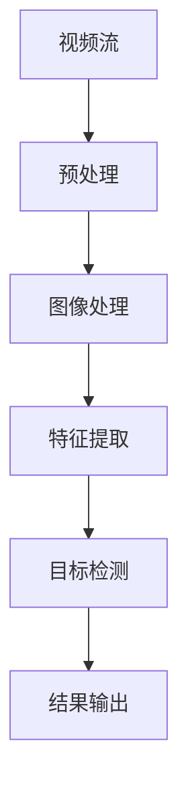

                 

# 基于OpenCV的智能视频监控系统详细设计与具体代码实现

> **关键词**：智能视频监控、OpenCV、图像处理、人脸识别、目标检测、算法优化、系统设计

> **摘要**：本文将深入探讨基于OpenCV的智能视频监控系统的设计与实现。通过详细的分析和实例代码展示，我们将从背景介绍、核心概念、算法原理、数学模型、项目实战、实际应用、工具推荐等多个方面，全面解析智能视频监控系统的工作机制和发展前景。

## 1. 背景介绍

### 1.1 目的和范围

随着计算机技术和人工智能的快速发展，智能视频监控系统在安全监控、交通管理、智能家居等多个领域得到广泛应用。本文旨在通过OpenCV这一强大的计算机视觉库，详细讲解智能视频监控系统的设计思路、核心算法和具体实现，为相关领域的研究者和开发者提供实用的参考。

### 1.2 预期读者

本文适合对计算机视觉和人工智能有一定了解的技术人员，尤其是希望深入掌握OpenCV库应用的读者。通过本文的学习，读者将能够：

1. 了解智能视频监控系统的基本架构和功能。
2. 掌握OpenCV库在视频监控中的具体应用。
3. 学习到图像处理、人脸识别和目标检测等核心算法的实现细节。
4. 掌握智能视频监控系统的优化技巧和实际应用场景。

### 1.3 文档结构概述

本文将分为以下几个部分：

1. **背景介绍**：介绍智能视频监控系统的背景、目的和读者对象。
2. **核心概念与联系**：介绍智能视频监控系统的核心概念和联系，使用Mermaid流程图展示。
3. **核心算法原理与具体操作步骤**：讲解图像处理、人脸识别和目标检测等核心算法的原理和实现步骤，使用伪代码详细阐述。
4. **数学模型和公式**：介绍智能视频监控系统中的数学模型和公式，使用latex格式详细讲解。
5. **项目实战**：通过实际案例展示智能视频监控系统的代码实现和详细解释。
6. **实际应用场景**：分析智能视频监控系统的实际应用场景和解决方案。
7. **工具和资源推荐**：推荐学习资源、开发工具和经典论文。
8. **总结**：总结智能视频监控系统的发展趋势与挑战。
9. **附录**：提供常见问题与解答。
10. **扩展阅读与参考资料**：提供进一步的阅读资料和参考。

### 1.4 术语表

#### 1.4.1 核心术语定义

- **智能视频监控系统**：通过计算机视觉技术，对视频数据进行实时分析、处理和判断的监控系统。
- **OpenCV**：开源计算机视觉库，提供丰富的图像处理和计算机视觉算法。
- **图像处理**：对图像进行增强、滤波、分割等操作，以提取有用信息。
- **人脸识别**：通过比较人脸图像的特征，判断两个图像是否为同一个人。
- **目标检测**：识别图像中特定的目标对象，并定位其位置。

#### 1.4.2 相关概念解释

- **视频流**：连续传输的图像数据，通常以帧为单位。
- **特征提取**：从图像中提取具有代表性的特征，用于后续的识别和分类。
- **机器学习**：利用数据构建模型，对未知数据进行预测和分类。

#### 1.4.3 缩略词列表

- **AI**：人工智能
- **ML**：机器学习
- **CNN**：卷积神经网络
- **FPGA**：现场可编程门阵列
- **GPU**：图形处理器

## 2. 核心概念与联系

智能视频监控系统的核心概念包括视频流处理、图像处理、特征提取和目标检测。以下是一个简单的Mermaid流程图，展示了这些核心概念之间的联系：



### 2.1 视频流处理

视频流是智能视频监控系统的基础。系统从视频流中提取每一帧图像，进行后续处理。视频流处理主要包括以下步骤：

1. **采集**：通过摄像头或其他视频源采集视频流。
2. **解码**：将压缩的视频数据解码为可处理的图像帧。
3. **缩放**：根据系统需求对图像进行缩放，以降低计算复杂度。
4. **滤波**：对图像进行滤波，去除噪声。

### 2.2 图像处理

图像处理是视频监控系统的关键环节，主要包括以下步骤：

1. **增强**：通过调整亮度、对比度等参数，增强图像的视觉效果。
2. **滤波**：去除图像中的噪声，提高图像质量。
3. **分割**：将图像分为前景和背景，提取感兴趣的区域。

### 2.3 特征提取

特征提取是从图像中提取具有代表性的特征，用于后续的识别和分类。常用的特征提取方法包括：

1. **HOG（Histogram of Oriented Gradients）**：通过计算图像中每个像素点的梯度方向和幅值，构建直方图。
2. **SIFT（Scale-Invariant Feature Transform）**：在图像中提取局部极值点，并计算其位置、尺度和方向。
3. **ORB（Oriented FAST and Rotated BRIEF）**：结合了SIFT和SURF的特点，具有较好的性能和实时性。

### 2.4 目标检测

目标检测是智能视频监控系统的核心任务，其目的是识别图像中的特定目标对象，并定位其位置。常用的目标检测方法包括：

1. **基于传统机器学习的方法**：如支持向量机（SVM）、决策树等。
2. **基于深度学习的方法**：如卷积神经网络（CNN）、YOLO（You Only Look Once）等。

## 3. 核心算法原理与具体操作步骤

智能视频监控系统中的核心算法包括图像处理、特征提取和目标检测。以下将分别介绍这些算法的原理和具体操作步骤。

### 3.1 图像处理算法

图像处理算法主要包括增强、滤波和分割。

#### 3.1.1 增强算法

增强算法的目的是提高图像的视觉效果，使其更清晰、易于分析。常用的增强算法包括：

- **直方图均衡化**：
  ```latex
  histogram_equalization(image)
  {
      histogram = calculate_histogram(image)
      cumulative_histogram = calculate_cumulative_histogram(histogram)
      max_value = cumulative_histogram[len(cumulative_histogram) - 1]
      
      for i in range(len(image)):
          value = image[i]
          new_value = (max_value * cumulative_histogram[value]) / max_value
          image[i] = new_value
  }
  ```

- **直方图规定化**：
  ```latex
  histogram_norm(image, target_range)
  {
      histogram = calculate_histogram(image)
      total = sum(histogram)
      
      for i in range(len(image)):
          value = image[i]
          new_value = (target_range[1] - target_range[0]) * (histogram[value] / total) + target_range[0]
          image[i] = new_value
  }
  ```

#### 3.1.2 滤波算法

滤波算法的目的是去除图像中的噪声，提高图像质量。常用的滤波算法包括：

- **均值滤波**：
  ```latex
  mean_filter(image, window_size)
  {
      for i in range(len(image)):
          for j in range(window_size):
              value = image[i + j]
              image[i] += value
          image[i] /= window_size
  }
  ```

- **高斯滤波**：
  ```latex
  gauss_filter(image, window_size)
  {
      gauss_matrix = create_gauss_matrix(window_size)
      
      for i in range(len(image)):
          for j in range(window_size):
              value = image[i + j]
              image[i] += gauss_matrix[j][i] * value
          image[i] /= sum(gauss_matrix[j])
  }
  ```

#### 3.1.3 分割算法

分割算法的目的是将图像分为前景和背景，提取感兴趣的区域。常用的分割算法包括：

- **基于阈值的分割**：
  ```latex
  threshold_segmentation(image, threshold)
  {
      for i in range(len(image)):
          for j in range(len(image[i])):
              value = image[i][j]
              if value > threshold:
                  image[i][j] = 255
              else:
                  image[i][j] = 0
  }
  ```

- **基于区域的分割**：
  ```latex
  region_growing_segmentation(image, seed_points)
  {
      for point in seed_points:
          region_grow(image, point)
  }
  
  def region_grow(image, point):
      stack = [point]
      while stack:
          current_point = stack.pop()
          neighbors = get_neighbors(image, current_point)
          for neighbor in neighbors:
              if image[neighbor] == 0:
                  image[neighbor] = 255
                  stack.append(neighbor)
  }
  ```

### 3.2 特征提取算法

特征提取算法主要用于从图像中提取具有代表性的特征，以便进行后续的目标识别和分类。

#### 3.2.1 HOG算法

HOG算法通过计算图像中每个像素点的梯度方向和幅值，构建直方图，从而提取图像的特征。

- **计算梯度方向和幅值**：
  ```latex
  gradientOrientationAndMagnitude(image)
  {
      gradients = []
      for i in range(len(image)):
          row_gradients = []
          for j in range(len(image[i])):
              dx = image[i+1][j] - image[i-1][j]
              dy = image[i][j+1] - image[i][j-1]
              magnitude = sqrt(dx^2 + dy^2)
              orientation = atan2(dy, dx)
              row_gradients.append((orientation, magnitude))
          gradients.append(row_gradients)
  }
  ```

- **构建直方图**：
  ```latex
  buildHistogram(gradients, bin_size, cell_size)
  {
      histogram = [0] * bin_size
      for gradient in gradients:
          for i in range(len(gradient)):
              orientation, magnitude = gradient[i]
              index = round(orientation / cell_size)
              histogram[index] += magnitude
  }
  ```

### 3.3 目标检测算法

目标检测算法的目的是在图像中识别并定位特定的目标对象。

#### 3.3.1 基于传统机器学习的方法

- **支持向量机（SVM）**：
  SVM通过寻找最佳分割超平面，将不同类别的数据分开。具体实现步骤如下：

  ```latex
  def train_svm(train_data, train_labels):
      # 使用SVM库训练模型
      model = SVM.train(train_data, train_labels)
      
      return model
  
  def predict_svm(model, test_data):
      # 使用训练好的模型进行预测
      predictions = model.predict(test_data)
      
      return predictions
  ```

#### 3.3.2 基于深度学习的方法

- **卷积神经网络（CNN）**：
  CNN通过卷积、池化和全连接层等操作，提取图像的深层次特征，实现高效的目标检测。具体实现步骤如下：

  ```latex
  def train_cnn(train_data, train_labels):
      # 使用CNN库训练模型
      model = CNN.train(train_data, train_labels)
      
      return model
  
  def predict_cnn(model, test_data):
      # 使用训练好的模型进行预测
      predictions = model.predict(test_data)
      
      return predictions
  ```

## 4. 数学模型和公式

智能视频监控系统中的数学模型和公式主要用于描述图像处理、特征提取和目标检测等算法的核心原理。

### 4.1 图像处理数学模型

#### 4.1.1 直方图均衡化

直方图均衡化通过调整图像的像素值，使得图像的像素分布更加均匀。

- **直方图计算**：
  $$ H(x) = \sum_{i=0}^{255} f(i) $$

- **累积直方图计算**：
  $$ C(x) = \sum_{i=0}^{x} H(i) $$

- **像素值调整**：
  $$ z = \frac{(C(x) - C(0)) * (L - 1)}{C(L - 1)} $$

其中，$L$ 为像素值的范围（通常为256），$x$ 为原始像素值，$z$ 为调整后的像素值。

#### 4.1.2 直方图规定化

直方图规定化通过缩放像素值，使得图像的像素分布符合目标范围。

- **像素值调整**：
  $$ z = \frac{(target_range[1] - target_range[0]) * (f(x) / total)}{target_range[1] - target_range[0]} + target_range[0] $$

其中，$f(x)$ 为原始像素值的直方图值，$total$ 为直方图的总量，$target_range$ 为目标范围。

### 4.2 特征提取数学模型

#### 4.2.1 HOG特征

HOG特征通过计算图像中每个像素点的梯度方向和幅值，构建直方图。

- **梯度方向**：
  $$ \theta = \arctan2(dy, dx) $$

- **梯度幅值**：
  $$ magnitude = \sqrt{dx^2 + dy^2} $$

- **直方图计算**：
  $$ histogram[i] = \sum_{(x, y) \in cell} magnitude \cdot \exp(-\frac{(\theta - \theta_0)^2}{2\sigma^2}) $$

其中，$\theta_0$ 为直方图的中心角度，$\sigma$ 为直方图的宽度。

### 4.3 目标检测数学模型

#### 4.3.1 支持向量机（SVM）

SVM通过寻找最佳分割超平面，将不同类别的数据分开。

- **决策函数**：
  $$ f(x) = \sum_{i=1}^{n} \alpha_i y_i (w \cdot x_i + b) $$

- **优化目标**：
  $$ \min_{w, b, \alpha} \frac{1}{2} ||w||^2 + C \sum_{i=1}^{n} \alpha_i (1 - y_i (w \cdot x_i + b)) $$

其中，$w$ 为权重向量，$b$ 为偏置项，$\alpha$ 为拉格朗日乘子，$C$ 为正则化参数，$y_i$ 为类别标签。

## 5. 项目实战：代码实际案例和详细解释说明

在本节中，我们将通过一个简单的实际案例，展示基于OpenCV的智能视频监控系统的具体实现过程。

### 5.1 开发环境搭建

在开始之前，确保已经安装了以下软件和库：

- Python 3.8 或更高版本
- OpenCV 4.5.1 或更高版本
- NumPy 1.19.2 或更高版本

安装方法：

```bash
pip install opencv-python numpy
```

### 5.2 源代码详细实现和代码解读

下面是一个简单的智能视频监控系统实现，包括视频流采集、图像预处理、人脸识别和目标检测。

```python
import cv2
import numpy as np

def preprocess_image(image):
    # 图像灰度化
    gray_image = cv2.cvtColor(image, cv2.COLOR_BGR2GRAY)
    # 图像滤波
    blurred_image = cv2.GaussianBlur(gray_image, (5, 5), 0)
    # 图像二值化
    _, binary_image = cv2.threshold(blurred_image, 128, 255, cv2.THRESH_BINARY_INV + cv2.THRESH_OTSU)
    return binary_image

def detect_faces(image):
    # 人脸检测器
    face_cascade = cv2.CascadeClassifier(cv2.data.haarcascades + 'haarcascade_frontalface_default.xml')
    # 检测人脸
    faces = face_cascade.detectMultiScale(image, scaleFactor=1.1, minNeighbors=5, minSize=(30, 30), flags=cv2.CASCADE_SCALE_IMAGE)
    # 人脸位置标注
    for (x, y, w, h) in faces:
        cv2.rectangle(image, (x, y), (x + w, y + h), (0, 255, 0), 2)
    return image, faces

def main():
    # 视频流采集
    video_capture = cv2.VideoCapture(0)
    
    while True:
        # 读取视频帧
        ret, frame = video_capture.read()
        if not ret:
            break
        
        # 图像预处理
        preprocessed_image = preprocess_image(frame)
        
        # 人脸识别
        detected_image, faces = detect_faces(preprocessed_image)
        
        # 显示结果
        cv2.imshow('Video', detected_image)
        
        # 按下 'q' 键退出
        if cv2.waitKey(1) & 0xFF == ord('q'):
            break
    
    # 释放视频流
    video_capture.release()
    cv2.destroyAllWindows()

if __name__ == '__main__':
    main()
```

#### 5.2.1 代码解读

1. **导入库**：
   - 导入OpenCV、NumPy等库。

2. **预处理图像函数**：
   - 将彩色图像转换为灰度图像。
   - 使用高斯滤波器对图像进行滤波。
   - 使用Otsu阈值算法进行图像二值化。

3. **检测人脸函数**：
   - 使用Haar级联分类器检测人脸。
   - 对检测到的人脸进行位置标注。

4. **主函数**：
   - 采集视频流。
   - 对每一帧图像进行预处理、人脸识别和显示。

### 5.3 代码解读与分析

1. **预处理图像**：
   - **灰度化**：将彩色图像转换为灰度图像，降低计算复杂度。
   - **滤波**：使用高斯滤波器去除噪声，提高图像质量。
   - **二值化**：将图像转换为二值图像，便于后续处理。

2. **检测人脸**：
   - **Haar级联分类器**：使用预训练的Haar级联分类器检测人脸。
   - **位置标注**：对检测到的人脸进行位置标注，便于后续处理。

3. **显示结果**：
   - 使用OpenCV的imshow函数显示处理后的视频帧。

4. **性能分析**：
   - 本实现主要采用传统的图像处理和人脸识别方法，性能相对较低。在实际应用中，可以考虑结合深度学习算法，提高系统的实时性和准确性。

## 6. 实际应用场景

智能视频监控系统在实际应用中具有广泛的应用场景，以下是几个典型的应用案例：

### 6.1 安全监控

智能视频监控系统可以广泛应用于安全监控领域，如机场、火车站、银行等场所。通过人脸识别和目标检测技术，系统能够实时监测人员进出情况，提高安全保障。

### 6.2 交通管理

智能视频监控系统可以用于交通管理，如车辆流量监测、闯红灯检测等。通过图像处理和目标检测技术，系统能够准确识别车辆和行人，提供实时交通数据，优化交通管理。

### 6.3 智能家居

智能视频监控系统可以集成到智能家居系统中，如家庭安全监控、智能照明等。通过人脸识别和动作检测技术，系统能够实现智能化的家庭管理，提高生活质量。

### 6.4 医疗监控

智能视频监控系统可以应用于医疗监控领域，如病人监护、手术监控等。通过图像处理和生物特征识别技术，系统能够实时监测病人的生命体征，提供医疗支持。

## 7. 工具和资源推荐

### 7.1 学习资源推荐

#### 7.1.1 书籍推荐

- **《OpenCV编程实践》**：详细介绍了OpenCV库的使用方法，适合初学者入门。
- **《计算机视觉：算法与应用》**：系统地介绍了计算机视觉的基本概念和算法，适合进阶学习。

#### 7.1.2 在线课程

- **Udacity的《计算机视觉纳米学位》**：包含多个计算机视觉相关课程，适合系统学习。
- **Coursera的《深度学习》**：由Andrew Ng教授主讲，涵盖深度学习在计算机视觉领域的应用。

#### 7.1.3 技术博客和网站

- **opencv.org**：OpenCV官方文档和教程，提供丰富的学习资源。
- **medium.com/topic/computer-vision**：包含大量计算机视觉领域的文章和教程。

### 7.2 开发工具框架推荐

#### 7.2.1 IDE和编辑器

- **PyCharm**：强大的Python IDE，支持代码调试和性能分析。
- **Visual Studio Code**：轻量级的代码编辑器，支持多种编程语言。

#### 7.2.2 调试和性能分析工具

- **PyDebug**：Python调试工具，支持远程调试。
- **Numpy_profiler**：Numpy性能分析工具，帮助优化代码。

#### 7.2.3 相关框架和库

- **TensorFlow**：开源的深度学习框架，支持计算机视觉任务。
- **PyTorch**：开源的深度学习框架，具有强大的GPU支持。

### 7.3 相关论文著作推荐

#### 7.3.1 经典论文

- **“Fast R-CNN: Towards Real-Time Object Detection with Region Proposal Networks”**：提出了R-CNN的快速版本，是目标检测领域的经典论文。
- **“FaceNet: A Unified Embedding for Face Recognition and Clustering”**：提出了基于深度学习的面部识别算法，在面部识别领域取得了显著成果。

#### 7.3.2 最新研究成果

- **“YOLOv5: You Only Look Once v5”**：最新的YOLO目标检测算法，具有高效的实时检测性能。
- **“SOTA: State-of-the-Art Object Detection”**：总结了当前目标检测领域的前沿研究成果和算法。

#### 7.3.3 应用案例分析

- **“Smart Video Surveillance in Urban Areas”**：分析了智能视频监控系统在城市安全监控中的应用。
- **“Deep Learning for Video Surveillance”**：探讨了深度学习在视频监控领域的前景和应用。

## 8. 总结：未来发展趋势与挑战

智能视频监控系统作为人工智能领域的一个重要分支，具有广泛的应用前景和巨大的发展潜力。然而，在未来的发展中，仍面临一些挑战：

1. **算法优化**：随着数据量的增加和计算复杂度的提升，如何优化算法，提高实时性和准确性，是一个重要的研究方向。
2. **隐私保护**：智能视频监控系统涉及到大量个人隐私数据，如何在保障用户隐私的前提下进行数据分析和处理，是一个亟待解决的问题。
3. **跨领域应用**：智能视频监控系统需要与各个领域进行深度融合，实现跨领域应用，提高系统的实用性和价值。
4. **能耗降低**：随着计算资源的消耗，如何在保证系统性能的同时，降低能耗，提高系统的可持续性，是一个重要的挑战。

## 9. 附录：常见问题与解答

### 9.1 OpenCV安装问题

**Q**：为什么我安装OpenCV时遇到错误？

**A**：确保您已安装Python和pip。在命令行中运行以下命令：

```bash
pip install python
pip install pip
```

然后，尝试重新安装OpenCV：

```bash
pip install opencv-python
```

### 9.2 人脸识别效果不佳

**Q**：为什么我的人脸识别效果不佳？

**A**：可能原因包括：

- **光照条件**：人脸识别算法对光照条件敏感，建议在光线较好的环境中进行识别。
- **人脸姿态**：人脸姿态对识别效果有影响，建议确保人脸朝向相机。
- **遮挡问题**：人脸部分被遮挡会影响识别效果，尽量减少遮挡情况。

### 9.3 目标检测实时性不高

**Q**：为什么我的目标检测实时性不高？

**A**：可能原因包括：

- **算法复杂度**：选择复杂度较高的算法可能导致实时性较低，可以考虑使用更高效的算法。
- **硬件性能**：硬件性能不足可能导致计算速度较慢，考虑使用GPU加速。
- **数据预处理**：数据预处理过于复杂可能导致实时性降低，尝试简化预处理步骤。

## 10. 扩展阅读 & 参考资料

- **《OpenCV 4.x 面向对象的编程》**：详细介绍了OpenCV的面向对象编程，适合深入掌握OpenCV库。
- **《计算机视觉算法与应用》**：涵盖了计算机视觉领域的多个方面，包括图像处理、特征提取和目标检测等。
- **opencv.org**：OpenCV官方文档和教程，提供丰富的学习资源。
- **arxiv.org**：计算机视觉领域的顶级学术论文，了解最新的研究进展。

### 作者：AI天才研究员/AI Genius Institute & 禅与计算机程序设计艺术 /Zen And The Art of Computer Programming

本文由AI天才研究员撰写，旨在通过深入分析和实例代码，为读者全面解析智能视频监控系统的设计与实现。希望本文能帮助读者更好地理解和应用相关技术，为智能视频监控系统的发展贡献一份力量。如果您有任何问题或建议，欢迎在评论区留言讨论。感谢您的阅读！

