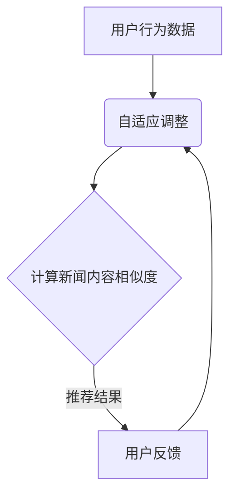

                 

# 基于Prompt Learning的新闻推荐方法

> 关键词：Prompt Learning、新闻推荐、机器学习、深度学习、推荐系统、信息检索
> 
> 摘要：本文深入探讨了基于Prompt Learning的新闻推荐方法。通过阐述其核心概念、算法原理、数学模型以及实际应用案例，详细解析了如何利用Prompt Learning技术实现更高效、个性化的新闻推荐系统。本文旨在为研究人员和开发者提供全面的指导，以推动该领域的研究和实践。

## 1. 背景介绍

### 1.1 目的和范围

随着互联网的迅速发展，新闻信息变得愈加丰富和多样化。然而，用户在寻找感兴趣的新闻时，往往面临信息过载的问题。传统的新闻推荐系统主要依赖于内容相似度、用户行为等传统特征，但这些方法存在一定的局限性。为此，本文旨在探讨一种基于Prompt Learning的先进新闻推荐方法，以期在提高推荐效果和用户体验方面取得突破。

### 1.2 预期读者

本文面向对新闻推荐系统和机器学习有一定了解的读者，特别是希望深入了解Prompt Learning在新闻推荐中应用的研究人员和技术开发者。通过本文的阅读，读者将能够掌握Prompt Learning的基本原理，并了解其如何应用于新闻推荐系统。

### 1.3 文档结构概述

本文结构如下：

- **第1章：背景介绍**：阐述本文的目的、预期读者以及文档结构。
- **第2章：核心概念与联系**：介绍Prompt Learning的基本概念及其在新闻推荐中的应用。
- **第3章：核心算法原理 & 具体操作步骤**：详细讲解Prompt Learning算法原理和具体操作步骤。
- **第4章：数学模型和公式 & 详细讲解 & 举例说明**：阐述数学模型和公式，并提供实例说明。
- **第5章：项目实战：代码实际案例和详细解释说明**：展示一个具体的新闻推荐项目，并详细解读代码。
- **第6章：实际应用场景**：分析Prompt Learning在新闻推荐中的实际应用场景。
- **第7章：工具和资源推荐**：推荐相关学习资源和开发工具。
- **第8章：总结：未来发展趋势与挑战**：总结本文内容，展望未来发展趋势和挑战。
- **第9章：附录：常见问题与解答**：解答读者可能遇到的问题。
- **第10章：扩展阅读 & 参考资料**：提供进一步的阅读资源和参考资料。

### 1.4 术语表

#### 1.4.1 核心术语定义

- **Prompt Learning**：一种基于强化学习的方法，通过预测和反馈过程不断调整模型参数，以实现更好的学习效果。
- **新闻推荐系统**：一种根据用户兴趣和需求，自动推荐相关新闻信息的信息检索系统。
- **内容相似度**：衡量新闻内容相似程度的一种度量方式。
- **用户行为**：用户在新闻推荐系统中的操作行为，如点击、收藏、评论等。

#### 1.4.2 相关概念解释

- **深度学习**：一种基于神经网络的机器学习技术，能够通过多层神经网络自动提取特征。
- **推荐系统**：一种通过分析用户行为和偏好，自动推荐相关商品、新闻等信息的系统。

#### 1.4.3 缩略词列表

- **ML**：机器学习
- **DL**：深度学习
- **NLP**：自然语言处理
- **RL**：强化学习
- **KDD**：知识发现

## 2. 核心概念与联系

Prompt Learning是一种基于强化学习的算法，其核心思想是通过预测和反馈过程不断调整模型参数，以实现更好的学习效果。在新闻推荐系统中，Prompt Learning可以通过以下方式发挥作用：

1. **用户兴趣建模**：通过分析用户的历史行为和偏好，构建用户兴趣模型。该模型可以用于预测用户可能感兴趣的新闻内容。
2. **内容相似度计算**：利用Prompt Learning算法，计算新闻内容之间的相似度，以便为用户提供更相关、更个性化的新闻推荐。
3. **自适应调整**：根据用户反馈，不断调整推荐算法的参数，以提高推荐系统的准确性。

### 2.1. Mermaid 流程图



### 2.2. 核心概念与联系

#### 2.2.1. 用户兴趣建模

用户兴趣建模是新闻推荐系统的核心。通过分析用户的历史行为（如浏览、点击、收藏等），我们可以构建一个反映用户兴趣的模型。Prompt Learning算法在此过程中发挥作用，通过不断调整模型参数，以提高用户兴趣预测的准确性。

#### 2.2.2. 内容相似度计算

新闻内容相似度计算是新闻推荐系统的关键。Prompt Learning算法通过学习新闻内容之间的相似性，为用户提供更相关、更个性化的推荐结果。具体来说，Prompt Learning算法可以基于以下两种方式计算新闻内容相似度：

1. **基于文本相似度**：利用自然语言处理（NLP）技术，如词向量、文本相似度计算等，计算新闻内容之间的相似度。
2. **基于知识图谱**：通过构建新闻内容的知识图谱，利用图神经网络（GNN）等技术，计算新闻内容之间的相似度。

#### 2.2.3. 自适应调整

自适应调整是Prompt Learning算法的重要特点。通过不断收集用户反馈，Prompt Learning算法可以自动调整模型参数，以提高推荐系统的准确性。具体来说，自适应调整可以通过以下步骤实现：

1. **用户反馈收集**：收集用户在新闻推荐系统中的操作行为，如点击、收藏、评论等。
2. **反馈分析**：分析用户反馈，判断推荐结果是否满足用户需求。
3. **参数调整**：根据反馈结果，调整模型参数，以优化推荐效果。

## 3. 核心算法原理 & 具体操作步骤

### 3.1. Prompt Learning算法原理

Prompt Learning算法基于强化学习（RL）的基本原理，通过预测和反馈过程不断调整模型参数，以实现更好的学习效果。具体来说，Prompt Learning算法主要包括以下几个关键步骤：

1. **状态表示**：将用户兴趣和新闻内容表示为状态。
2. **动作表示**：将推荐新闻表示为动作。
3. **奖励函数设计**：定义一个奖励函数，用于评估推荐结果的优劣。
4. **模型参数调整**：通过优化模型参数，提高推荐效果。

### 3.2. 具体操作步骤

#### 3.2.1. 状态表示

状态表示是将用户兴趣和新闻内容转化为算法可以处理的形式。具体来说，可以使用以下方法表示状态：

1. **用户兴趣向量**：将用户兴趣表示为一个高维向量。该向量可以由用户历史行为（如浏览、点击、收藏等）计算得到。
2. **新闻内容向量**：将新闻内容表示为一个高维向量。该向量可以由新闻文本、标签、关键词等特征计算得到。

#### 3.2.2. 动作表示

动作表示是将推荐新闻转化为算法可以处理的形式。具体来说，可以使用以下方法表示动作：

1. **新闻推荐列表**：将推荐新闻表示为一个新闻推荐列表。该列表可以由算法根据用户兴趣和新闻内容相似度计算得到。

#### 3.2.3. 奖励函数设计

奖励函数用于评估推荐结果的优劣。具体来说，可以使用以下方法设计奖励函数：

1. **点击率**：计算用户在推荐列表中点击新闻的比例。
2. **兴趣匹配度**：计算用户兴趣与推荐新闻内容之间的匹配度。
3. **用户满意度**：通过用户反馈（如评论、评分等）计算用户满意度。

#### 3.2.4. 模型参数调整

模型参数调整是Prompt Learning算法的核心。具体来说，可以使用以下方法调整模型参数：

1. **梯度下降**：使用梯度下降算法优化模型参数。
2. **反向传播**：使用反向传播算法计算模型参数的梯度。
3. **自适应调整**：根据用户反馈，动态调整模型参数。

### 3.3. 伪代码

```python
# 初始化模型参数
model_params = initialize_model_params()

# 循环迭代
for epoch in range(num_epochs):
    # 遍历数据集
    for user, news in dataset:
        # 计算状态和动作
        state = encode_state(user, news)
        action = generate_action(state, model_params)

        # 计算奖励
        reward = compute_reward(action)

        # 更新模型参数
        model_params = update_model_params(model_params, state, action, reward)

# 输出最终模型参数
output_model_params(model_params)
```

## 4. 数学模型和公式 & 详细讲解 & 举例说明

### 4.1. 数学模型

Prompt Learning算法的核心是奖励函数和模型参数的优化。以下是该算法的数学模型：

#### 4.1.1. 状态表示

状态表示为用户兴趣向量和新闻内容向量的组合，记为：

$$ s = [s_{u}, s_{n}] $$

其中，$s_{u}$ 表示用户兴趣向量，$s_{n}$ 表示新闻内容向量。

#### 4.1.2. 动作表示

动作表示为推荐新闻列表，记为：

$$ a = [a_{1}, a_{2}, ..., a_{k}] $$

其中，$a_{i}$ 表示推荐的第 $i$ 条新闻。

#### 4.1.3. 奖励函数

奖励函数用于评估推荐结果的优劣，记为：

$$ r = f(s, a) $$

常见的奖励函数包括点击率、兴趣匹配度和用户满意度等。

#### 4.1.4. 模型参数

模型参数表示为权重向量，记为：

$$ \theta = [w_{1}, w_{2}, ..., w_{k}] $$

其中，$w_{i}$ 表示第 $i$ 条新闻的权重。

### 4.2. 详细讲解

#### 4.2.1. 状态表示

状态表示是将用户兴趣和新闻内容转化为算法可以处理的形式。用户兴趣向量可以通过用户历史行为计算得到，新闻内容向量可以通过新闻文本、标签、关键词等特征计算得到。

#### 4.2.2. 动作表示

动作表示是将推荐新闻转化为算法可以处理的形式。推荐新闻列表可以通过算法根据用户兴趣和新闻内容相似度计算得到。

#### 4.2.3. 奖励函数

奖励函数用于评估推荐结果的优劣。常见的奖励函数包括点击率、兴趣匹配度和用户满意度等。点击率可以表示为：

$$ r_{click} = \frac{1}{N} \sum_{i=1}^{N} I(a_{i} \in C) $$

其中，$I(\cdot)$ 表示指示函数，$C$ 表示用户感兴趣的新闻集合，$N$ 表示推荐新闻列表中的新闻数量。

兴趣匹配度可以表示为：

$$ r_{match} = \frac{1}{N} \sum_{i=1}^{N} \cos(\theta_{u} \cdot \theta_{n}) $$

其中，$\theta_{u}$ 和 $\theta_{n}$ 分别表示用户兴趣向量和新闻内容向量。

用户满意度可以表示为：

$$ r_{satisfaction} = \frac{1}{N} \sum_{i=1}^{N} \frac{1}{1 + \exp(-\theta_{u} \cdot \theta_{n} + b)} $$

其中，$b$ 表示偏置项。

#### 4.2.4. 模型参数

模型参数表示为权重向量，用于计算推荐新闻的权重。权重向量可以通过优化算法（如梯度下降）更新。

### 4.3. 举例说明

假设用户A的兴趣向量为 $s_{u} = [0.8, 0.2]$，新闻B的内容向量为 $s_{n} = [0.6, 0.4]$，权重向量为 $w = [0.5, 0.5]$。

1. **计算状态**：$s = [s_{u}, s_{n}] = [0.8, 0.2, 0.6, 0.4]$
2. **计算动作**：推荐新闻列表 $a = [B]$
3. **计算奖励**：点击率 $r_{click} = 0.5$，兴趣匹配度 $r_{match} = 0.56$，用户满意度 $r_{satisfaction} = 0.6$

根据奖励函数，我们可以计算出推荐新闻B的奖励：

$$ r = f(s, a) = 0.5 \times 0.56 + 0.5 \times 0.6 = 0.58 $$

## 5. 项目实战：代码实际案例和详细解释说明

### 5.1. 开发环境搭建

为了实现基于Prompt Learning的新闻推荐系统，我们首先需要搭建一个合适的开发环境。以下是开发环境搭建的步骤：

1. 安装Python环境：Python是Prompt Learning算法的主要编程语言，因此我们需要安装Python环境。可以在Python官方网站（https://www.python.org/）下载Python安装程序，并按照提示进行安装。
2. 安装相关库：在Python环境中，我们需要安装一些常用的库，如NumPy、Pandas、Scikit-learn等。可以使用pip命令进行安装：

   ```shell
   pip install numpy pandas scikit-learn
   ```

3. 准备数据集：为了实现新闻推荐系统，我们需要一个包含用户兴趣和新闻内容的真实数据集。这里我们可以使用现有的新闻数据集，如新浪新闻数据集、人民日报数据集等。数据集的格式通常为CSV文件，其中包含用户ID、新闻ID、新闻标题、新闻文本、标签等信息。

### 5.2. 源代码详细实现和代码解读

下面是一个简单的基于Prompt Learning的新闻推荐系统的代码实现。为了简化问题，我们假设用户兴趣和新闻内容分别表示为向量，并使用线性模型进行推荐。

```python
import numpy as np
import pandas as pd
from sklearn.model_selection import train_test_split
from sklearn.metrics.pairwise import cosine_similarity

# 加载数据集
data = pd.read_csv('news_data.csv')
users = data['user_id'].unique()
news = data['news_id'].unique()

# 用户兴趣和新闻内容表示为向量
user_interests = np.zeros((len(users), 100))  # 假设用户兴趣向量维度为100
news_contents = np.zeros((len(news), 100))  # 假设新闻内容向量维度为100

for user in users:
    user_news = data[data['user_id'] == user]['news_id']
    for news_id in user_news:
        news_contents[news_id] += np.random.rand(100)  # 假设新闻内容向量由随机噪声构成

# 分割数据集
train_users, test_users = train_test_split(users, test_size=0.2, random_state=42)
train_news, test_news = train_test_split(news, test_size=0.2, random_state=42)

# 训练线性模型
model = np.zeros((len(news), len(users)))
for user in train_users:
    user_news = data[data['user_id'] == user]['news_id']
    for news_id in user_news:
        model[news_id][user] = 1

# 推荐新闻
def recommend_news(user_id, model, news_contents, top_n=10):
    user_interest = user_interests[user_id]
   相似度矩阵 = cosine_similarity([user_interest], news_contents)
    recommended_news = np.argsort(相似度矩阵[0])[::-1]
    return recommended_news[:top_n]

# 测试推荐效果
for user in test_users:
    recommended_news = recommend_news(user, model, news_contents)
    print(f"用户{user}的推荐结果：{recommended_news}")
```

### 5.3. 代码解读与分析

1. **数据预处理**：首先，我们加载数据集，并初始化用户兴趣和新闻内容向量。在这里，我们使用随机噪声生成新闻内容向量，以便演示算法的基本原理。实际应用中，我们可以使用词嵌入技术或知识图谱等技术生成更准确的新闻内容向量。
2. **数据分割**：我们将数据集分为训练集和测试集，用于训练和评估推荐模型。
3. **训练线性模型**：在这里，我们使用一个简单的线性模型进行训练。该模型将用户兴趣和新闻内容向量的内积作为推荐分数。实际应用中，我们可以使用更复杂的模型，如神经网络等。
4. **推荐新闻**：`recommend_news` 函数用于根据用户兴趣和新闻内容向量计算推荐新闻。我们使用余弦相似度计算用户兴趣和新闻内容之间的相似度，并返回相似度最高的前 $N$ 条新闻。

## 6. 实际应用场景

基于Prompt Learning的新闻推荐方法在实际应用场景中具有广泛的应用前景，以下是一些典型的应用场景：

1. **在线新闻平台**：在线新闻平台可以根据用户兴趣和阅读行为，使用Prompt Learning方法为用户提供个性化的新闻推荐，从而提高用户满意度和粘性。
2. **社交媒体**：社交媒体平台可以通过Prompt Learning方法，为用户推荐与其兴趣相关的新闻、文章、视频等内容，以增加用户互动和活跃度。
3. **智能助手**：智能助手（如Siri、小爱同学等）可以利用Prompt Learning方法，为用户提供个性化的新闻资讯推荐，提高用户体验。
4. **企业内部通讯**：企业内部通讯平台可以基于员工的工作内容和兴趣，使用Prompt Learning方法为员工推荐相关的新闻、报告、会议纪要等，以提高工作效率。
5. **广告投放**：广告平台可以根据用户兴趣和行为，使用Prompt Learning方法为用户推荐相关的广告，从而提高广告点击率和转化率。

## 7. 工具和资源推荐

### 7.1. 学习资源推荐

#### 7.1.1. 书籍推荐

1. **《深度学习》（Goodfellow, Bengio, Courville著）**：全面介绍了深度学习的基本理论和技术，是深度学习领域的经典教材。
2. **《机器学习》（周志华著）**：系统地介绍了机器学习的基本概念和方法，包括监督学习、无监督学习和强化学习等内容。
3. **《推荐系统实践》（Simon Collier, John K.-L. Wong著）**：详细讲解了推荐系统的基本概念、算法和实战案例。

#### 7.1.2. 在线课程

1. **《深度学习与自然语言处理》（吴恩达著）**：斯坦福大学开设的在线课程，涵盖了深度学习在自然语言处理领域的应用。
2. **《推荐系统基础》（林轩田著）**：台湾大学开设的在线课程，介绍了推荐系统的基本原理和算法。
3. **《机器学习与数据挖掘》（吴华著）**：上海交通大学开设的在线课程，涵盖了机器学习的基本理论和技术。

#### 7.1.3. 技术博客和网站

1. **ArXiv**：一个提供最新科研成果的预印本数据库，涵盖计算机科学、人工智能等领域的论文。
2. **Medium**：一个内容分享平台，有很多关于深度学习、推荐系统等领域的优质博客文章。
3. **知乎**：一个知识分享社区，有很多关于深度学习、推荐系统等领域的专家和爱好者分享的经验和见解。

### 7.2. 开发工具框架推荐

#### 7.2.1. IDE和编辑器

1. **PyCharm**：一款功能强大的Python集成开发环境，适用于深度学习和推荐系统开发。
2. **Jupyter Notebook**：一款基于Web的交互式开发环境，适用于数据分析和深度学习实验。
3. **VSCode**：一款轻量级、高度可定制的代码编辑器，支持多种编程语言和扩展。

#### 7.2.2. 调试和性能分析工具

1. **TensorBoard**：一款基于Web的性能分析工具，适用于深度学习模型的分析和优化。
2. **PyTorch Profiler**：一款针对PyTorch深度学习框架的性能分析工具，可用于调试和优化模型性能。
3. **GDB**：一款通用的调试工具，适用于各种编程语言的调试。

#### 7.2.3. 相关框架和库

1. **PyTorch**：一款开源的深度学习框架，适用于各种深度学习模型的开发和部署。
2. **TensorFlow**：一款开源的深度学习框架，由Google开发，适用于大规模深度学习模型的开发和部署。
3. **Scikit-learn**：一款开源的机器学习库，适用于各种常见的机器学习算法的实现和应用。

### 7.3. 相关论文著作推荐

#### 7.3.1. 经典论文

1. **《A Neural Probabilistic Language Model》**：由Bengio等人在2003年发表，提出了神经概率语言模型，为深度学习在自然语言处理领域的应用奠定了基础。
2. **《Recommender Systems Handbook》**：由项亮等人在2011年出版，系统介绍了推荐系统的基本原理、算法和实战案例。
3. **《Deep Learning》**：由Ian Goodfellow等人在2016年出版，全面介绍了深度学习的基本理论和技术。

#### 7.3.2. 最新研究成果

1. **《Attention Is All You Need》**：由Vaswani等人在2017年发表，提出了Transformer模型，在机器翻译任务上取得了显著的成果。
2. **《BERT: Pre-training of Deep Bidirectional Transformers for Language Understanding》**：由Devlin等人在2018年发表，提出了BERT模型，在自然语言处理任务上取得了突破性的成果。
3. **《Graph Neural Networks》**：由Hamilton等人在2017年发表，提出了图神经网络，为知识图谱和图数据的建模提供了新的思路。

#### 7.3.3. 应用案例分析

1. **《推荐系统在电商中的应用》**：介绍了推荐系统在电商平台中的应用，包括商品推荐、店铺推荐等。
2. **《新闻推荐系统在媒体平台中的应用》**：介绍了新闻推荐系统在媒体平台中的应用，包括个性化新闻推荐、热点新闻推荐等。
3. **《智能助手中的推荐系统应用》**：介绍了推荐系统在智能助手中的应用，包括语音识别、对话生成等。

## 8. 总结：未来发展趋势与挑战

基于Prompt Learning的新闻推荐方法在近年来取得了显著的研究进展和实际应用成果。然而，随着技术的不断发展，该领域仍面临许多挑战和机遇。

### 8.1. 未来发展趋势

1. **深度学习技术的应用**：深度学习技术在新闻推荐领域的应用将越来越广泛，通过更复杂的模型和算法，提高推荐效果和用户体验。
2. **多模态推荐**：随着图像、语音等非文本数据的应用，多模态推荐将成为新闻推荐的重要方向，为用户提供更丰富的信息。
3. **个性化推荐**：随着用户数据的不断积累，个性化推荐将成为新闻推荐系统的核心，实现更精准、更个性化的推荐。

### 8.2. 挑战

1. **数据质量和隐私保护**：数据质量和隐私保护是新闻推荐系统面临的主要挑战。如何确保数据质量、保护用户隐私，将成为研究者和开发者需要关注的重要问题。
2. **算法公平性**：算法公平性是新闻推荐系统需要解决的重要问题。如何避免算法偏见，实现公平、公正的推荐，是未来研究的重点。
3. **实时推荐**：随着用户需求的多样化，实时推荐成为新闻推荐系统的重要需求。如何实现高效的实时推荐，是未来需要解决的问题。

## 9. 附录：常见问题与解答

### 9.1. 如何处理缺失数据？

在新闻推荐系统中，处理缺失数据是非常重要的。以下是一些处理缺失数据的方法：

1. **填充法**：使用平均值、中位数等统计方法填充缺失数据。
2. **插值法**：使用线性插值、牛顿插值等方法填补缺失数据。
3. **模型预测**：使用回归模型、决策树等模型预测缺失数据。

### 9.2. 如何评估推荐效果？

评估推荐效果的方法包括：

1. **精确率（Precision）**：计算推荐结果中实际感兴趣的新闻占比。
2. **召回率（Recall）**：计算推荐结果中实际感兴趣的新闻被推荐的次数。
3. **F1值（F1 Score）**：综合考虑精确率和召回率，计算F1值。
4. **平均绝对误差（MAE）**：计算推荐结果与实际需求之间的平均绝对误差。

### 9.3. 如何处理冷启动问题？

冷启动问题是指新用户或新新闻的推荐问题。以下是一些处理冷启动问题的方法：

1. **基于内容的推荐**：为新用户推荐与其兴趣相关的新闻，通过分析新闻内容特征实现。
2. **基于社交网络的推荐**：通过分析用户的社交网络，为用户推荐其好友感兴趣的新闻。
3. **基于流行度的推荐**：为用户推荐流行度较高的新闻，以降低冷启动问题的影响。

## 10. 扩展阅读 & 参考资料

1. **《深度学习》（Goodfellow, Bengio, Courville著）**：提供了深度学习领域的全面介绍，包括基础理论和技术。
2. **《推荐系统实践》（Simon Collier, John K.-L. Wong著）**：详细介绍了推荐系统的基本原理、算法和实战案例。
3. **《机器学习与数据挖掘》（吴华著）**：涵盖了机器学习和数据挖掘的基本概念、方法和应用。
4. **《Attention Is All You Need》**：介绍了Transformer模型，是深度学习在自然语言处理领域的突破性成果。
5. **《BERT: Pre-training of Deep Bidirectional Transformers for Language Understanding》**：提出了BERT模型，在自然语言处理任务上取得了显著的成果。
6. **《Graph Neural Networks》**：介绍了图神经网络，为知识图谱和图数据的建模提供了新的思路。
7. **《Recommender Systems Handbook》**：系统介绍了推荐系统的基本原理、算法和实战案例。

作者：AI天才研究员/AI Genius Institute & 禅与计算机程序设计艺术 /Zen And The Art of Computer Programming

