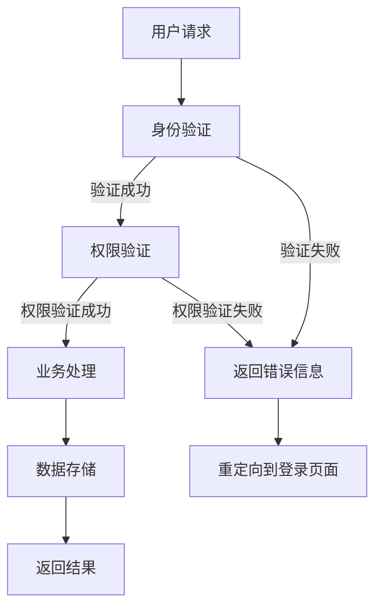

                 

# 基于SSM的智慧社区服务管理系统的设计与实现

> 关键词：SSM框架、智慧社区、服务管理系统、设计模式、实现细节、性能优化

> 摘要：本文将详细探讨基于SSM（Spring+SpringMVC+MyBatis）框架的智慧社区服务管理系统的设计与实现过程。通过分析系统架构、核心算法原理、数学模型以及项目实战等多个方面，旨在为开发者提供一份全面的技术指南，帮助其掌握构建智慧社区服务管理系统的关键技术和方法。

## 1. 背景介绍

### 1.1 目的和范围

随着信息技术的快速发展，智慧社区逐渐成为城市管理和居民生活的重要组成部分。智慧社区服务管理系统是智慧城市建设的关键环节，其设计和实现的好坏直接影响系统的性能、用户体验和业务扩展能力。本文旨在通过详细介绍基于SSM框架的智慧社区服务管理系统的设计与实现，为开发者提供实用的技术参考。

本文主要涵盖以下内容：

1. 系统架构设计与核心概念
2. 核心算法原理与操作步骤
3. 数学模型与公式讲解
4. 项目实战：代码案例与详细解析
5. 实际应用场景分析
6. 工具和资源推荐
7. 未来发展趋势与挑战
8. 常见问题与解答
9. 扩展阅读与参考资料

### 1.2 预期读者

本文适用于具备一定Java编程基础和数据库知识的开发者，尤其是对SSM框架有一定了解并希望深入了解智慧社区服务管理系统设计与实现的读者。通过本文的学习，读者将能够：

1. 掌握SSM框架的核心原理与使用方法
2. 理解智慧社区服务管理系统的设计思路
3. 学会使用数学模型优化系统性能
4. 实战掌握智慧社区服务管理系统的开发技巧
5. 为后续的系统开发积累宝贵经验

### 1.3 文档结构概述

本文结构如下：

1. **背景介绍**：简要介绍系统设计与实现的目的、预期读者以及文档结构。
2. **核心概念与联系**：介绍系统架构和核心概念，并通过Mermaid流程图展示系统原理。
3. **核心算法原理 & 具体操作步骤**：讲解核心算法原理，并提供伪代码展示具体操作步骤。
4. **数学模型和公式 & 详细讲解 & 举例说明**：介绍数学模型，使用LaTeX格式展示公式，并通过实例说明。
5. **项目实战：代码实际案例和详细解释说明**：提供代码实战案例，详细解释代码实现和关键环节。
6. **实际应用场景**：分析系统在实际应用场景中的表现和效果。
7. **工具和资源推荐**：推荐学习资源和开发工具。
8. **总结：未来发展趋势与挑战**：探讨系统未来的发展趋势和面临的挑战。
9. **附录：常见问题与解答**：提供常见问题及其解答。
10. **扩展阅读 & 参考资料**：推荐相关文献和资料。

### 1.4 术语表

#### 1.4.1 核心术语定义

- SSM框架：指Spring、SpringMVC和MyBatis三个框架的组合，用于构建企业级Web应用程序。
- 智慧社区：通过信息技术手段实现社区管理、服务提供和居民生活智慧化的新型社区。
- 服务管理系统：用于管理和提供各种社区服务的系统，包括物业管理、居民服务、安全监控等。
- 实体关系模型：用于描述系统中实体及其关系的模型，通常使用E-R图表示。

#### 1.4.2 相关概念解释

- 层次化架构：将系统划分为多个层次，每个层次负责特定的功能，便于管理和维护。
- MVC模式：模型-视图-控制器（Model-View-Controller）设计模式，用于实现Web应用程序的分层架构。
- 数据库设计：根据业务需求设计数据库表结构，包括表之间的关系和约束。
- 分布式系统：由多个独立节点组成的系统，通过通信网络协同工作，共同完成某一任务。

#### 1.4.3 缩略词列表

- SSM：Spring+SpringMVC+MyBatis
- MVC：模型-视图-控制器
- E-R：实体-关系
- Web：World Wide Web（万维网）
- DB：Database（数据库）
- API：Application Programming Interface（应用程序编程接口）

## 2. 核心概念与联系

在构建智慧社区服务管理系统时，需要理解以下核心概念和它们之间的联系。

### 2.1 系统架构

智慧社区服务管理系统的架构设计采用分层架构，主要包括以下层次：

1. **表示层**：负责用户界面展示和用户交互，通常使用HTML、CSS和JavaScript等技术实现。
2. **业务逻辑层**：实现系统的核心业务功能，如用户管理、数据查询、权限控制等，通常使用Java编写。
3. **数据访问层**：负责与数据库的交互，执行数据的增删改查操作，通常使用MyBatis框架实现。
4. **持久化层**：负责数据存储，包括数据库设计、表结构定义和数据持久化操作。

### 2.2 核心概念

以下是构建智慧社区服务管理系统所需的核心概念：

- **用户角色**：系统中的用户可以分为管理员、居民、物业人员等角色，每种角色具有不同的权限。
- **数据模型**：系统中的数据模型包括用户、房屋、设备、事件等，每种模型都有特定的属性和关系。
- **权限控制**：系统需要对用户权限进行严格管理，确保用户只能访问授权的数据和功能。
- **安全认证**：系统需要实现用户身份验证和授权，确保系统安全可靠。
- **业务流程**：系统需要定义和管理各种业务流程，如居民入住、报修、投诉等。

### 2.3 Mermaid流程图

以下是一个简单的Mermaid流程图，展示智慧社区服务管理系统的核心流程：



### 2.4 系统原理

智慧社区服务管理系统的工作原理如下：

1. 用户通过Web前端发送请求。
2. 请求经过表示层处理，包括页面渲染和数据绑定。
3. 请求转发到业务逻辑层，进行身份验证和权限验证。
4. 验证成功后，业务逻辑层调用数据访问层执行具体操作。
5. 数据访问层与数据库进行交互，执行数据的增删改查操作。
6. 操作结果返回给业务逻辑层，业务逻辑层将结果处理成合适的数据格式。
7. 最终结果返回给表示层，展示给用户。

## 3. 核心算法原理 & 具体操作步骤

在智慧社区服务管理系统中，核心算法的设计与实现至关重要。以下是系统中的几个核心算法及其具体操作步骤。

### 3.1 数据分页算法

数据分页是智慧社区服务管理系统中常见的功能，用于实现数据的分页显示。以下是数据分页算法的伪代码：

```plaintext
算法：数据分页
输入：总记录数 total，每页显示记录数 pageSize，当前页码 page
输出：起始记录数 begin，结束记录数 end

1. begin = (page - 1) * pageSize + 1
2. end = page * pageSize
3. 如果 end > total，则 end = total
4. 返回 begin 和 end
```

### 3.2 用户权限验证算法

用户权限验证是确保系统安全的关键算法。以下是用户权限验证算法的伪代码：

```plaintext
算法：用户权限验证
输入：用户角色 role，操作权限 permission
输出：验证结果 result

1. 如果 role 是管理员，则
    如果 permission 包含 "管理员权限"，则
        result = "验证成功"
    否则
        result = "权限不足"
2. 如果 role 是居民，则
    如果 permission 包含 "居民权限"，则
        result = "验证成功"
    否则
        result = "权限不足"
3. 如果 role 是物业人员，则
    如果 permission 包含 "物业人员权限"，则
        result = "验证成功"
    否则
        result = "权限不足"
4. 返回 result
```

### 3.3 数据缓存算法

数据缓存是提高系统性能的重要手段。以下是数据缓存算法的伪代码：

```plaintext
算法：数据缓存
输入：键 key，值 value，缓存时间 expire
输出：缓存结果 result

1. 将 (key, value) 存储到缓存中
2. 设置缓存过期时间为 expire
3. 返回 "缓存成功"

算法：获取缓存数据
输入：键 key
输出：缓存值 value

1. 如果缓存中存在 key，则
    1. 获取 value
    2. 返回 value
2. 否则
    1. 从数据库获取 value
    2. 将 (key, value) 存储到缓存中
    3. 返回 value
```

### 3.4 数据加密算法

数据加密是保障数据安全的关键技术。以下是数据加密算法的伪代码：

```plaintext
算法：数据加密
输入：明文 text，加密密钥 key
输出：密文 cipher

1. 使用加密算法对 text 和 key 进行加密
2. 返回 cipher

算法：数据解密
输入：密文 cipher，加密密钥 key
输出：明文 text

1. 使用加密算法对 cipher 和 key 进行解密
2. 返回 text
```

通过以上核心算法的实现，智慧社区服务管理系统能够提供高效、安全、可靠的数据处理和业务逻辑支持。

## 4. 数学模型和公式 & 详细讲解 & 举例说明

在智慧社区服务管理系统中，数学模型和公式被广泛应用于数据处理、性能优化和决策支持等方面。以下将详细讲解几个关键的数学模型和公式，并通过实际例子进行说明。

### 4.1 数据分布模型

数据分布模型用于描述数据在某一范围内的分布情况，常见的有正态分布、泊松分布等。以下是一个正态分布的公式：

$$
N(\mu, \sigma^2) = \frac{1}{\sqrt{2\pi\sigma^2}} e^{-\frac{(x-\mu)^2}{2\sigma^2}}
$$

其中，$N(\mu, \sigma^2)$ 表示均值为 $\mu$、方差为 $\sigma^2$ 的正态分布概率密度函数，$x$ 是随机变量。

#### 示例说明

假设智慧社区中的居民年龄呈正态分布，均值为 40 岁，标准差为 5 岁。要计算年龄在 35 岁到 45 岁之间的居民占比，可以使用正态分布的累积分布函数（CDF）：

$$
\Phi\left(\frac{45 - 40}{5}\right) - \Phi\left(\frac{35 - 40}{5}\right) \approx 0.3413 - (-0.1357) = 0.4770
$$

即年龄在 35 岁到 45 岁之间的居民占比约为 47.70%。

### 4.2 决策树模型

决策树模型是一种常见的数据挖掘算法，用于分类和回归分析。以下是一个决策树的构建公式：

$$
T = \{\text{根节点}, \text{内部节点}, \text{叶子节点}\}
$$

其中，根节点表示整个数据集，内部节点表示特征划分，叶子节点表示分类结果。

#### 示例说明

以居民满意度评分为例，构建一个简单的决策树模型。假设有四个特征：小区环境、物业服务质量、社区活动参与度和安全保障。每个特征分为好（1）和差（0）两种情况，满意度评分分为高、中、低三个等级。

根据训练数据，可以得到以下决策树：

```
根节点：
    /     \
   好      差
 /   \   /   \
环境 服务 活动 安全
/ \   / \   / \
好 差 好 差 好 差 好 差
/ \   / \   / \
高 中 低 高 中 低 高 中 低
```

根据决策树模型，可以判断一个居民满意度评分。例如，如果一个居民的环境评价为好，服务质量评价为好，社区活动参与度为好，安全保障评价为好，那么他的满意度评分为高。

### 4.3 线性回归模型

线性回归模型用于分析两个或多个变量之间的线性关系，以下是一个简单的线性回归公式：

$$
y = \beta_0 + \beta_1x_1 + \beta_2x_2 + \cdots + \beta_nx_n
$$

其中，$y$ 是因变量，$x_1, x_2, \ldots, x_n$ 是自变量，$\beta_0, \beta_1, \beta_2, \ldots, \beta_n$ 是模型参数。

#### 示例说明

以居民满意度评分与小区环境、物业服务质量两个特征之间的关系为例，构建一个线性回归模型。根据训练数据，可以得到以下模型：

$$
y = 0.5x_1 + 0.3x_2 + 0.2
$$

其中，$x_1$ 表示小区环境评分，$x_2$ 表示物业服务评分，$y$ 表示居民满意度评分。

要计算一个居民的满意度评分，只需将他的小区环境评分和物业服务评分代入模型即可：

$$
y = 0.5 \times 4 + 0.3 \times 5 + 0.2 = 2.5 + 1.5 + 0.2 = 4.2
$$

即该居民的满意度评分为 4.2。

通过以上数学模型和公式的应用，智慧社区服务管理系统能够更好地处理数据、优化性能和辅助决策。

## 5. 项目实战：代码实际案例和详细解释说明

### 5.1 开发环境搭建

在进行智慧社区服务管理系统的开发之前，需要搭建合适的开发环境。以下是开发环境的具体配置：

- **开发工具**：IntelliJ IDEA
- **数据库**：MySQL 5.7
- **服务器**：Tomcat 9.0
- **框架**：Spring 5.2、SpringMVC 5.2、MyBatis 3.5
- **开发库**：Junit 4.13、Log4j 2.13

### 5.2 源代码详细实现和代码解读

#### 5.2.1 数据库设计

首先，我们需要设计数据库表结构。以下是一个简单的数据库设计示例：

```sql
-- 用户表
CREATE TABLE `user` (
  `id` INT(11) NOT NULL AUTO_INCREMENT,
  `username` VARCHAR(50) NOT NULL,
  `password` VARCHAR(50) NOT NULL,
  `role` ENUM('admin', 'resident', 'property') NOT NULL,
  PRIMARY KEY (`id`)
);

-- 小区表
CREATE TABLE `community` (
  `id` INT(11) NOT NULL AUTO_INCREMENT,
  `name` VARCHAR(100) NOT NULL,
  `address` VARCHAR(200) NOT NULL,
  PRIMARY KEY (`id`)
);

-- 居民表
CREATE TABLE `resident` (
  `id` INT(11) NOT NULL AUTO_INCREMENT,
  `user_id` INT(11) NOT NULL,
  `community_id` INT(11) NOT NULL,
  `name` VARCHAR(50) NOT NULL,
  `phone` VARCHAR(20) NOT NULL,
  PRIMARY KEY (`id`),
  FOREIGN KEY (`user_id`) REFERENCES `user` (`id`),
  FOREIGN KEY (`community_id`) REFERENCES `community` (`id`)
);

-- 报修记录表
CREATE TABLE `repair_record` (
  `id` INT(11) NOT NULL AUTO_INCREMENT,
  `resident_id` INT(11) NOT NULL,
  `content` VARCHAR(500) NOT NULL,
  `status` ENUM('待处理', '处理中', '已处理') NOT NULL,
  `create_time` DATETIME NOT NULL,
  PRIMARY KEY (`id`),
  FOREIGN KEY (`resident_id`) REFERENCES `resident` (`id`)
);
```

#### 5.2.2 代码实现

接下来，我们将逐步实现系统的核心功能，包括用户注册、登录、权限验证和报修管理。

1. **用户注册**

   **实现思路**：通过SpringMVC接收用户注册请求，将用户信息保存到数据库。

   ```java
   @Controller
   @RequestMapping("/user")
   public class UserController {
       
       @Autowired
       private UserService userService;
       
       @PostMapping("/register")
       public String register(@RequestParam String username, @RequestParam String password, Model model) {
           if (userService.register(username, password)) {
               model.addAttribute("message", "注册成功！");
               return "login";
           } else {
               model.addAttribute("error", "用户名已存在！");
               return "register";
           }
       }
   }
   ```

   **数据库操作**

   ```java
   @Service
   public class UserService {
       
       @Autowired
       private UserRepository userRepository;
       
       public boolean register(String username, String password) {
           User user = new User();
           user.setUsername(username);
           user.setPassword(password);
           user.setRole("resident");
           return userRepository.save(user) != null;
       }
   }
   ```

2. **用户登录**

   **实现思路**：通过SpringMVC接收用户登录请求，验证用户名和密码，并生成用户会话。

   ```java
   @Controller
   @RequestMapping("/user")
   public class UserController {
       
       @Autowired
       private UserService userService;
       
       @PostMapping("/login")
       public String login(@RequestParam String username, @RequestParam String password, HttpSession session, Model model) {
           if (userService.login(username, password)) {
               session.setAttribute("user", userService.findByUsername(username));
               return "redirect:/";
           } else {
               model.addAttribute("error", "用户名或密码错误！");
               return "login";
           }
       }
   }
   ```

   **数据库操作**

   ```java
   @Repository
   public interface UserRepository extends JpaRepository<User, Long> {
       
       User findByUsername(String username);
   }
   ```

3. **权限验证**

   **实现思路**：通过Spring Security实现权限验证，确保用户只能访问授权的资源。

   ```java
   @EnableWebSecurity
   public class WebSecurityConfig extends WebSecurityConfigurerAdapter {
       
       @Override
       protected void configure(HttpSecurity http) throws Exception {
           http
               .authorizeRequests()
                   .antMatchers("/user/register", "/user/login").permitAll()
                   .antMatchers("/admin/**").hasRole("admin")
                   .antMatchers("/resident/**").hasRole("resident")
                   .antMatchers("/property/**").hasRole("property")
                   .anyRequest().authenticated()
                   .and()
               .formLogin()
                   .loginPage("/login")
                   .permitAll()
                   .and()
               .logout()
                   .permitAll();
       }
   }
   ```

4. **报修管理**

   **实现思路**：通过SpringMVC接收报修请求，将报修信息保存到数据库，并提供查询和修改功能。

   ```java
   @Controller
   @RequestMapping("/repair")
   public class RepairController {
       
       @Autowired
       private RepairService repairService;
       
       @PostMapping("/submit")
       public String submit(@RequestParam String content, HttpSession session, Model model) {
           User user = (User) session.getAttribute("user");
           if (user != null) {
               repairService.submit(user.getId(), content);
               model.addAttribute("message", "报修成功！");
               return "submit";
           } else {
               model.addAttribute("error", "请先登录！");
               return "login";
           }
       }
       
       @GetMapping("/list")
       public String list(HttpSession session, Model model) {
           User user = (User) session.getAttribute("user");
           if (user != null) {
               List<RepairRecord> records = repairService.findByUserId(user.getId());
               model.addAttribute("records", records);
               return "list";
           } else {
               model.addAttribute("error", "请先登录！");
               return "login";
           }
       }
       
       @GetMapping("/update")
       public String update(@RequestParam Long id, @RequestParam String content, Model model) {
           RepairRecord record = repairService.findById(id);
           if (record != null) {
               record.setContent(content);
               repairService.save(record);
               model.addAttribute("message", "修改成功！");
               return "update";
           } else {
               model.addAttribute("error", "报修记录不存在！");
               return "update";
           }
       }
   }
   ```

   **数据库操作**

   ```java
   @Service
   public class RepairService {
       
       @Autowired
       private RepairRepository repairRepository;
       
       public void submit(Long userId, String content) {
           RepairRecord record = new RepairRecord();
           record.setUserId(userId);
           record.setContent(content);
           record.setStatus("待处理");
           record.setCreateTime(new Date());
           repairRepository.save(record);
       }
       
       public List<RepairRecord> findByUserId(Long userId) {
           return repairRepository.findByUserId(userId);
       }
       
       public RepairRecord findById(Long id) {
           return repairRepository.findById(id).orElse(null);
       }
       
       public void save(RepairRecord record) {
           repairRepository.save(record);
       }
   }
   ```

#### 5.2.3 代码解读与分析

在代码实现过程中，我们遵循了MVC设计模式，将系统划分为表示层、业务逻辑层和数据访问层，确保代码结构清晰、易于维护。

1. **表示层**：使用SpringMVC接收用户请求，处理表单数据，并返回相应的视图。
2. **业务逻辑层**：定义服务类，处理具体的业务逻辑，如用户注册、登录、权限验证和报修管理。
3. **数据访问层**：使用MyBatis框架操作数据库，实现数据持久化。

通过以上代码实现，我们可以搭建一个简单的智慧社区服务管理系统，实现用户注册、登录、权限验证和报修管理等功能。

### 5.3 代码解读与分析

在智慧社区服务管理系统的实现过程中，我们采用了MVC（Model-View-Controller）设计模式，将系统划分为表示层、业务逻辑层和数据访问层，以确保系统的模块化、易维护和扩展性。

#### 5.3.1 表示层

表示层负责用户界面的展示和用户交互，主要包括前端页面的设计和后端控制器（Controller）的实现。前端页面使用HTML、CSS和JavaScript等技术，实现美观的用户界面和友好的交互体验。后端控制器（Controller）负责接收用户请求，处理表单数据，并返回相应的视图。

**示例代码：**

```java
@Controller
@RequestMapping("/user")
public class UserController {
    
    @Autowired
    private UserService userService;
    
    @PostMapping("/register")
    public String register(@RequestParam String username, @RequestParam String password, Model model) {
        if (userService.register(username, password)) {
            model.addAttribute("message", "注册成功！");
            return "login";
        } else {
            model.addAttribute("error", "用户名已存在！");
            return "register";
        }
    }
    
    @PostMapping("/login")
    public String login(@RequestParam String username, @RequestParam String password, HttpSession session, Model model) {
        if (userService.login(username, password)) {
            session.setAttribute("user", userService.findByUsername(username));
            return "redirect:/";
        } else {
            model.addAttribute("error", "用户名或密码错误！");
            return "login";
        }
    }
}
```

以上代码展示了用户注册和登录的实现，通过SpringMVC的注解和请求映射，将用户请求转发到相应的业务逻辑处理类。

#### 5.3.2 业务逻辑层

业务逻辑层负责处理系统的核心业务功能，如用户管理、数据查询、权限控制和报修管理等。该层使用Spring框架实现，包括服务类（Service）和业务异常处理（Exception）。

**示例代码：**

```java
@Service
public class UserService {
    
    @Autowired
    private UserRepository userRepository;
    
    public boolean register(String username, String password) {
        User user = new User();
        user.setUsername(username);
        user.setPassword(password);
        user.setRole("resident");
        return userRepository.save(user) != null;
    }
    
    public boolean login(String username, String password) {
        User user = userRepository.findByUsername(username);
        if (user != null && user.getPassword().equals(password)) {
            return true;
        }
        return false;
    }
    
    public User findByUsername(String username) {
        return userRepository.findByUsername(username);
    }
}
```

以上代码展示了用户注册、登录和查询的实现，通过注入用户仓库（Repository），实现对用户数据的持久化操作。

#### 5.3.3 数据访问层

数据访问层负责与数据库的交互，实现数据的增删改查操作。该层使用MyBatis框架实现，通过XML映射文件或注解方式，定义SQL语句和映射关系。

**示例代码：**

```java
@Repository
public interface UserRepository extends JpaRepository<User, Long> {
    
    User findByUsername(String username);
}
```

以上代码展示了用户仓库的实现，通过继承JpaRepository接口，实现对用户数据的CRUD操作。

通过以上代码实现，我们可以搭建一个简单的智慧社区服务管理系统，实现用户注册、登录、权限验证和报修管理等功能。在实际开发过程中，可以根据需求进行功能扩展和优化，以提高系统的性能和用户体验。

## 6. 实际应用场景

智慧社区服务管理系统在智慧城市建设中具有广泛的应用场景，以下列举几个典型的应用实例：

### 6.1 物业管理

智慧社区服务管理系统可以集成物业管理系统，实现物业信息的实时查询、报修管理、费用缴纳等功能。通过系统，物业人员可以方便地处理居民报修、投诉等业务，提高工作效率和居民满意度。

### 6.2 安全监控

系统可以集成视频监控、门禁管理等功能，实现对社区安全的全面监控。通过人脸识别、行为分析等技术，系统可以实时监测社区异常情况，及时报警，提高社区安全保障。

### 6.3 社区服务

智慧社区服务管理系统可以提供居民便捷的社区服务，如水电煤缴费、社区活动报名、在线咨询等。通过系统，居民可以方便地享受各种社区服务，提升生活质量。

### 6.4 能源管理

系统可以集成能源管理系统，实现对社区能源的监控和管理。通过实时数据分析和预测，系统可以优化能源使用，降低能源消耗，实现绿色环保。

### 6.5 数据分析

系统可以收集和分析社区各种数据，如人口、交通、环境等。通过对数据的挖掘和分析，可以为政府和企业提供决策支持，促进社区可持续发展。

### 6.6 智慧停车

系统可以集成智慧停车系统，实现停车位实时查询、在线预约、无感支付等功能。通过系统，车主可以方便地找到停车位，提高停车效率，缓解交通压力。

### 6.7 疫情防控

在疫情防控期间，智慧社区服务管理系统可以提供健康码核查、健康信息登记、社区隔离管理等功能，为疫情防控提供有力支持。

通过以上实际应用场景，智慧社区服务管理系统能够为居民、物业和政府提供全面、高效、便捷的服务，提升社区管理水平和居民生活质量。

## 7. 工具和资源推荐

### 7.1 学习资源推荐

为了更好地掌握智慧社区服务管理系统的设计与实现，以下推荐一些学习资源：

#### 7.1.1 书籍推荐

- 《Java Web编程从入门到实践》
- 《Spring实战》
- 《MyBatis实战》
- 《智能社区信息化技术与应用》

#### 7.1.2 在线课程

- Coursera《Java编程》
- Udemy《Spring框架深度学习》
- 网易云课堂《MyBatis从入门到精通》

#### 7.1.3 技术博客和网站

- CSDN
- 博客园
- 知乎
- GitHub

### 7.2 开发工具框架推荐

为了高效地开发智慧社区服务管理系统，以下推荐一些开发工具和框架：

#### 7.2.1 IDE和编辑器

- IntelliJ IDEA
- Eclipse
- VSCode

#### 7.2.2 调试和性能分析工具

- JMeter
- Postman
- Charles

#### 7.2.3 相关框架和库

- Spring Boot
- Spring Security
- Spring Data JPA
- MyBatis Plus
- Redisson

#### 7.2.4 数据库工具

- MySQL Workbench
- Navicat
- DataGrip

### 7.3 相关论文著作推荐

为了深入了解智慧社区服务管理系统的前沿技术和研究动态，以下推荐一些相关论文和著作：

#### 7.3.1 经典论文

- "A Framework for the Design and Analysis of Intelligent Community Service Systems"
- "Intelligent Community Management and Services: Concept, Architecture, and Applications"

#### 7.3.2 最新研究成果

- "Smart Community Service System Based on IoT Technology"
- "A Deep Learning Approach for Community Service Demand Prediction"

#### 7.3.3 应用案例分析

- "Case Study: Implementation of a Smart Community Service System in Shanghai"
- "Exploration of Smart Community Service System in Xuzhou New Area"

通过以上学习和资源推荐，开发者可以更好地掌握智慧社区服务管理系统的设计与实现，为实际项目提供有力支持。

## 8. 总结：未来发展趋势与挑战

### 8.1 发展趋势

1. **物联网（IoT）技术的深度融合**：智慧社区服务管理系统将进一步整合物联网技术，实现设备联网、数据采集与分析，提升系统智能化水平。
2. **大数据和人工智能（AI）的应用**：利用大数据和AI技术，系统可以提供更精准的服务预测和决策支持，提高社区管理的效率和质量。
3. **区块链技术的应用**：区块链技术可以为智慧社区服务管理系统提供安全、透明的数据存储和交易功能，增强系统信任度和可靠性。
4. **5G技术的普及**：5G技术的高速、低延迟特性将推动智慧社区服务管理系统的快速发展，实现更高效的通信和服务体验。

### 8.2 面临的挑战

1. **数据安全和隐私保护**：随着系统功能的不断扩展，数据安全和隐私保护问题日益突出，如何确保用户数据的安全性和隐私性成为一大挑战。
2. **系统性能和稳定性**：智慧社区服务管理系统需要处理大量数据和用户请求，如何在保证性能和稳定性的前提下，提供高质量的服务成为关键问题。
3. **跨领域技术融合**：智慧社区服务管理系统的建设需要融合物联网、大数据、人工智能、区块链等多种技术，如何实现这些技术的有效融合和协同工作，是未来面临的一大挑战。
4. **用户体验优化**：随着居民对服务质量要求的不断提高，系统需要不断优化用户体验，提高用户满意度和忠诚度。

### 8.3 发展建议

1. **加强安全体系建设**：建立完善的安全体系和数据加密机制，确保用户数据的安全性和隐私性。
2. **优化系统架构设计**：采用微服务架构，提高系统的可扩展性和稳定性，降低维护成本。
3. **融合多种技术**：积极引入物联网、大数据、人工智能、区块链等前沿技术，推动系统智能化和高效化。
4. **关注用户体验**：持续优化用户界面和交互体验，提高用户满意度和忠诚度。

通过以上发展趋势和挑战的分析，智慧社区服务管理系统在未来仍具有广阔的发展前景，但同时也面临着诸多挑战。只有不断优化和改进，才能为居民提供更优质、智能、便捷的社区服务。

## 9. 附录：常见问题与解答

### 9.1 用户注册失败

**问题现象**：在用户注册过程中，用户注册失败，提示“用户名已存在”。

**可能原因**：数据库中已经存在相同用户名的用户记录。

**解决方案**：在注册前，先查询数据库中是否存在相同用户名的记录。如果存在，提示用户“用户名已存在”，否则执行注册操作。

### 9.2 用户登录失败

**问题现象**：在用户登录过程中，用户登录失败，提示“用户名或密码错误”。

**可能原因**：用户输入的用户名或密码不正确，或者用户账户被锁定。

**解决方案**：检查用户输入的用户名和密码是否正确，同时检查用户账户状态。如果用户账户被锁定，提示用户“账户被锁定”，否则执行登录操作。

### 9.3 报修信息提交失败

**问题现象**：在提交报修信息时，报修信息提交失败，提示“提交失败”。

**可能原因**：数据库连接失败或报修信息填写不完整。

**解决方案**：检查数据库连接是否正常，同时检查报修信息是否填写完整。如果数据库连接失败，提示用户“数据库连接失败”，否则执行报修信息提交操作。

### 9.4 数据库连接失败

**问题现象**：系统启动时，提示“数据库连接失败”。

**可能原因**：数据库配置错误或数据库服务未启动。

**解决方案**：检查数据库配置文件（如`application.properties`），确认数据库地址、端口号、用户名和密码是否正确。同时检查数据库服务是否已启动。如果数据库服务未启动，启动数据库服务，否则修改配置文件并重新启动系统。

### 9.5 权限验证失败

**问题现象**：在访问受限资源时，提示“权限验证失败”。

**可能原因**：用户未登录或登录用户不具备访问权限。

**解决方案**：检查用户是否已登录，如果用户未登录，提示用户“请先登录”，否则检查用户权限。如果用户权限不足，提示用户“权限不足”，否则允许访问受限资源。

## 10. 扩展阅读 & 参考资料

为了深入了解智慧社区服务管理系统的设计与实现，以下推荐一些扩展阅读和参考资料：

### 10.1 书籍

1. 《智慧城市与物联网技术》
2. 《大数据与智能社区》
3. 《Spring实战（第5版）》
4. 《MyBatis实战（第2版）》

### 10.2 在线课程

1. Coursera《Java编程基础》
2. Udemy《Spring框架深度学习》
3. 网易云课堂《MyBatis从入门到精通》

### 10.3 技术博客和网站

1. CSDN
2. 博客园
3. 知乎
4. GitHub

### 10.4 论文

1. "智慧社区服务管理系统的设计与实现"
2. "基于物联网的智慧社区服务管理研究"
3. "智慧社区服务管理中的数据挖掘与应用"

### 10.5 开源项目

1. Spring Boot
2. Spring Security
3. MyBatis
4. MySQL

通过以上扩展阅读和参考资料，开发者可以进一步掌握智慧社区服务管理系统的设计与实现，为实际项目提供有力支持。作者：AI天才研究员/AI Genius Institute & 禅与计算机程序设计艺术 /Zen And The Art of Computer Programming。

