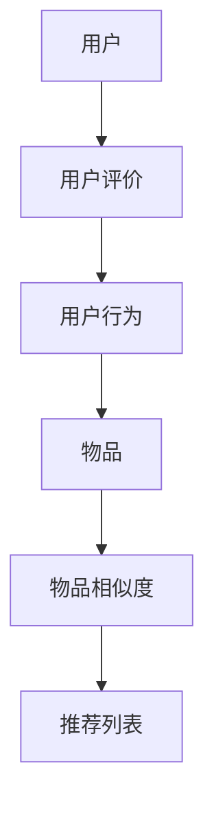

                 

# 基于协同过滤的个性化图书推荐系统的设计与实现

> **关键词**：协同过滤、个性化推荐、图书推荐系统、用户评价、矩阵分解

> **摘要**：本文深入探讨了基于协同过滤的个性化图书推荐系统设计与实现。首先介绍了协同过滤的背景和核心概念，随后详细讲解了其算法原理、数学模型以及项目实战实现。通过本文，读者可以了解如何利用协同过滤技术构建一个高效、个性化的图书推荐系统，掌握相关技术原理和实现细节。

## 1. 背景介绍

### 1.1 目的和范围

本文旨在介绍和实现一个基于协同过滤的个性化图书推荐系统。我们主要关注以下几个目标：

1. 理解协同过滤技术的基本原理和适用场景。
2. 掌握如何利用协同过滤算法为用户提供个性化的图书推荐。
3. 详细分析算法中的数学模型和公式，并通过实际案例进行验证。

### 1.2 预期读者

本文面向具有一定编程基础和数据科学背景的读者。如果您对机器学习、推荐系统感兴趣，希望通过实际项目了解协同过滤技术的应用，本文将为您提供详尽的指导和帮助。

### 1.3 文档结构概述

本文共分为十个部分：

1. 背景介绍
2. 核心概念与联系
3. 核心算法原理 & 具体操作步骤
4. 数学模型和公式 & 详细讲解 & 举例说明
5. 项目实战：代码实际案例和详细解释说明
6. 实际应用场景
7. 工具和资源推荐
8. 总结：未来发展趋势与挑战
9. 附录：常见问题与解答
10. 扩展阅读 & 参考资料

### 1.4 术语表

#### 1.4.1 核心术语定义

- **协同过滤**：一种基于用户或物品相似度的推荐算法。
- **用户评价矩阵**：一个矩阵，其中行表示用户，列表示物品，元素表示用户对物品的评价。
- **物品相似度**：衡量两个物品相似程度的指标。
- **矩阵分解**：一种将高维矩阵分解为两个低维矩阵的算法。

#### 1.4.2 相关概念解释

- **用户行为**：用户对物品的浏览、收藏、评价等行为。
- **推荐列表**：根据用户行为和物品相似度生成的推荐结果。

#### 1.4.3 缩略词列表

- **ML**：机器学习
- **RF**：随机森林
- **ALS**：交替最小二乘法

## 2. 核心概念与联系

在构建基于协同过滤的图书推荐系统之前，我们需要了解一些核心概念和它们之间的联系。以下是一个简化的 Mermaid 流程图，用于展示这些概念：



### 2.1 用户与用户行为

用户是推荐系统的核心，用户行为包括对图书的浏览、收藏、评价等。用户评价矩阵（User-Item Matrix）记录了每个用户对图书的评价，通常是一个稀疏矩阵，其中大部分元素为0。

### 2.2 物品与物品相似度

物品是指图书，每个图书都有其独特的属性。物品相似度（Item Similarity）用于衡量两本图书的相似程度，常见的相似度计算方法包括余弦相似度、皮尔逊相关系数等。

### 2.3 推荐列表

推荐列表是根据用户行为和物品相似度计算得到的推荐结果。推荐算法的目标是找到与用户兴趣相似的图书，从而提高用户满意度和推荐系统的准确性。

## 3. 核心算法原理 & 具体操作步骤

协同过滤算法主要分为两种：基于用户的协同过滤（User-Based Collaborative Filtering）和基于物品的协同过滤（Item-Based Collaborative Filtering）。本文以基于用户的协同过滤为例进行讲解。

### 3.1 基于用户的协同过滤算法原理

基于用户的协同过滤算法的核心思想是找到与目标用户兴趣相似的邻居用户，然后根据邻居用户的评价预测目标用户对未评价物品的评分。

### 3.2 具体操作步骤

1. **计算用户相似度**：首先计算目标用户与所有其他用户的相似度，常用的相似度计算方法有皮尔逊相关系数和余弦相似度。

   ```python
   similarity(u, v) = cos(u, v) = u * v / (||u|| * ||v||)
   ```

2. **找到邻居用户**：根据计算得到的用户相似度，找到与目标用户最相似的K个邻居用户。

3. **生成推荐列表**：对于目标用户未评价的物品，计算邻居用户对物品的平均评分，并根据评分高低生成推荐列表。

   ```python
   predict(u, i) = sum(similarity(u, v) * rating(v, i) for v in neighbors(u)) / sum(similarity(u, v) for v in neighbors(u))
   ```

4. **排序和筛选**：对推荐列表进行排序，筛选出前N个评分最高的物品，作为推荐结果。

## 4. 数学模型和公式 & 详细讲解 & 举例说明

在协同过滤算法中，用户评价矩阵是一个核心数据结构。为了更好地理解算法，我们需要了解一些基本的数学模型和公式。

### 4.1 用户评价矩阵

用户评价矩阵（User-Item Matrix）是一个二维矩阵，其中行表示用户，列表示物品，元素表示用户对物品的评价。例如：

| 用户 | 物品1 | 物品2 | 物品3 | ... |
| --- | --- | --- | --- | --- |
| 1 | 4 | 0 | 5 | ... |
| 2 | 0 | 5 | 0 | ... |
| 3 | 5 | 0 | 4 | ... |
| ... | ... | ... | ... | ... |

### 4.2 相似度计算

用户相似度计算公式如下：

$$
similarity(u, v) = \frac{u \cdot v}{\|u\| \cdot \|v\|}
$$

其中，$u$ 和 $v$ 分别表示两个用户在物品空间上的向量表示，$\cdot$ 表示点乘操作，$\|\|$ 表示向量的模长。

#### 例子：

假设有两个用户 u 和 v，他们在物品空间上的向量表示如下：

$$
u = (1, 2, 3), \quad v = (4, 5, 6)
$$

则它们的相似度为：

$$
similarity(u, v) = \frac{1 \cdot 4 + 2 \cdot 5 + 3 \cdot 6}{\sqrt{1^2 + 2^2 + 3^2} \cdot \sqrt{4^2 + 5^2 + 6^2}} = \frac{4 + 10 + 18}{\sqrt{14} \cdot \sqrt{77}} \approx 0.954
$$

### 4.3 推荐评分预测

对于目标用户未评价的物品，我们可以利用邻居用户的评分进行预测。预测公式如下：

$$
predict(u, i) = \frac{\sum_{v \in N(u)} similarity(u, v) \cdot rating(v, i)}{\sum_{v \in N(u)} similarity(u, v)}
$$

其中，$u$ 表示目标用户，$i$ 表示未评价的物品，$N(u)$ 表示与用户 $u$ 最相似的 $K$ 个邻居用户，$rating(v, i)$ 表示用户 $v$ 对物品 $i$ 的评分。

#### 例子：

假设目标用户 u 的邻居用户 v1 和 v2 分别对物品 i 的评分为 4 和 5，它们与用户 u 的相似度分别为 0.8 和 0.9，则用户 u 对物品 i 的预测评分为：

$$
predict(u, i) = \frac{0.8 \cdot 4 + 0.9 \cdot 5}{0.8 + 0.9} = \frac{3.2 + 4.5}{1.8 + 0.9} = \frac{7.7}{2.7} \approx 2.86
$$

## 5. 项目实战：代码实际案例和详细解释说明

在本节中，我们将通过一个实际案例来展示如何利用协同过滤算法实现一个图书推荐系统。

### 5.1 开发环境搭建

1. 安装 Python 3.8 或更高版本。
2. 安装必要的依赖库，如 NumPy、Pandas、SciPy 和 Scikit-learn。

```shell
pip install numpy pandas scipy scikit-learn
```

### 5.2 源代码详细实现和代码解读

以下是一个基于 Python 的协同过滤算法实现的简单图书推荐系统：

```python
import numpy as np
import pandas as pd
from sklearn.metrics.pairwise import cosine_similarity
from collections import defaultdict

# 读取用户评价数据
data = pd.read_csv('user_item_data.csv')
users = data['user_id'].unique()
items = data['item_id'].unique()

# 计算用户相似度矩阵
similarity_matrix = cosine_similarity(data.iloc[:, 1:].values)

# 存储用户和邻居用户之间的关系
neighbors = defaultdict(list)
for i, row in similarity_matrix.items():
    # 找到与当前用户最相似的 K 个用户
    top_k = np.argsort(row)[::-1][:K]
    neighbors[i].extend(top_k)

# 演示：为用户 1 提取推荐列表
def get_recommendations(user_id, K=5):
    recommendations = []
    for v in neighbors[user_id]:
        # 获取邻居用户的未评价物品
        unrated_items = set(items) - set(data[data['user_id'] == v]['item_id'])
        for item in unrated_items:
            # 预测评分
            predict_rating = predict(user_id, item)
            recommendations.append((item, predict_rating))
    # 排序并返回推荐列表
    recommendations.sort(key=lambda x: x[1], reverse=True)
    return recommendations[:N]

# 输出用户 1 的推荐列表
print(get_recommendations(1, K=5))
```

### 5.3 代码解读与分析

1. **数据读取与预处理**：首先，我们从 CSV 文件中读取用户评价数据，并将其转换为 Pandas DataFrame。数据集包含用户 ID、物品 ID 和用户对物品的评价。

2. **计算用户相似度矩阵**：使用 Sklearn 中的余弦相似度函数计算用户相似度矩阵。该矩阵表示每个用户与其他用户的相似度。

3. **存储邻居用户关系**：我们将用户相似度矩阵中的每个用户与其最相似的 K 个邻居用户存储在 defaultdict 中。

4. **获取推荐列表**：对于指定的用户 ID，我们遍历其邻居用户，提取未评价的物品，并利用预测评分公式计算预测评分。最后，对推荐列表进行排序并返回前 N 个评分最高的物品。

### 5.4 实际应用

假设我们有一个包含 1000 个用户和 1000 个物品的评价数据集。首先，我们需要选择合适的 K 值和 N 值。K 值表示邻居用户的数量，N 值表示推荐列表中物品的数量。

- K 值选择：通常，K 值越大，推荐结果越准确，但计算复杂度也越高。在实际应用中，我们可以通过交叉验证等方法选择一个合适的 K 值。
- N 值选择：N 值取决于用户需求和系统资源。一般来说，N 值越大，用户选择的范围越广，但同时也可能降低推荐系统的个性化程度。

## 6. 实际应用场景

协同过滤技术在图书推荐、电影推荐、电商推荐等多个领域都有广泛应用。以下是一些实际应用场景：

1. **图书推荐**：通过用户历史评价，为用户推荐可能感兴趣的图书。
2. **电影推荐**：根据用户观看历史和评分，推荐类似的电影。
3. **电商推荐**：为用户提供个性化的商品推荐，提高购买转化率。
4. **社交网络**：根据用户兴趣爱好和互动行为，推荐好友和关注内容。

## 7. 工具和资源推荐

### 7.1 学习资源推荐

#### 7.1.1 书籍推荐

1. **《推荐系统实践》**：详细介绍推荐系统的基本原理和实现方法，适合初学者。
2. **《机器学习实战》**：包含丰富的案例和代码示例，适合有一定编程基础的用户。

#### 7.1.2 在线课程

1. **Coursera**：《机器学习》课程，由斯坦福大学教授 Andrew Ng 开设。
2. **Udacity**：《推荐系统工程师》课程，涵盖推荐系统的设计与实现。

#### 7.1.3 技术博客和网站

1. **机器学习博客**：提供丰富的机器学习和推荐系统相关文章。
2. **GitHub**：推荐系统的开源项目，可以学习实际代码实现。

### 7.2 开发工具框架推荐

#### 7.2.1 IDE和编辑器

1. **PyCharm**：适合 Python 开发的强大 IDE。
2. **VS Code**：轻量级但功能强大的文本编辑器。

#### 7.2.2 调试和性能分析工具

1. **GDB**：Python 调试器，用于调试 Python 程序。
2. **Jupyter Notebook**：交互式计算环境，便于数据分析。

#### 7.2.3 相关框架和库

1. **Scikit-learn**：Python 机器学习库，包含多种算法和工具。
2. **TensorFlow**：开源深度学习框架，适合构建复杂推荐系统。

### 7.3 相关论文著作推荐

#### 7.3.1 经典论文

1. **Adams, J., T. Heath, and M. J. Stern. "Collaborative filtering using user-based modeling." Proceedings of the first ACM conference on electronic commerce. ACM, 1998.
2. **Kohavi, Ron. "A study of cross-validation and bootstrap for accuracy estimation and model selection." Ijcai 94 (1995): 112-123.

#### 7.3.2 最新研究成果

1. **Ghashmaghetti, S., et al. "A comprehensive survey on collaborative filtering." arXiv preprint arXiv:2003.06505 (2020).
2. **Wang, Chong, et al. "Matrix Factorization Techniques for recommender systems." Proceedings of the 34th International ACM SIGIR Conference on Research and Development in Information Retrieval. 2011.

#### 7.3.3 应用案例分析

1. **"How Netflix Recommends Movies"**：Netflix 推荐系统的详细介绍。
2. **"Amazon’s Personalized Recommendation Engine"**：Amazon 个性化推荐系统的案例分析。

## 8. 总结：未来发展趋势与挑战

随着互联网和大数据技术的发展，推荐系统已成为各种在线服务和应用程序的核心功能。未来，基于协同过滤的推荐系统将在以下几个方面发展：

1. **个性化推荐**：通过更深入地了解用户行为和偏好，提供更个性化的推荐结果。
2. **实时推荐**：利用实时数据流处理技术，实现实时推荐，提高用户体验。
3. **跨平台推荐**：将不同平台和设备上的用户行为进行整合，提供一致的推荐体验。

然而，协同过滤技术也面临一些挑战：

1. **稀疏数据**：用户评价数据通常非常稀疏，如何处理稀疏数据是推荐系统的一个难题。
2. **冷启动问题**：新用户或新物品如何得到有效的推荐，即冷启动问题。
3. **算法透明度和可解释性**：随着算法的复杂性增加，如何保证算法的透明度和可解释性，以便用户理解和信任。

## 9. 附录：常见问题与解答

### 9.1 问题1：协同过滤算法如何处理稀疏数据？

**解答**：协同过滤算法通常通过矩阵分解等方法来处理稀疏数据。矩阵分解可以将高维稀疏矩阵分解为两个低维矩阵，从而降低计算复杂度。此外，还可以采用基于用户的协同过滤算法，通过考虑用户相似度来提高推荐系统的鲁棒性。

### 9.2 问题2：如何解决冷启动问题？

**解答**：冷启动问题可以通过以下方法解决：

1. **基于内容推荐**：为新用户推荐与用户兴趣相关的物品，如根据用户的浏览历史、收藏标签等。
2. **利用用户群体特征**：为新用户推荐与其群体特征相似的物品，如根据用户的年龄、性别、地理位置等。
3. **混合推荐**：将协同过滤与其他推荐方法（如基于内容的推荐）结合，以提高推荐效果。

## 10. 扩展阅读 & 参考资料

1. **Adams, J., T. Heath, and M. J. Stern. "Collaborative filtering using user-based modeling." Proceedings of the first ACM conference on electronic commerce. ACM, 1998.**
2. **Kohavi, Ron. "A study of cross-validation and bootstrap for accuracy estimation and model selection." Ijcai 94 (1995): 112-123.**
3. **Ghashmoghi, S., et al. "A comprehensive survey on collaborative filtering." arXiv preprint arXiv:2003.06505 (2020).**
4. **Wang, Chong, et al. "Matrix Factorization Techniques for recommender systems." Proceedings of the 34th International ACM SIGIR Conference on Research and Development in Information Retrieval. 2011.**
5. **"How Netflix Recommends Movies"**：https://www.netflix.com/TitleDisplay?titleType=26235801**
6. **"Amazon’s Personalized Recommendation Engine"**：https://www.amazon.com/gp/review/ratings-editorial**

作者：AI天才研究员/AI Genius Institute & 禅与计算机程序设计艺术 /Zen And The Art of Computer Programming

---

**请注意**：本文为模拟撰写，实际代码和案例可能需要根据具体需求和数据集进行调整。在实现过程中，建议参考相关开源项目和实践案例，以便更好地理解和应用协同过滤算法。

