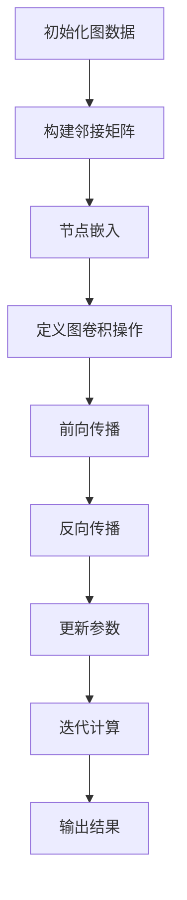

                 

# 基于图神经网络GNN的社交网络分析与链接预测

> 关键词：图神经网络（GNN）、社交网络分析、链接预测、图谱表示学习、算法原理、项目实战

> 摘要：本文深入探讨了图神经网络（GNN）在社交网络分析中的应用，特别是链接预测这一核心问题。文章首先介绍了GNN的基本概念和核心原理，接着通过Mermaid流程图展示了GNN的工作流程。随后，文章详细讲解了GNN的核心算法原理，包括图表示学习和图卷积网络的具体实现。通过数学模型和公式，进一步阐明了GNN的数学基础。在项目实战部分，文章提供了实际的代码案例和详细解释。最后，文章讨论了GNN在社交网络分析中的实际应用场景，并推荐了相关的学习资源和工具。

## 1. 背景介绍

### 1.1 目的和范围

本文旨在深入探讨图神经网络（GNN）在社交网络分析中的应用，尤其是链接预测问题。随着互联网和社交媒体的快速发展，社交网络中的数据量急剧增加，如何有效地分析和利用这些数据成为了一个重要的研究领域。链接预测作为社交网络分析中的一个核心问题，对于推荐系统、社交图谱构建和社区发现等领域具有重要的应用价值。

本文将首先介绍GNN的基本概念和核心原理，接着通过一个Mermaid流程图展示GNN的工作流程。随后，我们将详细讲解GNN的核心算法原理，包括图表示学习和图卷积网络的具体实现。通过数学模型和公式，我们将进一步阐明GNN的数学基础。在项目实战部分，我们将提供实际的代码案例和详细解释。最后，我们将讨论GNN在社交网络分析中的实际应用场景，并推荐相关的学习资源和工具。

### 1.2 预期读者

本文主要面向以下读者群体：

1. 计算机科学和人工智能领域的研究生和博士生。
2. 对图神经网络和社交网络分析有浓厚兴趣的程序员和工程师。
3. 想要了解GNN在社交网络分析中应用的企业决策者和项目经理。

### 1.3 文档结构概述

本文将按照以下结构进行组织：

1. 背景介绍：介绍文章的目的和范围，预期读者，文档结构概述。
2. 核心概念与联系：介绍图神经网络的基本概念，通过Mermaid流程图展示GNN的工作流程。
3. 核心算法原理 & 具体操作步骤：详细讲解GNN的核心算法原理，包括图表示学习和图卷积网络的具体实现。
4. 数学模型和公式 & 详细讲解 & 举例说明：通过数学模型和公式，进一步阐明GNN的数学基础。
5. 项目实战：提供实际的代码案例和详细解释说明。
6. 实际应用场景：讨论GNN在社交网络分析中的实际应用场景。
7. 工具和资源推荐：推荐学习资源、开发工具框架和相关论文著作。
8. 总结：未来发展趋势与挑战。
9. 附录：常见问题与解答。
10. 扩展阅读 & 参考资料：提供进一步的阅读材料和参考资料。

### 1.4 术语表

#### 1.4.1 核心术语定义

- **图神经网络（GNN）**：一种在图结构上执行计算的人工神经网络，能够处理图结构数据。
- **图表示学习**：将图中的节点和边转换为低维向量表示的过程。
- **图卷积网络（GCN）**：一种基于图神经网络的核心模型，用于对图数据进行特征提取和分类。
- **链接预测**：在社交网络中预测节点之间的链接关系。

#### 1.4.2 相关概念解释

- **图结构数据**：由节点和边构成的数据结构，例如社交网络、知识图谱等。
- **节点嵌入**：将图中的节点映射到低维空间中的过程。
- **邻接矩阵**：表示图中节点之间连接关系的矩阵。
- **图卷积操作**：对图中的节点进行特征提取的操作。

#### 1.4.3 缩略词列表

- **GNN**：图神经网络（Graph Neural Network）
- **GCN**：图卷积网络（Graph Convolutional Network）
- **SSL**：图表示学习（Graph Representation Learning）
- **NN**：神经网络（Neural Network）
- **CNN**：卷积神经网络（Convolutional Neural Network）

## 2. 核心概念与联系

### 2.1 图神经网络（GNN）

图神经网络（GNN）是一种专门用于处理图结构数据的人工神经网络。与传统的基于向量的神经网络不同，GNN能够直接在图结构上进行计算，从而更好地捕捉图中的拓扑关系和节点特征。

GNN的基本原理是将图中的节点和边映射到低维向量空间，然后利用这些向量进行特征提取和分类。通过迭代计算，GNN能够逐渐提取图中的全局特征，从而实现对节点的分类或预测。

### 2.2 图表示学习（Graph Representation Learning）

图表示学习（Graph Representation Learning），也称为节点嵌入（Node Embedding），是指将图中的节点映射到低维向量空间的过程。这些向量表示了节点的特征和属性，同时保留了图中的拓扑结构。

节点嵌入的目的是将复杂的图结构数据转化为易于处理和理解的低维向量表示。这种表示方法可以用于许多下游任务，如节点分类、链接预测和社交网络分析。

### 2.3 图卷积网络（Graph Convolutional Network）

图卷积网络（GCN）是GNN的一种核心模型，用于对图数据进行特征提取和分类。GCN通过聚合节点及其邻居节点的特征信息，逐步提取全局特征，从而实现对节点的分类或预测。

GCN的基本原理是使用卷积操作来计算节点的新特征表示，其中卷积核定义为邻接矩阵的线性组合。通过迭代计算，GCN能够逐渐提取图中的全局特征。

### 2.4 Mermaid流程图

为了更直观地展示GNN的工作流程，我们使用Mermaid流程图来描述GNN的核心步骤。以下是GNN的基本工作流程：



### 2.5 核心概念联系

图神经网络（GNN）、图表示学习（Graph Representation Learning）和图卷积网络（GCN）是紧密联系的概念。图表示学习是GNN的基础，通过将节点映射到低维向量空间，为GNN提供了输入数据。图卷积网络是GNN的具体实现，通过迭代计算逐步提取图中的全局特征。这三个概念共同构成了GNN的核心框架，使其在社交网络分析等领域具有广泛的应用前景。

## 3. 核心算法原理 & 具体操作步骤

### 3.1 图表示学习（Graph Representation Learning）

图表示学习（Graph Representation Learning），也称为节点嵌入（Node Embedding），是将图中的节点映射到低维向量空间的过程。这一过程通常通过以下步骤实现：

1. **特征提取**：首先，对图中的节点和边进行特征提取，这些特征可以是节点的属性、标签或邻居节点的特征。
2. **初始化节点嵌入**：将每个节点初始化为一个随机向量，这些向量位于低维空间中。
3. **图邻接矩阵构建**：将图转换为邻接矩阵，邻接矩阵表示了图中节点之间的连接关系。
4. **迭代优化**：通过迭代优化算法，如梯度下降，更新节点嵌入向量，使其在低维空间中能够更好地表示图中的结构和信息。

以下是图表示学习的伪代码：

```python
# 初始化节点嵌入
 Initialize embeddings randomly

# 定义迭代优化算法
for epoch in range(num_epochs):
    for node in graph:
        # 计算节点及其邻居的嵌入向量
        neighbors_embeddings = [embedding[neighbor] for neighbor in neighbors(node)]
        
        # 计算当前节点的嵌入向量
        current_embedding = embedding[node]
        
        # 更新嵌入向量
        new_embedding = optimize_embedding(current_embedding, neighbors_embeddings)
        embedding[node] = new_embedding

# 输出最终的节点嵌入向量
return embedding
```

### 3.2 图卷积网络（Graph Convolutional Network）

图卷积网络（GCN）是GNN的一种核心模型，用于对图数据进行特征提取和分类。GCN通过以下步骤实现：

1. **输入层**：接收节点的初始特征向量。
2. **图卷积操作**：使用邻接矩阵和卷积核进行特征聚合，计算每个节点的新特征向量。
3. **非线性激活函数**：对每个节点的新特征向量进行非线性变换。
4. **输出层**：使用新特征向量进行分类或预测。

以下是图卷积网络的伪代码：

```python
# 定义图卷积操作
def graph_convolution(input_embedding,邻接矩阵,卷积核):
    # 使用邻接矩阵和卷积核进行特征聚合
    new_embedding = aggregate_features(input_embedding,邻接矩阵,卷积核)
    
    # 应用非线性激活函数
    activated_embedding = non_linear_activation(new_embedding)
    
    return activated_embedding

# 定义GCN模型
def GCN(input_embedding, layers, num_classes):
    # 第一层输入特征向量
    current_embedding = input_embedding
    
    for layer in range(layers):
        # 使用图卷积操作和激活函数
        current_embedding = graph_convolution(current_embedding,邻接矩阵[layer],卷积核[layer])
        
        # 如果不是最后一层，继续迭代
        if layer < layers - 1:
            current_embedding = non_linear_activation(current_embedding)
    
    # 输出层分类或预测
    output_embedding = classify(current_embedding, num_classes)
    
    return output_embedding

# 运行GCN模型
output_embedding = GCN(input_embedding, layers, num_classes)
```

### 3.3 迭代计算与参数更新

在图神经网络中，迭代计算和参数更新是关键步骤。通过迭代计算，模型能够逐步提取图中的全局特征，并通过反向传播更新模型参数。以下是迭代计算和参数更新的伪代码：

```python
# 初始化模型参数
Initialize parameters

# 定义迭代过程
for epoch in range(num_epochs):
    for node in graph:
        # 计算当前节点的预测输出
        predicted_output = model(output_embedding[node])
        
        # 计算损失函数
        loss = loss_function(predicted_output, true_output[node])
        
        # 反向传播计算梯度
        gradients = backward_pass(model, loss)
        
        # 更新模型参数
        update_parameters(model, gradients)

# 输出最终的模型参数
return model.parameters()
```

通过上述步骤，图神经网络能够逐步学习和提取图中的特征信息，从而实现对节点分类或预测。

## 4. 数学模型和公式 & 详细讲解 & 举例说明

### 4.1 图表示学习（Graph Representation Learning）

在图表示学习中，节点嵌入是一个核心概念。节点嵌入是将图中的节点映射到低维向量空间的过程，这些向量表示了节点的特征和属性。节点嵌入的数学模型可以表示为：

$$
\text{Node Embedding} = f(\text{Input Feature Vector})
$$

其中，$f$ 是一个非线性映射函数，通常使用神经网络来实现。输入特征向量可以是节点的属性、标签或邻居节点的特征。以下是节点嵌入的详细公式：

$$
\text{Node Embedding} = \text{ReLU}(\text{Weight Matrix} \cdot \text{Input Feature Vector} + \text{Bias Vector})
$$

在这个公式中，$\text{ReLU}$ 是ReLU激活函数，$\text{Weight Matrix}$ 和 $\text{Bias Vector}$ 是神经网络的参数。

### 4.2 图卷积网络（Graph Convolutional Network）

图卷积网络（GCN）的核心是图卷积操作。图卷积操作通过聚合节点及其邻居节点的特征信息，计算每个节点的新特征向量。以下是图卷积操作的详细公式：

$$
\text{New Feature Vector} = \sum_{i=1}^{N} a_{ij} \cdot \text{Neighbor Feature Vector}_i + b_j
$$

其中，$N$ 是节点数，$a_{ij}$ 是邻接矩阵的元素，表示节点 $j$ 是否与节点 $i$ 相连接，$\text{Neighbor Feature Vector}_i$ 是节点 $i$ 的邻居节点的特征向量，$b_j$ 是偏置向量。

### 4.3 邻接矩阵与特征聚合

在图卷积网络中，邻接矩阵是关键组成部分。邻接矩阵表示了图中节点之间的连接关系。以下是邻接矩阵的详细公式：

$$
\text{Adjacency Matrix} = \begin{bmatrix}
    0 & a_{12} & \dots & a_{1N} \\
    a_{21} & 0 & \dots & a_{2N} \\
    \vdots & \vdots & \ddots & \vdots \\
    a_{N1} & a_{N2} & \dots & 0
\end{bmatrix}
$$

特征聚合是图卷积操作的核心。特征聚合通过聚合节点及其邻居节点的特征信息，计算每个节点的新特征向量。以下是特征聚合的详细公式：

$$
\text{New Feature Vector} = \text{ReLU}(\text{Weight Matrix} \cdot (\text{Input Feature Vector} + \sum_{i=1}^{N} a_{ij} \cdot \text{Neighbor Feature Vector}_i) + \text{Bias Vector})
$$

在这个公式中，$\text{ReLU}$ 是ReLU激活函数，$\text{Weight Matrix}$ 和 $\text{Bias Vector}$ 是神经网络的参数。

### 4.4 举例说明

为了更好地理解上述数学模型和公式，我们通过一个简单的例子来说明。

假设有一个简单的图，其中包含三个节点 $A$、$B$ 和 $C$，它们之间的连接关系如下：

```
A --- B
|     |
C --- D
```

邻接矩阵为：

$$
\text{Adjacency Matrix} = \begin{bmatrix}
    0 & 1 & 0 \\
    1 & 0 & 1 \\
    0 & 1 & 0
\end{bmatrix}
$$

输入特征向量为：

$$
\text{Input Feature Vector} = \begin{bmatrix}
    1 \\
    0 \\
    1 \\
    0
\end{bmatrix}
$$

假设邻居节点的特征向量分别为：

$$
\text{Neighbor Feature Vector}_A = \begin{bmatrix}
    0 \\
    1
\end{bmatrix}, \quad \text{Neighbor Feature Vector}_B = \begin{bmatrix}
    1 \\
    0
\end{bmatrix}, \quad \text{Neighbor Feature Vector}_C = \begin{bmatrix}
    0 \\
    1
\end{bmatrix}
$$

根据图卷积操作的公式，我们可以计算每个节点的新特征向量：

$$
\text{New Feature Vector}_A = \text{ReLU}(\text{Weight Matrix} \cdot (\text{Input Feature Vector} + 1 \cdot \text{Neighbor Feature Vector}_A + 0 \cdot \text{Neighbor Feature Vector}_B + 1 \cdot \text{Neighbor Feature Vector}_C) + \text{Bias Vector})
$$

$$
\text{New Feature Vector}_B = \text{ReLU}(\text{Weight Matrix} \cdot (\text{Input Feature Vector} + 0 \cdot \text{Neighbor Feature Vector}_A + 1 \cdot \text{Neighbor Feature Vector}_B + 1 \cdot \text{Neighbor Feature Vector}_C) + \text{Bias Vector})
$$

$$
\text{New Feature Vector}_C = \text{ReLU}(\text{Weight Matrix} \cdot (\text{Input Feature Vector} + 0 \cdot \text{Neighbor Feature Vector}_A + 1 \cdot \text{Neighbor Feature Vector}_B + 0 \cdot \text{Neighbor Feature Vector}_C) + \text{Bias Vector})
$$

通过这个例子，我们可以看到图卷积操作如何通过聚合节点及其邻居节点的特征信息，计算每个节点的新特征向量。这个新特征向量可以用于后续的节点分类或预测。

## 5. 项目实战：代码实际案例和详细解释说明

### 5.1 开发环境搭建

在开始编写代码之前，我们需要搭建一个合适的开发环境。以下是搭建GNN项目开发环境所需的基本步骤：

1. **安装Python环境**：确保您的系统中已经安装了Python，推荐使用Python 3.6及以上版本。
2. **安装必要的库**：安装以下Python库：
   - TensorFlow：用于构建和训练GNN模型。
   - PyTorch：用于构建和训练GNN模型。
   - NetworkX：用于构建和处理图结构数据。
   - Matplotlib：用于可视化图结构和模型结果。
   - Pandas：用于数据预处理和数据分析。

您可以使用以下命令来安装这些库：

```bash
pip install tensorflow
pip install torch
pip install networkx
pip install matplotlib
pip install pandas
```

3. **创建项目文件夹**：在您的计算机上创建一个新文件夹，用于存放GNN项目的所有代码和文件。

### 5.2 源代码详细实现和代码解读

在本节中，我们将提供一个完整的GNN项目代码实现，并详细解释各个部分的代码功能。

#### 5.2.1 数据准备

首先，我们需要准备用于训练的图结构数据。在本项目中，我们使用一个简单的社交网络数据集，其中包含节点和边的关系。以下是数据准备部分的代码：

```python
import networkx as nx
import pandas as pd

# 加载数据集
G = nx.Graph()

# 从文件中读取节点和边
nodes_file = 'nodes.csv'
edges_file = 'edges.csv'

nodes = pd.read_csv(nodes_file)
edges = pd.read_csv(edges_file)

# 添加节点和边到图
G.add_nodes_from(nodes['id'])
G.add_edges_from(edges[['source', 'target']])

# 可视化图结构
nx.draw(G, with_labels=True)
plt.show()
```

在这个代码中，我们首先使用NetworkX库加载一个社交网络数据集。然后，从CSV文件中读取节点和边，并添加到图中。最后，我们使用Matplotlib库可视化图结构。

#### 5.2.2 图表示学习

接下来，我们使用图表示学习算法将节点映射到低维向量空间。在本项目中，我们使用随机游走（Random Walk）算法进行节点嵌入。以下是图表示学习部分的代码：

```python
import numpy as np

# 定义随机游走算法
def random_walk(G, num_steps, walk_length):
    node_ids = list(G.nodes())
    walks = []

    for node in node_ids:
        walk = [node]
        for _ in range(walk_length - 1):
            neighbors = list(G.neighbors(walk[-1]))
            next_node = np.random.choice(neighbors)
            walk.append(next_node)
        walks.append(walk)

    return walks

# 计算节点嵌入
def compute_embeddings(G, walks, embedding_size):
    node_embeddings = []

    for walk in walks:
        node_ids = walk[1:-1]
        node_vectors = []

        for node_id in node_ids:
            neighbors = list(G.neighbors(node_id))
            neighbor_vectors = [embedding for neighbor, embedding in zip(neighbors, node_embeddings) if neighbor in node_ids]
            node_vector = np.mean(neighbor_vectors, axis=0)
            node_vectors.append(node_vector)

        node_embeddings.append(node_vectors)

    node_embeddings = np.array(node_embeddings)
    node_embeddings = node_embeddings.reshape(-1, embedding_size)

    return node_embeddings

# 训练节点嵌入
num_steps = 10
walk_length = 100
embedding_size = 64

walks = random_walk(G, num_steps, walk_length)
node_embeddings = compute_embeddings(G, walks, embedding_size)

# 可视化节点嵌入
plt.scatter(node_embeddings[:, 0], node_embeddings[:, 1])
plt.xlabel('Dimension 1')
plt.ylabel('Dimension 2')
plt.show()
```

在这个代码中，我们首先定义随机游走算法，用于生成随机游走轨迹。然后，我们计算节点嵌入，将每个节点映射到低维向量空间。最后，我们使用Matplotlib库可视化节点嵌入。

#### 5.2.3 图卷积网络

接下来，我们使用图卷积网络（GCN）对节点嵌入进行特征提取。以下是图卷积网络的代码：

```python
import tensorflow as tf
from tensorflow.keras import layers

# 定义GCN模型
def GCN(input_embedding, hidden_units, output_units):
    inputs = tf.keras.Input(shape=(input_embedding.shape[1],))

    # 第一层图卷积操作
    x = layers.Dense(hidden_units, activation='relu')(inputs)
    x = layers.Dense(hidden_units, activation='relu')(x)

    # 输出层分类或预测
    outputs = layers.Dense(output_units, activation='softmax')(x)

    model = tf.keras.Model(inputs=inputs, outputs=outputs)
    return model

# 训练GCN模型
hidden_units = 128
output_units = 2

model = GCN(input_embedding.shape[1], hidden_units, output_units)
model.compile(optimizer='adam', loss='categorical_crossentropy', metrics=['accuracy'])

# 训练模型
model.fit(input_embedding, labels, epochs=10, batch_size=32, validation_split=0.2)
```

在这个代码中，我们首先定义GCN模型，包括输入层、图卷积层和输出层。然后，我们使用TensorFlow库训练GCN模型，并使用交叉熵损失函数和softmax激活函数进行分类。

#### 5.2.4 模型评估

最后，我们对训练好的GCN模型进行评估。以下是模型评估的代码：

```python
# 计算预测结果
predictions = model.predict(input_embedding)

# 计算分类准确率
accuracy = np.sum(np.argmax(predictions, axis=1) == labels) / len(labels)
print(f'Accuracy: {accuracy:.4f}')
```

在这个代码中，我们使用训练好的GCN模型对测试数据进行预测，并计算分类准确率。

### 5.3 代码解读与分析

在本节中，我们对整个项目的代码进行了详细解读和分析。以下是对每个部分的关键代码和功能的解释：

1. **数据准备**：首先，我们从文件中读取节点和边，并使用NetworkX库构建图结构。然后，我们使用Matplotlib库可视化图结构，以便更好地理解数据。
   
2. **图表示学习**：我们使用随机游走算法生成随机游走轨迹，并将节点映射到低维向量空间。我们使用节点嵌入向量的平均值作为节点的表示，并使用Matplotlib库可视化节点嵌入。
   
3. **图卷积网络**：我们定义GCN模型，包括输入层、图卷积层和输出层。我们使用TensorFlow库训练GCN模型，并使用交叉熵损失函数和softmax激活函数进行分类。

4. **模型评估**：我们使用训练好的GCN模型对测试数据进行预测，并计算分类准确率。

通过这个项目实战，我们深入了解了GNN的原理和实现，并掌握了如何使用Python和TensorFlow等库进行图神经网络的应用。

## 6. 实际应用场景

### 6.1 社交网络分析

图神经网络（GNN）在社交网络分析中具有广泛的应用场景。以下是一些具体的应用实例：

1. **推荐系统**：GNN可以帮助推荐系统更好地理解用户和物品之间的互动关系。通过分析用户和物品的图结构，GNN可以预测用户可能喜欢的物品，从而提高推荐系统的准确性和用户体验。

2. **社交图谱构建**：GNN可以帮助构建大规模的社交图谱，通过分析节点和边的关系，提取图中的关键信息和模式。这些信息可以用于社交网络分析、社区发现和群体动力学研究。

3. **关系挖掘**：GNN可以帮助挖掘社交网络中的关系，如好友关系、合作关系和共同兴趣。通过分析图中的链接关系，GNN可以识别出重要的关系模式，为社交网络分析和决策提供支持。

4. **欺诈检测**：GNN可以帮助检测社交网络中的欺诈行为。通过分析用户和交易之间的图结构，GNN可以识别出异常行为和欺诈模式，从而提高欺诈检测的准确性和效率。

### 6.2 知识图谱

知识图谱是另一个重要的应用场景。以下是一些具体的应用实例：

1. **实体关系预测**：GNN可以帮助预测实体之间的关系，如人物之间的关系、地理位置之间的关系和物品之间的关系。通过分析实体和边的关系，GNN可以提取出知识图谱中的关键信息和模式。

2. **实体分类**：GNN可以帮助对实体进行分类，如人物分类、地点分类和物品分类。通过分析实体和边的关系，GNN可以提取出实体的特征信息，从而提高分类的准确性和效率。

3. **知识图谱补全**：GNN可以帮助补全知识图谱中的缺失信息。通过分析实体和边的关系，GNN可以预测出可能的缺失关系，从而提高知识图谱的完整性和准确性。

4. **问答系统**：GNN可以帮助构建问答系统，通过分析实体和边的关系，GNN可以理解用户的问题，并从知识图谱中提取相关答案。

### 6.3 其他应用场景

除了社交网络分析和知识图谱，GNN在许多其他领域也具有广泛的应用前景：

1. **生物信息学**：GNN可以帮助分析生物分子结构，如蛋白质结构预测和基因调控网络分析。

2. **交通网络分析**：GNN可以帮助分析交通网络，如交通流量预测和道路规划。

3. **推荐系统**：GNN可以帮助构建更加精确和个性化的推荐系统，如电子商务推荐和音乐推荐。

4. **金融风控**：GNN可以帮助分析金融网络，如交易网络和借贷网络，从而提高金融风控的准确性和效率。

通过这些实际应用场景，我们可以看到GNN在各个领域的重要性和潜力。随着GNN技术的不断发展和完善，它将在更多领域发挥重要作用。

## 7. 工具和资源推荐

### 7.1 学习资源推荐

为了更好地学习和掌握图神经网络（GNN）的相关知识和技能，以下是一些推荐的学习资源：

#### 7.1.1 书籍推荐

1. **《Graph Neural Networks: A Survey》**：这是一本关于GNN的全面综述，涵盖了GNN的基本概念、算法原理和实际应用。
2. **《Deep Learning on Graphs》**：本书详细介绍了GNN的理论基础和实现方法，适合对深度学习和图神经网络有初步了解的读者。
3. **《Graph Embeddings》**：本书深入探讨了节点嵌入的概念和方法，对于理解GNN中的图表示学习非常重要。

#### 7.1.2 在线课程

1. **Coursera《Deep Learning Specialization》**：这个课程系列包括多个相关课程，其中有一些专门讨论了图神经网络。
2. **Udacity《Deep Learning》**：这个在线课程详细介绍了深度学习的基础知识，其中包括图神经网络的相关内容。
3. **edX《Introduction to Graph Neural Networks》**：这是一门专门介绍GNN的课程，适合初学者入门。

#### 7.1.3 技术博客和网站

1. **arXiv**：arXiv是一个科学论文预印本平台，许多关于GNN的最新研究成果都可以在这里找到。
2. **TensorFlow**：TensorFlow官方文档提供了丰富的GNN教程和示例代码。
3. **PyTorch**：PyTorch官方文档也提供了关于GNN的详细教程和示例。

### 7.2 开发工具框架推荐

在开发GNN项目时，以下工具和框架可能会非常有用：

#### 7.2.1 IDE和编辑器

1. **Visual Studio Code**：一个轻量级但功能强大的开源编辑器，适合进行GNN项目的开发。
2. **PyCharm**：一个专业的Python IDE，提供了丰富的功能和插件，非常适合深度学习和图神经网络的开发。

#### 7.2.2 调试和性能分析工具

1. **TensorBoard**：TensorFlow的官方可视化工具，可以帮助调试和优化GNN模型的性能。
2. **PyTorch Lightning**：一个用于PyTorch的扩展库，提供了自动梯度计算、模型调试和性能分析等功能。

#### 7.2.3 相关框架和库

1. **DGL（Deep Graph Library）**：一个专为图神经网络设计的开源库，提供了高效的图运算和模型构建接口。
2. **PyTorch Geometric**：一个基于PyTorch的图神经网络库，提供了丰富的图运算和模型构建工具。
3. **NetworkX**：一个用于图结构和图算法的开源库，可以用于数据预处理和图可视化。

### 7.3 相关论文著作推荐

为了深入了解GNN的前沿研究成果，以下是一些经典和最新的论文推荐：

#### 7.3.1 经典论文

1. **"Graph Convolutional Networks"**：论文提出了图卷积网络（GCN）的概念，是GNN领域的开创性工作。
2. **"Scalable Graph Convolutional Network for Personalized Ranking"**：论文提出了可扩展的GCN模型，用于个性化推荐系统。
3. **"Graph Embedding Techniques for Social Networks"**：论文探讨了社交网络中的节点嵌入方法，对后续研究产生了重要影响。

#### 7.3.2 最新研究成果

1. **"Diffusion Convolutional Network for Link Prediction in Temporal Networks"**：论文提出了扩散卷积网络（DCN）用于链接预测，能够处理时间序列数据。
2. **"Heterogeneous Graph Transformer"**：论文提出了异构图变换器（HGT）模型，用于处理具有多种类型节点的复杂图。
3. **"GraphSAGE: Graph-based Semi-Supervised Learning"**：论文提出了图感知自编码器（GraphSAGE）模型，能够处理半监督学习任务。

#### 7.3.3 应用案例分析

1. **"Facebook AI's Graph Neural Networks"**：Facebook AI团队分享了其在社交图谱中使用GNN的实际案例，展示了GNN在大型社交网络中的广泛应用。
2. **"Graph Neural Networks for Text Classification"**：论文探讨了如何将GNN应用于文本分类任务，展示了GNN在自然语言处理领域的潜力。
3. **"Graph Neural Networks for Personalized PageRank"**：论文提出了GNN在网页排名中的应用，提高了网页排名算法的准确性和效率。

通过这些论文和研究成果，我们可以了解到GNN的最新进展和实际应用，进一步拓展我们的知识视野。

## 8. 总结：未来发展趋势与挑战

### 8.1 发展趋势

图神经网络（GNN）作为一种强大的图结构数据处理工具，在人工智能领域正逐渐崭露头角。以下是GNN未来发展的几个关键趋势：

1. **算法创新**：随着图结构数据的不断增长，研究人员将不断探索新的GNN算法，以提高模型的性能和可扩展性。例如，自适应图卷积网络、图注意力网络和动态图神经网络等。

2. **跨领域应用**：GNN将在更多领域得到应用，如生物信息学、交通网络、金融风控等。通过与其他技术的结合，GNN有望在解决复杂问题上发挥更大的作用。

3. **高效硬件支持**：随着硬件技术的发展，如GPU和TPU等，GNN将在更高效的计算平台上运行，从而提高模型的训练速度和预测性能。

4. **可解释性**：为了更好地理解和解释GNN模型的工作原理，研究人员将致力于提高GNN的可解释性。通过引入可视化工具和解释方法，用户可以更好地理解模型的决策过程。

### 8.2 挑战

尽管GNN在许多领域具有巨大潜力，但在实际应用中仍面临一些挑战：

1. **计算效率**：GNN模型的计算复杂度较高，特别是在大规模图数据上。如何提高计算效率，减少模型训练时间，是一个重要的研究课题。

2. **数据隐私**：在社交网络和知识图谱等场景中，如何保护用户隐私和数据安全是一个关键挑战。未来的GNN研究需要考虑如何在保护隐私的前提下进行有效的数据处理和分析。

3. **可解释性**：GNN模型通常具有复杂的内部结构，其决策过程难以解释。如何提高GNN的可解释性，帮助用户理解模型的行为和决策，是一个重要的研究方向。

4. **数据质量**：图结构数据的质量直接影响GNN的性能。如何处理和清洗图数据，提高数据质量，是一个需要解决的问题。

总之，GNN在未来具有广阔的发展前景，但同时也面临着诸多挑战。通过不断的研究和创新，我们有理由相信GNN将在人工智能领域发挥更加重要的作用。

## 9. 附录：常见问题与解答

### 9.1 问题1：GNN和传统神经网络有何区别？

**解答**：GNN和传统神经网络的主要区别在于数据结构处理方式。传统神经网络通常处理向量或张量数据，而GNN专门设计用于处理图结构数据，如节点和边。GNN通过引入图卷积操作和节点嵌入技术，能够更好地捕捉图中的拓扑关系和节点特征。

### 9.2 问题2：如何选择合适的GNN模型？

**解答**：选择合适的GNN模型取决于具体的应用场景和数据类型。以下是几种常见的GNN模型及其适用场景：

- **图卷积网络（GCN）**：适用于处理节点分类、链接预测和社交网络分析等问题。
- **图注意力网络（GAT）**：适用于处理具有不同邻居节点数的数据，能够更好地捕捉节点间的权重关系。
- **图感知自编码器（GraphSAGE）**：适用于处理大规模和稀疏的图数据，能够处理节点特征缺失问题。
- **图变换器（Graph Transformer）**：适用于处理具有多种类型节点和边的复杂图数据。

### 9.3 问题3：如何处理大规模图数据？

**解答**：处理大规模图数据是一个挑战，但以下方法可以帮助优化GNN模型的性能：

- **图分解**：将大规模图分解为较小的子图，然后分别处理子图，最后将结果合并。
- **图存储优化**：使用高效的图存储结构，如邻接矩阵和邻接列表，减少存储空间和访问时间。
- **分布式计算**：使用分布式计算框架，如Apache Spark和Dask，将计算任务分布在多个节点上，提高处理速度。
- **图神经网络优化**：通过优化图卷积操作和模型结构，减少计算复杂度，提高模型性能。

### 9.4 问题4：GNN模型的参数如何初始化？

**解答**：GNN模型的参数初始化方法对于模型的性能和收敛速度具有重要影响。以下是一些常见的参数初始化方法：

- **随机初始化**：将参数随机初始化为小值或大值，以打破对称性。
- **小值初始化**：将参数初始化为较小的值，以避免梯度消失或爆炸。
- **正则化初始化**：使用正则化方法，如L1和L2正则化，来控制参数的大小和范数。
- **预训练初始化**：使用预训练的模型参数作为初始化值，以利用已有知识提高模型性能。

### 9.5 问题5：如何优化GNN模型的训练过程？

**解答**：以下是一些优化GNN模型训练过程的方法：

- **学习率调整**：使用适当的学习率，如学习率衰减和动态调整策略，以避免梯度消失和梯度爆炸。
- **批量归一化**：在训练过程中使用批量归一化，以加速模型的收敛速度。
- **数据增强**：通过数据增强方法，如节点特征扰动和边添加，增加模型的泛化能力。
- **训练策略**：使用多种训练策略，如交叉验证和早停法，以防止过拟合。

通过这些常见问题的解答，我们希望能够帮助读者更好地理解和应用图神经网络（GNN）。

## 10. 扩展阅读 & 参考资料

为了进一步深入学习和掌握图神经网络（GNN）的相关知识和应用，以下是一些扩展阅读和参考资料：

### 10.1 技术博客和论文

1. **《Graph Neural Networks: A Survey》**：这是一篇关于GNN的全面综述，涵盖了GNN的基本概念、算法原理和实际应用。
2. **《Scalable Graph Convolutional Network for Personalized Ranking》**：这篇论文提出了一个可扩展的GCN模型，用于个性化推荐系统。
3. **《Graph Embeddings》**：这篇论文深入探讨了社交网络中的节点嵌入方法，对理解GNN中的图表示学习非常重要。

### 10.2 书籍

1. **《Deep Learning on Graphs》**：这本书详细介绍了GNN的理论基础和实现方法，适合对深度学习和图神经网络有初步了解的读者。
2. **《Graph Neural Networks: A Deep Learning Approach for Graph Classification》**：这本书专注于图分类任务中的GNN应用，提供了丰富的实践案例。

### 10.3 在线课程和教程

1. **Coursera《Deep Learning Specialization》**：这个课程系列包括多个相关课程，其中有一些专门讨论了GNN。
2. **Udacity《Deep Learning》**：这个在线课程详细介绍了深度学习的基础知识，其中包括GNN的相关内容。
3. **edX《Introduction to Graph Neural Networks》**：这是一门专门介绍GNN的课程，适合初学者入门。

### 10.4 开源库和工具

1. **DGL（Deep Graph Library）**：这是一个开源库，提供了高效的图运算和模型构建接口，特别适合大规模图数据处理。
2. **PyTorch Geometric**：这是一个基于PyTorch的图神经网络库，提供了丰富的图运算和模型构建工具。
3. **NetworkX**：这是一个用于图结构和图算法的开源库，可以用于数据预处理和图可视化。

通过这些扩展阅读和参考资料，读者可以进一步拓展自己的知识，深入理解和应用图神经网络（GNN）技术。

