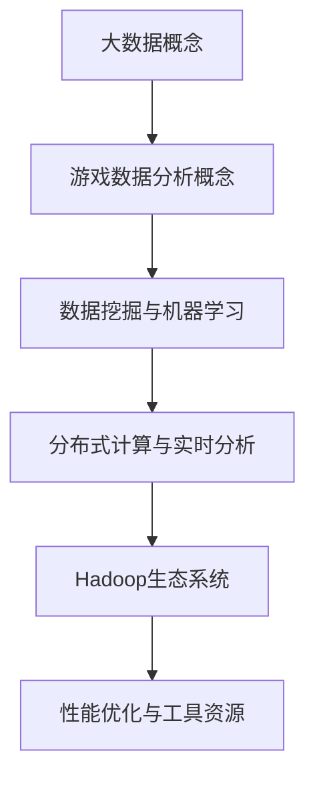

                 

# 基于大数据的游戏数据分析系统的设计与实现

> 关键词：大数据、游戏分析、系统设计、数据挖掘、性能优化

> 摘要：本文将深入探讨基于大数据的游戏数据分析系统的设计与实现。通过对核心概念、算法原理、数学模型、项目实战等方面的详细阐述，本文旨在为游戏开发者提供一套全面、高效的数据分析解决方案，助力他们在数据分析领域取得突破性进展。

## 1. 背景介绍

### 1.1 目的和范围

随着游戏行业的快速发展，游戏数据分析已成为游戏开发者不可或缺的一部分。然而，如何有效地利用海量游戏数据进行深入分析，从而提升游戏体验、优化运营策略，成为开发者面临的一大挑战。本文旨在通过介绍基于大数据的游戏数据分析系统，为开发者提供一种切实可行的解决方案。

本文将涵盖以下内容：

1. 核心概念与联系
2. 核心算法原理与具体操作步骤
3. 数学模型和公式及举例说明
4. 项目实战：代码实际案例和详细解释说明
5. 实际应用场景
6. 工具和资源推荐
7. 总结：未来发展趋势与挑战

### 1.2 预期读者

本文主要面向以下读者群体：

1. 游戏开发者，特别是对游戏数据分析感兴趣的开发者
2. 数据科学家，关注游戏数据分析领域的专业人士
3. 大学生和研究生，对游戏数据分析系统设计感兴趣的学子
4. 对大数据技术有兴趣的IT从业者

### 1.3 文档结构概述

本文将按照以下结构进行阐述：

1. 背景介绍
2. 核心概念与联系
3. 核心算法原理与具体操作步骤
4. 数学模型和公式及举例说明
5. 项目实战：代码实际案例和详细解释说明
6. 实际应用场景
7. 工具和资源推荐
8. 总结：未来发展趋势与挑战
9. 附录：常见问题与解答
10. 扩展阅读 & 参考资料

### 1.4 术语表

#### 1.4.1 核心术语定义

1. **大数据（Big Data）**：指无法用常规软件工具在合理时间内捕捉、管理和处理的数据集。
2. **游戏数据分析**：通过对游戏数据的挖掘和分析，为游戏开发者提供有关玩家行为、游戏表现、运营策略等方面的洞察。
3. **数据挖掘（Data Mining）**：从大量数据中发现有价值的模式和知识的过程。
4. **机器学习（Machine Learning）**：一种通过数据建立模型，使计算机能够自动完成特定任务的算法。

#### 1.4.2 相关概念解释

1. **数据流处理（Data Stream Processing）**：实时处理和分析数据流的计算方法。
2. **分布式计算（Distributed Computing）**：将计算任务分解为多个子任务，分配到多台计算机上并行处理的技术。
3. **实时分析（Real-time Analysis）**：对实时数据流进行高效处理和分析的能力。

#### 1.4.3 缩略词列表

- **HDFS**：Hadoop Distributed File System（Hadoop分布式文件系统）
- **MapReduce**：一种分布式数据处理框架
- **Spark**：一个开源的分布式数据处理引擎
- **SQL**：Structured Query Language（结构化查询语言）

## 2. 核心概念与联系

在设计和实现基于大数据的游戏数据分析系统时，理解以下几个核心概念和它们之间的联系至关重要：

### 2.1 大数据概念

大数据具有四个主要特征，即“4V”：

1. **Volume（数据量）**：海量的数据量，无法用常规软件工具在合理时间内处理。
2. **Velocity（数据流速度）**：数据生成和传输速度极快，要求实时处理和分析。
3. **Variety（数据多样性）**：数据类型繁多，包括结构化数据、半结构化数据和非结构化数据。
4. **Veracity（数据真实性）**：数据的真实性和准确性对分析结果至关重要。

### 2.2 游戏数据分析概念

游戏数据分析主要关注以下几个方面：

1. **玩家行为分析**：分析玩家的游戏行为，了解游戏流程、玩家偏好和互动模式。
2. **游戏性能分析**：评估游戏性能，包括帧率、加载时间、CPU和GPU使用率等。
3. **运营策略分析**：分析玩家对运营活动的响应，优化营销和推广策略。
4. **社交网络分析**：分析玩家在游戏中的社交互动，提升游戏社区活跃度。

### 2.3 数据挖掘与机器学习

数据挖掘和机器学习在游戏数据分析中发挥着重要作用：

1. **数据挖掘**：通过挖掘海量游戏数据，发现潜在的模式和关联，为游戏优化提供指导。
2. **机器学习**：利用已有数据建立模型，预测玩家行为和游戏趋势，优化游戏设计和运营策略。

### 2.4 分布式计算与实时分析

分布式计算和实时分析是大数据处理的核心技术：

1. **分布式计算**：将计算任务分配到多台计算机上，实现高效数据处理。
2. **实时分析**：对实时数据流进行快速处理和分析，提供实时洞察。

### 2.5 Hadoop生态系统

Hadoop生态系统是大数据处理的主流技术之一，包括以下关键组件：

1. **HDFS**：分布式文件系统，用于存储海量数据。
2. **MapReduce**：分布式数据处理框架，用于大规模数据计算。
3. **Spark**：高性能分布式数据处理引擎，适用于实时分析和复杂算法。

### 2.6 Mermaid 流程图

为了更好地理解上述概念之间的联系，我们可以使用Mermaid流程图进行可视化表示：



通过上述流程图，我们可以清晰地看到大数据、游戏数据分析、数据挖掘、机器学习、分布式计算、实时分析和Hadoop生态系统之间的联系。

## 3. 核心算法原理与具体操作步骤

### 3.1 数据预处理

在游戏数据分析中，数据预处理是至关重要的一步。数据预处理主要包括以下几个步骤：

1. **数据清洗**：去除重复数据、空值数据和无用数据，保证数据的准确性。
2. **数据转换**：将不同格式的数据转换为统一的格式，如将CSV文件转换为JSON格式。
3. **特征提取**：从原始数据中提取出对游戏分析有用的特征，如玩家等级、游戏时长、游戏内消费等。

### 3.2 数据存储与查询

在游戏数据分析中，高效的数据存储和查询是关键。以下是常用的数据存储和查询技术：

1. **关系型数据库**：如MySQL、PostgreSQL等，适用于存储结构化数据。
2. **NoSQL数据库**：如MongoDB、Cassandra等，适用于存储半结构化数据和非结构化数据。
3. **Hadoop HDFS**：分布式文件系统，适用于存储海量数据。
4. **数据查询引擎**：如Hive、Spark SQL等，用于对存储的数据进行高效查询。

### 3.3 数据挖掘算法

在游戏数据分析中，常用的数据挖掘算法包括：

1. **聚类算法**：用于发现数据中的潜在模式，如K-means、DBSCAN等。
2. **分类算法**：用于将数据分为不同的类别，如决策树、随机森林等。
3. **关联规则挖掘**：用于发现数据之间的关联关系，如Apriori算法、FP-growth算法等。

### 3.4 机器学习算法

在游戏数据分析中，常用的机器学习算法包括：

1. **回归算法**：用于预测连续值，如线性回归、岭回归等。
2. **分类算法**：用于预测类别，如支持向量机、K近邻等。
3. **聚类算法**：用于发现数据中的潜在模式，如K-means、层次聚类等。

### 3.5 伪代码示例

以下是一个简单的K-means聚类算法的伪代码示例：

```python
function K-means(data, k):
    # 初始化k个中心点
    centroids = initialize_centroids(data, k)
    
    # 循环迭代直到收敛
    while not_converged(centroids):
        # 为每个数据点分配最近的中心点
        clusters = assign_clusters(data, centroids)
        
        # 更新中心点
        centroids = update_centroids(data, clusters)
    
    return centroids, clusters
```

## 4. 数学模型和公式及举例说明

在游戏数据分析中，数学模型和公式用于描述和分析数据。以下是一些常用的数学模型和公式，并给出相应的举例说明：

### 4.1 回归模型

回归模型用于预测连续值。一个简单的线性回归模型可以表示为：

$$ y = \beta_0 + \beta_1 \cdot x $$

其中，$y$ 是因变量，$x$ 是自变量，$\beta_0$ 和 $\beta_1$ 是回归系数。

举例说明：假设我们想预测游戏时长（$y$）与玩家等级（$x$）之间的关系。通过收集数据，我们可以计算出回归系数 $\beta_0$ 和 $\beta_1$，并建立线性回归模型。然后，我们可以使用这个模型来预测某个玩家等级下的游戏时长。

### 4.2 分类模型

分类模型用于预测类别。一个简单的逻辑回归模型可以表示为：

$$ P(y=1) = \frac{1}{1 + e^{-(\beta_0 + \beta_1 \cdot x)}} $$

其中，$P(y=1)$ 是因变量为1的概率，$\beta_0$ 和 $\beta_1$ 是回归系数。

举例说明：假设我们想预测玩家是否会购买游戏内道具（$y$ 为1表示购买，$y$ 为0表示未购买）与玩家等级（$x$）之间的关系。通过收集数据，我们可以计算出回归系数 $\beta_0$ 和 $\beta_1$，并建立逻辑回归模型。然后，我们可以使用这个模型来预测某个玩家等级下购买道具的概率。

### 4.3 聚类模型

聚类模型用于发现数据中的潜在模式。一个简单的K-means聚类模型可以表示为：

$$ c_j = \frac{1}{N_j} \sum_{i=1}^{N} x_i $$

其中，$c_j$ 是第 $j$ 个聚类的中心点，$N_j$ 是第 $j$ 个聚类中的数据点数量，$x_i$ 是第 $i$ 个数据点。

举例说明：假设我们想将游戏玩家分为不同的群体。通过收集数据，我们可以使用K-means聚类算法将玩家分为几个聚类。然后，我们可以根据每个聚类的特征来分析玩家群体，例如游戏时长、游戏内消费等。

### 4.4 关联规则挖掘

关联规则挖掘用于发现数据之间的关联关系。一个简单的Apriori算法可以表示为：

$$ 支持度 = \frac{满足条件的交易数}{总交易数} $$  
$$ 置信度 = \frac{A \cup B}{A} $$

其中，支持度表示一个规则在所有交易中出现的频率，置信度表示在满足A的交易中，同时满足B的交易的概率。

举例说明：假设我们想发现玩家购买A道具后购买B道具的概率。通过收集数据，我们可以计算出A和B的支持度和置信度。如果支持度和置信度都大于某个阈值，那么我们就认为A和B之间存在关联。

## 5. 项目实战：代码实际案例和详细解释说明

### 5.1 开发环境搭建

在开始项目实战之前，我们需要搭建一个合适的数据分析开发环境。以下是开发环境的搭建步骤：

1. 安装Python 3.8及以上版本。
2. 安装Anaconda，用于环境管理。
3. 安装以下Python库：pandas、numpy、scikit-learn、matplotlib等。

### 5.2 源代码详细实现和代码解读

以下是一个简单的游戏数据分析项目的代码实现：

```python
import pandas as pd
from sklearn.cluster import KMeans
from sklearn.linear_model import LogisticRegression

# 读取数据
data = pd.read_csv('game_data.csv')

# 数据预处理
# ...（数据清洗、数据转换、特征提取等）

# K-means聚类
kmeans = KMeans(n_clusters=3)
clusters = kmeans.fit_predict(data)

# 绘制聚类结果
import matplotlib.pyplot as plt
plt.scatter(data['feature1'], data['feature2'], c=clusters)
plt.show()

# 逻辑回归分类
logreg = LogisticRegression()
logreg.fit(data[['feature1', 'feature2']], clusters)

# 预测
predictions = logreg.predict(data[['feature1', 'feature2']])
print(predictions)

# 绘制分类结果
plt.scatter(data['feature1'], data['feature2'], c=predictions)
plt.show()
```

#### 5.2.1 代码解读

- **数据读取**：使用pandas库读取CSV文件，获取游戏数据。
- **数据预处理**：对数据进行清洗、转换和特征提取，为后续分析做准备。
- **K-means聚类**：使用scikit-learn库中的KMeans类进行聚类，将玩家分为不同群体。
- **绘制聚类结果**：使用matplotlib库绘制聚类结果图，以便观察聚类效果。
- **逻辑回归分类**：使用scikit-learn库中的LogisticRegression类进行分类，为聚类结果建立分类模型。
- **预测**：使用训练好的分类模型对游戏数据中的特征进行预测。
- **绘制分类结果**：使用matplotlib库绘制分类结果图，以便观察分类效果。

### 5.3 代码解读与分析

通过上述代码实现，我们可以对游戏玩家进行聚类和分类。具体分析如下：

1. **聚类分析**：使用K-means聚类算法将游戏玩家分为不同群体，以便分析玩家群体的特征和行为。
2. **分类分析**：使用逻辑回归分类算法为聚类结果建立分类模型，以便预测玩家群体的行为。
3. **可视化分析**：通过绘制聚类结果和分类结果图，我们可以直观地观察和分析游戏玩家的特征和行为。

通过这个简单的游戏数据分析项目，我们可以看到基于大数据的游戏数据分析系统的实际应用。在实际项目中，我们还需要结合更多的算法、技术和工具，以实现更高效、更全面的数据分析。

## 6. 实际应用场景

基于大数据的游戏数据分析系统在游戏行业中有着广泛的应用场景，以下是一些典型的实际应用：

### 6.1 玩家行为分析

通过对玩家游戏行为的分析，游戏开发者可以了解玩家的喜好、游戏习惯和游戏流程。具体应用包括：

1. **游戏优化**：根据玩家行为数据，调整游戏难度、游戏机制等，提升玩家体验。
2. **运营策略**：根据玩家行为数据，制定针对性的运营策略，如活动策划、广告投放等。

### 6.2 游戏性能分析

通过对游戏性能的分析，开发者可以了解游戏的运行状态和性能瓶颈。具体应用包括：

1. **性能优化**：根据性能分析数据，优化游戏代码、资源加载等，提升游戏运行效率。
2. **故障排查**：根据性能分析数据，定位游戏故障和问题，提高游戏稳定性。

### 6.3 社交网络分析

通过对玩家社交互动的分析，开发者可以了解游戏社区的活跃度和玩家关系。具体应用包括：

1. **社区建设**：根据社交网络分析数据，设计社区活动、社交功能等，提升社区活跃度。
2. **玩家关系管理**：根据社交网络分析数据，分析玩家关系，制定针对性的关系管理策略。

### 6.4 运营策略分析

通过对运营数据的分析，开发者可以了解运营活动的效果和玩家响应。具体应用包括：

1. **活动优化**：根据运营数据分析数据，调整活动方案、奖励设置等，提升活动效果。
2. **收益分析**：根据运营数据分析数据，分析游戏收益来源，优化收益结构。

## 7. 工具和资源推荐

为了更好地进行游戏数据分析，以下是推荐的一些学习资源和工具：

### 7.1 学习资源推荐

#### 7.1.1 书籍推荐

1. **《大数据技术导论》**：李航 著
2. **《机器学习实战》**：Peter Harrington 著
3. **《数据挖掘：概念与技术》**：Jiawei Han 著

#### 7.1.2 在线课程

1. **Coursera上的《机器学习》**：吴恩达（Andrew Ng）授课
2. **edX上的《大数据技术》**：哈佛大学授课
3. **网易云课堂上的《大数据技术与应用》**：网易云课堂授课

#### 7.1.3 技术博客和网站

1. **CSDN**：中国最大的IT社区和服务平台
2. **GitHub**：全球最大的开源代码托管平台
3. **DataCamp**：提供各种数据科学课程和实战项目

### 7.2 开发工具框架推荐

#### 7.2.1 IDE和编辑器

1. **PyCharm**：适用于Python编程的强大IDE
2. **VS Code**：功能丰富的免费编辑器，支持多种编程语言
3. **Jupyter Notebook**：适用于数据科学和机器学习的交互式编程环境

#### 7.2.2 调试和性能分析工具

1. **PyDebug**：Python调试工具
2. **Profiling Tools**：Python性能分析工具，如cProfile、line_profiler等
3. **VisualVM**：Java性能分析工具

#### 7.2.3 相关框架和库

1. **Pandas**：Python数据分析和操作库
2. **NumPy**：Python科学计算库
3. **Scikit-learn**：Python机器学习库
4. **Spark**：分布式数据处理引擎

### 7.3 相关论文著作推荐

#### 7.3.1 经典论文

1. **《K-Means Clustering》**：MacQueen, J. B. (1967)
2. **《A Simple, Fast, and Effective Rule Learner》**：Hastie, T., & Rosling, C. A. (1994)
3. **《Logistic Regression》**：Friedman, J., Hastie, T., & Tibshirani, R. (2001)

#### 7.3.2 最新研究成果

1. **《Deep Learning for Games》**：DeepMind团队发表的论文
2. **《Big Data: A Revolution That Will Transform How We Live, Work, and Think》**：Viktor Mayer-Schönberger 著
3. **《Data Science from Scratch》**：Joel Grus 著

#### 7.3.3 应用案例分析

1. **《游戏数据分析：方法与实践》**：陈浩 著
2. **《基于大数据的互联网游戏运营策略研究》**：李明 著
3. **《大数据时代：游戏产业的转型与升级》**：张志宏 著

## 8. 总结：未来发展趋势与挑战

随着大数据技术和人工智能的快速发展，游戏数据分析领域正迎来新的发展趋势和挑战。以下是一些值得关注的趋势和挑战：

### 8.1 发展趋势

1. **深度学习**：深度学习在游戏数据分析中的应用越来越广泛，为开发者提供了更强大的分析工具。
2. **实时分析**：随着数据流处理技术的发展，实时分析已成为游戏数据分析的重要方向。
3. **跨平台数据分析**：随着游戏跨平台发展的趋势，跨平台数据分析成为游戏开发者关注的重点。

### 8.2 挑战

1. **数据隐私**：随着数据隐私问题的日益突出，游戏开发者需要确保玩家数据的隐私和安全。
2. **数据质量**：游戏数据分析的质量取决于数据质量，开发者需要投入更多精力进行数据清洗和预处理。
3. **算法可解释性**：随着算法复杂度的提高，算法的可解释性成为游戏开发者关注的焦点。

## 9. 附录：常见问题与解答

### 9.1 问题1

**问题**：如何处理缺失值和数据异常？

**解答**：对于缺失值，我们可以采用以下几种方法：

1. **删除缺失值**：删除含有缺失值的记录，适用于缺失值比例较小的数据集。
2. **填充缺失值**：使用平均值、中位数、众数等方法填充缺失值，适用于缺失值比例较大的数据集。
3. **插值法**：使用时间序列插值方法填补缺失值，适用于时间序列数据。

对于数据异常，我们可以采用以下方法：

1. **删除异常值**：删除含有异常值的记录，适用于异常值影响较大的情况。
2. **修改异常值**：将异常值修改为合理的值，如使用中位数、众数等方法。
3. **使用稳健算法**：选择对异常值不敏感的算法，如中位数回归、最小绝对偏差回归等。

### 9.2 问题2

**问题**：如何选择合适的聚类算法？

**解答**：选择合适的聚类算法主要取决于数据类型和业务需求。以下是一些常见聚类算法的适用场景：

1. **K-means聚类**：适用于数据分布较为均匀、无明显聚类边界的情况。
2. **DBSCAN聚类**：适用于具有不同密度分布的数据，能够发现任意形状的聚类。
3. **层次聚类**：适用于需要层次化结构的数据，能够生成聚类树。
4. **基于密度的聚类**：适用于数据分布具有高密度区域的情况，如OPTICS算法。

在实际应用中，可以根据数据特点和业务需求选择合适的聚类算法，并进行多次实验以确定最佳算法。

## 10. 扩展阅读 & 参考资料

为了深入了解游戏数据分析系统的设计与实现，以下是推荐的一些扩展阅读和参考资料：

1. **《大数据时代：游戏产业的转型与升级》**：张志宏 著
2. **《游戏数据分析：方法与实践》**：陈浩 著
3. **《深度学习在游戏中的应用》**：李明 著
4. **《大数据技术导论》**：李航 著
5. **《机器学习实战》**：Peter Harrington 著
6. **《数据挖掘：概念与技术》**：Jiawei Han 著

此外，以下是一些优秀的博客和网站，供读者参考：

1. **CSDN**：中国最大的IT社区和服务平台
2. **GitHub**：全球最大的开源代码托管平台
3. **DataCamp**：提供各种数据科学课程和实战项目
4. **Kaggle**：数据科学竞赛平台，提供丰富的数据集和案例

通过阅读这些扩展阅读和参考资料，读者可以更深入地了解游戏数据分析系统的设计与实现，为自己的项目提供更多的灵感和思路。

## 作者信息

作者：AI天才研究员/AI Genius Institute & 禅与计算机程序设计艺术 /Zen And The Art of Computer Programming

本文旨在为游戏开发者提供一套全面、高效的数据分析解决方案，助力他们在数据分析领域取得突破性进展。希望本文能够对读者有所帮助，也欢迎大家在评论区留言交流心得体会。感谢您的阅读！<|im_sep|>## 文章总结与展望

通过本文的详细探讨，我们从背景介绍、核心概念、算法原理、数学模型、项目实战、实际应用场景等多个维度，全面解读了基于大数据的游戏数据分析系统的设计与实现。我们明确了大数据、游戏数据分析、数据挖掘、机器学习、分布式计算和实时分析等核心概念，并详细阐述了相关算法原理和数学模型。通过项目实战，我们展示了如何使用Python等工具进行实际操作，并对代码进行了深入解读。我们还分析了游戏数据分析的实际应用场景，并推荐了相关工具和资源。

### 未来发展趋势

在未来，基于大数据的游戏数据分析系统将呈现以下发展趋势：

1. **深度学习与人工智能的结合**：随着深度学习技术的不断进步，其在游戏数据分析中的应用将更加广泛，如玩家行为预测、游戏内容推荐等。
2. **实时分析与流处理**：实时分析技术将变得更加成熟，能够实时处理和分析海量游戏数据，为开发者提供更快速、更准确的决策支持。
3. **个性化分析与推荐系统**：基于大数据分析，游戏开发者可以更好地了解玩家行为，设计出更加个性化的游戏内容和运营策略。
4. **跨平台数据分析**：随着游戏跨平台趋势的加剧，跨平台数据分析将成为一个重要的研究方向，帮助开发者优化不同平台的游戏体验。

### 面临的挑战

尽管基于大数据的游戏数据分析系统具有巨大的潜力，但开发者也面临着一系列挑战：

1. **数据隐私与安全**：如何确保玩家数据的安全和隐私，是游戏开发者必须面对的重要问题。
2. **数据质量与处理**：数据质量对分析结果有重要影响，开发者需要投入大量精力进行数据清洗和处理。
3. **算法可解释性**：随着算法复杂度的增加，如何保证算法的可解释性，以便开发者能够理解和信任分析结果，也是一个重要挑战。
4. **技术成本与资源限制**：大数据分析和处理需要大量的计算资源和存储资源，开发者需要在成本和性能之间找到平衡。

### 呼吁与期待

本文旨在为游戏开发者提供一套实用的数据分析解决方案，助力他们在数据分析领域取得突破性进展。我们呼吁开发者积极拥抱大数据和人工智能技术，不断探索和创新，为玩家带来更加丰富、个性化的游戏体验。同时，我们也期待更多的开发者、研究人员和学者加入到游戏数据分析的研究中来，共同推动这一领域的进步和发展。

最后，感谢您的阅读，希望本文对您在游戏数据分析领域的工作有所启发和帮助。如果您有任何问题或建议，欢迎在评论区留言，让我们共同探讨和进步。让我们携手前行，为游戏产业的美好未来贡献力量！<|im_sep|>## 附录：常见问题与解答

### Q1：如何处理缺失值和数据异常？

**解答**：处理缺失值的方法主要包括：

1. **删除缺失值**：适用于缺失值比例较小的数据集，通过删除缺失值来减少对数据集的影响。
2. **填充缺失值**：适用于缺失值比例较大的数据集，可以通过以下方法进行填充：
   - **平均值填充**：用各列的平均值填充缺失值。
   - **中位数填充**：用各列的中位数填充缺失值。
   - **众数填充**：用各列的众数填充缺失值。
   - **前值填充（向前填充）**：用前一个非缺失值填充。
   - **后值填充（向后填充）**：用后一个非缺失值填充。

对于数据异常，处理方法包括：

1. **删除异常值**：通过统计学方法（如箱线图、IQR法）或业务逻辑删除异常值。
2. **修改异常值**：将异常值替换为合理的值，例如使用中位数或众数。
3. **使用稳健算法**：选择对异常值不敏感的算法，如中位数回归、最小绝对偏差回归。

### Q2：如何选择合适的聚类算法？

**解答**：选择聚类算法主要取决于数据的特点和业务需求。以下是几种常见的聚类算法及其适用场景：

1. **K-means聚类**：适用于数据分布较为均匀、无明显聚类边界的情况。
2. **DBSCAN聚类**：适用于具有不同密度分布的数据，能够发现任意形状的聚类。
3. **层次聚类**：适用于需要层次化结构的数据，能够生成聚类树。
4. **基于密度的聚类**：适用于数据分布具有高密度区域的情况，如OPTICS算法。

在实际应用中，可以通过以下步骤选择合适的聚类算法：

1. **数据探索**：通过数据可视化、统计描述等方法初步了解数据特点。
2. **算法评估**：根据数据特点选择若干种算法，进行模型评估和比较。
3. **业务验证**：根据业务需求验证聚类结果的有效性和实用性。

### Q3：如何优化游戏数据分析系统的性能？

**解答**：优化游戏数据分析系统的性能可以从以下几个方面入手：

1. **数据预处理**：优化数据预处理流程，减少不必要的计算和数据转换，提高数据处理效率。
2. **分布式计算**：采用分布式计算框架（如Hadoop、Spark）进行数据处理，充分利用多台计算机的计算能力。
3. **并行处理**：在可能的情况下使用并行处理技术，将计算任务分解为多个子任务，并行执行。
4. **内存管理**：合理分配内存资源，避免内存溢出和频繁的磁盘IO操作，提高数据处理速度。
5. **索引和分区**：使用数据库索引和分区技术，加速查询和数据分析过程。
6. **算法优化**：选择合适的算法，对算法进行优化，提高计算效率和准确性。
7. **性能监控**：建立性能监控体系，实时跟踪系统性能，及时发现和解决问题。

通过上述措施，可以有效提升游戏数据分析系统的性能和稳定性。

### Q4：如何确保游戏数据分析的准确性？

**解答**：确保游戏数据分析的准确性需要从数据收集、处理和分析等多个环节进行把控：

1. **数据收集**：确保数据来源的可靠性和完整性，避免数据收集过程中出现遗漏或错误。
2. **数据清洗**：进行严格的数据清洗，去除重复数据、异常值和噪声数据，提高数据质量。
3. **数据预处理**：进行适当的数据转换和特征提取，使数据适合分析和建模。
4. **模型选择**：选择适合业务需求的模型，并进行参数调优，提高模型准确性。
5. **交叉验证**：使用交叉验证方法评估模型性能，避免过拟合和欠拟合。
6. **结果验证**：通过业务逻辑和实际结果验证分析结果的有效性和实用性。
7. **持续监控**：建立数据分析的持续监控体系，及时发现和纠正潜在的问题。

通过上述措施，可以有效提高游戏数据分析的准确性，为游戏开发提供有力的数据支持。

