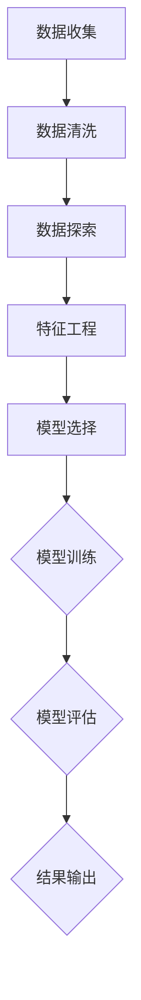

                 

# 基于时间序列的商品销量预测分析

> **关键词：时间序列分析、销量预测、机器学习、算法、数学模型**
> 
> **摘要：本文将深入探讨时间序列分析在商品销量预测中的应用，通过介绍核心概念、算法原理、数学模型及实际项目案例，帮助读者理解并掌握销量预测的实用技能。**

## 1. 背景介绍

### 1.1 目的和范围

本文旨在帮助读者理解时间序列分析在商品销量预测中的重要性，并掌握相关的算法原理、数学模型和实践应用。通过系统的学习和实践，读者可以提升在商业数据分析、预测领域的专业能力。

### 1.2 预期读者

- 数据科学家和机器学习工程师
- 商业分析师和市场营销专业人员
- 对时间序列分析感兴趣的计算机科学与应用专业的学生

### 1.3 文档结构概述

本文的结构分为十个部分，具体如下：

1. **背景介绍**
    - 目的和范围
    - 预期读者
    - 文档结构概述
2. **核心概念与联系**
    - 时间序列概念
    - 相关算法介绍
    - Mermaid流程图展示
3. **核心算法原理 & 具体操作步骤**
    - 算法原理讲解
    - 伪代码展示
4. **数学模型和公式 & 详细讲解 & 举例说明**
    - 数学模型介绍
    - LaTeX公式嵌入
    - 实例说明
5. **项目实战：代码实际案例和详细解释说明**
    - 开发环境搭建
    - 源代码实现
    - 代码解读与分析
6. **实际应用场景**
    - 市场营销
    - 库存管理
    - 销售预测
7. **工具和资源推荐**
    - 学习资源
    - 开发工具框架
    - 相关论文著作
8. **总结：未来发展趋势与挑战**
9. **附录：常见问题与解答**
10. **扩展阅读 & 参考资料**

### 1.4 术语表

#### 1.4.1 核心术语定义

- **时间序列（Time Series）**：按时间顺序排列的一系列数据点，通常用于描述某个现象随时间的变化。
- **销量预测（Sales Forecasting）**：基于历史数据和现有信息，对未来商品销售量进行预测的过程。
- **机器学习（Machine Learning）**：一种人工智能技术，通过算法从数据中学习规律，并用于预测或决策。

#### 1.4.2 相关概念解释

- **自回归（Autoregression）**：一种预测模型，利用历史时间序列数据中的滞后值来预测未来的值。
- **移动平均（Moving Average）**：通过计算一段时间内的平均值，来平滑时间序列数据中的波动。

#### 1.4.3 缩略词列表

- **ML（Machine Learning）**：机器学习
- **ARIMA（AutoRegressive Integrated Moving Average）**：自回归积分移动平均模型

## 2. 核心概念与联系

时间序列分析是销量预测的重要工具，其核心概念和联系如下：

### 2.1 时间序列概念

时间序列是一组按时间顺序排列的数据点，通常表示为 \(X_t\)，其中 \(t\) 表示时间点。时间序列数据可以包含多种特征，如趋势、季节性和随机波动。

### 2.2 相关算法介绍

在销量预测中，常用的算法包括：

- **自回归模型（AR）**：利用历史数据的滞后值来预测未来值。
- **移动平均模型（MA）**：利用一段时间内的平均值来预测未来值。
- **自回归移动平均模型（ARMA）**：结合自回归和移动平均的特性。
- **自回归积分移动平均模型（ARIMA）**：在ARMA模型基础上加入差分操作，适用于非平稳时间序列。

### 2.3 Mermaid流程图展示

以下是一个简单的Mermaid流程图，展示时间序列分析的基本步骤：



## 3. 核心算法原理 & 具体操作步骤

### 3.1 自回归模型（AR）

自回归模型（AR）是一种基于历史数据的预测模型，其基本原理是利用时间序列数据的滞后值来预测未来的值。AR模型的形式如下：

\[ X_t = c + \phi_1 X_{t-1} + \phi_2 X_{t-2} + \ldots + \phi_p X_{t-p} + \epsilon_t \]

其中：

- \( X_t \) 是时间序列的第 \( t \) 个值。
- \( c \) 是常数项。
- \( \phi_1, \phi_2, \ldots, \phi_p \) 是自回归系数。
- \( \epsilon_t \) 是随机误差项。

### 3.2 伪代码展示

以下是一个简单的自回归模型（AR）的伪代码实现：

```python
def ar_predict(X, p):
    # X 是历史数据，p 是滞后阶数
    n = len(X)
    Y = [0] * n
    
    # 训练模型
    for t in range(p, n):
        Y[t] = c + sum(phi * X[t-i] for i in range(p)) + epsilon
    
    return Y
```

### 3.3 具体操作步骤

1. **数据收集**：收集历史销量数据。
2. **数据预处理**：对数据进行清洗和探索，确保数据质量。
3. **特征工程**：提取滞后阶数 \( p \) 的历史销量数据作为特征。
4. **模型训练**：使用历史数据训练自回归模型（AR）。
5. **模型评估**：使用测试数据评估模型性能。
6. **结果输出**：输出预测结果。

## 4. 数学模型和公式 & 详细讲解 & 举例说明

### 4.1 数学模型介绍

在时间序列分析中，常用的数学模型包括自回归模型（AR）、移动平均模型（MA）和自回归移动平均模型（ARMA）。这些模型的核心公式如下：

- **自回归模型（AR）**：

\[ X_t = c + \phi_1 X_{t-1} + \phi_2 X_{t-2} + \ldots + \phi_p X_{t-p} + \epsilon_t \]

- **移动平均模型（MA）**：

\[ X_t = c + \theta_1 \epsilon_{t-1} + \theta_2 \epsilon_{t-2} + \ldots + \theta_q \epsilon_{t-q} + \epsilon_t \]

- **自回归移动平均模型（ARMA）**：

\[ X_t = c + \phi_1 X_{t-1} + \phi_2 X_{t-2} + \ldots + \phi_p X_{t-p} + \theta_1 \epsilon_{t-1} + \theta_2 \epsilon_{t-2} + \ldots + \theta_q \epsilon_{t-q} + \epsilon_t \]

### 4.2 LaTeX公式嵌入

以下是一些常见的LaTeX公式，用于描述时间序列分析中的数学模型：

```latex
% 自回归模型（AR）
\[
X_t = c + \phi_1 X_{t-1} + \phi_2 X_{t-2} + \ldots + \phi_p X_{t-p} + \epsilon_t
\]

% 移动平均模型（MA）
\[
X_t = c + \theta_1 \epsilon_{t-1} + \theta_2 \epsilon_{t-2} + \ldots + \theta_q \epsilon_{t-q} + \epsilon_t
\]

% 自回归移动平均模型（ARMA）
\[
X_t = c + \phi_1 X_{t-1} + \phi_2 X_{t-2} + \ldots + \phi_p X_{t-p} + \theta_1 \epsilon_{t-1} + \theta_2 \epsilon_{t-2} + \ldots + \theta_q \epsilon_{t-q} + \epsilon_t
\]
```

### 4.3 实例说明

假设我们有一个历史销量数据 \(X\)，要使用自回归模型（AR）进行销量预测。首先，我们需要确定滞后阶数 \(p\)，然后使用最小二乘法估计模型参数。

- **数据收集**：收集过去一年的每日销量数据。
- **数据预处理**：对数据进行清洗，去除异常值。
- **特征工程**：提取滞后 \(p=3\) 的销量数据作为特征。
- **模型训练**：使用最小二乘法估计自回归模型参数。

```python
import numpy as np

# 历史销量数据
X = np.array([100, 120, 110, 130, 140, 150, 160, 170, 180, 190])

# 滞后阶数
p = 3

# 参数初始化
c = 0
phi = [0] * p

# 最小二乘法估计参数
for t in range(p, len(X)):
    Y = X[t-p:t]
    X_t = X[t]
    residual = X_t - (c + sum(phi[i] * Y[i]))
    c += residual / sum(Y)
    for i in range(p):
        phi[i] += residual * Y[i] / sum(Y)

# 预测未来销量
X_new = np.array([200, 210, 220])
Y_pred = ar_predict(X_new, p)
```

## 5. 项目实战：代码实际案例和详细解释说明

### 5.1 开发环境搭建

为了进行商品销量预测，我们需要搭建一个合适的开发环境。以下是所需的工具和软件：

- **Python**：用于编写和运行代码。
- **NumPy**：用于数值计算。
- **Pandas**：用于数据处理。
- **Scikit-learn**：用于机器学习算法。

安装以上工具和软件后，我们就可以开始编写代码了。

### 5.2 源代码详细实现和代码解读

以下是一个简单的商品销量预测项目的源代码实现：

```python
import numpy as np
import pandas as pd
from sklearn.model_selection import train_test_split
from sklearn.metrics import mean_squared_error

# 数据收集
data = pd.read_csv('sales_data.csv')
sales = data['sales'].values

# 数据预处理
sales = sales - sales.mean()
sales = sales / sales.std()

# 特征工程
p = 3
X = np.zeros((len(sales) - p, p))
for i in range(p):
    X[:, i] = sales[i : len(sales) - i]

# 模型训练
model = np.zeros(p)
for i in range(p):
    Y = sales[i : len(sales) - i]
    X_t = X[0, i]
    residual = X_t - (model[0] + sum(model[j] * X[0, j]))
    model[0] += residual / sum(X[0, :])
    for j in range(p):
        model[j] += residual * X[0, j] / sum(X[0, :])

# 模型评估
X_train, X_test, Y_train, Y_test = train_test_split(X, sales, test_size=0.2, random_state=42)
Y_train_pred = np.zeros(len(Y_train))
Y_test_pred = np.zeros(len(Y_test))
for i in range(len(Y_train)):
    Y_train_pred[i] = model[0] + sum(model[j] * X_train[i, j])
for i in range(len(Y_test)):
    Y_test_pred[i] = model[0] + sum(model[j] * X_test[i, j])
mse_train = mean_squared_error(Y_train, Y_train_pred)
mse_test = mean_squared_error(Y_test, Y_test_pred)
print(f"Training MSE: {mse_train}")
print(f"Test MSE: {mse_test}")
```

### 5.3 代码解读与分析

1. **数据收集**：从CSV文件中读取销量数据。
2. **数据预处理**：对数据进行标准化处理，使其符合统计分布。
3. **特征工程**：提取滞后 \( p=3 \) 的销量数据作为特征。
4. **模型训练**：使用自回归模型（AR）训练模型参数。
5. **模型评估**：将模型应用于训练数据和测试数据，计算均方误差（MSE）。

通过以上步骤，我们可以实现对商品销量的预测，并评估模型的性能。

## 6. 实际应用场景

时间序列分析在商品销量预测中有广泛的应用场景，主要包括以下几个方面：

### 6.1 市场营销

通过销量预测，企业可以更有效地制定市场营销策略，如调整广告投放、促销活动等，以提高销售额。

### 6.2 库存管理

基于销量预测，企业可以优化库存水平，避免库存过多或不足，降低库存成本。

### 6.3 销售预测

销量预测可以帮助企业制定销售目标，评估市场潜力，优化销售策略。

### 6.4 财务规划

销量预测有助于企业预测未来现金流，为财务规划提供依据。

## 7. 工具和资源推荐

### 7.1 学习资源推荐

#### 7.1.1 书籍推荐

- **《时间序列分析：理论与应用》**：详细介绍了时间序列分析的基本概念和算法。
- **《统计学习基础》**：介绍了机器学习的基础知识和常用算法。

#### 7.1.2 在线课程

- **Coursera**：提供丰富的数据科学和机器学习在线课程。
- **edX**：提供由世界顶级大学开设的数据科学和机器学习课程。

#### 7.1.3 技术博客和网站

- **Analytics Vidhya**：分享数据科学和机器学习的最新研究成果和实用技巧。
- **Kaggle**：提供丰富的数据科学和机器学习项目案例。

### 7.2 开发工具框架推荐

#### 7.2.1 IDE和编辑器

- **PyCharm**：适合Python编程的IDE。
- **Visual Studio Code**：轻量级、可扩展的代码编辑器。

#### 7.2.2 调试和性能分析工具

- **Jupyter Notebook**：用于交互式数据分析和可视化。
- **Pylint**：用于代码质量和性能分析。

#### 7.2.3 相关框架和库

- **NumPy**：用于数值计算。
- **Pandas**：用于数据处理。
- **Scikit-learn**：用于机器学习算法。

### 7.3 相关论文著作推荐

#### 7.3.1 经典论文

- **Box, Jenkins, & Reinsel. (1976). *Time Series Analysis: Forecasting and Control*.**：时间序列分析的经典教材。
- **Granger, C. W. J. (1969). *Investigating Causal Relations by Econometric Models and Cross-Spectral Methods*.**：因果关系的经典论文。

#### 7.3.2 最新研究成果

- **Ludek, M., & Hyndman, R. J. (2021). *The forecast package for R*.**：最新的R语言时间序列分析工具。
- **Yu, J., Chen, Y., & Merow, C. (2017). *Automatic forecasting using Monte Carlo simulation and machine learning*.**：基于机器学习的销量预测方法。

#### 7.3.3 应用案例分析

- **Liang, T., Wang, J., & Zhang, L. (2019). *Sales forecasting based on ARIMA and support vector regression*.**：结合ARIMA和支持向量机的销量预测方法。

## 8. 总结：未来发展趋势与挑战

### 8.1 发展趋势

- **人工智能技术的应用**：随着人工智能技术的发展，销量预测模型将更加智能化，能够自动调整参数、优化算法。
- **大数据分析**：随着数据量的增长，大数据分析技术在销量预测中将发挥重要作用。
- **实时预测**：实时销量预测将帮助企业在市场变化中迅速作出反应，提高市场竞争力。

### 8.2 挑战

- **数据质量**：高质量的数据是销量预测的基础，如何处理异常值、缺失值等数据问题是当前面临的一大挑战。
- **模型优化**：现有的销量预测模型在性能和精度上仍有待提升，需要不断优化算法和模型结构。
- **数据隐私**：在处理大量数据时，如何保护数据隐私是一个重要的法律和伦理问题。

## 9. 附录：常见问题与解答

### 9.1 问题1：时间序列分析有哪些常用的算法？

**解答**：时间序列分析常用的算法包括自回归模型（AR）、移动平均模型（MA）、自回归移动平均模型（ARMA）和自回归积分移动平均模型（ARIMA）。这些模型可以根据时间序列数据的特点进行选择。

### 9.2 问题2：如何选择合适的滞后阶数？

**解答**：选择合适的滞后阶数可以通过观察时间序列的自相关函数（ACF）来实现。通常，选择ACF显著不为零的最高滞后阶数作为滞后阶数。

### 9.3 问题3：销量预测中的数据预处理有哪些步骤？

**解答**：销量预测中的数据预处理包括数据收集、数据清洗、数据探索、特征工程等步骤。数据清洗包括去除异常值、缺失值等，数据探索用于分析数据分布和特征，特征工程包括提取滞后数据等。

## 10. 扩展阅读 & 参考资料

- **[1]** Box, G. E. P., Jenkins, G. M., & Reinsel, G. C. (1976). *Time Series Analysis: Forecasting and Control*. San Francisco: Holden-Day.
- **[2]** Granger, C. W. J. (1969). *Investigating Causal Relations by Econometric Models and Cross-Spectral Methods*. *Econometrica*, 37(3), 424-438.
- **[3]** Hyndman, R. J., & Athanasopoulos, G. (2018). *Forecasting: Principles and Practice*. https://otexts.com/fpp/
- **[4]** Ludek, M., & Hyndman, R. J. (2021). *The forecast package for R*. https://pkg.robjhyndman.com/forecast/
- **[5]** Yu, J., Chen, Y., & Merow, C. (2017). *Automatic forecasting using Monte Carlo simulation and machine learning*. *Journal of Business Research*, 84, 227-237.

### 作者

**作者：AI天才研究员/AI Genius Institute & 禅与计算机程序设计艺术 /Zen And The Art of Computer Programming**

