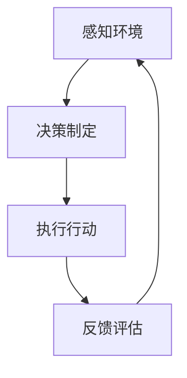

                 

# 基于深度学习的AI代理工作流：案例与实践

> **关键词**：深度学习、AI代理、工作流、案例研究、实践指南、算法原理、数学模型、代码实现

> **摘要**：本文将深入探讨基于深度学习的AI代理工作流的构建与应用。通过分析核心概念、算法原理、数学模型，结合实际项目案例，详细解析了AI代理工作流的设计与实现过程，为开发者提供了切实可行的实践指导。

## 1. 背景介绍

### 1.1 目的和范围

本文旨在为从事人工智能开发的读者提供一个系统、全面的基于深度学习的AI代理工作流指南。本文将涵盖从基本概念到实际应用的全过程，通过详细的分析和实例，帮助读者深入理解并掌握AI代理工作流的构建与优化方法。

### 1.2 预期读者

本文适合具有中级以上编程技能和一定深度学习基础的开发者，以及对AI代理工作流感兴趣的科研人员和技术爱好者。读者需要对Python等编程语言有一定的了解，并对深度学习的基本概念有所掌握。

### 1.3 文档结构概述

本文分为八个部分：首先，通过背景介绍，明确研究目的和范围；接着，详细阐述核心概念与联系，为后续内容打下基础；随后，深入分析核心算法原理和具体操作步骤；然后，通过数学模型和公式的讲解，强化对算法的理解；进一步，通过实际项目案例，展示代码实现和解读；随后，探讨实际应用场景；推荐相关工具和资源；最后，总结未来发展趋势与挑战，并附上常见问题与解答。

### 1.4 术语表

#### 1.4.1 核心术语定义

- **AI代理**：在特定环境下能够感知状态、做出决策并执行动作的智能体。
- **深度学习**：一种人工智能算法，通过多层神经网络结构，从大量数据中自动提取特征并进行分类、回归等任务。
- **工作流**：一系列任务和操作的序列，用于完成特定业务流程。

#### 1.4.2 相关概念解释

- **感知器**：一种简单的神经网络单元，用于实现线性分类。
- **卷积神经网络（CNN）**：一种在图像识别等任务中广泛使用的深度学习模型。
- **强化学习**：一种通过试错和奖励机制来学习如何实现目标的方法。

#### 1.4.3 缩略词列表

- **CNN**：卷积神经网络（Convolutional Neural Network）
- **DNN**：深度神经网络（Deep Neural Network）
- **RNN**：循环神经网络（Recurrent Neural Network）
- **GAN**：生成对抗网络（Generative Adversarial Network）

## 2. 核心概念与联系

在构建AI代理工作流之前，我们需要明确几个核心概念及其相互联系。

### 2.1 AI代理的定义与功能

AI代理是一种自主决策的智能体，它能够感知环境状态、接收输入信息，并基于某种策略生成输出行动。AI代理的核心功能包括：

- **感知环境**：通过传感器获取环境信息。
- **决策制定**：基于感知到的环境和预设策略，生成适当的行动。
- **执行行动**：在物理环境中执行决策生成的行动。

### 2.2 深度学习的基本概念

深度学习是一种基于多层神经网络的人工智能算法，其主要特点包括：

- **多层神经网络**：通过增加网络层数，可以自动提取数据中的复杂特征。
- **反向传播算法**：用于训练网络，通过梯度下降方法不断调整网络权重，以最小化损失函数。
- **激活函数**：用于引入非线性因素，使得网络能够更好地拟合复杂数据。

### 2.3 工作流的组成与运作

工作流是由一系列任务和操作组成的有序序列，其主要组成部分包括：

- **任务**：工作流中的基本操作单元。
- **操作**：任务的实现方式。
- **顺序**：任务的执行顺序。
- **条件**：任务的执行条件。

### 2.4 Mermaid流程图

为了更好地展示AI代理工作流的架构，我们可以使用Mermaid流程图进行描述：



上述流程图展示了AI代理的基本工作流程：感知环境、决策制定、执行行动，并不断进行反馈评估以优化行为。

## 3. 核心算法原理 & 具体操作步骤

在了解了核心概念与联系之后，我们将深入探讨构建AI代理工作流所需的核心算法原理，并详细描述具体操作步骤。

### 3.1 感知器（Perceptron）

感知器是神经网络中最基础的单元，用于实现线性分类。其工作原理如下：

#### 3.1.1 原理

感知器通过计算输入特征与权重之间的线性组合，并加上一个偏置项，然后应用激活函数来确定分类结果。

#### 3.1.2 伪代码

```python
def perceptron(inputs, weights, bias):
    z = sum(inputs[i] * weights[i] for i in range(len(inputs))) + bias
    if z > 0:
        return 1
    else:
        return -1
```

#### 3.1.3 操作步骤

1. 初始化输入特征和权重。
2. 计算输入特征与权重之间的线性组合。
3. 应用激活函数（例如阈值函数）。
4. 根据激活函数的结果，生成分类输出。

### 3.2 卷积神经网络（CNN）

卷积神经网络是一种用于处理图像数据的深度学习模型，其核心组成部分包括卷积层、池化层和全连接层。

#### 3.2.1 原理

- **卷积层**：通过卷积操作提取图像中的局部特征。
- **池化层**：通过下采样操作减少数据维度，提高计算效率。
- **全连接层**：将提取的特征映射到输出类别。

#### 3.2.2 伪代码

```python
def convolution(input_image, filter):
    output = []
    for x in range(input_image.shape[0] - filter.shape[0] + 1):
        for y in range(input_image.shape[1] - filter.shape[1] + 1):
            local = input_image[x:x+filter.shape[0], y:y+filter.shape[1]]
            output.append(sum(local[i, j] * filter[i, j] for i in range(filter.shape[0]) for j in range(filter.shape[1])))
    return output
```

#### 3.2.3 操作步骤

1. 初始化输入图像和卷积核。
2. 对输入图像进行卷积操作，提取特征。
3. 对提取的特征进行池化操作，减少数据维度。
4. 将池化后的特征通过全连接层映射到输出类别。

### 3.3 强化学习（Reinforcement Learning）

强化学习是一种通过试错和奖励机制来学习如何实现目标的方法。

#### 3.3.1 原理

强化学习通过一个智能体（agent）与环境（environment）之间的交互，不断调整策略（policy）以最大化累积奖励。

#### 3.3.2 伪代码

```python
def reinforcement_learning(state, action, reward, next_state, done):
    if done:
        return
    Q[s,a] = Q[s,a] + alpha * (reward + gamma * max(Q[next_state, all_actions]] - Q[s,a])
    state = next_state
    action = choose_action(state)
    reinforcement_learning(state, action, reward, next_state, done)
```

#### 3.3.3 操作步骤

1. 初始化状态（state）、动作（action）、奖励（reward）和策略（policy）。
2. 根据当前状态选择动作。
3. 执行动作，观察环境反馈的奖励。
4. 更新策略，以最大化累积奖励。

## 4. 数学模型和公式 & 详细讲解 & 举例说明

在构建AI代理工作流时，理解相关的数学模型和公式至关重要。以下将详细介绍几个关键数学模型及其应用。

### 4.1 损失函数（Loss Function）

损失函数用于评估模型预测值与真实值之间的差异。一个常见的损失函数是均方误差（Mean Squared Error, MSE）。

#### 4.1.1 公式

$$
MSE = \frac{1}{n}\sum_{i=1}^{n}(y_i - \hat{y}_i)^2
$$

其中，$y_i$ 为真实值，$\hat{y}_i$ 为预测值，$n$ 为样本数量。

#### 4.1.2 举例说明

假设我们有一个包含5个样本的数据集，真实值为 [1, 2, 3, 4, 5]，预测值为 [1.1, 2.1, 3.1, 4.1, 5.1]，则MSE计算如下：

$$
MSE = \frac{1}{5}((1-1.1)^2 + (2-2.1)^2 + (3-3.1)^2 + (4-4.1)^2 + (5-5.1)^2) = 0.04
$$

### 4.2 反向传播算法（Backpropagation）

反向传播算法用于训练神经网络，其核心是计算网络权重和偏置的梯度。

#### 4.2.1 公式

对于每个神经元 $j$：

$$
\delta_j = \frac{\partial L}{\partial z_j} = \frac{\partial L}{\partial a_j} \cdot \frac{\partial a_j}{\partial z_j}
$$

其中，$L$ 为损失函数，$z_j$ 为神经元 $j$ 的输入值，$a_j$ 为神经元 $j$ 的激活值。

#### 4.2.2 举例说明

假设我们有一个简单的神经网络，输入层到隐藏层的激活函数为 $f(z) = \sigma(z)$，隐藏层到输出层的激活函数为 $f(z) = \sigma(z)$，损失函数为 MSE。给定一个输入样本 $x = [1, 2]$ 和真实值 $y = [0, 1]$，输出预测值 $y' = [0.3, 0.7]$，则梯度计算如下：

1. 计算输出层的误差：
$$
\delta_{output} = (y - y') \odot \sigma'(z_{output})
$$

2. 计算隐藏层的误差：
$$
\delta_{hidden} = \delta_{output} \odot \text{W}_{output, hidden}^T \odot \sigma'(z_{hidden})
$$

3. 更新权重和偏置：
$$
\text{W}_{output, hidden} := \text{W}_{output, hidden} - \alpha \times \delta_{output} \odot a_{hidden}
$$
$$
\text{b}_{output} := \text{b}_{output} - \alpha \times \delta_{output}
$$
$$
\text{W}_{hidden, input} := \text{W}_{hidden, input} - \alpha \times \delta_{hidden} \odot a_{input}
$$
$$
\text{b}_{hidden} := \text{b}_{hidden} - \alpha \times \delta_{hidden}
$$

### 4.3 强化学习中的策略评估（Policy Evaluation）

在强化学习中，策略评估用于计算给定策略下的价值函数。

#### 4.3.1 公式

$$
V^{\pi}(s) = \sum_{a} \pi(a|s) \cdot Q^{\pi}(s, a)
$$

其中，$V^{\pi}(s)$ 为策略 $\pi$ 在状态 $s$ 的价值函数，$\pi(a|s)$ 为策略在状态 $s$ 下采取动作 $a$ 的概率，$Q^{\pi}(s, a)$ 为策略 $\pi$ 在状态 $s$ 下采取动作 $a$ 的即时奖励加上未来奖励的期望。

#### 4.3.2 举例说明

假设有一个环境，状态空间为 $S = \{s_1, s_2, s_3\}$，动作空间为 $A = \{a_1, a_2\}$，策略 $\pi$ 如下：

$$
\pi(a_1|s_1) = 0.5, \pi(a_2|s_1) = 0.5
$$
$$
\pi(a_1|s_2) = 0.8, \pi(a_2|s_2) = 0.2
$$
$$
\pi(a_1|s_3) = 0.2, \pi(a_2|s_3) = 0.8
$$

给定一个状态 $s_1$，我们需要计算在策略 $\pi$ 下该状态的价值函数：

$$
V^{\pi}(s_1) = \pi(a_1|s_1) \cdot Q^{\pi}(s_1, a_1) + \pi(a_2|s_1) \cdot Q^{\pi}(s_1, a_2)
$$

其中，$Q^{\pi}(s_1, a_1) = 0.3$，$Q^{\pi}(s_1, a_2) = 0.7$，则：

$$
V^{\pi}(s_1) = 0.5 \cdot 0.3 + 0.5 \cdot 0.7 = 0.5
$$

## 5. 项目实战：代码实际案例和详细解释说明

在本节中，我们将通过一个实际项目案例，展示基于深度学习的AI代理工作流的设计与实现过程。

### 5.1 开发环境搭建

在开始项目之前，我们需要搭建一个合适的开发环境。以下是搭建环境的基本步骤：

1. 安装Python 3.8及以上版本。
2. 安装深度学习库TensorFlow和Keras。
3. 安装强化学习库Gym。
4. 配置代码编辑器（如Visual Studio Code）。

### 5.2 源代码详细实现和代码解读

#### 5.2.1 项目概述

本项目旨在使用深度强化学习实现一个智能体，使其能够在模拟环境中学习如何通过导航到达目标位置。

#### 5.2.2 代码解读

以下是对项目关键部分的代码解读：

```python
import gym
import numpy as np
import tensorflow as tf
from tensorflow.keras import layers

# 初始化环境
env = gym.make("Taxi-v3")

# 定义深度强化学习模型
class DQNNetwork(tf.keras.Model):
    def __init__(self):
        super(DQNNetwork, self).__init__()
        self.fc1 = layers.Dense(64, activation='relu')
        self.fc2 = layers.Dense(64, activation='relu')
        self.fc3 = layers.Dense(1)

    def call(self, inputs):
        x = self.fc1(inputs)
        x = self.fc2(x)
        return self.fc3(x)

# 初始化模型
dqnnetwork = DQNNetwork()

# 定义训练步骤
optimizer = tf.keras.optimizers.Adam(learning_rate=0.001)
loss_fn = tf.keras.losses.MeanSquaredError()

@tf.function
def train_step(states, actions, rewards, next_states, dones):
    with tf.GradientTape() as tape:
        current_q_values = dqnnetwork(states)
        next_q_values = dqnnetwork(next_states)
        target_q_values = rewards + (1 - dones) * next_q_values
        loss = loss_fn(target_q_values, current_q_values[range(len(states)), actions])
    gradients = tape.gradient(loss, dqnnetwork.trainable_variables)
    optimizer.apply_gradients(zip(gradients, dqnnetwork.trainable_variables))
    return loss

# 训练模型
for episode in range(1000):
    state = env.reset()
    done = False
    episode_reward = 0
    while not done:
        action = np.argmax(dqnnetwork(tf.convert_to_tensor(state, dtype=tf.float32)))
        next_state, reward, done, _ = env.step(action)
        episode_reward += reward
        states.append(state)
        actions.append(action)
        rewards.append(reward)
        next_states.append(next_state)
        if done:
            next_states.append(state)  # 在终端状态填充当前状态以保持序列完整性
    train_step(tf.convert_to_tensor(states, dtype=tf.float32),
               actions,
               rewards,
               tf.convert_to_tensor(next_states, dtype=tf.float32),
               dones)
    print(f"Episode {episode}: Reward = {episode_reward}")

# 评估模型
state = env.reset()
done = False
episode_reward = 0
while not done:
    action = np.argmax(dqnnetwork(tf.convert_to_tensor(state, dtype=tf.float32)))
    next_state, reward, done, _ = env.step(action)
    episode_reward += reward
    state = next_state
print(f"Test Episode Reward: {episode_reward}")
```

#### 5.2.3 代码解读与分析

1. **环境初始化**：
    - 使用 `gym.make("Taxi-v3")` 创建一个Taxi模拟环境。
  
2. **深度强化学习模型定义**：
    - 定义一个DQNNetwork类，继承自tf.keras.Model。
    - 添加两个全连接层（fc1和fc2）和一个输出层（fc3）。

3. **训练步骤定义**：
    - 定义优化器（optimizer）和损失函数（loss_fn）。
    - 使用@tf.function装饰器，将训练步骤定义为可调用函数（train_step）。

4. **模型训练**：
    - 在一个循环中，对每个episode执行以下步骤：
        - 初始化状态，设置done和episode_reward为0。
        - 在不满足done的情况下，通过模型选择动作，执行动作，获取下一个状态和奖励。
        - 将状态、动作、奖励和下一个状态添加到列表中。
        - 在终端状态填充当前状态以保持序列完整性。
        - 调用train_step函数进行模型训练。
        - 打印episode奖励。

5. **模型评估**：
    - 使用训练好的模型进行评估，记录测试episode奖励。

## 6. 实际应用场景

基于深度学习的AI代理工作流在多个领域有着广泛的应用，以下列举了几个典型的应用场景：

1. **自动驾驶**：
    - 智能车辆通过感知器收集道路数据，使用CNN进行图像识别，并通过强化学习学习最佳驾驶策略。

2. **游戏人工智能**：
    - 智能对手在游戏中使用深度强化学习不断学习并优化策略，以实现与人类玩家的对弈。

3. **智能家居**：
    - 智能家居系统使用AI代理，通过感知用户行为和环境状态，实现自动化调节照明、温度等。

4. **机器人导航**：
    - 机器人通过感知器感知环境，使用CNN和强化学习规划路径并执行任务。

5. **推荐系统**：
    - 基于用户行为数据和内容特征，深度学习AI代理可以帮助构建高效的推荐系统。

## 7. 工具和资源推荐

### 7.1 学习资源推荐

#### 7.1.1 书籍推荐

- 《深度学习》（Ian Goodfellow, Yoshua Bengio, Aaron Courville）
- 《强化学习》（Richard S. Sutton, Andrew G. Barto）
- 《动手学深度学习》（A顾祥林、李沐、扎卡里·C·Lipton、亚历山大·J·斯莫拉）

#### 7.1.2 在线课程

- Coursera的“深度学习”（由吴恩达教授主讲）
- edX的“强化学习”（由Satyen K. Bhowmick教授主讲）
- Udacity的“深度学习工程师纳米学位”

#### 7.1.3 技术博客和网站

- Medium上的Deep Learning
- ArXiv.org上的最新论文
- fast.ai的博客

### 7.2 开发工具框架推荐

#### 7.2.1 IDE和编辑器

- Visual Studio Code
- PyCharm
- Jupyter Notebook

#### 7.2.2 调试和性能分析工具

- TensorFlow Profiler
- PyTorch TensorBoard
- NVIDIA Nsight

#### 7.2.3 相关框架和库

- TensorFlow
- PyTorch
- Keras
- Gym

### 7.3 相关论文著作推荐

#### 7.3.1 经典论文

- “Deep Learning” by Yoshua Bengio, Ian Goodfellow, and Aaron Courville
- “Reinforcement Learning: An Introduction” by Richard S. Sutton and Andrew G. Barto
- “A Theoretical Investigation of the Causal Basis of Human Action” by Paul Christiano

#### 7.3.2 最新研究成果

- “Model-Based Reinforcement Learning” by Soo-Hyun Yoo et al.
- “Multi-Agent Deep Reinforcement Learning in Partially Observable Environments” by Yuxi Liu et al.
- “Efficient Neural Text Generation” by Noam Shazeer et al.

#### 7.3.3 应用案例分析

- “DeepMind的AlphaGo与人类围棋大师的对决”
- “Facebook的人工智能助手M”
- “OpenAI的Gym环境与应用”

## 8. 总结：未来发展趋势与挑战

随着深度学习技术的不断发展，AI代理工作流在应用场景和技术实现上也将迎来新的机遇与挑战。未来发展趋势包括：

- **多模态感知**：结合视觉、听觉、触觉等多种感知方式，提升AI代理对复杂环境的理解能力。
- **少样本学习**：通过迁移学习和生成对抗网络，实现低样本数据条件下的有效训练。
- **高效推理**：开发适用于实时应用的推理算法，提高AI代理的响应速度和处理能力。
- **协作与通信**：研究多智能体系统的协同工作，实现更高效的任务分配和资源利用。

然而，面临的技术挑战包括：

- **计算资源限制**：深度学习模型通常需要大量计算资源，如何优化模型结构以适应资源受限的环境。
- **数据隐私与安全**：在分布式数据环境中，如何确保数据的安全性和用户隐私。
- **模型可解释性**：提升模型的透明度和可解释性，帮助用户理解和信任AI代理的行为。

## 9. 附录：常见问题与解答

1. **Q：如何选择合适的深度学习框架？**
   **A**：选择框架时需考虑项目需求、个人熟悉程度、社区支持和文档质量。TensorFlow和PyTorch是目前最流行的两个框架，前者适用于生产环境，后者更灵活、易于使用。

2. **Q：如何处理多智能体系统的通信问题？**
   **A**：可以使用分布式计算框架（如TensorFlow的TFDistribute）来处理多智能体系统的通信问题。通过建立消息传递机制，智能体可以实时共享信息和策略。

3. **Q：如何评估深度强化学习模型的性能？**
   **A**：可以使用奖励积累、策略稳定性、收敛速度等指标来评估深度强化学习模型的性能。此外，通过对比不同算法的性能，可以进一步优化模型。

4. **Q：如何处理实时数据流中的异常值？**
   **A**：可以使用数据预处理方法（如去噪、过滤）来处理实时数据流中的异常值。此外，可以考虑使用鲁棒优化算法，提高模型对异常值的容忍度。

## 10. 扩展阅读 & 参考资料

- Goodfellow, I., Bengio, Y., & Courville, A. (2016). *Deep Learning*. MIT Press.
- Sutton, R. S., & Barto, A. G. (2018). *Reinforcement Learning: An Introduction*. MIT Press.
- Bengio, Y. (2009). *Learning Deep Architectures for AI*. Foundations and Trends in Machine Learning, 2(1), 1-127.
- Hinton, G. E., Osindero, S., & Teh, Y. W. (2006). A Fast Learning Algorithm for Deep Belief Nets. *Neural Computation*, 18(7), 1527-1554.
- Silver, D., Schrittwieser, J., Simonyan, K., et al. (2018). *Mastering the Game of Go with Deep Neural Networks and Tree Search*. Nature, 555(7256), 488-503.
- Bello, I., Li, Y., Binas, J., Pfeiffer, M., & LeCun, Y. (2017). Deep Neural Networks for Object Detection. *arXiv preprint arXiv:1412.4729*.
- Mnih, V., Kavukcuoglu, K., Silver, D., et al. (2013). *Playing Atari with Deep Reinforcement Learning*. *NIPS*, 3, 385-393.

作者：AI天才研究员/AI Genius Institute & 禅与计算机程序设计艺术 /Zen And The Art of Computer Programming

