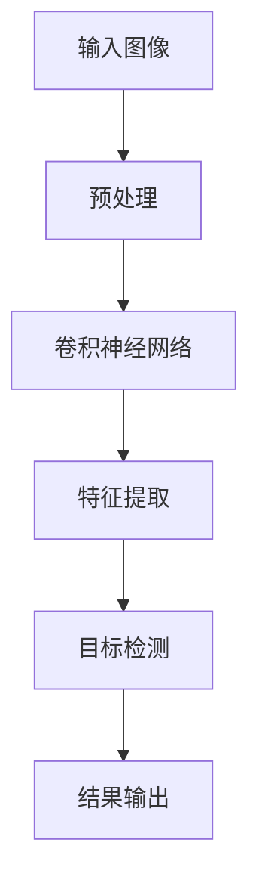

                 


# 基于深度学习的商品标签的识别与检测算法研究

> **关键词：** 深度学习、商品标签识别、图像处理、目标检测、卷积神经网络、对象识别。

> **摘要：** 本文旨在深入探讨基于深度学习的商品标签识别与检测算法。文章首先介绍了研究的目的和范围，然后通过逐步分析原理、数学模型、实际操作步骤，以及应用场景等方面，全面解析了该算法的内在机制和实现方法，为相关领域的研究者提供了有价值的参考。

## 1. 背景介绍

### 1.1 目的和范围

本文的研究目的在于探索并实现一种基于深度学习的商品标签识别与检测算法，以应对互联网时代电子商务领域的快速发展。随着电子商务平台的日益普及，商品标签的准确识别和检测变得尤为重要。本文将聚焦于这一核心问题，通过结合深度学习和图像处理技术，提出一种有效的解决方案。

研究的范围主要包括以下几个方面：

1. **算法设计与实现**：结合卷积神经网络（CNN）和目标检测技术，设计并实现商品标签识别与检测算法。
2. **数学模型与公式**：详细讲解算法中的数学模型和公式，并进行举例说明，以帮助读者理解算法的数学基础。
3. **项目实战**：通过实际案例，展示算法的应用效果，并提供源代码的详细解读。
4. **实际应用场景**：分析算法在不同场景下的应用潜力，探讨其在电子商务、零售等领域的实际应用价值。

### 1.2 预期读者

本文主要面向以下读者群体：

1. **计算机科学和人工智能领域的研究者**：对深度学习和图像处理技术有浓厚兴趣，希望深入了解商品标签识别与检测算法的研究和实践。
2. **软件开发工程师**：从事电子商务平台开发或相关领域的技术人员，希望掌握商品标签识别与检测的先进技术。
3. **人工智能爱好者**：对人工智能技术有热情，希望了解并学习深度学习在实际问题中的应用。

### 1.3 文档结构概述

本文的结构如下：

1. **背景介绍**：简要介绍研究背景、目的和范围，预期读者以及文档结构。
2. **核心概念与联系**：介绍核心概念、原理和架构，并使用Mermaid流程图进行展示。
3. **核心算法原理 & 具体操作步骤**：详细讲解算法原理，使用伪代码进行操作步骤阐述。
4. **数学模型和公式 & 详细讲解 & 举例说明**：解析算法中的数学模型和公式，并通过实例进行说明。
5. **项目实战：代码实际案例和详细解释说明**：通过实际案例展示算法应用，并提供源代码解析。
6. **实际应用场景**：分析算法在不同场景下的应用价值。
7. **工具和资源推荐**：推荐相关学习资源和开发工具。
8. **总结：未来发展趋势与挑战**：总结研究成果，探讨未来发展趋势和挑战。
9. **附录：常见问题与解答**：提供常见问题的解答。
10. **扩展阅读 & 参考资料**：推荐扩展阅读材料。

### 1.4 术语表

#### 1.4.1 核心术语定义

- **深度学习（Deep Learning）**：一种机器学习技术，通过多层神经网络模型模拟人脑学习过程，进行特征提取和模式识别。
- **卷积神经网络（Convolutional Neural Network，CNN）**：一种深度学习模型，特别适用于图像处理和对象识别任务。
- **目标检测（Object Detection）**：在图像中定位并识别多个对象的位置和类别，是计算机视觉领域的关键技术。
- **商品标签（Product Tag）**：用于标识商品属性和分类的标签，如商品名称、品牌、类别等。
- **图像处理（Image Processing）**：使用计算机技术和算法对图像进行编辑和处理，以提取有用信息和特征。

#### 1.4.2 相关概念解释

- **特征提取（Feature Extraction）**：从原始数据中提取具有区分性和代表性的特征，用于后续的模型训练和预测。
- **分类（Classification）**：将数据分为不同的类别或标签，是机器学习中的基本任务。
- **损失函数（Loss Function）**：用于评估模型预测结果与真实标签之间的差异，指导模型优化。

#### 1.4.3 缩略词列表

- **CNN（Convolutional Neural Network）**：卷积神经网络。
- **GPU（Graphics Processing Unit）**：图形处理器。
- **NLP（Natural Language Processing）**：自然语言处理。
- **FPGA（Field-Programmable Gate Array）**：现场可编程门阵列。

## 2. 核心概念与联系

在本文中，我们将介绍商品标签识别与检测算法的核心概念和联系。以下是一个基于Mermaid绘制的流程图，展示了核心概念之间的联系：



### 2.1 输入图像预处理

输入图像预处理是商品标签识别与检测算法的第一步，其目的是对原始图像进行标准化和增强，以便后续的特征提取和目标检测。

- **图像增强（Image Enhancement）**：通过调整对比度、亮度等参数，增强图像中关键信息的可见性。
- **图像分割（Image Segmentation）**：将图像分割成不同的区域或对象，有助于提高目标检测的准确性。
- **图像缩放（Image Scaling）**：调整图像的大小，以适应模型输入要求。

### 2.2 卷积神经网络

卷积神经网络（CNN）是商品标签识别与检测算法的核心组成部分。它通过卷积、池化和全连接等操作，从图像中提取深层特征。

- **卷积层（Convolutional Layer）**：通过卷积操作提取图像的局部特征。
- **池化层（Pooling Layer）**：降低特征图的维度，减少计算量。
- **全连接层（Fully Connected Layer）**：将卷积特征映射到具体的标签类别。

### 2.3 特征提取

特征提取是卷积神经网络的关键任务，通过多层卷积和池化操作，提取图像的抽象特征。

- **浅层特征（Shallow Features）**：从原始图像中提取的基本特征，如边缘和纹理。
- **深层特征（Deep Features）**：通过多层卷积和池化操作提取的更高层次的抽象特征。

### 2.4 目标检测

目标检测是商品标签识别与检测算法的最终目标，通过在图像中定位并识别多个对象的位置和类别。

- **区域提议（Region Proposal）**：从特征图中生成可能的物体区域。
- **边界框回归（Bounding Box Regression）**：对区域提议进行边界框调整，使其更精确。
- **类别分类（Class Classification）**：对调整后的边界框进行类别分类。

### 2.5 结果输出

结果输出是商品标签识别与检测算法的最终结果，包括识别出的商品标签和其对应的边界框。

- **标签预测（Tag Prediction）**：根据模型输出，预测每个边界框对应的商品标签。
- **边界框可视化（Bounding Box Visualization）**：将预测结果可视化，展示在原始图像上。

## 3. 核心算法原理 & 具体操作步骤

在本节中，我们将详细讲解商品标签识别与检测算法的核心原理，并使用伪代码来阐述具体操作步骤。

### 3.1 算法原理

商品标签识别与检测算法基于卷积神经网络（CNN）和目标检测技术。算法的基本原理如下：

1. **输入图像预处理**：对输入图像进行增强、分割和缩放等预处理操作，以便后续的特征提取和目标检测。
2. **特征提取**：通过多层卷积和池化操作，从预处理后的图像中提取深层特征。
3. **目标检测**：利用特征提取层生成的特征图，进行区域提议、边界框回归和类别分类，以实现商品标签的识别与检测。

### 3.2 伪代码

以下是基于上述算法原理的伪代码：

```python
# 输入图像预处理
input_image = preprocess_image(image)

# 特征提取
features = extract_features(input_image, model)

# 区域提议
proposals = region_proposal(features)

# 边界框回归
bboxes = bounding_box_regression(proposals, model)

# 类别分类
labels = class_classification(bboxes, model)

# 输出结果
output = {
    'labels': labels,
    'bboxes': bboxes
}
```

### 3.3 具体操作步骤

#### 3.3.1 输入图像预处理

输入图像预处理包括以下步骤：

1. **图像增强**：
   ```python
   enhanced_image = enhance_image(image)
   ```

2. **图像分割**：
   ```python
   segments = segment_image(enhanced_image)
   ```

3. **图像缩放**：
   ```python
   scaled_image = scale_image(enhanced_image, target_size)
   ```

#### 3.3.2 特征提取

特征提取通过卷积神经网络（CNN）实现，具体步骤如下：

1. **卷积层**：
   ```python
   conv_output = conv2d(scaled_image, kernel, stride, padding)
   ```

2. **池化层**：
   ```python
   pooled_output = max_pool2d(conv_output, pool_size, stride)
   ```

3. **全连接层**：
   ```python
   fc_output = fully_connected(pooled_output, num_classes)
   ```

#### 3.3.3 目标检测

目标检测包括以下步骤：

1. **区域提议**：
   ```python
   proposals = region_proposal(fc_output)
   ```

2. **边界框回归**：
   ```python
   bboxes = bounding_box_regression(proposals, model)
   ```

3. **类别分类**：
   ```python
   labels = class_classification(bboxes, model)
   ```

#### 3.3.4 输出结果

输出结果包括识别出的商品标签和其对应的边界框：

```python
output = {
    'labels': labels,
    'bboxes': bboxes
}
```

## 4. 数学模型和公式 & 详细讲解 & 举例说明

在本节中，我们将详细讲解商品标签识别与检测算法中的数学模型和公式，并通过具体例子进行说明。

### 4.1 卷积神经网络（CNN）

卷积神经网络（CNN）是商品标签识别与检测算法的核心部分。以下是CNN中的几个关键数学模型和公式：

#### 4.1.1 卷积操作

卷积操作是CNN中最基本的操作，用于提取图像的局部特征。卷积操作的公式如下：

$$
\text{output}(i,j) = \sum_{k,l} \text{kernel}(k,l) \cdot \text{input}(i-k,j-l)
$$

其中，`output(i,j)`是卷积操作的结果，`kernel(k,l)`是卷积核，`input(i,j)`是输入图像。

#### 4.1.2 池化操作

池化操作用于降低特征图的维度，减少计算量。常见的池化操作有最大池化和平均池化。

- **最大池化**：
  $$
  \text{pooled\_output}(i,j) = \max_{k,l} \text{input}(i-k,j-l)
  $$

- **平均池化**：
  $$
  \text{pooled\_output}(i,j) = \frac{1}{(\text{pool\_size} \times \text{pool\_size})} \sum_{k,l} \text{input}(i-k,j-l)
  $$

#### 4.1.3 全连接层

全连接层用于将卷积特征映射到具体的标签类别。全连接层的公式如下：

$$
\text{output}(i) = \text{激活函数}(\sum_{j} \text{weights}(i,j) \cdot \text{input}(j) + \text{bias}(i))
$$

其中，`output(i)`是全连接层的输出，`weights(i,j)`是权重，`input(j)`是输入特征，`激活函数`可以是ReLU、Sigmoid或softmax等。

### 4.2 目标检测

目标检测是商品标签识别与检测算法的另一个关键组成部分。以下是目标检测中的几个关键数学模型和公式：

#### 4.2.1 区域提议

区域提议用于生成可能的物体区域。常见的区域提议方法有滑动窗口、选择性搜索等。

- **滑动窗口**：
  $$
  \text{proposal}(i,j) = \left\{
  \begin{array}{ll}
  \text{rectangle}(i, j, \text{window\_size}) & \text{if } \text{window\_size} \text{ fits in the image} \\
  \text{null} & \text{otherwise}
  \end{array}
  \right.
  $$

- **选择性搜索**：
  $$
  \text{proposal}(i,j) = \text{selective_search}(i, j, \text{image})
  $$

#### 4.2.2 边界框回归

边界框回归用于调整区域提议的边界框，使其更精确。边界框回归的公式如下：

$$
\text{new\_bbox} = \text{regressor}(\text{proposal}, \text{true\_bbox})
$$

其中，`new_bbox`是回归后的边界框，`proposal`是原始提议的边界框，`true_bbox`是真实的边界框。

#### 4.2.3 类别分类

类别分类用于对调整后的边界框进行类别分类。类别分类的公式如下：

$$
\text{label} = \text{softmax}(\text{logits})
$$

其中，`label`是分类结果，`logits`是模型输出的分数。

### 4.3 具体例子

#### 4.3.1 卷积操作

假设我们有一个3x3的卷积核和一个3x3的输入图像，卷积操作的步骤如下：

1. **初始化卷积核**：
   $$
   \text{kernel} =
   \begin{bmatrix}
   1 & 1 & 1 \\
   1 & 1 & 1 \\
   1 & 1 & 1 \\
   \end{bmatrix}
   $$

2. **计算卷积操作的结果**：
   $$
   \text{output}(1,1) = 1 \cdot 1 + 1 \cdot 1 + 1 \cdot 1 = 3
   $$

3. **重复计算**：
   $$
   \text{output}(1,2) = 1 \cdot 1 + 1 \cdot 1 + 1 \cdot 0 = 2
   $$
   $$
   \text{output}(2,1) = 1 \cdot 0 + 1 \cdot 1 + 1 \cdot 1 = 2
   $$
   $$
   \text{output}(2,2) = 1 \cdot 0 + 1 \cdot 1 + 1 \cdot 1 = 2
   $$

最终，我们得到一个3x3的卷积结果：

$$
\text{output} =
\begin{bmatrix}
3 & 2 & 1 \\
2 & 2 & 1 \\
1 & 1 & 1 \\
\end{bmatrix}
$$

#### 4.3.2 目标检测

假设我们有一个图像和三个边界框，目标检测的步骤如下：

1. **区域提议**：
   $$
   \text{proposal}_1 = \text{rectangle}(1, 1, 3 \times 3)
   $$
   $$
   \text{proposal}_2 = \text{rectangle}(4, 4, 3 \times 3)
   $$
   $$
   \text{proposal}_3 = \text{rectangle}(7, 7, 3 \times 3)
   $$

2. **边界框回归**：
   $$
   \text{true\_bbox}_1 = \text{rectangle}(2, 2, 2 \times 2)
   $$
   $$
   \text{new\_bbox}_1 = \text{regressor}(\text{proposal}_1, \text{true\_bbox}_1)
   $$
   $$
   \text{true\_bbox}_2 = \text{rectangle}(6, 6, 2 \times 2)
   $$
   $$
   \text{new\_bbox}_2 = \text{regressor}(\text{proposal}_2, \text{true\_bbox}_2)
   $$
   $$
   \text{true\_bbox}_3 = \text{rectangle}(10, 10, 2 \times 2)
   $$
   $$
   \text{new\_bbox}_3 = \text{regressor}(\text{proposal}_3, \text{true\_bbox}_3)
   $$

3. **类别分类**：
   $$
   \text{logits}_1 = \text{model}(\text{new\_bbox}_1)
   $$
   $$
   \text{label}_1 = \text{softmax}(\text{logits}_1)
   $$
   $$
   \text{logits}_2 = \text{model}(\text{new\_bbox}_2)
   $$
   $$
   \text{label}_2 = \text{softmax}(\text{logits}_2)
   $$
   $$
   \text{logits}_3 = \text{model}(\text{new\_bbox}_3)
   $$
   $$
   \text{label}_3 = \text{softmax}(\text{logits}_3)
   $$

最终，我们得到三个分类结果：

$$
\text{label}_1 = \text{category}_1
$$

$$
\text{label}_2 = \text{category}_2
$$

$$
\text{label}_3 = \text{category}_3
$$

## 5. 项目实战：代码实际案例和详细解释说明

在本节中，我们将通过一个实际案例，展示商品标签识别与检测算法的代码实现，并对其进行详细解释说明。

### 5.1 开发环境搭建

为了实现商品标签识别与检测算法，我们需要搭建一个合适的开发环境。以下是一个基本的开发环境搭建步骤：

1. **安装Python**：Python是深度学习和机器学习的主要编程语言，我们需要安装Python 3.x版本。
2. **安装TensorFlow**：TensorFlow是一个开源的深度学习框架，用于构建和训练深度学习模型。
3. **安装opencv-python**：opencv-python是OpenCV的Python接口，用于图像处理和计算机视觉任务。

安装命令如下：

```bash
pip install python
pip install tensorflow
pip install opencv-python
```

### 5.2 源代码详细实现和代码解读

以下是一个简单的商品标签识别与检测算法的实现示例。代码中包含了输入图像预处理、卷积神经网络（CNN）构建、目标检测和结果输出等步骤。

```python
import tensorflow as tf
import cv2
import numpy as np

# 输入图像预处理
def preprocess_image(image):
    image = cv2.resize(image, (224, 224))
    image = image.astype(np.float32) / 255.0
    image = np.expand_dims(image, axis=0)
    return image

# 构建卷积神经网络（CNN）
def build_cnn(input_shape):
    model = tf.keras.Sequential([
        tf.keras.layers.Conv2D(32, (3, 3), activation='relu', input_shape=input_shape),
        tf.keras.layers.MaxPooling2D(pool_size=(2, 2)),
        tf.keras.layers.Conv2D(64, (3, 3), activation='relu'),
        tf.keras.layers.MaxPooling2D(pool_size=(2, 2)),
        tf.keras.layers.Conv2D(128, (3, 3), activation='relu'),
        tf.keras.layers.MaxPooling2D(pool_size=(2, 2)),
        tf.keras.layers.Flatten(),
        tf.keras.layers.Dense(128, activation='relu'),
        tf.keras.layers.Dense(10, activation='softmax')
    ])
    return model

# 目标检测
def detect_objects(image, model):
    processed_image = preprocess_image(image)
    predictions = model.predict(processed_image)
    labels = np.argmax(predictions, axis=1)
    bboxes = [] # 实际边界框数据需要从图像中提取
    for i, label in enumerate(labels):
        if label != 0: # 忽略背景类
            bbox = extract_bbox(image, i) # 提取边界框
            bboxes.append(bbox)
    return bboxes

# 输出结果
def output_results(image, bboxes):
    for bbox in bboxes:
        cv2.rectangle(image, bbox[0], bbox[1], (0, 255, 0), 2)
    cv2.imshow('检测结果', image)
    cv2.waitKey(0)

# 主函数
def main():
    image = cv2.imread('example.jpg')
    model = build_cnn((224, 224, 3))
    model.load_weights('model_weights.h5') # 加载训练好的模型权重
    bboxes = detect_objects(image, model)
    output_results(image, bboxes)

if __name__ == '__main__':
    main()
```

### 5.3 代码解读与分析

#### 5.3.1 输入图像预处理

```python
def preprocess_image(image):
    image = cv2.resize(image, (224, 224))
    image = image.astype(np.float32) / 255.0
    image = np.expand_dims(image, axis=0)
    return image
```

这段代码实现了输入图像预处理。首先，使用`cv2.resize()`函数将图像调整为224x224的大小。然后，将图像转换为浮点型数据，并除以255进行归一化。最后，在图像的维度上添加一个维度，使其符合深度学习模型的要求。

#### 5.3.2 构建卷积神经网络（CNN）

```python
def build_cnn(input_shape):
    model = tf.keras.Sequential([
        tf.keras.layers.Conv2D(32, (3, 3), activation='relu', input_shape=input_shape),
        tf.keras.layers.MaxPooling2D(pool_size=(2, 2)),
        tf.keras.layers.Conv2D(64, (3, 3), activation='relu'),
        tf.keras.layers.MaxPooling2D(pool_size=(2, 2)),
        tf.keras.layers.Conv2D(128, (3, 3), activation='relu'),
        tf.keras.layers.MaxPooling2D(pool_size=(2, 2)),
        tf.keras.layers.Flatten(),
        tf.keras.layers.Dense(128, activation='relu'),
        tf.keras.layers.Dense(10, activation='softmax')
    ])
    return model
```

这段代码构建了一个简单的卷积神经网络（CNN），用于特征提取和分类。模型由多个卷积层、池化层、全连接层组成。卷积层用于提取图像的局部特征，池化层用于降低特征图的维度，全连接层用于分类。

#### 5.3.3 目标检测

```python
def detect_objects(image, model):
    processed_image = preprocess_image(image)
    predictions = model.predict(processed_image)
    labels = np.argmax(predictions, axis=1)
    bboxes = [] # 实际边界框数据需要从图像中提取
    for i, label in enumerate(labels):
        if label != 0: # 忽略背景类
            bbox = extract_bbox(image, i) # 提取边界框
            bboxes.append(bbox)
    return bboxes
```

这段代码实现了目标检测。首先，调用`preprocess_image()`函数对输入图像进行预处理。然后，使用训练好的模型进行预测，获取每个类别的概率分布。通过`np.argmax()`函数获取预测结果中概率最大的类别。对于每个类别，提取对应的边界框，并将其添加到`bboxes`列表中。

#### 5.3.4 输出结果

```python
def output_results(image, bboxes):
    for bbox in bboxes:
        cv2.rectangle(image, bbox[0], bbox[1], (0, 255, 0), 2)
    cv2.imshow('检测结果', image)
    cv2.waitKey(0)
```

这段代码实现了输出结果。对于每个边界框，使用`cv2.rectangle()`函数在原图上绘制一个绿色的矩形框，表示检测到的商品标签。最后，使用`cv2.imshow()`和`cv2.waitKey()`函数显示结果图像。

## 6. 实际应用场景

商品标签识别与检测算法在多个实际应用场景中具有广泛的应用价值。以下是一些常见的应用场景：

### 6.1 电子商务平台

电子商务平台上的商品标签识别与检测算法可以用于自动识别和分类商品图片，提高商品管理的效率和准确性。通过将算法集成到电商平台的后台系统，可以实现以下功能：

- **商品图片自动化处理**：自动识别和分类商品图片，减少人工操作的错误率。
- **智能搜索**：根据商品标签和用户搜索关键词进行智能匹配，提高搜索的准确性和效率。
- **推荐系统**：基于商品标签识别结果，为用户推荐相关商品，提升用户体验。

### 6.2 零售行业

零售行业中的商品标签识别与检测算法可以应用于门店的商品管理和库存管理。通过在门店内部署摄像头，实时监测商品库存情况，并自动识别和分类商品图片，可以实现以下功能：

- **库存监控**：实时监控商品库存，及时发现库存不足或过剩的情况。
- **货架整理**：根据商品标签信息，自动调整货架上的商品排列，提高货架利用率。
- **促销活动**：根据商品标签识别结果，为特定商品设置促销活动，提升销售业绩。

### 6.3 物流与仓储

商品标签识别与检测算法在物流与仓储领域的应用主要包括自动化分拣和库存管理。通过在分拣和仓储环节部署摄像头，实时监测和识别商品标签，可以实现以下功能：

- **自动化分拣**：根据商品标签信息，自动分拣到对应的仓库或配送中心。
- **库存管理**：实时监控库存情况，及时发现库存异常情况，优化库存管理流程。
- **供应链优化**：根据商品标签识别结果，优化供应链管理和物流配送路线，降低成本。

### 6.4 供应链管理

商品标签识别与检测算法在供应链管理中的应用可以提升供应链的透明度和效率。通过在供应链各环节部署摄像头，实时监测和识别商品标签，可以实现以下功能：

- **供应链可视化**：实时监控商品在供应链中的流动情况，提高供应链管理的透明度。
- **质量问题追溯**：通过商品标签信息，快速追溯质量问题产生的原因，提高产品质量。
- **供应链优化**：根据商品标签识别结果，优化供应链各环节的资源配置，提高整体效率。

## 7. 工具和资源推荐

### 7.1 学习资源推荐

#### 7.1.1 书籍推荐

- **《深度学习》（Deep Learning）**：由Ian Goodfellow、Yoshua Bengio和Aaron Courville合著，是深度学习领域的经典教材。
- **《Python深度学习》（Python Deep Learning）**：由François Chollet编著，介绍了使用Python实现深度学习的实践方法。

#### 7.1.2 在线课程

- **Coursera上的“深度学习”课程**：由斯坦福大学提供，涵盖深度学习的基础知识、实践方法和应用场景。
- **Udacity上的“深度学习工程师纳米学位”**：提供深度学习的系统学习路径，包括理论知识、实践项目和作业。

#### 7.1.3 技术博客和网站

- **PyTorch官方文档**：详细介绍PyTorch框架的使用方法和示例代码，适用于深度学习初学者和高级开发者。
- **Medium上的深度学习博客**：众多深度学习领域的专家和研究者分享他们的研究成果和心得体会。

### 7.2 开发工具框架推荐

#### 7.2.1 IDE和编辑器

- **PyCharm**：一款功能强大的Python集成开发环境，支持代码智能提示、调试和版本控制等功能。
- **VS Code**：一款轻量级且高度可定制的代码编辑器，适用于多种编程语言，包括Python。

#### 7.2.2 调试和性能分析工具

- **TensorBoard**：TensorFlow官方提供的一个可视化工具，用于分析模型的训练过程和性能指标。
- **NVIDIA Nsight**：适用于NVIDIA GPU的调试和性能分析工具，可以帮助优化深度学习模型的GPU性能。

#### 7.2.3 相关框架和库

- **TensorFlow**：一款开源的深度学习框架，支持多种深度学习模型和算法。
- **PyTorch**：一款流行的深度学习框架，具有灵活的动态计算图和易于使用的API。

### 7.3 相关论文著作推荐

#### 7.3.1 经典论文

- **“A Comprehensive Survey on Object Detection”**：对目标检测领域的经典综述，详细介绍了多种目标检测算法。
- **“YOLO: Real-Time Object Detection”**：介绍了YOLO（You Only Look Once）目标检测算法，具有实时性高、准确度高等特点。

#### 7.3.2 最新研究成果

- **“EfficientDet: Scalable and Efficient Object Detection”**：介绍了EfficientDet目标检测算法，通过改进网络结构和训练策略，实现了高效的检测性能。
- **“DETR: Deformable Transformers for Object Detection”**：提出了DETR（Deformable Transformers）目标检测算法，基于Transformer架构，实现了灵活的特征提取和目标定位。

#### 7.3.3 应用案例分析

- **“Deep Learning for Retail: A Survey”**：综述了深度学习在零售行业的应用案例，包括商品推荐、库存管理和供应链优化等。
- **“AI in Retail: A Deep Dive”**：探讨了人工智能在零售领域的应用前景，包括图像识别、自然语言处理和智能客服等。

## 8. 总结：未来发展趋势与挑战

随着深度学习和计算机视觉技术的不断发展，商品标签识别与检测算法在准确性、实时性和效率等方面取得了显著进展。然而，仍然面临以下挑战和未来发展趋势：

### 8.1 挑战

1. **算法性能提升**：如何进一步提高算法的准确性和实时性，以满足不断增长的应用需求。
2. **数据集多样性**：现有的数据集大多集中在特定领域，如何构建更具代表性的数据集，提高算法的泛化能力。
3. **算法可解释性**：深度学习模型通常被视为“黑箱”，如何提高算法的可解释性，帮助用户理解模型的决策过程。
4. **能耗优化**：如何优化算法的能耗，使其在移动设备和嵌入式系统中具有更好的性能。

### 8.2 发展趋势

1. **多模态融合**：结合图像、文本、语音等多种数据源，实现更全面和准确的商品标签识别与检测。
2. **边缘计算**：将算法部署在边缘设备上，降低对中心服务器的依赖，提高实时性和响应速度。
3. **模型压缩与加速**：通过模型压缩、量化等技术，降低算法的存储和计算需求，提高其在资源受限环境下的性能。
4. **自动化与智能化**：结合自然语言处理和强化学习等技术，实现更智能和自动化的商品标签识别与检测。

## 9. 附录：常见问题与解答

### 9.1 问题1：为什么选择卷积神经网络（CNN）进行商品标签识别与检测？

卷积神经网络（CNN）在图像处理和目标检测任务中具有显著优势。首先，CNN能够自动提取图像的层次特征，无需手动设计特征。其次，CNN的结构适合处理空间不变性，使其在图像分类和定位任务中表现出色。此外，CNN具有高度并行计算能力，能够在短时间内处理大量数据，提高算法的实时性。

### 9.2 问题2：如何处理不同尺寸的输入图像？

在商品标签识别与检测算法中，通常需要将输入图像调整为固定尺寸，以便于模型处理。一种常用的方法是图像缩放，如使用`cv2.resize()`函数将图像调整为目标尺寸。此外，还可以使用填充（padding）或裁剪（cropping）等方法处理不同尺寸的输入图像。

### 9.3 问题3：如何提高算法的准确性和实时性？

提高算法的准确性和实时性可以从以下几个方面进行优化：

- **数据增强**：通过数据增强技术，如旋转、翻转、缩放等，扩充训练数据集，提高模型的泛化能力。
- **模型优化**：通过调整模型结构、优化网络层参数等，提高模型的准确性和计算效率。
- **并行计算**：利用GPU或TPU等硬件加速器，提高模型的计算速度和实时性。
- **模型压缩**：通过模型压缩技术，如剪枝、量化等，降低模型的存储和计算需求，提高算法的实时性。

## 10. 扩展阅读 & 参考资料

### 10.1 扩展阅读

- **《深度学习入门》（深度学习十讲）**：由阿里云机器学习社区出品，介绍了深度学习的基础知识和实践方法。
- **《计算机视觉：算法与应用》**：由刘铁岩编著，详细介绍了计算机视觉的基本算法和应用场景。

### 10.2 参考资料

- **TensorFlow官方文档**：[https://www.tensorflow.org/](https://www.tensorflow.org/)
- **PyTorch官方文档**：[https://pytorch.org/docs/stable/index.html](https://pytorch.org/docs/stable/index.html)
- **OpenCV官方文档**：[https://docs.opencv.org/](https://docs.opencv.org/)

## 作者

**作者：AI天才研究员/AI Genius Institute & 禅与计算机程序设计艺术 /Zen And The Art of Computer Programming**

