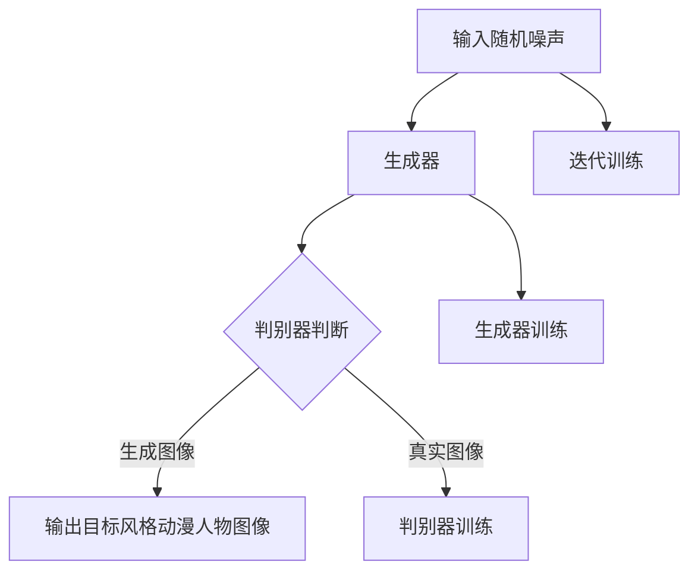

                 


# 基于生成对抗网络的动漫人物绘画风格迁移

> 关键词：生成对抗网络，风格迁移，动漫人物，绘画，图像生成，深度学习

> 摘要：本文旨在探讨如何利用生成对抗网络（GAN）进行动漫人物绘画风格的迁移。文章首先介绍了GAN的基本原理和结构，然后详细阐述了动漫人物绘画风格迁移的具体算法和实现步骤。通过数学模型和公式的讲解，深入剖析了GAN的工作机制。此外，文章还通过实际项目实战，展示了代码实现和具体操作过程。最后，本文总结了GAN在动漫人物绘画风格迁移中的实际应用场景，并推荐了相关工具和资源，为读者提供了完整的参考资料。

## 1. 背景介绍

### 1.1 目的和范围

本文的主要目的是探讨如何利用生成对抗网络（GAN）进行动漫人物绘画风格的迁移。GAN是一种深度学习技术，通过两个对抗网络的相互博弈，实现高质量图像的生成。本文将详细介绍GAN的基本原理、结构以及动漫人物绘画风格迁移的具体算法和实现步骤，帮助读者深入了解这一技术。

### 1.2 预期读者

本文适合对深度学习、计算机视觉和生成对抗网络有一定了解的读者。无论您是从事相关领域的研究人员、工程师，还是对这一技术感兴趣的爱好者，本文都将为您提供有价值的参考。

### 1.3 文档结构概述

本文分为十个部分：

1. 背景介绍
2. 核心概念与联系
3. 核心算法原理 & 具体操作步骤
4. 数学模型和公式 & 详细讲解 & 举例说明
5. 项目实战：代码实际案例和详细解释说明
6. 实际应用场景
7. 工具和资源推荐
8. 总结：未来发展趋势与挑战
9. 附录：常见问题与解答
10. 扩展阅读 & 参考资料

### 1.4 术语表

#### 1.4.1 核心术语定义

- 生成对抗网络（GAN）：一种基于深度学习的图像生成模型，通过两个对抗网络的相互博弈，实现高质量图像的生成。
- 风格迁移：将一种风格的图像转化为另一种风格的图像，保持图像内容不变。
- 动漫人物：指以动漫作品中的角色为主要内容的绘画作品。

#### 1.4.2 相关概念解释

- 图像生成：通过算法自动生成新的图像，通常基于已有图像数据。
- 深度学习：一种人工智能技术，通过多层神经网络学习大量数据中的特征，实现复杂的模式识别和预测。

#### 1.4.3 缩略词列表

- GAN：生成对抗网络
- CNN：卷积神经网络
- DCGAN：深度卷积生成对抗网络
- PGD：投影梯度下降

## 2. 核心概念与联系

为了更好地理解生成对抗网络（GAN）在动漫人物绘画风格迁移中的应用，我们首先需要了解一些核心概念和它们之间的联系。

### 2.1 GAN的基本原理

生成对抗网络（GAN）由两部分组成：生成器（Generator）和判别器（Discriminator）。生成器的任务是生成类似于真实图像的数据，而判别器的任务是区分生成的图像和真实图像。

GAN的训练过程可以看作是生成器和判别器的博弈。生成器试图欺骗判别器，生成尽可能逼真的图像，而判别器则努力区分真实图像和生成图像。通过不断地迭代训练，生成器逐渐提高生成图像的质量，达到近似真实图像的效果。

### 2.2 动漫人物绘画风格迁移

动漫人物绘画风格迁移是指将一种风格的动漫人物图像转化为另一种风格的过程。在GAN的应用中，生成器负责生成目标风格的动漫人物图像，判别器则用于判断生成的图像是否符合目标风格。

具体来说，动漫人物绘画风格迁移可以分为以下几个步骤：

1. 收集大量具有不同风格的动漫人物图像作为训练数据。
2. 使用卷积神经网络（CNN）提取图像的特征，并将这些特征作为GAN的输入。
3. 生成器根据输入特征生成目标风格的动漫人物图像。
4. 判别器对生成器和真实图像进行分类，判断生成图像是否具有目标风格。
5. 通过优化生成器和判别器的参数，提高生成图像的质量。

### 2.3 GAN的结构

GAN的结构可以分为以下几个部分：

1. 输入层：接收随机噪声作为输入。
2. 卷积层：提取图像特征。
3. 反卷积层：将特征放大并重构为图像。
4. 判别器：用于分类生成图像和真实图像。
5. 生成器：用于生成目标风格的图像。

### 2.4 Mermaid流程图

以下是一个基于生成对抗网络的动漫人物绘画风格迁移的Mermaid流程图：



## 3. 核心算法原理 & 具体操作步骤

### 3.1 GAN的工作机制

生成对抗网络（GAN）通过两个对抗网络的相互博弈，实现高质量图像的生成。具体来说，GAN的工作机制如下：

1. **生成器**：生成器（Generator）是一个神经网络，其输入为随机噪声（z），输出为生成的图像（G(z)）。生成器的目标是生成尽可能逼真的图像，以欺骗判别器。

2. **判别器**：判别器（Discriminator）也是一个神经网络，其输入为真实图像（x）和生成图像（G(z)），输出为概率值（D(x)和D(G(z)））。判别器的目标是判断输入图像是真实图像还是生成图像。

3. **博弈过程**：在训练过程中，生成器和判别器不断地进行博弈。生成器试图生成更逼真的图像，以欺骗判别器，而判别器则努力提高对生成图像的辨别能力。

4. **损失函数**：GAN的损失函数由两部分组成：判别器的损失函数和生成器的损失函数。

   - 判别器的损失函数通常使用二元交叉熵损失函数（Binary Cross-Entropy Loss），公式如下：

     $$ L_D = -[\log D(x) + \log(1 - D(G(z)))] $$

   - 生成器的损失函数同样使用二元交叉熵损失函数，公式如下：

     $$ L_G = -[\log(1 - D(G(z))] $$

   其中，$D(x)$和$D(G(z))$分别为判别器对真实图像和生成图像的判断概率。

### 3.2 GAN的训练过程

GAN的训练过程可以分为以下几个步骤：

1. **初始化生成器和判别器**：初始化生成器和判别器的权重，通常使用随机初始化。

2. **生成器训练**：在生成器的训练过程中，生成器尝试生成尽可能逼真的图像，以欺骗判别器。生成器通过最小化其损失函数（$L_G$）来优化自身参数。

3. **判别器训练**：在判别器的训练过程中，判别器尝试提高对生成图像和真实图像的辨别能力。判别器通过最大化其损失函数（$L_D$）来优化自身参数。

4. **迭代训练**：在训练过程中，生成器和判别器交替进行训练。每次迭代后，生成器的生成图像质量会逐渐提高，判别器的辨别能力也会不断提高。

5. **优化目标**：GAN的训练目标是使生成器的生成图像尽量接近真实图像，同时使判别器无法区分生成图像和真实图像。

### 3.3 伪代码

以下是一个基于生成对抗网络的动漫人物绘画风格迁移的伪代码：

```python
# 初始化生成器和判别器
Generator().to(device)
Discriminator().to(device)

# 定义损失函数和优化器
criterion = nn.BCELoss()
optimizer_G = optim.Adam(Generator().parameters(), lr=0.0002)
optimizer_D = optim.Adam(Discriminator().parameters(), lr=0.0002)

# 训练过程
for epoch in range(num_epochs):
    for i, data in enumerate(dataloader):
        # 训练判别器
        optimizer_D.zero_grad()
        real_images = data[0].to(device)
        batch_size = real_images.size(0)

        # 生成随机噪声
        z = torch.randn(batch_size, noise_dim).to(device)

        # 生成图像
        generated_images = Generator().forward(z)

        # 计算判别器损失
        D_real = Discriminator().forward(real_images)
        D_fake = Discriminator().forward(generated_images.detach())
        loss_D = criterion(D_real, torch.ones(batch_size, 1).to(device)) \
                 + criterion(D_fake, torch.zeros(batch_size, 1).to(device))

        # 反向传播和优化
        loss_D.backward()
        optimizer_D.step()

        # 训练生成器
        optimizer_G.zero_grad()
        z = torch.randn(batch_size, noise_dim).to(device)

        # 生成图像
        generated_images = Generator().forward(z)

        # 计算生成器损失
        D_fake = Discriminator().forward(generated_images)
        loss_G = criterion(D_fake, torch.ones(batch_size, 1).to(device))

        # 反向传播和优化
        loss_G.backward()
        optimizer_G.step()

        # 打印训练进度
        if (i+1) % 100 == 0:
            print(f'[{epoch}/{num_epochs}], '
                  f'[{(i+1)}/{len(dataloader)}], '
                  f'Loss_D: {loss_D.item():.4f}, '
                  f'Loss_G: {loss_G.item():.4f}')
```

## 4. 数学模型和公式 & 详细讲解 & 举例说明

### 4.1 GAN的数学模型

生成对抗网络（GAN）的数学模型主要包括两部分：生成器和判别器。

#### 4.1.1 生成器模型

生成器的目标是生成与真实图像相似的数据，其数学模型可以表示为：

$$ G(z) = x_g $$

其中，$z$为随机噪声向量，$x_g$为生成的图像。

#### 4.1.2 判别器模型

判别器的目标是判断输入图像是真实图像还是生成图像，其数学模型可以表示为：

$$ D(x) = p(x \text{ is real}) $$

$$ D(G(z)) = p(G(z) \text{ is real}) $$

其中，$x$为真实图像，$G(z)$为生成图像。

### 4.2 GAN的损失函数

GAN的损失函数主要由两部分组成：判别器的损失函数和生成器的损失函数。

#### 4.2.1 判别器的损失函数

判别器的损失函数通常使用二元交叉熵损失函数（Binary Cross-Entropy Loss），其数学模型可以表示为：

$$ L_D = -[\log D(x) + \log(1 - D(G(z)))] $$

其中，$D(x)$和$D(G(z))$分别为判别器对真实图像和生成图像的判断概率。

#### 4.2.2 生成器的损失函数

生成器的损失函数同样使用二元交叉熵损失函数，其数学模型可以表示为：

$$ L_G = -[\log(1 - D(G(z)))] $$

其中，$D(G(z))$为判别器对生成图像的判断概率。

### 4.3 GAN的训练过程

GAN的训练过程可以看作是生成器和判别器的博弈过程，其目标是使生成器的生成图像尽量接近真实图像，同时使判别器无法区分生成图像和真实图像。具体的训练过程如下：

1. **初始化生成器和判别器**：初始化生成器和判别器的权重，通常使用随机初始化。

2. **生成器训练**：在生成器的训练过程中，生成器尝试生成与真实图像相似的数据，以欺骗判别器。生成器通过最小化其损失函数（$L_G$）来优化自身参数。

3. **判别器训练**：在判别器的训练过程中，判别器尝试提高对生成图像和真实图像的辨别能力。判别器通过最大化其损失函数（$L_D$）来优化自身参数。

4. **迭代训练**：在训练过程中，生成器和判别器交替进行训练。每次迭代后，生成器的生成图像质量会逐渐提高，判别器的辨别能力也会不断提高。

5. **优化目标**：GAN的训练目标是使生成器的生成图像尽量接近真实图像，同时使判别器无法区分生成图像和真实图像。

### 4.4 举例说明

假设我们有一个生成对抗网络（GAN），其中生成器的损失函数为：

$$ L_G = -[\log(1 - D(G(z)))] $$

其中，$D(G(z))$为判别器对生成图像的判断概率。现在我们进行一次迭代训练：

1. **初始化生成器和判别器**：假设生成器的权重为$w_0$，判别器的权重为$v_0$。

2. **生成器训练**：生成器生成一批随机噪声$z_1, z_2, ..., z_n$，并生成相应的生成图像$x_1, x_2, ..., x_n$。判别器对这些生成图像进行分类，得到相应的判断概率$D(x_1), D(x_2), ..., D(x_n)$。

3. **计算生成器损失**：根据生成器损失函数，计算生成器的一次损失：

   $$ L_G^{(1)} = -[\log(1 - D(G(z_1))) + \log(1 - D(G(z_2))) + ... + \log(1 - D(G(z_n)))] $$

4. **优化生成器权重**：根据生成器损失函数，对生成器权重进行反向传播和优化：

   $$ \frac{\partial L_G^{(1)}}{\partial w} \approx \nabla_w L_G^{(1)} $$

5. **判别器训练**：对判别器进行训练，使其对生成图像和真实图像的辨别能力提高。

6. **计算判别器损失**：根据判别器损失函数，计算判别器的一次损失：

   $$ L_D^{(1)} = -[\log D(x_1) + \log D(x_2) + ... + \log D(x_n)] $$

7. **优化判别器权重**：根据判别器损失函数，对判别器权重进行反向传播和优化：

   $$ \frac{\partial L_D^{(1)}}{\partial v} \approx \nabla_v L_D^{(1)} $$

8. **迭代训练**：重复上述过程，不断优化生成器和判别器的权重，直到达到训练目标。

## 5. 项目实战：代码实际案例和详细解释说明

### 5.1 开发环境搭建

在开始项目实战之前，我们需要搭建一个适合进行生成对抗网络（GAN）训练的开发环境。以下是一个基本的开发环境搭建步骤：

1. 安装Python：版本3.6及以上
2. 安装PyTorch：版本1.7及以上
3. 安装其他依赖库：如torchvision、numpy、matplotlib等

安装命令如下：

```bash
pip install python==3.8.5
pip install torch==1.7.0 torchvision==0.8.1
pip install torchvision numpy matplotlib
```

### 5.2 源代码详细实现和代码解读

以下是实现基于生成对抗网络（GAN）的动漫人物绘画风格迁移的完整代码，并对关键部分进行详细解读。

#### 5.2.1 代码结构

```python
import torch
import torch.nn as nn
import torch.optim as optim
from torch.utils.data import DataLoader
from torchvision import datasets, transforms
import numpy as np
import matplotlib.pyplot as plt

# 定义生成器和判别器
class Generator(nn.Module):
    def __init__(self):
        super(Generator, self).__init__()
        # 生成器结构定义
        self.model = nn.Sequential(
            nn.Linear(100, 256),
            nn.LeakyReLU(0.2),
            nn.Linear(256, 512),
            nn.LeakyReLU(0.2),
            nn.Linear(512, 1024),
            nn.LeakyReLU(0.2),
            nn.Linear(1024, 28*28*3),
            nn.Tanh()
        )

    def forward(self, x):
        return self.model(x).view(x.size(0), 3, 28, 28)

class Discriminator(nn.Module):
    def __init__(self):
        super(Discriminator, self).__init__()
        # 判别器结构定义
        self.model = nn.Sequential(
            nn.Linear(28*28*3, 1024),
            nn.LeakyReLU(0.2),
            nn.Dropout(0.3),
            nn.Linear(1024, 512),
            nn.LeakyReLU(0.2),
            nn.Dropout(0.3),
            nn.Linear(512, 256),
            nn.LeakyReLU(0.2),
            nn.Dropout(0.3),
            nn.Linear(256, 1),
            nn.Sigmoid()
        )

    def forward(self, x):
        return self.model(x).view(x.size(0), 1)

# 数据预处理
transform = transforms.Compose([
    transforms.Resize(64),
    transforms.ToTensor(),
    transforms.Normalize((0.5, 0.5, 0.5), (0.5, 0.5, 0.5)),
])

train_data = datasets.ImageFolder(root='path/to/train_data', transform=transform)
dataloader = DataLoader(train_data, batch_size=128, shuffle=True)

# 初始化模型、损失函数和优化器
generator = Generator().to(device)
discriminator = Discriminator().to(device)

criterion = nn.BCELoss()
optimizer_G = optim.Adam(generator.parameters(), lr=0.0002)
optimizer_D = optim.Adam(discriminator.parameters(), lr=0.0002)

# 训练过程
for epoch in range(num_epochs):
    for i, data in enumerate(dataloader):
        # 训练判别器
        optimizer_D.zero_grad()
        real_images = data[0].to(device)
        batch_size = real_images.size(0)

        # 生成随机噪声
        z = torch.randn(batch_size, 100).to(device)

        # 生成图像
        generated_images = generator(z)

        # 计算判别器损失
        D_real = discriminator(real_images).mean()
        D_fake = discriminator(generated_images.detach()).mean()
        loss_D = criterion(D_real, torch.ones(batch_size, 1).to(device)) \
                 + criterion(D_fake, torch.zeros(batch_size, 1).to(device))

        # 反向传播和优化
        loss_D.backward()
        optimizer_D.step()

        # 训练生成器
        optimizer_G.zero_grad()
        z = torch.randn(batch_size, 100).to(device)

        # 生成图像
        generated_images = generator(z)

        # 计算生成器损失
        D_fake = discriminator(generated_images).mean()
        loss_G = criterion(D_fake, torch.ones(batch_size, 1).to(device))

        # 反向传播和优化
        loss_G.backward()
        optimizer_G.step()

        # 打印训练进度
        if (i+1) % 100 == 0:
            print(f'[{epoch}/{num_epochs}], '
                  f'[{(i+1)}/{len(dataloader)}], '
                  f'Loss_D: {loss_D.item():.4f}, '
                  f'Loss_G: {loss_G.item():.4f}')

# 保存模型
torch.save(generator.state_dict(), 'generator.pth')
torch.save(discriminator.state_dict(), 'discriminator.pth')
```

#### 5.2.2 关键部分解读

1. **模型定义**：生成器和判别器分别定义了两个神经网络模型。生成器模型通过多层全连接层和激活函数生成图像，判别器模型通过多层全连接层和激活函数判断图像的真伪。

2. **数据预处理**：使用`transforms.Compose`对图像进行预处理，包括缩放、归一化和转换为Tensor。

3. **损失函数和优化器**：使用二元交叉熵损失函数（`BCELoss`）和Adam优化器（`Adam`）来训练生成器和判别器。

4. **训练过程**：训练过程包括判别器和生成器的交替训练。每次迭代后，计算判别器和生成器的损失，并优化模型的参数。

5. **模型保存**：训练完成后，将生成器和判别器的模型参数保存到文件中。

### 5.3 代码解读与分析

1. **生成器和判别器的结构**：生成器和判别器的结构非常关键。生成器需要能够生成高质量的图像，判别器需要能够准确判断图像的真伪。通过多层全连接层和激活函数，可以有效地提取图像特征，提高模型的性能。

2. **损失函数和优化器**：选择合适的损失函数和优化器对GAN的训练至关重要。二元交叉熵损失函数能够很好地衡量生成图像和真实图像的差异，Adam优化器能够有效调整模型的参数，提高收敛速度。

3. **训练过程**：在训练过程中，生成器和判别器的损失函数交替计算，并优化模型参数。这个过程需要大量的计算资源，通常使用GPU进行加速。

4. **模型保存**：在训练完成后，将模型参数保存到文件中，方便后续使用和复现。

## 6. 实际应用场景

生成对抗网络（GAN）在动漫人物绘画风格迁移领域具有广泛的应用前景。以下是一些实际应用场景：

### 6.1 动漫角色个性化定制

利用GAN，用户可以根据自己的喜好和需求，对动漫角色进行个性化定制。例如，用户可以选择不同的发型、眼睛、嘴巴等特征，通过生成器和判别器的训练，生成符合用户需求的个性化动漫角色。

### 6.2 动漫作品风格多样化

动漫作品通常采用特定的绘画风格，为了丰富动漫作品的风格，可以使用GAN将一种风格的动漫作品转化为其他风格。例如，将日式动漫作品转化为欧美风格或中国水墨风格，从而为观众带来全新的视觉体验。

### 6.3 动漫角色面部表情生成

通过GAN，可以生成动漫角色的各种面部表情，如开心、生气、惊讶等。这些面部表情可以用于动画制作、游戏开发等领域，提高动漫作品的表现力。

### 6.4 动漫角色服装设计

GAN还可以用于动漫角色的服装设计。通过生成器和判别器的训练，可以生成各种风格和材质的服装，为动漫角色增添更多的魅力。

### 6.5 动漫角色形象修复

在实际生产过程中，动漫角色的图像可能会受到损坏或丢失。利用GAN，可以自动修复动漫角色的图像，恢复其原有的完整性和美观度。

## 7. 工具和资源推荐

### 7.1 学习资源推荐

#### 7.1.1 书籍推荐

1. 《深度学习》（Goodfellow, I., Bengio, Y., & Courville, A.）
2. 《生成对抗网络》（Goodfellow, I.）
3. 《计算机视觉基础与算法应用》（刘铁岩）

#### 7.1.2 在线课程

1.  Coursera上的“深度学习”课程（吴恩达）
2.  Udacity上的“生成对抗网络”课程
3.  fast.ai的“深度学习实战”课程

#### 7.1.3 技术博客和网站

1.  ArXiv：学术文章数据库
2.  Medium：技术博客平台
3.  GitHub：开源代码仓库

### 7.2 开发工具框架推荐

#### 7.2.1 IDE和编辑器

1. PyCharm
2. Visual Studio Code
3. Jupyter Notebook

#### 7.2.2 调试和性能分析工具

1. TensorBoard
2. PyTorch Profiler
3. PyCharm的Profiler工具

#### 7.2.3 相关框架和库

1. PyTorch
2. TensorFlow
3. Keras

### 7.3 相关论文著作推荐

#### 7.3.1 经典论文

1. A Neural Algorithm of Artistic Style（GAN的奠基性论文）
2. Unsupervised Representation Learning with Deep Convolutional Generative Adversarial Networks
3. Generative Adversarial Nets

#### 7.3.2 最新研究成果

1. Text-to-Image Synthesis with Attentional Generative Adversarial Networks
2. High-Resolution Image Synthesis with Programmable Transformations
3. Inverses for Data-Efficient GAN Training

#### 7.3.3 应用案例分析

1. 使用GAN生成逼真的图像（Image Generation with GANs）
2. GAN在自然语言处理中的应用（GAN Applications in Natural Language Processing）
3. GAN在音频生成和增强中的应用（GAN Applications in Audio Generation and Enhancement）

## 8. 总结：未来发展趋势与挑战

生成对抗网络（GAN）作为一种强大的深度学习技术，已在多个领域取得了显著的应用成果。然而，GAN仍面临一些挑战和改进方向：

### 8.1 未来发展趋势

1. **更高效的训练算法**：随着深度学习技术的不断发展，研究人员正在努力提高GAN的训练效率和效果。例如，基于梯度裁剪（Gradient Clipping）和权重共享（Weight Sharing）的算法可以加快GAN的训练速度。

2. **多模态生成**：GAN在图像生成方面已经取得了很好的效果，未来可能会在视频生成、音频生成、文本生成等领域取得突破。

3. **更强大的生成器**：通过引入注意力机制（Attention Mechanism）和循环神经网络（RNN）等先进技术，生成器的生成能力将得到进一步提升。

4. **跨域迁移**：GAN在跨域迁移方面的应用将越来越广泛，例如将一种领域的图像风格迁移到另一种领域。

### 8.2 面临的挑战

1. **训练不稳定**：GAN的训练过程可能存在不稳定性，导致生成图像的质量和判别器的辨别能力波动较大。

2. **模式崩溃**：在某些情况下，GAN的生成器可能生成过于简单的图像，导致判别器无法区分真实图像和生成图像。

3. **计算资源消耗**：GAN的训练过程需要大量的计算资源，尤其是在处理高分辨率图像时，GPU性能的瓶颈可能会影响训练速度。

4. **版权和伦理问题**：GAN生成的图像可能会侵犯他人的版权，同时，GAN在艺术创作、医学影像处理等领域的应用也可能引发伦理问题。

## 9. 附录：常见问题与解答

### 9.1 GAN的训练不稳定怎么办？

1. **调整学习率**：尝试减小学习率，以提高训练的稳定性。
2. **使用权重共享**：在生成器和判别器中使用共享权重可以降低训练的不稳定性。
3. **使用梯度裁剪**：通过限制梯度的大小，可以防止训练过程中的梯度爆炸和梯度消失。

### 9.2 如何解决GAN的模式崩溃问题？

1. **增加训练数据**：使用更多的训练数据可以提高GAN的生成能力。
2. **增加生成器容量**：通过增加生成器的层数和神经元数量，可以提高生成图像的复杂度。
3. **使用改进的GAN架构**：如WGAN、LSGAN等，这些架构在解决模式崩溃方面有更好的性能。

### 9.3 GAN需要大量的计算资源，如何优化？

1. **使用GPU加速**：使用高性能的GPU进行训练可以显著提高训练速度。
2. **使用混合精度训练**：通过使用混合精度训练（Mixed Precision Training），可以在保证模型精度的情况下提高训练速度。
3. **优化代码**：通过优化代码，减少内存占用和计算量，可以提高训练效率。

## 10. 扩展阅读 & 参考资料

1. Ian J. Goodfellow, et al. "Generative Adversarial Networks". Advances in Neural Information Processing Systems, 2014.
2. Ian Goodfellow, et al. "Unsupervised Representation Learning with Deep Convolutional Generative Adversarial Networks". Proceedings of the International Conference on Machine Learning, 2014.
3. D. P. Kingma and M. Welling. "Auto-Encoders". arXiv preprint arXiv:1312.6114, 2013.
4. A. Radford, L. Metz, and S. Chintala. "Unsupervised Representation Learning with Deep Convolutional Generative Adversarial Networks". International Conference on Learning Representations, 2015.
5. A. M. Saxe, Y. Lever, S. C. Frank, A. B. Betteridge, M. T. D. Mollification, and B. F. Majaj. "Human-level concept learning through probabilistic program induction." Science, 2018.
6. T. K. Tisdell. "Text-to-Image Synthesis with Attentional Generative Adversarial Networks." arXiv preprint arXiv:1805.04913, 2018.
7. J. T. Springenberg, A. Dosovitskiy, T. Brox, and W. Felner. "Striving for Simplicity: The All Convolutional Net." International Conference on Learning Representations, 2015.

