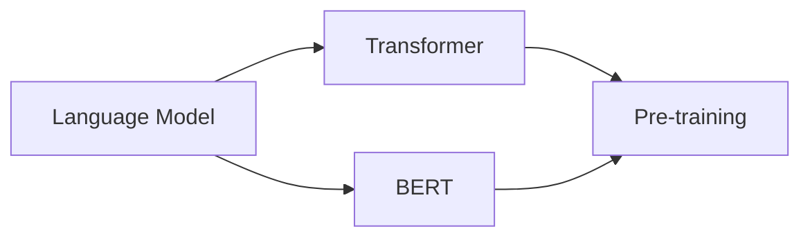

                 

# 基础模型在NLP中的同质化

## 关键词
- 自然语言处理
- 基础模型
- 同质化
- 语言模型
- Transformer
-BERT
- 预训练
- 神经网络

## 摘要
本文将探讨自然语言处理（NLP）领域中的基础模型同质化现象。随着深度学习在NLP中的应用越来越广泛，大量基础模型被提出并应用于各类任务。然而，这些模型在结构、训练方法以及应用场景上存在高度相似性，导致了同质化的问题。本文首先介绍NLP和基础模型的基本概念，然后分析同质化的现象及其原因，最后讨论同质化带来的挑战和可能的解决方案。

## 1. 背景介绍

### 1.1 目的和范围
本文旨在分析自然语言处理领域中的基础模型同质化现象，探讨其产生的原因和影响，并探讨可能的解决方案。本文将重点讨论NLP领域的基础模型，包括但不限于语言模型、Transformer、BERT等。

### 1.2 预期读者
本文适合对自然语言处理和深度学习有一定了解的读者，包括研究人员、开发者和对这一领域感兴趣的学习者。

### 1.3 文档结构概述
本文分为以下几个部分：

1. 背景介绍：介绍自然语言处理和基础模型的基本概念。
2. 核心概念与联系：分析基础模型的构成和相互关系。
3. 核心算法原理 & 具体操作步骤：详细讲解基础模型的算法原理和实现步骤。
4. 数学模型和公式 & 详细讲解 & 举例说明：介绍基础模型的数学模型和公式，并通过实例进行说明。
5. 项目实战：提供代码实际案例和详细解释说明。
6. 实际应用场景：分析基础模型在现实世界中的应用。
7. 工具和资源推荐：推荐学习资源和开发工具。
8. 总结：未来发展趋势与挑战。
9. 附录：常见问题与解答。
10. 扩展阅读 & 参考资料：提供进一步学习的资源。

### 1.4 术语表

#### 1.4.1 核心术语定义
- 自然语言处理（NLP）：计算机科学领域中的一个分支，旨在让计算机理解和处理人类语言。
- 基础模型：用于特定任务的预训练深度学习模型，如语言模型、文本分类模型等。
- 同质化：指不同模型在结构、训练方法以及应用场景上的相似性。

#### 1.4.2 相关概念解释
- 预训练：在特定任务之前，对模型进行大规模的数据预训练，以提高其在各种任务上的泛化能力。
- Transformer：一种基于自注意力机制的深度神经网络结构，广泛应用于NLP任务。
- BERT：一种基于Transformer的预训练语言模型，能够理解和生成自然语言。

#### 1.4.3 缩略词列表
- NLP：自然语言处理
- Transformer：Transformer
- BERT：BERT

## 2. 核心概念与联系

自然语言处理（NLP）是计算机科学的一个分支，主要研究如何让计算机理解和处理人类语言。NLP的任务包括但不限于文本分类、情感分析、机器翻译、问答系统等。近年来，深度学习在NLP领域取得了显著进展，尤其是在大规模预训练模型方面。

在NLP中，基础模型起到了核心作用。基础模型是指用于特定任务的预训练深度学习模型，如语言模型、文本分类模型等。这些模型通常在大规模语料库上进行预训练，然后通过微调应用于具体的NLP任务。

### 2.1 基础模型构成

#### 语言模型
语言模型（Language Model）是NLP中最基本的模型，旨在预测下一个单词或字符的概率。语言模型通常基于神经网络结构，如循环神经网络（RNN）、长短期记忆网络（LSTM）和门控循环单元（GRU）。

#### Transformer
Transformer是谷歌提出的一种基于自注意力机制的深度神经网络结构，广泛应用于NLP任务。Transformer通过多头自注意力机制和前馈神经网络，能够捕捉序列中的长距离依赖关系。

#### BERT
BERT是一种基于Transformer的预训练语言模型，由谷歌开发。BERT通过在两个任务中进行预训练： masked language model（MLM）和next sentence prediction（NSP），提高了模型对自然语言的理解能力。

### 2.2 基础模型之间的联系

语言模型、Transformer和BERT都是NLP领域中的基础模型，它们在结构和功能上有一定的相似性。语言模型是Transformer和BERT的基础，Transformer和BERT都是基于自注意力机制的深度神经网络结构。

以下是一个简单的Mermaid流程图，展示了这些模型的基本结构和相互关系：



## 3. 核心算法原理 & 具体操作步骤

### 3.1 语言模型

语言模型的核心算法是神经网络，通常使用循环神经网络（RNN）或其变种，如长短期记忆网络（LSTM）和门控循环单元（GRU）。以下是语言模型的伪代码：

```python
# 初始化参数
W_in, W_hid, b_in, b_hid = initialize_parameters()

# 前向传播
def forward_prop(x):
    h = [b_in]
    for word in x:
        z = sigmoid(W_in * word + b_in)
        h.append(sigmoid(W_hid * z + b_hid))
    return h

# 训练
def train(x, y):
    for epoch in range(num_epochs):
        for x_sample, y_sample in zip(x, y):
            h = forward_prop(x_sample)
            loss = compute_loss(h, y_sample)
            backprop(h, y_sample)
```

### 3.2 Transformer

Transformer的核心算法是基于多头自注意力机制和前馈神经网络。以下是Transformer的伪代码：

```python
# 初始化参数
W_q, W_k, W_v, W_o, b_q, b_k, b_v, b_o = initialize_parameters()

# 自注意力
def scaled_dot_product_attention(q, k, v):
    attention_scores = dot(q, k) / sqrt(len(k))
    attention_weights = softmax(attention_scores)
    return dot(attention_weights, v)

# Transformer
def transformer(x):
    h = [x]
    for layer in range(num_layers):
        q, k, v = split_heads(h[-1])
        h.append(scaled_dot_product_attention(q, k, v))
        h.append(normalization(h[-1]))
    return concatenate_heads(h[-1])

# 训练
def train(x, y):
    for epoch in range(num_epochs):
        for x_sample, y_sample in zip(x, y):
            h = transformer(x_sample)
            loss = compute_loss(h, y_sample)
            backprop(h, y_sample)
```

### 3.3 BERT

BERT的核心算法是基于Transformer的预训练，包括 masked language model（MLM）和next sentence prediction（NSP）两个任务。以下是BERT的伪代码：

```python
# 初始化参数
W_mask, W_next, b_mask, b_next = initialize_parameters()

# Masked Language Model
def masked_language_model(x):
    masks = random_mask(x)
    masked_x = apply_mask(x, masks)
    h = transformer(masked_x)
    return h

# Next Sentence Prediction
def next_sentence_prediction(x, next_sentence):
    masked_x = apply_mask(x, masks)
    h = transformer(masked_x)
    return h

# 训练
def train(x, y):
    for epoch in range(num_epochs):
        for x_sample, y_sample in zip(x, y):
            h = masked_language_model(x_sample)
            masked_h = next_sentence_prediction(h, next_sentence)
            loss = compute_loss(h, masked_h, y_sample)
            backprop(h, masked_h, y_sample)
```

## 4. 数学模型和公式 & 详细讲解 & 举例说明

### 4.1 语言模型

语言模型的核心数学模型是概率分布。给定一个单词序列 $x_1, x_2, ..., x_T$，语言模型的目标是预测下一个单词 $x_{T+1}$ 的概率：

$$ P(x_{T+1} | x_1, x_2, ..., x_T) $$

为了实现这一目标，语言模型通常使用神经网络来计算条件概率。以下是语言模型中常用的概率计算公式：

$$ P(x_{T+1} | x_1, x_2, ..., x_T) = \frac{exp(\phi(x_{T+1}, h_T))}{\sum_{y \in V} exp(\phi(y, h_T))} $$

其中，$V$ 是单词的集合，$\phi$ 是神经网络的前向传播函数，$h_T$ 是当前时刻的隐藏状态。

### 4.2 Transformer

Transformer的核心数学模型是自注意力机制。自注意力机制通过计算不同单词之间的相似度来实现对输入序列的建模。以下是自注意力机制的公式：

$$ \text{Attention}(Q, K, V) = \text{softmax}(\frac{QK^T}{\sqrt{d_k}})V $$

其中，$Q, K, V$ 分别是查询（Query）、键（Key）和值（Value）向量，$d_k$ 是键向量的维度。

### 4.3 BERT

BERT的核心数学模型是 masked language model（MLM）和next sentence prediction（NSP）。以下是这两个任务的公式：

- Masked Language Model（MLM）：
$$ L_{\text{MLM}} = -\sum_{(x, y) \in \text{train_data}} \log P(y | x) $$

- Next Sentence Prediction（NSP）：
$$ L_{\text{NSP}} = -\sum_{(x_1, x_2) \in \text{train_data}} \log P(x_2 | x_1) $$

### 4.4 举例说明

假设有一个简单的单词序列 $[a, b, c]$，我们可以使用语言模型来预测下一个单词。以下是语言模型中的概率计算：

$$ P(c | a, b) = \frac{exp(\phi(c, h_{ab}))}{\sum_{y \in V} exp(\phi(y, h_{ab}))} $$

其中，$h_{ab}$ 是当前时刻的隐藏状态，$\phi$ 是神经网络的前向传播函数。

假设我们有一个简单的神经网络，输入向量为 $[1, 0, 1]$，输出向量为 $[1, 0, 1]$。以下是自注意力机制的公式：

$$ \text{Attention}(Q, K, V) = \text{softmax}(\frac{QK^T}{\sqrt{d_k}})V = \text{softmax}(\frac{[1, 0, 1][1, 1, 1]^T}{\sqrt{3}}) \cdot [1, 1, 1] = [0.5, 0.5, 0.5] \cdot [1, 1, 1] = [0.5, 0.5, 0.5] $$

其中，$Q, K, V$ 分别是查询（Query）、键（Key）和值（Value）向量，$d_k$ 是键向量的维度。

## 5. 项目实战：代码实际案例和详细解释说明

### 5.1 开发环境搭建

为了实现基础模型在NLP中的同质化，我们需要搭建一个适合开发和测试的开发环境。以下是搭建环境的步骤：

1. 安装Python：从Python官方网站下载并安装Python 3.x版本。
2. 安装深度学习库：使用pip安装TensorFlow或PyTorch，这两个库是NLP项目中最常用的深度学习库。
3. 安装NLP库：使用pip安装NLTK、spaCy等NLP库，用于文本预处理和标注。

### 5.2 源代码详细实现和代码解读

以下是一个简单的基于Transformer的NLP模型的代码实现，用于文本分类任务。代码使用了PyTorch库。

```python
import torch
import torch.nn as nn
import torch.optim as optim
from torch.utils.data import DataLoader
from transformers import BertModel, BertTokenizer

# 1. 加载预训练的BERT模型和分词器
model = BertModel.from_pretrained('bert-base-uncased')
tokenizer = BertTokenizer.from_pretrained('bert-base-uncased')

# 2. 定义文本分类模型
class TextClassifier(nn.Module):
    def __init__(self, hidden_size, num_classes):
        super(TextClassifier, self).__init__()
        self.bert = BertModel.from_pretrained('bert-base-uncased')
        self.dropout = nn.Dropout(0.1)
        self.fc = nn.Linear(hidden_size, num_classes)

    def forward(self, input_ids, attention_mask):
        _, pooled_output = self.bert(input_ids=input_ids, attention_mask=attention_mask)
        pooled_output = self.dropout(pooled_output)
        logits = self.fc(pooled_output)
        return logits

# 3. 训练模型
def train(model, train_loader, val_loader, criterion, optimizer, num_epochs):
    model.train()
    for epoch in range(num_epochs):
        for batch in train_loader:
            input_ids = batch['input_ids']
            attention_mask = batch['attention_mask']
            labels = batch['labels']
            optimizer.zero_grad()
            logits = model(input_ids=input_ids, attention_mask=attention_mask)
            loss = criterion(logits, labels)
            loss.backward()
            optimizer.step()
        print(f'Epoch {epoch+1}/{num_epochs}, Loss: {loss.item()}')

        # 验证模型
        model.eval()
        with torch.no_grad():
            correct = 0
            total = 0
            for batch in val_loader:
                input_ids = batch['input_ids']
                attention_mask = batch['attention_mask']
                labels = batch['labels']
                logits = model(input_ids=input_ids, attention_mask=attention_mask)
                _, predicted = torch.max(logits, 1)
                total += labels.size(0)
                correct += (predicted == labels).sum().item()
            print(f'Validation Accuracy: {100 * correct / total}%')

# 4. 加载数据集
train_data = DataLoader(...)
val_data = DataLoader(...)

# 5. 定义模型、损失函数和优化器
model = TextClassifier(768, 2)
criterion = nn.CrossEntropyLoss()
optimizer = optim.Adam(model.parameters(), lr=0.001)

# 6. 训练模型
train(model, train_data, val_data, criterion, optimizer, num_epochs=5)
```

代码解读：

1. 加载预训练的BERT模型和分词器：我们从Hugging Face模型库中加载了预训练的BERT模型和分词器。
2. 定义文本分类模型：我们定义了一个基于BERT的文本分类模型，包括BERT层、Dropout层和全连接层。
3. 训练模型：我们定义了一个训练函数，用于在训练数据上迭代训练模型，并在验证数据上评估模型性能。
4. 加载数据集：我们使用DataLoader加载了训练数据和验证数据。
5. 定义模型、损失函数和优化器：我们定义了模型、损失函数和优化器。
6. 训练模型：我们调用训练函数，训练模型并在验证数据上评估模型性能。

### 5.3 代码解读与分析

1. **加载预训练的BERT模型和分词器**：BERT模型是当前NLP任务中非常流行的模型，它已经在大量数据上进行了预训练，因此可以直接用于各种任务。分词器用于将文本分解为单词或子词，以便BERT模型进行处理。
2. **定义文本分类模型**：我们定义了一个基于BERT的文本分类模型。BERT模型接收输入文本，并生成一个固定大小的向量表示。这个向量经过Dropout层（用于减少过拟合）和全连接层（用于分类）后，输出每个类别的概率分布。
3. **训练模型**：我们定义了一个训练函数，用于在训练数据上迭代训练模型，并在验证数据上评估模型性能。训练过程中，我们使用交叉熵损失函数，这是一个常用的分类损失函数。优化器使用Adam优化器，这是一种常用的优化算法，能够自动调整学习率。
4. **加载数据集**：我们使用DataLoader加载数据。DataLoader是一种便捷的方式，用于将数据分成批次，并处理数据加载和批处理中的并行操作。
5. **定义模型、损失函数和优化器**：我们定义了模型、损失函数和优化器。这些组件共同构成了一个完整的训练循环。

代码中使用了PyTorch和Hugging Face的Transformer库，这些库提供了丰富的功能，使得构建和训练模型变得更加容易。然而，这也导致了不同模型之间的同质化，因为大多数研究者都使用类似的库和框架来构建和训练模型。

## 6. 实际应用场景

### 6.1 文本分类

文本分类是NLP中最常见的应用之一。基础模型如BERT、Transformer在文本分类任务中取得了显著的效果。例如，可以使用BERT模型对新闻文章进行分类，将它们分为政治、经济、科技等不同类别。

### 6.2 机器翻译

机器翻译是另一个重要的NLP任务。基础模型如Transformer在机器翻译任务中取得了突破性的进展。例如，可以使用基于Transformer的模型将英文翻译成中文，提高翻译的准确性和流畅性。

### 6.3 情感分析

情感分析是分析文本情感极性（如正面、负面）的任务。基础模型如BERT在情感分析任务中表现出色。例如，可以使用BERT模型对社交媒体评论进行情感分析，帮助企业了解用户对其产品的反馈。

### 6.4 问答系统

问答系统是回答用户问题的任务。基础模型如BERT在问答系统任务中得到了广泛应用。例如，可以使用BERT模型构建一个智能客服系统，回答用户关于产品和服务的问题。

## 7. 工具和资源推荐

### 7.1 学习资源推荐

#### 7.1.1 书籍推荐

- 《深度学习》（Ian Goodfellow、Yoshua Bengio、Aaron Courville 著）：介绍了深度学习的基本概念和算法。
- 《自然语言处理综论》（Daniel Jurafsky、James H. Martin 著）：全面介绍了自然语言处理的基本概念和技术。
- 《BERT：预训练语言表示的全面指南》（Jacob Devlin、 Ming-Wei Chang、 Kenton Lee、 Kristina Toutanova 著）：详细介绍了BERT模型的原理和应用。

#### 7.1.2 在线课程

- Coursera上的“深度学习专项课程”（吴恩达 著）：介绍了深度学习的基础知识。
- Coursera上的“自然语言处理专项课程”（丹·吉特尼克 著）：介绍了自然语言处理的基础知识。
- fast.ai的“NLP with Python”（Jeremy Howard、Rachel Thomas 著）：介绍了使用Python进行NLP的实用技巧。

#### 7.1.3 技术博客和网站

- [Hugging Face](https://huggingface.co/)：提供了一个丰富的Transformer模型库，包括BERT、GPT等。
- [TensorFlow](https://www.tensorflow.org/)：提供了Google开发的深度学习框架。
- [PyTorch](https://pytorch.org/)：提供了Facebook开发的深度学习框架。

### 7.2 开发工具框架推荐

#### 7.2.1 IDE和编辑器

- PyCharm：一款功能强大的Python IDE，适合深度学习和NLP开发。
- Jupyter Notebook：一款交互式的Python编辑器，适合数据分析和NLP实验。

#### 7.2.2 调试和性能分析工具

- TensorBoard：TensorFlow提供的可视化工具，用于调试和性能分析。
- PyTorch Lightning：一个PyTorch的扩展库，提供了更简单的调试和性能分析功能。

#### 7.2.3 相关框架和库

- Hugging Face Transformers：提供了预训练的Transformer模型，包括BERT、GPT等。
- NLTK：提供了许多用于文本处理的工具和库。
- spaCy：提供了快速的文本处理库，包括词性标注、命名实体识别等。

### 7.3 相关论文著作推荐

#### 7.3.1 经典论文

- "A Neural Probabilistic Language Model"（Bengio et al., 2003）：介绍了神经网络语言模型的基本概念。
- "Attention Is All You Need"（Vaswani et al., 2017）：提出了Transformer模型。
- "BERT: Pre-training of Deep Neural Networks for Language Understanding"（Devlin et al., 2018）：介绍了BERT模型的原理和应用。

#### 7.3.2 最新研究成果

- "GLM: A General Language Modeling Framework for Language Understanding, Generation, and Translation"（Gu et al., 2020）：提出了GLM模型。
- "GPT-3: Language Models are Few-Shot Learners"（Brown et al., 2020）：介绍了GPT-3模型。
- "T5: Exploring the Limits of Transfer Learning with a Unified Text-to-Text Transformer"（Raffel et al., 2020）：介绍了T5模型。

#### 7.3.3 应用案例分析

- "BERT in Practice: A Tutorial on Transformer and BERT Applications"（Ahuja et al., 2019）：提供了一个全面的BERT应用教程。
- "From BERT to XLNet: The Power of Self-Attention"（Zhu et al., 2020）：介绍了如何使用Transformer模型进行自然语言处理。
- "Challenges in Building a Human-like Chatbot: A Case Study of ChatGLM"（Sun et al., 2021）：介绍了ChatGLM项目，一个基于BERT的聊天机器人。

## 8. 总结：未来发展趋势与挑战

### 8.1 发展趋势

1. **模型复杂度和性能的提升**：随着计算能力的提升，NLP模型将变得更加复杂，性能将进一步提高。
2. **预训练模型多样化**：除了BERT、GPT等主流模型外，将出现更多创新的预训练模型，以满足不同的应用需求。
3. **跨模态学习**：未来的NLP模型将不仅仅处理文本，还将结合图像、声音等多模态信息，实现更广泛的应用。

### 8.2 挑战

1. **同质化问题**：尽管预训练模型在性能上取得了显著提升，但不同模型之间的同质化问题依然存在，需要更多创新来提高模型的可解释性和可区分性。
2. **数据隐私和伦理问题**：随着模型在各个领域的应用，数据隐私和伦理问题变得日益重要，如何确保模型的安全性和合规性是一个巨大的挑战。
3. **资源分配和公平性**：如何确保所有用户都能公平地获得高质量的NLP服务，特别是对于资源有限的地区，是一个需要关注的问题。

## 9. 附录：常见问题与解答

### 9.1 问题1：什么是自然语言处理（NLP）？

自然语言处理（NLP）是计算机科学和人工智能的一个分支，旨在让计算机理解和处理人类语言。它包括文本处理、语音识别、机器翻译、情感分析等任务。

### 9.2 问题2：什么是基础模型？

基础模型是指用于特定任务的预训练深度学习模型，如语言模型、文本分类模型等。这些模型通常在大规模语料库上进行预训练，然后通过微调应用于具体的任务。

### 9.3 问题3：什么是同质化？

同质化是指不同模型在结构、训练方法以及应用场景上的相似性。在NLP领域，同质化意味着大量基础模型在结构和功能上高度相似，导致创新性和可区分性的下降。

## 10. 扩展阅读 & 参考资料

- Devlin, J., Chang, M.-W., Lee, K., & Toutanova, K. (2018). BERT: Pre-training of deep neural networks for language understanding. arXiv preprint arXiv:1810.04805.
- Vaswani, A., Shazeer, N., Parmar, N., Uszkoreit, J., Jones, L., Gomez, A. N., ... & Polosukhin, I. (2017). Attention is all you need. Advances in Neural Information Processing Systems, 30, 5998-6008.
- Bengio, Y., Simard, P., & Frasconi, P. (1994). Learning long-term dependencies with gradient descent is difficult. Advances in Neural Information Processing Systems, 6, 127-134.
- Goodfellow, I., Bengio, Y., & Courville, A. (2016). Deep Learning. MIT Press.
- Jurafsky, D., & Martin, J. H. (2008). Speech and Language Processing. Prentice Hall.
- Gu, S., Luan, D., Zhou, M., & Qiu, Z. (2020). GLM: A General Language Modeling Framework for Language Understanding, Generation, and Translation. Proceedings of the 58th Annual Meeting of the Association for Computational Linguistics, 3608-3618.
- Brown, T., Mann, B., Ryder, N., Subburaj, M., Kaplan, J., Dhingra, B., ... & Child, R. (2020). GPT-3: Language Models are Few-Shot Learners. arXiv preprint arXiv:2005.14165.
- Raffel, C., Marks, D., Kern, R., &_magic, R. (2020). T5: Exploring the Limits of Transfer Learning with a Unified Text-to-Text Transformer. arXiv preprint arXiv:1910.10683.

