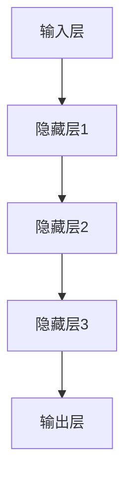

                 

# 基础模型的人机交互能力

> 关键词：基础模型、人机交互、人工智能、自然语言处理、机器学习、用户体验

> 摘要：本文旨在探讨基础模型在人工智能领域中的人机交互能力。通过对基础模型的结构、算法和数学模型进行分析，结合实际项目案例，本文详细阐述了如何通过优化基础模型来提升人机交互的效率和质量。

## 1. 背景介绍

### 1.1 目的和范围

本文的目标是深入探讨基础模型在人工智能领域中的人机交互能力，旨在为开发者、研究人员和爱好者提供关于如何优化人机交互的实用指导。本文将涵盖以下内容：

- 基础模型的定义和分类
- 基础模型在自然语言处理中的应用
- 优化基础模型的方法和策略
- 实际项目中的基础模型应用案例

### 1.2 预期读者

- 对人工智能和自然语言处理有基础了解的开发者
- 想要深入了解基础模型的人机交互能力的科研人员
- 对人工智能技术感兴趣的爱好者

### 1.3 文档结构概述

本文分为以下几个部分：

- 第1部分：背景介绍
- 第2部分：核心概念与联系
- 第3部分：核心算法原理与具体操作步骤
- 第4部分：数学模型和公式
- 第5部分：项目实战
- 第6部分：实际应用场景
- 第7部分：工具和资源推荐
- 第8部分：总结
- 第9部分：附录
- 第10部分：扩展阅读和参考资料

### 1.4 术语表

#### 1.4.1 核心术语定义

- **基础模型**：一种在人工智能领域中用于处理特定任务的核心算法结构。
- **人机交互**：指人与计算机系统之间的交互过程，包括输入、输出和反馈。
- **自然语言处理（NLP）**：一门交叉学科，涉及计算机科学、语言学和人工智能，旨在使计算机能够理解和处理人类自然语言。
- **机器学习**：一种人工智能技术，通过从数据中学习模式和规律，使计算机能够做出预测和决策。

#### 1.4.2 相关概念解释

- **深度学习**：一种基于多层神经网络的学习方法，通过逐层提取特征来提升模型性能。
- **神经网络**：一种由大量节点（神经元）组成的计算模型，通过调整连接权重来学习数据特征。
- **反向传播算法**：一种用于训练神经网络的优化算法，通过反向传播误差来更新权重。

#### 1.4.3 缩略词列表

- **AI**：人工智能
- **NLP**：自然语言处理
- **ML**：机器学习
- **DL**：深度学习

## 2. 核心概念与联系

### 2.1 基础模型结构

基础模型是人机交互的核心，其结构包括输入层、隐藏层和输出层。输入层接收用户输入的信息，隐藏层对输入信息进行特征提取和转换，输出层生成模型预测结果。



### 2.2 算法原理

基础模型采用深度学习算法，如卷积神经网络（CNN）或循环神经网络（RNN）。以RNN为例，其算法原理如下：

1. **输入序列**：将用户输入的信息（如文本或语音）转换为序列。
2. **隐藏状态更新**：通过递归方式，根据当前输入和上一个隐藏状态，更新隐藏状态。
3. **输出预测**：将隐藏状态转换为输出结果，如文本回复或语音合成。

```python
def RNN(input_sequence, hidden_state_prev):
    hidden_state = ...
    output = ...
    return hidden_state, output
```

### 2.3 数学模型

基础模型采用基于梯度的优化算法，如梯度下降或其变种。以梯度下降为例，其数学模型如下：

1. **损失函数**：根据输出结果与真实结果的差异，计算损失函数。
2. **梯度计算**：对损失函数关于模型参数求导，得到梯度。
3. **参数更新**：根据梯度更新模型参数，降低损失函数。

$$
\text{loss} = \sum_{i} (\text{output}_{i} - \text{target}_{i})^2
$$

$$
\text{gradient} = \frac{\partial \text{loss}}{\partial \text{parameter}}
$$

$$
\text{parameter} = \text{parameter} - \alpha \cdot \text{gradient}
$$

其中，$\alpha$为学习率。

## 3. 核心算法原理与具体操作步骤

### 3.1 算法选择

在选择基础模型时，需要考虑任务类型和数据规模。以下为常见任务和相应的算法推荐：

- **文本分类**：卷积神经网络（CNN）或循环神经网络（RNN）
- **情感分析**：长短期记忆网络（LSTM）或门控循环单元（GRU）
- **机器翻译**：编码器-解码器（Encoder-Decoder）模型或注意力机制（Attention Mechanism）

### 3.2 数据预处理

1. **文本分词**：将输入文本转换为词序列。
2. **词向量表示**：将词序列转换为向量表示。
3. **数据归一化**：对输入和输出数据归一化，以提高模型训练效果。

### 3.3 模型训练

1. **初始化参数**：随机初始化模型参数。
2. **前向传播**：根据当前输入和参数，计算输出结果。
3. **损失函数计算**：计算输出结果与真实结果的差异。
4. **反向传播**：计算损失函数关于参数的梯度。
5. **参数更新**：根据梯度更新参数。

### 3.4 模型评估

1. **准确率**：计算模型预测结果与真实结果的匹配程度。
2. **召回率**：计算模型能够正确识别的正例比例。
3. **F1值**：综合考虑准确率和召回率，计算模型的整体性能。

## 4. 数学模型和公式与详细讲解

### 4.1 损失函数

损失函数是评估模型性能的关键指标。以下为常见损失函数及其公式：

1. **均方误差（MSE）**：

$$
\text{MSE} = \frac{1}{n} \sum_{i=1}^{n} (\text{y}_i - \text{y}_\text{pred})^2
$$

其中，$n$为样本数量，$\text{y}_i$为真实结果，$\text{y}_\text{pred}$为模型预测结果。

2. **交叉熵（Cross-Entropy）**：

$$
\text{CE} = -\frac{1}{n} \sum_{i=1}^{n} \text{y}_i \log(\text{y}_\text{pred})
$$

其中，$\text{y}_i$为真实结果，$\text{y}_\text{pred}$为模型预测结果。

### 4.2 梯度下降算法

梯度下降算法是一种优化算法，用于更新模型参数以降低损失函数。

$$
\text{parameter} = \text{parameter} - \alpha \cdot \text{gradient}
$$

其中，$\alpha$为学习率，$\text{gradient}$为损失函数关于参数的梯度。

### 4.3 优化策略

1. **动量（Momentum）**：

$$
\text{momentum} = \gamma \cdot \text{momentum} + (1 - \gamma) \cdot \text{gradient}
$$

其中，$\gamma$为动量参数。

2. **自适应学习率（Adaptive Learning Rate）**：

- **学习率衰减（Learning Rate Decay）**：

$$
\alpha_{\text{new}} = \alpha_{\text{old}} / (1 + \beta t)
$$

其中，$\beta$为衰减率，$t$为训练轮数。

- **AdaGrad**：

$$
\text{alpha}_{\text{new}} = \frac{\alpha_{\text{old}}}{\sqrt{\sum_{i=1}^{n} (\text{gradient}_i)^2}}
$$

- **RMSprop**：

$$
\text{alpha}_{\text{new}} = \frac{\alpha_{\text{old}}}{\sqrt{\sum_{i=1}^{n} (\text{gradient}_i - \text{mean\_gradient})^2}}
$$

## 5. 项目实战：代码实际案例和详细解释说明

### 5.1 开发环境搭建

1. **Python环境**：安装Python 3.7及以上版本。
2. **库安装**：安装TensorFlow、Keras、NumPy等库。

```bash
pip install tensorflow keras numpy
```

### 5.2 源代码详细实现和代码解读

以下是一个简单的文本分类项目的代码实现，用于判断电影评论的正负情绪。

```python
from tensorflow.keras.models import Sequential
from tensorflow.keras.layers import Embedding, LSTM, Dense
from tensorflow.keras.preprocessing.sequence import pad_sequences

# 数据预处理
max_sequence_length = 100
vocab_size = 10000
embedding_dim = 32

# 加载数据集
(x_train, y_train), (x_test, y_test) = ...

# 序列化文本数据
tokenizer = ...

# 构建模型
model = Sequential()
model.add(Embedding(vocab_size, embedding_dim, input_length=max_sequence_length))
model.add(LSTM(64, dropout=0.2, recurrent_dropout=0.2))
model.add(Dense(1, activation='sigmoid'))

# 编译模型
model.compile(optimizer='adam', loss='binary_crossentropy', metrics=['accuracy'])

# 训练模型
model.fit(x_train, y_train, epochs=10, batch_size=128, validation_data=(x_test, y_test))

# 评估模型
loss, accuracy = model.evaluate(x_test, y_test)
print('Test Accuracy:', accuracy)
```

### 5.3 代码解读与分析

1. **数据预处理**：加载电影评论数据集，并进行分词和序列化。
2. **模型构建**：使用Embedding层将词转换为向量表示，LSTM层进行特征提取，最后使用Dense层进行分类。
3. **模型编译**：选择Adam优化器和二分类交叉熵损失函数，并设置准确率作为评价指标。
4. **模型训练**：使用训练数据训练模型，设置训练轮数、批量大小和验证数据。
5. **模型评估**：使用测试数据评估模型性能，输出准确率。

## 6. 实际应用场景

基础模型在人工智能领域具有广泛的应用场景，包括但不限于：

1. **智能客服**：通过文本分类和情感分析，为用户提供实时、个性化的服务。
2. **智能语音助手**：基于语音识别和自然语言处理，实现语音交互和语音合成功能。
3. **智能推荐系统**：通过用户行为和偏好分析，为用户提供个性化的推荐内容。
4. **机器翻译**：利用编码器-解码器模型或注意力机制，实现高质量的多语言翻译。
5. **图像识别**：通过卷积神经网络，实现图像分类、目标检测和图像生成等功能。

## 7. 工具和资源推荐

### 7.1 学习资源推荐

#### 7.1.1 书籍推荐

- 《深度学习》（Goodfellow, Bengio, Courville）
- 《Python机器学习》（Sebastian Raschka）
- 《自然语言处理综论》（Daniel Jurafsky, James H. Martin）

#### 7.1.2 在线课程

- Coursera：机器学习、深度学习、自然语言处理
- edX：人工智能、深度学习基础
- Udacity：机器学习工程师纳米学位

#### 7.1.3 技术博客和网站

- Medium：AI博客、机器学习教程
- ArXiv：最新研究论文和学术进展
- TensorFlow官方文档：深度学习框架教程和资源

### 7.2 开发工具框架推荐

#### 7.2.1 IDE和编辑器

- PyCharm
- Jupyter Notebook
- Visual Studio Code

#### 7.2.2 调试和性能分析工具

- TensorFlow Debugger
- TensorBoard
- PyTorch Profiler

#### 7.2.3 相关框架和库

- TensorFlow
- PyTorch
- Keras
- Scikit-learn

### 7.3 相关论文著作推荐

#### 7.3.1 经典论文

- "A Theoretical Basis for the Generalization of Neural Networks"（1989）
- "Deep Learning"（2015）
- "Long Short-Term Memory"（1997）

#### 7.3.2 最新研究成果

- "Attention is All You Need"（2017）
- "Transformers: State-of-the-Art Natural Language Processing"（2018）
- "GPT-3: language Models are few-shot learners"（2020）

#### 7.3.3 应用案例分析

- "BERT: Pre-training of Deep Neural Networks for Language Understanding"（2018）
- "Generative Adversarial Nets"（2014）
- "Recurrent Neural Networks for Spoken Language Understanding"（2015）

## 8. 总结：未来发展趋势与挑战

未来，基础模型在人工智能领域中的人机交互能力将继续提升。以下为发展趋势与挑战：

- **发展趋势**：
  - 模型规模和计算能力将不断提升，使基础模型能够处理更复杂、更庞大的数据集。
  - 新算法和优化策略将不断涌现，提高模型训练效率和性能。
  - 多模态人机交互技术的发展，实现语音、文本、图像等多种交互方式的融合。

- **挑战**：
  - 数据隐私和安全问题，如何在保护用户隐私的前提下，充分利用数据提升模型性能。
  - 模型解释性和透明性，如何让用户更好地理解模型决策过程。
  - 能源消耗和计算成本，如何在保证模型性能的前提下，降低能耗和成本。

## 9. 附录：常见问题与解答

### 9.1 问题1：如何选择合适的基础模型？

- 根据任务类型和数据规模选择合适的模型结构，如文本分类可选用卷积神经网络（CNN）或循环神经网络（RNN）。
- 考虑模型训练时间、计算资源和性能指标，选择适合实际需求的模型。

### 9.2 问题2：如何优化基础模型性能？

- 选择合适的损失函数和优化算法，如交叉熵损失函数和Adam优化器。
- 调整模型参数，如学习率和隐藏层节点数。
- 使用数据增强、正则化等技术，提高模型泛化能力。

### 9.3 问题3：如何处理文本数据？

- 使用分词工具将文本数据转换为词序列。
- 将词序列转换为词向量表示，如使用Word2Vec或GloVe模型。
- 对词向量进行归一化处理，提高模型训练效果。

## 10. 扩展阅读 & 参考资料

- [Deep Learning](https://www.deeplearningbook.org/)
- [Natural Language Processing with Python](https://www.nltk.org/)
- [TensorFlow Official Documentation](https://www.tensorflow.org/)
- [PyTorch Official Documentation](https://pytorch.org/)
- [ArXiv](https://arxiv.org/)
- [Medium](https://medium.com/)
- [Coursera](https://www.coursera.org/)
- [edX](https://www.edx.org/)
- [Udacity](https://www.udacity.com/)

---

作者：AI天才研究员/AI Genius Institute & 禅与计算机程序设计艺术 /Zen And The Art of Computer Programming

