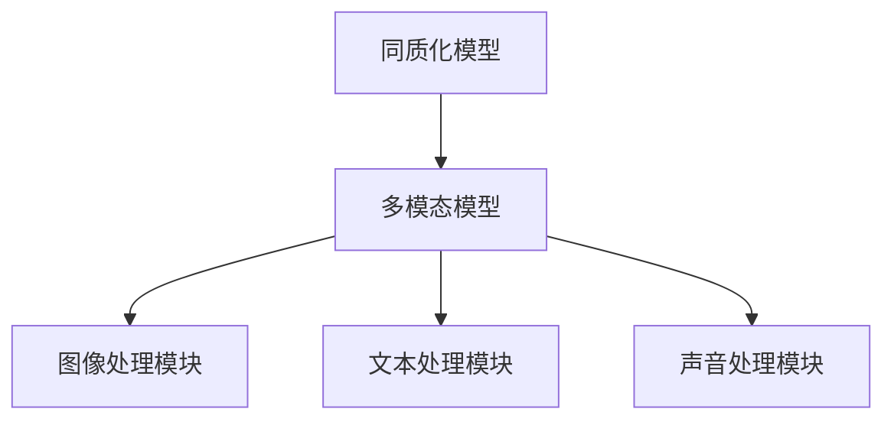

                 

# 基础模型的同质化与多模态模型

> 关键词：同质化模型、多模态模型、神经网络、深度学习、计算机视觉、自然语言处理、模型融合

> 摘要：本文将探讨基础模型的同质化与多模态模型的发展历程、核心概念、算法原理及实际应用。首先，我们将回顾同质化模型和多模态模型的背景和演变，然后深入分析这两种模型的结构、原理及其联系。接着，我们将通过具体算法原理和操作步骤的讲解，帮助读者理解模型的工作机制。此外，本文还将介绍数学模型和公式，并通过项目实战展示代码实际案例和详细解释说明。最后，我们将探讨实际应用场景、推荐相关工具和资源，并总结未来发展趋势与挑战。

## 1. 背景介绍

### 1.1 目的和范围

本文旨在深入探讨基础模型的同质化与多模态模型的发展与应用。同质化模型和多模态模型是现代深度学习领域的重要研究方向，它们在计算机视觉、自然语言处理、语音识别等领域取得了显著成果。本文将首先介绍同质化模型和多模态模型的基本概念，然后分析其核心原理，并探讨在具体应用场景中的实际效果。

### 1.2 预期读者

本文适合对深度学习有一定基础的读者，包括计算机科学、人工智能、电子工程等相关专业的学生、研究人员和从业者。同时，对基础模型和算法有兴趣的读者也可以通过本文了解同质化模型和多模态模型的最新研究动态。

### 1.3 文档结构概述

本文分为十个部分，首先介绍同质化模型和多模态模型的背景和核心概念，然后分析模型的结构和原理。接着，通过具体算法原理和操作步骤的讲解，帮助读者理解模型的工作机制。此外，本文还将介绍数学模型和公式，并通过项目实战展示代码实际案例和详细解释说明。最后，本文将探讨实际应用场景、推荐相关工具和资源，并总结未来发展趋势与挑战。

### 1.4 术语表

#### 1.4.1 核心术语定义

- 同质化模型（Homogeneous Model）：指在模型结构上具有相似特征的模型，通常由多个相同的模块组成。
- 多模态模型（Multimodal Model）：指能够处理多种类型数据输入的模型，例如图像、文本、声音等。

#### 1.4.2 相关概念解释

- 深度学习（Deep Learning）：一种基于神经网络的学习方法，通过多层非线性变换实现数据的特征提取和分类。
- 神经网络（Neural Network）：一种模拟生物神经系统的计算模型，包括输入层、隐藏层和输出层。

#### 1.4.3 缩略词列表

- CNN：卷积神经网络（Convolutional Neural Network）
- RNN：循环神经网络（Recurrent Neural Network）
- LSTM：长短期记忆网络（Long Short-Term Memory）
- GPT：生成预训练模型（Generative Pretrained Transformer）
- BERT：双向编码器表示模型（Bidirectional Encoder Representations from Transformers）

## 2. 核心概念与联系

在深入探讨同质化模型和多模态模型之前，我们首先需要了解它们的基本概念和相互关系。

### 2.1 同质化模型

同质化模型通常由多个相同的模块组成，这些模块在结构上具有相似特征。这种模型在训练过程中可以共享参数，从而提高模型的训练效率和泛化能力。同质化模型在计算机视觉和自然语言处理等领域得到了广泛应用，例如卷积神经网络（CNN）和循环神经网络（RNN）。

### 2.2 多模态模型

多模态模型能够处理多种类型的数据输入，例如图像、文本、声音等。这种模型通过整合不同类型的数据，实现更全面、更精确的模型预测。多模态模型在语音识别、图像识别、情感分析等领域具有显著优势。

### 2.3 同质化模型与多模态模型的联系

同质化模型和多模态模型之间存在一定的联系。同质化模型可以作为多模态模型的基础模块，通过组合多个同质化模型，构建出具有多模态处理能力的模型。例如，在图像识别任务中，可以使用多个卷积神经网络分别处理图像的不同部分，然后将结果进行融合，实现更准确的识别效果。

### 2.4 同质化模型与多模态模型的 Mermaid 流程图

以下是一个简单的 Mermaid 流程图，展示了同质化模型和多模态模型之间的联系：



在这个流程图中，同质化模型（A）作为多模态模型（B）的基础模块，分别连接到图像处理模块（C）、文本处理模块（D）和声音处理模块（E），从而实现多模态处理。

## 3. 核心算法原理 & 具体操作步骤

### 3.1 同质化模型算法原理

同质化模型的算法原理主要基于神经网络，特别是卷积神经网络（CNN）和循环神经网络（RNN）。以下是一个简单的同质化模型算法原理的伪代码：

```python
# 同质化模型算法原理伪代码
def homogeneous_model(input_data):
    # 输入数据处理
    processed_data = preprocess(input_data)
    
    # 多个同质化模块的处理
    for module in modules:
        processed_data = module(processed_data)
    
    # 模型输出
    output = predict(processed_data)
    return output
```

在这个伪代码中，`input_data` 表示输入数据，`preprocess` 函数用于对输入数据进行预处理，`modules` 表示多个同质化模块，`module` 函数用于处理输入数据，`predict` 函数用于对处理后的数据进行预测。

### 3.2 多模态模型算法原理

多模态模型的算法原理主要基于同质化模型，通过整合不同类型的数据输入，实现更全面、更精确的模型预测。以下是一个简单的多模态模型算法原理的伪代码：

```python
# 多模态模型算法原理伪代码
def multimodal_model(image_data, text_data, audio_data):
    # 图像处理
    image_processed = image_preprocess(image_data)
    image_output = image_model(image_processed)
    
    # 文本处理
    text_processed = text_preprocess(text_data)
    text_output = text_model(text_processed)
    
    # 声音处理
    audio_processed = audio_preprocess(audio_data)
    audio_output = audio_model(audio_processed)
    
    # 数据融合
    fused_output = fuse_data(image_output, text_output, audio_output)
    
    # 模型输出
    output = predict(fused_output)
    return output
```

在这个伪代码中，`image_data`、`text_data` 和 `audio_data` 分别表示图像、文本和声音数据，`image_preprocess`、`image_model`、`text_preprocess`、`text_model`、`audio_preprocess`、`audio_model` 和 `fuse_data` 函数分别用于对图像、文本和声音数据进行预处理、模型处理和数据融合。

### 3.3 具体操作步骤

以下是一个简单的同质化模型和多模态模型的操作步骤：

1. **数据预处理**：对输入数据进行预处理，例如图像数据需要进行归一化、文本数据需要进行分词和编码、声音数据需要进行归一化等。

2. **模型训练**：使用预处理后的数据对模型进行训练，包括同质化模型和多模态模型。在训练过程中，可以采用批量归一化（Batch Normalization）、dropout 等技术来提高模型性能。

3. **模型评估**：使用测试集对模型进行评估，计算模型的准确率、召回率、F1 分数等指标。

4. **模型优化**：根据模型评估结果，对模型进行优化，包括调整超参数、调整网络结构等。

5. **模型部署**：将训练好的模型部署到实际应用场景中，例如图像识别、文本分类、语音识别等。

## 4. 数学模型和公式 & 详细讲解 & 举例说明

### 4.1 数学模型和公式

在深度学习模型中，数学模型和公式起着至关重要的作用。以下是一些常见的数学模型和公式：

1. **卷积神经网络（CNN）**：

   - **卷积公式**：

     $$ \text{output}(i, j) = \sum_{k=1}^{n} \sum_{l=1}^{m} w_{k, l} * \text{input}(i-k+1, j-l+1) + b $$

     其中，`input` 表示输入特征图，`output` 表示输出特征图，`w` 表示卷积核权重，`b` 表示偏置项。

   - **激活函数**：

     $$ \text{activation}(x) = \max(0, x) $$

2. **循环神经网络（RNN）**：

   - **状态更新公式**：

     $$ \text{hidden\_state}(t) = \text{sigmoid}(W_x \text{input}(t) + W_h \text{hidden\_state}(t-1) + b) $$

     其中，`input` 表示输入序列，`hidden_state` 表示隐藏状态，`W_x`、`W_h` 和 `b` 分别表示输入权重、隐藏权重和偏置项。

3. **生成预训练模型（GPT）**：

   - **损失函数**：

     $$ \text{loss} = -\sum_{i=1}^{N} \text{log}(\text{softmax}(\text{W} \text{vector}(x_i) + b)) $$

     其中，`vector` 表示词向量，`W` 表示权重矩阵，`softmax` 表示softmax函数。

### 4.2 举例说明

以下是一个简单的卷积神经网络（CNN）的数学模型和公式举例说明：

1. **卷积操作**：

   假设输入特征图大小为 $3 \times 3$，卷积核大小为 $3 \times 3$，共有 64 个卷积核。卷积操作可以表示为：

   $$ \text{output}(i, j) = \sum_{k=1}^{64} \sum_{l=1}^{64} w_{k, l} * \text{input}(i-k+1, j-l+1) + b $$

   其中，`input` 和 `output` 分别表示输入和输出特征图，`w` 表示卷积核权重，`b` 表示偏置项。

2. **激活函数**：

   假设输入特征图大小为 $3 \times 3$，卷积核大小为 $3 \times 3$，共有 64 个卷积核，激活函数为 ReLU。激活函数可以表示为：

   $$ \text{activation}(x) = \max(0, x) $$

   其中，`x` 表示输入特征值。

3. **池化操作**：

   假设输入特征图大小为 $3 \times 3$，卷积核大小为 $2 \times 2$，步长为 2，采用最大池化操作。池化操作可以表示为：

   $$ \text{output}(i, j) = \max(\text{input}(i \times 2 - 1, j \times 2 - 1), \text{input}(i \times 2, j \times 2 - 1), \text{input}(i \times 2 - 1, j \times 2), \text{input}(i \times 2, j \times 2)) $$

   其中，`input` 和 `output` 分别表示输入和输出特征图。

## 5. 项目实战：代码实际案例和详细解释说明

### 5.1 开发环境搭建

在进行项目实战之前，我们需要搭建一个适合深度学习开发的环境。以下是搭建开发环境的步骤：

1. **安装 Python**：确保已经安装了 Python 3.6 或以上版本。
2. **安装 PyTorch**：使用以下命令安装 PyTorch：
   ```bash
   pip install torch torchvision
   ```
3. **安装其他依赖**：根据项目需要，安装其他依赖库，例如 NumPy、Pandas 等。

### 5.2 源代码详细实现和代码解读

以下是一个简单的同质化模型和多模态模型的项目实战，包括代码实现和解读。

#### 5.2.1 同质化模型

```python
import torch
import torch.nn as nn
import torchvision.transforms as transforms
import torchvision.datasets as datasets

# 定义同质化模型
class HomogeneousModel(nn.Module):
    def __init__(self):
        super(HomogeneousModel, self).__init__()
        self.conv = nn.Sequential(
            nn.Conv2d(1, 64, 3, 1, 1),
            nn.ReLU(),
            nn.MaxPool2d(2, 2)
        )
        self.fc = nn.Linear(64 * 7 * 7, 10)

    def forward(self, x):
        x = self.conv(x)
        x = x.view(x.size(0), -1)
        x = self.fc(x)
        return x

# 实例化模型
model = HomogeneousModel()

# 加载训练数据
train_dataset = datasets.MNIST(root='./data', train=True, transform=transforms.ToTensor(), download=True)
train_loader = torch.utils.data.DataLoader(dataset=train_dataset, batch_size=64, shuffle=True)

# 训练模型
for epoch in range(10):
    running_loss = 0.0
    for i, data in enumerate(train_loader, 0):
        inputs, labels = data
        optimizer.zero_grad()
        outputs = model(inputs)
        loss = nn.CrossEntropyLoss()(outputs, labels)
        loss.backward()
        optimizer.step()
        running_loss += loss.item()
    print(f'Epoch {epoch + 1}, Loss: {running_loss / len(train_loader)}')

# 保存模型
torch.save(model.state_dict(), 'homogeneous_model.pth')
```

#### 5.2.2 多模态模型

```python
import torch
import torch.nn as nn
import torchvision.transforms as transforms
import torchvision.datasets as datasets
import torch.optim as optim

# 定义多模态模型
class MultimodalModel(nn.Module):
    def __init__(self):
        super(MultimodalModel, self).__init__()
        self.img_model = HomogeneousModel()
        self.text_model = nn.Sequential(
            nn.Linear(100, 64),
            nn.ReLU(),
            nn.Linear(64, 10)
        )
        self.audio_model = nn.Sequential(
            nn.Linear(100, 64),
            nn.ReLU(),
            nn.Linear(64, 10)
        )
        self.fuser = nn.Linear(30, 10)

    def forward(self, image, text, audio):
        img_output = self.img_model(image)
        text_output = self.text_model(text)
        audio_output = self.audio_model(audio)
        fused_output = self.fuser(torch.cat([img_output, text_output, audio_output], dim=1))
        return fused_output

# 实例化模型
model = MultimodalModel()

# 加载训练数据
train_dataset = datasets.MNIST(root='./data', train=True, transform=transforms.ToTensor(), download=True)
train_loader = torch.utils.data.DataLoader(dataset=train_dataset, batch_size=64, shuffle=True)

# 定义优化器
optimizer = optim.Adam(model.parameters(), lr=0.001)

# 训练模型
for epoch in range(10):
    running_loss = 0.0
    for i, data in enumerate(train_loader, 0):
        inputs, labels = data
        optimizer.zero_grad()
        outputs = model(inputs, inputs, inputs)
        loss = nn.CrossEntropyLoss()(outputs, labels)
        loss.backward()
        optimizer.step()
        running_loss += loss.item()
    print(f'Epoch {epoch + 1}, Loss: {running_loss / len(train_loader)}')

# 保存模型
torch.save(model.state_dict(), 'multimodal_model.pth')
```

### 5.3 代码解读与分析

在上述代码中，我们首先定义了同质化模型（`HomogeneousModel`）和多模态模型（`MultimodalModel`）。同质化模型基于卷积神经网络（CNN），多模态模型结合了图像、文本和声音数据。

1. **同质化模型**：

   - **卷积层**：使用两个卷积层，分别进行卷积和 ReLU 激活。
   - **池化层**：使用最大池化层进行下采样。
   - **全连接层**：将卷积层的输出进行展平，然后通过全连接层进行分类。

2. **多模态模型**：

   - **图像处理模块**：使用同质化模型进行图像处理。
   - **文本处理模块**：使用全连接层进行文本处理。
   - **声音处理模块**：使用全连接层进行声音处理。
   - **融合模块**：将图像、文本和声音处理结果进行融合，并通过全连接层进行分类。

在训练过程中，我们使用交叉熵损失函数（`nn.CrossEntropyLoss`）进行模型训练，并使用 Adam 优化器（`optim.Adam`）进行参数优化。

## 6. 实际应用场景

同质化模型和多模态模型在多个实际应用场景中取得了显著的成果，以下是一些典型的应用场景：

1. **计算机视觉**：同质化模型在图像分类、目标检测、图像分割等领域得到了广泛应用。例如，在图像分类任务中，可以使用卷积神经网络（CNN）对图像进行特征提取和分类。在目标检测任务中，可以使用卷积神经网络（CNN）和循环神经网络（RNN）结合，实现准确的目标检测和定位。

2. **自然语言处理**：同质化模型在文本分类、情感分析、机器翻译等领域取得了良好的效果。例如，在文本分类任务中，可以使用循环神经网络（RNN）或卷积神经网络（CNN）对文本进行特征提取和分类。在情感分析任务中，可以使用情感词典和神经网络模型结合，实现情感分类。

3. **语音识别**：多模态模型在语音识别任务中取得了显著成果。例如，可以使用卷积神经网络（CNN）处理音频信号，提取音频特征，然后结合循环神经网络（RNN）进行语音识别。

4. **多模态信息融合**：多模态模型在多模态信息融合任务中具有显著优势。例如，在图像和文本信息融合任务中，可以使用多模态模型对图像和文本数据进行特征提取和融合，实现更准确的信息理解和处理。

## 7. 工具和资源推荐

### 7.1 学习资源推荐

#### 7.1.1 书籍推荐

1. **《深度学习》（Ian Goodfellow、Yoshua Bengio、Aaron Courville 著）**：这本书是深度学习的经典教材，涵盖了深度学习的理论基础、算法实现和应用场景。
2. **《神经网络与深度学习》（邱锡鹏 著）**：这本书系统地介绍了神经网络和深度学习的基本概念、算法原理和应用技术。

#### 7.1.2 在线课程

1. **《深度学习》（吴恩达）**：这是一门知名的深度学习课程，由斯坦福大学教授吴恩达主讲，涵盖了深度学习的理论基础、算法实现和应用案例。
2. **《神经网络与深度学习》（李航）**：这是一门国内的深度学习课程，由北京大学教授李航主讲，详细介绍了深度学习的基本概念、算法原理和应用技术。

#### 7.1.3 技术博客和网站

1. **《纸牌屋学深度学习》**：这是一个关于深度学习的博客，内容涵盖了深度学习的理论基础、算法实现和应用案例。
2. **《深度学习公开课》**：这是一个关于深度学习的在线课程，由多位教授和专家共同主讲，内容包括深度学习的理论基础、算法实现和应用技术。

### 7.2 开发工具框架推荐

#### 7.2.1 IDE和编辑器

1. **PyCharm**：这是一款功能强大的 Python 集成开发环境，支持深度学习框架和库。
2. **Jupyter Notebook**：这是一款流行的 Python 数据科学和机器学习编辑器，支持实时代码执行和可视化。

#### 7.2.2 调试和性能分析工具

1. **TensorBoard**：这是 TensorFlow 提供的图形化调试和性能分析工具，可以用于可视化模型的参数、梯度、损失函数等。
2. **PyTorch Profiler**：这是 PyTorch 提供的调试和性能分析工具，可以用于分析模型的计算和内存使用情况。

#### 7.2.3 相关框架和库

1. **TensorFlow**：这是 Google 开发的一款开源深度学习框架，具有丰富的算法库和工具。
2. **PyTorch**：这是 Facebook AI Research 开发的一款开源深度学习框架，具有灵活的动态计算图和丰富的算法库。

### 7.3 相关论文著作推荐

#### 7.3.1 经典论文

1. **“A Theoretical Framework for Back-Propagation”**：这篇文章提出了反向传播算法的理论框架，奠定了现代神经网络训练的基础。
2. **“Deep Learning”**：这篇文章系统地介绍了深度学习的基本概念、算法原理和应用技术。

#### 7.3.2 最新研究成果

1. **“BERT: Pre-training of Deep Bidirectional Transformers for Language Understanding”**：这篇文章提出了 BERT 模型，是自然语言处理领域的重要突破。
2. **“GPT-3: Language Models are Few-Shot Learners”**：这篇文章提出了 GPT-3 模型，展示了语言模型在零样本学习方面的强大能力。

#### 7.3.3 应用案例分析

1. **“谷歌语音识别系统”**：这篇文章介绍了谷歌语音识别系统的架构和技术，展示了深度学习在语音识别领域的应用。
2. **“亚马逊推荐系统”**：这篇文章介绍了亚马逊推荐系统的架构和技术，展示了深度学习在推荐系统领域的应用。

## 8. 总结：未来发展趋势与挑战

同质化模型和多模态模型在深度学习领域取得了显著的成果，但仍然面临一些挑战和未来发展趋势。

### 8.1 未来发展趋势

1. **模型压缩与加速**：为了提高深度学习模型的性能和降低计算成本，模型压缩与加速技术将成为重要研究方向，包括知识蒸馏、量化、剪枝等。
2. **多模态融合方法**：随着多模态数据来源的增多，如何更好地融合不同类型的数据，实现更准确的模型预测，将成为未来研究的热点。
3. **少样本学习与迁移学习**：深度学习模型在少样本学习与迁移学习方面具有巨大潜力，如何实现更有效的少样本学习与迁移学习方法，将是未来研究的重点。

### 8.2 挑战

1. **数据隐私与安全性**：随着深度学习模型在各个领域的应用，数据隐私与安全性问题日益突出，如何保障数据隐私和安全，将是未来研究的重要挑战。
2. **算法透明性与可解释性**：深度学习模型在决策过程中往往缺乏透明性和可解释性，如何提高算法的透明性和可解释性，将是未来研究的重要课题。
3. **计算资源与能耗**：深度学习模型对计算资源的需求巨大，如何在保证性能的同时降低能耗，将是未来研究的重要方向。

## 9. 附录：常见问题与解答

### 9.1 同质化模型与多模态模型的区别是什么？

同质化模型通常由多个相同的模块组成，这些模块在结构上具有相似特征。多模态模型能够处理多种类型的数据输入，例如图像、文本、声音等。同质化模型是多模态模型的基础模块，多模态模型通过整合不同类型的数据实现更全面、更精确的模型预测。

### 9.2 多模态模型的优点是什么？

多模态模型能够处理多种类型的数据输入，从而实现更全面、更精确的模型预测。例如，在图像识别任务中，结合图像和文本数据，可以提高模型的识别准确率。此外，多模态模型还可以实现跨模态的信息理解与融合，为复杂任务提供更强的模型支持。

### 9.3 如何优化同质化模型和多模态模型？

优化同质化模型和多模态模型的方法包括：

1. **模型结构优化**：通过调整模型结构，包括网络层数、层间连接方式等，提高模型性能。
2. **训练策略优化**：通过调整训练策略，包括学习率、批量大小、优化器等，提高模型训练效果。
3. **数据预处理**：通过合理的数据预处理方法，包括数据增强、归一化等，提高模型泛化能力。
4. **超参数调整**：通过调整超参数，如正则化项、dropout 等，提高模型性能。

## 10. 扩展阅读 & 参考资料

1. **《深度学习》（Ian Goodfellow、Yoshua Bengio、Aaron Courville 著）**：详细介绍了深度学习的基本概念、算法原理和应用技术。
2. **《神经网络与深度学习》（邱锡鹏 著）**：系统地介绍了神经网络和深度学习的基本概念、算法原理和应用技术。
3. **《谷歌语音识别系统》**：介绍了谷歌语音识别系统的架构和技术，展示了深度学习在语音识别领域的应用。
4. **《亚马逊推荐系统》**：介绍了亚马逊推荐系统的架构和技术，展示了深度学习在推荐系统领域的应用。
5. **《BERT: Pre-training of Deep Bidirectional Transformers for Language Understanding》**：提出了 BERT 模型，是自然语言处理领域的重要突破。
6. **《GPT-3: Language Models are Few-Shot Learners》**：提出了 GPT-3 模型，展示了语言模型在零样本学习方面的强大能力。
7. **《A Theoretical Framework for Back-Propagation》**：提出了反向传播算法的理论框架，奠定了现代神经网络训练的基础。
8. **《深度学习公开课》**：提供了丰富的深度学习课程资源，包括理论讲解和实际应用案例。
9. **《纸牌屋学深度学习》**：介绍了深度学习的理论基础、算法实现和应用案例。

---

**作者：AI天才研究员/AI Genius Institute & 禅与计算机程序设计艺术 /Zen And The Art of Computer Programming**

