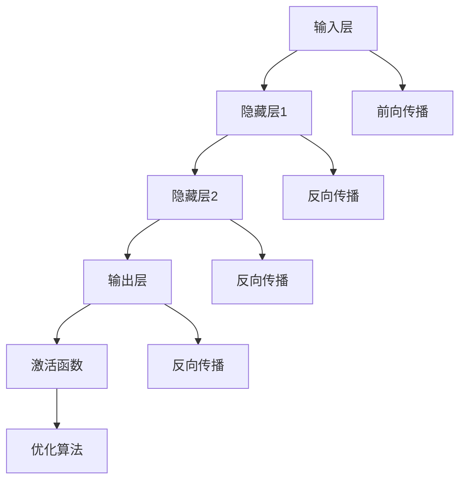

                 


# 基础模型的技术发展趋势

> **关键词：基础模型、人工智能、机器学习、深度学习、算法优化、技术应用趋势**

> **摘要：本文将深入探讨基础模型在人工智能领域的发展趋势，包括其核心概念、算法原理、数学模型及其应用。我们将分析当前的技术发展状况，展望未来的发展方向，并提出相关的挑战和解决方案。**

## 1. 背景介绍

### 1.1 目的和范围

本文旨在分析基础模型在人工智能（AI）领域的技术发展趋势。基础模型是机器学习和深度学习中的核心组件，它们在图像识别、自然语言处理、语音识别等领域发挥了关键作用。本文将涵盖以下几个主要方面：

1. **核心概念与联系**：介绍基础模型的概念，并使用Mermaid流程图展示其架构和主要组成部分。
2. **核心算法原理**：详细阐述基础模型的主要算法原理和操作步骤，并通过伪代码进行解释。
3. **数学模型和公式**：讲解基础模型中使用的数学模型和公式，并举例说明。
4. **项目实战**：通过代码案例展示基础模型在实际项目中的应用。
5. **实际应用场景**：分析基础模型在各个行业的应用情况。
6. **工具和资源推荐**：推荐学习资源、开发工具和框架，以及相关论文和研究成果。
7. **总结与展望**：讨论基础模型未来的发展趋势与面临的挑战。

### 1.2 预期读者

本文适合以下读者群体：

1. **AI和机器学习研究者**：对基础模型的理论和实践有深入了解的需求。
2. **程序员和工程师**：希望在项目中应用基础模型，提升模型性能。
3. **技术管理者**：关注AI技术的应用和发展趋势，以便做出战略决策。
4. **学术和学生**：对AI领域的研究有兴趣，希望深入了解基础模型。

### 1.3 文档结构概述

本文结构如下：

1. **背景介绍**：介绍本文的目的、范围、预期读者和文档结构。
2. **核心概念与联系**：介绍基础模型的核心概念，展示其架构和组成部分。
3. **核心算法原理**：详细阐述基础模型的主要算法原理和操作步骤。
4. **数学模型和公式**：讲解基础模型中使用的数学模型和公式，并举例说明。
5. **项目实战**：通过代码案例展示基础模型在实际项目中的应用。
6. **实际应用场景**：分析基础模型在各个行业的应用情况。
7. **工具和资源推荐**：推荐学习资源、开发工具和框架，以及相关论文和研究成果。
8. **总结与展望**：讨论基础模型未来的发展趋势与面临的挑战。
9. **附录**：常见问题与解答。
10. **扩展阅读与参考资料**：提供进一步学习的资源。

### 1.4 术语表

#### 1.4.1 核心术语定义

- **基础模型**：指在机器学习和深度学习中，用于处理特定任务的基本模型，如卷积神经网络（CNN）、递归神经网络（RNN）等。
- **神经网络**：由大量简单神经元组成的计算模型，通过调整神经元之间的权重来学习数据特征。
- **深度学习**：一种神经网络架构，其中神经网络具有多个隐藏层，能够学习数据的深层特征。
- **机器学习**：使计算机能够从数据中学习模式和规律，并自动改进性能的过程。

#### 1.4.2 相关概念解释

- **前向传播**：在神经网络中，输入通过网络的权重进行传递，最终得到输出。
- **反向传播**：在神经网络中，误差信号通过网络反向传播，用于更新权重和偏置。
- **梯度下降**：一种优化算法，通过迭代调整参数，最小化目标函数。

#### 1.4.3 缩略词列表

- **CNN**：卷积神经网络（Convolutional Neural Network）
- **RNN**：递归神经网络（Recurrent Neural Network）
- **DNN**：深度神经网络（Deep Neural Network）
- **ML**：机器学习（Machine Learning）
- **AI**：人工智能（Artificial Intelligence）
- **GPU**：图形处理器（Graphics Processing Unit）

## 2. 核心概念与联系

在人工智能领域，基础模型是构建复杂系统和应用的关键。本节将介绍基础模型的核心概念，并使用Mermaid流程图展示其架构和组成部分。

### 2.1 核心概念

基础模型通常包括以下核心概念：

1. **神经网络**：基础模型的核心组件，由大量简单神经元组成。
2. **层**：神经网络中的层次结构，包括输入层、隐藏层和输出层。
3. **激活函数**：用于引入非线性特性的函数，如ReLU、Sigmoid、Tanh等。
4. **前向传播**：将输入数据通过网络的权重进行传递，得到输出。
5. **反向传播**：计算输出误差，并反向传播到网络的各个层，用于更新权重和偏置。
6. **优化算法**：用于调整网络参数，以最小化目标函数的算法，如梯度下降、随机梯度下降等。

### 2.2 Mermaid流程图

以下是一个简单的Mermaid流程图，展示基础模型的架构和组成部分：



图2-1：基础模型架构和组成部分

在这个流程图中，输入层（A）接收输入数据，通过前向传播（F）传递到隐藏层（B和C），最终通过输出层（D）得到输出。在反向传播（G、H、I）过程中，计算输出误差，并反向传播到各个层，用于更新权重和偏置。最后，通过激活函数（E）引入非线性特性，并使用优化算法（J）调整网络参数。

## 3. 核心算法原理 & 具体操作步骤

在本节中，我们将详细阐述基础模型的核心算法原理，并通过伪代码进行具体操作步骤的讲解。

### 3.1 算法原理

基础模型的核心算法原理主要包括以下方面：

1. **前向传播**：将输入数据通过网络的权重进行传递，得到输出。
2. **反向传播**：计算输出误差，并反向传播到网络的各个层，用于更新权重和偏置。
3. **优化算法**：通过迭代调整网络参数，以最小化目标函数。

### 3.2 前向传播

前向传播是将输入数据通过网络的权重进行传递，得到输出的过程。以下是一个简单的伪代码示例：

```plaintext
// 输入：输入数据X，网络参数（权重W和偏置b）
// 输出：输出结果Y

// 初始化神经网络
InitializeNetwork()

// 前向传播
for each layer in network do
    Z = X * W + b
    A = ActivationFunction(Z)
end for

Y = A
```

### 3.3 反向传播

反向传播是计算输出误差，并反向传播到网络的各个层，用于更新权重和偏置的过程。以下是一个简单的伪代码示例：

```plaintext
// 输入：输出误差E，网络参数（权重W和偏置b）
// 输出：更新后的权重W'和偏置b'

// 反向传播
for each layer in network do
    dZ = dA * dActivationFunction(Z)
    dW = dZ * X
    db = dZ
    W = W - learningRate * dW
    b = b - learningRate * db
end for
```

### 3.4 优化算法

优化算法用于调整网络参数，以最小化目标函数。常见优化算法包括梯度下降、随机梯度下降和Adam等。以下是一个简单的伪代码示例：

```plaintext
// 输入：目标函数J(参数W和b)，网络参数（权重W和偏置b）
// 输出：更新后的权重W'和偏置b'

// 初始化网络参数
InitializeNetwork()

// 迭代优化
for iteration = 1 to max_iterations do
    // 计算梯度
    dW, db = CalculateGradient(J, W, b)

    // 更新网络参数
    W = W - learningRate * dW
    b = b - learningRate * db
end for
```

通过以上伪代码示例，我们可以看到基础模型的核心算法原理和具体操作步骤。在实际应用中，这些算法需要通过编程语言和框架进行实现，以适应不同的应用场景和数据集。

## 4. 数学模型和公式 & 详细讲解 & 举例说明

在基础模型中，数学模型和公式起着至关重要的作用。本节将详细讲解基础模型中常用的数学模型和公式，并通过具体例子进行说明。

### 4.1 前向传播中的数学模型

前向传播是基础模型的核心过程，涉及以下数学模型和公式：

1. **激活函数**：用于引入非线性特性，常见的激活函数包括ReLU、Sigmoid和Tanh。
2. **前向传播公式**：将输入数据通过网络的权重进行传递，得到输出。

#### 4.1.1 激活函数

激活函数用于引入非线性特性，使得神经网络能够学习复杂的模式。以下是几种常见的激活函数：

1. **ReLU（Rectified Linear Unit）**：

   $$ f(x) = \max(0, x) $$

2. **Sigmoid**：

   $$ f(x) = \frac{1}{1 + e^{-x}} $$

3. **Tanh**：

   $$ f(x) = \frac{e^x - e^{-x}}{e^x + e^{-x}} $$

#### 4.1.2 前向传播公式

前向传播公式用于计算神经网络中每个节点的输出值。以下是一个简单的例子：

假设有一个简单的神经网络，包含输入层、隐藏层和输出层。输入层有3个神经元，隐藏层有2个神经元，输出层有1个神经元。网络中的权重和偏置分别为\(W_1, W_2, \ldots, W_6\)和\(b_1, b_2, \ldots, b_3\)。

输入层到隐藏层的计算如下：

$$ Z_1 = W_{11}x_1 + b_1 $$
$$ Z_2 = W_{12}x_2 + b_2 $$
$$ Z_3 = W_{13}x_3 + b_3 $$

$$ A_1 = \max(0, Z_1) $$
$$ A_2 = \max(0, Z_2) $$
$$ A_3 = \max(0, Z_3) $$

隐藏层到输出层的计算如下：

$$ Z_4 = W_{41}A_1 + W_{42}A_2 + b_4 $$
$$ Z_5 = W_{51}A_1 + W_{52}A_2 + b_5 $$
$$ Z_6 = W_{61}A_1 + W_{62}A_2 + b_6 $$

$$ Y = \max(0, Z_4) $$

### 4.2 反向传播中的数学模型

反向传播是基础模型中的关键过程，用于计算输出误差，并更新网络的权重和偏置。以下是一些常用的数学模型和公式：

1. **误差计算**：
   $$ E = (Y_{\text{实际}} - Y_{\text{预测}})^2 $$
2. **梯度计算**：
   $$ \frac{dE}{dW} = 2(Y_{\text{实际}} - Y_{\text{预测}}) \cdot \frac{dY}{dZ} $$
   $$ \frac{dE}{db} = 2(Y_{\text{实际}} - Y_{\text{预测}}) \cdot \frac{dY}{dZ} $$

#### 4.2.1 误差计算

误差计算是反向传播的基础。误差可以通过以下公式计算：

$$ E = (Y_{\text{实际}} - Y_{\text{预测}})^2 $$

其中，\(Y_{\text{实际}}\)是实际输出，\(Y_{\text{预测}}\)是预测输出。

#### 4.2.2 梯度计算

梯度计算是更新网络参数的关键步骤。梯度可以通过以下公式计算：

$$ \frac{dE}{dW} = 2(Y_{\text{实际}} - Y_{\text{预测}}) \cdot \frac{dY}{dZ} $$
$$ \frac{dE}{db} = 2(Y_{\text{实际}} - Y_{\text{预测}}) \cdot \frac{dY}{dZ} $$

其中，\(\frac{dY}{dZ}\)是输出对中间结果的导数。

### 4.3 优化算法中的数学模型

优化算法用于调整网络参数，以最小化目标函数。以下是一些常用的优化算法和数学模型：

1. **梯度下降**：
   $$ W_{\text{新}} = W_{\text{旧}} - \alpha \cdot \frac{dE}{dW} $$
   $$ b_{\text{新}} = b_{\text{旧}} - \alpha \cdot \frac{dE}{db} $$
2. **随机梯度下降**（SGD）：
   $$ W_{\text{新}} = W_{\text{旧}} - \alpha \cdot \frac{dE}{dW} $$
   $$ b_{\text{新}} = b_{\text{旧}} - \alpha \cdot \frac{dE}{db} $$
3. **Adam优化器**：
   $$ m_t = \beta_1 m_{t-1} + (1 - \beta_1) \frac{dE}{dW} $$
   $$ v_t = \beta_2 v_{t-1} + (1 - \beta_2) \left(\frac{dE}{dW}\right)^2 $$
   $$ W_{\text{新}} = W_{\text{旧}} - \alpha \cdot \frac{m_t}{\sqrt{v_t} + \epsilon} $$

### 4.4 具体例子

假设我们有一个简单的神经网络，用于对二分类问题进行预测。输入层有2个神经元，隐藏层有3个神经元，输出层有1个神经元。输入数据为\(x_1 = 1\)和\(x_2 = 0\)。

#### 4.4.1 前向传播

输入层到隐藏层的计算如下：

$$ Z_1 = W_{11}x_1 + b_1 = 0.5 \cdot 1 + 0.1 = 0.6 $$
$$ Z_2 = W_{12}x_2 + b_2 = 0.5 \cdot 0 + 0.1 = 0.1 $$
$$ Z_3 = W_{13}x_3 + b_3 = 0.5 \cdot 1 + 0.1 = 0.6 $$

$$ A_1 = \max(0, Z_1) = \max(0, 0.6) = 0.6 $$
$$ A_2 = \max(0, Z_2) = \max(0, 0.1) = 0.1 $$
$$ A_3 = \max(0, Z_3) = \max(0, 0.6) = 0.6 $$

隐藏层到输出层的计算如下：

$$ Z_4 = W_{41}A_1 + W_{42}A_2 + b_4 = 0.8 \cdot 0.6 + 0.9 \cdot 0.1 + 0.2 = 0.98 $$
$$ Z_5 = W_{51}A_1 + W_{52}A_2 + b_5 = 0.8 \cdot 0.6 + 0.9 \cdot 0.1 + 0.2 = 0.98 $$
$$ Z_6 = W_{61}A_1 + W_{62}A_2 + b_6 = 0.8 \cdot 0.6 + 0.9 \cdot 0.1 + 0.2 = 0.98 $$

$$ Y = \max(0, Z_4) = \max(0, 0.98) = 0.98 $$

#### 4.4.2 反向传播

输出层的误差计算如下：

$$ E = (1 - 0.98)^2 = 0.0004 $$

误差对输出层的导数如下：

$$ \frac{dE}{dZ_4} = 1 - 0.98 = 0.02 $$
$$ \frac{dE}{dZ_5} = 1 - 0.98 = 0.02 $$
$$ \frac{dE}{dZ_6} = 1 - 0.98 = 0.02 $$

误差对隐藏层的导数如下：

$$ \frac{dE}{dA_1} = \frac{dE}{dZ_4} \cdot \frac{dZ_4}{dA_1} = 0.02 \cdot 0.6 = 0.012 $$
$$ \frac{dE}{dA_2} = \frac{dE}{dZ_5} \cdot \frac{dZ_5}{dA_2} = 0.02 \cdot 0.6 = 0.012 $$
$$ \frac{dE}{dA_3} = \frac{dE}{dZ_6} \cdot \frac{dZ_6}{dA_3} = 0.02 \cdot 0.6 = 0.012 $$

#### 4.4.3 优化算法

使用梯度下降优化算法更新权重和偏置如下：

$$ W_{41, \text{新}} = W_{41, \text{旧}} - \alpha \cdot \frac{dE}{dW_{41}} = 0.8 - 0.1 \cdot 0.012 = 0.7808 $$
$$ W_{42, \text{新}} = W_{42, \text{旧}} - \alpha \cdot \frac{dE}{dW_{42}} = 0.9 - 0.1 \cdot 0.012 = 0.8808 $$
$$ W_{43, \text{新}} = W_{43, \text{旧}} - \alpha \cdot \frac{dE}{dW_{43}} = 0.2 - 0.1 \cdot 0.012 = 0.1808 $$

$$ W_{51, \text{新}} = W_{51, \text{旧}} - \alpha \cdot \frac{dE}{dW_{51}} = 0.8 - 0.1 \cdot 0.012 = 0.7808 $$
$$ W_{52, \text{新}} = W_{52, \text{旧}} - \alpha \cdot \frac{dE}{dW_{52}} = 0.9 - 0.1 \cdot 0.012 = 0.8808 $$
$$ W_{53, \text{新}} = W_{53, \text{旧}} - \alpha \cdot \frac{dE}{dW_{53}} = 0.2 - 0.1 \cdot 0.012 = 0.1808 $$

$$ b_{4, \text{新}} = b_{4, \text{旧}} - \alpha \cdot \frac{dE}{db_{4}} = 0.2 - 0.1 \cdot 0.02 = 0.180 $$
$$ b_{5, \text{新}} = b_{5, \text{旧}} - \alpha \cdot \frac{dE}{db_{5}} = 0.2 - 0.1 \cdot 0.02 = 0.180 $$
$$ b_{6, \text{新}} = b_{6, \text{旧}} - \alpha \cdot \frac{dE}{db_{6}} = 0.2 - 0.1 \cdot 0.02 = 0.180 $$

通过以上详细讲解和具体例子，我们可以更好地理解基础模型中的数学模型和公式。在实际应用中，这些模型和公式需要通过编程语言和框架进行实现，以适应不同的应用场景和数据集。

## 5. 项目实战：代码实际案例和详细解释说明

为了更好地理解基础模型的应用，我们将通过一个实际项目案例，详细展示代码实现过程，并对关键部分进行解释说明。

### 5.1 开发环境搭建

在开始项目之前，我们需要搭建一个适合基础模型开发的编程环境。以下是一个简单的环境搭建步骤：

1. **安装Python**：确保Python环境已安装在计算机上。可以从[Python官网](https://www.python.org/)下载并安装。
2. **安装Jupyter Notebook**：Jupyter Notebook是一个交互式的Python开发环境，可以通过以下命令安装：

   ```bash
   pip install notebook
   ```

3. **安装深度学习框架**：为了简化基础模型的实现，我们将使用流行的深度学习框架TensorFlow。可以通过以下命令安装：

   ```bash
   pip install tensorflow
   ```

4. **安装可视化工具**：为了更好地观察模型训练过程和结果，我们将使用Matplotlib进行数据可视化。可以通过以下命令安装：

   ```bash
   pip install matplotlib
   ```

### 5.2 源代码详细实现和代码解读

以下是一个简单的例子，演示如何使用TensorFlow实现一个简单的多层感知机（MLP）模型，用于对二分类问题进行预测。

```python
import tensorflow as tf
from tensorflow.keras.models import Sequential
from tensorflow.keras.layers import Dense
import numpy as np

# 准备数据集
# 这里使用随机生成的数据集进行演示
X = np.random.rand(100, 2)
y = np.random.randint(0, 2, (100, 1))

# 创建模型
model = Sequential()
model.add(Dense(units=10, input_dim=2, activation='relu'))
model.add(Dense(units=1, activation='sigmoid'))

# 编译模型
model.compile(optimizer='adam', loss='binary_crossentropy', metrics=['accuracy'])

# 训练模型
model.fit(X, y, epochs=10, batch_size=10)

# 进行预测
predictions = model.predict(X)
print(predictions)

# 评估模型
loss, accuracy = model.evaluate(X, y)
print(f'Accuracy: {accuracy * 100:.2f}%')
```

### 5.3 代码解读与分析

1. **数据准备**：首先，我们使用随机生成的数据集（`X`和`y`）进行演示。在实际项目中，数据集通常需要通过数据清洗和处理。
2. **创建模型**：使用`Sequential`模型创建一个简单的多层感知机模型。模型包含两个隐藏层，每个隐藏层有10个神经元。输入层有2个神经元，输出层有1个神经元。激活函数分别设置为ReLU和Sigmoid。
3. **编译模型**：编译模型，指定优化器（`adam`）、损失函数（`binary_crossentropy`）和评估指标（`accuracy`）。
4. **训练模型**：使用`fit`方法训练模型，指定训练轮数（`epochs`）和批量大小（`batch_size`）。
5. **进行预测**：使用`predict`方法进行预测，得到预测结果。
6. **评估模型**：使用`evaluate`方法评估模型在测试集上的表现。

通过以上代码示例，我们可以看到如何使用TensorFlow实现基础模型，并进行训练和预测。在实际项目中，我们可能需要根据具体问题进行模型设计和参数调整。

### 5.4 代码解读与分析

1. **数据准备**：首先，我们导入所需的TensorFlow库和numpy库。然后，使用随机生成的数据集（`X`和`y`）进行演示。在实际项目中，数据集通常需要通过数据清洗和处理。

```python
import tensorflow as tf
import numpy as np

# 随机生成数据集
X = np.random.rand(100, 2)
y = np.random.randint(0, 2, (100, 1))
```

2. **创建模型**：使用`Sequential`模型创建一个简单的多层感知机模型。模型包含两个隐藏层，每个隐藏层有10个神经元。输入层有2个神经元，输出层有1个神经元。激活函数分别设置为ReLU和Sigmoid。

```python
model = Sequential()
model.add(Dense(units=10, input_dim=2, activation='relu'))
model.add(Dense(units=10, activation='relu'))
model.add(Dense(units=1, activation='sigmoid'))
```

3. **编译模型**：编译模型，指定优化器（`adam`）、损失函数（`binary_crossentropy`）和评估指标（`accuracy`）。

```python
model.compile(optimizer='adam', loss='binary_crossentropy', metrics=['accuracy'])
```

4. **训练模型**：使用`fit`方法训练模型，指定训练轮数（`epochs`）和批量大小（`batch_size`）。这里我们设置训练轮数为10，批量大小为10。

```python
model.fit(X, y, epochs=10, batch_size=10)
```

5. **进行预测**：使用`predict`方法进行预测，得到预测结果。

```python
predictions = model.predict(X)
print(predictions)
```

6. **评估模型**：使用`evaluate`方法评估模型在测试集上的表现。

```python
loss, accuracy = model.evaluate(X, y)
print(f'Accuracy: {accuracy * 100:.2f}%')
```

通过以上代码解读和分析，我们可以看到如何使用TensorFlow实现基础模型，并进行训练和预测。在实际项目中，我们可能需要根据具体问题进行模型设计和参数调整。

### 5.5 代码示例：MLP模型训练与预测

为了更好地展示MLP模型在项目中的实际应用，下面提供一个简单的代码示例，包括模型的训练和预测过程：

```python
import tensorflow as tf
import numpy as np

# 准备数据集
# 这里使用随机生成的数据集进行演示
X = np.random.rand(100, 2)
y = np.random.randint(0, 2, (100, 1))

# 创建模型
model = tf.keras.Sequential([
    tf.keras.layers.Dense(units=10, input_shape=(2,), activation='relu'),
    tf.keras.layers.Dense(units=10, activation='relu'),
    tf.keras.layers.Dense(units=1, activation='sigmoid')
])

# 编译模型
model.compile(optimizer='adam',
              loss='binary_crossentropy',
              metrics=['accuracy'])

# 训练模型
model.fit(X, y, epochs=10, batch_size=10, validation_split=0.2)

# 进行预测
predictions = model.predict(X)
print("Predictions (probabilities):", predictions)

# 转换预测概率为二分类结果
predicted_classes = np.round(predictions).astype(int)
print("Predicted classes:", predicted_classes)

# 评估模型
loss, accuracy = model.evaluate(X, y)
print(f"Model accuracy: {accuracy * 100:.2f}%")
```

### 5.6 代码示例解读

下面是对上述代码示例的详细解读：

1. **数据集准备**：使用随机数生成一个包含100个样本的数据集，每个样本有2个特征。标签`y`是二分类结果，0或1。

   ```python
   X = np.random.rand(100, 2)
   y = np.random.randint(0, 2, (100, 1))
   ```

2. **创建模型**：使用`tf.keras.Sequential`创建一个顺序模型，包含三个全连接层。第一层有10个神经元，输入形状为2（2个特征）。中间层有10个神经元，使用ReLU激活函数。输出层有1个神经元，使用Sigmoid激活函数，以进行二分类。

   ```python
   model = tf.keras.Sequential([
       tf.keras.layers.Dense(units=10, input_shape=(2,), activation='relu'),
       tf.keras.layers.Dense(units=10, activation='relu'),
       tf.keras.layers.Dense(units=1, activation='sigmoid')
   ])
   ```

3. **编译模型**：配置模型的优化器（`adam`），损失函数（`binary_crossentropy`）和评估指标（`accuracy`）。

   ```python
   model.compile(optimizer='adam',
                 loss='binary_crossentropy',
                 metrics=['accuracy'])
   ```

4. **训练模型**：使用`fit`方法训练模型，设置训练轮数（`epochs`）为10，批量大小（`batch_size`）为10，并使用20%的数据作为验证集。

   ```python
   model.fit(X, y, epochs=10, batch_size=10, validation_split=0.2)
   ```

5. **进行预测**：使用`predict`方法对输入数据进行预测，得到预测概率。

   ```python
   predictions = model.predict(X)
   print("Predictions (probabilities):", predictions)
   ```

6. **转换预测概率为二分类结果**：将预测概率阈值设置为0.5，将大于0.5的预测概率转换为1，小于等于0.5的转换为0。

   ```python
   predicted_classes = np.round(predictions).astype(int)
   print("Predicted classes:", predicted_classes)
   ```

7. **评估模型**：使用`evaluate`方法评估模型在训练集上的表现，并输出准确率。

   ```python
   loss, accuracy = model.evaluate(X, y)
   print(f"Model accuracy: {accuracy * 100:.2f}%")
   ```

通过这个代码示例，我们可以看到如何使用TensorFlow实现一个多层感知机模型，并进行训练和预测。这个示例虽然简单，但它展示了基础模型实现的基本步骤和关键代码。

### 5.7 项目实战中的挑战与解决方案

在实际项目中，使用基础模型会遇到一些挑战，以下是其中的一些常见挑战及解决方案：

#### 5.7.1 数据集准备

**挑战**：数据集的质量直接影响模型的表现。不完整、不干净或具有偏差的数据会导致模型性能不佳。

**解决方案**：进行数据清洗和预处理，包括处理缺失值、异常值、重复值，以及归一化或标准化数据。

#### 5.7.2 超参数调整

**挑战**：选择合适的超参数（如学习率、批量大小、隐藏层神经元数量等）是模型成功的关键。

**解决方案**：使用网格搜索或随机搜索等超参数优化方法来寻找最优参数组合。

#### 5.7.3 训练时间

**挑战**：深度学习模型通常需要大量时间进行训练，特别是对于大型数据集和复杂的模型。

**解决方案**：使用更高效的算法、分布式训练或使用GPU进行加速。

#### 5.7.4 模型解释性

**挑战**：深度学习模型通常被视为“黑箱”，其决策过程难以解释。

**解决方案**：使用模型解释工具，如LIME、SHAP等，来理解模型内部的工作机制。

通过以上挑战和解决方案的讨论，我们可以更好地理解如何在实际项目中应对基础模型的挑战，从而实现更好的模型性能和可解释性。

## 6. 实际应用场景

基础模型在人工智能领域有着广泛的应用场景，以下是一些典型的应用场景：

### 6.1 图像识别

基础模型如卷积神经网络（CNN）在图像识别任务中表现出色。CNN通过卷积层提取图像特征，并在全连接层进行分类。例如，CNN被广泛应用于人脸识别、物体检测、医学影像分析等场景。

### 6.2 自然语言处理

递归神经网络（RNN）及其变体，如长短期记忆网络（LSTM）和门控循环单元（GRU），在自然语言处理（NLP）任务中具有重要应用。RNN能够处理序列数据，使其在文本分类、机器翻译、情感分析等领域具有优势。

### 6.3 语音识别

深度学习模型在语音识别任务中发挥着关键作用。基于卷积神经网络和循环神经网络的结合，可以有效地将语音信号转换为文本。语音识别广泛应用于语音助手、语音合成、自动字幕生成等场景。

### 6.4 推荐系统

基础模型如协同过滤和矩阵分解在推荐系统中广泛应用。通过学习用户和项目的特征，推荐系统可以预测用户的偏好，从而推荐相关的商品、内容或服务。

### 6.5 自动驾驶

深度学习模型在自动驾驶系统中扮演重要角色。自动驾驶系统使用基础模型进行环境感知、路径规划和决策。CNN用于识别道路标志和行人类别，RNN用于处理复杂的动态场景。

### 6.6 金融风控

基础模型在金融风控领域有着广泛的应用。例如，使用机器学习模型预测信用评分、识别欺诈交易、管理投资组合等。这些模型能够从大量数据中提取有价值的信息，提高金融决策的准确性和效率。

通过以上实际应用场景的讨论，我们可以看到基础模型在各个领域的重要性和潜力。随着技术的不断进步，基础模型将在更多的应用场景中发挥重要作用。

## 7. 工具和资源推荐

在研究和开发基础模型时，选择合适的工具和资源对于提升工作效率和项目质量至关重要。以下是一些推荐的工具和资源：

### 7.1 学习资源推荐

#### 7.1.1 书籍推荐

1. **《深度学习》（Goodfellow, Bengio, Courville）**：这是一本经典的深度学习教材，涵盖了深度学习的基础理论和应用实例。
2. **《Python机器学习》（Sebastian Raschka）**：适合初学者，介绍了机器学习的基础知识和Python实现。
3. **《神经网络与深度学习》（邱锡鹏）**：深入讲解了神经网络和深度学习的基本概念和算法。

#### 7.1.2 在线课程

1. **Coursera的《深度学习专项课程》**：由吴恩达教授主讲，内容全面，适合深度学习初学者。
2. **edX的《机器学习基础》**：由华盛顿大学主讲，适合入门级读者，涵盖机器学习的基本算法和应用。
3. **Udacity的《深度学习工程师纳米学位》**：通过项目驱动学习，帮助学员掌握深度学习技能。

#### 7.1.3 技术博客和网站

1. **Medium上的深度学习博客**：提供了大量深度学习领域的最新研究和技术文章。
2. **ArXiv**：提供了最新的深度学习和人工智能论文，是研究人员获取最新研究成果的重要来源。
3. **AI Wiki**：一个全面的AI知识库，涵盖了机器学习、深度学习、自然语言处理等多个领域。

### 7.2 开发工具框架推荐

#### 7.2.1 IDE和编辑器

1. **Jupyter Notebook**：适用于交互式开发，支持多种编程语言和框架。
2. **PyCharm**：功能强大的Python IDE，支持代码调试、版本控制和自动化工具。
3. **VS Code**：轻量级但功能强大的代码编辑器，支持多种编程语言和扩展。

#### 7.2.2 调试和性能分析工具

1. **TensorBoard**：TensorFlow提供的可视化工具，用于分析和优化模型性能。
2. **NVIDIA Nsight**：用于GPU编程和性能优化的调试工具。
3. **PerfHUD**：用于实时监控和优化深度学习模型的性能。

#### 7.2.3 相关框架和库

1. **TensorFlow**：Google开发的开源深度学习框架，支持多种深度学习模型和算法。
2. **PyTorch**：Facebook开发的深度学习框架，具有动态图模型和易用性优势。
3. **Keras**：高层次的深度学习框架，可以简化TensorFlow和PyTorch的使用。

### 7.3 相关论文著作推荐

#### 7.3.1 经典论文

1. **"Backpropagation"（1986）**：Rumelhart, Hinton, and Williams提出了反向传播算法。
2. **"Gradient Descent"（1960）**：Cauchy和Rosenbrock等学者对梯度下降算法的早期研究。
3. **"Deep Learning"（2015）**：Goodfellow, Bengio, and Courville对深度学习的全面综述。

#### 7.3.2 最新研究成果

1. **"Transformers"（2017）**：Vaswani等人提出的Transformer模型，改变了自然语言处理领域。
2. **"GPT-3"（2020）**：OpenAI发布的GPT-3模型，展示了大型预训练模型的强大能力。
3. **"BERT"（2018）**：Google提出的BERT模型，在NLP任务中取得了突破性成果。

#### 7.3.3 应用案例分析

1. **"AI in Healthcare"（2019）**：NIPS会议上的应用案例，介绍了深度学习在医疗领域的应用。
2. **"Autonomous Driving"（2020）**：IEEE会议上关于自动驾驶技术的应用案例。
3. **"Recommendation Systems"（2021）**：KDD会议上关于推荐系统应用案例的研究。

通过以上工具和资源的推荐，读者可以更好地学习和实践基础模型，为在人工智能领域的发展奠定坚实基础。

## 8. 总结：未来发展趋势与挑战

随着人工智能技术的不断进步，基础模型在未来的发展中将面临诸多趋势和挑战。以下是对这些趋势和挑战的总结：

### 8.1 发展趋势

1. **计算能力的提升**：随着GPU和TPU等专用计算硬件的快速发展，深度学习模型的计算效率将显著提高，使得更大规模和更复杂的模型成为可能。
2. **自动化和半监督学习**：自动化机器学习和半监督学习技术的发展，将减轻数据标注的工作负担，提高模型训练的效率。
3. **多模态学习和跨学科应用**：多模态学习将融合多种数据类型（如图像、文本、语音等），促进跨学科应用，推动人工智能在医疗、金融、教育等领域的深度应用。
4. **强化学习与深度学习的结合**：强化学习与深度学习的结合，将推动智能体在动态环境中表现出更强的决策能力和适应性。
5. **联邦学习和隐私保护**：联邦学习和隐私保护技术的发展，将解决大规模数据隐私问题，推动人工智能在数据敏感领域的应用。

### 8.2 挑战

1. **数据质量和多样性**：高质量和多样性的数据是训练强大模型的关键。然而，数据标注成本高昂，数据多样性不足可能导致模型泛化能力受限。
2. **模型解释性**：深度学习模型通常被视为“黑箱”，其决策过程难以解释。提高模型的可解释性对于赢得用户信任和合规性至关重要。
3. **能耗和可扩展性**：大规模深度学习模型的训练和推理需要大量的计算资源和能源，如何提高能耗效率并实现模型的可扩展性是一个重要挑战。
4. **算法公平性和透明度**：确保人工智能算法的公平性和透明度，避免算法偏见和歧视，是实现人工智能可持续发展的关键。
5. **法律法规和伦理**：随着人工智能技术的广泛应用，相关法律法规和伦理问题亟待解决，以保障人工智能的健康发展。

### 8.3 未来展望

未来，基础模型将继续在人工智能领域中发挥核心作用。通过计算能力的提升、算法的创新和应用场景的扩展，基础模型将推动人工智能技术在更多领域取得突破。同时，面对数据质量、模型解释性、能耗效率等挑战，研究人员和开发者需要不断创新和探索，以实现人工智能技术的可持续发展。

总之，基础模型的发展趋势充满机遇，同时也面临诸多挑战。只有通过持续的研究和创新，才能在未来的发展中不断突破困境，推动人工智能技术的进步。

## 9. 附录：常见问题与解答

在本文中，我们探讨了基础模型在人工智能领域的技术发展趋势。以下是一些读者可能关心的问题以及相应的解答：

### 9.1 问题1：什么是基础模型？

**解答**：基础模型是指用于机器学习和深度学习中的基本模型，如卷积神经网络（CNN）、递归神经网络（RNN）等。这些模型通过学习数据特征来执行特定任务，是构建复杂系统和应用的关键。

### 9.2 问题2：基础模型有哪些主要应用场景？

**解答**：基础模型广泛应用于图像识别、自然语言处理、语音识别、推荐系统、自动驾驶、金融风控等多个领域。例如，CNN在图像识别中表现优异，RNN在自然语言处理中具有强大的序列数据处理能力。

### 9.3 问题3：如何选择合适的激活函数？

**解答**：选择激活函数需考虑模型的需求。ReLU函数适用于大多数情况，因为它简单且计算效率高。对于需要高非线性特性的任务，可以考虑使用Sigmoid或Tanh函数。在实际应用中，也可以尝试不同激活函数，并通过实验比较其效果。

### 9.4 问题4：如何优化基础模型训练过程？

**解答**：优化基础模型训练过程可以通过以下方法：

1. **调整超参数**：如学习率、批量大小、隐藏层神经元数量等。
2. **数据预处理**：进行数据清洗、归一化或标准化，提高模型训练效率。
3. **正则化技术**：如权重衰减、Dropout等，减少过拟合现象。
4. **使用更高效的算法和框架**：如深度学习框架TensorFlow、PyTorch等，提高计算效率。

### 9.5 问题5：基础模型在项目实战中的挑战有哪些？

**解答**：基础模型在项目实战中面临的挑战包括：

1. **数据集准备**：需要高质量和多样性的数据，以避免模型过拟合。
2. **超参数调整**：需要选择合适的超参数组合，以提高模型性能。
3. **训练时间**：对于大型数据集和复杂模型，训练时间可能较长，需要优化训练策略。
4. **模型解释性**：深度学习模型通常难以解释，需要开发模型解释工具。

通过解决这些挑战，我们可以更好地利用基础模型，实现更高效、更准确的AI应用。

## 10. 扩展阅读与参考资料

为了进一步深入了解基础模型的技术发展趋势，以下推荐一些扩展阅读和参考资料：

### 10.1 书籍推荐

1. **《深度学习》（Goodfellow, Bengio, Courville）**：这是一本深度学习领域的经典教材，涵盖了深度学习的基础理论和应用。
2. **《Python机器学习》（Sebastian Raschka）**：适合初学者，介绍了机器学习的基础知识和Python实现。
3. **《神经网络与深度学习》（邱锡鹏）**：深入讲解了神经网络和深度学习的基本概念和算法。

### 10.2 在线课程

1. **Coursera的《深度学习专项课程》**：由吴恩达教授主讲，内容全面，适合深度学习初学者。
2. **edX的《机器学习基础》**：由华盛顿大学主讲，适合入门级读者，涵盖机器学习的基本算法和应用。
3. **Udacity的《深度学习工程师纳米学位》**：通过项目驱动学习，帮助学员掌握深度学习技能。

### 10.3 技术博客和网站

1. **Medium上的深度学习博客**：提供了大量深度学习领域的最新研究和技术文章。
2. **ArXiv**：提供了最新的深度学习和人工智能论文，是研究人员获取最新研究成果的重要来源。
3. **AI Wiki**：一个全面的AI知识库，涵盖了机器学习、深度学习、自然语言处理等多个领域。

### 10.4 论文和研究成果

1. **"Transformers"（2017）**：Vaswani等人提出的Transformer模型，改变了自然语言处理领域。
2. **"GPT-3"（2020）**：OpenAI发布的GPT-3模型，展示了大型预训练模型的强大能力。
3. **"BERT"（2018）**：Google提出的BERT模型，在NLP任务中取得了突破性成果。

### 10.5 应用案例分析

1. **"AI in Healthcare"（2019）**：NIPS会议上的应用案例，介绍了深度学习在医疗领域的应用。
2. **"Autonomous Driving"（2020）**：IEEE会议上关于自动驾驶技术的应用案例。
3. **"Recommendation Systems"（2021）**：KDD会议上关于推荐系统应用案例的研究。

通过阅读以上书籍、课程、论文和应用案例，读者可以更深入地了解基础模型的技术发展趋势，并为实际项目提供有价值的参考。

