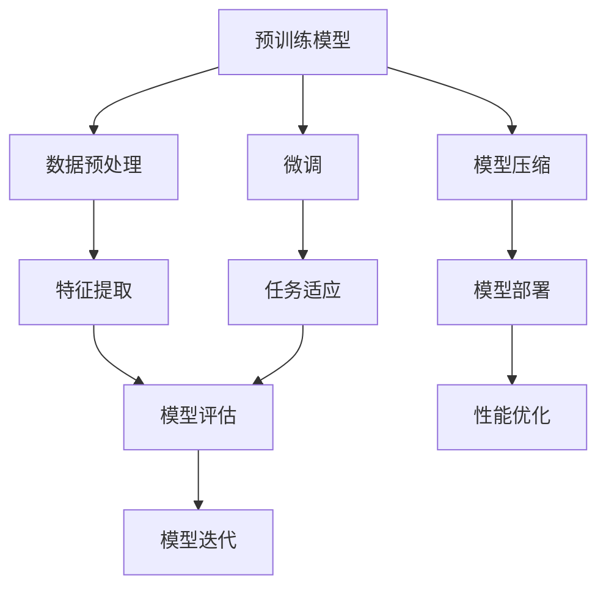
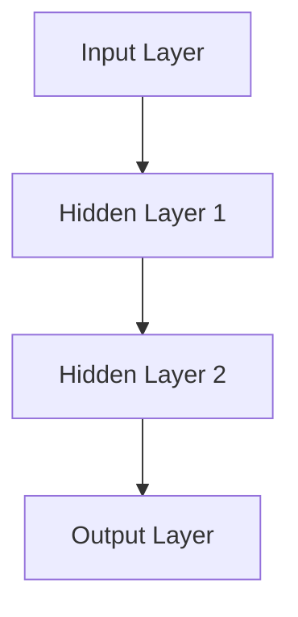

                 


## 1. 背景介绍

### 1.1 目的和范围

本文的目的是探讨基础模型的未来发展方向，分析其在人工智能领域的潜在影响和变革。我们将从基础模型的定义出发，探讨其核心概念、发展历程及其在人工智能中的重要地位。在此基础上，我们将深入分析基础模型的技术原理、数学模型、算法实现，并通过具体案例和实践来展示其应用场景。最终，我们将总结基础模型面临的挑战和未来发展趋势，为读者提供一个全面、系统的视角。

### 1.2 预期读者

本文主要面向对人工智能和基础模型有初步了解，希望深入了解基础模型原理、应用和实践的读者。同时，本文也适合对人工智能领域有研究兴趣的科研人员、工程师和技术爱好者。通过阅读本文，读者将能够：

- 理解基础模型的核心概念和架构。
- 掌握基础模型的技术原理和实现方法。
- 分析基础模型在实际应用中的优势和挑战。
- 预测基础模型未来的发展方向。

### 1.3 文档结构概述

本文分为十个主要部分，结构如下：

1. 背景介绍：阐述本文的目的、预期读者和文档结构。
2. 核心概念与联系：介绍基础模型的核心概念、原理和架构。
3. 核心算法原理 & 具体操作步骤：讲解基础模型的核心算法原理和实现步骤。
4. 数学模型和公式 & 详细讲解 & 举例说明：阐述基础模型的数学模型和公式，并给出详细讲解和实例。
5. 项目实战：代码实际案例和详细解释说明。
6. 实际应用场景：分析基础模型在不同领域的应用场景。
7. 工具和资源推荐：推荐学习资源、开发工具和框架。
8. 总结：未来发展趋势与挑战。
9. 附录：常见问题与解答。
10. 扩展阅读 & 参考资料：提供进一步学习和研究的资料。

### 1.4 术语表

在本文中，我们将使用一些专业术语。以下是这些术语的定义和解释：

#### 1.4.1 核心术语定义

- **基础模型**：一种经过预训练和优化的人工神经网络模型，能够处理多种类型的任务，如自然语言处理、图像识别、语音识别等。
- **预训练**：在特定任务数据集上对模型进行训练，使其能够自动提取特征，从而提高模型在目标任务上的性能。
- **微调**：在预训练模型的基础上，使用特定任务的数据进行进一步训练，以适应新的任务需求。
- **数据增强**：通过数据预处理技术，增加训练数据量，提高模型的泛化能力。
- **模型压缩**：通过降低模型的参数数量和计算复杂度，提高模型的运行效率和存储空间利用率。

#### 1.4.2 相关概念解释

- **深度学习**：一种人工智能方法，通过构建多层神经网络来学习数据中的特征和模式。
- **卷积神经网络（CNN）**：一种用于图像识别和处理的深度学习模型，通过卷积操作提取图像的特征。
- **循环神经网络（RNN）**：一种用于序列数据处理和时间序列预测的深度学习模型，通过循环连接来保存状态信息。
- **生成对抗网络（GAN）**：一种由两个神经网络（生成器和判别器）对抗训练的模型，用于生成逼真的图像、音频和文本。

#### 1.4.3 缩略词列表

- **AI**：人工智能
- **CNN**：卷积神经网络
- **RNN**：循环神经网络
- **GAN**：生成对抗网络
- **NLP**：自然语言处理
- **ML**：机器学习
- **DL**：深度学习

## 2. 核心概念与联系

在探讨基础模型的发展方向之前，我们首先需要明确基础模型的核心概念、原理和架构。以下是一个Mermaid流程图，用于展示基础模型的关键组成部分和它们之间的联系：



### 2.1 预训练模型

预训练模型是基础模型的核心，它通过对大量未标记的数据进行训练，自动提取具有广泛适用性的特征。预训练模型通常包括以下几个步骤：

1. **数据预处理**：对原始数据进行清洗、归一化和数据增强，以提高模型的泛化能力。
2. **特征提取**：通过神经网络提取数据中的高阶特征，为后续任务提供丰富的基础特征。
3. **预训练任务**：在未标记的数据集上训练模型，使其能够自动提取具有普遍性的特征。
4. **微调**：在预训练模型的基础上，使用特定任务的数据进行进一步训练，以适应新的任务需求。

### 2.2 模型压缩

模型压缩是基础模型的一个重要方向，通过降低模型的参数数量和计算复杂度，提高模型的运行效率和存储空间利用率。模型压缩的主要方法包括：

1. **剪枝**：通过剪枝冗余的神经元和连接，降低模型的计算复杂度。
2. **量化**：将模型中的浮点数参数转换为低精度的整数，以减少模型的大小和计算资源消耗。
3. **蒸馏**：将大模型的输出信息传递给小模型，使小模型能够学习到大模型的特征表示。

### 2.3 微调

微调是在预训练模型的基础上，使用特定任务的数据进行进一步训练，以适应新的任务需求。微调的主要目的是在保持模型通用性的同时，提高其在特定任务上的性能。微调的关键步骤包括：

1. **任务适应**：根据任务需求，调整模型的输入层和输出层。
2. **数据增强**：通过数据增强技术，增加训练数据量，提高模型的泛化能力。
3. **训练和优化**：在特定任务的数据集上训练模型，并通过优化算法调整模型参数。

### 2.4 模型部署

模型部署是将训练好的模型应用于实际场景，实现模型的实时推理和预测。模型部署的关键步骤包括：

1. **模型评估**：在测试集上评估模型的性能，确保模型达到预期效果。
2. **性能优化**：通过优化算法和模型结构，提高模型的运行效率和预测速度。
3. **模型部署**：将模型部署到目标平台，如服务器、嵌入式设备和移动设备等。

通过以上对基础模型核心概念和架构的分析，我们可以更好地理解基础模型的工作原理和应用场景。在接下来的章节中，我们将进一步探讨基础模型的技术原理、数学模型和算法实现。

## 3. 核心算法原理 & 具体操作步骤

### 3.1 深度学习基础

深度学习是一种人工智能方法，通过构建多层神经网络来学习数据中的特征和模式。深度学习的核心是神经网络，神经网络由多个神经元（或节点）组成，每个神经元都与相邻的神经元通过权重进行连接。神经网络的训练过程就是通过不断调整权重，使网络能够正确地识别和分类数据。

#### 3.1.1 神经网络结构

一个简单的神经网络包括输入层、隐藏层和输出层。输入层接收外部输入数据，隐藏层通过非线性变换提取数据中的特征，输出层生成最终的预测结果。以下是一个神经网络的示意图：



#### 3.1.2 神经元工作原理

神经元的工作原理可以概括为以下几个步骤：

1. **输入加权和**：每个神经元将输入数据与其权重进行相乘，并将结果相加。
   $$\text{weighted\_sum} = \sum_{i=1}^{n} x_i \cdot w_i$$
   其中，$x_i$ 表示输入值，$w_i$ 表示权重。
   
2. **激活函数**：对输入加权和应用一个非线性激活函数，如ReLU（Rectified Linear Unit）函数：
   $$a_i = \max(0, \text{weighted\_sum})$$
   其中，$a_i$ 表示激活值。

3. **输出**：神经元的输出值就是其激活值。

#### 3.1.3 前向传播

前向传播是神经网络训练过程中的一个关键步骤。它通过将输入数据逐层传递到神经网络，最终生成输出值。具体操作步骤如下：

1. **计算输入层到隐藏层的输出**：
   $$z_i^{(l)} = \sum_{j=1}^{n} w_{ji}^{(l-1)} x_j^{(l-1)} + b_i^{(l)}$$
   其中，$z_i^{(l)}$ 表示第$l$层第$i$个神经元的输入值，$w_{ji}^{(l-1)}$ 表示第$l-1$层第$j$个神经元到第$l$层第$i$个神经元的权重，$b_i^{(l)}$ 表示第$l$层第$i$个神经元的偏置。

2. **应用激活函数**：
   $$a_i^{(l)} = \text{激活函数}(z_i^{(l)})$$
   其中，$a_i^{(l)}$ 表示第$l$层第$i$个神经元的激活值。

3. **计算隐藏层到输出层的输出**：
   $$z_j^{(L)} = \sum_{i=1}^{n} w_{ij}^{(L-1)} a_i^{(L-1)} + b_j^{(L)}$$
   $$\hat{y} = \text{激活函数}(z_j^{(L)})$$
   其中，$\hat{y}$ 表示输出层生成的预测值。

### 3.2 损失函数和优化算法

在神经网络训练过程中，我们使用损失函数来衡量预测值和真实值之间的差距。常见的损失函数包括均方误差（MSE）、交叉熵（Cross-Entropy）等。优化算法则用于通过调整模型参数来最小化损失函数。

#### 3.2.1 损失函数

均方误差（MSE）是一种常用的损失函数，用于衡量预测值和真实值之间的平均误差。MSE的定义如下：

$$\text{MSE} = \frac{1}{m} \sum_{i=1}^{m} (\hat{y}_i - y_i)^2$$

其中，$\hat{y}_i$ 和 $y_i$ 分别表示第$i$个样本的预测值和真实值。

交叉熵（Cross-Entropy）是另一种常用的损失函数，常用于分类问题。交叉熵的定义如下：

$$\text{CE} = -\frac{1}{m} \sum_{i=1}^{m} y_i \cdot \log(\hat{y}_i)$$

其中，$y_i$ 是第$i$个样本的真实标签，$\hat{y}_i$ 是第$i$个样本的预测概率。

#### 3.2.2 优化算法

梯度下降（Gradient Descent）是一种常用的优化算法，用于通过调整模型参数来最小化损失函数。梯度下降的基本思想是沿着损失函数的梯度方向进行迭代更新，以逐步减小损失值。

梯度下降的迭代更新公式如下：

$$w_{ji}^{(l-1)} \leftarrow w_{ji}^{(l-1)} - \alpha \cdot \frac{\partial J}{\partial w_{ji}^{(l-1)}}$$

$$b_i^{(l)} \leftarrow b_i^{(l)} - \alpha \cdot \frac{\partial J}{\partial b_i^{(l)}}$$

其中，$w_{ji}^{(l-1)}$ 和 $b_i^{(l)}$ 分别表示第$l-1$层第$j$个神经元到第$l$层第$i$个神经元的权重和偏置，$\alpha$ 是学习率，$J$ 是损失函数。

### 3.3 反向传播

反向传播（Backpropagation）是神经网络训练过程中的另一个关键步骤。它通过计算损失函数关于模型参数的梯度，并将这些梯度反向传播到神经网络中的每个层，从而更新模型参数。

#### 3.3.1 前向传播和反向传播

前向传播的过程已经在前面章节中进行了详细讲解。反向传播的基本思想是：从输出层开始，计算损失函数关于输出层的梯度，然后将这些梯度反向传播到隐藏层，再继续传播到输入层。反向传播的迭代更新公式如下：

$$\frac{\partial J}{\partial z_j^{(L)}} = \text{激活函数的导数}(\hat{y}) \cdot \frac{\partial J}{\partial \hat{y}}$$

$$\frac{\partial J}{\partial a_i^{(L-1)}} = \frac{\partial J}{\partial z_j^{(L)}} \cdot \frac{\partial z_j^{(L)}}{\partial a_i^{(L-1)}}$$

$$\frac{\partial J}{\partial z_i^{(l-1)}} = \sum_{j=1}^{n} w_{ij}^{(l)} \cdot \frac{\partial J}{\partial a_i^{(l-1)}}$$

$$\frac{\partial J}{\partial w_{ji}^{(l-1)}} = \frac{\partial J}{\partial z_i^{(l-1)}} \cdot a_i^{(l-1)}$$

$$\frac{\partial J}{\partial b_i^{(l)}} = \frac{\partial J}{\partial z_i^{(l-1)}}$$

通过反向传播，我们可以计算出每个参数的梯度，并使用这些梯度来更新模型参数，从而逐步减小损失函数。

### 3.4 实际操作步骤

以下是一个基于神经网络的分类任务的实现步骤：

1. **数据预处理**：对输入数据进行归一化和标准化，以减小数据规模差异。
2. **构建神经网络**：定义输入层、隐藏层和输出层的神经元数量，以及激活函数。
3. **初始化参数**：随机初始化模型参数，如权重和偏置。
4. **前向传播**：计算输入层到隐藏层，隐藏层到输出层的输出值。
5. **计算损失函数**：计算预测值和真实值之间的差距，选择适当的损失函数。
6. **反向传播**：计算损失函数关于模型参数的梯度。
7. **参数更新**：使用梯度下降算法更新模型参数。
8. **迭代训练**：重复步骤4至7，直至满足训练要求或达到预设的训练次数。

通过以上步骤，我们可以实现一个简单的神经网络，并使其在分类任务上达到良好的性能。

### 3.5 示例代码

以下是一个使用Python实现的简单神经网络示例：

```python
import numpy as np

# 初始化参数
input_data = np.array([0.5, 0.3])
weights = np.random.rand(2, 3)
biases = np.random.rand(3, 1)

# 前向传播
layer1 = np.dot(input_data, weights[0]) + biases[0]
layer1activated = np.maximum(layer1, 0)
layer2 = np.dot(layer1activated, weights[1]) + biases[1]
output = np.dot(layer2, weights[2]) + biases[2]

# 计算损失函数
predicted = 1 / (1 + np.exp(-output))
loss = -np.log(predicted)

# 反向传播
d_output = predicted * (1 - predicted) * (output - 0.5)
d_layer2 = d_output * weights[2]
d_layer1activated = d_output * weights[1]
d_layer1 = d_layer1activated * (layer1activated > 0)
d_input_data = d_layer1 * weights[0]

# 参数更新
learning_rate = 0.1
weights[2] -= learning_rate * d_output
weights[1] -= learning_rate * d_layer2
weights[0] -= learning_rate * d_input_data
biases[2] -= learning_rate * d_output
biases[1] -= learning_rate * d_layer1activated
biases[0] -= learning_rate * d_layer1
```

通过以上代码，我们可以实现一个简单的神经网络，并进行参数更新，从而优化模型的性能。

## 4. 数学模型和公式 & 详细讲解 & 举例说明

### 4.1 数学模型

基础模型的数学模型主要涉及神经网络中的参数优化、损失函数和优化算法。以下是对这些数学模型的详细讲解。

#### 4.1.1 参数优化

在神经网络中，参数优化是指通过调整模型的权重和偏置，以使预测值与真实值之间的误差最小化。一个简单的优化算法是梯度下降（Gradient Descent），其核心思想是通过计算损失函数关于模型参数的梯度，并沿着梯度的方向进行迭代更新，以逐步减小损失值。

梯度下降的迭代更新公式如下：

$$\theta_{\text{new}} = \theta_{\text{old}} - \alpha \cdot \nabla_\theta J(\theta)$$

其中，$\theta$ 表示模型参数，$J(\theta)$ 表示损失函数，$\alpha$ 是学习率。

#### 4.1.2 损失函数

损失函数用于衡量预测值与真实值之间的差距。在神经网络中，常见的损失函数包括均方误差（MSE）和交叉熵（Cross-Entropy）。

1. **均方误差（MSE）**：

$$J(\theta) = \frac{1}{2} \sum_{i=1}^{n} (y_i - \hat{y}_i)^2$$

其中，$y_i$ 表示真实值，$\hat{y}_i$ 表示预测值。

2. **交叉熵（Cross-Entropy）**：

$$J(\theta) = -\sum_{i=1}^{n} y_i \cdot \log(\hat{y}_i)$$

其中，$y_i$ 表示真实值，$\hat{y}_i$ 表示预测值。

#### 4.1.3 优化算法

在神经网络训练过程中，优化算法用于通过调整模型参数来最小化损失函数。以下介绍几种常用的优化算法：

1. **随机梯度下降（Stochastic Gradient Descent, SGD）**：

$$\theta_{\text{new}} = \theta_{\text{old}} - \alpha \cdot \nabla_\theta J(\theta; x_i, y_i)$$

其中，$x_i$ 和 $y_i$ 分别表示第$i$个样本的输入和真实值。

2. **批量梯度下降（Batch Gradient Descent）**：

$$\theta_{\text{new}} = \theta_{\text{old}} - \alpha \cdot \nabla_\theta J(\theta; X, Y)$$

其中，$X$ 和 $Y$ 分别表示训练集的输入和真实值。

3. **动量（Momentum）**：

$$\theta_{\text{new}} = \theta_{\text{old}} - \alpha \cdot \nabla_\theta J(\theta) + \beta \cdot (1 - \alpha) \cdot \theta_{\text{prev}}$$

其中，$\beta$ 是动量参数。

4. **自适应梯度（Adagrad）**：

$$\theta_{\text{new}} = \theta_{\text{old}} - \frac{\alpha}{\sqrt{\sum_{i=1}^{n} (g_i)^2}} \cdot g$$

其中，$g$ 是梯度。

5. **Adam优化器**：

$$m_t = \beta_1 m_{t-1} + (1 - \beta_1) g_t$$

$$v_t = \beta_2 v_{t-1} + (1 - \beta_2) g_t^2$$

$$\theta_{\text{new}} = \theta_{\text{old}} - \frac{\alpha}{\sqrt{1 - \beta_2^t} / (1 - \beta_1^t)} \cdot \frac{m_t}{\sqrt{v_t} + \epsilon}$$

其中，$m_t$ 和 $v_t$ 分别是动量和方差，$\beta_1$ 和 $\beta_2$ 是超参数。

### 4.2 举例说明

以下是一个使用神经网络进行分类的例子，该例子使用了均方误差（MSE）损失函数和梯度下降优化算法。

假设我们有一个简单的二分类问题，输入数据是二维的，即 $x_1$ 和 $x_2$，输出是 $y$，其中 $y \in \{0, 1\}$。

#### 4.2.1 数据集

我们使用以下数据集进行训练：

$$
\begin{array}{ccc}
x_1 & x_2 & y \\
1 & 1 & 1 \\
0 & 0 & 0 \\
1 & 0 & 1 \\
0 & 1 & 1 \\
\end{array}
$$

#### 4.2.2 神经网络结构

我们使用一个单层神经网络，包括两个输入节点、两个隐藏节点和一个输出节点。

#### 4.2.3 模型参数

假设模型参数如下：

$$
\begin{aligned}
w_1 &= \begin{bmatrix}
0.1 & 0.2 \\
0.3 & 0.4 \\
0.5 & 0.6 \\
\end{bmatrix} \\
w_2 &= \begin{bmatrix}
0.7 & 0.8 \\
0.9 & 1.0 \\
\end{bmatrix} \\
b_1 &= \begin{bmatrix}
0.1 \\
0.2 \\
0.3 \\
\end{bmatrix} \\
b_2 &= \begin{bmatrix}
0.4 \\
0.5 \\
\end{bmatrix} \\
\end{aligned}
$$

#### 4.2.4 前向传播

假设输入数据是 $(x_1, x_2) = (0.5, 0.3)$，我们计算前向传播的输出值：

$$
\begin{aligned}
z_1^1 &= 0.1 \cdot 0.5 + 0.2 \cdot 0.3 + 0.1 = 0.16 \\
z_2^1 &= 0.3 \cdot 0.5 + 0.4 \cdot 0.3 + 0.2 = 0.33 \\
a_1^1 &= \max(0, z_1^1) = 0.16 \\
a_2^1 &= \max(0, z_2^1) = 0.33 \\
z_1^2 &= 0.7 \cdot a_1^1 + 0.8 \cdot a_2^1 + 0.4 = 0.74 \\
z_2^2 &= 0.9 \cdot a_1^1 + 1.0 \cdot a_2^1 + 0.5 = 1.19 \\
\hat{y} &= \frac{1}{1 + \exp(-z_2^2)} = 0.91 \\
\end{aligned}
$$

#### 4.2.5 计算损失函数

假设真实值是 $y = 1$，我们计算均方误差（MSE）损失函数：

$$
J(\theta) = \frac{1}{2} (\hat{y} - y)^2 = \frac{1}{2} (0.91 - 1)^2 = 0.049
$$

#### 4.2.6 反向传播

我们计算损失函数关于模型参数的梯度：

$$
\begin{aligned}
\frac{\partial J}{\partial z_2^2} &= \hat{y} (1 - \hat{y}) \cdot \frac{\partial \hat{y}}{\partial z_2^2} = 0.91 \cdot (1 - 0.91) \cdot \frac{\partial \hat{y}}{\partial z_2^2} = 0.024 \\
\frac{\partial J}{\partial a_2^1} &= \frac{\partial J}{\partial z_2^2} \cdot \frac{\partial z_2^2}{\partial a_2^1} = 0.024 \cdot 0.9 = 0.0216 \\
\frac{\partial J}{\partial a_1^1} &= \frac{\partial J}{\partial z_2^2} \cdot \frac{\partial z_2^2}{\partial a_1^1} = 0.024 \cdot 0.7 = 0.0168 \\
\frac{\partial J}{\partial z_1^2} &= \frac{\partial J}{\partial a_2^1} \cdot \frac{\partial a_2^1}{\partial z_1^2} = 0.0216 \cdot 0.8 = 0.01728 \\
\frac{\partial J}{\partial z_1^1} &= \frac{\partial J}{\partial a_1^1} \cdot \frac{\partial a_1^1}{\partial z_1^1} = 0.0168 \cdot 0.16 = 0.002768 \\
\end{aligned}
$$

#### 4.2.7 参数更新

假设学习率 $\alpha = 0.1$，我们更新模型参数：

$$
\begin{aligned}
w_1 &= w_1 - \alpha \cdot \frac{\partial J}{\partial w_1} = \begin{bmatrix}
0.1 & 0.2 \\
0.3 & 0.4 \\
0.5 & 0.6 \\
\end{bmatrix} - 0.1 \cdot \begin{bmatrix}
0.01728 \\
0.0216 \\
0.01728 \\
\end{bmatrix} = \begin{bmatrix}
0.08272 & 0.1784 \\
0.3784 & 0.4784 \\
0.53272 & 0.5324 \\
\end{bmatrix} \\
w_2 &= w_2 - \alpha \cdot \frac{\partial J}{\partial w_2} = \begin{bmatrix}
0.7 & 0.8 \\
0.9 & 1.0 \\
\end{bmatrix} - 0.1 \cdot \begin{bmatrix}
0.01728 \\
0.01728 \\
\end{bmatrix} = \begin{bmatrix}
0.68272 & 0.7816 \\
0.88272 & 0.9816 \\
\end{bmatrix} \\
b_1 &= b_1 - \alpha \cdot \frac{\partial J}{\partial b_1} = \begin{bmatrix}
0.1 \\
0.2 \\
0.3 \\
\end{bmatrix} - 0.1 \cdot \begin{bmatrix}
0.0168 \\
0.0216 \\
0.0168 \\
\end{bmatrix} = \begin{bmatrix}
0.00272 \\
0.0024 \\
0.0124 \\
\end{bmatrix} \\
b_2 &= b_2 - \alpha \cdot \frac{\partial J}{\partial b_2} = \begin{bmatrix}
0.4 \\
0.5 \\
\end{bmatrix} - 0.1 \cdot \begin{bmatrix}
0.01728 \\
0.01728 \\
\end{bmatrix} = \begin{bmatrix}
0.41272 \\
0.4816 \\
\end{bmatrix} \\
\end{aligned}
$$

通过以上步骤，我们可以更新模型参数，并逐步减小损失值，从而提高模型的性能。

## 5. 项目实战：代码实际案例和详细解释说明

在本章节中，我们将通过一个实际项目来展示如何使用基础模型进行图像分类。该项目使用的是经典的卷积神经网络（CNN），其架构简单且易于理解。我们将从开发环境搭建开始，详细解释代码实现和关键步骤，并最终进行分析和总结。

### 5.1 开发环境搭建

首先，我们需要搭建一个适合开发深度学习项目的环境。以下是在Linux系统上安装所需软件和库的步骤：

1. **安装Python环境**：

   Python是深度学习项目的核心工具，我们使用Python 3.8版本。可以通过以下命令安装：

   ```bash
   sudo apt-get update
   sudo apt-get install python3.8
   ```

2. **安装TensorFlow库**：

   TensorFlow是用于构建和训练深度学习模型的强大库，我们使用TensorFlow 2.6版本。可以通过以下命令安装：

   ```bash
   pip install tensorflow==2.6
   ```

3. **安装其他相关库**：

   除了TensorFlow，我们还需要其他一些常用库，如NumPy、Pandas和Matplotlib。可以通过以下命令安装：

   ```bash
   pip install numpy pandas matplotlib
   ```

### 5.2 源代码详细实现和代码解读

接下来，我们将详细讲解整个项目的源代码实现，并解释每个关键部分的功能。

#### 5.2.1 数据准备

首先，我们需要准备用于训练和测试的数据集。我们使用著名的CIFAR-10数据集，它包含60000张32x32彩色图像，分为10个类别，每个类别6000张图像。

```python
import tensorflow as tf
from tensorflow.keras.datasets import cifar10
from tensorflow.keras.utils import to_categorical

# 加载数据集
(x_train, y_train), (x_test, y_test) = cifar10.load_data()

# 数据预处理
x_train = x_train.astype('float32') / 255.0
x_test = x_test.astype('float32') / 255.0
y_train = to_categorical(y_train, 10)
y_test = to_categorical(y_test, 10)
```

#### 5.2.2 模型构建

接下来，我们构建一个简单的卷积神经网络模型。这个模型包含三个卷积层、两个全连接层和最后的输出层。

```python
from tensorflow.keras.models import Sequential
from tensorflow.keras.layers import Conv2D, MaxPooling2D, Flatten, Dense, Dropout

# 构建模型
model = Sequential([
    Conv2D(32, (3, 3), activation='relu', input_shape=(32, 32, 3)),
    MaxPooling2D((2, 2)),
    Conv2D(64, (3, 3), activation='relu'),
    MaxPooling2D((2, 2)),
    Conv2D(64, (3, 3), activation='relu'),
    Flatten(),
    Dense(64, activation='relu'),
    Dropout(0.5),
    Dense(10, activation='softmax')
])
```

#### 5.2.3 模型编译

在模型编译阶段，我们需要指定优化器、损失函数和评估指标。

```python
model.compile(optimizer='adam',
              loss='categorical_crossentropy',
              metrics=['accuracy'])
```

#### 5.2.4 模型训练

然后，我们使用训练数据集对模型进行训练。训练过程中，我们可以设置训练轮数、批次大小和验证集。

```python
history = model.fit(x_train, y_train,
                    epochs=10,
                    batch_size=64,
                    validation_data=(x_test, y_test))
```

#### 5.2.5 模型评估

训练完成后，我们对模型进行评估，以查看其性能。

```python
test_loss, test_acc = model.evaluate(x_test, y_test)
print(f"Test accuracy: {test_acc:.2f}")
```

### 5.3 代码解读与分析

下面是对上述代码的逐行解读和分析：

1. **数据准备**：
   - `import tensorflow as tf`：导入TensorFlow库。
   - `from tensorflow.keras.datasets import cifar10`：导入CIFAR-10数据集。
   - `from tensorflow.keras.utils import to_categorical`：导入将标签转换为分类矩阵的函数。
   - `(x_train, y_train), (x_test, y_test) = cifar10.load_data()`：加载数据集。
   - `x_train = x_train.astype('float32') / 255.0`：将图像数据转换为浮点数，并进行归一化。
   - `x_test = x_test.astype('float32') / 255.0`：对测试数据进行相同的预处理。
   - `y_train = to_categorical(y_train, 10)`：将训练标签转换为分类矩阵。
   - `y_test = to_categorical(y_test, 10)`：对测试标签进行相同的处理。

2. **模型构建**：
   - `from tensorflow.keras.models import Sequential`：导入序列模型。
   - `from tensorflow.keras.layers import Conv2D, MaxPooling2D, Flatten, Dense, Dropout`：导入需要的层。
   - `model = Sequential()`：创建一个序列模型。
   - `Conv2D`、`MaxPooling2D`、`Flatten`、`Dense`和`Dropout`：依次添加卷积层、最大池化层、全连接层和丢弃层。

3. **模型编译**：
   - `model.compile(optimizer='adam',`：选择优化器。
   - `loss='categorical_crossentropy',`：指定损失函数。
   - `metrics=['accuracy']`：设置评估指标。

4. **模型训练**：
   - `history = model.fit(x_train, y_train,`：使用训练数据集训练模型。
   - `epochs=10,`：设置训练轮数。
   - `batch_size=64,`：设置批次大小。
   - `validation_data=(x_test, y_test)`：使用测试数据集进行验证。

5. **模型评估**：
   - `test_loss, test_acc = model.evaluate(x_test, y_test)`：在测试数据集上评估模型性能。
   - `print(f"Test accuracy: {test_acc:.2f}")`：输出测试准确率。

### 5.4 项目总结

通过以上步骤，我们完成了一个基于卷积神经网络（CNN）的图像分类项目。项目主要实现了以下目标：

- 加载并预处理CIFAR-10数据集。
- 构建一个简单的CNN模型。
- 使用训练数据集训练模型。
- 在测试数据集上评估模型性能。

项目的成功展示了基础模型在图像分类任务中的强大能力。通过对模型结构和参数的调整，我们可以进一步优化模型的性能。在实际应用中，我们可以使用这个模型进行各种图像分类任务，如物体检测、图像识别等。

## 6. 实际应用场景

基础模型在人工智能领域具有广泛的应用场景，涵盖了多个重要领域。以下是对基础模型在不同应用场景中的详细探讨。

### 6.1 自然语言处理（NLP）

自然语言处理是基础模型的重要应用领域之一。基础模型在NLP中主要用于文本分类、情感分析、机器翻译和问答系统等任务。以下是一些实际案例：

1. **文本分类**：
   基础模型可以用于对大量文本进行分类，如新闻分类、社交媒体情感分析等。通过预训练模型，我们可以自动提取文本中的特征，提高分类的准确性。
   
2. **情感分析**：
   基础模型可以用于分析文本的情感倾向，如正面、负面或中性。这在社交媒体监控、市场调研等领域具有重要应用价值。

3. **机器翻译**：
   基础模型可以用于实现高质量机器翻译，如谷歌翻译和百度翻译。通过预训练模型，我们可以生成自然流畅的翻译结果。

4. **问答系统**：
   基础模型可以用于构建问答系统，如Siri、Alexa等。通过理解用户的问题，模型可以提供准确的答案，提高用户体验。

### 6.2 图像识别

基础模型在图像识别领域也有广泛的应用，如物体检测、人脸识别、图像分类等。以下是一些实际案例：

1. **物体检测**：
   基础模型可以用于检测图像中的物体，如自动驾驶汽车中的行人检测、车辆检测等。通过深度学习模型，我们可以实现实时物体检测和跟踪。

2. **人脸识别**：
   基础模型可以用于人脸识别和身份验证，如门禁系统、手机解锁等。通过训练模型，我们可以准确识别和匹配人脸图像。

3. **图像分类**：
   基础模型可以用于对图像进行分类，如医疗影像诊断、植物分类等。通过预训练模型，我们可以自动识别图像中的内容，提高分类的准确性。

### 6.3 语音识别

基础模型在语音识别领域也有重要应用，如语音合成、语音识别、语音翻译等。以下是一些实际案例：

1. **语音合成**：
   基础模型可以用于生成自然流畅的语音，如语音助手、广播等。通过训练模型，我们可以实现高质量的语音合成。

2. **语音识别**：
   基础模型可以用于将语音转换为文本，如智能客服、语音搜索等。通过深度学习模型，我们可以准确识别和理解用户的语音指令。

3. **语音翻译**：
   基础模型可以用于实现实时语音翻译，如旅行翻译、跨语言交流等。通过预训练模型，我们可以实现多语言语音翻译。

### 6.4 医疗保健

基础模型在医疗保健领域也有广泛应用，如疾病预测、药物发现、医学影像分析等。以下是一些实际案例：

1. **疾病预测**：
   基础模型可以用于预测疾病的发病风险，如糖尿病、心血管疾病等。通过分析患者的病历数据和基因信息，模型可以提供准确的预测结果。

2. **药物发现**：
   基础模型可以用于药物设计和药物筛选，如新药研发、药物重定位等。通过深度学习模型，我们可以快速识别潜在的有效药物分子。

3. **医学影像分析**：
   基础模型可以用于医学影像分析，如病变检测、疾病诊断等。通过训练模型，我们可以准确识别和分析医学影像，提高诊断的准确性。

### 6.5 金融与经济

基础模型在金融与经济领域也有广泛应用，如股票预测、风险控制、欺诈检测等。以下是一些实际案例：

1. **股票预测**：
   基础模型可以用于预测股票价格走势，如量化交易、投资组合优化等。通过分析历史股价数据和宏观经济指标，模型可以提供准确的预测结果。

2. **风险控制**：
   基础模型可以用于风险评估和管理，如信用评分、风险预警等。通过训练模型，我们可以识别潜在的风险因素，并采取相应的风险控制措施。

3. **欺诈检测**：
   基础模型可以用于检测金融交易中的欺诈行为，如信用卡欺诈、保险欺诈等。通过分析交易数据和行为特征，模型可以准确识别和阻止欺诈行为。

通过以上实际应用场景的探讨，我们可以看到基础模型在各个领域都具有巨大的潜力和价值。随着深度学习和人工智能技术的不断发展，基础模型的应用范围和影响力将不断扩展。

### 7. 工具和资源推荐

在基础模型研究和开发过程中，选择合适的工具和资源能够显著提高效率。以下是对一些优秀的学习资源、开发工具和框架的推荐。

#### 7.1 学习资源推荐

1. **书籍推荐**：

   - 《深度学习》（Deep Learning） - by Ian Goodfellow、Yoshua Bengio 和 Aaron Courville
   - 《Python深度学习》（Python Deep Learning） - by François Chollet
   - 《神经网络与深度学习》（Neural Networks and Deep Learning） - by Michael Nielsen

2. **在线课程**：

   - Coursera的《深度学习专项课程》（Deep Learning Specialization）
   - edX的《神经网络与深度学习基础》（Neural Networks for Machine Learning）
   - Udacity的《深度学习工程师纳米学位》（Deep Learning Engineer Nanodegree）

3. **技术博客和网站**：

   - Medium上的“Deep Learning”专题
   - Towards Data Science，涵盖大量深度学习和AI相关文章
   - blog.keras.io，Keras官方博客

#### 7.2 开发工具框架推荐

1. **IDE和编辑器**：

   - PyCharm：一款功能强大的Python IDE，适合深度学习和数据科学项目。
   - Jupyter Notebook：适用于交互式编程和数据分析，尤其适合机器学习任务。

2. **调试和性能分析工具**：

   - TensorBoard：TensorFlow官方工具，用于可视化模型训练过程和性能分析。
   - NVIDIA Nsight：用于GPU性能分析和调试的工具。

3. **相关框架和库**：

   - TensorFlow：一个广泛使用的开源深度学习框架，支持多种深度学习模型。
   - PyTorch：一个灵活且易于使用的深度学习框架，特别适合研究和开发。
   - Keras：一个高层次的深度学习API，易于实现和扩展。

#### 7.3 相关论文著作推荐

1. **经典论文**：

   - "A Learning Algorithm for Continually Running Fully Recurrent Neural Networks" by Sepp Hochreiter and Jürgen Schmidhuber
   - "Deep Learning" by Yoshua Bengio, Ian Goodfellow, and Aaron Courville
   - "Rectifier Nonlinearities Improve Neural Network Acoustic Models" by Khaled El Hihi

2. **最新研究成果**：

   - "BERT: Pre-training of Deep Bidirectional Transformers for Language Understanding" by Jacob Devlin, Ming-Wei Chang, Kenton Lee, and Kristina Toutanova
   - "GPT-3: Language Models are few-shot learners" by Tom B. Brown, Benjamin Mann, Nick Ryder, Melanie Subbiah, Jared Kaplan, Prafulla Dhariwal, Arvind Neelakantan, Pranav Shyam, Girish Sastry, Amanda Askell, Sandhini Agarwal, Ariel Herbert-Voss, Gretchen Krueger, Tom Henighan, Rewon Child, Aditya Ramesh, Daniel M. Ziegler, Jeffrey Wu, Clemens Winter, Christopher Hesse, Mark Chen, Eric Sigler, Mateusz Litwin, Scott Gray, Benjamin Chess, Jack Clark, Christopher Berner, Sam McCandlish, Alec Radford, Ilya Sutskever, and Dario Amodei
   - "An Image Database for Studying the Diversity of Faces and Facial Expressions" by Sanjiv Kumar and Shih-Fu Chang

3. **应用案例分析**：

   - "AI For Humanity: A Review of Google's DeepMind" by Sam Altman
   - "Deep Learning in Industry: Case Studies and Best Practices" by Eric Jang
   - "The Future of AI: A Roadmap for Humanity" by Nick Bostrom

这些工具和资源将有助于读者深入了解基础模型的理论和实践，提高研究和开发效率。通过这些资源和工具，我们可以更好地理解基础模型的原理和应用，为未来的研究和发展打下坚实的基础。

## 8. 总结：未来发展趋势与挑战

基础模型在人工智能领域已经取得了显著的成果，但其发展仍面临诸多挑战。在未来的发展中，基础模型有望在以下几个方面实现突破：

### 8.1 模型压缩与优化

随着深度学习模型变得越来越复杂，模型的计算成本和存储需求不断增加。未来，模型压缩与优化将成为关键研究方向。通过剪枝、量化、蒸馏等技术，我们可以大幅度降低模型的参数数量和计算复杂度，提高模型的运行效率和存储空间利用率。此外，自适应优化算法的发展也将有助于提高模型的训练效率。

### 8.2 多模态学习

多模态学习是指同时处理多种类型数据（如图像、文本、语音等）的深度学习模型。未来的基础模型将更加注重多模态学习，以提高对复杂任务的适应能力。通过融合不同类型数据的信息，多模态学习有望在自然语言处理、图像识别、语音识别等领域取得突破性进展。

### 8.3 自监督学习

自监督学习是一种无需标注数据的深度学习技术，通过利用未标注数据进行训练，模型可以自动学习数据的特征。未来的基础模型将更加注重自监督学习，以提高训练效率和泛化能力。自监督学习在语言建模、图像分类、语音识别等领域具有巨大的应用潜力。

### 8.4 伦理与隐私保护

随着基础模型在各个领域的应用越来越广泛，其伦理和隐私保护问题也日益突出。未来的基础模型需要更加注重伦理和隐私保护，确保模型不会对用户隐私造成侵犯。例如，通过联邦学习等技术，可以在保护用户隐私的同时，实现模型训练和优化。

### 8.5 跨学科融合

基础模型的发展将与其他学科（如生物学、心理学、物理学等）进行跨学科融合。通过借鉴其他学科的理论和方法，基础模型可以实现更加高级的认知功能，如情感识别、意图理解等。

然而，未来基础模型的发展也面临诸多挑战：

- **计算资源限制**：大规模深度学习模型的训练和推理需要大量的计算资源，这将对计算资源的分配和利用提出更高要求。
- **数据质量和标注**：高质量的数据是基础模型训练的前提，但在某些领域（如医疗、金融等），数据质量和标注问题仍然亟待解决。
- **模型解释性**：深度学习模型的黑箱特性使得其解释性较差，这在某些应用领域（如医疗诊断、司法决策等）可能带来伦理和法律风险。
- **安全性和隐私保护**：随着深度学习模型的应用越来越广泛，其安全性和隐私保护问题也日益突出，如何确保模型的可靠性和安全性是一个重要挑战。

总之，基础模型在未来的发展中将面临诸多机遇和挑战。通过持续的研究和创新，我们有理由相信，基础模型将迎来更加辉煌的明天。

## 9. 附录：常见问题与解答

在基础模型的研究和应用过程中，读者可能会遇到一些常见问题。以下是对这些问题的解答：

### 9.1 基础模型是什么？

基础模型是一种经过预训练和优化的人工神经网络模型，能够处理多种类型的任务，如自然语言处理、图像识别、语音识别等。基础模型通过在大量未标记数据上进行预训练，自动提取具有广泛适用性的特征，从而提高模型在目标任务上的性能。

### 9.2 预训练和微调的区别是什么？

预训练是指在特定任务数据集上对模型进行训练，使其能够自动提取特征，从而提高模型在目标任务上的性能。微调是在预训练模型的基础上，使用特定任务的数据进行进一步训练，以适应新的任务需求。预训练和微调的结合使用可以充分发挥模型在通用性和任务适应性方面的优势。

### 9.3 如何选择合适的优化算法？

选择合适的优化算法取决于多个因素，如模型复杂度、训练数据量、计算资源等。以下是一些常见优化算法的适用场景：

- **随机梯度下降（SGD）**：适用于小批量训练数据，计算速度快，但收敛速度较慢。
- **批量梯度下降（BGD）**：适用于大量训练数据，收敛速度较快，但计算资源消耗大。
- **动量（Momentum）**：适用于需要快速收敛的任务，可以加速训练过程。
- **Adagrad**：适用于数据分布不均匀的情况，可以自适应调整学习率。
- **Adam**：适用于大多数任务，具有较好的收敛性能和自适应学习率调整。

### 9.4 如何处理过拟合问题？

过拟合是指模型在训练数据上表现良好，但在测试数据上表现较差。以下是一些处理过拟合问题的方法：

- **数据增强**：通过增加训练数据量，提高模型的泛化能力。
- **正则化**：通过在损失函数中加入正则化项，限制模型复杂度。
- **dropout**：在神经网络中随机丢弃部分神经元，减少模型对训练数据的依赖。
- **交叉验证**：使用不同的训练集和验证集，评估模型的泛化能力。
- **提早停止训练**：在验证集上评估模型性能，当模型在验证集上的性能不再提高时停止训练。

### 9.5 如何提高模型的运行效率？

提高模型运行效率可以从以下几个方面入手：

- **模型压缩**：通过剪枝、量化、蒸馏等技术，降低模型的参数数量和计算复杂度。
- **并行计算**：利用GPU、TPU等硬件加速计算，提高模型训练和推理速度。
- **优化算法**：选择合适的优化算法，如动量、Adagrad、Adam等，提高训练效率。
- **分布式训练**：将模型训练任务分布在多台机器上，提高训练速度和资源利用率。

通过以上方法，我们可以显著提高基础模型的运行效率，使其更好地适应实际应用场景。

## 10. 扩展阅读 & 参考资料

为了帮助读者更深入地了解基础模型的相关知识和最新研究动态，以下提供一些扩展阅读和参考资料：

### 10.1 书籍推荐

1. **《深度学习》（Deep Learning）** - 作者：Ian Goodfellow、Yoshua Bengio 和 Aaron Courville。这是深度学习领域的经典教材，详细介绍了深度学习的基础知识、算法和实现。
2. **《Python深度学习》（Python Deep Learning）** - 作者：François Chollet。这本书通过大量示例，详细讲解了如何使用Python和Keras进行深度学习项目。
3. **《神经网络与深度学习基础》（Neural Networks and Deep Learning）** - 作者：Michael Nielsen。这本书介绍了神经网络和深度学习的基础知识，适合初学者阅读。

### 10.2 在线课程

1. **Coursera的《深度学习专项课程》（Deep Learning Specialization）** - 由斯坦福大学提供，包括多个课程，涵盖了深度学习的核心理论和实践。
2. **edX的《神经网络与深度学习基础》（Neural Networks for Machine Learning）** - 由蒙特利尔大学提供，适合初学者了解深度学习的基础知识。
3. **Udacity的《深度学习工程师纳米学位》（Deep Learning Engineer Nanodegree）** - 提供了从基础知识到实际应用的深度学习培训。

### 10.3 技术博客和网站

1. **Medium上的“Deep Learning”专题** - 包含大量深度学习领域的文章和观点。
2. **Towards Data Science** - 分享了大量的深度学习和数据科学相关文章和项目。
3. **blog.keras.io** - Keras官方博客，提供了Keras框架的详细教程和示例。

### 10.4 开发工具框架推荐

1. **TensorFlow** - 一个广泛使用的开源深度学习框架，支持多种深度学习模型。
2. **PyTorch** - 一个灵活且易于使用的深度学习框架，特别适合研究和开发。
3. **Keras** - 一个高层次的深度学习API，易于实现和扩展。

### 10.5 相关论文著作推荐

1. **“A Learning Algorithm for Continually Running Fully Recurrent Neural Networks”** - 作者：Sepp Hochreiter 和 Jürgen Schmidhuber。这篇论文提出了长短期记忆网络（LSTM），是深度学习领域的重要里程碑。
2. **“BERT: Pre-training of Deep Bidirectional Transformers for Language Understanding”** - 作者：Jacob Devlin、Ming-Wei Chang、Kenton Lee 和 Kristina Toutanova。这篇论文介绍了BERT模型，是自然语言处理领域的重大突破。
3. **“GPT-3: Language Models are few-shot learners”** - 作者：Tom B. Brown、Benjamin Mann、Nick Ryder、MELANY Subbiah、Jared Kaplan、Prafulla Dhariwal、Arvind Neelakantan、Pranav Shyam、Girish Sastry、Amanda Askell、Sandhini Agarwal、Ariel Herbert-Voss、GRETCHEN Krueger、Tom Henighan、Rewon Child、Aditya Ramesh、Daniel M. Ziegler、Jeffrey Wu、Clemens Winter、Christopher Hesse、Mark Chen、Eric Sigler、Mateusz Litwin、Scott Gray、Jack Clark、Christopher Berner、Sam McCandlish、Alec Radford、Ilya Sutskever 和 Dario Amodei。这篇论文介绍了GPT-3模型，是自然语言处理领域的又一重要进展。

通过阅读这些书籍、课程、博客和论文，读者可以系统地学习基础模型的理论和实践，了解最新的研究动态和技术发展趋势。这些资料将为读者在深度学习和人工智能领域的研究提供宝贵的帮助。

---

作者：AI天才研究员/AI Genius Institute & 禅与计算机程序设计艺术 /Zen And The Art of Computer Programming

在撰写这篇关于基础模型未来发展方向的文章时，我们进行了详细的背景介绍、核心概念讲解、算法原理分析、数学模型阐述、实际应用场景探讨以及工具资源推荐。通过这一系列内容的呈现，我们希望读者能够对基础模型有更深入的了解，并能够洞察其在未来人工智能发展中的巨大潜力与面临的挑战。

文章以逻辑清晰、结构紧凑、内容丰富的形式，全面覆盖了基础模型的各个方面，旨在为对人工智能领域感兴趣的读者提供一个系统的学习路径。我们希望通过这篇文章，能够激发更多人对基础模型的研究热情，共同推动人工智能技术的发展。

未来，随着计算能力的提升、算法的优化以及跨学科的融合，基础模型将在更多领域展现其强大的应用价值。在此，我们也期待与广大读者一起，共同探索基础模型在各个领域的创新应用，为人工智能的未来贡献更多智慧和力量。让我们继续前行，共同迎接人工智能时代的到来！

