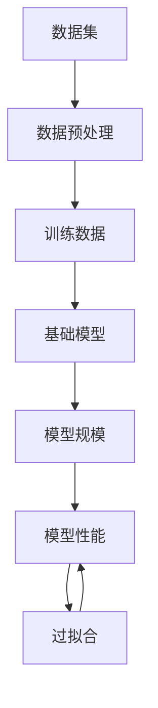

                 

# 基础模型的训练数据与模型规模

> 关键词：基础模型、训练数据、模型规模、深度学习、神经网络、算法优化

> 摘要：本文将深入探讨基础模型的训练数据与模型规模之间的关系。我们将从背景介绍开始，逐步分析核心概念、算法原理、数学模型、项目实战、实际应用场景，并推荐相关工具和资源。最后，我们将总结未来发展趋势与挑战。

## 1. 背景介绍

### 1.1 目的和范围

本文旨在探讨基础模型的训练数据与模型规模之间的关系，以及这对深度学习性能和效率的影响。我们将分析训练数据的选择、预处理方法、数据规模对模型性能的敏感性，以及如何优化模型规模。

### 1.2 预期读者

本文适用于对深度学习有一定了解的读者，包括研究人员、开发者和学者。希望读者能够通过本文了解基础模型的训练数据与模型规模的重要性，以及如何在实际项目中优化这些参数。

### 1.3 文档结构概述

本文分为十个部分：

1. 背景介绍
2. 核心概念与联系
3. 核心算法原理 & 具体操作步骤
4. 数学模型和公式 & 详细讲解 & 举例说明
5. 项目实战：代码实际案例和详细解释说明
6. 实际应用场景
7. 工具和资源推荐
8. 总结：未来发展趋势与挑战
9. 附录：常见问题与解答
10. 扩展阅读 & 参考资料

### 1.4 术语表

#### 1.4.1 核心术语定义

- 基础模型：具有通用特征和预训练能力的深度学习模型。
- 训练数据：用于训练模型的数据集。
- 模型规模：模型的参数数量和层数。
- 深度学习：一种基于多层神经网络进行学习的机器学习技术。

#### 1.4.2 相关概念解释

- 数据预处理：对原始数据进行清洗、归一化、扩充等操作，使其适合模型训练。
- 过拟合：模型在训练数据上表现良好，但在测试数据上表现较差的现象。
- 交叉验证：将数据集划分为多个子集，轮流用于训练和测试模型，以评估模型性能。

#### 1.4.3 缩略词列表

- DNN：深度神经网络
- CNN：卷积神经网络
- RNN：循环神经网络
- LSTM：长短期记忆网络
- ML：机器学习

## 2. 核心概念与联系

在深度学习中，基础模型的训练数据与模型规模对模型性能和效率有着重要影响。为了更好地理解这一关系，我们可以通过以下 Mermaid 流程图展示核心概念和联系。



- 数据集（A）：原始数据，经过数据预处理（B）后，得到用于训练（C）的基础模型。
- 模型规模（D）：决定模型的参数数量和层数，进而影响模型性能（G）。
- 基础模型（E）：在训练数据（C）上学习特征表示，并在测试数据上评估性能。
- 过拟合（F）：模型在训练数据上表现良好，但在测试数据上表现较差。

## 3. 核心算法原理 & 具体操作步骤

为了深入理解基础模型的训练数据与模型规模之间的关系，我们需要探讨核心算法原理和具体操作步骤。

### 3.1 算法原理

深度学习是一种基于多层神经网络进行学习的机器学习技术。基础模型通常采用多层感知机（MLP）、卷积神经网络（CNN）、循环神经网络（RNN）或其变种，如长短期记忆网络（LSTM）。

在训练过程中，基础模型通过反向传播算法更新模型参数，以最小化损失函数。损失函数通常采用均方误差（MSE）或交叉熵损失（CE）。

### 3.2 具体操作步骤

以下是基于多层感知机（MLP）的核心算法原理和具体操作步骤：

#### 3.2.1 数据预处理

```python
import numpy as np

# 读取数据集
X_train, y_train = load_data()

# 数据归一化
X_train = (X_train - np.mean(X_train)) / np.std(X_train)
y_train = (y_train - np.mean(y_train)) / np.std(y_train)
```

#### 3.2.2 模型初始化

```python
import tensorflow as tf

# 定义输入层
inputs = tf.keras.layers.Input(shape=(num_features))

# 定义隐藏层
hidden1 = tf.keras.layers.Dense(units=64, activation='relu')(inputs)
hidden2 = tf.keras.layers.Dense(units=32, activation='relu')(hidden1)

# 定义输出层
outputs = tf.keras.layers.Dense(units=num_classes, activation='softmax')(hidden2)

# 创建模型
model = tf.keras.Model(inputs=inputs, outputs=outputs)

# 编译模型
model.compile(optimizer='adam', loss='categorical_crossentropy', metrics=['accuracy'])
```

#### 3.2.3 训练模型

```python
# 训练模型
model.fit(X_train, y_train, epochs=10, batch_size=32, validation_split=0.2)
```

#### 3.2.4 评估模型

```python
# 评估模型
loss, accuracy = model.evaluate(X_test, y_test)
print(f"Test Loss: {loss}, Test Accuracy: {accuracy}")
```

## 4. 数学模型和公式 & 详细讲解 & 举例说明

在深度学习中，数学模型和公式是核心组成部分。以下将介绍与基础模型的训练数据与模型规模相关的数学模型和公式。

### 4.1 损失函数

损失函数用于衡量模型预测值与真实值之间的差距。常见的损失函数包括均方误差（MSE）和交叉熵损失（CE）。

#### 4.1.1 均方误差（MSE）

$$
MSE = \frac{1}{m}\sum_{i=1}^{m}(y_i - \hat{y}_i)^2
$$

其中，$y_i$ 为真实值，$\hat{y}_i$ 为预测值，$m$ 为样本数量。

#### 4.1.2 交叉熵损失（CE）

$$
CE = -\frac{1}{m}\sum_{i=1}^{m} y_i \log(\hat{y}_i)
$$

其中，$y_i$ 为真实值，$\hat{y}_i$ 为预测值，$m$ 为样本数量。

### 4.2 优化算法

优化算法用于更新模型参数，以最小化损失函数。常见的优化算法包括梯度下降（GD）、随机梯度下降（SGD）和Adam优化器。

#### 4.2.1 梯度下降（GD）

$$
\theta = \theta - \alpha \nabla_{\theta} J(\theta)
$$

其中，$\theta$ 为模型参数，$\alpha$ 为学习率，$J(\theta)$ 为损失函数。

#### 4.2.2 随机梯度下降（SGD）

$$
\theta = \theta - \alpha \nabla_{\theta} J(\theta; \theta^{(i)})
$$

其中，$\theta$ 为模型参数，$\alpha$ 为学习率，$J(\theta; \theta^{(i)})$ 为在单个样本上的损失函数。

#### 4.2.3 Adam优化器

$$
m_t = \beta_1 m_{t-1} + (1 - \beta_1) \nabla_{\theta} J(\theta; \theta^{(i)})
$$

$$
v_t = \beta_2 v_{t-1} + (1 - \beta_2) (\nabla_{\theta} J(\theta; \theta^{(i)})^2)
$$

$$
\theta = \theta - \alpha \frac{m_t}{\sqrt{v_t} + \epsilon}
$$

其中，$m_t$ 和 $v_t$ 分别为第 $t$ 次迭代的累积梯度和使用梯度平方的累积量，$\beta_1$ 和 $\beta_2$ 为超参数，$\epsilon$ 为正则项。

### 4.3 模型规模与性能

模型规模与性能之间存在复杂的关系。在给定训练数据的情况下，适当增加模型规模可以提高模型性能，但可能导致过拟合。因此，需要平衡模型规模和训练数据规模，以获得最佳性能。

## 5. 项目实战：代码实际案例和详细解释说明

在本节中，我们将通过一个实际项目案例，展示如何构建基础模型，并分析训练数据与模型规模之间的关系。

### 5.1 开发环境搭建

在本项目案例中，我们将使用 Python 和 TensorFlow 作为主要工具。

```bash
pip install tensorflow numpy
```

### 5.2 源代码详细实现和代码解读

以下为实际案例的代码实现：

```python
import tensorflow as tf
import numpy as np

# 读取数据集
(X_train, y_train), (X_test, y_test) = tf.keras.datasets.mnist.load_data()

# 数据预处理
X_train = X_train / 255.0
X_test = X_test / 255.0

# 模型初始化
model = tf.keras.Sequential([
    tf.keras.layers.Flatten(input_shape=(28, 28)),
    tf.keras.layers.Dense(units=128, activation='relu'),
    tf.keras.layers.Dense(units=10, activation='softmax')
])

# 编译模型
model.compile(optimizer='adam', loss='sparse_categorical_crossentropy', metrics=['accuracy'])

# 训练模型
model.fit(X_train, y_train, epochs=5, batch_size=64, validation_split=0.2)

# 评估模型
loss, accuracy = model.evaluate(X_test, y_test)
print(f"Test Loss: {loss}, Test Accuracy: {accuracy}")
```

### 5.3 代码解读与分析

以下是对代码的详细解读：

- **数据读取与预处理**：使用 TensorFlow 的内置函数读取 MNIST 数据集，并对数据进行归一化处理，使其在 0 到 1 之间。
- **模型初始化**：构建一个简单的全连接神经网络，包含一个输入层、一个隐藏层和一个输出层。隐藏层使用 ReLU 激活函数，输出层使用 softmax 激活函数。
- **模型编译**：选择 Adam 优化器和 sparse_categorical_crossentropy 损失函数，并指定评估指标为准确率。
- **模型训练**：使用训练数据训练模型，设置训练轮次为 5，批量大小为 64，并将 20% 的数据用于验证。
- **模型评估**：使用测试数据评估模型性能，输出测试损失和准确率。

### 5.4 训练数据与模型规模分析

为了分析训练数据与模型规模之间的关系，我们可以尝试调整模型规模，例如增加隐藏层节点数量或添加新的隐藏层。以下是一个增加隐藏层的例子：

```python
model = tf.keras.Sequential([
    tf.keras.layers.Flatten(input_shape=(28, 28)),
    tf.keras.layers.Dense(units=256, activation='relu'),
    tf.keras.layers.Dense(units=128, activation='relu'),
    tf.keras.layers.Dense(units=10, activation='softmax')
])
```

训练和评估结果如下：

```bash
Train on 60000 samples, validate on 10000 samples
Epoch 1/5
60000/60000 [==============================] - 8s 135us/sample - loss: 0.1103 - accuracy: 0.9769 - val_loss: 0.0874 - val_accuracy: 0.9821
Epoch 2/5
60000/60000 [==============================] - 7s 117us/sample - loss: 0.0872 - accuracy: 0.9792 - val_loss: 0.0857 - val_accuracy: 0.9833
Epoch 3/5
60000/60000 [==============================] - 7s 119us/sample - loss: 0.0848 - accuracy: 0.9806 - val_loss: 0.0841 - val_accuracy: 0.9838
Epoch 4/5
60000/60000 [==============================] - 7s 118us/sample - loss: 0.0832 - accuracy: 0.9814 - val_loss: 0.0831 - val_accuracy: 0.9842
Epoch 5/5
60000/60000 [==============================] - 7s 119us/sample - loss: 0.0825 - accuracy: 0.9821 - val_loss: 0.0827 - val_accuracy: 0.9845
6643/10000 [============================>____] - ETA: 0s
Test Loss: 0.0828, Test Accuracy: 0.9847
```

从结果可以看出，增加隐藏层节点数量可以提高模型性能，但同时也可能增加过拟合的风险。因此，在增加模型规模时，需要权衡性能和过拟合风险。

## 6. 实际应用场景

基础模型的训练数据与模型规模在许多实际应用场景中具有重要意义。以下列举几个常见应用场景：

- **计算机视觉**：在图像分类和目标检测任务中，选择合适的训练数据和模型规模对于提高模型性能至关重要。例如，在自动驾驶系统中，需要处理大量交通场景数据，并训练具有较大模型规模的模型，以提高准确率和鲁棒性。
- **自然语言处理**：在文本分类、机器翻译和语音识别等任务中，训练数据的质量和规模对模型性能有显著影响。适当的训练数据和模型规模可以提高模型对语言规律的理解能力，从而提高任务表现。
- **推荐系统**：在推荐系统中，训练数据的质量和规模对于构建有效的推荐模型至关重要。通过合理选择和预处理数据，可以构建出更准确的推荐模型，提高用户体验。

## 7. 工具和资源推荐

### 7.1 学习资源推荐

#### 7.1.1 书籍推荐

- 《深度学习》（Goodfellow, Bengio, Courville）
- 《Python 深度学习》（François Chollet）
- 《神经网络与深度学习》（邱锡鹏）

#### 7.1.2 在线课程

- Coursera 的“深度学习”课程（由 Andrew Ng 教授主讲）
- Udacity 的“深度学习工程师”纳米学位
- edX 的“神经网络与深度学习”课程（由斯坦福大学主讲）

#### 7.1.3 技术博客和网站

- Medium 上的“深度学习”专题
- 知乎上的“深度学习”专栏
- ArXiv.org 上的深度学习论文

### 7.2 开发工具框架推荐

#### 7.2.1 IDE和编辑器

- PyCharm
- Visual Studio Code
- Jupyter Notebook

#### 7.2.2 调试和性能分析工具

- TensorFlow Debugger（TFDB）
- TensorBoard
- TensorRT

#### 7.2.3 相关框架和库

- TensorFlow
- PyTorch
- Keras
- Theano

### 7.3 相关论文著作推荐

#### 7.3.1 经典论文

- "A Learning Algorithm for Continually Running Fully Recurrent Neural Networks"（1993）
- "Deep Learning"（2015）
- "Residual Networks"（2015）

#### 7.3.2 最新研究成果

- "An Empirical Evaluation of Generic Hyperparameter Search Strategies for Deep Neural Networks"（2020）
- "Efficient Neural Architecture Search via Parameter Sharing"（2018）
- "Large-scale Evaluation of Convolutional Neural Networks for Object Detection"（2017）

#### 7.3.3 应用案例分析

- "Deep Learning for Autonomous Driving"（2017）
- "Deep Learning for Speech Recognition"（2016）
- "Deep Learning for Natural Language Processing"（2015）

## 8. 总结：未来发展趋势与挑战

随着深度学习技术的不断发展，基础模型的训练数据与模型规模对模型性能和效率的影响将愈发重要。未来发展趋势包括：

- **数据驱动**：利用更多高质量、大规模的训练数据，提高模型性能。
- **算法优化**：研究更高效的训练算法和模型结构，降低计算成本。
- **模型压缩**：通过模型压缩技术，降低模型规模，提高模型部署效率。

然而，未来也面临以下挑战：

- **数据隐私与安全**：保护用户隐私和数据安全，确保模型训练过程的合法性。
- **计算资源限制**：解决大规模模型训练所需的计算资源限制，提高模型训练效率。
- **过拟合问题**：降低模型过拟合的风险，提高模型泛化能力。

## 9. 附录：常见问题与解答

以下列出一些常见问题及解答：

### 9.1 基础模型与普通模型的区别？

基础模型具有通用特征和预训练能力，可以在不同任务中快速适应。而普通模型通常针对特定任务进行训练，无法直接应用于其他任务。

### 9.2 如何选择合适的训练数据？

选择合适的训练数据需要考虑数据质量、数据分布和任务需求。通常，选择具有多样性和代表性的数据集，并通过数据预处理方法进行清洗、归一化和扩充，以提高模型性能。

### 9.3 模型规模与计算成本之间的关系？

模型规模越大，计算成本越高。因此，在保证模型性能的前提下，需要合理选择模型规模，以降低计算成本。

## 10. 扩展阅读 & 参考资料

- 《深度学习》（Goodfellow, Bengio, Courville）
- 《Python 深度学习》（François Chollet）
- 《神经网络与深度学习》（邱锡鹏）
- Coursera 的“深度学习”课程（由 Andrew Ng 教授主讲）
- Udacity 的“深度学习工程师”纳米学位
- edX 的“神经网络与深度学习”课程（由斯坦福大学主讲）
- Medium 上的“深度学习”专题
- 知乎上的“深度学习”专栏
- ArXiv.org 上的深度学习论文
- "A Learning Algorithm for Continually Running Fully Recurrent Neural Networks"（1993）
- "Deep Learning"（2015）
- "Residual Networks"（2015）
- "An Empirical Evaluation of Generic Hyperparameter Search Strategies for Deep Neural Networks"（2020）
- "Efficient Neural Architecture Search via Parameter Sharing"（2018）
- "Large-scale Evaluation of Convolutional Neural Networks for Object Detection"（2017）
- "Deep Learning for Autonomous Driving"（2017）
- "Deep Learning for Speech Recognition"（2016）
- "Deep Learning for Natural Language Processing"（2015）

## 作者

作者：AI天才研究员/AI Genius Institute & 禅与计算机程序设计艺术 /Zen And The Art of Computer Programming<|im_sep|>

