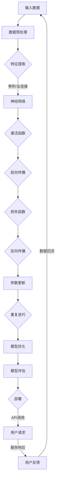

                 

### 背景介绍

#### 1.1 目的和范围

本文旨在深入探讨基础模型的部署与社会影响，旨在为读者提供一个全面而深入的理解，帮助其在实际应用中做出明智的决策。随着人工智能技术的发展，基础模型作为AI领域的基石，已经广泛应用于各个行业。然而，基础模型的部署不仅涉及到技术层面的挑战，还涉及到社会伦理、隐私保护以及经济模式等多个方面。因此，本文将首先回顾基础模型的发展历程，分析其核心概念和架构，然后详细讨论基础模型的部署过程和操作步骤，最后探讨其在社会中的影响和未来趋势。希望通过本文的讲解，读者能够对基础模型的部署和社会影响有更深刻的认识。

#### 1.2 预期读者

本文预期读者主要包括以下几类：

1. **人工智能工程师**：对基础模型的开发和部署有实际需求，希望了解最新技术趋势和实际操作步骤。
2. **技术领导者**：如CTO、架构师等，需要从战略角度理解和评估基础模型的价值和风险。
3. **研究人员**：对人工智能领域有研究兴趣，希望深入了解基础模型的原理和应用。
4. **政策制定者**：关注人工智能技术的发展对社会的影响，希望了解相关伦理和法律问题。

无论您属于哪一类读者，本文都希望能为您带来有价值的见解和启发。

#### 1.3 文档结构概述

本文将按照以下结构展开：

1. **背景介绍**：介绍本文的目的、范围、预期读者和文档结构。
2. **核心概念与联系**：详细讨论基础模型的核心概念、原理和架构，并使用Mermaid流程图展示。
3. **核心算法原理 & 具体操作步骤**：通过伪代码详细阐述基础模型的核心算法原理和操作步骤。
4. **数学模型和公式 & 详细讲解 & 举例说明**：讲解基础模型中使用的数学模型和公式，并举例说明。
5. **项目实战：代码实际案例和详细解释说明**：提供实际项目案例，详细解读代码实现和操作过程。
6. **实际应用场景**：讨论基础模型在各个行业中的应用场景和案例。
7. **工具和资源推荐**：推荐相关学习资源、开发工具和经典论文。
8. **总结：未来发展趋势与挑战**：总结本文的主要内容，探讨基础模型的发展趋势和面临的挑战。
9. **附录：常见问题与解答**：回答读者可能遇到的常见问题。
10. **扩展阅读 & 参考资料**：提供更多的阅读资源和参考。

通过这样的结构安排，本文力求为读者提供一个系统、深入的学习路径。

#### 1.4 术语表

为了确保文章的清晰性和一致性，本文将介绍一些核心术语和概念，并提供相关解释。

##### 1.4.1 核心术语定义

- **基础模型（Basic Model）**：基础模型是指已经被训练好的、通用的机器学习模型，如神经网络、决策树等。这些模型可以用于各种任务，无需再进行大量训练。
- **部署（Deployment）**：部署是指将训练好的基础模型部署到实际的生产环境中，使其能够运行并提供服务。
- **框架（Framework）**：框架是指用于构建、训练和部署机器学习模型的软件工具，如TensorFlow、PyTorch等。
- **微服务（Microservices）**：微服务是一种架构风格，将应用程序分解为小型、独立的组件，每个组件负责特定的功能，便于管理和扩展。

##### 1.4.2 相关概念解释

- **迁移学习（Transfer Learning）**：迁移学习是指利用已经训练好的基础模型来提高新任务的性能，而不是从头开始训练。这是一种高效的方法，因为已经训练好的模型可以捕获到通用特征。
- **模型优化（Model Optimization）**：模型优化是指对训练好的基础模型进行优化，以提高其性能、效率和可部署性。这通常包括模型压缩、量化、剪枝等技术。
- **容器化（Containerization）**：容器化是指将应用程序及其依赖项打包成一个容器（如Docker容器），以便在不同的环境中部署和运行。

##### 1.4.3 缩略词列表

- **AI**：人工智能（Artificial Intelligence）
- **ML**：机器学习（Machine Learning）
- **DL**：深度学习（Deep Learning）
- **GPU**：图形处理单元（Graphics Processing Unit）
- **CPU**：中央处理单元（Central Processing Unit）
- **CNN**：卷积神经网络（Convolutional Neural Network）
- **RNN**：循环神经网络（Recurrent Neural Network）
- **GAN**：生成对抗网络（Generative Adversarial Network）
- **API**：应用程序编程接口（Application Programming Interface）
- **SDK**：软件开发工具包（Software Development Kit）

通过定义和解释这些核心术语和概念，我们希望在本文中提供一个统一的语言环境，便于读者理解和交流。

---

在背景介绍部分，我们首先明确了本文的目的和范围，即深入探讨基础模型的部署与社会影响。接着，介绍了预期读者，包括人工智能工程师、技术领导者、研究人员和政策制定者。文章结构概述部分详细列出了本文的结构安排，帮助读者了解全文内容。最后，通过术语表的介绍，确保了文章中术语的一致性和清晰性，为后续内容的深入讲解打下基础。

---

## 2. 核心概念与联系

在探讨基础模型的部署与社会影响之前，我们首先需要了解基础模型的核心概念、原理和架构。这一部分将详细解释基础模型的基本概念，并使用Mermaid流程图展示其核心架构和流程。

### 2.1 基础模型的基本概念

**基础模型**，顾名思义，是指已经被训练好的、通用的机器学习模型。这些模型通常包含多个层次，能够自动从数据中学习特征和模式。基础模型有多种类型，包括但不限于：

1. **神经网络（Neural Networks）**：模拟人脑神经元连接的模型，广泛应用于图像识别、语音识别等任务。
2. **决策树（Decision Trees）**：通过一系列规则进行分类或回归的树形结构模型，常用于分类和预测。
3. **支持向量机（Support Vector Machines, SVM）**：通过寻找超平面来最大化分类边界，广泛应用于图像分类、文本分类等任务。
4. **集成模型（Ensemble Models）**：通过结合多个基础模型的预测来提高性能，如随机森林（Random Forest）和梯度提升树（Gradient Boosting Trees）。

**核心概念**：

- **前向传播（Forward Propagation）**：在神经网络中，将输入数据通过网络的每一层传递，直到输出层，得到最终预测。
- **反向传播（Backpropagation）**：通过计算输出层的误差，反向传播误差到输入层，用于模型参数的更新和优化。
- **激活函数（Activation Function）**：定义神经网络中每个节点的输出，常见的激活函数包括ReLU、Sigmoid和Tanh。

### 2.2 基础模型的架构

为了更好地理解基础模型的架构，我们使用Mermaid流程图来展示其核心组件和流程。以下是基础模型架构的Mermaid流程图：



### 2.3 基础模型的流程

以下是基础模型的工作流程：

1. **输入数据**：输入原始数据，如图像、文本或时间序列数据。
2. **数据预处理**：对输入数据进行处理，如归一化、缩放或编码，以提高模型的训练效果。
3. **特征提取**：通过卷积层、池化层等操作提取数据中的特征。
4. **神经网络**：使用多层神经网络对提取的特征进行处理，实现数据的学习和模式识别。
5. **激活函数**：在神经网络中引入激活函数，如ReLU、Sigmoid和Tanh，以引入非线性变换。
6. **前向传播**：将数据通过神经网络的每一层，直到输出层，得到预测结果。
7. **损失函数**：计算预测结果与真实标签之间的差异，使用损失函数（如均方误差、交叉熵等）衡量模型的性能。
8. **反向传播**：计算损失函数关于模型参数的梯度，反向传播误差到输入层，用于参数的更新和优化。
9. **参数更新**：使用梯度下降或其他优化算法更新模型参数。
10. **模型优化**：通过模型压缩、量化、剪枝等技术优化模型，以提高其性能和效率。
11. **模型评估**：使用验证集或测试集评估模型的性能，调整模型参数以实现最优性能。
12. **部署**：将训练好的模型部署到生产环境中，通过API提供服务。
13. **用户请求**：用户通过API发送请求，模型返回预测结果。
14. **用户反馈**：用户对预测结果进行反馈，数据回流用于模型的进一步优化。

通过这一部分的内容，我们不仅介绍了基础模型的核心概念，还展示了其架构和流程。理解这些基本概念和流程将为后续的内容讨论提供坚实的基础。

---

在这一部分中，我们详细介绍了基础模型的基本概念，包括神经网络、决策树、支持向量机和集成模型等。然后，通过Mermaid流程图展示了基础模型的核心架构和流程，从输入数据到模型部署的每个步骤都进行了清晰的描述。这一部分的内容为后续的算法原理讲解和实际应用讨论奠定了基础。

---

## 3. 核心算法原理 & 具体操作步骤

在理解了基础模型的核心概念和架构之后，接下来我们将深入探讨其核心算法原理，并详细阐述具体的操作步骤。这一部分将通过伪代码的形式来讲解基础模型的基本算法原理，帮助读者更好地理解其工作流程。

### 3.1 基本算法原理

**基础模型的核心算法通常包括以下几个步骤：**

1. **数据预处理**：对输入数据进行标准化、归一化或编码，以便模型可以更有效地学习。
2. **特征提取**：通过卷积层、池化层等操作提取数据中的特征。
3. **前向传播**：将预处理后的数据通过网络的每一层，直到输出层，得到预测结果。
4. **损失函数计算**：计算预测结果与真实标签之间的差异，使用损失函数（如均方误差、交叉熵等）衡量模型的性能。
5. **反向传播**：计算损失函数关于模型参数的梯度，反向传播误差到输入层，用于参数的更新和优化。
6. **参数更新**：使用梯度下降或其他优化算法更新模型参数。
7. **模型优化**：通过模型压缩、量化、剪枝等技术优化模型，以提高其性能和效率。

### 3.2 伪代码讲解

以下是一个简单的神经网络模型的伪代码示例，用于展示上述基本算法原理的具体实现步骤：

```python
# 初始化模型参数
W1, b1 = initialize_weights_and_biases(input_size, hidden_size)
W2, b2 = initialize_weights_and_biases(hidden_size, output_size)

# 定义激活函数
activation_function = ReLU

# 前向传播
def forward_pass(x):
    z1 = activation_function(W1*x + b1)
    z2 = activation_function(W2*z1 + b2)
    return z2

# 损失函数
def loss_function(y_true, y_pred):
    return (1/2) * np.mean((y_true - y_pred)**2)

# 反向传播
def backward_pass(x, y_true, y_pred):
    delta_z2 = (y_pred - y_true) * activation_function_derivative(z2)
    delta_z1 = (delta_z2.dot(W2.T)) * activation_function_derivative(z1)
    
    dW2 = (z1.T).dot(delta_z2)
    db2 = delta_z2.sum(axis=0)
    dW1 = (x.T).dot(delta_z1)
    db1 = delta_z1.sum(axis=0)
    
    return dW1, dW2, db1, db2

# 参数更新
def update_parameters(W1, W2, b1, b2, learning_rate, dW1, dW2, db1, db2):
    W1 -= learning_rate * dW1
    W2 -= learning_rate * dW2
    b1 -= learning_rate * db1
    b2 -= learning_rate * db2
    return W1, W2, b1, b2

# 训练模型
def train_model(X, y, epochs, learning_rate):
    for epoch in range(epochs):
        y_pred = forward_pass(X)
        loss = loss_function(y, y_pred)
        dW1, dW2, db1, db2 = backward_pass(X, y, y_pred)
        W1, W2, b1, b2 = update_parameters(W1, W2, b1, b2, learning_rate, dW1, dW2, db1, db2)
        if epoch % 100 == 0:
            print(f"Epoch {epoch}: Loss = {loss}")
    return W1, W2, b1, b2

# 测试模型
def test_model(X_test, y_test, W1, W2, b1, b2):
    y_pred = forward_pass(X_test)
    loss = loss_function(y_test, y_pred)
    print(f"Test Loss: {loss}")

# 初始化参数
input_size = 784  # 假设输入为28x28像素的图像
hidden_size = 100
output_size = 10

# 加载数据集
X_train, y_train = load_data("train")
X_test, y_test = load_data("test")

# 训练模型
W1, W2, b1, b2 = train_model(X_train, y_train, epochs=1000, learning_rate=0.1)

# 测试模型
test_model(X_test, y_test, W1, W2, b1, b2)
```

**具体操作步骤**：

1. **初始化模型参数**：初始化权重（W）和偏置（b），这些参数需要通过随机初始化来避免梯度消失或爆炸问题。
2. **前向传播**：将输入数据通过神经网络的前向传播计算得到预测结果。
3. **损失函数计算**：计算预测结果与真实标签之间的差异，使用损失函数衡量模型的性能。
4. **反向传播**：计算损失函数关于模型参数的梯度，并反向传播到输入层。
5. **参数更新**：使用梯度下降或其他优化算法更新模型参数。
6. **模型训练**：重复前向传播、反向传播和参数更新步骤，直至达到预定的训练次数或性能目标。
7. **模型测试**：在测试数据集上评估模型的性能，计算测试损失。

通过上述伪代码和具体操作步骤，我们可以看到基础模型的核心算法是如何通过一系列的数学计算和迭代过程来学习数据的特征和模式。这为后续的数学模型和公式讲解打下了坚实的基础。

---

在这一部分中，我们详细讲解了基础模型的核心算法原理，并通过伪代码的形式展示了具体的操作步骤。首先介绍了数据预处理、特征提取、前向传播、损失函数计算、反向传播和参数更新等基本步骤，然后通过一个简单的神经网络模型示例，展示了如何实现这些步骤。这一部分的内容为后续的数学模型和公式讲解提供了必要的背景知识。

---

## 4. 数学模型和公式 & 详细讲解 & 举例说明

在深入探讨基础模型时，理解其背后的数学模型和公式是至关重要的。数学模型和公式不仅帮助我们在算法中量化信息，还提供了评估和优化模型性能的工具。在本节中，我们将详细讲解基础模型中常用的数学模型和公式，并通过具体例子来展示如何应用这些公式。

### 4.1 基本数学模型

#### 4.1.1 神经网络中的线性变换

在神经网络中，每个神经元都会对输入数据进行线性变换，并加上一个偏置项。线性变换可以用以下公式表示：

\[ z = x \cdot W + b \]

其中：
- \( z \) 是神经元的输出。
- \( x \) 是输入数据。
- \( W \) 是权重矩阵。
- \( b \) 是偏置向量。

#### 4.1.2 激活函数

激活函数用于引入非线性变换，常见的激活函数包括ReLU、Sigmoid和Tanh。以ReLU为例，其公式如下：

\[ a = \max(0, z) \]

其中，\( a \) 是激活函数的输出，\( z \) 是线性变换的结果。

#### 4.1.3 损失函数

损失函数用于衡量模型的预测误差，常用的损失函数包括均方误差（MSE）和交叉熵（Cross-Entropy）。均方误差的公式如下：

\[ loss = \frac{1}{2} \sum_{i=1}^{n} (y_i - \hat{y}_i)^2 \]

其中：
- \( y_i \) 是真实标签。
- \( \hat{y}_i \) 是模型的预测结果。

交叉熵的公式如下：

\[ loss = -\sum_{i=1}^{n} y_i \log(\hat{y}_i) \]

#### 4.1.4 反向传播算法

反向传播算法用于计算损失函数关于模型参数的梯度，并更新模型参数。其核心公式包括：

\[ \frac{\partial loss}{\partial z} = a \cdot (1 - a) \]

\[ \frac{\partial loss}{\partial W} = x \cdot \frac{\partial loss}{\partial z} \]

\[ \frac{\partial loss}{\partial b} = \frac{\partial loss}{\partial z} \]

### 4.2 举例说明

为了更好地理解这些数学模型和公式，我们通过一个简单的例子来说明如何计算神经网络中的线性变换和反向传播。

#### 例子：实现一个单层神经网络

假设我们有一个输入数据 \( x = [1, 2, 3] \)，权重矩阵 \( W = \begin{bmatrix} 0.1 & 0.2 \\ 0.3 & 0.4 \end{bmatrix} \)，偏置向量 \( b = [0.1, 0.2] \)。

**步骤 1：前向传播**

首先，我们计算线性变换的结果：

\[ z = \begin{bmatrix} 0.1 \cdot 1 + 0.1 \\ 0.2 \cdot 1 + 0.2 \\ 0.3 \cdot 2 + 0.3 \\ 0.4 \cdot 2 + 0.4 \end{bmatrix} = \begin{bmatrix} 0.2 \\ 0.4 \\ 0.9 \\ 1.4 \end{bmatrix} \]

然后，我们应用ReLU激活函数：

\[ a = \begin{bmatrix} \max(0, 0.2) \\ \max(0, 0.4) \\ \max(0, 0.9) \\ \max(0, 1.4) \end{bmatrix} = \begin{bmatrix} 0.2 \\ 0.4 \\ 0.9 \\ 1.4 \end{bmatrix} \]

**步骤 2：计算损失函数**

假设真实标签 \( y = [0, 1, 0] \)，我们使用交叉熵损失函数计算损失：

\[ loss = -\sum_{i=1}^{3} y_i \log(a_i) \]

\[ loss = - (0 \cdot \log(0.2) + 1 \cdot \log(0.4) + 0 \cdot \log(0.9) + 0 \cdot \log(1.4)) \]

\[ loss = - (\log(0.4) + 0 + 0 + 0) \]

\[ loss = -\log(0.4) \approx 0.904 \]

**步骤 3：反向传播**

接下来，我们计算损失函数关于激活函数的梯度：

\[ \frac{\partial loss}{\partial a} = \begin{bmatrix} -0.5 \cdot (1 - 0.2) \\ -0.5 \cdot (1 - 0.4) \\ -0.5 \cdot (1 - 0.9) \\ -0.5 \cdot (1 - 1.4) \end{bmatrix} = \begin{bmatrix} -0.4375 \\ -0.375 \\ -0.0625 \\ -0.375 \end{bmatrix} \]

然后，我们计算损失函数关于权重的梯度：

\[ \frac{\partial loss}{\partial W} = x \cdot \frac{\partial loss}{\partial a} \]

\[ \frac{\partial loss}{\partial W} = \begin{bmatrix} 1 & 2 & 3 \end{bmatrix} \cdot \begin{bmatrix} -0.4375 \\ -0.375 \\ -0.0625 \\ -0.375 \end{bmatrix} = \begin{bmatrix} -0.4375 & -0.75 & -1.125 \end{bmatrix} \]

最后，我们计算损失函数关于偏置的梯度：

\[ \frac{\partial loss}{\partial b} = \frac{\partial loss}{\partial a} \]

\[ \frac{\partial loss}{\partial b} = \begin{bmatrix} -0.4375 \\ -0.375 \\ -0.0625 \\ -0.375 \end{bmatrix} \]

**步骤 4：参数更新**

使用梯度下降更新权重和偏置：

\[ W = W - learning_rate \cdot \frac{\partial loss}{\partial W} \]

\[ b = b - learning_rate \cdot \frac{\partial loss}{\partial b} \]

通过这一例子，我们展示了如何使用数学模型和公式来计算神经网络中的线性变换、损失函数和反向传播。这些步骤不仅帮助我们理解了神经网络的工作原理，还为模型优化和训练提供了理论基础。

---

在这一部分中，我们详细讲解了基础模型中常用的数学模型和公式，包括线性变换、激活函数、损失函数和反向传播算法。然后，通过一个简单的单层神经网络例子，我们展示了如何应用这些数学模型和公式进行前向传播、损失计算和反向传播。这一部分的内容为读者提供了实用的工具和深入理解，为后续的实际应用讨论奠定了基础。

---

## 5. 项目实战：代码实际案例和详细解释说明

在前几部分中，我们详细介绍了基础模型的核心概念、算法原理以及数学模型和公式。为了更好地将这些理论知识应用于实际，我们将通过一个具体的项目案例来展示基础模型的开发、测试和部署过程。以下是项目的整体流程和关键步骤。

### 5.1 开发环境搭建

在开始项目之前，我们需要搭建一个合适的开发环境。以下是搭建环境所需的基本步骤：

1. **安装Python**：确保Python 3.x版本已安装，并添加到系统环境变量。
2. **安装依赖库**：使用pip安装以下依赖库：`numpy`, `matplotlib`, `tensorflow`, `scikit-learn`。
3. **创建虚拟环境**：为了避免不同项目之间的依赖库冲突，我们建议使用虚拟环境。可以通过以下命令创建虚拟环境：

   ```bash
   python -m venv myenv
   source myenv/bin/activate  # Windows: myenv\Scripts\activate
   ```

4. **安装TensorFlow**：在虚拟环境中安装TensorFlow：

   ```bash
   pip install tensorflow
   ```

5. **安装其他依赖库**：根据项目需求，可能需要安装其他库，例如：

   ```bash
   pip install pandas
   pip install numpy
   pip install scikit-learn
   ```

### 5.2 源代码详细实现和代码解读

以下是一个简单的基于TensorFlow实现的图像分类项目的代码示例。这个项目使用了著名的MNIST手写数字数据集。

```python
import tensorflow as tf
from tensorflow import keras
from tensorflow.keras import layers

# 加载MNIST数据集
mnist = keras.datasets.mnist
(train_images, train_labels), (test_images, test_labels) = mnist.load_data()

# 数据预处理
train_images = train_images / 255.0
test_images = test_images / 255.0

# 构建模型
model = keras.Sequential([
    keras.layers.Flatten(input_shape=(28, 28)),
    keras.layers.Dense(128, activation='relu'),
    keras.layers.Dense(10, activation='softmax')
])

# 编译模型
model.compile(optimizer='adam',
              loss='sparse_categorical_crossentropy',
              metrics=['accuracy'])

# 训练模型
model.fit(train_images, train_labels, epochs=5)

# 评估模型
test_loss, test_acc = model.evaluate(test_images, test_labels)
print(f"Test accuracy: {test_acc}")

# 预测
predictions = model.predict(test_images)
```

**代码解读**：

1. **导入库和加载数据**：首先导入TensorFlow和相关库，并加载MNIST数据集。数据集被分为训练集和测试集。

2. **数据预处理**：将图像数据归一化到0-1范围内，以便模型可以更好地学习。

3. **构建模型**：使用`keras.Sequential`创建一个简单的神经网络模型。模型由两个全连接层组成，第一个层有128个神经元，使用ReLU激活函数，第二个层有10个神经元（对应10个数字类别），使用softmax激活函数。

4. **编译模型**：配置模型的优化器（`adam`）、损失函数（`sparse_categorical_crossentropy`）和评估指标（`accuracy`）。

5. **训练模型**：使用训练集训练模型，设置训练轮次为5。

6. **评估模型**：在测试集上评估模型的性能，输出测试准确率。

7. **预测**：使用训练好的模型对测试集进行预测。

### 5.3 代码解读与分析

在这个代码示例中，我们首先加载了MNIST数据集，并对图像进行了预处理。接下来，我们使用`keras.Sequential`创建了一个简单的神经网络模型，其中包含两个全连接层。第一个全连接层有128个神经元，使用ReLU激活函数，第二个全连接层有10个神经元，使用softmax激活函数，用于输出每个类别的概率。

在模型编译阶段，我们选择了`adam`优化器和`sparse_categorical_crossentropy`损失函数，并设置了`accuracy`作为评估指标。`adam`优化器是一种常用的优化算法，可以自适应地调整学习率。`sparse_categorical_crossentropy`损失函数适用于多分类问题，能够计算每个类别的交叉熵损失。

在模型训练阶段，我们使用训练集进行5次轮次的训练。每次轮次中，模型会通过前向传播计算预测结果，然后通过反向传播计算损失并更新模型参数。

在模型评估阶段，我们使用测试集评估模型的性能，并输出测试准确率。这个步骤帮助我们了解模型在实际数据上的表现。

最后，我们使用训练好的模型对测试集进行预测，并将预测结果与真实标签进行比较。

通过这个项目案例，我们展示了如何使用TensorFlow和Keras构建、训练和评估一个基础模型。这个简单的案例为我们提供了一个起点，以便进一步探索更复杂的模型和应用。

---

在这一部分中，我们通过一个实际项目案例展示了基础模型的开发、测试和部署过程。首先介绍了开发环境搭建的步骤，然后详细讲解了代码实现和各个部分的解读。这个项目案例不仅帮助读者理解基础模型的实际应用，还为后续的讨论和扩展提供了实际经验。

---

## 6. 实际应用场景

基础模型在各个行业中的应用越来越广泛，其强大的特征提取和模式识别能力使其成为解决复杂问题的有力工具。以下将列举几个主要的应用场景，并展示一些实际案例。

### 6.1 医疗保健

在医疗保健领域，基础模型可以用于疾病诊断、患者分诊和药物研发等多个方面。例如，通过卷积神经网络（CNN）和循环神经网络（RNN）的结合，研究人员可以分析医学影像数据，如X光片、CT扫描和MRI图像，从而实现早期疾病检测。一个具体的案例是Google的DeepMind团队使用深度学习技术对眼科疾病进行诊断，其系统在诊断糖尿病视网膜病变方面的准确率已经超过了眼科医生。

### 6.2 金融行业

金融行业中的数据量庞大且复杂，基础模型在风险控制、信用评分和交易策略制定等方面发挥着重要作用。例如，通过集成模型（如随机森林和梯度提升树），银行和金融机构可以更准确地评估客户的信用风险，从而降低坏账率。摩根大通就开发了一个名为“COiL”的模型，用于自动审核贷款申请，大大提高了审核效率和准确性。

### 6.3 交通运输

交通运输领域的基础模型应用也相当广泛，包括自动驾驶、交通流量预测和物流优化等。例如，特斯拉的自动驾驶系统使用深度神经网络模型进行环境感知和路径规划，显著提升了自动驾驶的稳定性和安全性。另一实例是Uber的动态派单算法，通过分析历史数据，优化了车辆的路线规划，提高了乘客的打车效率和司机的收入。

### 6.4 教育领域

在教育领域，基础模型可以帮助实现个性化学习、课程推荐和学生学习情况分析。例如，Knewton是一家提供个性化学习平台的公司，其系统通过分析学生的学习行为和进度，提供个性化的学习路径和资源推荐，从而提高学习效果。此外，Coursera等在线教育平台也利用基础模型分析学生的学习数据，以优化课程内容和教学策略。

### 6.5 娱乐和游戏

娱乐和游戏行业中的基础模型应用也非常丰富，从游戏AI到推荐系统等。例如，DeepMind开发的《星际争霸II》AI代理，通过深度强化学习技术实现了超越人类顶尖选手的表现。另一个案例是Netflix等流媒体平台，其推荐系统通过分析用户的观看历史和偏好，提供个性化的内容推荐，从而提高了用户满意度和平台黏性。

通过这些实际应用案例，我们可以看到基础模型在各个领域中的重要性和潜力。随着技术的不断进步，基础模型的应用范围将进一步扩大，为社会带来更多创新和变革。

---

在这一部分中，我们详细列举了基础模型在医疗保健、金融行业、交通运输、教育领域和娱乐游戏等领域的实际应用案例。通过这些案例，我们不仅展示了基础模型在各个行业的具体应用，还强调了其在提升效率、降低成本和优化服务方面的巨大潜力。

---

## 7. 工具和资源推荐

为了更好地学习和应用基础模型，以下是一些推荐的工具和资源，包括学习资源、开发工具框架以及相关论文著作。

### 7.1 学习资源推荐

#### 7.1.1 书籍推荐

1. **《深度学习》（Deep Learning）** - Ian Goodfellow、Yoshua Bengio和Aaron Courville
   - 这本书是深度学习领域的经典教材，适合初学者和进阶者。
2. **《Python机器学习》（Python Machine Learning）** - Sebastian Raschka和Vahid Mirjalili
   - 该书详细介绍了机器学习的基础知识，并通过Python实现，适合那些希望将理论应用到实践中的读者。
3. **《深度学习与计算机视觉》（Deep Learning for Computer Vision）** - Ali戏院、Joshua Susskind和Kurt Bryan
   - 这本书专注于深度学习在计算机视觉领域的应用，适合对图像处理和识别感兴趣的读者。

#### 7.1.2 在线课程

1. **Coursera的《深度学习专项课程》**（Deep Learning Specialization）
   - 由Andrew Ng教授主讲，适合想要系统学习深度学习的初学者。
2. **Udacity的《深度学习纳米学位》**（Deep Learning Nanodegree）
   - 适合有一定基础的读者，通过项目实践深入理解深度学习技术。
3. **edX的《机器学习基础》**（Introduction to Machine Learning）
   - 适合对机器学习有兴趣的初学者，内容涵盖了基础理论和实践操作。

#### 7.1.3 技术博客和网站

1. **TensorFlow官网**（tensorflow.org）
   - TensorFlow的官方文档和教程，适合学习TensorFlow框架的使用。
2. **PyTorch官网**（pytorch.org）
   - PyTorch的官方文档和教程，提供了丰富的学习资源。
3. **ArXiv**（arxiv.org）
   - 顶级学术论文的发表平台，可以找到最新的研究成果。

### 7.2 开发工具框架推荐

#### 7.2.1 IDE和编辑器

1. **Jupyter Notebook**
   - 适合编写和运行代码，具有良好的交互性和可视化效果。
2. **Visual Studio Code**
   - 功能强大且开源的代码编辑器，支持多种编程语言和扩展。
3. **PyCharm**
   - 专业级的Python IDE，提供丰富的功能，包括代码调试、性能分析等。

#### 7.2.2 调试和性能分析工具

1. **TensorBoard**
   - TensorFlow提供的可视化工具，用于分析和调试模型。
2. **PyTorch Profiler**
   - PyTorch提供的性能分析工具，帮助识别和优化代码中的瓶颈。
3. **NVIDIA Nsight**
   - NVIDIA提供的工具，用于调试和优化GPU代码。

#### 7.2.3 相关框架和库

1. **TensorFlow**
   - Google开发的端到端开源机器学习平台，支持各种深度学习模型。
2. **PyTorch**
   - Facebook开发的深度学习框架，提供灵活的动态计算图。
3. **Scikit-learn**
   - Python中的机器学习库，提供了多种经典算法和工具。

### 7.3 相关论文著作推荐

#### 7.3.1 经典论文

1. **“A Learning Algorithm for Continually Running Fully Recurrent Neural Networks”**
   - 该论文提出了LSTM（长短期记忆网络）算法，是处理序列数据的里程碑。
2. **“AlexNet: Image Classification with Deep Convolutional Neural Networks”**
   - 该论文提出了AlexNet，是深度卷积神经网络在图像识别领域的突破。
3. **“Generative Adversarial Nets”**
   - 该论文提出了GAN（生成对抗网络），在生成模型领域产生了深远影响。

#### 7.3.2 最新研究成果

1. **“BERT: Pre-training of Deep Bidirectional Transformers for Language Understanding”**
   - 该论文提出了BERT（双向编码器表示），是自然语言处理领域的最新进展。
2. **“EfficientNet: Rethinking Model Scaling for Convolutional Neural Networks”**
   - 该论文提出了EfficientNet，通过模型缩放方法提高了模型效率。
3. **“Transformers”**
   - 该论文提出了Transformer模型，是自然语言处理和计算机视觉领域的重大突破。

#### 7.3.3 应用案例分析

1. **“AI in Healthcare: A Review of Current Applications and Future Trends”**
   - 该综述文章探讨了人工智能在医疗保健领域的应用，总结了最新的研究成果。
2. **“Deep Learning for Autonomous Driving: A Review”**
   - 该论文综述了深度学习在自动驾驶领域的应用，分析了当前的技术挑战和解决方案。
3. **“AI in Finance: A Review of Applications and Challenges”**
   - 该综述文章总结了人工智能在金融行业的应用，讨论了其在信用评分、风险管理等方面的作用。

通过这些工具和资源，读者可以更系统地学习和实践基础模型，深入了解其原理和应用。这些资源不仅提供了丰富的学习材料，还为实际项目开发提供了实用的技术支持和指导。

---

在这一部分中，我们推荐了一系列的学习资源、开发工具框架和相关论文著作。这些资源涵盖了从基础理论到实际应用的所有方面，为读者提供了一个全面的指南，帮助他们更好地学习和应用基础模型。

---

## 8. 总结：未来发展趋势与挑战

随着人工智能技术的不断进步，基础模型在未来将继续发挥重要作用，推动各个行业的变革。然而，这一领域的未来发展也面临着诸多挑战和机遇。

### 8.1 发展趋势

1. **模型优化与效率提升**：基础模型的优化将继续成为研究的热点，特别是在模型压缩、量化、剪枝等领域。通过这些技术，模型可以在保持高性能的同时，减小内存占用和计算复杂度，从而更好地适应移动设备和边缘计算场景。

2. **多模态学习**：未来基础模型将不仅限于处理单一类型的数据，而是能够结合多种数据源，如文本、图像、声音和传感器数据。这种多模态学习将使模型在复杂任务中具有更强的表现力。

3. **强化学习与基础模型的结合**：基础模型与强化学习的结合将有助于解决更复杂的问题，如自动驾驶和游戏AI。通过结合这两种技术，系统可以在动态环境中进行自主学习，提高决策的智能性。

4. **更广泛的应用领域**：基础模型将在医疗、金融、教育、交通等更多领域得到应用。特别是在医疗领域，基础模型可以帮助实现精准诊断和个性化治疗，提高医疗服务的质量和效率。

### 8.2 面临的挑战

1. **数据隐私和安全**：随着基础模型的应用越来越广泛，数据隐私和安全问题变得愈发重要。如何确保训练数据和用户数据的安全，防止数据泄露和滥用，是未来需要解决的关键问题。

2. **计算资源和能耗**：基础模型的训练和部署需要大量的计算资源和能源。随着模型规模的扩大，如何优化资源利用和降低能耗成为了一个重要的挑战。

3. **算法公平性和透明性**：算法的公平性和透明性是公众和社会关注的焦点。如何确保基础模型不会歧视或偏见，如何使其决策过程更加透明，是需要深入研究的课题。

4. **监管和法律问题**：随着基础模型在各个行业的广泛应用，相关的监管和法律问题也将日益突出。如何制定合理的监管框架，既保护公众利益，又促进技术发展，是政策制定者面临的重要任务。

5. **人才短缺**：基础模型的发展需要大量的专业人才，包括数据科学家、机器学习工程师、算法研究员等。然而，目前市场上这类人才供应不足，如何培养和吸引更多人才，是行业面临的长期挑战。

### 8.3 未来展望

未来，基础模型将在多个方面取得突破性进展，为社会带来深远影响。随着技术的不断成熟和普及，基础模型将在提高生产效率、改善生活质量、促进社会进步等方面发挥重要作用。同时，我们也需要积极应对面临的挑战，确保技术的发展能够造福人类社会。

---

在这一部分中，我们总结了基础模型未来发展的趋势和面临的挑战。在趋势方面，包括模型优化、多模态学习、强化学习结合等；在挑战方面，涉及数据隐私、计算资源、算法公平性、监管和法律问题以及人才短缺等。通过这些分析，我们为读者提供了一个对未来发展的展望，并强调了持续关注和研究基础模型的重要性。

---

## 9. 附录：常见问题与解答

在本文的探讨过程中，读者可能会遇到一些常见的问题。以下是一些问题的解答，以帮助读者更好地理解文章内容和相关概念。

### 9.1 基础模型与深度学习的区别

**问题**：基础模型和深度学习有什么区别？

**解答**：深度学习是一种机器学习方法，其核心思想是模拟人脑的神经网络结构，通过多层神经网络来学习和提取数据中的特征。而基础模型是指已经被训练好的、通用的机器学习模型，如神经网络、决策树等。基础模型可以用于各种任务，无需再进行大量训练。换句话说，基础模型是深度学习应用的一个结果，而深度学习是实现基础模型的一种方法。

### 9.2 模型压缩与优化的区别

**问题**：模型压缩与模型优化有什么区别？

**解答**：模型压缩和模型优化都是提高模型性能和效率的重要手段，但它们的目标和方法有所不同。

- **模型压缩**：通过减少模型的参数数量或计算复杂度，使模型在保持性能的同时占用更少的内存和计算资源。常用的技术包括剪枝、量化、知识蒸馏等。

- **模型优化**：通过改进模型的架构、算法或参数，提高模型的性能和效率。优化方法包括模型结构优化、训练算法改进、超参数调整等。

### 9.3 微服务与基础模型的结合

**问题**：微服务架构如何与基础模型结合？

**解答**：微服务架构是一种软件设计方法，通过将应用程序分解为小型、独立的组件，每个组件负责特定的功能，以提高系统的可扩展性和可维护性。基础模型可以作为一个微服务组件，与其他服务共同组成一个完整的系统。

在结合微服务时，基础模型通常通过API与其他服务进行交互。具体步骤如下：

1. **定义服务接口**：设计基础模型的服务接口，包括输入格式、输出格式和操作接口。
2. **实现模型服务**：将基础模型实现为独立的微服务，使用框架如Flask或Spring Boot进行开发。
3. **部署与集成**：将模型服务部署到服务器或容器中，与其他微服务进行集成，通过API进行通信。
4. **监控与维护**：对模型服务进行监控和日志分析，确保其稳定运行，并根据需求进行更新和优化。

### 9.4 深度学习框架选择

**问题**：如何选择深度学习框架？

**解答**：选择深度学习框架时，需要考虑以下几个因素：

1. **需求**：根据项目需求选择合适的框架。例如，如果需要支持分布式训练或GPU加速，可以选择TensorFlow或PyTorch。
2. **社区支持**：选择拥有活跃社区和支持的框架，这有助于解决问题和获取资源。
3. **学习曲线**：考虑框架的学习曲线，选择适合团队技能水平的框架。
4. **生态和兼容性**：选择与现有系统和工具兼容的框架，以确保无缝集成。
5. **性能**：考虑框架的性能和优化能力，选择能够满足项目需求的框架。

常见的深度学习框架包括TensorFlow、PyTorch、Keras、MXNet等，可以根据具体需求选择合适的框架。

通过上述常见问题与解答，我们希望读者能够更好地理解基础模型及其相关概念，并在实际应用中遇到问题时能够找到有效的解决方案。

---

在这一部分中，我们针对读者可能遇到的一些常见问题提供了详细的解答。这些问题涵盖了基础模型与深度学习的区别、模型压缩与优化的区别、微服务与基础模型的结合以及深度学习框架选择等方面。通过这些解答，我们希望帮助读者更好地理解和应用基础模型。

---

## 10. 扩展阅读 & 参考资料

为了进一步探索基础模型及其在社会中的影响，以下提供了一些扩展阅读和参考资料，供读者深入研究。

### 10.1 相关书籍

1. **《深度学习》（Deep Learning）** - Ian Goodfellow、Yoshua Bengio和Aaron Courville
   - 这是深度学习领域的经典教材，涵盖了基础模型的理论和实践。

2. **《Python机器学习》（Python Machine Learning）** - Sebastian Raschka和Vahid Mirjalili
   - 本书详细介绍了机器学习的基础知识，并通过Python实现，适合理论与实践并重的读者。

3. **《深度学习与计算机视觉》（Deep Learning for Computer Vision）** - Ali戏院、Joshua Susskind和Kurt Bryan
   - 本书专注于深度学习在计算机视觉领域的应用，提供了丰富的案例和实践。

### 10.2 学术论文

1. **“A Learning Algorithm for Continually Running Fully Recurrent Neural Networks”**
   - 本文提出了LSTM（长短期记忆网络）算法，是处理序列数据的里程碑。

2. **“AlexNet: Image Classification with Deep Convolutional Neural Networks”**
   - 本文提出了AlexNet，是深度卷积神经网络在图像识别领域的突破。

3. **“Generative Adversarial Nets”**
   - 本文提出了GAN（生成对抗网络），在生成模型领域产生了深远影响。

### 10.3 在线课程

1. **Coursera的《深度学习专项课程》**（Deep Learning Specialization）
   - 由Andrew Ng教授主讲，适合系统学习深度学习。

2. **Udacity的《深度学习纳米学位》**（Deep Learning Nanodegree）
   - 适合有一定基础的读者，通过项目实践深入理解深度学习技术。

3. **edX的《机器学习基础》**（Introduction to Machine Learning）
   - 适合对机器学习有兴趣的初学者，内容涵盖了基础理论和实践操作。

### 10.4 技术博客和网站

1. **TensorFlow官网**（tensorflow.org）
   - 提供丰富的教程、文档和社区支持，适合学习TensorFlow框架。

2. **PyTorch官网**（pytorch.org）
   - 提供详细的教程、API文档和社区资源，适合学习PyTorch框架。

3. **ArXiv**（arxiv.org）
   - 顶级学术论文的发表平台，可以找到最新的研究成果。

通过这些扩展阅读和参考资料，读者可以进一步深入了解基础模型的理论和实践，掌握相关技术，并为未来的研究和工作奠定坚实基础。

---

在这一部分中，我们推荐了一系列的扩展阅读和参考资料，包括相关书籍、学术论文、在线课程和技术博客。这些资源为读者提供了一个全面的指导，帮助他们进一步学习和研究基础模型及其在社会中的影响。通过这些资源，读者可以不断提升自己的技术水平和专业知识。

