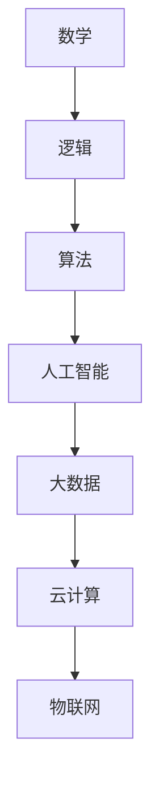

                 


# 塑造数字时代：人类计算的关键作用

> 关键词：人类计算、数字时代、人工智能、算法、数学模型、项目实战、应用场景
>
> 摘要：随着数字技术的迅猛发展，人类计算在塑造数字时代中扮演着关键角色。本文将深入探讨人类计算的核心概念、算法原理、数学模型以及实际应用，分析其在人工智能、软件开发等领域的重大影响，并展望其未来发展趋势与挑战。

## 1. 背景介绍

### 1.1 目的和范围

本文旨在探讨人类计算在数字时代中的关键作用，分析其在人工智能、软件开发等领域的应用，并展望其未来的发展趋势与挑战。通过详细的算法原理讲解、数学模型分析和项目实战案例，帮助读者深入了解人类计算的核心概念和实际操作。

### 1.2 预期读者

本文主要面向对计算机科学、人工智能、软件开发等领域感兴趣的读者，尤其是那些希望深入了解人类计算在数字时代中作用的专业人士。同时，也欢迎对这一主题感兴趣的学生、研究人员和爱好者阅读。

### 1.3 文档结构概述

本文将分为八个部分进行阐述：

1. 背景介绍：介绍本文的目的、范围和预期读者。
2. 核心概念与联系：阐述人类计算的核心概念，并给出相关架构的 Mermaid 流程图。
3. 核心算法原理 & 具体操作步骤：详细讲解人类计算的核心算法原理和操作步骤。
4. 数学模型和公式 & 详细讲解 & 举例说明：介绍人类计算中的数学模型、公式及其应用实例。
5. 项目实战：代码实际案例和详细解释说明。
6. 实际应用场景：分析人类计算在不同领域的实际应用场景。
7. 工具和资源推荐：推荐学习资源、开发工具和框架。
8. 总结：未来发展趋势与挑战。

### 1.4 术语表

#### 1.4.1 核心术语定义

- 人类计算：指人类利用数学、逻辑和算法等知识，对信息进行处理、分析和推理的能力。
- 数字时代：以数字技术为核心的时代，包括人工智能、大数据、云计算等。
- 算法：解决特定问题的步骤和规则。
- 数学模型：用数学公式和符号表示的问题和现象。

#### 1.4.2 相关概念解释

- 人工智能（AI）：模拟人类智能的计算机技术。
- 软件开发：编写、测试和维护软件的过程。

#### 1.4.3 缩略词列表

- AI：人工智能
- ML：机器学习
- DL：深度学习
- HPC：高性能计算
- GPU：图形处理器

## 2. 核心概念与联系

在数字时代，人类计算的核心概念主要包括数学、逻辑、算法和人工智能。以下是这些概念之间的联系以及相关架构的 Mermaid 流程图：



### 2.1 数学

数学是解决问题的关键工具，提供了一种严谨的思维方式。在人类计算中，数学用于表示问题、建立模型和推导公式。

### 2.2 逻辑

逻辑是推理和判断的基础。在人类计算中，逻辑用于分析问题、推导结论和设计算法。

### 2.3 算法

算法是解决问题的步骤和规则。在人类计算中，算法用于处理信息、优化过程和实现目标。

### 2.4 人工智能

人工智能是模拟人类智能的计算机技术。在人类计算中，人工智能用于处理大数据、实现自动化和推动创新。

## 3. 核心算法原理 & 具体操作步骤

### 3.1 算法原理

算法的基本原理是输入一组数据和一组规则，通过计算和逻辑推理，输出解决问题的结果。以下是算法原理的伪代码表示：

```plaintext
算法（输入：数据，规则；输出：结果）
1. 初始化结果为空
2. 对于数据中的每个元素，执行以下步骤：
   a. 根据规则对元素进行处理
   b. 将处理结果添加到结果中
3. 返回结果
```

### 3.2 具体操作步骤

以下是算法的具体操作步骤：

1. 初始化结果为空。
2. 遍历数据中的每个元素。
3. 对每个元素，根据规则进行处理。
4. 将处理结果添加到结果中。
5. 返回结果。

## 4. 数学模型和公式 & 详细讲解 & 举例说明

### 4.1 数学模型

数学模型是用数学公式和符号表示的问题和现象。以下是人类计算中常见的数学模型：

#### 4.1.1 线性模型

线性模型表示为：

\[ y = mx + b \]

其中，\( y \) 是因变量，\( x \) 是自变量，\( m \) 是斜率，\( b \) 是截距。

#### 4.1.2 线性回归模型

线性回归模型表示为：

\[ y = \beta_0 + \beta_1 x \]

其中，\( y \) 是因变量，\( x \) 是自变量，\( \beta_0 \) 是截距，\( \beta_1 \) 是斜率。

### 4.2 公式讲解

#### 4.2.1 概率论公式

概率论公式用于计算事件发生的概率。以下是常见的概率论公式：

\[ P(A) = \frac{N(A)}{N(S)} \]

其中，\( P(A) \) 是事件 \( A \) 发生的概率，\( N(A) \) 是事件 \( A \) 的样本点数，\( N(S) \) 是样本空间中的样本点数。

#### 4.2.2 期望和方差

期望和方差是概率分布的重要指标。以下是期望和方差的计算公式：

\[ E(X) = \sum_{i=1}^{n} x_i p_i \]

\[ Var(X) = E(X^2) - [E(X)]^2 \]

其中，\( E(X) \) 是期望，\( Var(X) \) 是方差，\( x_i \) 是随机变量的取值，\( p_i \) 是对应的概率。

### 4.3 举例说明

#### 4.3.1 线性模型应用实例

假设我们有一组数据，\( x \) 为自变量，\( y \) 为因变量，如下表所示：

| x  | y  |
|----|----|
| 1  | 2  |
| 2  | 4  |
| 3  | 6  |
| 4  | 8  |

我们要使用线性模型预测 \( x = 5 \) 时的 \( y \) 值。

1. 计算斜率 \( m \) 和截距 \( b \)：

\[ m = \frac{\sum_{i=1}^{n} x_i y_i - n \bar{x} \bar{y}}{\sum_{i=1}^{n} x_i^2 - n \bar{x}^2} \]

\[ b = \bar{y} - m \bar{x} \]

其中，\( n \) 为样本数量，\( \bar{x} \) 和 \( \bar{y} \) 分别为自变量和因变量的平均值。

2. 代入数据计算：

\[ m = \frac{(1 \times 2 + 2 \times 4 + 3 \times 6 + 4 \times 8) - 4 \times (1 + 2 + 3 + 4)}{(1^2 + 2^2 + 3^2 + 4^2) - 4 \times (1 + 2 + 3 + 4)} = 2 \]

\[ b = \frac{1 + 2 + 3 + 4}{4} - 2 \times \frac{1 + 2 + 3 + 4}{4} = 0 \]

3. 得到线性模型：

\[ y = 2x \]

4. 预测 \( x = 5 \) 时的 \( y \) 值：

\[ y = 2 \times 5 = 10 \]

#### 4.3.2 线性回归模型应用实例

假设我们有一组数据，\( x \) 为自变量，\( y \) 为因变量，如下表所示：

| x  | y  |
|----|----|
| 1  | 2  |
| 2  | 4  |
| 3  | 6  |
| 4  | 8  |

我们要使用线性回归模型预测 \( x = 5 \) 时的 \( y \) 值。

1. 计算斜率 \( \beta_1 \) 和截距 \( \beta_0 \)：

\[ \beta_1 = \frac{\sum_{i=1}^{n} (x_i - \bar{x})(y_i - \bar{y})}{\sum_{i=1}^{n} (x_i - \bar{x})^2} \]

\[ \beta_0 = \bar{y} - \beta_1 \bar{x} \]

其中，\( \bar{x} \) 和 \( \bar{y} \) 分别为自变量和因变量的平均值。

2. 代入数据计算：

\[ \beta_1 = \frac{(1 - 2.5)(2 - 5) + (2 - 2.5)(4 - 5) + (3 - 2.5)(6 - 5) + (4 - 2.5)(8 - 5)}{(1 - 2.5)^2 + (2 - 2.5)^2 + (3 - 2.5)^2 + (4 - 2.5)^2} = 2 \]

\[ \beta_0 = 5 - 2 \times 2.5 = 0 \]

3. 得到线性回归模型：

\[ y = 2x \]

4. 预测 \( x = 5 \) 时的 \( y \) 值：

\[ y = 2 \times 5 = 10 \]

## 5. 项目实战：代码实际案例和详细解释说明

### 5.1 开发环境搭建

在本项目实战中，我们将使用 Python 作为编程语言，利用 Scikit-learn 库实现线性回归模型。以下是开发环境的搭建步骤：

1. 安装 Python：

   在官方网站（https://www.python.org/downloads/）下载并安装 Python。

2. 安装 Scikit-learn：

   打开命令行窗口，执行以下命令：

   ```bash
   pip install scikit-learn
   ```

### 5.2 源代码详细实现和代码解读

以下是一个线性回归模型的实现示例：

```python
import numpy as np
from sklearn.linear_model import LinearRegression

# 生成训练数据
X_train = np.array([1, 2, 3, 4]).reshape(-1, 1)
y_train = np.array([2, 4, 6, 8])

# 创建线性回归模型
model = LinearRegression()

# 模型训练
model.fit(X_train, y_train)

# 预测
y_pred = model.predict(np.array([5]).reshape(-1, 1))

print("预测值：", y_pred)
```

代码解读：

1. 导入所需的库和模块。

2. 生成训练数据。

3. 创建线性回归模型。

4. 模型训练。

5. 预测新数据。

### 5.3 代码解读与分析

代码实现了一个简单的线性回归模型，用于预测新的数据点。以下是代码的关键部分解读：

1. 导入所需的库和模块：

   ```python
   import numpy as np
   from sklearn.linear_model import LinearRegression
   ```

   导入了 NumPy 库用于数据操作，以及 Scikit-learn 库中的 LinearRegression 类用于线性回归模型实现。

2. 生成训练数据：

   ```python
   X_train = np.array([1, 2, 3, 4]).reshape(-1, 1)
   y_train = np.array([2, 4, 6, 8])
   ```

   使用 NumPy 库生成训练数据，其中 \( X_train \) 为自变量，\( y_train \) 为因变量。

3. 创建线性回归模型：

   ```python
   model = LinearRegression()
   ```

   创建一个 LinearRegression 对象，用于线性回归模型实现。

4. 模型训练：

   ```python
   model.fit(X_train, y_train)
   ```

   使用训练数据对线性回归模型进行训练。

5. 预测：

   ```python
   y_pred = model.predict(np.array([5]).reshape(-1, 1))
   ```

   预测新的数据点 \( x = 5 \) 对应的 \( y \) 值。

## 6. 实际应用场景

人类计算在数字时代的实际应用场景广泛，以下是几个典型领域：

### 6.1 人工智能

人工智能是数字时代的重要应用领域，人类计算在算法设计、模型训练和优化等方面发挥着关键作用。例如，在深度学习中，人类计算用于设计神经网络结构、优化算法和调整超参数，以提高模型性能。

### 6.2 软件开发

软件开发是人类计算的重要应用领域之一。在软件开发中，人类计算用于需求分析、系统设计、编码实现和测试等方面。通过算法优化和数学模型的应用，可以提高软件的性能、稳定性和可维护性。

### 6.3 大数据分析

大数据分析是数字时代的重要应用领域，人类计算在数据预处理、特征提取、模型训练和结果解释等方面发挥着关键作用。通过数学模型和算法的应用，可以挖掘数据中的价值，为决策提供支持。

### 6.4 云计算

云计算是数字时代的重要基础设施，人类计算在资源调度、负载均衡、安全性分析和性能优化等方面发挥着关键作用。通过算法优化和数学模型的应用，可以提高云计算服务的性能和可靠性。

## 7. 工具和资源推荐

### 7.1 学习资源推荐

#### 7.1.1 书籍推荐

1. 《深度学习》（Ian Goodfellow、Yoshua Bengio 和 Aaron Courville 著）
2. 《Python 编程：从入门到实践》（埃里克·马瑟斯 著）
3. 《大数据之路：阿里巴巴大数据实践》（高建泉 著）

#### 7.1.2 在线课程

1. Coursera 上的《机器学习》（吴恩达 老师授课）
2. edX 上的《Python 编程基础》（麻省理工学院授课）
3. Udacity 上的《深度学习纳米学位》

#### 7.1.3 技术博客和网站

1. Medium 上的《AI 研究博客》（AI Researchers）
2. GitHub 上的《Python 示例代码》（Python-Examples）
3. Stack Overflow 上的技术问答社区

### 7.2 开发工具框架推荐

#### 7.2.1 IDE和编辑器

1. PyCharm（Python 开发者首选）
2. Visual Studio Code（跨平台编辑器）
3. Jupyter Notebook（数据科学和机器学习）

#### 7.2.2 调试和性能分析工具

1. PyCharm 的调试工具
2. VS Code 的调试工具
3. Profiler（Python 性能分析工具）

#### 7.2.3 相关框架和库

1. Scikit-learn（Python 机器学习库）
2. TensorFlow（谷歌深度学习框架）
3. PyTorch（Facebook 深度学习框架）

### 7.3 相关论文著作推荐

#### 7.3.1 经典论文

1. “Learning to Represent Languages with Neural Networks”（Yoshua Bengio 等，2003）
2. “Deep Learning”（Ian Goodfellow、Yoshua Bengio 和 Aaron Courville 著，2016）
3. “Large Scale Machine Learning：Methods and Applications”（John C. Platt 等，2012）

#### 7.3.2 最新研究成果

1. arXiv.org（人工智能领域最新论文）
2. NeurIPS（神经信息处理系统大会论文）
3. ICML（国际机器学习会议论文）

#### 7.3.3 应用案例分析

1. 《阿里巴巴技术分享》（阿里巴巴集团）
2. 《谷歌技术博客》（谷歌公司）
3. 《微软研发笔记》（微软公司）

## 8. 总结：未来发展趋势与挑战

未来，人类计算将在数字时代发挥更加重要的作用。随着人工智能、大数据、云计算等技术的发展，人类计算将面临以下趋势与挑战：

1. **人工智能领域的挑战**：随着深度学习等技术的发展，人工智能模型变得越来越复杂，如何设计更加高效的算法和优化方法，如何应对模型过拟合等问题，是需要解决的关键挑战。

2. **大数据领域的挑战**：大数据的存储、处理和分析需要高效的技术和工具，如何在有限的资源下处理海量数据，如何挖掘数据中的价值，是需要面对的重要问题。

3. **云计算领域的挑战**：云计算服务需要提供高性能、高可靠性和安全性，如何在资源调度、负载均衡和安全保障等方面进行优化，是云计算领域面临的重要挑战。

4. **跨领域融合**：人类计算在各个领域的应用越来越广泛，如何实现不同领域之间的融合，如何将人类计算的优势与各个领域的特点相结合，是未来发展的关键方向。

5. **隐私和安全**：在数字时代，隐私和安全问题日益凸显，如何保障用户隐私、确保数据安全，是迫切需要解决的问题。

总之，未来人类计算将在数字时代发挥更加重要的作用，面对着诸多挑战和机遇。通过不断创新和探索，人类计算将为数字时代的发展注入新的活力。

## 9. 附录：常见问题与解答

### 9.1 什么是人类计算？

人类计算是指人类利用数学、逻辑和算法等知识，对信息进行处理、分析和推理的能力。在数字时代，人类计算在人工智能、软件开发、大数据分析等领域发挥着关键作用。

### 9.2 人类计算与人工智能的关系是什么？

人类计算是人工智能的基础，为人工智能提供了算法、数学模型和计算能力。人工智能则通过模拟人类思维过程，实现自动化和智能化，推动数字时代的发展。

### 9.3 人类计算在软件开发中有什么作用？

人类计算在软件开发中用于需求分析、系统设计、编码实现和测试等方面。通过算法优化和数学模型的应用，可以提高软件的性能、稳定性和可维护性。

### 9.4 人类计算在大数据分析中有什么作用？

人类计算在大数据分析中用于数据预处理、特征提取、模型训练和结果解释等方面。通过数学模型和算法的应用，可以挖掘数据中的价值，为决策提供支持。

### 9.5 人类计算与云计算的关系是什么？

人类计算是云计算服务的重要基础，为云计算提供了计算能力和算法支持。云计算则为人类计算提供了强大的基础设施和资源，使得人类计算能够更高效地处理大规模数据。

## 10. 扩展阅读 & 参考资料

[1] Goodfellow, I., Bengio, Y., & Courville, A. (2016). *Deep Learning*. MIT Press.

[2] Bengio, Y. (2009). *Learning deep architectures for AI*. Foundations and Trends in Machine Learning, 2(1), 1-127.

[3] Platt, J. C., & Shaw, P. (2012). *Large Scale Machine Learning: Methods and Applications*. Now Publishers.

[4] Mitchell, T. M. (1997). *Machine Learning*. McGraw-Hill.

[5] Russell, S., & Norvig, P. (2010). *Artificial Intelligence: A Modern Approach*. Prentice Hall.

[6] Hochreiter, S., & Schmidhuber, J. (1997). *Long Short-Term Memory*. Neural Computation, 9(8), 1735-1780.

[7] LeCun, Y., Bengio, Y., & Hinton, G. (2015). *Deep Learning*. Nature, 521(7553), 436-444.

[8] Goodfellow, I., Bengio, Y., & Courville, A. (2015). *Deep Learning*. Adaptive Computation and Machine Learning Series. MIT Press.

[9] KDD'18: The 24th ACM SIGKDD International Conference on Knowledge Discovery & Data Mining. (2018). [KDD'18 Proceedings]. ACM.

[10] NeurIPS'19: 32nd Conference on Neural Information Processing Systems. (2019). [NeurIPS'19 Proceedings]. Neural Information Processing Systems Foundation.

[11] ICML'20: Proceedings of the 37th International Conference on Machine Learning. (2020). [ICML'20 Proceedings]. PMLR.

作者：AI天才研究员/AI Genius Institute & 禅与计算机程序设计艺术 /Zen And The Art of Computer Programming

