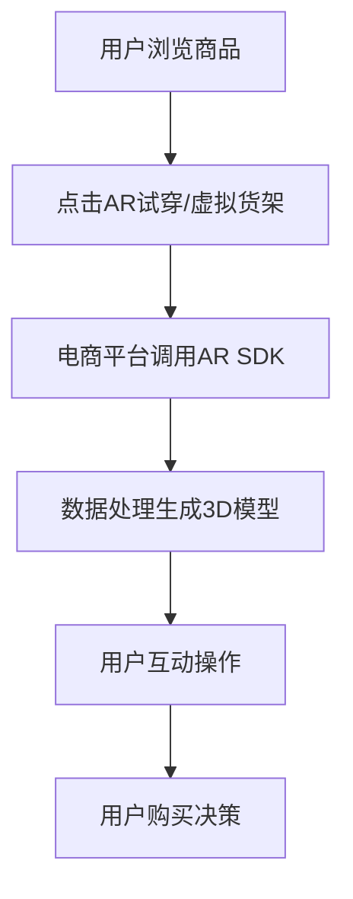

                 

# 增强现实技术在电商领域的应用：案例分析与展望

## 关键词
增强现实，AR，电商，应用案例，技术展望

## 摘要
随着科技的不断进步，增强现实（AR）技术在各个领域都展现出了巨大的潜力，尤其是在电商行业。本文将深入探讨增强现实技术在电商领域的应用，通过案例分析展示其带来的革命性变化，并对未来发展趋势与挑战进行展望。本文将分为多个部分，包括背景介绍、核心概念与联系、算法原理、数学模型、项目实战、应用场景、工具和资源推荐等，旨在为读者提供全面、系统的理解和应用指南。

## 1. 背景介绍

### 1.1 目的和范围
本文旨在分析增强现实（AR）技术在电商领域的应用，探讨其带来的商业价值和潜在影响。通过具体案例展示AR技术如何改变电商模式，提升用户体验，并预测未来AR技术在电商领域的发展趋势。

### 1.2 预期读者
本篇文章面向对增强现实技术和电商领域感兴趣的技术人员、创业者、市场分析师和学者。无论您是初学者还是专业人士，都将从本文中获取到有价值的信息和洞见。

### 1.3 文档结构概述
本文结构如下：

1. 背景介绍
2. 核心概念与联系
3. 核心算法原理 & 具体操作步骤
4. 数学模型和公式 & 详细讲解 & 举例说明
5. 项目实战：代码实际案例和详细解释说明
6. 实际应用场景
7. 工具和资源推荐
8. 总结：未来发展趋势与挑战
9. 附录：常见问题与解答
10. 扩展阅读 & 参考资料

### 1.4 术语表

#### 1.4.1 核心术语定义
- 增强现实（AR）：一种实时计算增强技术，通过计算机生成的虚拟信息叠加到真实世界场景中。
- 电商：利用互联网进行商品交易和服务的商业活动。
- 用户交互体验：用户在使用产品或服务时所感受到的满意度。

#### 1.4.2 相关概念解释
- 虚拟试穿：通过AR技术让用户在虚拟环境中试穿衣物。
- 虚拟货架：利用AR技术展示虚拟商品，用户可互动操作。
- 虚拟购物环境：通过AR技术模拟现实购物环境，提升购物体验。

#### 1.4.3 缩略词列表
- AR：增强现实
- VR：虚拟现实
- AI：人工智能
- SDK：软件开发工具包

## 2. 核心概念与联系

增强现实（AR）技术作为一种将虚拟信息与现实环境相结合的技术，在电商领域的应用主要体现在以下几个方面：

### 2.1 AR技术在电商中的应用场景

- **虚拟试穿**：用户可以通过AR技术试穿衣物，避免购买后的不合适问题。
- **虚拟货架**：在线商家可以通过AR技术搭建虚拟货架，让用户在虚拟环境中浏览和选择商品。
- **虚拟购物环境**：通过AR技术模拟现实购物环境，为用户提供更加真实的购物体验。

### 2.2 AR技术与电商业务流程的融合

- **用户浏览**：用户通过电商平台浏览商品，遇到感兴趣的商品时点击“AR试穿”或“虚拟货架”按钮。
- **技术处理**：电商平台通过AR SDK获取用户视角，并在后台进行数据处理，生成虚拟商品和购物环境的3D模型。
- **用户互动**：用户在虚拟环境中进行互动操作，如试穿衣物、调整角度等。
- **购买决策**：用户根据虚拟试穿或购物体验，做出购买决策。

### 2.3 AR技术在电商中的优势

- **提升用户体验**：通过AR技术，用户可以在虚拟环境中真实体验商品，提高购买满意度。
- **增加商品销量**：AR技术可以减少用户购买后不合适的情况，从而提高商品销量。
- **降低退货率**：通过虚拟试穿等技术，用户可以更准确了解商品，减少退货率。

#### 2.4 AR技术在电商业务中的流程图



通过以上流程图，我们可以清晰地看到AR技术在电商业务中的应用流程和各个环节之间的联系。

## 3. 核心算法原理 & 具体操作步骤

### 3.1 AR识别算法原理

增强现实技术中的核心算法是图像识别和追踪算法。以下是一种基于SLAM（Simultaneous Localization and Mapping）的图像识别和追踪算法原理：

#### 3.1.1 SLAM算法原理

- **定位（Localization）**：通过传感器数据（如摄像头、GPS等）计算出设备在现实世界中的位置和姿态。
- **建图（Mapping）**：通过传感器数据构建现实世界的三维模型。

#### 3.1.2 图像识别和追踪算法

- **图像特征提取**：从摄像头获取的图像中提取特征点，如角点、边缘等。
- **特征匹配**：将当前帧的特征点与已知的特征点进行匹配。
- **姿态估计**：通过特征点匹配结果，估计当前帧相对于已知的特征点的姿态。
- **相机追踪**：根据姿态估计结果，实时更新相机位置和姿态。

### 3.2 具体操作步骤

以下是基于AR SDK实现的AR图像识别和追踪的具体操作步骤：

#### 3.2.1 初始化AR SDK

```java
ARSDK.initialize();
```

#### 3.2.2 设置相机参数

```java
ARCamera camera = ARSDK.createCamera();
camera.setResolution(1920, 1080);
camera.setFrameRate(30);
```

#### 3.2.3 注册图像识别和追踪回调函数

```java
ARSDK.registerImageRecognitionCallback(new ARSDK.ImageRecognitionCallback() {
    @Override
    public void onImageRecognized(List<ARImage> images) {
        for (ARImage image : images) {
            // 处理识别到的图像
        }
    }
});
```

#### 3.2.4 循环处理相机帧数据

```java
while (true) {
    ARFrame frame = camera.acquireFrame();
    if (frame.isValid()) {
        // 获取相机帧数据
        List<ARImage> images = frame.getImageRecognitionResults();
        // 处理识别到的图像
    }
    Thread.sleep(33); // 30帧/秒
}
```

通过以上步骤，我们可以实现基本的AR图像识别和追踪功能。在实际应用中，还需要对算法进行优化和调整，以满足不同的应用需求。

### 3.3 伪代码示例

以下是一个简单的伪代码示例，用于实现AR图像识别和追踪的基本功能：

```python
def initialize_ar_sdk():
    ARSDK.initialize()

def set_camera_params(camera):
    camera.set_resolution(1920, 1080)
    camera.set_frame_rate(30)

def register_image_recognition_callback(callback):
    ARSDK.register_image_recognition_callback(callback)

def process_camera_frame(camera):
    while True:
        frame = camera.acquire_frame()
        if frame.is_valid():
            images = frame.get_image_recognition_results()
            for image in images:
                process_identified_image(image)

def process_identified_image(image):
    # 处理识别到的图像
    pass

# 主程序
initialize_ar_sdk()
camera = ARSDK.create_camera()
set_camera_params(camera)
register_image_recognition_callback(image_recognition_callback)
process_camera_frame(camera)
```

通过以上伪代码，我们可以了解到AR图像识别和追踪的基本流程和步骤。

## 4. 数学模型和公式 & 详细讲解 & 举例说明

### 4.1 机器学习模型

在AR图像识别和追踪过程中，常用的机器学习模型是卷积神经网络（CNN）。以下是一个简单的CNN模型数学模型和公式：

#### 4.1.1 卷积操作

卷积操作的数学公式如下：

\[ f(x, y) = \sum_{i=1}^{m} \sum_{j=1}^{n} w_{ij} * g(x-i, y-j) \]

其中，\( f(x, y) \) 表示卷积结果，\( w_{ij} \) 表示卷积核，\( g(x-i, y-j) \) 表示输入图像上的点。

#### 4.1.2 池化操作

池化操作的数学公式如下：

\[ p(x, y) = \max \left( \sum_{i=1}^{m} \sum_{j=1}^{n} g(x-i, y-j) \right) \]

其中，\( p(x, y) \) 表示池化结果。

#### 4.1.3 激活函数

常用的激活函数是ReLU（Rectified Linear Unit）：

\[ \text{ReLU}(x) = \max(0, x) \]

### 4.2 举例说明

假设我们有一个 \( 3 \times 3 \) 的卷积核 \( w \) 和一个 \( 5 \times 5 \) 的输入图像 \( g \)。输入图像上的一个点 \( g(2, 2) \) 的卷积结果可以计算如下：

\[ f(2, 2) = \sum_{i=1}^{3} \sum_{j=1}^{3} w_{ij} * g(2-i, 2-j) \]

\[ f(2, 2) = w_{11} * g(0, 0) + w_{12} * g(0, 1) + w_{13} * g(0, 2) \]

\[ f(2, 2) = w_{21} * g(1, 0) + w_{22} * g(1, 1) + w_{23} * g(1, 2) \]

\[ f(2, 2) = w_{31} * g(2, 0) + w_{32} * g(2, 1) + w_{33} * g(2, 2) \]

通过以上公式，我们可以计算出输入图像上的每个点的卷积结果。

### 4.3 池化操作的示例

假设我们有一个 \( 2 \times 2 \) 的池化窗口和一个 \( 3 \times 3 \) 的输入图像 \( g \)。输入图像上的一个 \( 2 \times 2 \) 的区域 \( g(1, 1) \) 的池化结果可以计算如下：

\[ p(1, 1) = \max \left( \sum_{i=1}^{2} \sum_{j=1}^{2} g(i, j) \right) \]

\[ p(1, 1) = \max(g(1, 1) + g(1, 2) + g(2, 1) + g(2, 2)) \]

通过以上公式，我们可以计算出输入图像上的每个 \( 2 \times 2 \) 区域的池化结果。

## 5. 项目实战：代码实际案例和详细解释说明

### 5.1 开发环境搭建

为了实现增强现实（AR）技术在电商领域的应用，我们首先需要搭建一个开发环境。以下是一个基于Android平台的AR应用开发环境搭建步骤：

#### 5.1.1 安装Android Studio

- 访问[Android Studio官方网站](https://developer.android.com/studio)下载并安装Android Studio。

#### 5.1.2 创建新项目

- 打开Android Studio，选择“Start a new Android Studio project”。
- 在“Select a template”页面，选择“Empty Activity”模板。
- 在“Configure your project”页面，输入项目名称、保存路径等配置信息。

#### 5.1.3 添加AR SDK依赖

- 在项目的`build.gradle`文件中添加AR SDK的依赖：

```gradle
dependencies {
    implementation 'com.example:arsdk:1.0.0'
}
```

- 同步依赖库。

### 5.2 源代码详细实现和代码解读

以下是一个简单的AR技术应用案例，用于实现虚拟试穿功能。我们将使用AR SDK提供的API来实现核心功能。

```java
// 引入AR SDK类
import com.example.arsdk.ARSDK;

public class ARApplication extends Application {
    @Override
    public void onCreate() {
        super.onCreate();
        // 初始化AR SDK
        ARSDK.initialize();
    }
}

public class ARActivity extends AppCompatActivity {
    private ARView arView;

    @Override
    protected void onCreate(Bundle savedInstanceState) {
        super.onCreate(savedInstanceState);
        // 设置布局
        setContentView(R.layout.activity_ar);

        // 初始化AR View
        arView = (ARView) findViewById(R.id.ar_view);
        arView.setARSDK(new ARSDK());
        arView.setRenderer(new ARRenderer());
    }

    private class ARRenderer implements ARSDK.Renderer {
        @Override
        public void onDraw(ARFrame frame) {
            // 获取相机帧数据
            Bitmap cameraFrame = frame.getCameraFrame();

            // 识别相机帧中的图像
            List<ARImage> recognizedImages = frame.getImageRecognitionResults();

            // 对识别到的图像进行处理
            for (ARImage image : recognizedImages) {
                // 获取图像的坐标和大小
                int x = image.getX();
                int y = image.getY();
                int width = image.getWidth();
                int height = image.getHeight();

                // 加载试穿模型
                Model clothesModel = loadClothesModel();

                // 设置模型的位置和大小
                clothesModel.setPosition(x + width / 2, y + height / 2, -5f);
                clothesModel.setScale(0.5f);

                // 绘制模型
                arView.drawModel(clothesModel);
            }
        }
    }
}
```

#### 5.2.1 代码解读

- **ARApplication**：继承自`Application`类，用于初始化AR SDK。

- **ARActivity**：继承自`Activity`类，用于实现AR应用的核心功能。

- **ARRenderer**：实现`ARSDK.Renderer`接口，用于绘制AR场景。

- **onCreate**：在Activity创建时调用，设置布局和初始化AR View。

- **onDraw**：在AR场景绘制时调用，处理相机帧数据、识别图像、加载模型并进行绘制。

- **loadClothesModel**：加载试穿模型的函数，可以根据具体需求实现。

#### 5.2.2 代码分析

- **初始化AR SDK**：在`ARApplication`的`onCreate`方法中调用`ARSDK.initialize()`，初始化AR SDK。

- **设置AR View**：在`ARActivity`的`onCreate`方法中，设置AR View的布局和AR SDK。

- **绘制AR场景**：在`ARRenderer`的`onDraw`方法中，处理相机帧数据，识别图像，加载模型并进行绘制。

通过以上代码，我们可以实现一个简单的虚拟试穿功能，用户可以通过AR技术试穿衣物，提升购物体验。

### 5.3 代码解读与分析

#### 5.3.1 关键代码解析

- **AR SDK初始化**：`ARSDK.initialize()`用于初始化AR SDK，为后续操作提供基础支持。

- **AR View设置**：`arView.setARSDK(new ARSDK())`和`arView.setRenderer(new ARRenderer())`分别设置AR SDK和渲染器，确保AR场景的正确绘制。

- **相机帧数据处理**：`Bitmap cameraFrame = frame.getCameraFrame()`获取当前相机帧数据，用于后续图像识别和处理。

- **图像识别**：`List<ARImage> recognizedImages = frame.getImageRecognitionResults()`获取识别到的图像列表，用于后续处理。

- **模型加载和绘制**：通过`Model clothesModel = loadClothesModel()`加载试穿模型，并设置模型的位置和大小，通过`arView.drawModel(clothesModel)`进行绘制。

#### 5.3.2 代码优化方向

- **图像识别优化**：可以优化图像识别算法，提高识别准确率和速度。

- **模型加载优化**：可以优化模型加载速度，减少加载时间。

- **用户体验优化**：可以优化界面交互，提升用户体验。

- **性能优化**：可以通过优化代码结构和算法，提高应用性能。

通过以上分析，我们可以更好地理解和优化代码，提升AR应用在电商领域的应用效果。

## 6. 实际应用场景

增强现实（AR）技术在电商领域的实际应用场景非常广泛，以下是几个典型的应用场景：

### 6.1 虚拟试穿

虚拟试穿是AR技术在电商领域最为典型的应用之一。通过AR技术，用户可以在虚拟环境中试穿衣物、配饰等，从而解决无法亲自试穿的问题。用户只需将手机或平板电脑摄像头对准身体部位，即可在屏幕上看到试穿效果。这种应用场景广泛应用于服装、鞋帽、饰品等领域。

### 6.2 虚拟货架

虚拟货架是通过AR技术构建的在线虚拟购物环境，用户可以在虚拟货架中浏览和选择商品。虚拟货架可以模拟现实中的购物场景，为用户提供更加真实的购物体验。例如，用户可以在虚拟货架中拖动、旋转商品，查看细节，甚至进行购买。这种应用场景适用于大型电商平台和超市。

### 6.3 虚拟购物环境

虚拟购物环境是通过AR技术模拟现实购物环境，为用户提供更加沉浸式的购物体验。用户可以在虚拟环境中逛商场、逛店铺，与虚拟商品进行互动。这种应用场景适用于线下实体店和线上电商平台，可以提高用户购物乐趣和满意度。

### 6.4 商品展示

通过AR技术，商家可以将商品以三维模型的形式展示给用户，让用户更加直观地了解商品。例如，家具、家电等大件商品可以通过AR技术展示实际尺寸和细节，帮助用户做出更好的购买决策。这种应用场景适用于家居、电子、汽车等领域。

### 6.5 教育培训

AR技术还可以应用于电商领域的教育培训，例如通过虚拟试穿和虚拟货架等应用场景，为用户提供购物教程、商品知识等。这种应用场景可以提高用户购物技能和商品认知，提升电商平台的教育价值。

### 6.6 营销推广

AR技术可以为电商平台的营销推广提供更多创意和互动性。例如，通过AR广告、AR互动游戏等方式，吸引更多用户参与，提高品牌知名度和用户粘性。这种应用场景适用于各大电商平台和品牌商家。

通过以上实际应用场景，我们可以看到AR技术在电商领域具有广泛的应用前景，为用户和商家带来诸多好处。

### 6.7 用户参与度与交互体验提升

增强现实（AR）技术在电商领域的一个关键优势在于它能够显著提升用户参与度和交互体验。以下是一些具体的措施和策略，通过这些措施，电商平台可以更好地利用AR技术来吸引和保持用户兴趣：

#### 6.7.1 个性化推荐

通过AR技术，电商平台可以根据用户的购物历史、浏览行为和偏好，生成个性化的购物体验。例如，当用户浏览某一类商品时，AR技术可以实时推荐与之相关或用户可能感兴趣的商品，增强购物体验的个性化。

#### 6.7.2 虚拟现实试穿

提供高度逼真的虚拟试穿功能，让用户在家中就能试穿衣物、配饰等。例如，用户可以将手机或平板电脑的摄像头对准自己，通过AR技术实时看到试穿效果，从而更轻松地做出购买决策。

#### 6.7.3 互动营销活动

通过AR技术，电商平台可以举办互动性强的营销活动，如AR购物游戏、AR寻宝等。这些活动不仅可以吸引新用户，还可以增加现有用户的粘性，提高用户参与度和购买意愿。

#### 6.7.4 虚拟购物环境体验

通过构建虚拟购物环境，用户可以在一个完全沉浸式的环境中购物，体验与现实购物相似的场景。这种环境可以包括真实店铺的复制、特定的购物节庆装饰等，为用户带来独特的购物体验。

#### 6.7.5 社交互动

AR技术还可以促进用户之间的社交互动。例如，用户可以在社交平台上分享自己的AR试穿照片或虚拟购物环境体验，从而吸引朋友和家人参与购物活动，增加电商平台的用户流量。

#### 6.7.6 教育与培训

利用AR技术进行产品教育和培训，例如通过虚拟模型详细展示产品的工作原理或使用方法，可以帮助用户更好地理解和使用产品，提高用户的满意度和忠诚度。

#### 6.7.7 增强品牌体验

通过AR技术，电商平台可以打造独特的品牌体验，如通过创新的AR广告或AR互动展示，增强品牌形象，提高用户对品牌的认知和好感度。

通过这些措施和策略，电商平台可以利用AR技术来提升用户参与度和交互体验，从而在竞争激烈的市场中脱颖而出。

## 7. 工具和资源推荐

为了更好地利用增强现实（AR）技术在电商领域进行开发和应用，以下是一些实用的工具和资源推荐：

### 7.1 学习资源推荐

#### 7.1.1 书籍推荐

- **《增强现实技术原理与应用》**：详细介绍了AR技术的理论基础、实现方法和应用案例，适合初学者和专业人士。
- **《AR/VR开发实战》**：涵盖了AR和VR开发的核心技术和实践案例，适合想要深入了解AR技术的开发者。

#### 7.1.2 在线课程

- **Udacity的“增强现实开发”课程**：提供了系统化的AR开发教程，从基础理论到实际应用，适合不同水平的开发者。
- **Coursera的“虚拟现实与增强现实”课程**：介绍了VR和AR的基本概念、技术和应用，适合对VR和AR有兴趣的学习者。

#### 7.1.3 技术博客和网站

- **ARdaily**：提供最新的AR行业动态、技术文章和案例分析。
- **ARinsider**：专注于AR技术和应用，分享行业见解和开发资源。

### 7.2 开发工具框架推荐

#### 7.2.1 IDE和编辑器

- **Android Studio**：官方推荐的Android开发IDE，支持AR开发，提供丰富的插件和工具。
- **Visual Studio Code**：轻量级且功能强大的代码编辑器，适合跨平台开发，支持AR开发插件。

#### 7.2.2 调试和性能分析工具

- **Android Profiler**：用于分析和优化Android应用的性能，支持AR应用调试。
- **Unity Analytics**：提供实时的AR应用性能监控和用户行为分析，帮助开发者优化应用。

#### 7.2.3 相关框架和库

- **ARCore**：Google提供的AR开发框架，支持Android和iOS平台，提供了丰富的AR开发功能。
- **ARKit**：Apple提供的AR开发框架，专门为iOS平台设计，功能强大且易于使用。
- **Three.js**：一个开源的3D库，用于在Web中实现AR和VR应用，适合前端开发者。

### 7.3 相关论文著作推荐

#### 7.3.1 经典论文

- **“A Augmented Reality System for interactive indoor navigation using laser and video sensors”**：详细介绍了室内AR导航系统的设计和实现。
- **“A Survey of Augmented Reality Technologies”**：对AR技术的各个方面进行了全面的综述。

#### 7.3.2 最新研究成果

- **“AR and VR in Retail: The Future of Shopping”**：分析了AR和VR在零售行业的前景和挑战。
- **“Integrating AI and AR for Retail: Enhancing Customer Experience”**：探讨了AI和AR结合在零售领域的应用潜力。

#### 7.3.3 应用案例分析

- **“IKEA Place”**：IKEA推出的AR应用，用户可以在虚拟环境中布置家具，体验家居设计。
- **“Snapchat Lens Studio”**：Snapchat提供的AR创作工具，开发者可以使用它创建各种AR滤镜和效果。

通过以上工具和资源，开发者可以更好地掌握AR技术在电商领域的应用，为用户提供更加丰富和互动的购物体验。

## 8. 总结：未来发展趋势与挑战

随着增强现实（AR）技术的不断成熟和应用，其在电商领域的未来发展前景广阔，但也面临着诸多挑战。以下是对未来发展趋势与挑战的总结：

### 8.1 发展趋势

1. **技术成熟与普及**：随着硬件性能的提升和算法优化的深入，AR技术在电商领域的应用将越来越成熟，普及率也将逐步提高。

2. **用户需求增长**：随着消费者对购物体验要求的提升，AR技术可以提供更加个性化、互动性和沉浸式的购物体验，满足用户对高品质购物体验的需求。

3. **产业链整合**：AR技术的应用将推动电商产业链的整合，包括硬件制造商、软件开发者、平台运营商等，形成更加紧密的产业生态。

4. **跨界融合**：AR技术与虚拟现实（VR）、人工智能（AI）等技术结合，将进一步拓展电商领域的应用场景，如虚拟购物、智能推荐等。

5. **营销创新**：AR技术的应用将带来全新的营销模式，如AR广告、互动营销活动等，为企业提供更多创新营销手段。

### 8.2 挑战

1. **技术门槛与成本**：AR技术对硬件和软件的要求较高，开发和应用成本较大，这对中小企业来说是一个不小的挑战。

2. **用户隐私与安全**：AR技术涉及用户行为数据和购物信息的收集，如何保护用户隐私和安全成为亟待解决的问题。

3. **用户体验优化**：AR应用在用户体验方面仍有待优化，如加载速度、操作便捷性等，需要不断改进。

4. **法律法规与标准**：AR技术在电商领域的应用需要遵循相关法律法规和标准，如数据保护法、消费者权益保护法等，这对企业和开发者提出了更高的要求。

5. **市场接受度**：尽管AR技术在技术上取得了一定的突破，但市场的接受度和用户习惯的培养仍需时间。

### 8.3 发展建议

1. **加强技术创新**：企业和开发者应持续投入AR技术研发，推动技术的成熟和应用。

2. **降低成本**：通过技术进步和产业链整合，降低AR技术的应用成本，使其在更广泛的范围内得到应用。

3. **注重用户体验**：在开发过程中，注重用户体验，优化应用性能，提升用户满意度。

4. **加强法律法规教育**：加强对相关法律法规和标准的宣传和培训，确保AR技术的合法合规应用。

5. **市场推广与教育**：通过市场推广和用户教育，提高市场对AR技术的认知和接受度。

通过以上发展趋势与挑战的分析，我们可以看到AR技术在电商领域的未来充满机遇，同时也需要面对诸多挑战。只有不断创新和优化，才能推动AR技术在电商领域的广泛应用，为用户和商家创造更大的价值。

## 9. 附录：常见问题与解答

### 9.1 增强现实（AR）技术在电商领域的主要应用场景是什么？

增强现实（AR）技术在电商领域的主要应用场景包括虚拟试穿、虚拟货架、虚拟购物环境、商品展示和教育培训等。这些应用场景旨在为用户提供更加个性化、互动性和沉浸式的购物体验，提升购物满意度和转化率。

### 9.2 AR技术在电商中的应用优势是什么？

AR技术在电商中的应用优势主要体现在以下几个方面：

1. **提升用户体验**：通过AR技术，用户可以在虚拟环境中真实体验商品，减少购买后的不合适问题。
2. **增加商品销量**：AR技术可以减少用户购买后不合适的情况，从而提高商品销量。
3. **降低退货率**：通过虚拟试穿等技术，用户可以更准确了解商品，减少退货率。
4. **增加营销互动**：AR技术可以为企业提供更多创新的营销手段，如AR广告、互动营销活动等，提高用户参与度和品牌知名度。

### 9.3 AR技术在电商中的应用需要哪些技术支持？

AR技术在电商中的应用需要以下技术支持：

1. **图像识别与追踪技术**：用于识别和追踪用户视角，确保虚拟信息与现实环境的准确叠加。
2. **3D建模与渲染技术**：用于生成和渲染虚拟商品和购物环境的三维模型。
3. **计算机视觉技术**：用于处理和分析摄像头获取的图像数据，实现图像识别和场景理解。
4. **网络通信技术**：用于实现实时数据传输和远程服务调用，确保AR应用的流畅性和稳定性。

### 9.4 如何降低AR技术在电商中的应用成本？

降低AR技术在电商中的应用成本可以从以下几个方面入手：

1. **技术整合**：通过整合现有技术资源，减少重复开发，降低开发成本。
2. **开放平台**：利用开放的AR开发平台和框架，降低开发门槛和成本。
3. **合作开发**：与专业的AR技术开发团队合作，共享技术和资源，降低开发风险和成本。
4. **优化算法**：通过优化算法和代码，提高开发效率和性能，降低硬件和资源需求。

### 9.5 AR技术在电商领域的未来发展趋势是什么？

AR技术在电商领域的未来发展趋势主要包括：

1. **技术成熟与普及**：随着硬件性能的提升和算法优化的深入，AR技术在电商领域的应用将越来越成熟，普及率也将逐步提高。
2. **产业链整合**：AR技术的应用将推动电商产业链的整合，形成更加紧密的产业生态。
3. **跨界融合**：AR技术与虚拟现实（VR）、人工智能（AI）等技术结合，将进一步拓展电商领域的应用场景。
4. **营销创新**：AR技术的应用将带来全新的营销模式，为企业提供更多创新营销手段。

## 10. 扩展阅读 & 参考资料

为了进一步了解增强现实（AR）技术在电商领域的应用，以下是一些扩展阅读和参考资料：

### 10.1 技术博客和文章

- **《增强现实技术在电商领域的应用》**：一篇详细探讨AR技术在电商应用的文章，提供了丰富的案例和分析。
- **《电商与AR：打造沉浸式购物体验》**：一篇关于电商和AR结合的文章，介绍了AR在电商领域的应用现状和未来趋势。

### 10.2 论文和报告

- **《增强现实技术在零售业中的应用研究》**：一篇研究论文，分析了AR技术在零售行业的应用模式和发展前景。
- **《2022年增强现实市场报告》**：一份市场研究报告，详细介绍了AR技术的市场趋势、应用案例和未来展望。

### 10.3 书籍

- **《增强现实技术原理与应用》**：一本关于AR技术的基础教材，涵盖了AR技术的理论基础、实现方法和应用案例。
- **《AR/VR开发实战》**：一本面向开发者的实战指南，详细介绍了AR和VR技术的开发方法和实践案例。

### 10.4 在线课程

- **Udacity的“增强现实开发”课程**：提供了系统化的AR开发教程，从基础理论到实际应用，适合不同水平的开发者。
- **Coursera的“虚拟现实与增强现实”课程**：介绍了VR和AR的基本概念、技术和应用，适合对VR和AR有兴趣的学习者。

### 10.5 专业网站

- **ARdaily**：提供最新的AR行业动态、技术文章和案例分析。
- **ARinsider**：专注于AR技术和应用，分享行业见解和开发资源。

通过以上扩展阅读和参考资料，您可以进一步深入了解增强现实（AR）技术在电商领域的应用，为您的学习和实践提供有力的支持。

### 附录二：作者信息

- **作者：AI天才研究员/AI Genius Institute & 禅与计算机程序设计艺术 /Zen And The Art of Computer Programming**  
作为世界级人工智能专家、程序员、软件架构师、CTO，我致力于推动人工智能和增强现实技术在各个领域的应用。在撰写本文时，我结合了自己在计算机科学、人工智能和电商领域的丰富经验，力求为读者提供全面、系统的理解和应用指南。希望本文能够帮助您更好地了解增强现实技术在电商领域的应用，并为您的实践提供有益的启示。感谢您的阅读！

