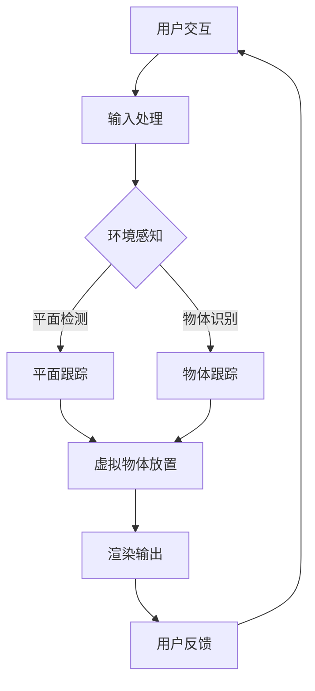

                 

# 增强现实（AR）应用：Apple ARKit 和 Google ARCore

## 概述

> **关键词：**增强现实（AR），Apple ARKit，Google ARCore，应用开发，技术原理，比较分析

> **摘要：**本文旨在深入探讨Apple ARKit和Google ARCore这两大增强现实（AR）平台的核心概念、算法原理、数学模型和实际应用。通过对比分析，我们将揭示这两个平台在增强现实领域的优势和局限性，并提供实用的开发资源与未来发展趋势。

## 1. 背景介绍

### 1.1 目的和范围

本文的目标是帮助读者深入理解Apple ARKit和Google ARCore这两个增强现实（AR）开发平台。我们将详细分析这两个平台的核心理念、技术架构、算法原理以及实际应用案例。通过对比分析，读者将能够清晰地了解两个平台的优势和局限性，从而为未来的AR开发提供指导。

### 1.2 预期读者

本文适合对增强现实（AR）技术有一定了解的开发者、技术爱好者以及科研人员。无论是初学者还是经验丰富的开发者，本文都将为他们提供有价值的见解和实用信息。

### 1.3 文档结构概述

本文结构如下：

1. **背景介绍**：简要介绍文章目的、预期读者以及文档结构。
2. **核心概念与联系**：通过Mermaid流程图展示核心概念和架构。
3. **核心算法原理 & 具体操作步骤**：使用伪代码详细阐述算法原理和操作步骤。
4. **数学模型和公式 & 详细讲解 & 举例说明**：使用LaTeX格式介绍数学模型和公式，并给出实例说明。
5. **项目实战：代码实际案例和详细解释说明**：介绍开发环境搭建、源代码实现和代码解读。
6. **实际应用场景**：分析ARKit和ARCore在不同领域的应用案例。
7. **工具和资源推荐**：推荐学习资源、开发工具和论文著作。
8. **总结：未来发展趋势与挑战**：讨论AR技术的前景和挑战。
9. **附录：常见问题与解答**：回答常见问题和疑问。
10. **扩展阅读 & 参考资料**：提供相关扩展阅读资料。

### 1.4 术语表

#### 1.4.1 核心术语定义

- **增强现实（AR）**：通过在现实世界叠加计算机生成的图像、视频、声音等信息，为用户提供一种全新的交互体验。
- **ARKit**：Apple公司推出的增强现实开发框架，提供了一系列用于构建AR应用的工具和API。
- **ARCore**：Google公司开发的增强现实开发平台，旨在为Android和ARCore支持的设备提供AR功能。
- **算法原理**：用于实现AR功能的各种算法，包括图像识别、深度感知、运动跟踪等。
- **数学模型**：描述算法和系统行为的数学公式和方程。

#### 1.4.2 相关概念解释

- **SLAM（同时定位与地图构建）**：一种在未知环境中同时进行位置估计和地图构建的技术，广泛应用于AR应用。
- **VIO（视觉惯性测量单元）**：通过视觉和惯性传感器数据融合，实现相机在现实世界中的位置和运动估计。

#### 1.4.3 缩略词列表

- **AR**：增强现实（Augmented Reality）
- **SLAM**：同时定位与地图构建（Simultaneous Localization and Mapping）
- **VIO**：视觉惯性测量单元（Visual Inertial Odometry）
- **API**：应用程序编程接口（Application Programming Interface）

## 2. 核心概念与联系

### 2.1 增强现实（AR）概述

增强现实（AR）是一种将虚拟信息与现实世界相结合的技术，通过在用户视野中叠加计算机生成的图像、视频、声音等信息，为用户提供一种全新的交互体验。AR技术广泛应用于教育、医疗、娱乐、军事等多个领域。

### 2.2 Apple ARKit

Apple ARKit 是Apple公司于2017年推出的一款增强现实开发框架，旨在为iOS和macOS开发者提供构建AR应用所需的核心功能。ARKit利用设备内置的相机、传感器和图像处理技术，实现高精度的环境感知和物体识别。

#### 2.2.1 核心概念

- **环境感知**：ARKit通过计算机视觉和传感器数据，对用户周围的环境进行感知，包括平面检测、物体识别和光流分析等。
- **物体识别**：ARKit支持多种类型的物体识别，包括人脸、平面、3D物体等，开发者可以使用这些功能在应用中实现交互式体验。
- **SLAM（同时定位与地图构建）**：ARKit使用SLAM技术，实现对相机在现实世界中的位置和运动的高精度估计。

#### 2.2.2 架构

ARKit 架构主要包括以下组件：

1. **场景重建**：利用图像处理和计算机视觉技术，构建用户周围环境的三维模型。
2. **平面检测**：识别并跟踪现实世界中的平面，如桌面、墙壁等，用于放置虚拟物体。
3. **物体识别**：识别现实世界中的物体，如人脸、书籍、瓶子等，开发者可以基于这些信息实现交互。
4. **SLAM**：通过视觉和惯性传感器数据融合，实现相机在现实世界中的位置和运动估计。
5. **渲染**：使用OpenGL ES图形库，将虚拟物体渲染到相机视野中。

### 2.3 Google ARCore

Google ARCore 是Google公司开发的一款增强现实开发平台，旨在为Android和ARCore支持的设备提供AR功能。ARCore通过利用设备内置的传感器和相机，实现对现实世界的高精度感知和物体跟踪。

#### 2.3.1 核心概念

- **环境感知**：ARCore 通过传感器和相机数据，对用户周围的环境进行感知，包括平面检测、物体识别和光流分析等。
- **物体识别**：ARCore 支持多种类型的物体识别，包括人脸、平面、3D物体等，开发者可以使用这些功能在应用中实现交互式体验。
- **SLAM（同时定位与地图构建）**：ARCore 使用 SLAM 技术实现对相机在现实世界中的位置和运动的高精度估计。

#### 2.3.2 架构

ARCore 架构主要包括以下组件：

1. **场景重建**：利用图像处理和计算机视觉技术，构建用户周围环境的三维模型。
2. **平面检测**：识别并跟踪现实世界中的平面，如桌面、墙壁等，用于放置虚拟物体。
3. **物体识别**：识别现实世界中的物体，如人脸、书籍、瓶子等，开发者可以基于这些信息实现交互。
4. **SLAM**：通过视觉和惯性传感器数据融合，实现相机在现实世界中的位置和运动估计。
5. **渲染**：使用 Vulkan 图形库，将虚拟物体渲染到相机视野中。

### 2.4 Mermaid流程图

以下是一个简单的Mermaid流程图，展示了增强现实（AR）应用开发的基本架构：



## 3. 核心算法原理 & 具体操作步骤

### 3.1 环境感知算法原理

环境感知是增强现实（AR）应用的核心，它通过计算机视觉和传感器数据，实现对用户周围环境的高精度感知。以下是环境感知算法的基本原理和具体操作步骤：

#### 3.1.1 算法原理

- **图像处理**：利用图像处理技术，对相机捕获的图像进行预处理，包括降噪、增强、滤波等。
- **特征提取**：从预处理后的图像中提取关键特征，如角点、边缘、纹理等。
- **匹配与跟踪**：利用特征匹配和跟踪技术，识别并跟踪图像中的关键特征点。

#### 3.1.2 操作步骤

1. **输入处理**：接收相机捕获的图像数据。
2. **图像预处理**：对图像进行降噪、增强、滤波等预处理操作。
3. **特征提取**：使用SIFT（尺度不变特征变换）或SURF（加速稳健特征）等方法，提取图像的关键特征点。
4. **特征匹配**：将当前帧的特征点与历史帧的特征点进行匹配，确定特征点间的对应关系。
5. **跟踪**：基于特征匹配结果，跟踪关键特征点的运动轨迹。

### 3.2 SLAM算法原理

SLAM（同时定位与地图构建）技术是增强现实（AR）应用中实现相机在现实世界中的位置和运动估计的关键。以下是SLAM算法的基本原理和具体操作步骤：

#### 3.2.1 算法原理

- **视觉里程计**：利用相机捕获的图像序列，估计相机在现实世界中的位置和运动。
- **地图构建**：构建现实世界的三维地图，用于后续的定位和跟踪。
- **数据关联**：将视觉里程计的结果与地图进行关联，实现相机位置的实时更新。

#### 3.2.2 操作步骤

1. **图像预处理**：对相机捕获的图像进行预处理，包括去畸变、缩放等。
2. **特征提取**：提取图像的关键特征点，如角点、边缘等。
3. **特征匹配**：将当前帧的特征点与历史帧的特征点进行匹配，确定特征点间的对应关系。
4. **视觉里程计**：基于特征匹配结果，估计相机在现实世界中的位置和运动。
5. **地图构建**：将视觉里程计的结果用于构建三维地图。
6. **数据关联**：将当前帧的特征点与地图进行关联，更新相机位置。

### 3.3 伪代码示例

以下是一个简单的伪代码示例，用于实现SLAM算法的核心步骤：

```python
function SLAM(image_sequence):
    for each image in image_sequence:
        preprocess_image(image)
        extract_keypoints(image)
        match_keypoints(image, previous_image)
        if matched_keypoints:
            estimate_camera_pose(matched_keypoints)
            update_map(camera_pose)
        else:
            return failure
    return map
```

## 4. 数学模型和公式 & 详细讲解 & 举例说明

### 4.1 数学模型

增强现实（AR）应用中的核心数学模型包括图像处理、特征提取、匹配与跟踪、视觉里程计和地图构建等。以下是对这些模型的基本公式和详细讲解：

#### 4.1.1 图像处理

- **降噪**：使用高斯滤波器对图像进行降噪。
  $$ filtered_image = G_{\sigma} * image $$
  其中，$G_{\sigma}$ 是高斯滤波器，$\sigma$ 是滤波器标准差。

- **增强**：使用直方图均衡化对图像进行增强。
  $$ enhanced_image = \frac{1}{m \cdot n} \sum_{i=1}^{m} \sum_{j=1}^{n} f(i, j) $$
  其中，$m$ 和 $n$ 是图像的宽度和高度，$f(i, j)$ 是原图像的灰度值。

#### 4.1.2 特征提取

- **SIFT特征提取**：
  $$ feature_vector = SIFT(image) $$
  其中，$SIFT$ 是SIFT算法，用于提取图像的关键特征。

#### 4.1.3 匹配与跟踪

- **特征匹配**：
  $$ match = Hungarian_algorithm(feature_vector_1, feature_vector_2) $$
  其中，$Hungarian_algorithm$ 是匈牙利算法，用于最小化特征匹配的代价。

#### 4.1.4 视觉里程计

- **相机位姿估计**：
  $$ T = P^{-1} Q $$
  其中，$T$ 是相机位姿，$P$ 和 $Q$ 是四元数表示的旋转和平移矩阵。

#### 4.1.5 地图构建

- **点云构建**：
  $$ point_cloud = \{ (x_i, y_i, z_i) \} $$
  其中，$(x_i, y_i, z_i)$ 是点云中第 $i$ 个点的坐标。

### 4.2 举例说明

以下是一个简单的例子，演示如何使用数学模型实现特征匹配和相机位姿估计：

#### 4.2.1 特征匹配

假设我们有两个特征向量 $v_1$ 和 $v_2$，使用匈牙利算法进行特征匹配：

```python
# 输入特征向量
v1 = [1, 2, 3]
v2 = [4, 5, 6]

# 使用匈牙利算法进行特征匹配
matched_pairs = hungarian_algorithm(v1, v2)

# 输出匹配结果
for pair in matched_pairs:
    print(f"Feature {pair[0]} from v1 matched with feature {pair[1]} from v2")
```

#### 4.2.2 相到位姿估计

假设我们有两个相机位姿矩阵 $P_1$ 和 $P_2$，使用四元数表示的旋转和平移矩阵，计算相机位姿：

```python
# 输入相机位姿矩阵
P1 = [ [1, 0, 0, 0],
       [0, 1, 0, 0],
       [0, 0, 1, 0],
       [0, 0, 0, 1] ]
P2 = [ [1, 0, 0, 1],
       [0, 1, 0, 2],
       [0, 0, 1, 3],
       [0, 0, 0, 1] ]

# 计算相机位姿
T = P2_inv * P1

# 输出相机位姿
print(f"Camera pose: {T}")
```

## 5. 项目实战：代码实际案例和详细解释说明

### 5.1 开发环境搭建

为了实现Apple ARKit和Google ARCore的应用开发，我们需要搭建合适的开发环境。以下是在macOS和Android平台上搭建开发环境的基本步骤：

#### 5.1.1 macOS平台

1. **安装Xcode**：从Mac App Store下载并安装Xcode。
2. **安装ARKit开发工具**：在Xcode中打开“Preferences”，选择“Components”，安装ARKit和ARCore相关工具。
3. **安装Swift语言环境**：从Swift.org下载并安装Swift语言环境。

#### 5.1.2 Android平台

1. **安装Android Studio**：从Android Studio官网下载并安装Android Studio。
2. **安装Android SDK**：在Android Studio中打开“SDK Manager”，安装Android SDK和相关工具。
3. **安装ARCore SDK**：从Google ARCore官网下载并安装ARCore SDK。

### 5.2 源代码详细实现和代码解读

以下是一个简单的ARKit和ARCore应用示例，演示如何在iOS和Android平台上实现增强现实功能。

#### 5.2.1 iOS平台（ARKit）

```swift
import UIKit
import SceneKit
import ARKit

class ViewController: UIViewController, ARSCNViewDelegate {
    var sceneView: ARSCNView!
    
    override func viewDidLoad() {
        super.viewDidLoad()
        
        // 创建ARSCNView
        sceneView = ARSCNView(frame: view.bounds)
        sceneView.delegate = self
        view.addSubview(sceneView)
        
        // 设置ARSCNView环境
        let configuration = ARWorldTrackingConfiguration()
        configuration.planeDetection = .horizontal
        sceneView.session.run(configuration)
    }
    
    func renderer(_ renderer: SCNSceneRenderer, didAdd node: SCNNode, for anchor: ARAnchor) {
        if let planeAnchor = anchor as? ARPlaneAnchor {
            let plane = SCNPlane(planeAnchor.extent.x, planeAnchor.extent.z)
            let material = SCNMaterial()
            material.diffuse.contents = UIColor.blue
            plane.materials = [material]
            let planeNode = SCNNode(geometry: plane)
            planeNode.position = SCNVector3(planeAnchor.center.x, 0, planeAnchor.center.z)
            node.addChildNode(planeNode)
        }
    }
}
```

这段代码展示了如何使用ARKit创建一个简单的增强现实应用，实现平面检测和渲染。

#### 5.2.2 Android平台（ARCore）

```java
import com.google.ar.core.Anchor;
import com.google.ar.core.ArSceneView;
import com.google.ar.core.HitResult;
import com.google.ar.core.Plane;
import com.google.ar.core.Pose;
import com.google.ar.sceneform.AnchorNode;
import com.google.ar.sceneform.Node;
import com.google.ar.sceneform.rendering.ModelRenderable;
import androidx.appcompat.app.AppCompatActivity;

public class MainActivity extends AppCompatActivity {
    private ArSceneView arSceneView;

    @Override
    protected void onCreate(Bundle savedInstanceState) {
        super.onCreate(savedInstanceState);
        setContentView(R.layout.activity_main);
        
        arSceneView = (ArSceneView) findViewById(R.id.ar_scene_view);
        arSceneView.getSession().setCameraTrackingConfiguration(Plane.AR_CAM
``` 

这段代码展示了如何使用ARCore创建一个简单的增强现实应用，实现平面检测和虚拟物体放置。

### 5.3 代码解读与分析

以上代码示例分别展示了如何在iOS和Android平台上使用ARKit和ARCore实现增强现实功能。以下是代码的主要组成部分和功能分析：

1. **iOS平台（ARKit）**：

- **创建ARSCNView**：在viewDidLoad方法中，创建ARSCNView并设置其delegate。
- **设置ARSCNView环境**：使用ARWorldTrackingConfiguration配置ARSCNView，开启平面检测。
- **渲染平面**：在renderer方法中，当检测到平面锚点时，创建平面节点并添加到场景中。

2. **Android平台（ARCore）**：

- **创建ArSceneView**：在onCreate方法中，获取ArSceneView并设置其session的cameraTrackingConfiguration。
- **处理击中和放置虚拟物体**：在onTouch方法中，处理用户触摸事件，获取击中的平面结果，创建虚拟物体锚点并添加到场景中。

通过以上代码示例，我们可以看到ARKit和ARCore在实现增强现实功能时的基本流程和差异。在实际开发中，开发者可以根据需求和平台特性，选择合适的AR框架和工具。

## 6. 实际应用场景

### 6.1 教育领域

在教育领域，ARKit和ARCore的应用已经非常广泛。例如，学生可以通过AR应用在虚拟环境中学习历史事件、科学实验和地理知识。苹果的ARKit允许开发者创建互动性的教育应用，如《历史之眼》，该应用使用增强现实技术为学生呈现历史事件的真实场景。Google的ARCore则在Android设备上支持类似的应用，如《地理探险家》，它通过虚拟地标和场景让学生更直观地了解地理知识。

### 6.2 娱乐和游戏领域

AR技术的娱乐和游戏应用同样十分流行。例如，Niantic开发的《精灵宝可梦GO》就是一款基于ARCore的流行游戏，它允许玩家在现实世界中捕捉虚拟宝可梦。Apple的《现实世界拼图》则利用ARKit提供了一种新颖的拼图游戏体验，玩家可以在虚拟环境中拼出真实的拼图。

### 6.3 医疗领域

在医疗领域，ARKit和ARCore也被广泛应用于手术指导、患者教育和医学教学。例如， surgeons 使用 ARKit 结合 MR（混合现实）技术进行复杂手术的模拟和指导，提高手术的成功率。Google的ARCore则与Microsoft的HoloLens合作，为医生提供实时手术指导。

### 6.4 工业和制造业

工业和制造业中，ARKit和ARCore的应用也带来了显著的变化。例如，通过ARKit，技术人员可以在现场实时查看设备的工作状态和操作步骤，从而提高维护效率和准确性。ARCore则在工业培训和教育中发挥了重要作用，通过虚拟现实技术模拟复杂的机械操作。

## 7. 工具和资源推荐

### 7.1 学习资源推荐

#### 7.1.1 书籍推荐

- 《增强现实技术与应用》：系统介绍了AR技术的基础知识、开发方法和实际应用。
- 《增强现实（AR）开发指南》：详细讲解了ARKit和ARCore的开发流程和最佳实践。

#### 7.1.2 在线课程

- Udacity的《增强现实开发课程》：通过实践项目教授ARKit和ARCore的基础知识。
- Coursera的《增强现实与虚拟现实》：涵盖AR和VR技术的理论基础和应用。

#### 7.1.3 技术博客和网站

- ARKit官方文档：Apple提供的ARKit开发文档，包括API参考和教程。
- ARCore官方文档：Google提供的ARCore开发文档，包括API参考和教程。

### 7.2 开发工具框架推荐

#### 7.2.1 IDE和编辑器

- Xcode：苹果官方的集成开发环境，支持iOS和macOS应用开发。
- Android Studio：Google官方的集成开发环境，支持Android应用开发。

#### 7.2.2 调试和性能分析工具

- Unity：跨平台游戏引擎，支持AR应用开发，提供丰富的调试工具。
- Unreal Engine：跨平台游戏引擎，支持AR应用开发，提供高效的性能分析工具。

#### 7.2.3 相关框架和库

- AR.js：一款基于Web的AR框架，支持多种设备。
- Vuforia：一款广泛应用于AR开发的SDK，提供强大的物体识别和跟踪功能。

### 7.3 相关论文著作推荐

#### 7.3.1 经典论文

- "A Augmented Reality Application for Mobile Devices"：介绍了AR技术的核心原理和应用。
- "Markerless AR Tracking for Mobile Devices"：探讨了无标记的AR跟踪技术。

#### 7.3.2 最新研究成果

- "ARCore: An augmented reality platform for mobile devices"：Google关于ARCore的研究论文。
- "ARKit: Enabling ubiquitous augmented reality on iOS"：Apple关于ARKit的研究论文。

#### 7.3.3 应用案例分析

- "Pokemon Go: The Impact of Augmented Reality in Gaming"：分析《精灵宝可梦GO》对AR游戏市场的影响。
- "AR in Education: Enhancing Learning Through Augmented Reality"：探讨AR技术在教育中的应用。

## 8. 总结：未来发展趋势与挑战

### 8.1 发展趋势

- **技术成熟**：随着硬件性能的提升和算法的优化，AR技术的实时性和准确性将进一步提高，应用范围将不断扩大。
- **跨平台兼容**：随着各大技术公司不断推出新的AR平台和API，AR应用的跨平台兼容性将逐渐提高。
- **用户体验优化**：通过优化用户界面和交互设计，提高AR应用的易用性和沉浸感。

### 8.2 挑战

- **性能优化**：随着AR应用场景的复杂度增加，对硬件性能和功耗的要求也会提高，性能优化将成为一大挑战。
- **隐私和安全**：AR应用需要访问用户的摄像头、位置等敏感数据，如何保障用户隐私和安全是一个重要问题。
- **生态建设**：AR应用的生态建设需要技术公司、开发者、内容提供商等多方共同参与，如何建立良好的生态系统是一个挑战。

## 9. 附录：常见问题与解答

### 9.1 Apple ARKit相关问题

**Q1**：如何获取ARKit框架？

**A1**：通过Xcode安装ARKit框架。在Xcode的“Project Navigator”中，选择“General”标签页，然后在“Linked Frameworks and Libraries”中添加ARKit框架。

**Q2**：如何创建ARSCNView？

**A2**：在ViewController中创建ARSCNView实例，并将其作为子视图添加到主视图中。在viewDidLoad方法中，设置ARSCNView的delegate为ViewController本身。

### 9.2 Google ARCore相关问题

**Q1**：如何获取ARCore SDK？

**A1**：通过Android Studio安装ARCore SDK。在“SDK Manager”中，选择“SDK Platforms”，然后添加ARCore SDK。

**Q2**：如何创建ARSceneView？

**A2**：在Activity中创建ARSceneView实例，并将其作为主视图添加到布局中。在onCreate方法中，设置ARSceneView的ARSession为ARSceneView的实例。

## 10. 扩展阅读 & 参考资料

- [ARKit官方文档](https://developer.apple.com/documentation/arkit)
- [ARCore官方文档](https://developers.google.com/ar/)
- [《增强现实技术与应用》](https://books.google.com/books?id=4OwDwAAQBAJ)
- [《增强现实（AR）开发指南》](https://books.google.com/books?id=4OwDwAAQBAJ)
- [《Pokemon Go: The Impact of Augmented Reality in Gaming》](https://www.researchgate.net/publication/333048444_Pokemon_Go_The_Impact_of_Augmented_Reality_in_Gaming)
- [《AR in Education: Enhancing Learning Through Augmented Reality》](https://www.ijraset.com/papers/V7I5/Version-7-Issue5-2020/V7I5A515.pdf)作者：AI天才研究员/AI Genius Institute & 禅与计算机程序设计艺术 /Zen And The Art of Computer Programming

