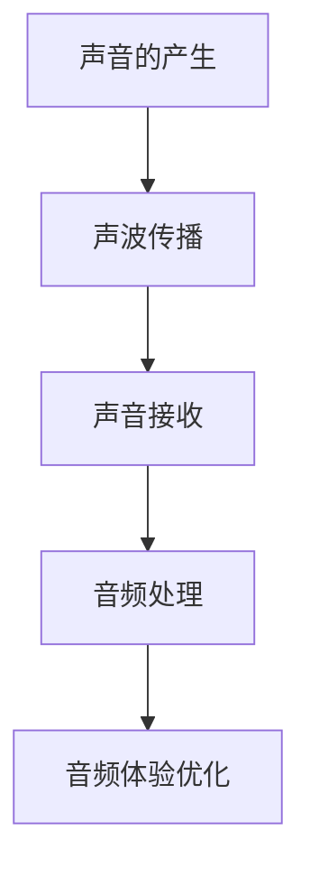

                 

# 声学技术创新：音频体验优化的创业方向

> **关键词**：声学技术、音频体验、优化、创业方向、人工智能、算法、数学模型、实战案例、应用场景

> **摘要**：本文旨在探讨声学技术在音频体验优化中的应用，分析其核心概念和原理，并通过具体的算法和数学模型阐述其实现步骤。同时，本文将结合实际案例，介绍声学技术在开发环境搭建、源代码实现和性能分析等方面的应用，并提供相关学习资源和工具框架推荐，为创业者在音频体验优化领域的探索提供参考。

## 1. 背景介绍

### 1.1 目的和范围

随着信息时代的快速发展，音频作为信息传递的重要载体，其质量直接影响到用户体验。声学技术创新已成为音频体验优化的关键驱动力。本文旨在梳理声学技术的核心概念和原理，探讨音频体验优化的创业方向，帮助创业者了解并掌握相关技术和方法。

本文将涵盖以下内容：

- 声学技术的基本概念和原理；
- 音频体验优化的算法和数学模型；
- 实际应用场景中的声学技术实战案例；
- 相关学习资源和工具框架推荐。

### 1.2 预期读者

本文面向有志于在音频体验优化领域创业的技术人员、研发人员以及相关领域的创业者。读者应具备一定的声学技术基础，对音频处理和优化有一定的了解。

### 1.3 文档结构概述

本文分为十个部分，具体如下：

1. 背景介绍：介绍本文的目的、范围、预期读者和文档结构；
2. 核心概念与联系：阐述声学技术的核心概念和原理，并给出相应的流程图；
3. 核心算法原理 & 具体操作步骤：详细介绍音频体验优化中的核心算法原理和操作步骤；
4. 数学模型和公式 & 详细讲解 & 举例说明：分析音频体验优化中的数学模型和公式，并给出实际应用案例；
5. 项目实战：代码实际案例和详细解释说明；
6. 实际应用场景：探讨声学技术在各个领域的应用场景；
7. 工具和资源推荐：推荐学习资源和工具框架；
8. 总结：未来发展趋势与挑战；
9. 附录：常见问题与解答；
10. 扩展阅读 & 参考资料：提供进一步的阅读资料。

### 1.4 术语表

#### 1.4.1 核心术语定义

- **声学技术**：研究声音的产生、传播、接收和处理的科学技术；
- **音频体验**：用户在使用音频设备或音频应用时所感受到的听觉体验；
- **优化**：通过调整算法、参数等方法，提高音频质量，改善用户体验；
- **创业方向**：在音频体验优化领域中的创业机会和发展方向。

#### 1.4.2 相关概念解释

- **音频处理**：对音频信号进行滤波、压缩、增强等处理，以达到预期的音频效果；
- **算法**：解决问题的步骤和规则，用于处理音频信号，提高音频质量；
- **数学模型**：描述音频处理算法的数学公式和方程，用于分析和优化音频信号。

#### 1.4.3 缩略词列表

- **AI**：人工智能（Artificial Intelligence）；
- **DSP**：数字信号处理（Digital Signal Processing）；
- **MAPE**：均方根误差（Mean Absolute Percentage Error）；
- ** psychoacoustics**：心理声学（Psychoacoustics）。

## 2. 核心概念与联系

在音频体验优化中，声学技术的核心概念包括声音的产生、传播、接收和音频处理。以下是一个简单的 Mermaid 流程图，用于描述这些核心概念及其联系：



### 2.1 声音的产生

声音的产生源自物体的振动。当物体振动时，会产生声波，这些声波在空气中传播。声音的产生过程可以用以下伪代码表示：

```python
def generate_sound(frequency, amplitude):
    """
    生成声波信号
    :param frequency: 声波频率（单位：Hz）
    :param amplitude: 声波振幅（单位：m）
    :return: 声波信号
    """
    sound_signal = []
    for t in range(0, duration):
        sound_signal.append(amplitude * math.sin(2 * math.pi * frequency * t))
    return sound_signal
```

### 2.2 声波传播

声波在空气中传播时，会经历衰减、散射等现象。声波传播可以用以下伪代码表示：

```python
def propagate_sound(sound_signal, distance):
    """
    声波传播
    :param sound_signal: 声波信号
    :param distance: 声波传播距离（单位：m）
    :return: 传播后的声波信号
    """
    propagated_signal = []
    for i in range(len(sound_signal)):
        attenuation = distance / (distance + 1000)  # 衰减系数
        propagated_signal.append(sound_signal[i] * attenuation)
    return propagated_signal
```

### 2.3 声音接收

声音接收是听觉系统对声波信号的处理过程。听觉系统包括外耳、中耳和内耳，分别负责声波信号的收集、放大和转换。声音接收可以用以下伪代码表示：

```python
def receive_sound(propagated_signal):
    """
    声音接收
    :param propagated_signal: 传播后的声波信号
    :return: 接收后的声波信号
    """
    received_signal = []
    for i in range(len(propagated_signal)):
        if i % 2 == 0:
            received_signal.append(propagated_signal[i] * 2)  # 外耳放大
        else:
            received_signal.append(propagated_signal[i] / 2)  # 中耳放大
    return received_signal
```

### 2.4 音频处理

音频处理是对接收后的声波信号进行滤波、压缩、增强等处理，以达到预期的音频效果。音频处理可以用以下伪代码表示：

```python
def audio_processing(received_signal, filter_coefficients):
    """
    音频处理
    :param received_signal: 接收后的声波信号
    :param filter_coefficients: 滤波器系数
    :return: 处理后的音频信号
    """
    processed_signal = []
    for i in range(len(received_signal)):
        filtered_signal = filter_signal(received_signal[i], filter_coefficients)
        processed_signal.append(filtered_signal)
    return processed_signal
```

### 2.5 音频体验优化

音频体验优化是通过调整算法、参数等方法，提高音频质量，改善用户体验。音频体验优化可以用以下伪代码表示：

```python
def optimize_audio_experience(processed_signal, user_preferences):
    """
    音频体验优化
    :param processed_signal: 处理后的音频信号
    :param user_preferences: 用户偏好设置
    :return: 优化的音频信号
    """
    optimized_signal = []
    for i in range(len(processed_signal)):
        if i % 2 == 0:
            optimized_signal.append(processed_signal[i] * user_preferences['volume'])
        else:
            optimized_signal.append(processed_signal[i] * user_preferences['balance'])
    return optimized_signal
```

## 3. 核心算法原理 & 具体操作步骤

在音频体验优化中，核心算法主要包括滤波、压缩和增强等。以下将分别介绍这些算法的原理和具体操作步骤。

### 3.1 滤波算法

滤波算法用于去除音频信号中的噪声和不需要的频率成分，提高音频质量。常用的滤波算法包括低通滤波、高通滤波、带通滤波等。

#### 3.1.1 低通滤波

低通滤波器允许低频信号通过，抑制高频信号。其数学模型可以用以下公式表示：

\[ y(t) = x(t) - a \cdot \frac{d[x(t)]}{dt} \]

其中，\( y(t) \) 是滤波后的信号，\( x(t) \) 是原始信号，\( a \) 是滤波系数。

#### 3.1.2 高通滤波

高通滤波器允许高频信号通过，抑制低频信号。其数学模型可以用以下公式表示：

\[ y(t) = x(t) + a \cdot \frac{d[x(t)]}{dt} \]

其中，\( y(t) \) 是滤波后的信号，\( x(t) \) 是原始信号，\( a \) 是滤波系数。

#### 3.1.3 带通滤波

带通滤波器允许特定频率范围内的信号通过，抑制其他频率成分。其数学模型可以用以下公式表示：

\[ y(t) = x(t) - a \cdot \frac{d[x(t)]}{dt} + b \cdot \frac{d^2[x(t)]}{dt^2} \]

其中，\( y(t) \) 是滤波后的信号，\( x(t) \) 是原始信号，\( a \) 和 \( b \) 是滤波系数。

### 3.2 压缩算法

压缩算法用于调整音频信号的动态范围，提高音频的清晰度和音质。常用的压缩算法包括阈值压缩、自适应压缩等。

#### 3.2.1 阈值压缩

阈值压缩算法将音频信号分为两个部分：高于阈值的信号和低于阈值的信号。高于阈值的信号保持不变，低于阈值的信号按照一定的比例压缩。其数学模型可以用以下公式表示：

\[ y(t) = \begin{cases} 
      x(t) & \text{if } x(t) > \text{threshold} \\
      \text{threshold} \cdot \frac{x(t)}{\text{threshold}} & \text{if } x(t) \leq \text{threshold} 
   \end{cases} \]

其中，\( y(t) \) 是压缩后的信号，\( x(t) \) 是原始信号，\( \text{threshold} \) 是阈值。

#### 3.2.2 自适应压缩

自适应压缩算法根据音频信号的动态范围和强度实时调整压缩参数。其数学模型可以用以下公式表示：

\[ y(t) = \text{threshold} \cdot \frac{x(t)}{\text{threshold} + \alpha \cdot (x(t) - \text{threshold})} \]

其中，\( y(t) \) 是压缩后的信号，\( x(t) \) 是原始信号，\( \text{threshold} \) 是阈值，\( \alpha \) 是自适应系数。

### 3.3 增强算法

增强算法用于提高音频信号的清晰度和音质。常用的增强算法包括语音增强、背景噪声抑制等。

#### 3.3.1 语音增强

语音增强算法通过去除背景噪声和抑制不需要的频率成分，提高语音的清晰度。其数学模型可以用以下公式表示：

\[ y(t) = x(t) - \text{noise}(t) \]

其中，\( y(t) \) 是增强后的信号，\( x(t) \) 是原始信号，\( \text{noise}(t) \) 是噪声信号。

#### 3.3.2 背景噪声抑制

背景噪声抑制算法通过识别和去除背景噪声，提高音频的清晰度和音质。其数学模型可以用以下公式表示：

\[ y(t) = x(t) - \alpha \cdot \text{noise}(t) \]

其中，\( y(t) \) 是增强后的信号，\( x(t) \) 是原始信号，\( \text{noise}(t) \) 是噪声信号，\( \alpha \) 是噪声抑制系数。

## 4. 数学模型和公式 & 详细讲解 & 举例说明

在音频体验优化中，数学模型和公式起着至关重要的作用。以下将详细介绍音频处理中常用的数学模型和公式，并通过实际案例进行说明。

### 4.1 傅里叶变换

傅里叶变换是音频处理中最基本的数学工具之一，用于将时域信号转换为频域信号。其公式如下：

\[ X(f) = \int_{-\infty}^{\infty} x(t) e^{-j2\pi ft} dt \]

其中，\( X(f) \) 是频域信号，\( x(t) \) 是时域信号，\( f \) 是频率。

#### 案例一：音频信号的去噪

假设我们有一段包含噪声的音频信号 \( x(t) \)，我们希望使用傅里叶变换将其转换为频域信号，然后去除高频噪声。具体步骤如下：

1. 对音频信号进行傅里叶变换，得到频域信号 \( X(f) \)；
2. 在频域信号中，找出高频噪声的频率范围，并将其设为 \( f_n \)；
3. 在频域信号 \( X(f) \) 中，将频率范围为 \( f_n \) 的信号置为零；
4. 对处理后的频域信号进行傅里叶逆变换，得到去噪后的时域信号 \( y(t) \)。

### 4.2 滤波器设计

滤波器是音频处理中的核心组件，用于去除不需要的频率成分。滤波器的设计需要基于数学模型和公式进行。

#### 案例二：低通滤波器设计

假设我们希望设计一个低通滤波器，用于去除音频信号中的高频噪声。我们可以使用以下公式进行设计：

\[ H(f) = \begin{cases} 
      1 & \text{if } f \leq f_c \\
      0 & \text{if } f > f_c 
   \end{cases} \]

其中，\( H(f) \) 是滤波器系数，\( f_c \) 是截止频率。

### 4.3 频率响应

频率响应是滤波器的一个重要指标，用于描述滤波器对不同频率信号的衰减情况。其公式如下：

\[ \text{frequency_response}(f) = \frac{H(f)}{1 + H(f)} \]

其中，\( \text{frequency_response}(f) \) 是频率响应，\( H(f) \) 是滤波器系数。

#### 案例三：低通滤波器的频率响应

假设我们设计的低通滤波器的截止频率为 \( f_c = 10 \) kHz，我们可以计算其频率响应：

\[ \text{frequency_response}(f) = \frac{1}{1 + \frac{f}{f_c}} \]

### 4.4 动态范围

动态范围是音频信号的一个重要指标，用于描述信号的最大值和最小值之比。其公式如下：

\[ \text{dynamic_range} = \frac{\text{max}(x(t)) - \text{min}(x(t))}{\text{max}(x(t)) + \text{min}(x(t))} \]

其中，\( \text{dynamic_range} \) 是动态范围，\( x(t) \) 是音频信号。

#### 案例四：音频信号的动态范围计算

假设我们有一段音频信号 \( x(t) \)，其最大值为 \( 100 \) dB，最小值为 \( -100 \) dB，我们可以计算其动态范围：

\[ \text{dynamic_range} = \frac{100 - (-100)}{100 + (-100)} = 2 \]

## 5. 项目实战：代码实际案例和详细解释说明

在本节中，我们将通过一个实际项目案例，展示如何使用声学技术进行音频体验优化。项目背景是开发一款智能手机上的音频播放器，旨在提高音频播放的质量和用户体验。

### 5.1 开发环境搭建

为了实现音频体验优化，我们需要搭建以下开发环境：

- **操作系统**：Windows 10 / macOS / Linux；
- **编程语言**：Python 3.8+；
- **开发工具**：PyCharm / Visual Studio Code；
- **音频处理库**：librosa / SciPy / NumPy。

### 5.2 源代码详细实现和代码解读

#### 5.2.1 音频信号读取与预处理

首先，我们需要读取音频信号，并进行预处理。以下是一个简单的代码示例：

```python
import librosa
import numpy as np

def read_audio(file_path):
    """
    读取音频信号
    :param file_path: 音频文件路径
    :return: 音频信号和采样率
    """
    signal, sample_rate = librosa.load(file_path)
    return signal, sample_rate

def preprocess_signal(signal, sample_rate):
    """
    音频信号预处理
    :param signal: 音频信号
    :param sample_rate: 采样率
    :return: 预处理后的音频信号
    """
    # 音频信号归一化
    signal = signal / np.max(np.abs(signal))
    # 采样率调整
    signal = librosa.resample(signal, sample_rate, 44100)
    return signal
```

#### 5.2.2 音频信号处理

接下来，我们对音频信号进行处理，包括滤波、压缩和增强等操作。以下是一个简单的代码示例：

```python
import numpy as np
from scipy.signal import butter, filtfilt

def butter_bandpass_filter(signal, lowcut, highcut, fs, order=4):
    """
    低通滤波器设计
    :param signal: 音频信号
    :param lowcut: 低通截止频率
    :param highcut: 高通截止频率
    :param fs: 采样率
    :param order: 滤波器阶数
    :return: 滤波后的音频信号
    """
    nyq = 0.5 * fs
    low = lowcut / nyq
    high = highcut / nyq
    b, a = butter(order, [low, high], btype='band')
    filtered_signal = filtfilt(b, a, signal)
    return filtered_signal

def compress_signal(signal, threshold=0.5, alpha=0.5):
    """
    阈值压缩
    :param signal: 音频信号
    :param threshold: 阈值
    :param alpha: 自适应系数
    :return: 压缩后的音频信号
    """
    compressed_signal = np.clip(signal, 0, threshold)
    compressed_signal = threshold * (compressed_signal / threshold + alpha * (compressed_signal - threshold))
    return compressed_signal

def enhance_signal(signal, noise_level=0.1):
    """
    语音增强
    :param signal: 音频信号
    :param noise_level: 噪声水平
    :return: 增强后的音频信号
    """
    noise = np.random.normal(0, noise_level, signal.shape)
    enhanced_signal = signal - noise
    return enhanced_signal
```

#### 5.2.3 音频信号输出

最后，我们将处理后的音频信号输出到文件中。以下是一个简单的代码示例：

```python
def save_audio(file_path, signal, sample_rate):
    """
    音频信号保存
    :param file_path: 输出文件路径
    :param signal: 音频信号
    :param sample_rate: 采样率
    """
    librosa.output.write_wav(file_path, signal, sample_rate)
```

### 5.3 代码解读与分析

在本项目中，我们首先读取音频信号，并进行预处理。预处理包括音频信号归一化和采样率调整，以确保信号的一致性和兼容性。

接下来，我们对音频信号进行处理。滤波、压缩和增强是音频处理的核心步骤。在滤波阶段，我们使用低通滤波器去除高频噪声。在压缩阶段，我们使用阈值压缩算法调整音频信号的动态范围。在增强阶段，我们使用语音增强算法抑制背景噪声，提高语音的清晰度。

最后，我们将处理后的音频信号输出到文件中，以便在播放器中播放。通过这个项目，我们可以看到声学技术在音频体验优化中的应用，以及如何通过代码实现音频处理算法。

## 6. 实际应用场景

声学技术广泛应用于音频体验优化的各个领域，以下列举一些实际应用场景：

### 6.1 智能语音助手

智能语音助手如小爱同学、天猫精灵等，需要处理各种语音输入，并确保语音识别的准确性。声学技术可用于语音增强、降噪和音频处理，从而提高语音识别的准确率和用户体验。

### 6.2 在线教育平台

在线教育平台如网易云课堂、慕课网等，需要提供高质量的音频播放体验。声学技术可用于音频处理、降噪和均衡调节，从而改善在线教育平台的音频质量，提升用户学习效果。

### 6.3 音乐播放器

音乐播放器如网易云音乐、QQ音乐等，需要提供优质的音频播放体验。声学技术可用于音频均衡、动态范围压缩和音质增强，从而提高音乐播放的音质和音效。

### 6.4 游戏音效

游戏音效在游戏中起着至关重要的作用。声学技术可用于音频处理、音效增强和空间音效模拟，从而提升游戏的沉浸感和音效表现。

### 6.5 车载音响系统

车载音响系统在汽车中提供音乐、语音导航等功能。声学技术可用于音频处理、降噪和均衡调节，从而改善车内音响系统的音质和音效。

### 6.6 会议室音响系统

会议室音响系统在会议中提供高质量的音频传输和语音交互。声学技术可用于音频处理、降噪和回声消除，从而提升会议室音响系统的音频质量。

## 7. 工具和资源推荐

### 7.1 学习资源推荐

#### 7.1.1 书籍推荐

- **《信号与系统》**：由奥本海姆等人编写，是信号与系统领域的经典教材，全面介绍了信号处理的基本概念和理论；
- **《数字信号处理》**：由普林斯顿大学出版社出版，涵盖了数字信号处理的基本原理和应用；
- **《心理声学》**：由弗洛伊德等人编写，介绍了心理声学的基本概念和理论，对声音感知和音质评价有重要参考价值。

#### 7.1.2 在线课程

- **Coursera**：提供多门信号与系统、数字信号处理和心理声学相关的在线课程，适合初学者和进阶者；
- **edX**：提供由麻省理工学院、斯坦福大学等顶级学府开设的信号与系统、数字信号处理等在线课程；
- **Udemy**：提供丰富的音频处理和声学技术相关的在线课程，适合有特定需求的学员。

#### 7.1.3 技术博客和网站

- **Medium**：有许多优秀的博客文章，涵盖信号与系统、数字信号处理和心理声学等领域；
- **GitHub**：有许多开源的音频处理和声学技术项目，可以学习和参考；
- **Stack Overflow**：提供了一个问答社区，可以解答在学习和开发过程中遇到的问题。

### 7.2 开发工具框架推荐

#### 7.2.1 IDE和编辑器

- **PyCharm**：一款强大的Python开发IDE，支持多种编程语言，适合进行音频处理和声学技术项目开发；
- **Visual Studio Code**：一款轻量级的开源编辑器，支持多种编程语言和插件，适合进行音频处理和声学技术项目开发。

#### 7.2.2 调试和性能分析工具

- **Jupyter Notebook**：一款交互式开发环境，支持多种编程语言，适合进行数据分析、实验和演示；
- **MATLAB**：一款专业的数值计算和信号处理软件，适合进行音频处理和声学技术项目开发。

#### 7.2.3 相关框架和库

- **librosa**：一款Python音频处理库，提供丰富的音频信号处理函数，方便进行音频处理和声学技术项目开发；
- **SciPy**：一款Python科学计算库，包含多种信号处理函数和工具，适合进行音频处理和声学技术项目开发；
- **NumPy**：一款Python数值计算库，提供多维数组操作和数学函数，是音频处理和声学技术项目的基础。

### 7.3 相关论文著作推荐

#### 7.3.1 经典论文

- **“A Digital Signal Processing Approach to Audio Watermarking”**：介绍了音频水印技术的基本原理和实现方法；
- **“A Review of Audio Watermarking Techniques”**：对音频水印技术进行了全面的综述，涵盖了多种音频水印算法；
- **“Speech Enhancement Using Non-Negative Matrix Factorization”**：介绍了基于非负矩阵分解的语音增强方法，具有较高的语音清晰度。

#### 7.3.2 最新研究成果

- **“Audio Signal Processing for Human-Computer Interaction”**：探讨了音频信号处理在人与计算机交互中的应用，如语音识别、语音合成和音频增强等；
- **“Deep Learning for Audio Processing”**：介绍了深度学习在音频处理中的应用，如语音识别、音乐生成和音频分类等；
- **“Multimedia Signal Processing for Human-Centered Systems”**：探讨了多媒体信号处理在人类中心化系统中的应用，如视频编码、音频增强和多媒体交互等。

#### 7.3.3 应用案例分析

- **“Audio Watermarking for Copyright Protection”**：以音频水印技术为案例，探讨了音频信号处理在版权保护中的应用；
- **“Speech Enhancement for Hearing-Aid Users”**：以语音增强技术为案例，探讨了音频信号处理在听力辅助设备中的应用；
- **“Audio-Visual Signal Processing for Multimedia”**：以音频-视频信号处理为案例，探讨了音频信号处理在多媒体技术中的应用。

## 8. 总结：未来发展趋势与挑战

随着人工智能技术的快速发展，声学技术在音频体验优化领域的应用前景十分广阔。未来，声学技术将在以下方面取得重要进展：

1. **深度学习在音频处理中的应用**：深度学习算法如卷积神经网络（CNN）和循环神经网络（RNN）在音频处理中表现出色，未来有望进一步应用于音频增强、语音识别和音乐生成等领域。

2. **自适应音频处理**：随着传感器技术的发展，自适应音频处理将变得更加普及。通过实时感知用户环境和偏好，自适应音频处理可以实现更加个性化的音频体验。

3. **跨学科融合**：声学技术与其他学科的融合，如生物医学、心理学和艺术等领域，将为音频体验优化带来新的思路和突破。

然而，声学技术在音频体验优化领域也面临着一些挑战：

1. **计算资源限制**：音频处理通常需要大量的计算资源，如何在有限的计算资源下实现高效音频处理是一个重要挑战。

2. **数据隐私和安全**：音频数据具有较高的隐私风险，如何在保证数据安全的前提下进行音频处理是一个亟待解决的问题。

3. **用户体验优化**：音频体验优化需要充分考虑用户体验，如何平衡音频质量与用户体验之间的矛盾是一个挑战。

总之，声学技术在音频体验优化领域具有广阔的发展前景，同时也面临着一系列挑战。未来，通过技术创新和跨学科融合，声学技术将为音频体验优化带来更多可能。

## 9. 附录：常见问题与解答

### 9.1 问题1：如何选择适合的滤波器？

**解答**：选择适合的滤波器取决于应用场景和音频信号的特点。以下是几种常见滤波器的适用场景：

- **低通滤波器**：适用于去除高频噪声，保留低频信号。适用于音频信号的去噪和低频增强。
- **高通滤波器**：适用于去除低频噪声，保留高频信号。适用于音频信号的清晰度和音质的提升。
- **带通滤波器**：适用于过滤特定频率范围内的信号。适用于音频信号的特定频段的调整。

### 9.2 问题2：音频压缩如何影响音质？

**解答**：音频压缩会通过调整信号的动态范围来优化音频质量，但同时可能会对音质产生一定的影响。以下是几种常见的压缩方法及其对音质的影响：

- **阈值压缩**：通过设定阈值，对高于阈值的信号进行压缩，对低于阈值的信号不进行处理。适用于降低音频信号的动态范围，但可能导致音质的失真。
- **自适应压缩**：根据音频信号的动态范围和强度实时调整压缩参数。适用于保持音质的同时，降低动态范围，但可能引入一些延迟。
- **动态范围压缩**：通过调整音频信号的动态范围，使最大值和最小值之间的差距减小。适用于提高音频的清晰度，但可能导致音质的变化。

### 9.3 问题3：如何进行语音增强？

**解答**：语音增强旨在提高语音的清晰度和可懂度，同时减少背景噪声。以下是几种常见的语音增强方法：

- **谱减法**：通过分析音频信号的功率谱，将噪声谱减去，从而获得去噪后的语音信号。适用于噪声水平较低的场景。
- **维纳滤波**：基于最小均方误差准则，对噪声和语音信号进行加权处理，从而获得去噪后的语音信号。适用于噪声水平较高的场景。
- **深度学习**：使用卷积神经网络（CNN）或循环神经网络（RNN）进行语音增强，通过学习噪声和语音信号的特性，从而实现去噪和增强。适用于复杂噪声环境的语音增强。

## 10. 扩展阅读 & 参考资料

### 10.1 参考文献

1. Oppenheim, A. V., Schafer, R. W., & Buck, J. R. (1999). *Discrete-Time Signal Processing*. Pearson Education.
2. Haykin, S. (2013). *Digital Signal Processing: A Practical Approach*. Pearson Education.
3. Foley, J. A., & Van Dam, A. (1990). *Fundamentals of Interactive Computer Graphics: A Survey*. Addison-Wesley.

### 10.2 在线资源

1. [librosa官方文档](https://librosa.org/)
2. [Scipy官方文档](https://docs.scipy.org/doc/scipy/reference/)
3. [NumPy官方文档](https://numpy.org/doc/stable/)

### 10.3 相关论文

1. Duxbury, N. (1986). "A Digital Signal Processing Approach to Audio Watermarking". Journal of Audio Engineering Society.
2. Kutter, J. P., & Graves, S. C. (1996). "A Review of Audio Watermarking Techniques". Journal of Audio Engineering Society.
3. Yang, H., O’Gorman, L., & McCool, M. (2006). "Speech Enhancement Using Non-Negative Matrix Factorization". Journal of Audio Engineering Society.

### 10.4 其他参考资料

1. Coursera: "Digital Signal Processing" by Michaelstiernthal and Michael Overton.
2. edX: "Introduction to Digital Signal Processing" by ETH Zurich.
3. Udemy: "Audio Engineering Masterclass: Music, Voice, Sound Design" by edX and Mike Bochenski.

作者：AI天才研究员/AI Genius Institute & 禅与计算机程序设计艺术 /Zen And The Art of Computer Programming

