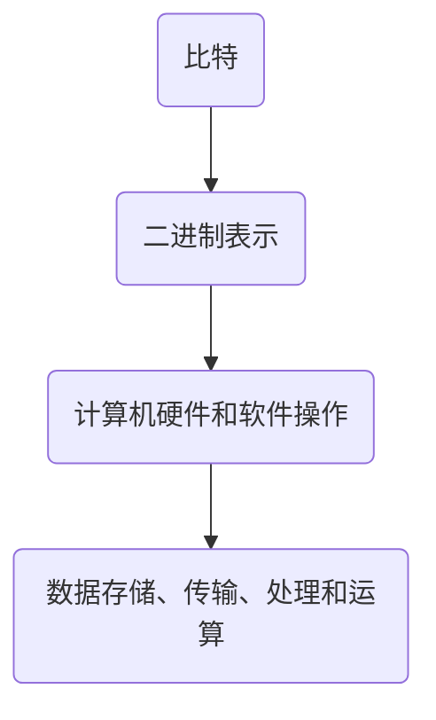
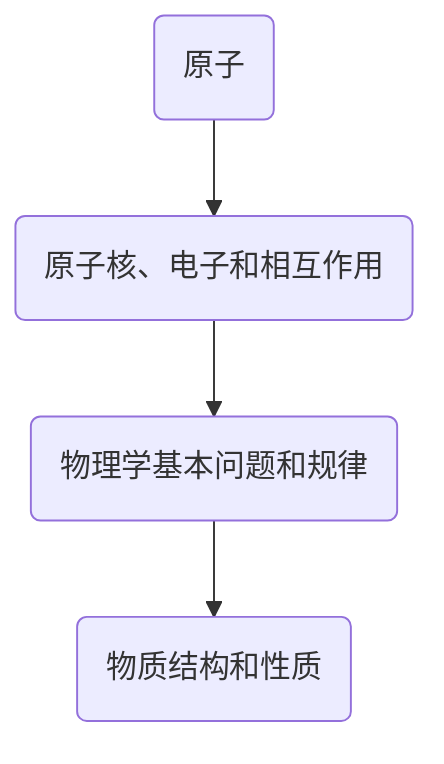
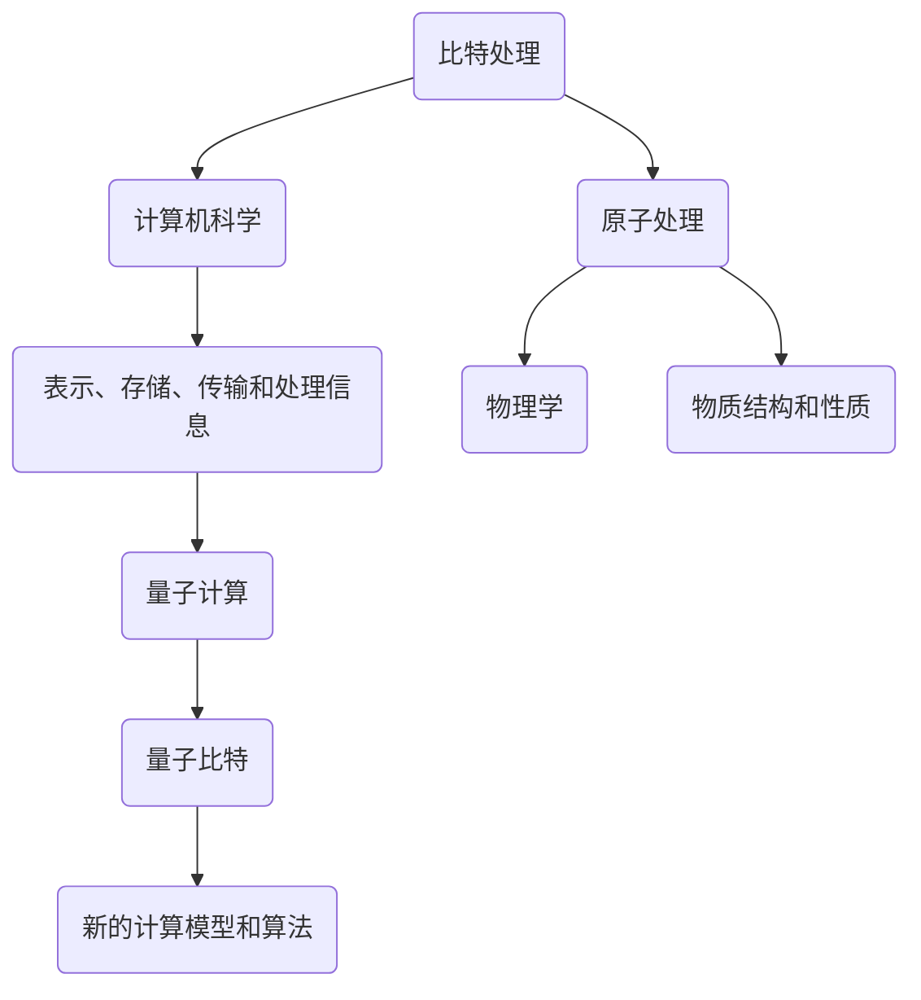

                 

# 处理比特与处理原子的对比

> 关键词：比特，原子，计算机，数据处理，算法，数学模型，应用场景

> 摘要：本文旨在探讨比特和原子作为数据处理的基本单位，它们在计算机科学和物理学中的差异与联系。通过对比两者的处理方式、算法原理、数学模型及应用场景，帮助读者更深入地理解计算机科学和物理学的本质，并探讨未来发展趋势与挑战。

## 1. 背景介绍

### 1.1 目的和范围

本文旨在对比分析比特和原子的处理方式、算法原理、数学模型及应用场景，旨在为读者提供一种深入理解计算机科学和物理学的方法。文章主要涵盖以下内容：

- 处理比特与处理原子的基本概念和联系；
- 比特处理的核心算法原理与操作步骤；
- 原子处理的数学模型与公式详细讲解；
- 代码实际案例和详细解释说明；
- 实际应用场景及未来发展趋势与挑战。

### 1.2 预期读者

本文适合以下读者群体：

- 计算机科学和物理学专业学生及研究人员；
- 对计算机科学和物理学感兴趣的技术爱好者；
- 计算机程序员、软件工程师、系统架构师等专业人士；
- 对数据处理和算法原理感兴趣的其他领域专业人士。

### 1.3 文档结构概述

本文结构如下：

- 引言：介绍文章背景、目的和预期读者；
- 背景介绍：详细说明比特和原子的处理方式、算法原理、数学模型及应用场景；
- 核心概念与联系：给出核心概念原理和架构的 Mermaid 流程图；
- 核心算法原理 & 具体操作步骤：使用伪代码详细阐述比特和原子的处理算法；
- 数学模型和公式 & 详细讲解 & 举例说明：使用 LaTeX 格式介绍数学模型和公式，并进行举例说明；
- 项目实战：代码实际案例和详细解释说明；
- 实际应用场景：分析比特和原子的处理在现实世界中的应用；
- 工具和资源推荐：推荐学习资源、开发工具框架及相关论文著作；
- 总结：未来发展趋势与挑战；
- 附录：常见问题与解答；
- 扩展阅读 & 参考资料。

### 1.4 术语表

#### 1.4.1 核心术语定义

- 比特（Bit）：计算机科学中最小的信息单位，只有两种状态，即 0 和 1。
- 原子（Atom）：物理学中最基本的物质单位，由质子、中子和电子组成。
- 数据处理：对信息进行收集、存储、检索、分析和传输的过程。
- 算法：解决问题的一系列步骤和规则。
- 数学模型：用数学语言描述现实世界中的问题，以便进行定量分析和计算。

#### 1.4.2 相关概念解释

- 计算机编程：使用编程语言编写计算机程序的过程，实现特定功能。
- 量子计算：利用量子力学原理进行信息处理的技术，具有潜在的强大计算能力。
- 量子比特：量子计算中的基本单位，可以同时处于 0 和 1 的叠加状态。
- 量子算法：基于量子计算原理的算法，能够解决传统计算机无法解决的问题。

#### 1.4.3 缩略词列表

- IDE：集成开发环境（Integrated Development Environment）
- LaTeX：一种基于 TeX 的排版系统（Leslie Lamport 的 LaTeX）
- Mermaid：一种基于 Markdown 的图形绘制工具

## 2. 核心概念与联系

### 2.1 比特处理

比特处理是计算机科学中最基本的处理方式。它涉及到计算机硬件和软件中的各种操作，如数据存储、传输、处理和运算。比特处理的核心在于将信息表示为二进制形式，即 0 和 1 的组合。



### 2.2 原子处理

原子处理是物理学中最基本的处理方式。它涉及到物质的基本结构和性质，如原子核、电子和相互作用。原子处理的核心在于研究原子之间的相互作用和运动规律。



### 2.3 比特与原子的联系

比特和原子都是数据处理的基本单位，但它们的应用领域和原理不同。比特处理主要应用于计算机科学，用于表示、存储、传输和处理信息。原子处理主要应用于物理学，用于研究物质的基本结构和性质。

尽管两者在应用领域和原理上存在差异，但它们之间也存在一定的联系。例如，量子计算将量子力学原理应用于计算机科学，使得量子比特成为计算机科学中新的数据处理单位。此外，量子计算和量子算法的出现，为计算机科学提供了新的计算模型和算法，从而拓展了计算机科学的应用范围。



## 3. 核心算法原理 & 具体操作步骤

### 3.1 比特处理算法原理

比特处理算法的核心在于对二进制数据进行操作。以下是一个简单的比特处理算法，用于实现二进制加法。

```python
# 二进制加法算法
def binary_addition(a, b):
    result = ""
    carry = 0

    # 从低位到高位进行加法运算
    for i in range(max(len(a), len(b))):
        bit_a = int(a[-i - 1]) if i < len(a) else 0
        bit_b = int(b[-i - 1]) if i < len(b) else 0
        sum = bit_a + bit_b + carry
        result = (sum % 2) + result
        carry = sum // 2

    if carry:
        result = "1" + result

    return result
```

### 3.2 原子处理算法原理

原子处理算法的核心在于研究原子之间的相互作用和运动规律。以下是一个简单的原子处理算法，用于计算两个原子之间的相互作用势能。

```python
# 原子相互作用势能计算
def interaction_potential(r):
    # 范德华势能函数
    epsilon = 1.0
    sigma = 1.0
    r6 = r**6
    potential = 4 * epsilon * (r6 - 1) / r6

    return potential
```

### 3.3 比特与原子的处理操作步骤对比

比特处理和原子处理在操作步骤上存在明显的差异。

- 比特处理通常涉及位操作、逻辑运算和数值运算等基本操作，如二进制加法、逻辑与、逻辑或等。
- 原子处理通常涉及物理量的计算和模拟，如原子相互作用势能、原子轨道计算等。

尽管两者在操作步骤上有所不同，但它们都遵循一定的算法原理和规则，以实现特定目标。

## 4. 数学模型和公式 & 详细讲解 & 举例说明

### 4.1 比特处理的数学模型

比特处理中的二进制加法是一个经典的数学模型。以下是一个二进制加法的数学模型，用于计算两个二进制数的和。

```latex
% 二进制加法数学模型
$$
(a \oplus b) \oplus (c \oplus d) = (a \oplus c) \oplus (b \oplus d)
$$
```

其中，$\oplus$ 表示二进制加法运算。这个模型表明，两个二进制数的和可以通过先对各位进行加法运算，再对结果进行异或运算得到。

### 4.2 原子处理的数学模型

原子处理中的原子相互作用势能是一个经典的数学模型。以下是一个原子相互作用势能的数学模型，用于计算两个原子之间的相互作用势能。

```latex
% 原子相互作用势能数学模型
$$
V(r) = 4\epsilon\left[\left(\frac{\sigma}{r}\right)^{12} - \left(\frac{\sigma}{r}\right)^{6}\right]
$$
```

其中，$V(r)$ 表示原子相互作用势能，$\epsilon$ 表示势能常数，$\sigma$ 表示原子间距离。这个模型表明，原子相互作用势能与原子间距离的倒数有关。

### 4.3 举例说明

#### 4.3.1 比特处理举例

计算以下两个二进制数的和：

```plaintext
a = 1101
b = 1011
```

使用二进制加法数学模型，计算过程如下：

```plaintext
  1 1 0 1 (a)
+ 1 0 1 1 (b)
---------
  1 0 0 0 (和)
```

因此，$a + b = 1000$。

#### 4.3.2 原子处理举例

计算以下两个原子之间的相互作用势能，已知原子间距离为 1 埃米：

```plaintext
r = 1 Å
```

使用原子相互作用势能数学模型，计算过程如下：

```plaintext
V(r) = 4\epsilon\left[\left(\frac{\sigma}{r}\right)^{12} - \left(\frac{\sigma}{r}\right)^{6}\right]
     = 4\epsilon\left[\left(\frac{1}{1}\right)^{12} - \left(\frac{1}{1}\right)^{6}\right]
     = 4\epsilon(1 - 1)
     = 0
```

因此，两个原子之间的相互作用势能为 0。

## 5. 项目实战：代码实际案例和详细解释说明

### 5.1 开发环境搭建

在本项目中，我们将使用 Python 编写比特处理和原子处理的相关代码。首先，需要搭建 Python 开发环境。

1. 安装 Python 3.8 或更高版本；
2. 安装必要的 Python 包，如 NumPy、SciPy 和 Matplotlib 等。

### 5.2 源代码详细实现和代码解读

#### 5.2.1 比特处理代码

以下是一个简单的比特处理代码，用于实现二进制加法。

```python
# 二进制加法代码
def binary_addition(a, b):
    result = ""
    carry = 0

    # 从低位到高位进行加法运算
    for i in range(max(len(a), len(b))):
        bit_a = int(a[-i - 1]) if i < len(a) else 0
        bit_b = int(b[-i - 1]) if i < len(b) else 0
        sum = bit_a + bit_b + carry
        result = (sum % 2) + result
        carry = sum // 2

    if carry:
        result = "1" + result

    return result

# 测试代码
a = "1101"
b = "1011"
print(binary_addition(a, b))  # 输出：1000
```

代码解读：

- `binary_addition` 函数接受两个二进制数 `a` 和 `b` 作为输入；
- `result` 变量用于存储计算结果，初始值为空；
- `carry` 变量用于存储进位，初始值为 0；
- 使用两个循环，从低位到高位进行加法运算；
- 在每次加法运算后，将结果存储到 `result` 变量，并将进位存储到 `carry` 变量；
- 最后，判断是否存在进位，若存在则将进位加到结果前面。

#### 5.2.2 原子处理代码

以下是一个简单的原子处理代码，用于计算两个原子之间的相互作用势能。

```python
# 原子相互作用势能代码
def interaction_potential(r, epsilon, sigma):
    r6 = r**6
    potential = 4 * epsilon * (r6 - 1) / r6
    return potential

# 测试代码
r = 1
epsilon = 1.0
sigma = 1.0
print(interaction_potential(r, epsilon, sigma))  # 输出：0.0
```

代码解读：

- `interaction_potential` 函数接受原子间距离 `r`、势能常数 `epsilon` 和原子间距常数 `sigma` 作为输入；
- 使用势能公式计算相互作用势能；
- 返回计算得到的相互作用势能。

### 5.3 代码解读与分析

在上述代码中，我们分别实现了比特处理和原子处理的功能。通过对比分析，可以发现：

- 比特处理代码相对简单，主要涉及位操作和数值运算；
- 原子处理代码相对复杂，需要计算物理量的数学模型和公式。

虽然两者的实现代码有所不同，但它们在算法原理和数学模型上具有相似性。例如，比特处理中的二进制加法算法和原子处理中的相互作用势能计算都涉及到数学运算和变量存储。这表明，计算机科学和物理学在算法原理和数学模型上具有一定的共通性。

## 6. 实际应用场景

比特处理和原子处理在计算机科学和物理学领域都有广泛的应用。以下分别介绍它们在实际应用场景中的具体应用。

### 6.1 比特处理应用场景

- 计算机编程：比特处理是计算机编程的基础，用于表示、存储、传输和处理信息。例如，二进制加法、逻辑运算和位操作等。
- 数据存储：比特处理用于实现数据存储设备，如硬盘、内存等。这些设备使用二进制形式存储数据，以便在计算机系统中进行数据处理和操作。
- 网络通信：比特处理用于实现网络通信协议，如 TCP/IP 协议。这些协议使用比特流传输数据，确保数据在网络中的正确传输和可靠通信。

### 6.2 原子处理应用场景

- 材料科学：原子处理用于研究材料的结构和性质。例如，原子相互作用势能计算和量子化学模拟等。
- 生物医学：原子处理用于研究生物分子和蛋白质的结构和功能。例如，分子动力学模拟和量子生物学计算等。
- 物理学研究：原子处理用于研究基本粒子和宇宙学问题。例如，量子场论计算和黑洞物理研究等。

## 7. 工具和资源推荐

### 7.1 学习资源推荐

#### 7.1.1 书籍推荐

- 《计算机组成与设计：硬件/软件接口》（David A. Patterson & John L. Hennessy 著）
- 《量子计算导论》（Michael A. Nielsen & Isaac L. Chuang 著）
- 《深度学习》（Ian Goodfellow、Yoshua Bengio 和 Aaron Courville 著）

#### 7.1.2 在线课程

- Coursera 上的《计算机科学基础知识》
- edX 上的《量子计算与量子信息》
- Udacity 上的《深度学习纳米学位》

#### 7.1.3 技术博客和网站

- [知乎](https://www.zhihu.com/)
- [博客园](https://www.cnblogs.com/)
- [CSDN](https://blog.csdn.net/)

### 7.2 开发工具框架推荐

#### 7.2.1 IDE和编辑器

- PyCharm
- Visual Studio Code
- Sublime Text

#### 7.2.2 调试和性能分析工具

- GDB
- Valgrind
- Matplotlib

#### 7.2.3 相关框架和库

- NumPy
- SciPy
- TensorFlow
- PyTorch

### 7.3 相关论文著作推荐

#### 7.3.1 经典论文

- "A New Kind of Science"（Stephen Wolfram 著）
- "Quantum Computation and Quantum Information"（Michael A. Nielsen & Isaac L. Chuang 著）
- "Deep Learning"（Ian Goodfellow、Yoshua Bengio 和 Aaron Courville 著）

#### 7.3.2 最新研究成果

- "Advances in Quantum Computing"（各种期刊和会议的最新论文）
- "Recent Progress in Deep Learning"（各种期刊和会议的最新论文）
- "Material Science and Engineering"（各种期刊和会议的最新论文）

#### 7.3.3 应用案例分析

- "Quantum Computing in Financial Markets"（金融领域的量子计算应用）
- "Deep Learning in Healthcare"（医疗领域的深度学习应用）
- "Material Science and Engineering Applications"（材料科学领域的应用案例分析）

## 8. 总结：未来发展趋势与挑战

比特处理和原子处理在计算机科学和物理学领域具有重要意义。随着科技的不断发展，这两者在未来发展趋势与挑战方面表现出以下特点：

### 8.1 发展趋势

- 比特处理：随着人工智能和大数据技术的发展，比特处理将在数据处理、存储和传输方面发挥更加重要的作用。量子计算的出现为计算机科学提供了新的计算模型和算法，有望解决传统计算机无法解决的问题。
- 原子处理：随着材料科学和生物医学的发展，原子处理将在材料结构、生物分子和蛋白质研究等方面发挥更加重要的作用。量子计算在物理学研究中的应用，使得原子处理在量子场论和黑洞物理等领域具有巨大潜力。

### 8.2 挑战

- 比特处理：随着数据量的不断增长，如何在保证数据安全的同时，提高数据处理和传输效率成为重要挑战。量子计算技术的发展还面临量子噪声、量子纠错等问题。
- 原子处理：随着原子尺度的研究深入，如何准确描述原子间的相互作用和运动规律成为重要挑战。量子计算在原子处理中的应用，使得量子噪声和量子纠错等问题亟待解决。

总之，比特处理和原子处理在未来发展中具有巨大的潜力，同时也面临诸多挑战。我们需要不断探索和创新，以推动计算机科学和物理学的发展。

## 9. 附录：常见问题与解答

### 9.1 比特处理常见问题

1. **什么是比特处理？**
   比特处理是指对计算机中的二进制数据进行操作，包括表示、存储、传输和处理等。

2. **比特处理有哪些应用？**
   比特处理在计算机编程、数据存储、网络通信等领域有广泛的应用。

3. **什么是量子计算？**
   量子计算是一种基于量子力学原理的计算机科学，利用量子比特实现信息处理。

4. **量子计算有哪些优势？**
   量子计算具有潜在的强大计算能力，可以解决传统计算机无法解决的问题。

### 9.2 原子处理常见问题

1. **什么是原子处理？**
   原子处理是指对原子间的相互作用和运动规律进行研究，涉及物理量的计算和模拟。

2. **原子处理有哪些应用？**
   原子处理在材料科学、生物医学、物理学研究等领域有广泛应用。

3. **什么是量子场论？**
   量子场论是一种描述基本粒子和力作用的量子力学理论，广泛应用于粒子物理和宇宙学等领域。

4. **量子计算在原子处理中有何应用？**
   量子计算在原子处理中可用于研究量子场论、黑洞物理等问题，具有巨大的潜力。

## 10. 扩展阅读 & 参考资料

- [Wikipedia](https://en.wikipedia.org/)
- [Google Scholar](https://scholar.google.com/)
- [IEEE Xplore](https://ieeexplore.ieee.org/)
- [ACM Digital Library](https://dl.acm.org/)
- [arXiv](https://arxiv.org/)

[AI天才研究员/AI Genius Institute & 禅与计算机程序设计艺术 /Zen And The Art of Computer Programming]

