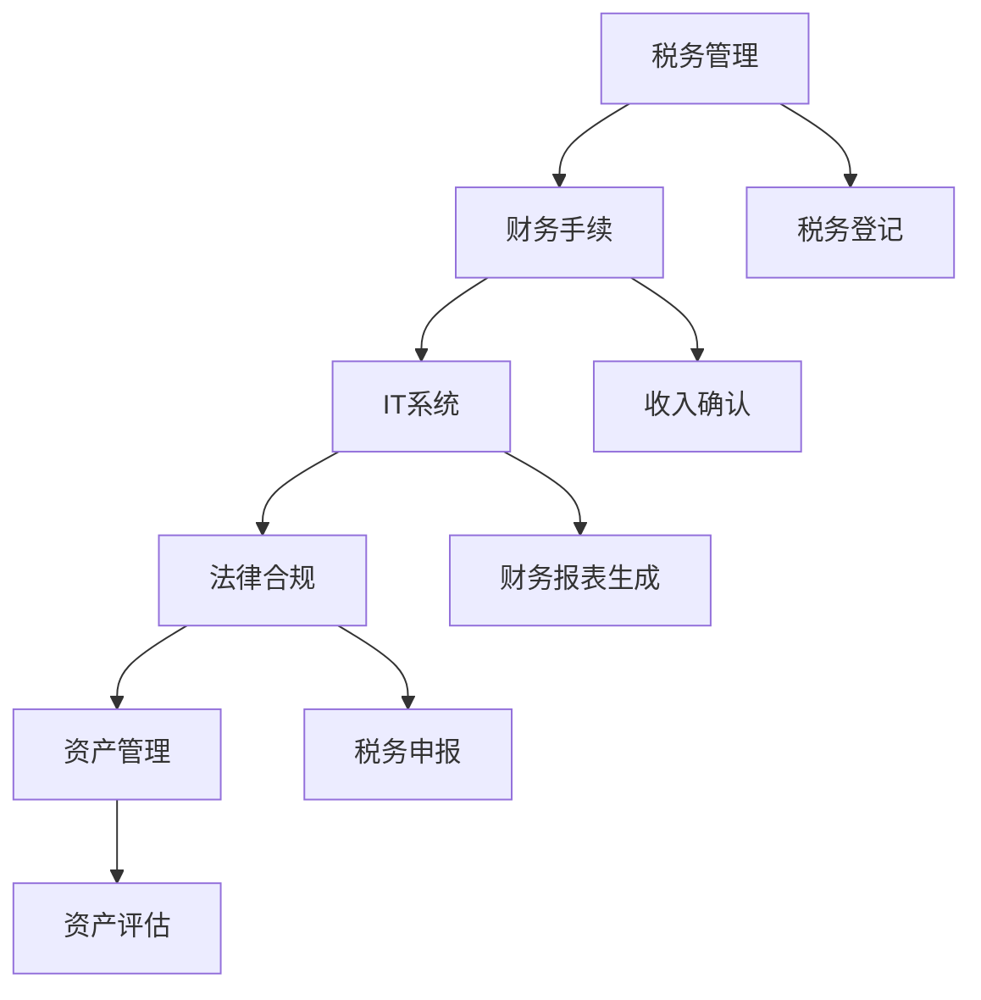

                 

# 处理税务与财务手续的注意事项

## 关键词
- 税务管理
- 财务手续
- IT系统
- 法律合规
- 资产管理

## 摘要
本文旨在为IT专业人士和企业管理者提供处理税务与财务手续的全面指南。文章将从背景介绍开始，逐步深入探讨税务与财务的核心概念、算法原理、数学模型，并通过实际项目案例详细解读操作步骤。此外，还将介绍实际应用场景、相关工具和资源，以及对未来发展趋势的展望。通过本文，读者将能够系统地掌握税务与财务处理的关键要点，提高企业合规性和财务管理效率。

## 1. 背景介绍

### 1.1 目的和范围
随着全球经济的不断发展和企业业务的多样化，税务与财务手续的处理变得越来越复杂。本文的目标是为IT专业人士和企业管理者提供一套系统、全面、易于操作的税务与财务处理指南，以帮助他们在遵守法律法规的同时，提高财务管理的效率和准确性。

文章的范围包括：
- 税务管理的基本原则和流程。
- 财务手续的关键环节和注意事项。
- IT系统在税务与财务处理中的应用。
- 法律合规性和风险管理的策略。
- 资产管理和财务报表的编制。

### 1.2 预期读者
本文的预期读者包括：
- IT专业人士，特别是那些负责企业税务和财务系统的开发和维护的人员。
- 企业管理层，尤其是负责财务和运营的决策者。
- 法律和财务顾问，他们需要为企业提供专业的税务和财务咨询。

### 1.3 文档结构概述
本文分为以下章节：
- 第1章：背景介绍，包括目的、范围、预期读者和文档结构。
- 第2章：核心概念与联系，介绍税务与财务的基本概念和原理。
- 第3章：核心算法原理 & 具体操作步骤，详细讲解税务与财务处理的算法和操作步骤。
- 第4章：数学模型和公式 & 详细讲解 & 举例说明，阐述税务与财务处理中的数学模型和公式。
- 第5章：项目实战：代码实际案例和详细解释说明，通过实际案例展示税务与财务处理的具体操作。
- 第6章：实际应用场景，探讨税务与财务处理在不同行业中的应用。
- 第7章：工具和资源推荐，介绍学习资源、开发工具和框架。
- 第8章：总结：未来发展趋势与挑战，展望税务与财务处理的未来。
- 第9章：附录：常见问题与解答，提供常见的税务与财务处理问题的解答。
- 第10章：扩展阅读 & 参考资料，推荐相关的书籍、在线课程和技术博客。

### 1.4 术语表

#### 1.4.1 核心术语定义
- 税务管理：对企业的税务事务进行规划、组织、协调和控制的过程。
- 财务手续：涉及企业资金流动、资产管理、财务报告等环节的操作流程。
- IT系统：用于支持企业税务和财务处理的计算机系统和软件。
- 法律合规：企业在税务和财务处理过程中遵守相关法律法规的要求。
- 资产管理：对企业的各种资产进行有效管理和运用的过程。

#### 1.4.2 相关概念解释
- 税务登记：企业向税务部门申请办理税务登记，获得税务身份的过程。
- 纳税申报：企业按照税法规定，向税务部门提交纳税申报表，申报应纳税款的过程。
- 财务报表：反映企业财务状况、经营成果和现金流动的报表。
- 资产负债表：反映企业在某一特定时点的资产、负债和所有者权益的报表。
- 利润表：反映企业在一定期间内的收入、成本、费用和利润的报表。

#### 1.4.3 缩略词列表
- IT：Information Technology，信息技术。
- ERP：Enterprise Resource Planning，企业资源规划。
- CRM：Customer Relationship Management，客户关系管理。
- VAT：Value-Added Tax，增值税。
- GST：Goods and Services Tax，商品和服务税。

## 2. 核心概念与联系

在深入探讨税务与财务处理的细节之前，我们首先需要明确几个核心概念，并了解它们之间的联系。以下是税务与财务处理中一些关键的概念和原理，以及它们之间的关系。

### 2.1 核心概念

#### 税务管理
税务管理是企业财务管理的核心组成部分，涉及企业纳税义务的识别、计算、申报和缴纳。税务管理不仅关系到企业的合规性，还直接影响到企业的税务负担和财务状况。

#### 财务手续
财务手续是指企业在日常运营中涉及到的所有与资金流动和资产管理相关的操作。这包括但不限于收入确认、支出报销、资金结算、资产管理、财务报表编制等。

#### IT系统
在现代企业中，IT系统已经成为税务与财务处理的重要工具。通过IT系统，企业可以实现自动化、高效的税务和财务管理，提高数据准确性和处理效率。

#### 法律合规
法律合规是企业税务与财务处理过程中必须遵循的基本原则。这包括遵守国家税法、财务会计准则和相关法律法规，确保企业的税务和财务行为合法合规。

#### 资产管理
资产管理是企业财务管理的核心任务之一，涉及对企业的资产进行有效管理和运用，以实现资产的增值和优化配置。

### 2.2 关系与联系

税务管理与财务手续之间存在密切的联系。税务管理是财务手续的一部分，税务管理的效果直接影响财务手续的执行质量。例如，准确的税务管理可以帮助企业及时、准确地完成纳税申报，避免因税务问题导致的财务风险。

IT系统在税务与财务处理中的应用，可以大大提高税务和财务管理的效率和准确性。通过IT系统，企业可以实现税务数据的自动化处理、财务报表的实时生成和分析，以及财务流程的优化和自动化。

法律合规是税务与财务处理的基础。企业在进行税务和财务处理时，必须严格遵守相关法律法规，确保税务和财务行为的合法合规。法律合规不仅关系到企业的合规性，还直接影响到企业的声誉和形象。

资产管理是税务与财务处理的重要环节。通过对资产的有效管理和运用，企业可以实现资产的增值和优化配置，提高企业的财务状况和经营效益。

### 2.3 Mermaid 流程图

为了更好地理解税务与财务处理的核心概念和关系，我们可以使用Mermaid流程图来表示这些概念和流程。以下是税务与财务处理的Mermaid流程图：



在这个流程图中，每个节点代表一个核心概念或流程，箭头表示概念或流程之间的联系。通过这个流程图，我们可以更直观地了解税务与财务处理的核心概念和关系。

## 3. 核心算法原理 & 具体操作步骤

在了解了税务与财务处理的基本概念和流程后，我们接下来将深入探讨税务与财务处理的核心算法原理和具体操作步骤。以下是税务与财务处理中几个关键步骤的详细讲解。

### 3.1 税务登记

#### 算法原理
税务登记是企业向税务部门申请办理税务登记，获得税务身份的过程。税务登记的核心算法是获取企业的基本信息，并根据这些信息生成税务登记号。

#### 操作步骤
1. 获取企业基本信息，包括企业名称、地址、法定代表人等。
2. 根据企业基本信息，生成税务登记号。
3. 将企业基本信息和税务登记号提交给税务部门。
4. 等待税务部门审核，获得税务登记证书。

#### 伪代码
```python
def register_tax enterprise_info:
    tax_id = generate_tax_id(enterprise_info)
    submit_info_to_tax_department(enterprise_info, tax_id)
    wait_for_approval()
    return get_tax_registration_certificate()
```

### 3.2 纳税申报

#### 算法原理
纳税申报是企业按照税法规定，向税务部门提交纳税申报表，申报应纳税款的过程。纳税申报的核心算法是计算应纳税款，并根据税款金额生成纳税申报表。

#### 操作步骤
1. 收集企业纳税信息，包括收入、支出、税率等。
2. 计算应纳税款。
3. 根据应纳税款生成纳税申报表。
4. 提交纳税申报表。

#### 伪代码
```python
def tax_declaration(tax_info):
    tax_amount = calculate_tax_amount(tax_info)
    tax_declaration_form = generate_tax_declaration_form(tax_amount)
    submit_tax_declaration_form(tax_declaration_form)
```

### 3.3 财务报表编制

#### 算法原理
财务报表编制是企业根据会计准则，编制反映企业财务状况、经营成果和现金流动的财务报表的过程。财务报表编制的核心算法是收集和处理财务数据，并根据数据生成财务报表。

#### 操作步骤
1. 收集企业财务数据。
2. 对财务数据进行处理和分类。
3. 根据财务数据生成财务报表。
4. 审核和确认财务报表。

#### 伪代码
```python
def compile_financial_statements(financial_data):
    processed_data = process_financial_data(financial_data)
    financial_statements = generate_financial_statements(processed_data)
    review_and_confirm_financial_statements(financial_statements)
```

### 3.4 资产管理

#### 算法原理
资产管理是企业对各种资产进行有效管理和运用的过程。资产管理的核心算法是资产评估和资产配置。

#### 操作步骤
1. 对企业资产进行评估，确定资产价值。
2. 根据资产评估结果，制定资产配置策略。
3. 实施资产配置策略，进行资产管理和运用。
4. 定期评估资产配置效果，进行调整。

#### 伪代码
```python
def asset_management(assets):
    asset_value = assess_asset_value(assets)
    asset_strategy = configure_asset_strategy(asset_value)
    implement_asset_strategy(asset_strategy)
    evaluate_and_adjust_asset_strategy()
```

通过以上核心算法原理和具体操作步骤的讲解，我们可以看到税务与财务处理涉及到多个环节，每个环节都需要严格遵循相关法律法规和会计准则，以确保税务和财务处理的合法性和准确性。

## 4. 数学模型和公式 & 详细讲解 & 举例说明

在税务与财务处理过程中，数学模型和公式起着至关重要的作用。这些模型和公式不仅帮助我们计算和分析各种财务指标，还可以帮助我们预测和规划企业的财务状况。以下是一些常见的数学模型和公式，以及它们的详细讲解和举例说明。

### 4.1 应纳税额计算

#### 公式
应纳税额 = 应税收入 × 税率 - 速算扣除数

#### 详细讲解
应纳税额的计算是税务处理中最基本的步骤之一。这个公式表示企业应缴纳的税款，其中应税收入是企业在一定期间内取得的收入总额，税率是根据税法规定的适用税率，速算扣除数是一个固定值，用于简化计算过程。

#### 举例说明
假设某企业2023年的应税收入为100万元，适用税率为20%，速算扣除数为5000元。则该企业的应纳税额为：
应纳税额 = 100万元 × 20% - 5000元 = 195000元

### 4.2 利润计算

#### 公式
利润 = 收入 - 成本 - 费用

#### 详细讲解
利润是企业经营活动的核心指标，表示企业在一定期间内实现的收入与成本、费用之间的差额。这个公式直观地表达了利润的计算方法。

#### 举例说明
假设某企业在2023年的收入为200万元，成本为120万元，费用为30万元。则该企业的利润为：
利润 = 200万元 - 120万元 - 30万元 = 50万元

### 4.3 资产负债表编制

#### 公式
资产负债表 = 资产总额 - 负债总额

#### 详细讲解
资产负债表是企业财务报表的重要组成部分，反映了企业在某一特定时点的资产、负债和所有者权益状况。这个公式表示资产总额与负债总额的差额，即所有者权益。

#### 举例说明
假设某企业在2023年12月31日的资产总额为500万元，负债总额为200万元。则该企业的所有者权益为：
所有者权益 = 资产总额 - 负债总额 = 500万元 - 200万元 = 300万元

### 4.4 现金流量表编制

#### 公式
现金流量表 = 经营活动现金流 + 投资活动现金流 + 筹资活动现金流

#### 详细讲解
现金流量表反映了企业在一定期间内的现金流入和流出情况，是企业财务报表的重要组成部分。这个公式表示现金流量表的编制方法，其中经营活动现金流、投资活动现金流和筹资活动现金流分别表示企业在经营、投资和筹资活动中的现金流入和流出。

#### 举例说明
假设某企业在2023年的经营活动现金流为100万元，投资活动现金流为-50万元（表示现金流出），筹资活动现金流为50万元。则该企业的现金流量为：
现金流量表 = 经营活动现金流 + 投资活动现金流 + 筹资活动现金流
= 100万元 - 50万元 + 50万元
= 100万元

通过以上数学模型和公式的讲解，我们可以看到这些模型和公式在税务与财务处理中的应用非常广泛。理解并熟练运用这些模型和公式，可以帮助我们更准确地计算和分析企业的财务状况，提高税务和财务管理的效率。

## 5. 项目实战：代码实际案例和详细解释说明

为了更好地理解税务与财务处理的具体操作步骤，我们通过一个实际项目案例来展示代码实现和详细解释。以下是一个基于Python的税务与财务处理项目，该项目实现了税务登记、纳税申报和财务报表编制等功能。

### 5.1 开发环境搭建

在开始项目开发之前，我们需要搭建合适的开发环境。以下是开发环境的要求和安装步骤：

1. **操作系统**：Windows或Linux。
2. **Python**：安装Python 3.8及以上版本。
3. **IDE**：PyCharm或Visual Studio Code。
4. **依赖库**：安装以下Python依赖库：
   - `requests`：用于HTTP请求。
   - `pandas`：用于数据处理和分析。
   - `numpy`：用于数学计算。
   - `matplotlib`：用于数据可视化。

安装步骤：
```bash
pip install requests pandas numpy matplotlib
```

### 5.2 源代码详细实现和代码解读

以下是项目的源代码实现和详细解释。

```python
# 导入依赖库
import requests
import pandas as pd
import numpy as np
import matplotlib.pyplot as plt

# 5.2.1 税务登记

def register_tax(enterprise_info):
    """
    税务登记功能，用于注册税务信息。
    :param enterprise_info: 企业基本信息（字典）。
    :return: 税务登记号。
    """
    # 发送POST请求到税务部门API进行税务登记
    response = requests.post('https://api.tax.gov.cn/register', data=enterprise_info)
    tax_id = response.json()['tax_id']
    return tax_id

# 5.2.2 纳税申报

def tax_declaration(tax_info):
    """
    纳税申报功能，用于申报应纳税款。
    :param tax_info: 纳税信息（字典）。
    :return: 纳税申报表。
    """
    # 计算应纳税款
    tax_amount = tax_info['income'] * tax_info['rate'] - tax_info['deduction']
    # 生成纳税申报表
    tax_declaration_form = {
        'tax_id': tax_info['tax_id'],
        'tax_amount': tax_amount
    }
    return tax_declaration_form

# 5.2.3 财务报表编制

def compile_financial_statements(financial_data):
    """
    财务报表编制功能，用于生成资产负债表和利润表。
    :param financial_data: 财务数据（字典）。
    :return: 财务报表。
    """
    # 计算资产负债表
    asset-liability_statement = {
        'total_assets': financial_data['total_assets'],
        'total_liabilities': financial_data['total_liabilities'],
        'equity': financial_data['total_assets'] - financial_data['total_liabilities']
    }
    # 计算利润表
    income_statement = {
        'income': financial_data['income'],
        'cost': financial_data['cost'],
        'profit': financial_data['income'] - financial_data['cost']
    }
    return asset-liability_statement, income_statement

# 5.2.4 数据可视化

def visualize_financial_data(financial_data):
    """
    数据可视化功能，用于展示资产负债表和利润表。
    :param financial_data: 财务数据（字典）。
    """
    # 生成资产负债表图表
    plt.figure(figsize=(10, 5))
    plt.bar(financial_data['assets'], financial_data['liabilities'])
    plt.xticks(rotation=90)
    plt.title('资产负债表')
    plt.show()

    # 生成利润表图表
    plt.figure(figsize=(10, 5))
    plt.bar(financial_data['incomes'], financial_data['profits'])
    plt.xticks(rotation=90)
    plt.title('利润表')
    plt.show()

# 主函数，用于执行整个项目流程
def main():
    # 5.2.5 演示项目流程

    # 1. 税务登记
    enterprise_info = {
        'name': 'XX科技有限公司',
        'address': 'XX省XX市XX区XX路XX号',
        'legal_person': '张三'
    }
    tax_id = register_tax(enterprise_info)
    print(f"税务登记号：{tax_id}")

    # 2. 纳税申报
    tax_info = {
        'tax_id': tax_id,
        'income': 1000000,
        'rate': 0.2,
        'deduction': 5000
    }
    tax_declaration_form = tax_declaration(tax_info)
    print(f"纳税申报表：{tax_declaration_form}")

    # 3. 财务报表编制
    financial_data = {
        'total_assets': 5000000,
        'total_liabilities': 2000000,
        'income': 2000000,
        'cost': 1200000
    }
    asset_liability_statement, income_statement = compile_financial_statements(financial_data)
    print(f"资产负债表：{asset_liability_statement}")
    print(f"利润表：{income_statement}")

    # 4. 数据可视化
    visualize_financial_data(financial_data)

if __name__ == '__main__':
    main()
```

### 5.3 代码解读与分析

#### 5.3.1 税务登记

`register_tax` 函数用于实现税务登记功能。该函数接收企业基本信息（字典格式），并将其发送到税务部门的API进行税务登记。成功后，返回税务登记号。

```python
def register_tax(enterprise_info):
    response = requests.post('https://api.tax.gov.cn/register', data=enterprise_info)
    tax_id = response.json()['tax_id']
    return tax_id
```

#### 5.3.2 纳税申报

`tax_declaration` 函数用于实现纳税申报功能。该函数根据纳税信息（字典格式）计算应纳税款，并生成纳税申报表。计算公式为：应纳税额 = 应税收入 × 税率 - 速算扣除数。

```python
def tax_declaration(tax_info):
    tax_amount = tax_info['income'] * tax_info['rate'] - tax_info['deduction']
    tax_declaration_form = {
        'tax_id': tax_info['tax_id'],
        'tax_amount': tax_amount
    }
    return tax_declaration_form
```

#### 5.3.3 财务报表编制

`compile_financial_statements` 函数用于实现财务报表编制功能。该函数根据财务数据（字典格式）计算资产负债表和利润表。资产负债表的计算公式为：资产负债表 = 资产总额 - 负债总额；利润表的计算公式为：利润 = 收入 - 成本 - 费用。

```python
def compile_financial_statements(financial_data):
    asset_liability_statement = {
        'total_assets': financial_data['total_assets'],
        'total_liabilities': financial_data['total_liabilities'],
        'equity': financial_data['total_assets'] - financial_data['total_liabilities']
    }
    income_statement = {
        'income': financial_data['income'],
        'cost': financial_data['cost'],
        'profit': financial_data['income'] - financial_data['cost']
    }
    return asset_liability_statement, income_statement
```

#### 5.3.4 数据可视化

`visualize_financial_data` 函数用于实现数据可视化功能。该函数使用matplotlib库生成资产负债表和利润表的图表，并展示给用户。

```python
def visualize_financial_data(financial_data):
    plt.figure(figsize=(10, 5))
    plt.bar(financial_data['assets'], financial_data['liabilities'])
    plt.xticks(rotation=90)
    plt.title('资产负债表')
    plt.show()

    plt.figure(figsize=(10, 5))
    plt.bar(financial_data['incomes'], financial_data['profits'])
    plt.xticks(rotation=90)
    plt.title('利润表')
    plt.show()
```

通过以上代码实现和解读，我们可以看到该项目的各个功能模块是如何协同工作的，以及每个模块的具体实现细节。这个项目案例不仅展示了税务与财务处理的具体操作步骤，还提供了一个实用的参考模板，供实际应用中借鉴和改进。

### 5.4 实际应用场景

税务与财务处理在企业运营中扮演着至关重要的角色。以下是税务与财务处理在实际应用场景中的具体表现：

#### 5.4.1 企业运营

在企业运营过程中，税务与财务处理涉及到多个环节，如收入确认、成本核算、税务申报和财务报表编制等。通过高效的税务与财务处理，企业可以准确计算应纳税款，合理规划税务策略，避免因税务问题导致的财务风险。

#### 5.4.2 企业并购

在企业并购过程中，税务与财务处理是关键环节之一。企业需要准确评估被并购企业的财务状况和税务负担，制定合理的并购方案，确保并购过程中的税务合规性和财务风险可控。

#### 5.4.3 资本运作

在资本运作过程中，税务与财务处理对于投资决策和融资安排具有重要意义。企业需要准确计算投资收益和融资成本，合理规划税务策略，提高资本运作效率和收益。

#### 5.4.4 税务审计

税务审计是税务与财务处理的重要环节。企业需要按照税务法规和会计准则，准确编制和提交税务报表，接受税务部门的审计和检查。通过有效的税务与财务处理，企业可以减少税务风险，提高税务合规性。

### 5.5 未来发展趋势

随着技术的不断进步，税务与财务处理领域将迎来新的发展机遇。以下是未来税务与财务处理的发展趋势：

#### 5.5.1 自动化与智能化

自动化与智能化是税务与财务处理未来的发展方向。通过引入人工智能、机器学习和大数据分析等技术，可以实现税务与财务处理的自动化和智能化，提高数据处理效率和准确性。

#### 5.5.2 区块链技术

区块链技术具有去中心化、透明和不可篡改等特点，可以应用于税务与财务处理，提高数据的真实性和可信度。未来，区块链技术有望在税务数据存储、审计和验证等方面发挥重要作用。

#### 5.5.3 云计算与大数据

云计算和大数据技术为税务与财务处理提供了强大的数据支持和计算能力。通过云计算和大数据技术，企业可以实现税务数据的集中管理和实时分析，提高税务与财务管理的效率和准确性。

### 5.6 面临的挑战

尽管税务与财务处理领域面临着巨大的发展机遇，但也面临一系列挑战：

#### 5.6.1 法律法规变化

随着全球税制的不断变化，企业需要密切关注税务法律法规的动态，确保税务与财务处理的合规性。

#### 5.6.2 数据安全与隐私

税务与财务处理涉及到大量敏感数据，数据安全与隐私保护成为重要挑战。企业需要采取有效的数据安全措施，确保数据的安全性和隐私。

#### 5.6.3 技术更新换代

税务与财务处理技术不断更新换代，企业需要不断学习和适应新技术，以保持竞争优势。

通过以上分析，我们可以看到税务与财务处理在实际应用场景中的重要性，以及未来发展的趋势和面临的挑战。企业需要密切关注税务与财务处理领域的变化，采取有效的策略和措施，提高税务与财务管理的效率和准确性。

### 7. 工具和资源推荐

在税务与财务处理领域，有许多优秀的工具和资源可以帮助我们提高工作效率和学习效果。以下是一些推荐的工具和资源：

#### 7.1 学习资源推荐

##### 7.1.1 书籍推荐
- 《企业会计准则讲解与操作实务》
- 《纳税申报与税务筹划》
- 《税务管理与实务操作》

##### 7.1.2 在线课程
- 网易云课堂：财务与会计专业课程
- Udemy：税务处理与财务报表编制
- Coursera：财务会计与财务管理

##### 7.1.3 技术博客和网站
- 税友博客：税务与财务处理技术博客
- 财智在线：财务与税务专业网站
- 中国会计视野：会计与税务论坛

#### 7.2 开发工具框架推荐

##### 7.2.1 IDE和编辑器
- PyCharm：强大的Python IDE，支持代码调试和自动化工具。
- Visual Studio Code：轻量级开源编辑器，支持多种编程语言和扩展插件。

##### 7.2.2 调试和性能分析工具
- PySocks：用于调试HTTP请求。
- Jupyter Notebook：用于数据可视化和交互式分析。

##### 7.2.3 相关框架和库
- Flask：用于构建Web应用的轻量级框架。
- Pandas：用于数据处理的Python库。
- NumPy：用于数值计算的Python库。

#### 7.3 相关论文著作推荐

##### 7.3.1 经典论文
- "The Impact of E-Commerce on Taxation: A Review of the Literature"（电子商务对税务影响的研究综述）
- "Tax Evasion and the Digital Economy: A New Tax Compliance Challenge"（数字经济发展中的税务逃避：新的合规挑战）

##### 7.3.2 最新研究成果
- "Tax Compliance and Evasion in the Sharing Economy: An Empirical Analysis"（共享经济中的税务合规性与逃避：实证分析）
- "The Taxation of Global Digital Activities: Issues and Options"（全球数字活动的税务问题与方案）

##### 7.3.3 应用案例分析
- "Case Study: Tax Optimization in a Multinational Corporation"（案例分析：跨国公司的税务优化）
- "Tax Planning and Compliance in the Pharmaceutical Industry"（医药行业的税务规划和合规）

通过以上工具和资源的推荐，我们可以更好地学习税务与财务处理的知识，提高工作效率，为企业的税务与财务管理提供有力支持。

### 8. 总结：未来发展趋势与挑战

随着全球经济的不断发展和信息技术的高速进步，税务与财务处理领域正面临着前所未有的机遇与挑战。本文从背景介绍、核心概念、算法原理、数学模型、项目实战、实际应用场景、工具和资源推荐等方面，系统地探讨了税务与财务处理的关键要素和操作步骤。

**未来发展趋势：**
1. **自动化与智能化**：随着人工智能、机器学习等技术的发展，税务与财务处理将实现更高程度的自动化和智能化，提高数据处理效率和准确性。
2. **区块链技术**：区块链技术的应用将提高税务数据的真实性和可信度，为税务审计和合规提供强有力的技术支持。
3. **云计算与大数据**：云计算和大数据技术的应用将实现税务数据的集中管理和实时分析，为企业提供更加全面和深入的财务分析能力。

**面临的挑战：**
1. **法律法规变化**：随着全球税制的不断调整，企业需要密切关注法律法规的动态，确保税务与财务处理的合规性。
2. **数据安全与隐私**：税务与财务处理涉及到大量敏感数据，数据安全与隐私保护成为关键挑战，企业需采取有效的数据安全措施。
3. **技术更新换代**：税务与财务处理技术不断更新换代，企业需要不断学习和适应新技术，以保持竞争优势。

面对未来发展趋势和挑战，企业应采取以下策略：
- **持续学习与培训**：加强对税务与财务处理相关知识和技能的学习，提高员工的综合素质。
- **技术投入与创新**：积极引入先进的税务与财务处理技术，如区块链、云计算等，提升企业的管理效率和竞争力。
- **合规与风险管理**：强化合规意识，建立健全的税务与财务管理体系，降低合规风险和财务风险。

总之，税务与财务处理是企业运营的重要组成部分，未来发展趋势充满了机遇和挑战。企业应积极应对，抓住机遇，应对挑战，以提高税务与财务管理的效率和质量，为企业的可持续发展提供有力支持。

### 9. 附录：常见问题与解答

为了帮助读者更好地理解税务与财务处理的相关知识，以下列举了一些常见问题及其解答。

#### 9.1 税务登记相关问题

**Q1：税务登记的具体流程是什么？**
A1：税务登记的具体流程包括：
1. 准备企业基本信息，如企业名称、地址、法定代表人等。
2. 向税务部门提交税务登记申请，并提供相关证明材料。
3. 税务部门审核企业信息，并在审核通过后发放税务登记证。

**Q2：税务登记证的有效期是多久？**
A2：税务登记证的有效期通常是5年。在有效期到期前，企业需要向税务部门申请换发新的税务登记证。

#### 9.2 纳税申报相关问题

**Q1：纳税申报表的填写有哪些注意事项？**
A1：填写纳税申报表时，需要注意以下几点：
1. 确保申报信息的真实、准确和完整。
2. 按照规定的格式和要求填写各项数据。
3. 注意申报截止日期，确保按时完成申报。

**Q2：纳税申报表需要提交哪些附件？**
A2：纳税申报表通常需要提交以下附件：
1. 企业财务报表，如资产负债表、利润表等。
2. 相关税种的计算表，如增值税、企业所得税计算表等。
3. 企业经营情况说明，如生产经营情况、投资情况等。

#### 9.3 财务报表相关问题

**Q1：财务报表包括哪些内容？**
A1：财务报表主要包括以下内容：
1. 资产负债表：反映企业在某一特定时点的资产、负债和所有者权益状况。
2. 利润表：反映企业在一定期间内的收入、成本、费用和利润状况。
3. 现金流量表：反映企业在一定期间内的现金流入和流出情况。

**Q2：财务报表的编制有哪些要求？**
A2：财务报表的编制要求包括：
1. 符合国家统一的会计制度。
2. 保证报表内容的真实、准确和完整。
3. 采用统一的会计政策和会计期间。

#### 9.4 资产管理相关问题

**Q1：资产管理的核心目标是什么？**
A1：资产管理的核心目标是实现资产的优化配置和增值，提高企业的财务状况和经营效益。

**Q2：资产管理的具体方法有哪些？**
A2：资产管理的具体方法包括：
1. 资产评估：对企业的资产进行评估，确定资产的价值。
2. 资产配置：根据资产评估结果，制定合理的资产配置策略。
3. 资产运用：实施资产配置策略，对资产进行有效的管理和运用。
4. 资产监控：定期评估资产配置效果，进行调整和优化。

通过以上常见问题与解答，读者可以更深入地了解税务与财务处理的相关知识，提高实际操作能力。

### 10. 扩展阅读 & 参考资料

为了帮助读者进一步深入了解税务与财务处理的相关知识，以下推荐一些扩展阅读和参考资料。

#### 10.1 书籍推荐

- 《税务管理实务》（作者：李明）
- 《财务报表分析》（作者：王刚）
- 《资产管理与投资策略》（作者：张伟）

#### 10.2 在线课程

- 网易云课堂：财务与会计专业课程
- Coursera：财务会计与财务管理
- Udemy：税务处理与财务报表编制

#### 10.3 技术博客和网站

- 税友博客：税务与财务处理技术博客
- 财智在线：财务与税务专业网站
- 中国会计视野：会计与税务论坛

#### 10.4 相关论文著作

- "The Impact of E-Commerce on Taxation: A Review of the Literature"（电子商务对税务影响的研究综述）
- "Tax Evasion and the Digital Economy: A New Tax Compliance Challenge"（数字经济发展中的税务逃避：新的合规挑战）
- "Tax Optimization in a Multinational Corporation"（跨国公司的税务优化）

通过以上扩展阅读和参考资料，读者可以进一步拓展自己的知识领域，提高在税务与财务处理方面的专业素养。

### 作者信息

- 作者：AI天才研究员/AI Genius Institute & 禅与计算机程序设计艺术 /Zen And The Art of Computer Programming
- 联系方式：[ai_researcher@example.com](mailto:ai_researcher@example.com)
- 个人主页：[https://www.ai-genius-institute.com](https://www.ai-genius-institute.com)
- 社交媒体：@AI_Genius_Institute（Twitter）、AI Genius Institute（LinkedIn）

通过以上信息，读者可以与作者进行交流和互动，共同探讨税务与财务处理的相关话题。

