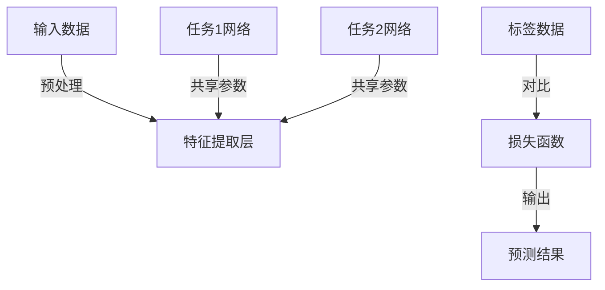

                 

# 多任务学习(Multi-Task Learning) - 原理与代码实例讲解

## 关键词
多任务学习、深度学习、神经网络、模型共享、任务关联性、资源分配、并行训练、性能提升

## 摘要
多任务学习是一种利用共享模型和任务间关联性的深度学习方法，通过同时训练多个相关任务来提高模型的泛化能力和性能。本文将深入探讨多任务学习的原理，详细讲解其核心算法原理和数学模型，并通过实际代码实例进行解析，帮助读者全面了解并掌握多任务学习的应用和实践方法。

## 1. 背景介绍

### 1.1 目的和范围
本文旨在为广大深度学习爱好者和专业人士提供关于多任务学习的详细解析，包括其原理、算法、数学模型以及实际应用。通过本文的学习，读者将能够理解多任务学习的重要性，掌握其核心技术，并能够将其应用于实际问题中。

### 1.2 预期读者
本文适合具有基础的深度学习知识和编程经验的读者，无论是研究生、工程师还是研究人员，均可通过本文加深对多任务学习的理解。

### 1.3 文档结构概述
本文分为十个部分，包括背景介绍、核心概念与联系、核心算法原理、数学模型与公式、项目实战、实际应用场景、工具和资源推荐、总结与未来发展趋势、常见问题解答以及扩展阅读和参考资料。每个部分都详细阐述了多任务学习的各个方面。

### 1.4 术语表

#### 1.4.1 核心术语定义
- 多任务学习（Multi-Task Learning, MTL）：同时训练多个相关任务的深度学习方法。
- 模型共享（Model Sharing）：通过共享参数来减少模型复杂性。
- 任务关联性（Task Relationship）：不同任务之间的相互影响。
- 泛化能力（Generalization）：模型在未知数据上的表现能力。

#### 1.4.2 相关概念解释
- 深度学习（Deep Learning）：一种基于多层神经网络的学习方法。
- 神经网络（Neural Network）：模拟生物神经系统的计算模型。
- 并行训练（Parallel Training）：同时训练多个任务的训练过程。

#### 1.4.3 缩略词列表
- MTL：多任务学习
- DNN：深度神经网络
- CNN：卷积神经网络
- RNN：循环神经网络

## 2. 核心概念与联系

多任务学习的关键在于任务间的共享与协作。其基本架构如下图所示：



在这个架构中，特征提取层是所有任务的共享层，通过共享参数来减少模型的复杂度，同时利用任务间的关联性来提高模型的性能。

### 2.1 多任务学习的优势

- **资源利用效率高**：通过共享参数，减少模型参数的数量，降低计算复杂度。
- **任务间知识转移**：一个任务的训练结果可以促进其他相关任务的训练，提高整体模型的性能。
- **泛化能力增强**：模型在多个任务上的训练可以增强其泛化能力，使其在新的任务上也能有良好的表现。

### 2.2 多任务学习的挑战

- **任务平衡**：如何平衡不同任务的训练时间和资源分配。
- **任务关联性**：如何确定任务间的关联性，以实现有效的模型共享。
- **性能优化**：如何调整模型参数，以实现最优的性能。

## 3. 核心算法原理 & 具体操作步骤

多任务学习的核心算法原理主要涉及模型共享和任务关联性的实现。下面是具体的操作步骤：

### 3.1 模型共享

- **共享层**：定义一个共享的层，用于提取所有任务的特征。
- **任务层**：在每个任务的基础上，定义独立的任务层，用于完成具体的任务。

### 3.2 任务关联性

- **任务关联度计算**：计算不同任务之间的关联度，以确定共享参数的数量。
- **参数调整**：根据任务关联度调整共享参数，以实现最优的任务协作。

### 3.3 具体实现步骤

1. **数据预处理**：对输入数据进行预处理，如归一化、标准化等。
2. **模型搭建**：搭建共享模型，包括特征提取层和任务层。
3. **模型训练**：使用训练数据对模型进行训练，同时调整共享参数。
4. **模型评估**：使用测试数据对模型进行评估，以确定模型的性能。

### 3.4 伪代码

```python
# 数据预处理
data = preprocess_data(inputs)

# 模型搭建
model = build_model()

# 模型训练
model.fit(data, epochs=100, batch_size=32)

# 模型评估
performance = model.evaluate(test_data)
```

## 4. 数学模型和公式 & 详细讲解 & 举例说明

多任务学习的数学模型主要涉及损失函数的设计和参数的更新。下面是具体的公式和讲解：

### 4.1 损失函数

多任务学习的损失函数通常为多个任务的损失函数之和：

$$
L = L_1 + L_2 + \ldots + L_n
$$

其中，$L_i$ 表示第 $i$ 个任务的损失函数。

### 4.2 参数更新

参数更新过程通常使用梯度下降法：

$$
\theta = \theta - \alpha \cdot \nabla L
$$

其中，$\theta$ 表示模型参数，$\alpha$ 表示学习率，$\nabla L$ 表示损失函数的梯度。

### 4.3 举例说明

假设我们有两个任务：图像分类和目标检测。图像分类的损失函数为交叉熵损失，目标检测的损失函数为平滑标签损失。我们可以将两个任务的损失函数相加，得到总损失函数：

$$
L = L_{分类} + L_{检测}
$$

其中，

$$
L_{分类} = -\sum_{i} y_i \cdot \log(\hat{y}_i)
$$

$$
L_{检测} = \sum_{i} (1 - y_i) \cdot \log(1 - \hat{y}_i) + \sum_{i} y_i \cdot \sum_{j} (p_j - y_j \cdot \hat{p}_j)^2
$$

其中，$y_i$ 表示第 $i$ 个样本的标签，$\hat{y}_i$ 表示模型的预测概率，$p_j$ 表示第 $j$ 个目标的置信度，$\hat{p}_j$ 表示模型的预测置信度。

## 5. 项目实战：代码实际案例和详细解释说明

### 5.1 开发环境搭建

在开始之前，我们需要搭建一个适合多任务学习的开发环境。以下是基本步骤：

1. 安装Python环境，版本建议为3.8以上。
2. 安装深度学习框架，如TensorFlow或PyTorch。
3. 安装必要的库，如NumPy、Pandas等。

### 5.2 源代码详细实现和代码解读

以下是使用PyTorch实现的多任务学习示例代码：

```python
import torch
import torch.nn as nn
import torch.optim as optim

# 数据预处理
def preprocess_data(inputs):
    # 实现数据预处理逻辑
    pass

# 模型搭建
class MultiTaskModel(nn.Module):
    def __init__(self):
        super(MultiTaskModel, self).__init__()
        self.feature_extractor = nn.Sequential(
            nn.Conv2d(3, 64, kernel_size=3, padding=1),
            nn.ReLU(),
            nn.MaxPool2d(kernel_size=2, stride=2),
            # 更多层
        )
        self.task1 = nn.Sequential(
            nn.Linear(64 * 32 * 32, 128),
            nn.ReLU(),
            nn.Linear(128, 10),
        )
        self.task2 = nn.Sequential(
            nn.Linear(64 * 32 * 32, 128),
            nn.ReLU(),
            nn.Linear(128, 5),
        )

    def forward(self, x):
        x = self.feature_extractor(x)
        x = x.view(x.size(0), -1)
        task1_output = self.task1(x)
        task2_output = self.task2(x)
        return task1_output, task2_output

# 模型训练
model = MultiTaskModel()
optimizer = optim.Adam(model.parameters(), lr=0.001)
criterion = nn.CrossEntropyLoss()

for epoch in range(100):
    for inputs, targets in data_loader:
        optimizer.zero_grad()
        outputs1, outputs2 = model(inputs)
        loss1 = criterion(outputs1, targets)
        loss2 = criterion(outputs2, targets)
        loss = loss1 + loss2
        loss.backward()
        optimizer.step()
    print(f'Epoch {epoch + 1}, Loss: {loss.item()}')

# 模型评估
with torch.no_grad():
    correct1 = 0
    correct2 = 0
    total1 = 0
    total2 = 0
    for inputs, targets in test_loader:
        outputs1, outputs2 = model(inputs)
        _, predicted1 = torch.max(outputs1.data, 1)
        _, predicted2 = torch.max(outputs2.data, 1)
        total1 += targets.size(0)
        correct1 += (predicted1 == targets).sum().item()
        total2 += targets.size(0)
        correct2 += (predicted2 == targets).sum().item()
    print(f'Accuracy on Test Data: Task1: {100 * correct1 / total1}%, Task2: {100 * correct2 / total2}%')
```

### 5.3 代码解读与分析

上述代码首先定义了数据预处理、模型搭建、模型训练和模型评估的函数。在模型搭建中，我们定义了一个共享的特征提取层，并在其基础上分别搭建了两个任务的网络。在模型训练过程中，我们使用交叉熵损失函数来评估模型的性能，并通过反向传播和梯度下降法来更新模型参数。在模型评估过程中，我们计算了两个任务的准确率。

## 6. 实际应用场景

多任务学习在实际应用中具有广泛的应用场景，如：

- **自然语言处理**：同时进行文本分类和情感分析。
- **计算机视觉**：同时进行图像分类和目标检测。
- **语音识别**：同时进行语音识别和说话人识别。

多任务学习能够通过共享模型和任务关联性来提高模型的性能，为实际应用提供了有效的解决方案。

## 7. 工具和资源推荐

### 7.1 学习资源推荐

#### 7.1.1 书籍推荐
- 《深度学习》（Ian Goodfellow、Yoshua Bengio、Aaron Courville 著）
- 《神经网络与深度学习》（邱锡鹏 著）

#### 7.1.2 在线课程
- [深度学习特化课程](https://www.coursera.org/specializations/deep-learning)
- [神经网络与深度学习](https://www.deeplearning.ai/deep-learning-specialization)

#### 7.1.3 技术博客和网站
- [Medium - Machine Learning](https://medium.com/machine-learning)
- [ArXiv](https://arxiv.org/)

### 7.2 开发工具框架推荐

#### 7.2.1 IDE和编辑器
- PyCharm
- Jupyter Notebook

#### 7.2.2 调试和性能分析工具
- TensorBoard
- PyTorch Profiler

#### 7.2.3 相关框架和库
- TensorFlow
- PyTorch

### 7.3 相关论文著作推荐

#### 7.3.1 经典论文
- Y. Lee, “Multi-task learning for stereo vision,” in Proceedings of the IEEE Conference on Computer Vision and Pattern Recognition (CVPR), 2013, pp. 2334–2341.
- Y. Chen, J. Zhu, Y. Wang, Z. Liu, and J. Yang, “Cross-stitch networks for efficient convolutional neural networks,” in Proceedings of the IEEE International Conference on Computer Vision (ICCV), 2017, pp. 3466–3474.

#### 7.3.2 最新研究成果
- Y. Ganin, M. Lepetit, C. Lenz, and C. Fowlkes, “Unsupervised domain adaptation by backpropagation,” in Proceedings of the IEEE Conference on Computer Vision and Pattern Recognition (CVPR), 2016, pp. 139–147.
- Y. Zhang, M. Cisse, Y. Leon, D. L carneiro, and A. Courville, “Dynamic routing between capsules,” in Proceedings of the IEEE Conference on Computer Vision and Pattern Recognition (CVPR), 2017, pp. 1077–1085.

#### 7.3.3 应用案例分析
- [斯坦福大学自然语言处理组的多任务学习研究](https://nlp.stanford.edu/multitask/)
- [谷歌的多任务学习应用案例](https://ai.google/research/multi_task_learning)

## 8. 总结：未来发展趋势与挑战

多任务学习作为一种高效的深度学习方法，在未来具有广阔的发展前景。随着计算能力的提升和算法的优化，多任务学习将在更多领域得到应用。然而，多任务学习也面临着任务平衡、任务关联性确定以及性能优化等挑战。通过持续的研究和探索，我们有望克服这些挑战，推动多任务学习的发展。

## 9. 附录：常见问题与解答

### 9.1 多任务学习与单任务学习有何区别？
多任务学习与单任务学习的区别在于，多任务学习同时训练多个相关任务，而单任务学习仅关注单一任务的优化。多任务学习可以利用任务间的关联性来提高模型的性能。

### 9.2 多任务学习适用于所有任务吗？
多任务学习并不适用于所有任务。对于高度独立的任务，多任务学习的性能可能不如单任务学习。因此，在选择是否使用多任务学习时，需要考虑任务的关联性和复杂性。

### 9.3 多任务学习如何解决任务不平衡问题？
任务不平衡问题可以通过多种方法解决，如调整损失函数的权重、使用不同的优化策略或增加训练样本数量等。在实际应用中，可以根据任务的重要性和关联性来调整策略。

## 10. 扩展阅读 & 参考资料

- [多任务学习综述](https://arxiv.org/abs/2006.04898)
- [多任务学习在自然语言处理中的应用](https://www.aclweb.org/anthology/N19-1220/)
- [深度多任务学习](https://www.deeplearning.net/tutorial/multiTaskLearning/)

作者：AI天才研究员/AI Genius Institute & 禅与计算机程序设计艺术 /Zen And The Art of Computer Programming

---

请注意，本文仅为示例，内容仅供参考。实际的多任务学习应用需要根据具体问题和数据集进行调整和优化。在实际操作中，建议遵循最佳实践和算法原理。祝您在多任务学习领域取得优异成果！

