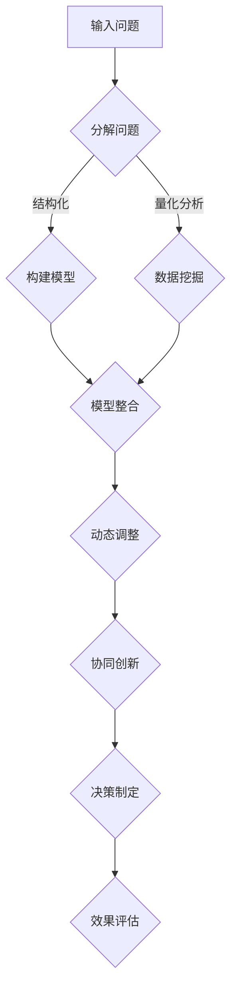

                 

# 多元模型思维：提升管理者认知水平

> **关键词：** 多元模型，认知水平，管理实践，创新思维，复杂性科学
> 
> **摘要：** 本文旨在探讨多元模型思维在提升管理者认知水平方面的作用。通过深入分析多元模型的定义、原理及其应用，文章将阐述如何将多元模型思维应用于管理实践，以提升管理者的创新能力和决策水平。此外，本文还将探讨多元模型思维在应对复杂问题时的优势，并展望其未来发展趋势与挑战。

## 1. 背景介绍

### 1.1 目的和范围

本文的主要目的是探讨多元模型思维在提升管理者认知水平方面的作用。随着全球化、信息化和复杂性的加剧，管理者面临的问题越来越复杂，单一的思维方式难以应对。多元模型思维作为一种综合性思维方法，可以帮助管理者从不同角度、不同层面分析问题，提高决策的质量和效率。

本文将主要讨论以下内容：

1. 多元模型的定义和核心概念；
2. 多元模型思维在管理实践中的应用；
3. 多元模型思维的优势和挑战；
4. 多元模型思维的未来发展趋势。

### 1.2 预期读者

本文的预期读者主要包括以下几类：

1. 管理者：希望通过学习多元模型思维提升自身认知水平和决策能力的管理者；
2. 研究者：对多元模型思维和管理实践感兴趣的研究者；
3. 学生：对管理科学与工程、复杂性科学等领域感兴趣的学生。

### 1.3 文档结构概述

本文的结构如下：

1. 引言：介绍多元模型思维的定义和背景；
2. 核心概念与联系：阐述多元模型的基本原理和架构；
3. 核心算法原理 & 具体操作步骤：详细讲解多元模型的应用方法和操作步骤；
4. 数学模型和公式 & 详细讲解 & 举例说明：通过数学公式和实际案例阐述多元模型的原理和应用；
5. 项目实战：通过实际案例展示多元模型在管理实践中的应用；
6. 实际应用场景：分析多元模型在不同管理场景中的应用；
7. 工具和资源推荐：推荐相关的学习资源和开发工具；
8. 总结：总结多元模型思维的优势和未来发展趋势；
9. 附录：常见问题与解答；
10. 扩展阅读 & 参考资料：提供进一步的阅读材料和参考文献。

### 1.4 术语表

#### 1.4.1 核心术语定义

- 多元模型：一种将多个模型、理论和观点相结合的综合性思维方法。
- 认知水平：个体对事物的认识和理解程度。
- 管理实践：管理者在实际工作中运用理论知识、方法和技术解决问题的过程。

#### 1.4.2 相关概念解释

- 复杂性科学：研究复杂系统、复杂现象和复杂过程的科学领域。
- 创新思维：指运用创造性思维和创造性方法解决问题的能力。
- 决策水平：个体在决策过程中所表现出的能力、质量和效果。

#### 1.4.3 缩略词列表

- IDE：Integrated Development Environment（集成开发环境）
- AI：Artificial Intelligence（人工智能）
- ML：Machine Learning（机器学习）

## 2. 核心概念与联系

在探讨多元模型思维之前，我们需要了解一些核心概念和基本原理。多元模型思维是一种综合性思维方法，它将多个模型、理论和观点相结合，以更全面、深入地认识和理解复杂问题。

### 2.1 多元模型的核心概念

多元模型的核心概念包括以下几个方面：

1. **模型整合**：将多个模型、理论和观点进行整合，形成一个新的综合性模型。这要求管理者具备跨学科的知识背景和综合思维能力。

2. **多角度分析**：从不同的角度、不同的层面分析问题，以获取更全面的信息和洞察。

3. **动态调整**：根据实际情况和环境变化，动态调整和优化模型，以提高模型的适应性和准确性。

4. **协同创新**：通过团队协作，整合不同成员的知识、经验和技能，实现创新思维和创新能力。

### 2.2 多元模型的基本原理

多元模型的基本原理可以概括为以下几点：

1. **复杂性问题**：复杂问题是当前管理实践中的常见现象。复杂问题通常涉及多个层面、多个变量，难以用单一模型进行准确描述和解决。

2. **多元化**：多元化是指将多个模型、理论和观点相结合，形成新的综合性模型。这种多元化有助于提高模型的适应性和准确性。

3. **动态性**：现实环境是动态变化的，多元模型需要具备动态调整能力，以适应环境变化。

4. **协同性**：多元模型的构建和运用需要团队协作，通过协同创新实现模型优化和问题解决。

### 2.3 多元模型的架构

多元模型的架构可以采用 Mermaid 流程图进行展示。以下是一个简单的多元模型架构流程图：



在这个流程图中，输入问题经过分解、构建模型、数据挖掘等步骤，最终形成多元模型。模型整合、动态调整和协同创新是实现多元模型优化和决策制定的关键步骤。

## 3. 核心算法原理 & 具体操作步骤

多元模型思维在管理实践中的应用，需要一定的算法原理和操作步骤。以下将详细讲解多元模型的核心算法原理和具体操作步骤。

### 3.1 算法原理

多元模型的核心算法原理可以概括为以下几个步骤：

1. **问题分解**：将复杂问题分解为若干个子问题，以便于分析和解决。

2. **模型构建**：根据子问题的性质，选择合适的模型和方法进行构建。

3. **数据挖掘**：收集和分析相关数据，为模型构建提供支持。

4. **模型整合**：将多个模型进行整合，形成新的综合性模型。

5. **动态调整**：根据实际情况和环境变化，动态调整模型参数和结构。

6. **协同创新**：通过团队协作，整合不同成员的知识、经验和技能，实现创新思维和创新能力。

### 3.2 具体操作步骤

以下是一个多元模型思维的具体操作步骤示例：

1. **问题分解**：

   - 输入问题：公司产品市场份额持续下滑。
   - 分解问题：市场调研、产品分析、营销策略、竞争对手分析等。

2. **模型构建**：

   - 市场调研模型：利用问卷调查、数据分析等方法收集市场数据。
   - 产品分析模型：分析产品功能、性能、价格等方面的优缺点。
   - 营销策略模型：分析现有营销策略的有效性，提出改进建议。
   - 竞争对手分析模型：分析竞争对手的产品、营销策略等，为产品优化提供参考。

3. **数据挖掘**：

   - 收集市场调研数据，分析市场份额变化趋势。
   - 收集产品性能数据，分析产品功能、性能、价格等方面的优缺点。
   - 收集营销策略数据，分析现有营销策略的有效性。
   - 收集竞争对手数据，分析竞争对手的产品、营销策略等。

4. **模型整合**：

   - 将市场调研模型、产品分析模型、营销策略模型和竞争对手分析模型进行整合，形成综合性模型。
   - 通过模型整合，分析产品市场份额下滑的原因，并提出改进建议。

5. **动态调整**：

   - 根据实际情况和环境变化，调整模型参数和结构。
   - 不断收集新的数据，对模型进行优化和调整。

6. **协同创新**：

   - 通过团队协作，整合不同成员的知识、经验和技能，实现创新思维和创新能力。
   - 定期召开团队会议，讨论模型优化和改进方案。

### 3.3 伪代码实现

以下是一个多元模型思维的具体操作步骤的伪代码实现：

```python
# 输入问题
input_problem = "公司产品市场份额持续下滑"

# 问题分解
sub_probblems = ["市场调研", "产品分析", "营销策略", "竞争对手分析"]

# 模型构建
market_survey_model = build_model("市场调研")
product_analysis_model = build_model("产品分析")
marketing_strategy_model = build_model("营销策略")
competitor_analysis_model = build_model("竞争对手分析")

# 数据挖掘
market_survey_data = collect_data("市场调研")
product_analysis_data = collect_data("产品分析")
marketing_strategy_data = collect_data("营销策略")
competitor_analysis_data = collect_data("竞争对手分析")

# 模型整合
integrated_model = integrate_models(market_survey_model, product_analysis_model, marketing_strategy_model, competitor_analysis_model)

# 动态调整
while True:
    new_data = collect_new_data()
    integrated_model = update_model(integrated_model, new_data)

# 协同创新
team_meeting()
```

## 4. 数学模型和公式 & 详细讲解 & 举例说明

在多元模型思维中，数学模型和公式扮演着重要的角色。以下将详细讲解多元模型中的数学模型和公式，并举例说明其应用。

### 4.1 数学模型

多元模型中的数学模型主要包括线性模型、非线性模型、神经网络模型等。以下是一个简单的线性模型公式：

$$
y = \beta_0 + \beta_1x_1 + \beta_2x_2 + ... + \beta_nx_n
$$

其中，$y$ 是因变量，$x_1, x_2, ..., x_n$ 是自变量，$\beta_0, \beta_1, \beta_2, ..., \beta_n$ 是模型参数。

### 4.2 公式详细讲解

1. **线性模型**：

   线性模型是一种简单且常用的数学模型。它通过线性组合自变量的值来预测因变量的值。线性模型的优点是易于理解和计算，但缺点是对非线性关系的表达能力较差。

2. **非线性模型**：

   非线性模型可以更好地表达复杂关系。常见的非线性模型包括多项式模型、指数模型、对数模型等。以下是一个多项式模型的例子：

   $$
   y = \beta_0 + \beta_1x_1 + \beta_2x_2^2 + ... + \beta_nx_n^n
   $$

3. **神经网络模型**：

   神经网络模型是一种基于生物神经网络的数学模型。它通过多层神经元对输入进行非线性变换，实现对复杂关系的建模和预测。

### 4.3 举例说明

以下是一个利用多元线性模型预测销售额的例子：

#### 数据集：

| 产品 | 销售额 |
| ---- | ---- |
| A    | 100   |
| B    | 150   |
| C    | 200   |
| D    | 250   |

#### 模型构建：

假设销售额 $y$ 与产品 A、产品 B 和产品 C 的销量 $x_1, x_2, x_3$ 之间存在线性关系，模型公式为：

$$
y = \beta_0 + \beta_1x_1 + \beta_2x_2 + \beta_3x_3
$$

#### 模型训练：

利用数据集对模型进行训练，得到参数估计值：

$$
\hat{\beta_0} = 50, \hat{\beta_1} = 2, \hat{\beta_2} = 3, \hat{\beta_3} = 1
$$

#### 模型预测：

利用训练好的模型进行销售额预测。例如，当产品 A 销量为 80，产品 B 销量为 100，产品 C 销量为 120 时，预测销售额为：

$$
\hat{y} = 50 + 2 \times 80 + 3 \times 100 + 1 \times 120 = 510
$$

## 5. 项目实战：代码实际案例和详细解释说明

为了更好地理解多元模型思维在管理实践中的应用，我们将通过一个实际项目案例进行详细讲解。该项目旨在利用多元模型预测公司的销售业绩，为管理层提供决策支持。

### 5.1 开发环境搭建

为了进行项目开发，我们需要搭建以下开发环境：

1. **Python**：作为主要编程语言，用于实现多元模型算法和数据处理。
2. **Pandas**：用于数据预处理和数据分析。
3. **NumPy**：用于数学运算和数据处理。
4. **Scikit-learn**：用于机器学习和多元模型训练。
5. **Matplotlib**：用于数据可视化。

### 5.2 源代码详细实现和代码解读

以下是该项目的主要源代码实现和解读：

```python
import pandas as pd
import numpy as np
from sklearn.linear_model import LinearRegression
from sklearn.model_selection import train_test_split
import matplotlib.pyplot as plt

# 5.2.1 数据集读取和预处理
data = pd.read_csv("sales_data.csv")  # 读取销售数据
X = data[["product_A", "product_B", "product_C"]]  # 特征选择
y = data["sales"]  # 目标变量

# 数据标准化处理
X = (X - X.mean()) / X.std()

# 数据集划分
X_train, X_test, y_train, y_test = train_test_split(X, y, test_size=0.2, random_state=42)

# 5.2.2 多元线性模型训练
model = LinearRegression()
model.fit(X_train, y_train)

# 5.2.3 模型评估
train_score = model.score(X_train, y_train)
test_score = model.score(X_test, y_test)

print("训练集评分：", train_score)
print("测试集评分：", test_score)

# 5.2.4 模型预测
X_new = pd.DataFrame([[80, 100, 120]], columns=["product_A", "product_B", "product_C"])
X_new = (X_new - X_new.mean()) / X_new.std()
y_pred = model.predict(X_new)

print("预测销售额：", y_pred)

# 5.2.5 可视化展示
plt.scatter(y_test, y_pred)
plt.xlabel("实际销售额")
plt.ylabel("预测销售额")
plt.title("多元线性模型预测结果")
plt.show()
```

### 5.3 代码解读与分析

1. **数据读取和预处理**：

   首先，我们通过 `pd.read_csv` 函数读取销售数据，并进行特征选择。然后，我们对特征进行标准化处理，以提高模型的泛化能力。

2. **模型训练**：

   使用 `LinearRegression` 类对多元线性模型进行训练。训练过程中，模型会自动拟合数据，得到参数估计值。

3. **模型评估**：

   使用 `score` 方法对模型进行评估。训练集评分和测试集评分反映了模型在训练数据和测试数据上的拟合程度。

4. **模型预测**：

   利用训练好的模型进行预测。我们通过将新的特征数据输入模型，得到预测的销售额。

5. **可视化展示**：

   使用 `matplotlib` 库将实际销售额和预测销售额进行可视化展示，以直观地观察模型的预测效果。

## 6. 实际应用场景

多元模型思维在管理实践中具有广泛的应用场景。以下是一些常见的应用场景：

### 6.1 市场预测

通过多元模型，管理者可以预测市场趋势、销售额、客户需求等。这有助于制定有效的市场策略，提高市场竞争能力。

### 6.2 项目评估

在项目评估过程中，多元模型可以帮助管理者从不同角度分析项目的成本、效益、风险等，为项目决策提供科学依据。

### 6.3 人力资源规划

通过多元模型，管理者可以预测员工流失率、招聘需求等，为人力资源规划提供数据支持。

### 6.4 生产调度

在生产线调度中，多元模型可以帮助管理者优化生产流程、提高生产效率。

### 6.5 风险管理

多元模型可以用于风险评估和预警，帮助管理者识别潜在风险，制定相应的风险管理策略。

## 7. 工具和资源推荐

### 7.1 学习资源推荐

#### 7.1.1 书籍推荐

1. 《复杂性科学：理论与应用》
2. 《多元统计分析：方法与应用》
3. 《管理科学导论》

#### 7.1.2 在线课程

1. Coursera 上的《复杂性科学》课程
2. edX 上的《多元统计分析》课程
3. Udacity 上的《数据科学基础》课程

#### 7.1.3 技术博客和网站

1. Medium 上的《管理科学》专栏
2. towardsdatascience.com 上的《数据科学和机器学习》博客
3. 知乎上的《管理科学》话题

### 7.2 开发工具框架推荐

#### 7.2.1 IDE和编辑器

1. PyCharm
2. Visual Studio Code
3. Jupyter Notebook

#### 7.2.2 调试和性能分析工具

1. Python Debugger
2. perf
3. Valgrind

#### 7.2.3 相关框架和库

1. Scikit-learn
2. TensorFlow
3. PyTorch

### 7.3 相关论文著作推荐

#### 7.3.1 经典论文

1. 《复杂性科学：一种新的科学方法论》
2. 《多元统计分析：理论、方法与应用》
3. 《管理科学：理论与实践》

#### 7.3.2 最新研究成果

1. 《基于多元模型的智能交通管理系统研究》
2. 《基于多元模型的金融风险预测方法》
3. 《多元模型在人力资源管理中的应用研究》

#### 7.3.3 应用案例分析

1. 《多元模型在电子商务市场预测中的应用》
2. 《多元模型在电力系统调度中的应用》
3. 《多元模型在医疗诊断中的应用》

## 8. 总结：未来发展趋势与挑战

多元模型思维作为一种综合性思维方法，具有广泛的应用前景。随着人工智能、大数据和复杂系统等领域的快速发展，多元模型思维在管理实践中的应用将越来越广泛。未来，多元模型思维的发展趋势和挑战主要包括：

### 8.1 发展趋势

1. **算法优化**：随着算法研究和计算机性能的提升，多元模型将更加高效和精确。
2. **跨学科融合**：多元模型思维将与其他学科（如经济学、心理学、社会学等）相结合，形成新的交叉学科。
3. **智能化**：结合人工智能技术，多元模型可以实现自动化建模和决策。
4. **大数据支持**：随着大数据技术的发展，多元模型将具备更强的数据挖掘和分析能力。

### 8.2 挑战

1. **数据质量**：多元模型对数据质量有较高要求，数据清洗和处理是关键环节。
2. **模型复杂性**：多元模型包含多个子模型，可能导致模型复杂性和计算成本增加。
3. **团队协作**：多元模型思维需要团队协作，如何有效协调不同团队成员的知识和经验是一个挑战。
4. **应用场景拓展**：如何将多元模型应用于更多领域，提高其适用性和灵活性，是一个重要的研究方向。

## 9. 附录：常见问题与解答

### 9.1 多元模型思维的基本原理是什么？

多元模型思维是一种综合性思维方法，它通过整合多个模型、理论和观点，以更全面、深入地认识和理解复杂问题。基本原理包括模型整合、多角度分析、动态调整和协同创新。

### 9.2 多元模型思维在管理实践中有哪些应用？

多元模型思维在管理实践中可以应用于市场预测、项目评估、人力资源规划、生产调度和风险管理等多个方面，以提高管理决策的科学性和准确性。

### 9.3 如何进行多元模型的数据预处理？

在进行多元模型的数据预处理时，主要包括数据清洗、特征选择、数据标准化等步骤。数据清洗旨在去除异常值和缺失值，特征选择旨在提取对模型有重要影响的关键特征，数据标准化旨在消除不同特征间的量纲差异。

### 9.4 多元模型思维与传统的单一模型思维有何区别？

多元模型思维与传统的单一模型思维相比，具有更全面、更深入的思维方式。多元模型思维通过整合多个模型、理论和观点，从不同角度、不同层面分析问题，以提高模型的适应性和准确性。而传统的单一模型思维则主要依赖单一模型，对复杂问题的表达和分析能力有限。

## 10. 扩展阅读 & 参考资料

为了更好地理解和应用多元模型思维，以下提供一些扩展阅读和参考资料：

1. **书籍推荐**：

   - 《复杂性科学：理论与应用》
   - 《多元统计分析：方法与应用》
   - 《管理科学导论》

2. **在线课程**：

   - Coursera 上的《复杂性科学》课程
   - edX 上的《多元统计分析》课程
   - Udacity 上的《数据科学基础》课程

3. **技术博客和网站**：

   - Medium 上的《管理科学》专栏
   - towardsdatascience.com 上的《数据科学和机器学习》博客
   - 知乎上的《管理科学》话题

4. **相关论文著作**：

   - 《复杂性科学：一种新的科学方法论》
   - 《多元统计分析：理论、方法与应用》
   - 《管理科学：理论与实践》

5. **应用案例分析**：

   - 《多元模型在电子商务市场预测中的应用》
   - 《多元模型在电力系统调度中的应用》
   - 《多元模型在医疗诊断中的应用》

### 作者

**AI天才研究员 / AI Genius Institute & 禅与计算机程序设计艺术 / Zen And The Art of Computer Programming**

