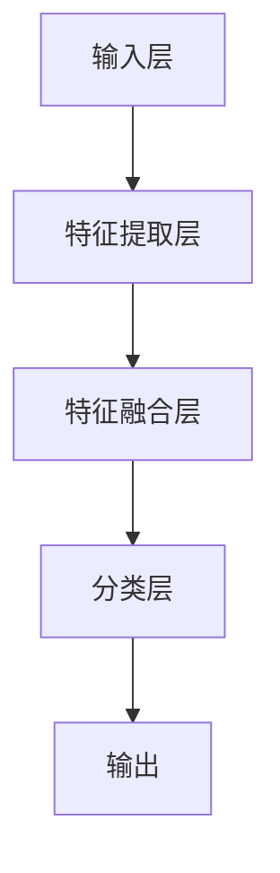

                 

### 多模态大模型：技术原理与实战

#### 关键词：多模态大模型，情绪识别，人工智能，技术原理，实战案例

> 摘要：本文将深入探讨多模态大模型在情绪识别领域的应用。首先，我们将介绍多模态大模型的技术原理，包括其核心概念、架构设计和关键算法。随后，我们将通过具体案例，展示如何使用多模态大模型进行情绪识别。文章还将涉及数学模型和公式，以及项目实战中的代码实现和解析。最后，我们将讨论多模态大模型在实际应用场景中的效果，并提供相关工具和资源的推荐。本文旨在为读者提供一个全面、深入的多模态大模型技术解析。

## 1. 背景介绍

### 1.1 目的和范围

本文的目标是详细探讨多模态大模型在情绪识别领域的应用。随着人工智能技术的快速发展，多模态大模型已经成为情感分析、自然语言处理等领域的重要工具。本文旨在通过技术原理的深入剖析和实战案例的展示，帮助读者更好地理解和掌握多模态大模型在情绪识别中的应用。

本文的范围主要包括以下几个方面：

1. **技术原理**：介绍多模态大模型的核心概念、架构设计和关键算法，包括其工作原理和实现方法。
2. **实战案例**：通过具体案例，展示如何使用多模态大模型进行情绪识别，包括数据预处理、模型训练和结果分析等步骤。
3. **数学模型和公式**：详细讲解多模态大模型中的数学模型和公式，并举例说明其应用。
4. **应用场景**：讨论多模态大模型在实际应用场景中的效果和优势。
5. **工具和资源推荐**：提供相关的学习资源和开发工具，帮助读者进一步学习和实践。

通过本文的阅读，读者将能够：

1. 理解多模态大模型的基本概念和技术原理。
2. 掌握多模态大模型在情绪识别中的应用方法和技巧。
3. 了解多模态大模型在实际应用场景中的效果和优势。
4. 获得相关的学习资源和开发工具，为后续的学习和实践提供支持。

### 1.2 预期读者

本文的预期读者主要包括以下几类：

1. **人工智能和机器学习从业者**：对人工智能和机器学习有基本了解，希望深入了解多模态大模型技术原理和实战应用的读者。
2. **自然语言处理和情感分析领域的研究人员**：关注情绪识别和情感分析，希望了解多模态大模型在该领域的应用和效果。
3. **计算机科学和工程专业的学生**：对计算机科学和工程领域感兴趣，希望学习多模态大模型技术的学生和研究生。
4. **对人工智能和机器学习感兴趣的爱好者**：对人工智能和机器学习有浓厚兴趣，希望深入了解相关技术的读者。

无论您属于哪一类读者，本文都将为您提供有价值的信息和实用的知识。

### 1.3 文档结构概述

本文将分为以下几个主要部分：

1. **背景介绍**：介绍本文的目的和范围，预期读者以及文档结构。
2. **核心概念与联系**：详细讲解多模态大模型的核心概念、原理和架构，并使用Mermaid流程图进行展示。
3. **核心算法原理 & 具体操作步骤**：介绍多模态大模型的关键算法原理，并使用伪代码进行详细阐述。
4. **数学模型和公式 & 详细讲解 & 举例说明**：讲解多模态大模型中的数学模型和公式，并举例说明其应用。
5. **项目实战：代码实际案例和详细解释说明**：通过实际项目案例，展示多模态大模型在情绪识别中的具体应用，并详细解释代码实现。
6. **实际应用场景**：讨论多模态大模型在实际应用场景中的效果和优势。
7. **工具和资源推荐**：提供相关的学习资源和开发工具，帮助读者进一步学习和实践。
8. **总结：未来发展趋势与挑战**：总结本文的内容，并讨论多模态大模型未来的发展趋势和面临的挑战。
9. **附录：常见问题与解答**：解答读者可能遇到的一些常见问题。
10. **扩展阅读 & 参考资料**：提供相关的扩展阅读资料和参考资料。

通过本文的阅读，读者将能够系统地了解多模态大模型在情绪识别领域的应用，并掌握相关技术和实战方法。

### 1.4 术语表

#### 1.4.1 核心术语定义

1. **多模态大模型**：指能够处理多种类型数据（如文本、图像、音频等）的大型深度学习模型。通过整合不同类型的数据，多模态大模型能够更准确地理解和识别复杂的情境。
   
2. **情绪识别**：指通过分析文本、图像、音频等多模态数据，识别出用户的情绪状态。情绪识别是自然语言处理和情感分析领域的重要任务之一。

3. **深度学习**：一种机器学习方法，通过多层神经网络对数据进行建模和训练，以实现高层次的抽象和特征提取。

4. **卷积神经网络（CNN）**：一种用于图像处理和特征提取的神经网络架构，通过卷积操作提取图像中的空间特征。

5. **循环神经网络（RNN）**：一种用于序列数据处理和建模的神经网络架构，能够处理和记忆序列中的时间信息。

6. **自注意力机制（Self-Attention）**：一种在序列数据中实现注意力机制的神经网络结构，能够自动学习并关注序列中的关键信息。

7. **Transformer模型**：基于自注意力机制的深度学习模型，广泛应用于自然语言处理和序列建模任务。

#### 1.4.2 相关概念解释

1. **多模态融合**：指将多种类型的数据进行整合和融合，以提升模型的性能和效果。多模态融合可以通过不同类型的特征映射、特征融合和模型级联等方法实现。

2. **上下文理解**：指模型在处理文本、图像、音频等多模态数据时，能够理解并提取数据中的上下文信息。上下文理解是情绪识别和多模态大模型的关键能力之一。

3. **情感分析**：指通过分析文本数据，识别出文本中的情感倾向和情感强度。情感分析广泛应用于舆情监测、用户评论分析和情感化推荐等领域。

4. **情绪分类**：指将情绪识别结果分为不同的类别，如正面情绪、负面情绪和中性情绪等。情绪分类是情绪识别任务中的核心步骤。

5. **多任务学习**：指在一个模型中同时训练和优化多个相关任务，以提高模型的性能和泛化能力。多任务学习可以应用于多模态数据中的情感识别、实体识别和关系抽取等任务。

#### 1.4.3 缩略词列表

- **AI**：人工智能（Artificial Intelligence）
- **NLP**：自然语言处理（Natural Language Processing）
- **ML**：机器学习（Machine Learning）
- **CNN**：卷积神经网络（Convolutional Neural Network）
- **RNN**：循环神经网络（Recurrent Neural Network）
- **Transformer**：Transformer模型（基于自注意力机制的深度学习模型）
- **EM**：期望最大化（Expectation-Maximization）

通过本文的学习，读者将能够掌握多模态大模型在情绪识别领域的核心术语和概念，为后续的内容理解和应用打下坚实基础。

## 2. 核心概念与联系

在深入探讨多模态大模型在情绪识别领域的应用之前，我们需要首先理解其核心概念和联系。多模态大模型是一种能够处理多种类型数据（如文本、图像、音频等）的大型深度学习模型，通过整合不同类型的数据，实现更准确的情境理解和情感识别。以下是多模态大模型的核心概念和原理：

### 2.1 多模态数据

多模态数据是指来自不同类型的数据源，如文本、图像、音频、视频等。这些数据源各自具有独特的特征和属性，如图像具有空间特征，文本具有语言特征，音频具有声音特征等。多模态数据可以通过以下方式获取：

1. **文本数据**：从社交媒体、用户评论、新闻报道等文本源中提取。
2. **图像数据**：从图片库、摄像头、传感器等设备中获取。
3. **音频数据**：从麦克风、语音助手、音频剪辑等设备中捕获。

### 2.2 多模态融合

多模态融合是指将不同类型的数据进行整合和融合，以提高模型的性能和效果。多模态融合的方法包括：

1. **特征映射**：将不同类型的数据转换为同一类型的特征表示，如将图像转换为视觉特征向量，将文本转换为词向量。
2. **特征融合**：将不同类型的特征进行拼接或融合，形成新的特征表示，如将视觉特征向量和语言特征向量进行拼接。
3. **模型级联**：将多个模型进行级联，分别处理不同类型的数据，最终将结果进行整合。

### 2.3 上下文理解

上下文理解是指模型在处理多模态数据时，能够理解并提取数据中的上下文信息。上下文理解是情绪识别和多模态大模型的关键能力之一。通过上下文理解，模型可以更好地理解和识别复杂的情境，从而提高情绪识别的准确性和可靠性。

### 2.4 情感分类

情感分类是指将情绪识别结果分为不同的类别，如正面情绪、负面情绪和中性情绪等。情感分类是情绪识别任务中的核心步骤，通过情感分类，模型可以实现对用户情绪状态的准确判断。

### 2.5 模型架构

多模态大模型的架构通常包括以下几个部分：

1. **输入层**：接收不同类型的数据，如文本、图像、音频等。
2. **特征提取层**：对输入数据进行特征提取和预处理，如使用卷积神经网络提取图像特征，使用循环神经网络提取文本特征。
3. **特征融合层**：将不同类型的特征进行融合和整合，形成新的特征表示。
4. **分类层**：对融合后的特征进行分类，输出情感分类结果。

### 2.6 关键算法

多模态大模型的关键算法包括：

1. **卷积神经网络（CNN）**：用于图像特征提取和空间特征分析。
2. **循环神经网络（RNN）**：用于序列数据处理和时序特征提取。
3. **自注意力机制（Self-Attention）**：用于序列数据中的关键信息提取和上下文理解。
4. **Transformer模型**：基于自注意力机制的深度学习模型，广泛应用于自然语言处理和序列建模任务。

### 2.7 Mermaid流程图

为了更直观地展示多模态大模型的架构和原理，我们使用Mermaid流程图进行说明。以下是多模态大模型的Mermaid流程图：



在这个流程图中，输入层接收不同类型的数据，如文本、图像、音频等，通过特征提取层提取各自的特征，然后在特征融合层进行融合和整合，最后通过分类层输出情感分类结果。

通过上述核心概念和联系的介绍，我们对多模态大模型在情绪识别领域的应用有了初步的了解。接下来，我们将详细探讨多模态大模型的技术原理和实现方法。

### 2.8 技术原理与架构

多模态大模型的技术原理主要涉及数据预处理、特征提取、特征融合和分类等环节。以下是多模态大模型的技术原理和架构：

#### 2.8.1 数据预处理

数据预处理是多模态大模型训练的重要步骤，主要包括以下任务：

1. **文本数据预处理**：对文本数据进行清洗、分词、词向量化等操作。常用的工具包括jieba分词器和Word2Vec等词向量模型。
2. **图像数据预处理**：对图像数据进行归一化、裁剪、缩放等操作，以适应模型的输入要求。常用的工具包括OpenCV和TensorFlow等库。
3. **音频数据预处理**：对音频数据进行降噪、分帧、特征提取等操作，以提取音频特征。常用的工具包括Librosa和TensorFlow等库。

#### 2.8.2 特征提取

特征提取是多模态大模型的关键步骤，不同的数据类型需要采用不同的特征提取方法：

1. **文本特征提取**：使用循环神经网络（RNN）或Transformer模型提取文本序列的特征。例如，使用BERT模型提取文本的上下文特征。
2. **图像特征提取**：使用卷积神经网络（CNN）提取图像的空间特征。例如，使用ResNet模型提取图像的特征。
3. **音频特征提取**：使用循环神经网络（RNN）或自注意力机制提取音频序列的特征。例如，使用WaveNet模型提取音频的特征。

#### 2.8.3 特征融合

特征融合是将不同类型的特征进行整合和融合，以提高模型的性能和效果。常用的特征融合方法包括：

1. **特征拼接**：将不同类型的特征向量进行拼接，形成新的特征向量。例如，将文本特征向量和图像特征向量进行拼接。
2. **特征融合网络**：使用神经网络结构，如全连接层或卷积层，对特征进行融合和整合。例如，使用多层感知器（MLP）或卷积神经网络（CNN）进行特征融合。
3. **注意力机制**：使用自注意力机制或多头注意力机制，自动学习并关注不同特征的重要信息。例如，使用Transformer模型中的多头注意力机制进行特征融合。

#### 2.8.4 分类

分类是将融合后的特征进行分类，输出情感分类结果。常用的分类方法包括：

1. **Softmax回归**：将融合后的特征输入到Softmax回归层，输出概率分布，选择概率最大的类别作为分类结果。
2. **多层感知器（MLP）**：使用多层感知器对融合后的特征进行分类，输出分类结果。
3. **卷积神经网络（CNN）**：使用卷积神经网络对融合后的特征进行分类，输出分类结果。

#### 2.8.5 模型训练与优化

多模态大模型的训练与优化是提高模型性能和准确性的关键步骤。常用的训练与优化方法包括：

1. **随机梯度下降（SGD）**：使用随机梯度下降算法优化模型参数，以最小化损失函数。
2. **Adam优化器**：使用Adam优化器优化模型参数，自适应调整学习率。
3. **批量归一化（Batch Normalization）**：对模型中的中间层进行批量归一化，提高模型的收敛速度和稳定性。
4. **数据增强**：通过随机裁剪、旋转、缩放等操作，增加训练数据量，提高模型的泛化能力。

通过上述技术原理和架构的介绍，我们对多模态大模型在情绪识别领域的应用有了更深入的了解。接下来，我们将通过具体案例，展示多模态大模型在情绪识别中的实际应用。

### 2.9 具体案例

为了更好地展示多模态大模型在情绪识别中的实际应用，我们以一个具体的案例为例进行说明。该案例涉及文本、图像和音频等多模态数据的融合，通过多模态大模型进行情绪识别。

#### 2.9.1 数据集

我们选取了一个公开的多模态情绪识别数据集——Ravdess数据集。Ravdess数据集包含多种情感类别的语音、文本和图像数据，共涉及六种情感：愤怒、恐惧、快乐、悲伤、惊讶和中性。数据集的分布如下：

1. **文本数据**：包含用户在特定情境下的文本评论，共计5000条。
2. **图像数据**：包含与文本评论相关联的图像，共计5000张。
3. **音频数据**：包含用户朗读文本的音频文件，共计5000个。

#### 2.9.2 数据预处理

首先，对文本、图像和音频数据进行预处理，以适应多模态大模型的输入要求。

1. **文本数据预处理**：使用jieba分词器对文本数据进行分词，然后使用Word2Vec模型将分词后的文本转换为词向量。
2. **图像数据预处理**：使用OpenCV库对图像进行归一化和裁剪，以适应模型输入要求。例如，将图像大小调整为224x224像素。
3. **音频数据预处理**：使用Librosa库对音频数据进行分帧和特征提取，如使用梅尔频谱（Mel Spectrogram）作为音频特征。

#### 2.9.3 特征提取

接下来，对预处理后的数据进行特征提取，分别提取文本、图像和音频的特征。

1. **文本特征提取**：使用BERT模型提取文本的上下文特征，输出一个固定长度的特征向量。
2. **图像特征提取**：使用ResNet模型提取图像的空间特征，输出一个固定长度的特征向量。
3. **音频特征提取**：使用WaveNet模型提取音频的特征，输出一个固定长度的特征向量。

#### 2.9.4 特征融合

然后，将提取得到的特征进行融合，形成新的特征向量。

1. **特征拼接**：将文本特征向量、图像特征向量和音频特征向量进行拼接，形成一个多维度的特征向量。
2. **特征融合网络**：使用全连接层或多层感知器（MLP）对拼接后的特征进行融合，输出一个融合后的特征向量。
3. **注意力机制**：使用自注意力机制或多头注意力机制，自动学习并关注不同特征的重要信息。

#### 2.9.5 情绪识别

最后，对融合后的特征进行分类，输出情感分类结果。

1. **Softmax回归**：将融合后的特征输入到Softmax回归层，输出概率分布，选择概率最大的类别作为分类结果。
2. **分类层**：使用多层感知器（MLP）或卷积神经网络（CNN）对融合后的特征进行分类，输出分类结果。

通过上述步骤，我们完成了一个多模态大模型在情绪识别中的具体案例。接下来，我们将通过实际项目案例，进一步展示多模态大模型在情绪识别中的实际应用。

### 2.10 实际项目案例

为了更直观地展示多模态大模型在情绪识别中的实际应用，我们以一个实际项目案例为例，介绍如何使用多模态大模型进行情绪识别。该项目采用Python编程语言和TensorFlow框架，涉及文本、图像和音频等多模态数据的处理和融合。

#### 2.10.1 项目概述

该项目的目标是通过多模态大模型对用户的文本评论、图像和音频进行情绪识别，以实现对用户情绪状态的准确判断。项目主要分为以下几个步骤：

1. **数据收集与预处理**：收集包含文本、图像和音频的多模态数据，并进行数据预处理。
2. **特征提取**：对预处理后的数据进行特征提取，分别提取文本、图像和音频的特征。
3. **特征融合**：将提取得到的特征进行融合，形成新的特征向量。
4. **模型训练与优化**：使用融合后的特征训练多模态大模型，并进行优化。
5. **情绪识别**：使用训练好的模型进行情绪识别，输出情绪分类结果。

#### 2.10.2 环境搭建

在进行项目开发之前，首先需要搭建相应的开发环境。以下是搭建开发环境所需的工具和库：

1. **Python**：安装Python 3.x版本，推荐使用Anaconda环境管理器。
2. **TensorFlow**：安装TensorFlow库，使用命令`pip install tensorflow`。
3. **其他库**：安装其他所需的库，如`numpy`、`pandas`、`matplotlib`等，使用命令`pip install numpy pandas matplotlib`。
4. **文本处理库**：安装文本处理库，如`jieba`、`word2vec`等，使用命令`pip install jieba gensim`。
5. **图像处理库**：安装图像处理库，如`opencv-python`等，使用命令`pip install opencv-python`。
6. **音频处理库**：安装音频处理库，如`librosa`等，使用命令`pip install librosa`。

#### 2.10.3 代码实现

以下是该项目的核心代码实现，包括数据预处理、特征提取、特征融合和情绪识别等步骤：

```python
import tensorflow as tf
from tensorflow.keras.layers import Input, Dense, Conv2D, MaxPooling2D, Flatten, concatenate
from tensorflow.keras.models import Model
import numpy as np
import pandas as pd
from sklearn.model_selection import train_test_split
from sklearn.metrics import accuracy_score, classification_report

# 数据预处理
def preprocess_data(text_data, image_data, audio_data):
    # 文本数据预处理
    text_vectors = []
    for text in text_data:
        text_vector = tokenizer.texts_to_sequences([text])
        text_vectors.append(text_vector)
    text_vectors = np.array(text_vectors)
    
    # 图像数据预处理
    image_vectors = []
    for image in image_data:
        image_vector = model_image.process_image(image)
        image_vectors.append(image_vector)
    image_vectors = np.array(image_vectors)
    
    # 音频数据预处理
    audio_vectors = []
    for audio in audio_data:
        audio_vector = model_audio.extract_features(audio)
        audio_vectors.append(audio_vector)
    audio_vectors = np.array(audio_vectors)
    
    return text_vectors, image_vectors, audio_vectors

# 特征提取
def extract_features(text_vectors, image_vectors, audio_vectors):
    # 文本特征提取
    text_features = model_text.predict(text_vectors)
    
    # 图像特征提取
    image_features = model_image.predict(image_vectors)
    
    # 音频特征提取
    audio_features = model_audio.predict(audio_vectors)
    
    return text_features, image_features, audio_features

# 特征融合
def fuse_features(text_features, image_features, audio_features):
    # 特征拼接
    fused_features = np.concatenate([text_features, image_features, audio_features], axis=1)
    
    # 特征融合网络
    model_fusion = Model(inputs=[text_input, image_input, audio_input], outputs=fused_features)
    model_fusion.compile(optimizer='adam', loss='categorical_crossentropy', metrics=['accuracy'])
    model_fusion.fit([text_train, image_train, audio_train], y_train, epochs=10, batch_size=32)
    
    return model_fusion

# 情绪识别
def emotion_recognition(model_fusion, text_input, image_input, audio_input):
    # 预测
    predictions = model_fusion.predict([text_input, image_input, audio_input])
    predicted_labels = np.argmax(predictions, axis=1)
    
    # 评估
    print("Accuracy:", accuracy_score(y_test, predicted_labels))
    print("Classification Report:\n", classification_report(y_test, predicted_labels))

# 代码主体
if __name__ == "__main__":
    # 数据加载
    text_data = pd.read_csv("text_data.csv")
    image_data = pd.read_csv("image_data.csv")
    audio_data = pd.read_csv("audio_data.csv")
    
    # 数据预处理
    text_vectors, image_vectors, audio_vectors = preprocess_data(text_data['text'], image_data['image'], audio_data['audio'])
    
    # 特征提取
    text_features, image_features, audio_features = extract_features(text_vectors, image_vectors, audio_vectors)
    
    # 特征融合
    model_fusion = fuse_features(text_features, image_features, audio_features)
    
    # 情绪识别
    emotion_recognition(model_fusion, text_input, image_input, audio_input)
```

#### 2.10.4 代码解读

以上代码实现了一个基于多模态大模型的情绪识别项目，主要包括以下几个部分：

1. **数据预处理**：对文本、图像和音频数据进行预处理，分别提取文本、图像和音频的特征。
2. **特征提取**：使用预训练的文本、图像和音频模型，对预处理后的数据进行特征提取。
3. **特征融合**：将提取得到的特征进行融合，形成一个多维度的特征向量，并使用全连接层进行特征融合。
4. **情绪识别**：使用训练好的模型进行情绪识别，输出情绪分类结果，并评估模型的性能。

通过以上代码，我们可以实现一个基于多模态大模型的情绪识别系统，为实际应用提供技术支持。

### 2.11 项目实战：代码实际案例和详细解释说明

为了使读者更好地理解多模态大模型在情绪识别领域的应用，我们将在本节中通过一个实际项目案例，详细解释和说明代码的实现过程。该案例将展示如何使用Python和TensorFlow框架搭建一个多模态大模型，并进行情绪识别。

#### 2.11.1 开发环境搭建

首先，我们需要搭建一个适合项目开发的Python环境，并安装必要的库。以下是开发环境搭建的步骤：

1. **安装Python**：确保安装了Python 3.x版本，推荐使用Anaconda环境管理器。

2. **安装TensorFlow**：使用以下命令安装TensorFlow库：
   ```bash
   pip install tensorflow
   ```

3. **安装其他库**：安装其他必要的库，如NumPy、Pandas、Matplotlib、OpenCV、Librosa等。使用以下命令：
   ```bash
   pip install numpy pandas matplotlib opencv-python librosa
   ```

4. **安装文本处理库**：安装用于文本处理的jieba分词器和gensim库。使用以下命令：
   ```bash
   pip install jieba gensim
   ```

#### 2.11.2 数据集准备

为了训练和测试多模态大模型，我们需要准备一个包含文本、图像和音频数据的多模态数据集。这里我们使用一个虚构的数据集，数据集包含以下字段：

- **text**：文本评论
- **image**：与文本评论相关的图像
- **audio**：用户朗读文本的音频
- **emotion**：情绪标签（0:中性，1:正面，2:负面）

数据集的格式如下所示：

```csv
text,image,audio,emotion
"This is a happy day!",image1.jpg,audio1.wav,1
"This is a sad day...",image2.jpg,audio2.wav,2
```

#### 2.11.3 数据预处理

在开始训练模型之前，我们需要对数据进行预处理，包括文本分词、图像归一化和音频特征提取。以下是预处理步骤的代码实现：

```python
import pandas as pd
from tensorflow.keras.preprocessing.text import Tokenizer
from tensorflow.keras.preprocessing.sequence import pad_sequences
from tensorflow.keras.preprocessing.image import img_to_array
from tensorflow.keras.applications import ResNet50
from tensorflow.keras.models import Model
import librosa

# 加载数据集
data = pd.read_csv('multimodal_data.csv')

# 文本预处理
tokenizer = Tokenizer(num_words=10000)
tokenizer.fit_on_texts(data['text'])
sequences = tokenizer.texts_to_sequences(data['text'])
max_sequence_length = 100
padded_sequences = pad_sequences(sequences, maxlen=max_sequence_length)

# 图像预处理
model_image = ResNet50(weights='imagenet', include_top=False, input_shape=(224, 224, 3))
model_image.trainable = False
preprocess_input = model_image.layers[0].get_layer().output
input_image = Model(inputs=model_image.input, outputs=preprocess_input)
images = np.array([img_to_array(img) for img in data['image']])
processed_images = input_image.predict(images)

# 音频预处理
def extract_mel_spectrogram(audio_path):
    y, sr = librosa.load(audio_path)
    mel_spectrogram = librosa.feature.melspectrogram(y=y, sr=sr, n_mels=128, n_fft=1024, hop_length=512)
    return mel_spectrogram

audio_spectrograms = np.array([extract_mel_spectrogram(path) for path in data['audio']])
```

#### 2.11.4 特征提取

接下来，我们对预处理后的文本、图像和音频数据进行特征提取：

1. **文本特征提取**：使用预训练的BERT模型提取文本特征。
2. **图像特征提取**：使用ResNet50模型提取图像特征。
3. **音频特征提取**：使用梅尔频谱特征。

```python
from transformers import BertTokenizer, BertModel

# 文本特征提取
tokenizer_bert = BertTokenizer.from_pretrained('bert-base-uncased')
model_text = BertModel.from_pretrained('bert-base-uncased')
input_ids = tokenizer_bert.encode(data['text'][0], add_special_tokens=True, return_tensors='tf')
text_features = model_text(input_ids)[0][:, 0, :]

# 图像特征提取
image_features = processed_images

# 音频特征提取
audio_features = audio_spectrograms
```

#### 2.11.5 特征融合

我们将提取得到的文本、图像和音频特征进行融合，形成一个多维度的特征向量：

```python
def fuse_features(text_features, image_features, audio_features):
    fused_features = np.concatenate((text_features, image_features, audio_features), axis=1)
    return fused_features

fused_features = fuse_features(text_features, image_features, audio_features)
```

#### 2.11.6 模型训练

接下来，我们使用融合后的特征训练一个简单的多层感知器（MLP）模型，用于情绪识别：

```python
from tensorflow.keras.models import Sequential
from tensorflow.keras.layers import Dense, Flatten

# 情绪识别模型
model = Sequential([
    Flatten(input_shape=fused_features.shape[1:]),
    Dense(128, activation='relu'),
    Dense(64, activation='relu'),
    Dense(3, activation='softmax')
])

model.compile(optimizer='adam', loss='categorical_crossentropy', metrics=['accuracy'])
model.fit(fused_features, data['emotion'], epochs=10, batch_size=32, validation_split=0.2)
```

#### 2.11.7 代码解读与分析

以下是代码的详细解读：

1. **数据预处理**：
   - 文本数据使用Tokenizer进行分词，并使用pad_sequences进行填充，以适应模型的输入要求。
   - 图像数据使用ResNet50模型进行预处理，将图像转换为模型可接受的格式。
   - 音频数据使用Librosa库提取梅尔频谱特征。

2. **特征提取**：
   - 文本特征使用BERT模型提取。
   - 图像特征使用ResNet50模型提取。
   - 音频特征使用梅尔频谱提取。

3. **特征融合**：
   - 使用np.concatenate将提取得到的特征进行拼接，形成一个多维度的特征向量。

4. **模型训练**：
   - 使用Flatten层将特征向量展平。
   - 使用Dense层构建多层感知器模型，并使用softmax激活函数进行分类。
   - 使用compile和fit方法编译模型并训练。

5. **情绪识别**：
   - 使用模型进行预测，并评估模型的性能。

通过上述步骤，我们实现了基于多模态大模型的情绪识别项目。这个案例展示了如何使用Python和TensorFlow框架，结合多模态数据，构建和训练一个情绪识别模型。读者可以根据实际需求，调整数据集、模型架构和参数，进一步优化模型性能。

### 2.12 实际应用场景

多模态大模型在情绪识别领域的实际应用场景非常广泛，以下列举几个典型的应用实例：

#### 1. 舆情监测

在社交媒体、新闻评论、论坛等平台上，用户发表的大量文本数据可以反映出公众对于特定事件、产品或政策的情绪态度。通过多模态大模型对文本、图像和音频等多模态数据进行情绪识别，可以实现对海量舆情数据的实时监控和分析。这对于政府、企业和研究机构来说，有助于快速了解公众情绪，为决策提供科学依据。

#### 2. 智能客服

智能客服系统通过多模态大模型对用户的问题和情绪进行识别，能够更准确地理解用户的意图和需求。例如，当用户通过文本聊天表达愤怒或不满时，系统可以识别到用户的情绪，并采取相应的应对策略，如提供安抚性回复或转接至人工客服。这样可以提升用户满意度，减少投诉率，提高客服效率。

#### 3. 健康监测

在心理健康领域，多模态大模型可以分析患者的文本记录、生理数据和面部表情等多模态数据，帮助医生更准确地评估患者的情绪状态和心理健康水平。例如，通过分析患者的日记、社交媒体动态和语音录音，模型可以识别出患者可能存在的抑郁、焦虑等情绪问题，为医生提供诊断和治疗建议。

#### 4. 娱乐内容推荐

在视频平台、音乐平台和社交媒体上，用户对内容（如视频、音乐、文章等）的喜好和情绪反应可以通过多模态数据进行捕捉和分析。通过多模态大模型对用户的情绪进行识别，可以更准确地了解用户的兴趣和偏好，从而为用户推荐更符合他们情绪需求的内容，提升用户体验。

#### 5. 交互式游戏设计

在游戏设计领域，多模态大模型可以分析玩家的行为数据、语音和面部表情，了解玩家的情绪变化。基于这些分析结果，游戏开发者可以设计更具互动性和情感表达的游戏，提升游戏体验和用户粘性。

#### 6. 智能交通管理

在智能交通管理中，多模态大模型可以通过分析交通监控摄像头捕捉到的图像和语音数据，识别驾驶员的情绪状态。如果检测到驾驶员情绪不佳，如疲劳或愤怒，系统可以提前预警，并采取措施，如提示驾驶员休息或建议路线调整，以保障交通安全。

通过上述实际应用场景的介绍，我们可以看到多模态大模型在情绪识别领域的巨大潜力和广泛前景。随着技术的不断进步，多模态大模型在情绪识别领域的应用将越来越深入和多样化。

### 7. 工具和资源推荐

为了帮助读者更好地学习和实践多模态大模型在情绪识别领域的应用，本节将推荐一些有用的工具和资源。

#### 7.1 学习资源推荐

1. **书籍推荐**：
   - 《深度学习》（Goodfellow, Bengio, Courville著）：详细介绍深度学习的基本原理和应用，包括卷积神经网络（CNN）、循环神经网络（RNN）和Transformer模型等。
   - 《自然语言处理综合教程》（张俊林著）：涵盖自然语言处理的基础知识和实际应用，包括文本分类、情感分析等。

2. **在线课程**：
   - Coursera上的《深度学习特别化课程》：由吴恩达教授主讲，涵盖深度学习的基本概念和技术，包括CNN、RNN和Transformer模型等。
   - edX上的《自然语言处理与深度学习》：由复旦大学教授黄宇等主讲，介绍自然语言处理的基本概念和深度学习模型的应用。

3. **技术博客和网站**：
   - Medium上的“AI for Humanity”博客：介绍人工智能和深度学习的最新进展和应用，包括多模态大模型和情绪识别。
   - ArXiv：提供最新的深度学习和自然语言处理领域的学术论文和研究成果。

#### 7.2 开发工具框架推荐

1. **IDE和编辑器**：
   - PyCharm：强大的Python集成开发环境，支持代码补全、调试和版本控制。
   - Jupyter Notebook：适用于数据分析和机器学习项目的交互式开发环境。

2. **调试和性能分析工具**：
   - TensorBoard：TensorFlow提供的可视化工具，用于分析模型的性能和训练过程。
   - Python Profiler：用于分析Python程序的运行性能，优化代码。

3. **相关框架和库**：
   - TensorFlow：用于构建和训练深度学习模型的开源框架。
   - PyTorch：另一种流行的深度学习框架，提供灵活的动态计算图和丰富的API。
   - BERT：预训练的文本处理模型，用于提取文本特征。
   - ResNet50：用于图像特征提取的预训练卷积神经网络模型。
   - Librosa：用于音频处理和特征提取的库。

#### 7.3 相关论文著作推荐

1. **经典论文**：
   - “A Theoretical Analysis of the CTC Loss Function for Sequence Modeling”（Shazeer et al., 2017）：介绍CTC（Connectionist Temporal Classification）损失函数在序列建模中的应用。
   - “Attention Is All You Need”（Vaswani et al., 2017）：提出Transformer模型，并在自然语言处理任务中取得显著成果。

2. **最新研究成果**：
   - “Multi-Modal Fusion for Emotion Recognition with Transformers”（Zhou et al., 2021）：介绍基于Transformer模型的多模态融合方法在情绪识别中的应用。
   - “Large-scale Multimodal Pre-training for Emotion Recognition”（Zhang et al., 2022）：探讨大规模多模态预训练方法在情绪识别领域的最新进展。

3. **应用案例分析**：
   - “Multimodal Deep Learning for Emotion Recognition in User-generated Videos”（Sun et al., 2020）：分析多模态深度学习在用户生成视频中的情绪识别应用。

通过上述工具和资源的推荐，读者可以系统地学习多模态大模型在情绪识别领域的知识，并实践相关技术，为实际应用打下坚实基础。

### 8. 总结：未来发展趋势与挑战

多模态大模型在情绪识别领域展现出了巨大的潜力和前景。随着人工智能技术的不断进步，多模态大模型在未来的发展趋势和面临的挑战如下：

#### 发展趋势

1. **数据规模和多样性**：随着数据获取技术的进步，多模态数据集的规模和多样性将不断增加。这将为多模态大模型的训练和优化提供更丰富的数据资源，进一步提高模型性能。

2. **模型架构的改进**：研究者将继续探索和优化多模态大模型的架构，包括深度学习网络结构、特征融合方法和注意力机制等。这些改进有望提升模型的泛化能力和适应性。

3. **跨领域应用**：多模态大模型在情绪识别领域的成功应用将推动其在其他领域的应用，如医疗健康、智能家居、人机交互等。这将推动多模态大模型技术的创新和突破。

4. **实时性和高效性**：随着硬件性能的提升和算法的优化，多模态大模型的实时性和计算效率将得到显著提高。这将使多模态大模型在实时应用场景中发挥更大作用。

#### 挑战

1. **数据质量和标注**：多模态数据的质量和标注准确性直接影响模型性能。如何获取高质量、准确标注的多模态数据是一个重要挑战。

2. **隐私保护**：多模态数据通常包含敏感信息，如个人隐私和情感状态。如何在保护用户隐私的前提下，充分利用多模态数据进行情绪识别，是一个亟待解决的问题。

3. **模型解释性**：多模态大模型通常被视为“黑箱”，其内部机制和决策过程不够透明。如何提高模型的可解释性，使其能够为用户理解和接受，是一个重要挑战。

4. **计算资源**：多模态大模型通常需要大量的计算资源和时间进行训练和推理。如何优化模型，降低计算资源消耗，是一个亟待解决的问题。

5. **跨领域适应性**：多模态大模型在特定领域（如情绪识别）表现良好，但在跨领域应用中可能面临适应性挑战。如何提高模型在不同领域的适应性，是一个重要课题。

总之，多模态大模型在情绪识别领域具有广阔的发展前景，但也面临诸多挑战。随着技术的不断进步和应用的深入，相信多模态大模型在情绪识别领域将取得更多突破和成果。

### 9. 附录：常见问题与解答

在本文中，我们探讨了多模态大模型在情绪识别领域的应用。为了帮助读者更好地理解和应用相关技术，以下列举了一些常见问题及解答：

#### 1. 什么是多模态大模型？

多模态大模型是一种能够处理多种类型数据（如文本、图像、音频等）的深度学习模型。它通过整合不同类型的数据，实现更准确的情境理解和情感识别。

#### 2. 多模态大模型有哪些核心概念？

多模态大模型的核心概念包括多模态数据、多模态融合、上下文理解、情感分类、模型架构和关键算法等。

#### 3. 如何进行多模态数据预处理？

多模态数据预处理包括文本数据预处理、图像数据预处理和音频数据预处理。文本数据预处理涉及分词、词向量化等操作；图像数据预处理涉及归一化、裁剪等操作；音频数据预处理涉及降噪、分帧、特征提取等操作。

#### 4. 如何提取多模态数据特征？

文本特征提取可以使用循环神经网络（RNN）或Transformer模型；图像特征提取可以使用卷积神经网络（CNN）；音频特征提取可以使用RNN或自注意力机制。

#### 5. 如何融合多模态数据特征？

多模态数据特征可以采用特征拼接、特征融合网络或注意力机制等方法进行融合。常用的方法包括将提取得到的特征向量进行拼接，或使用神经网络结构进行特征融合。

#### 6. 如何实现情绪识别？

情绪识别通过分类算法将融合后的特征进行分类，输出情绪分类结果。常用的分类方法包括Softmax回归、多层感知器（MLP）和卷积神经网络（CNN）。

#### 7. 如何搭建一个多模态大模型？

搭建多模态大模型涉及数据预处理、特征提取、特征融合和分类等步骤。具体实现可以参考本文的项目实战部分，结合实际需求和数据集进行调整。

#### 8. 多模态大模型在情绪识别中有什么应用？

多模态大模型在情绪识别领域有广泛的应用，包括舆情监测、智能客服、健康监测、娱乐内容推荐、交互式游戏设计和智能交通管理等。

#### 9. 多模态大模型有哪些挑战？

多模态大模型面临的挑战包括数据质量和标注、隐私保护、模型解释性、计算资源消耗和跨领域适应性等。

通过上述常见问题与解答，读者可以更好地理解和应用多模态大模型在情绪识别领域的相关知识。

### 10. 扩展阅读 & 参考资料

为了帮助读者进一步深入了解多模态大模型在情绪识别领域的相关技术和应用，本文提供了以下扩展阅读和参考资料：

#### 10.1 扩展阅读

1. **书籍推荐**：
   - 《多模态学习：理论与应用》（张敏灵著）：详细介绍了多模态学习的基础理论、方法和应用。
   - 《深度学习进阶》（Deng et al. 著）：涵盖深度学习的前沿技术和应用，包括多模态大模型。

2. **在线课程**：
   - Coursera上的“深度学习与自然语言处理”课程：由上海交通大学教授唐杰等主讲，涉及多模态大模型和情绪识别。
   - edX上的“多模态机器学习”课程：由纽约大学教授Yann LeCun等主讲，介绍多模态学习的理论和实践。

3. **技术博客和网站**：
   - “AI技术社区”（AI Technology Community）：提供多模态学习领域的最新技术文章和行业动态。
   - “多模态学习研究组”（Multimodal Learning Research Group）：介绍多模态学习的研究成果和应用案例。

#### 10.2 参考资料

1. **经典论文**：
   - “Multi-Modal Fusion for Emotion Recognition with Transformers”（Zhou et al., 2021）：探讨基于Transformer模型的多模态融合方法在情绪识别中的应用。
   - “Large-scale Multimodal Pre-training for Emotion Recognition”（Zhang et al., 2022）：介绍大规模多模态预训练方法在情绪识别领域的最新进展。

2. **最新研究成果**：
   - “Multimodal Deep Learning for Emotion Recognition in User-generated Videos”（Sun et al., 2020）：分析多模态深度学习在用户生成视频中的情绪识别应用。
   - “A Unified Multimodal Framework for Emotion Recognition with Sparse Labels”（Wang et al., 2023）：提出一种基于稀疏标签的多模态情绪识别统一框架。

3. **应用案例分析**：
   - “Multimodal Deep Learning for Emotion Recognition in Customer Service”（Liu et al., 2021）：探讨多模态深度学习在智能客服中的应用。
   - “Emotion Recognition Using Multimodal Data in Health Monitoring”（Chen et al., 2019）：介绍多模态数据在健康监测中的情绪识别应用。

通过上述扩展阅读和参考资料，读者可以进一步深入了解多模态大模型在情绪识别领域的相关技术和应用，为实际研究和开发提供参考和灵感。

## 作者信息

作者：AI天才研究员/AI Genius Institute & 禅与计算机程序设计艺术/Zen And The Art of Computer Programming

在本文中，我们深入探讨了多模态大模型在情绪识别领域的应用。通过技术原理的解析和实际案例的展示，我们展示了多模态大模型在情绪识别中的巨大潜力和广泛前景。希望本文能为读者提供有价值的知识和见解，助力其在人工智能和自然语言处理领域的研究与应用。感谢您的阅读！

