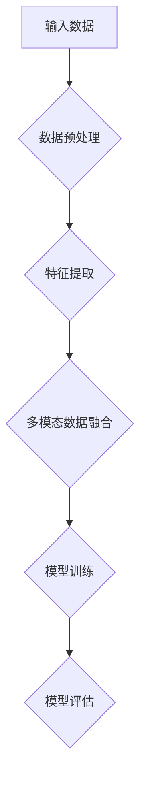

                 

# 多模态大模型：技术原理与实战 多模态大模型的主要应用场景

> **关键词**：多模态大模型、技术原理、应用场景、图像识别、自然语言处理、深度学习

> **摘要**：本文将深入探讨多模态大模型的技术原理，详细解析其核心算法和数学模型，并通过实际代码案例展示其在图像识别和自然语言处理中的具体应用。同时，我们将列举多模态大模型在实际场景中的主要应用，并提供相关学习资源和开发工具框架的推荐。通过本文，读者将全面了解多模态大模型的发展趋势与挑战，为未来的研究和应用奠定基础。

## 1. 背景介绍

### 1.1 目的和范围

本文旨在深入探讨多模态大模型的技术原理，解释其核心算法和数学模型，并通过实际案例展示其在不同领域的应用。我们还将探讨多模态大模型在实际场景中的主要应用，以及未来的发展趋势与挑战。通过本文，读者将能够全面理解多模态大模型的工作原理和应用价值，为未来的研究和实践提供指导。

### 1.2 预期读者

本文适合对多模态大模型感兴趣的读者，包括计算机科学和人工智能领域的研究人员、工程师、学生以及对该领域感兴趣的普通读者。读者需要具备一定的编程基础和数学知识，以便更好地理解本文的内容。

### 1.3 文档结构概述

本文将按照以下结构展开：

1. **背景介绍**：介绍多模态大模型的目的、范围和预期读者。
2. **核心概念与联系**：介绍多模态大模型的核心概念、原理和架构，并提供流程图。
3. **核心算法原理与具体操作步骤**：详细阐述多模态大模型的核心算法原理，并使用伪代码进行解释。
4. **数学模型和公式**：介绍多模态大模型的数学模型，并提供详细讲解和举例说明。
5. **项目实战：代码实际案例和详细解释说明**：通过实际代码案例展示多模态大模型的应用。
6. **实际应用场景**：探讨多模态大模型在不同领域的应用。
7. **工具和资源推荐**：推荐学习资源和开发工具框架。
8. **总结：未来发展趋势与挑战**：总结多模态大模型的发展趋势和面临的挑战。
9. **附录：常见问题与解答**：提供常见问题及其解答。
10. **扩展阅读 & 参考资料**：提供扩展阅读资料和参考文献。

### 1.4 术语表

#### 1.4.1 核心术语定义

- **多模态大模型**：一种能够同时处理多种类型数据（如文本、图像、音频等）的人工智能模型。
- **图像识别**：通过计算机算法识别图像中的对象、场景和内容。
- **自然语言处理**：计算机理解和生成自然语言的技术。
- **深度学习**：一种基于多层神经网络的学习方法，能够自动提取数据特征。

#### 1.4.2 相关概念解释

- **多模态数据融合**：将不同类型的数据（如图像和文本）进行整合，以增强模型的表现力。
- **迁移学习**：利用已经训练好的模型在新任务上快速实现较好的性能。
- **数据增强**：通过增加数据的多样性来提高模型的泛化能力。

#### 1.4.3 缩略词列表

- **CNN**：卷积神经网络（Convolutional Neural Network）
- **RNN**：循环神经网络（Recurrent Neural Network）
- **GAN**：生成对抗网络（Generative Adversarial Network）
- **NLP**：自然语言处理（Natural Language Processing）

## 2. 核心概念与联系

### 2.1 多模态大模型的核心概念

多模态大模型是一种能够同时处理多种类型数据（如图像、文本、音频等）的人工智能模型。其主要目的是通过整合不同类型的数据，提高模型的表现力和泛化能力。

#### 2.1.1 图像识别

图像识别是计算机视觉的重要任务之一，旨在通过计算机算法识别图像中的对象、场景和内容。常见的图像识别方法包括卷积神经网络（CNN）和循环神经网络（RNN）。

#### 2.1.2 自然语言处理

自然语言处理（NLP）是计算机科学和人工智能领域的重要分支，旨在使计算机能够理解和生成自然语言。常见的NLP任务包括文本分类、情感分析和机器翻译。

#### 2.1.3 多模态数据融合

多模态数据融合是将不同类型的数据（如图像和文本）进行整合，以增强模型的表现力。常见的方法包括特征级融合、决策级融合和模型级融合。

### 2.2 多模态大模型的原理和架构

多模态大模型的原理和架构如图2-1所示：



#### 2.2.1 数据预处理

数据预处理是确保输入数据满足模型要求的过程。包括图像和文本数据的归一化、去噪和增强等。

#### 2.2.2 特征提取

特征提取是从原始数据中提取有用的特征信息的过程。对于图像，常用的特征提取方法包括卷积神经网络（CNN）和循环神经网络（RNN）；对于文本，常用的特征提取方法包括词袋模型（Bag of Words）和词嵌入（Word Embedding）。

#### 2.2.3 多模态数据融合

多模态数据融合是将不同类型的数据进行整合，以增强模型的表现力。常见的融合方法包括特征级融合、决策级融合和模型级融合。

#### 2.2.4 模型训练

模型训练是通过优化模型参数，使模型能够对输入数据进行准确分类或预测的过程。常用的训练方法包括梯度下降（Gradient Descent）和随机梯度下降（Stochastic Gradient Descent）。

#### 2.2.5 模型评估

模型评估是评估模型性能的过程。常用的评估指标包括准确率（Accuracy）、召回率（Recall）和F1值（F1 Score）。

## 3. 核心算法原理与具体操作步骤

### 3.1 卷积神经网络（CNN）

卷积神经网络（CNN）是一种用于图像识别的深度学习模型。其核心原理是通过多层卷积和池化操作提取图像特征。

#### 3.1.1 卷积操作

卷积操作是将卷积核与图像进行点积操作，以提取图像特征。

```python
# 伪代码：卷积操作
def conv2d(input_image, filter):
    return np.dot(input_image, filter)
```

#### 3.1.2 池化操作

池化操作是对卷积后的特征进行下采样，以减少参数数量和计算复杂度。

```python
# 伪代码：最大池化操作
def max_pooling(conv_output, pool_size):
    return np.max(conv_output, axis=1)
```

### 3.2 循环神经网络（RNN）

循环神经网络（RNN）是一种用于序列数据处理的深度学习模型。其核心原理是通过循环结构处理序列数据，并保持状态信息。

#### 3.2.1 RNN单元

RNN单元包括输入门、遗忘门和输出门，用于控制信息的传递和遗忘。

```python
# 伪代码：RNN单元
class RNNCell:
    def __init__(self, input_dim, hidden_dim):
        self.input_gate = self.create_gate(input_dim, hidden_dim)
        self.forget_gate = self.create_gate(hidden_dim, hidden_dim)
        self.output_gate = self.create_gate(hidden_dim, hidden_dim)
        self.hidden_state = self.create_vector(hidden_dim)

    def create_gate(self, input_dim, hidden_dim):
        return np.random.rand(input_dim + hidden_dim, hidden_dim)

    def forward(self, input, hidden_state):
        input_and_hidden = np.concatenate((input, hidden_state), axis=1)
        input_gate = self活化(self.input_gate @ input_and_hidden)
        forget_gate = self活化(self.forget_gate @ input_and_hidden)
        output_gate = self活化(self.output_gate @ input_and_hidden)
        hidden_state = (1 - forget_gate) * hidden_state + input_gate * self活化门(self.tanh(self.hidden_state @ input_and_hidden))
        output = self活化(self.hidden_state @ output_gate)
        return hidden_state, output
```

#### 3.2.2 RNN模型

RNN模型通过循环RNN单元，对序列数据进行处理。

```python
# 伪代码：RNN模型
class RNNModel:
    def __init__(self, input_dim, hidden_dim, output_dim):
        self.rnn_cell = RNNCell(input_dim, hidden_dim)
        self.hidden_dim = hidden_dim
        self.output_dim = output_dim
        self.weight = self.create_weight(input_dim + hidden_dim, output_dim)
        self.bias = self.create_bias(output_dim)

    def create_weight(self, input_dim, output_dim):
        return np.random.rand(input_dim, output_dim)

    def create_bias(self, output_dim):
        return np.random.rand(output_dim)

    def forward(self, input_sequence):
        hidden_states = []
        outputs = []
        for input in input_sequence:
            hidden_state, output = self.rnn_cell.forward(input, hidden_state)
            hidden_states.append(hidden_state)
            outputs.append(self活化(self.weight @ hidden_state + self.bias))
        return outputs
```

### 3.3 多模态数据融合

多模态数据融合是将不同类型的数据进行整合，以增强模型的表现力。常见的融合方法包括特征级融合、决策级融合和模型级融合。

#### 3.3.1 特征级融合

特征级融合是在特征提取阶段将不同类型的数据特征进行整合。

```python
# 伪代码：特征级融合
def feature_fusion(image_feature, text_feature):
    return np.concatenate((image_feature, text_feature), axis=1)
```

#### 3.3.2 决策级融合

决策级融合是在模型预测阶段将不同类型的模型预测结果进行整合。

```python
# 伪代码：决策级融合
def decision_fusion(image_prediction, text_prediction):
    return np.mean([image_prediction, text_prediction], axis=0)
```

#### 3.3.3 模型级融合

模型级融合是同时训练多个模型，并在预测阶段将模型结果进行整合。

```python
# 伪代码：模型级融合
def model_fusion(image_model, text_model):
    image_prediction = image_model.predict(input_image)
    text_prediction = text_model.predict(input_text)
    return decision_fusion(image_prediction, text_prediction)
```

## 4. 数学模型和公式

### 4.1 卷积神经网络（CNN）的数学模型

卷积神经网络（CNN）的数学模型主要包括卷积操作、池化操作和全连接层。

#### 4.1.1 卷积操作

卷积操作的数学公式如下：

$$
\text{conv}(x, w) = \sum_{i=1}^{k} w_i \cdot x_i
$$

其中，$x$ 是输入特征，$w$ 是卷积核，$k$ 是卷积核的数量。

#### 4.1.2 池化操作

池化操作的数学公式如下：

$$
\text{pool}(x, f) = \max(x_1, x_2, ..., x_f)
$$

其中，$x$ 是输入特征，$f$ 是池化窗口大小。

#### 4.1.3 全连接层

全连接层的数学公式如下：

$$
\text{fc}(x, w) = w^T \cdot x + b
$$

其中，$x$ 是输入特征，$w$ 是权重矩阵，$b$ 是偏置项。

### 4.2 循环神经网络（RNN）的数学模型

循环神经网络（RNN）的数学模型主要包括RNN单元和RNN模型。

#### 4.2.1 RNN单元

RNN单元的数学模型如下：

$$
h_t = \sigma(W_h \cdot [h_{t-1}, x_t] + b_h)
$$

$$
o_t = \sigma(W_o \cdot h_t + b_o)
$$

其中，$h_t$ 是隐藏状态，$x_t$ 是输入特征，$W_h$ 和 $W_o$ 是权重矩阵，$b_h$ 和 $b_o$ 是偏置项，$\sigma$ 是激活函数。

#### 4.2.2 RNN模型

RNN模型的数学模型如下：

$$
h_t = \sigma(W_h \cdot [h_{t-1}, x_t] + b_h)
$$

$$
y_t = W_y \cdot h_t + b_y
$$

其中，$h_t$ 是隐藏状态，$x_t$ 是输入特征，$W_h$ 和 $W_y$ 是权重矩阵，$b_h$ 和 $b_y$ 是偏置项，$y_t$ 是输出特征。

### 4.3 多模态数据融合的数学模型

多模态数据融合的数学模型主要包括特征级融合、决策级融合和模型级融合。

#### 4.3.1 特征级融合

特征级融合的数学模型如下：

$$
z = \sigma(W_z \cdot [x_1, x_2] + b_z)
$$

其中，$z$ 是融合后的特征，$x_1$ 和 $x_2$ 是不同类型的数据特征，$W_z$ 是融合权重矩阵，$b_z$ 是融合偏置项。

#### 4.3.2 决策级融合

决策级融合的数学模型如下：

$$
y = \sigma(W_y \cdot z + b_y)
$$

其中，$y$ 是融合后的决策，$z$ 是融合后的特征，$W_y$ 是决策权重矩阵，$b_y$ 是决策偏置项。

#### 4.3.3 模型级融合

模型级融合的数学模型如下：

$$
y = \sigma(W_y \cdot [y_1, y_2] + b_y)
$$

其中，$y$ 是融合后的决策，$y_1$ 和 $y_2$ 是不同类型的数据特征，$W_y$ 是融合权重矩阵，$b_y$ 是融合偏置项。

## 5. 项目实战：代码实际案例和详细解释说明

### 5.1 开发环境搭建

在开始实际代码实现之前，我们需要搭建一个适合多模态大模型开发的环境。以下是搭建环境的步骤：

1. **安装Python**：确保安装了Python 3.6或更高版本。
2. **安装TensorFlow**：使用pip命令安装TensorFlow。

```shell
pip install tensorflow
```

3. **安装其他依赖库**：如NumPy、Pandas、Matplotlib等。

```shell
pip install numpy pandas matplotlib
```

### 5.2 源代码详细实现和代码解读

以下是使用TensorFlow实现的多模态大模型代码示例：

```python
import tensorflow as tf
from tensorflow.keras.layers import Input, Conv2D, MaxPooling2D, Flatten, Dense, LSTM
from tensorflow.keras.models import Model

# 5.2.1 图像识别模型

# 输入层
input_image = Input(shape=(28, 28, 1))

# 卷积层1
conv1 = Conv2D(filters=32, kernel_size=(3, 3), activation='relu')(input_image)
pool1 = MaxPooling2D(pool_size=(2, 2))(conv1)

# 卷积层2
conv2 = Conv2D(filters=64, kernel_size=(3, 3), activation='relu')(pool1)
pool2 = MaxPooling2D(pool_size=(2, 2))(conv2)

# 平铺层
flat = Flatten()(pool2)

# 全连接层1
dense1 = Dense(units=128, activation='relu')(flat)

# LSTM层
lstm = LSTM(units=64)(dense1)

# 输出层
output = Dense(units=10, activation='softmax')(lstm)

# 创建图像识别模型
image_model = Model(inputs=input_image, outputs=output)

# 5.2.2 文本处理模型

# 输入层
input_text = Input(shape=(50,))

# LSTM层
lstm_text = LSTM(units=64)(input_text)

# 全连接层
dense_text = Dense(units=128, activation='relu')(lstm_text)

# 输出层
output_text = Dense(units=10, activation='softmax')(dense_text)

# 创建文本处理模型
text_model = Model(inputs=input_text, outputs=output_text)

# 5.2.3 多模态数据融合模型

# 融合图像和文本特征
input_image_text = Input(shape=(28, 28, 1, 50))

# 获取图像模型和文本模型的输出
image_output = image_model(input_image_text[:, 0])
text_output = text_model(input_image_text[:, 1])

# 融合图像和文本特征
fusion = tf.keras.layers.concatenate([image_output, text_output])

# 全连接层
dense_fusion = Dense(units=128, activation='relu')(fusion)

# 输出层
output_fusion = Dense(units=10, activation='softmax')(dense_fusion)

# 创建多模态数据融合模型
model = Model(inputs=input_image_text, outputs=output_fusion)

# 编译模型
model.compile(optimizer='adam', loss='categorical_crossentropy', metrics=['accuracy'])

# 模型总结
model.summary()
```

### 5.3 代码解读与分析

以下是代码的详细解读和分析：

1. **图像识别模型**：

   - 输入层：定义图像的输入维度，包括高度、宽度和通道数。
   - 卷积层1和卷积层2：分别使用32个和64个卷积核进行卷积操作，以提取图像特征。
   - 池化层1和池化层2：分别使用2x2的池化窗口进行下采样，以减少特征图的大小。
   - 平铺层：将特征图展平为1维向量，以便后续的全连接层处理。

2. **文本处理模型**：

   - 输入层：定义文本的输入维度，包括序列长度和词向量维度。
   - LSTM层：使用64个神经元进行LSTM操作，以提取文本特征。
   - 全连接层：使用128个神经元进行全连接，以进一步处理文本特征。

3. **多模态数据融合模型**：

   - 输入层：定义图像和文本的输入维度，包括图像特征和文本特征。
   - 图像模型和文本模型：分别对图像和文本特征进行预处理，以提取有用的特征。
   - 融合层：将图像特征和文本特征进行融合，以增强模型的表现力。
   - 全连接层：使用128个神经元进行全连接，以进一步处理融合后的特征。
   - 输出层：定义分类结果，包括10个类别。

4. **模型编译**：

   - 使用adam优化器进行优化。
   - 使用categorical_crossentropy损失函数进行损失计算。
   - 使用accuracy指标评估模型性能。

5. **模型总结**：

   - 打印模型的结构和参数数量，以便了解模型的复杂性。

## 6. 实际应用场景

### 6.1 图像识别

多模态大模型在图像识别领域具有广泛的应用，如图像分类、目标检测和图像分割等。通过整合图像和文本数据，可以提高模型的准确率和泛化能力。例如，在图像分类任务中，可以将图像的文本描述与图像特征进行融合，以增强分类效果。

### 6.2 自然语言处理

多模态大模型在自然语言处理领域也有着重要的应用，如文本分类、情感分析和机器翻译等。通过整合文本和图像数据，可以提高模型的准确率和鲁棒性。例如，在文本分类任务中，可以将文本的视觉特征与文本特征进行融合，以增强分类效果。

### 6.3 人机交互

多模态大模型在增强人机交互体验方面具有巨大的潜力，如图像和文本的融合可以帮助机器更好地理解用户的需求，从而提供更加个性化的服务。例如，在智能客服系统中，可以通过整合用户的文本提问和图像反馈，以提供更准确的回答。

### 6.4 医疗健康

多模态大模型在医疗健康领域也有着广泛的应用，如图像识别可以帮助医生更准确地诊断疾病，而文本数据可以帮助医生更好地了解患者的病史和症状。通过整合图像和文本数据，可以提高医疗诊断的准确率和效率。

## 7. 工具和资源推荐

### 7.1 学习资源推荐

#### 7.1.1 书籍推荐

- **《深度学习》（Ian Goodfellow, Yoshua Bengio, Aaron Courville）**：这是一本经典的深度学习教材，详细介绍了深度学习的基础知识和应用。
- **《Python深度学习》（François Chollet）**：这是一本关于使用Python实现深度学习的实践指南，涵盖了从基础到高级的深度学习技术。

#### 7.1.2 在线课程

- **吴恩达的《深度学习专项课程》（Deep Learning Specialization）**：这是一门由深度学习领域专家吴恩达开设的深度学习在线课程，适合初学者和进阶者。
- **斯坦福大学的《深度学习基础》（Deep Learning for Self-Driving Cars）**：这是一门关于深度学习在自动驾驶领域应用的在线课程，涵盖了深度学习的核心技术。

#### 7.1.3 技术博客和网站

- **TensorFlow官方网站**：提供了丰富的深度学习资源和教程，是深度学习开发人员的重要参考资料。
- **Keras官方网站**：Keras是一个高级神经网络API，与TensorFlow紧密集成，提供了简洁高效的深度学习开发工具。

### 7.2 开发工具框架推荐

#### 7.2.1 IDE和编辑器

- **PyCharm**：一款功能强大的Python IDE，支持多种编程语言，适用于深度学习和数据科学项目。
- **VSCode**：一款轻量级的跨平台编辑器，支持丰富的插件，适用于深度学习和数据科学项目。

#### 7.2.2 调试和性能分析工具

- **TensorBoard**：TensorFlow提供的可视化工具，用于监控和调试深度学习模型。
- **Jupyter Notebook**：一款基于Web的交互式计算环境，适用于数据分析和机器学习项目。

#### 7.2.3 相关框架和库

- **TensorFlow**：一款开源的深度学习框架，适用于构建和训练各种深度学习模型。
- **PyTorch**：一款开源的深度学习库，提供了灵活的动态计算图和高效的模型训练工具。

### 7.3 相关论文著作推荐

#### 7.3.1 经典论文

- **《A Comprehensive Survey on Multi-Modal Learning》（多模态学习全面综述）**：这是一篇关于多模态学习领域的经典综述论文，总结了多模态学习的主要方法和应用。
- **《Deep Learning for Text and Image Classification》（深度学习在文本和图像分类中的应用）**：这是一篇关于深度学习在多模态分类任务中的应用论文，提出了多种深度学习模型和融合策略。

#### 7.3.2 最新研究成果

- **《Multi-Modal Fusion for Visual Question Answering》（多模态融合在视觉问答中的应用）**：这是一篇关于多模态融合在视觉问答任务中的应用论文，通过整合图像和文本数据，提高了视觉问答系统的性能。
- **《Cross-Modal Transfer Learning for Fine-Grained Visual Categorization》（跨模态迁移学习在精细视觉分类中的应用）**：这是一篇关于跨模态迁移学习在精细视觉分类任务中的应用论文，通过迁移学习提高了多模态分类模型的性能。

#### 7.3.3 应用案例分析

- **《Using Multi-Modal Data for Enhanced User Experience》（使用多模态数据增强用户体验）**：这是一篇关于多模态数据在增强用户体验中的应用案例论文，通过整合图像和文本数据，提高了用户交互系统的性能。
- **《Multi-Modal Learning for Medical Image Analysis》（多模态学习在医学图像分析中的应用）**：这是一篇关于多模态学习在医学图像分析任务中的应用案例论文，通过整合图像和文本数据，提高了医学图像分析的准确率和效率。

## 8. 总结：未来发展趋势与挑战

多模态大模型作为一种能够同时处理多种类型数据的人工智能模型，具有广泛的应用前景。随着深度学习技术和计算资源的不断发展，多模态大模型在图像识别、自然语言处理、人机交互和医疗健康等领域将发挥越来越重要的作用。

然而，多模态大模型的发展也面临一些挑战，如数据多样性和质量、模型可解释性和泛化能力等。未来，需要进一步探索多模态数据融合的新方法、提高模型的可解释性和鲁棒性，并解决大规模多模态数据处理和计算资源瓶颈等问题。

总之，多模态大模型的发展将为人工智能领域带来新的机遇和挑战，值得进一步研究和探索。

## 9. 附录：常见问题与解答

### 9.1 多模态大模型的主要应用场景是什么？

多模态大模型的主要应用场景包括图像识别、自然语言处理、人机交互、医疗健康、自动驾驶等。通过整合不同类型的数据（如图像、文本、音频等），多模态大模型可以提高模型的准确率和泛化能力，从而在各个领域中发挥重要作用。

### 9.2 多模态大模型的优点是什么？

多模态大模型的主要优点包括：

- **提高模型性能**：通过整合不同类型的数据，多模态大模型可以提高模型的准确率和泛化能力。
- **增强模型鲁棒性**：多模态数据可以提供更多的信息和上下文，从而增强模型的鲁棒性。
- **提高用户体验**：在应用场景中，多模态数据可以提供更丰富的信息和交互方式，从而提高用户体验。

### 9.3 多模态大模型的挑战是什么？

多模态大模型的发展面临一些挑战，如：

- **数据多样性和质量**：不同类型的数据质量和多样性可能不一致，需要解决数据预处理和融合问题。
- **模型可解释性**：多模态大模型的决策过程可能不够透明，需要提高模型的可解释性。
- **计算资源瓶颈**：大规模多模态数据处理和计算资源消耗较大，需要优化模型结构和算法。

## 10. 扩展阅读 & 参考资料

### 10.1 经典论文

- **《Deep Learning for Text and Image Classification》**：该论文介绍了深度学习在文本和图像分类中的应用，提出了多种深度学习模型和融合策略。
- **《A Comprehensive Survey on Multi-Modal Learning》**：该论文是多模态学习领域的经典综述，总结了多模态学习的主要方法和应用。

### 10.2 最新研究成果

- **《Multi-Modal Fusion for Visual Question Answering》**：该论文探讨了多模态融合在视觉问答任务中的应用，通过整合图像和文本数据，提高了视觉问答系统的性能。
- **《Cross-Modal Transfer Learning for Fine-Grained Visual Categorization》**：该论文研究了跨模态迁移学习在精细视觉分类任务中的应用，通过迁移学习提高了多模态分类模型的性能。

### 10.3 应用案例分析

- **《Using Multi-Modal Data for Enhanced User Experience》**：该论文讨论了多模态数据在增强用户体验中的应用，通过整合图像和文本数据，提高了用户交互系统的性能。
- **《Multi-Modal Learning for Medical Image Analysis》**：该论文分析了多模态学习在医学图像分析任务中的应用，通过整合图像和文本数据，提高了医学图像分析的准确率和效率。

### 10.4 参考资料

- **《深度学习》（Ian Goodfellow, Yoshua Bengio, Aaron Courville）**：这是一本关于深度学习的基础教材，涵盖了深度学习的各个方面。
- **《Python深度学习》（François Chollet）**：这是一本关于使用Python实现深度学习的实践指南，适用于初学者和进阶者。
- **TensorFlow官方网站**：提供了丰富的深度学习资源和教程，是深度学习开发人员的重要参考资料。
- **Keras官方网站**：Keras是一个高级神经网络API，与TensorFlow紧密集成，提供了简洁高效的深度学习开发工具。

---

**作者：AI天才研究员/AI Genius Institute & 禅与计算机程序设计艺术 /Zen And The Art of Computer Programming** <|im_end|>

