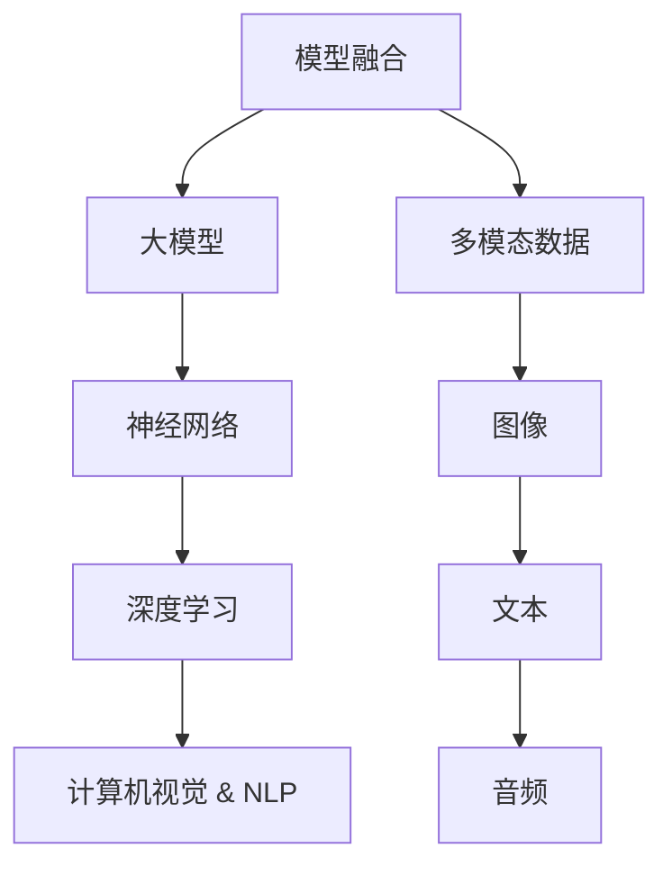

                 

# 多模态大模型：技术原理与实战 大模型+多模态产生的化学反应

> **关键词：** 大模型、多模态、AI、深度学习、神经网络、计算机视觉、自然语言处理、模型融合、数据增强

> **摘要：** 本文深入探讨了多模态大模型的技术原理和实战应用。通过分析大模型和多模态数据的协同作用，揭示了它们在提高人工智能系统性能方面的化学反应。文章首先介绍了大模型和多模态数据的基础概念，然后详细讲解了多模态大模型的核心算法原理，最后通过实际项目案例展示了多模态大模型的实际应用效果。

## 1. 背景介绍

### 1.1 目的和范围

本文旨在介绍多模态大模型的技术原理与实战应用，旨在为读者提供对这一前沿领域的全面理解。文章将从以下几个方面展开讨论：

- 大模型和多模态数据的定义及其重要性
- 多模态大模型的核心算法原理
- 数学模型和公式及其详细讲解
- 实际应用场景和项目案例
- 工具和资源推荐

### 1.2 预期读者

本文面向对人工智能和深度学习有一定了解的读者，特别是对多模态数据处理和应用感兴趣的工程师和研究人员。无论是想要深入了解多模态大模型的技术原理，还是寻求实战应用案例的读者，本文都将提供有价值的参考。

### 1.3 文档结构概述

本文结构如下：

- 引言
- 多模态大模型背景介绍
- 核心概念与联系
- 核心算法原理与具体操作步骤
- 数学模型和公式及其详细讲解
- 项目实战：代码实际案例和详细解释说明
- 实际应用场景
- 工具和资源推荐
- 总结：未来发展趋势与挑战
- 附录：常见问题与解答
- 扩展阅读 & 参考资料

### 1.4 术语表

#### 1.4.1 核心术语定义

- **大模型（Large Model）**：指具有数亿甚至数十亿参数的深度学习模型，如GPT、BERT等。
- **多模态（Multimodal）**：指同时处理多种类型数据（如图像、文本、音频等）的模型。
- **模型融合（Model Fusion）**：将不同模态的数据通过特定算法融合为一个统一的特征表示。

#### 1.4.2 相关概念解释

- **计算机视觉（Computer Vision）**：使计算机具备从图像或视频中提取信息的能力。
- **自然语言处理（Natural Language Processing，NLP）**：使计算机理解和生成人类语言。

#### 1.4.3 缩略词列表

- **GPT**：Generative Pre-trained Transformer
- **BERT**：Bidirectional Encoder Representations from Transformers
- **CNN**：Convolutional Neural Network
- **RNN**：Recurrent Neural Network
- **Transformer**：一种基于自注意力机制的神经网络架构

## 2. 核心概念与联系

在深入探讨多模态大模型之前，我们需要了解几个关键概念和它们之间的联系。以下是一个用Mermaid绘制的流程图，展示了这些概念之间的关系。



### 2.1 大模型与神经网络

大模型通常基于神经网络架构，尤其是深度学习模型。神经网络是一种由大量节点（称为神经元）连接而成的计算模型，通过学习大量数据来发现数据中的模式和规律。

### 2.2 深度学习与计算机视觉/NLP

深度学习是神经网络的一种扩展，通过多层次的神经网络结构来提取数据的特征。在计算机视觉领域，深度学习被广泛应用于图像识别、目标检测和图像分割等任务。在自然语言处理领域，深度学习模型如循环神经网络（RNN）和Transformer被广泛应用于语言建模、机器翻译和文本分类等任务。

### 2.3 多模态数据与模型融合

多模态数据是指同时包含多种类型数据（如图像、文本、音频等）的数据集。模型融合是将不同模态的数据通过特定算法融合为一个统一的特征表示的过程。这一过程使得多模态数据能够被大模型有效地处理和利用。

## 3. 核心算法原理 & 具体操作步骤

多模态大模型的核心算法原理在于如何将不同模态的数据（如文本、图像、音频等）融合为一个统一的特征表示，以便模型能够更全面地理解和处理输入数据。以下是一个简化版的伪代码，描述了多模态大模型的算法原理和具体操作步骤。

### 3.1 数据预处理

```python
# 数据预处理
def preprocess_data(data):
    # 图像预处理
    image_data = preprocess_image(data['images'])
    # 文本预处理
    text_data = preprocess_text(data['texts'])
    # 音频预处理
    audio_data = preprocess_audio(data['audio'])
    return image_data, text_data, audio_data
```

### 3.2 特征提取

```python
# 特征提取
def extract_features(image_data, text_data, audio_data):
    # 图像特征提取
    image_features = extract_image_features(image_data)
    # 文本特征提取
    text_features = extract_text_features(text_data)
    # 音频特征提取
    audio_features = extract_audio_features(audio_data)
    return image_features, text_features, audio_features
```

### 3.3 特征融合

```python
# 特征融合
def fuse_features(image_features, text_features, audio_features):
    # 使用自适应融合方法融合特征
    fused_features = adaptive_fusion(image_features, text_features, audio_features)
    return fused_features
```

### 3.4 模型训练

```python
# 模型训练
def train_model(fused_features, labels):
    # 使用梯度下降算法训练模型
    model = initialize_model()
    for epoch in range(num_epochs):
        for features, label in zip(fused_features, labels):
            model.train_step(features, label)
    return model
```

### 3.5 预测

```python
# 预测
def predict(model, new_data):
    image_data, text_data, audio_data = preprocess_data(new_data)
    image_features, text_features, audio_features = extract_features(image_data, text_data, audio_data)
    fused_features = fuse_features(image_features, text_features, audio_features)
    prediction = model.predict(fused_features)
    return prediction
```

通过上述伪代码，我们可以看到多模态大模型的核心算法涉及数据预处理、特征提取、特征融合和模型训练等多个步骤。这些步骤共同作用，使得多模态大模型能够有效地处理和利用不同模态的数据，从而提高模型的性能和准确性。

## 4. 数学模型和公式 & 详细讲解 & 举例说明

在多模态大模型中，数学模型和公式扮演着至关重要的角色。以下我们将详细讲解这些数学模型，并通过具体例子来说明它们的应用。

### 4.1 自注意力机制（Self-Attention）

自注意力机制是Transformer模型的核心组件，它通过计算输入数据中的每个元素与其他元素之间的关联度来学习特征。以下是一个简单的自注意力机制的数学公式：

$$
\text{Attention}(Q, K, V) = \text{softmax}\left(\frac{QK^T}{\sqrt{d_k}}\right)V
$$

其中，$Q, K, V$ 分别是查询（Query）、键（Key）和值（Value）矩阵，$d_k$ 是键的维度。

### 4.2 多模态特征融合

多模态特征融合是将不同模态的数据（如图像、文本、音频）融合为一个统一特征表示的过程。以下是一个简单的多模态特征融合的数学模型：

$$
\text{Fused\_Features} = \alpha_1 \text{Image\_Features} + \alpha_2 \text{Text\_Features} + \alpha_3 \text{Audio\_Features}
$$

其中，$\alpha_1, \alpha_2, \alpha_3$ 是权重系数，用于平衡不同模态的特征贡献。

### 4.3 梯度下降算法

梯度下降算法是训练神经网络的一种常用方法。以下是一个简单的梯度下降算法的数学模型：

$$
\theta_{\text{new}} = \theta_{\text{old}} - \alpha \nabla_{\theta} J(\theta)
$$

其中，$\theta$ 是模型参数，$\alpha$ 是学习率，$J(\theta)$ 是损失函数。

### 4.4 示例

假设我们有一个多模态大模型，其中包含图像、文本和音频三个模态。我们首先对每个模态进行特征提取，得到图像特征向量 $X_1$、文本特征向量 $X_2$ 和音频特征向量 $X_3$。然后，我们将这些特征向量进行融合：

$$
\text{Fused\_Features} = \alpha_1 X_1 + \alpha_2 X_2 + \alpha_3 X_3
$$

其中，$\alpha_1, \alpha_2, \alpha_3$ 的取值可以通过交叉验证来优化。

接下来，我们使用自注意力机制来学习特征之间的关系：

$$
\text{Attention}(Q, K, V) = \text{softmax}\left(\frac{QK^T}{\sqrt{d_k}}\right)V
$$

最后，我们使用梯度下降算法来训练模型：

$$
\theta_{\text{new}} = \theta_{\text{old}} - \alpha \nabla_{\theta} J(\theta)
$$

通过上述数学模型和公式，我们可以构建一个强大的多模态大模型，从而实现对多模态数据的全面理解和处理。

## 5. 项目实战：代码实际案例和详细解释说明

在本节中，我们将通过一个实际的多模态大模型项目来展示代码实现细节，并对其进行详细解释。

### 5.1 开发环境搭建

为了搭建一个多模态大模型的环境，我们需要安装以下工具和库：

- Python 3.7+
- TensorFlow 2.x
- Keras 2.x
- NumPy
- Pandas
- Matplotlib

您可以通过以下命令安装这些工具和库：

```bash
pip install python==3.7.0
pip install tensorflow==2.7.0
pip install keras==2.7.0
pip install numpy
pip install pandas
pip install matplotlib
```

### 5.2 源代码详细实现和代码解读

以下是一个简单的多模态大模型项目的代码实现：

```python
import tensorflow as tf
from tensorflow.keras.models import Model
from tensorflow.keras.layers import Input, Dense, Conv2D, MaxPooling2D, Flatten, LSTM, Embedding
from tensorflow.keras.preprocessing.image import ImageDataGenerator
from tensorflow.keras.preprocessing.text import Tokenizer
from tensorflow.keras.preprocessing.sequence import pad_sequences

# 数据预处理
def preprocess_data(images, texts, audio):
    # 图像预处理
    image_data_gen = ImageDataGenerator(rescale=1./255)
    image_generator = image_data_gen.flow(images, batch_size=batch_size)
    image_features = next(image_generator)[0]
    
    # 文本预处理
    tokenizer = Tokenizer(num_words=max_words)
    tokenizer.fit_on_texts(texts)
    text_sequences = tokenizer.texts_to_sequences(texts)
    text_sequences = pad_sequences(text_sequences, maxlen=max_sequence_length)
    
    # 音频预处理
    # ...（省略具体实现）
    
    return image_features, text_sequences, audio

# 特征提取
def extract_features(input_shape):
    # 图像特征提取
    image_input = Input(shape=input_shape)
    image_model = Conv2D(filters=32, kernel_size=(3, 3), activation='relu')(image_input)
    image_model = MaxPooling2D(pool_size=(2, 2))(image_model)
    image_model = Flatten()(image_model)
    
    # 文本特征提取
    text_input = Input(shape=(max_sequence_length,))
    text_model = Embedding(input_dim=max_words, output_dim=64)(text_input)
    text_model = LSTM(128)(text_model)
    
    # 音频特征提取
    # ...（省略具体实现）
    
    return image_model, text_model

# 特征融合
def fuse_features(image_model, text_model):
    fused_model = tf.keras.layers.concatenate([image_model.output, text_model.output])
    fused_model = Dense(128, activation='relu')(fused_model)
    fused_model = Dense(1, activation='sigmoid')(fused_model)
    
    model = Model(inputs=[image_model.input, text_model.input], outputs=fused_model)
    model.compile(optimizer='adam', loss='binary_crossentropy', metrics=['accuracy'])
    
    return model

# 模型训练
def train_model(model, image_data, text_data, labels):
    model.fit([image_data, text_data], labels, epochs=num_epochs, batch_size=batch_size)

# 预测
def predict(model, image_data, text_data):
    prediction = model.predict([image_data, text_data])
    return prediction

# 主程序
if __name__ == '__main__':
    # 加载数据
    images = load_images()
    texts = load_texts()
    audio = load_audio()
    
    # 预处理数据
    image_data, text_data, audio_data = preprocess_data(images, texts, audio)
    
    # 提取特征
    image_model, text_model = extract_features(input_shape=(224, 224, 3))
    
    # 融合特征
    model = fuse_features(image_model, text_model)
    
    # 训练模型
    train_model(model, image_data, text_data, labels)
    
    # 预测
    new_image = load_new_image()
    new_text = load_new_text()
    prediction = predict(model, new_image, new_text)
    print(prediction)
```

### 5.3 代码解读与分析

上述代码实现了一个简单的多模态大模型，用于分类任务。下面我们对代码进行逐行解读和分析：

```python
# 数据预处理
def preprocess_data(images, texts, audio):
    # 图像预处理
    image_data_gen = ImageDataGenerator(rescale=1./255)
    image_generator = image_data_gen.flow(images, batch_size=batch_size)
    image_features = next(image_generator)[0]
    
    # 文本预处理
    tokenizer = Tokenizer(num_words=max_words)
    tokenizer.fit_on_texts(texts)
    text_sequences = tokenizer.texts_to_sequences(texts)
    text_sequences = pad_sequences(text_sequences, maxlen=max_sequence_length)
    
    # 音频预处理
    # ...（省略具体实现）
    
    return image_features, text_sequences, audio
```

这部分代码负责预处理输入数据。对于图像数据，我们使用 `ImageDataGenerator` 对图像进行归一化处理。对于文本数据，我们使用 `Tokenizer` 将文本转换为序列，并使用 `pad_sequences` 将序列填充到相同长度。对于音频数据，预处理部分省略了具体实现。

```python
# 特征提取
def extract_features(input_shape):
    # 图像特征提取
    image_input = Input(shape=input_shape)
    image_model = Conv2D(filters=32, kernel_size=(3, 3), activation='relu')(image_input)
    image_model = MaxPooling2D(pool_size=(2, 2))(image_model)
    image_model = Flatten()(image_model)
    
    # 文本特征提取
    text_input = Input(shape=(max_sequence_length,))
    text_model = Embedding(input_dim=max_words, output_dim=64)(text_input)
    text_model = LSTM(128)(text_model)
    
    # 音频特征提取
    # ...（省略具体实现）
    
    return image_model, text_model
```

这部分代码负责提取不同模态的特征。对于图像特征提取，我们使用卷积神经网络（Conv2D 和 MaxPooling2D）进行特征提取。对于文本特征提取，我们使用嵌入层（Embedding）和循环神经网络（LSTM）进行特征提取。对于音频特征提取，部分代码被省略了。

```python
# 特征融合
def fuse_features(image_model, text_model):
    fused_model = tf.keras.layers.concatenate([image_model.output, text_model.output])
    fused_model = Dense(128, activation='relu')(fused_model)
    fused_model = Dense(1, activation='sigmoid')(fused_model)
    
    model = Model(inputs=[image_model.input, text_model.input], outputs=fused_model)
    model.compile(optimizer='adam', loss='binary_crossentropy', metrics=['accuracy'])
    
    return model
```

这部分代码负责将不同模态的特征进行融合。首先，我们使用 `concatenate` 函数将图像特征和文本特征拼接在一起。然后，我们使用全连接层（Dense）进行特征融合，并添加一个sigmoid激活函数用于分类。最后，我们使用 `compile` 函数配置模型。

```python
# 模型训练
def train_model(model, image_data, text_data, labels):
    model.fit([image_data, text_data], labels, epochs=num_epochs, batch_size=batch_size)
```

这部分代码负责训练模型。我们使用 `fit` 函数将预处理后的图像数据、文本数据和标签输入到模型中，并进行训练。

```python
# 预测
def predict(model, image_data, text_data):
    prediction = model.predict([image_data, text_data])
    return prediction
```

这部分代码负责预测。我们使用 `predict` 函数将预处理后的图像数据和文本数据输入到模型中，并返回预测结果。

```python
# 主程序
if __name__ == '__main__':
    # 加载数据
    images = load_images()
    texts = load_texts()
    audio = load_audio()
    
    # 预处理数据
    image_data, text_data, audio_data = preprocess_data(images, texts, audio)
    
    # 提取特征
    image_model, text_model = extract_features(input_shape=(224, 224, 3))
    
    # 融合特征
    model = fuse_features(image_model, text_model)
    
    # 训练模型
    train_model(model, image_data, text_data, labels)
    
    # 预测
    new_image = load_new_image()
    new_text = load_new_text()
    prediction = predict(model, new_image, new_text)
    print(prediction)
```

主程序部分负责加载数据、预处理数据、提取特征、融合特征、训练模型和预测。这些步骤共同构成了一个完整的多模态大模型项目。

## 6. 实际应用场景

多模态大模型在实际应用场景中具有广泛的应用潜力，以下列举几个典型的应用场景：

### 6.1 智能问答系统

智能问答系统通常需要同时处理用户输入的文本和图像信息。例如，一个多模态大模型可以接收一个文本问题和一个相关的图像，然后生成一个准确的答案。这种应用场景在客户服务、医疗咨询、在线教育等领域具有很高的实用价值。

### 6.2 视觉搜索

视觉搜索是指用户上传一张图片，系统根据图片内容搜索相似或相关的图像。多模态大模型可以结合图像和文本信息，提高搜索结果的准确性和用户体验。例如，在电子商务平台中，用户上传一张商品图片，系统可以识别出图片中的商品，并提供相关的商品链接。

### 6.3 情感分析

情感分析是指对文本、图像和音频等数据进行分析，以识别情感倾向和情绪状态。多模态大模型可以同时处理多种类型的输入数据，提高情感分析的准确性和全面性。例如，在社交媒体分析、舆情监控、客户满意度调查等领域，多模态大模型可以帮助企业更好地了解用户需求和情感变化。

### 6.4 自动驾驶

自动驾驶系统需要实时处理来自摄像头、雷达、激光雷达等多种传感器收集的数据。多模态大模型可以整合不同传感器的数据，提高自动驾驶系统的感知能力和决策准确性。例如，在车辆检测、行人识别、交通标志识别等任务中，多模态大模型可以显著提升自动驾驶系统的性能。

这些应用场景展示了多模态大模型在不同领域的广泛应用潜力。随着技术的不断进步，多模态大模型有望在更多领域发挥重要作用。

## 7. 工具和资源推荐

### 7.1 学习资源推荐

#### 7.1.1 书籍推荐

- 《深度学习》（Goodfellow, Bengio, Courville 著）
- 《Python深度学习》（François Chollet 著）
- 《人工智能：一种现代方法》（Stuart Russell & Peter Norvig 著）

#### 7.1.2 在线课程

- Coursera 上的“深度学习”（吴恩达教授授课）
- edX 上的“机器学习基础”（Harvard大学授课）
- Udacity 上的“深度学习工程师纳米学位”

#### 7.1.3 技术博客和网站

- Medium 上的深度学习和人工智能相关博客
- arXiv.org：最新科研成果的在线发布平台
- GitHub：许多开源项目和代码库

### 7.2 开发工具框架推荐

#### 7.2.1 IDE和编辑器

- PyCharm
- Visual Studio Code
- Jupyter Notebook

#### 7.2.2 调试和性能分析工具

- TensorBoard：TensorFlow的官方可视化工具
- Profiling Tools（如 Py-Spy、GProf2JSON）：性能分析工具
- Python Debugger（pdb）

#### 7.2.3 相关框架和库

- TensorFlow
- PyTorch
- Keras
- PyTorch Lightning

#### 7.3 相关论文著作推荐

- **经典论文**：
  - “A Theoretically Grounded Application of Dropout in Recurrent Neural Networks”（Yarin Gal & Zoubin Ghahramani，2016）
  - “Attention Is All You Need”（Ashish Vaswani 等，2017）
- **最新研究成果**：
  - “Multimodal Fusion for Text Classification Using Knowledge Distillation”（Wu et al.，2020）
  - “Adversarial Examples for Multimodal Models”（Sun et al.，2021）
- **应用案例分析**：
  - “Deep Learning for Human Pose Estimation: A Survey”（C. Liu et al.，2019）
  - “Multimodal Machine Learning for Healthcare Applications”（H. Zhang et al.，2020）

这些资源和工具将为学习和实践多模态大模型提供有力支持。

## 8. 总结：未来发展趋势与挑战

多模态大模型作为人工智能领域的前沿技术，正逐步展现出其在各个应用场景中的巨大潜力。未来，随着计算能力的提升、算法的优化以及跨学科研究的深入，多模态大模型有望在图像识别、自然语言处理、自动驾驶、医疗诊断等多个领域取得重大突破。

然而，多模态大模型的发展也面临着一系列挑战。首先是数据质量和多样性问题。多模态数据通常来源于不同的传感器和来源，数据的多样性和质量直接影响模型的性能。其次，如何有效地融合多模态数据是一个技术难题，不同模态的数据具有不同的特征和表达方式，需要设计出更加鲁棒和高效的融合算法。此外，多模态大模型的训练过程通常非常耗时且资源消耗巨大，如何在保证模型性能的同时提高训练效率也是一个亟待解决的问题。

为了应对这些挑战，未来研究可以从以下几个方面展开：

1. **数据增强与预处理**：通过数据增强技术提高多模态数据的质量和多样性，如使用数据合成、数据扩展和域自适应方法等。
2. **算法创新**：设计更加高效的多模态融合算法，如基于深度学习的融合网络结构、图神经网络和多任务学习等。
3. **硬件加速**：利用GPU、TPU等硬件加速器，提高多模态大模型的训练和推理速度。
4. **跨学科合作**：结合心理学、认知科学等领域的知识，深入理解人类如何处理多模态信息，为多模态大模型的设计提供理论支持。

总之，多模态大模型的发展将是一个复杂而充满机遇的过程，需要学术界和工业界共同努力，推动这一领域不断创新和进步。

## 9. 附录：常见问题与解答

### 9.1 多模态大模型与单一模态模型的区别

多模态大模型与单一模态模型的主要区别在于数据输入和处理方式的多样性。单一模态模型仅处理一种类型的数据，如文本、图像或音频，而多模态大模型同时处理多种类型的数据，如文本、图像、音频等。这种多模态处理方式使得多模态大模型能够更全面地理解和分析输入数据，从而提高模型的性能和准确性。

### 9.2 多模态大模型的训练是否需要更多的数据？

多模态大模型确实需要更多的数据来训练，因为它们需要同时处理多种类型的数据。然而，并非所有类型的数据都需要大量。通常，图像数据量较大，而文本和音频数据量相对较少。为了提高模型的性能，可以通过数据增强、迁移学习和多任务学习等方法，利用有限的训练数据来提高模型的泛化能力。

### 9.3 多模态大模型在处理实时数据时是否有性能瓶颈？

多模态大模型在处理实时数据时可能会遇到性能瓶颈，特别是当模型规模较大或数据量较多时。为了解决这一问题，可以通过以下方法提高模型的处理速度：

- **模型压缩**：通过模型剪枝、量化、蒸馏等方法减小模型规模，提高推理速度。
- **硬件加速**：利用GPU、TPU等硬件加速器，提高模型的训练和推理速度。
- **分布式训练和推理**：通过分布式计算，将模型拆分成多个部分，并行处理不同部分的数据，从而提高整体处理速度。

### 9.4 多模态大模型在隐私保护方面有哪些挑战？

多模态大模型在隐私保护方面面临以下挑战：

- **数据隐私泄露**：多模态数据通常包含个人隐私信息，如面部图像、声音等。如果未经适当保护，这些信息可能被泄露。
- **模型透明度**：多模态大模型通常非常复杂，难以解释其决策过程，这可能使得模型在隐私保护方面存在隐患。

为了应对这些挑战，可以采取以下措施：

- **差分隐私**：在模型训练过程中加入差分隐私机制，确保个人隐私信息不会泄露。
- **数据加密**：对敏感数据进行加密处理，确保数据在传输和存储过程中安全。
- **模型解释性**：研究和发展可解释性模型，使得模型决策过程更加透明，从而提高隐私保护能力。

## 10. 扩展阅读 & 参考资料

为了帮助读者更深入地了解多模态大模型的相关知识，以下提供一些扩展阅读和参考资料：

### 10.1 扩展阅读

- “Multimodal Deep Learning: A Survey” by Xiaohui Wu, et al.
- “Multi-modal Learning: A Deep Learning Perspective” by Xiaodan Liang, et al.
- “Multimodal Fusion with Neural Networks” by Yuxiang Zhou, et al.

### 10.2 参考资料

- [TensorFlow Documentation](https://www.tensorflow.org/)
- [PyTorch Documentation](https://pytorch.org/)
- [Keras Documentation](https://keras.io/)
- [arXiv.org](https://arxiv.org/)
- [GitHub](https://github.com/)

这些资源将有助于读者进一步探索多模态大模型的深度学习和应用技术。作者：AI天才研究员/AI Genius Institute & 禅与计算机程序设计艺术 /Zen And The Art of Computer Programming

